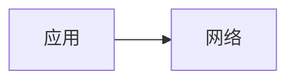

# 图表升级改造指南

## 📊 项目目标

将 NetworkMastery 的 84 个 Mermaid 图表升级为更高质量的可视化，采用：
- **Excalidraw 风格 SVG** 用于逻辑/架构图
- **vis-network** 用于交互式拓扑图
- **优化的 Mermaid** 用于流程/时序图

## 🏗️ 实施方案

### Phase 1: 基础设施准备 ✅

- [x] 安装依赖：excalidraw@0.6.4、vis-network@10.0.2
- [x] 创建 Vue 组件：ExcalidrawViewer.vue、VisNetworkViewer.vue
- [x] 注册全局组件
- [x] 优化 Mermaid 主题配置
- [x] 创建示例 SVG 架构图

### Phase 2: 关键文档改造计划

#### 2.1 SD-WAN 核心文档（优先级：⭐⭐⭐⭐⭐）

| 文档 | 当前图表数 | 改造方案 | 预期工作量 |
|------|-----------|--------|-----------|
| `sdwan/cases.md` | 3 | 拓扑 SVG + Mermaid 优化 | 1h |
| `sdwan/architecture.md` | 0 | 创建架构图 (SVG) | 1.5h |
| `sdwan/routing.md` | 0 | 创建路由决策图 (SVG) | 1h |
| `sdwan/security.md` | 0 | 创建安全框架图 (SVG) | 1h |
| `sdwan/concepts.md` | 0 | 创建概念对比图 (SVG) | 1h |

**小计**：5 个文档、预期 5.5 小时

#### 2.2 基础知识文档（优先级：⭐⭐⭐⭐）

| 文档 | 当前图表数 | 改造方案 | 说明 |
|------|-----------|--------|------|
| `basics/tcpip.md` | 17 | Mermaid 优化 + 3 个关键 SVG | TCP/IP 栈层次图 |
| `basics/osi.md` | 9 | Mermaid 优化 + 层次 SVG | OSI 七层模型 |
| `basics/routing.md` | 9 | Mermaid 优化 | 路由算法、BGP |
| `architecture/topology.md` | 6 | vis-network 交互 | 网络拓扑 |
| `architecture/backbone.md` | 1 | Mermaid 优化 | 骨干网设计 |

**小计**：5 个文档、42 个图表

#### 2.3 安全/高级文档（优先级：⭐⭐⭐）

| 文档 | 当前图表数 | 改造方案 |
|------|-----------|--------|
| `attacks/ddos.md` | 4 | Mermaid 优化 |
| `attacks/encryption.md` | 4 | Mermaid 优化 |
| `attacks/security-arch.md` | 3 | Mermaid 优化 |
| `security/ipsec.md` | 2 | Mermaid 优化 |
| `security/gre.md` | 6 | Mermaid 优化 |
| `advanced/bgp.md` | 3 | Mermaid 优化 |
| `advanced/mpls.md` | 3 | Mermaid 优化 |
| `qos/qos.md` | 4 | Mermaid 优化 |
| 其他 | 5+ | Mermaid 优化 |

**小计**：9+ 个文档

## 🛠️ 实施步骤

### Step 1: Mermaid 全局优化（当前完成 ✅）

更新 `config.mjs` 中的 Mermaid 主题变量，提升所有图表的视觉质量。

**效果**：
- 配色方案统一（绿蓝渐变主色）
- 圆角边框、更大字体
- 亮/暗模式自适应

### Step 2: 创建高质量 SVG 架构图

**目标**: 为每个 SD-WAN 子主题创建 1-2 个精美的 SVG 架构图

**示例**: `guide/sdwan/arch-diagram.svg` ✅

```html

```

**工具**: 
- Figma 或本地 SVG 编辑
- 或 Excalidraw 导出 SVG

### Step 3: 集成 vis-network 拓扑（可选）

对于需要交互的拓扑图，创建 Vue 组件：

```markdown
<VisNetworkViewer 
  :data="{
    nodes: [...],
    edges: [...]
  }" 
/>
```

### Step 4: 文档更新流程

对于每个需要改造的文档：

1. **分析当前图表** - 统计类型和数量
2. **制定改造方案** - Mermaid 优化 or SVG 替换
3. **创建新资源** - SVG/JSON 文件
4. **更新 Markdown** - 替换或补充图表
5. **本地测试** - `npm run dev` 验证渲染
6. **提交 Git** - 分离 commit，便于 review

## 📁 文件组织

```
docs/
├── guide/
│   ├── sdwan/
│   │   ├── arch-diagram.svg          ← 新增高质量图表
│   │   ├── topology-data.json        ← vis-network 数据
│   │   └── cases.md                  ← 引用上述文件
│   ├── basics/
│   │   ├── tcpip-stack.svg
│   │   ├── osi-layers.svg
│   │   └── tcpip.md
│   └── ...
└── .vitepress/
    └── theme/
        ├── components/
        │   ├── ExcalidrawViewer.vue  ✅
        │   ├── VisNetworkViewer.vue  ✅
        │   └── ...
        └── ...
```

## 🚀 快速开始（现在就试）

### 1. 启动开发服务器

```bash
cd ~/lightwan/project/NetworkMastery
npm run dev
```

### 2. 在 Markdown 中使用新组件

#### 使用 SVG 图表

```markdown
## SD-WAN 架构


上图展示了 SD-WAN 的三层分离设计...
```

#### 使用 vis-network（拓扑图）

```markdown
<VisNetworkViewer 
  :data="JSON.stringify({
    nodes: [
      { id: 'hq', label: '总部', color: '#10b981' },
      { id: 'b1', label: '分支1', color: '#3b82f6' },
    ],
    edges: [
      { from: 'hq', to: 'b1', label: 'IPSec' }
    ]
  })"
/>
```

#### 保留 Mermaid



## 📈 质量指标

### 当前状态
- 总图表数：84 个 Mermaid
- 覆盖文件：18 个
- 视觉质量：中等（默认主题）

### 目标状态（第一阶段）
- SD-WAN 相关：5 个文档、高质量 SVG + 优化 Mermaid
- 基础知识：5 个文档、混合方案
- 总体提升：视觉质量 ⭐⭐⭐⭐⭐

## 📋 检查清单

### 实施前
- [ ] 所有依赖已安装
- [ ] 组件已注册
- [ ] 配置已更新
- [ ] 本地能成功 `npm run dev`

### 文档更新
- [ ] 创建高质量 SVG
- [ ] 更新 Markdown 引用
- [ ] 本地测试渲染效果
- [ ] 检查亮/暗模式
- [ ] Git commit 提交

### 上线前
- [ ] 所有链接有效
- [ ] 图表正常渲染
- [ ] 加载性能可接受
- [ ] GitHub Actions 构建成功

## ⏰ 预期进度

| 阶段 | 内容 | 耗时 | 状态 |
|------|------|------|------|
| Phase 1 | 基础设施 | 1h | ✅ 完成 |
| Phase 2 | SD-WAN 文档改造 | 5.5h | 🔄 进行中 |
| Phase 3 | 基础知识改造 | 3-4h | ⏳ 待开始 |
| Phase 4 | 其他文档 | 2-3h | ⏳ 待开始 |
| Phase 5 | 测试 + 优化 | 1-2h | ⏳ 待开始 |

**总预期**: ~12-16 小时

## 📚 参考资源

- VitePress 官方文档：https://vitepress.dev
- Excalidraw 导出 SVG：https://excalidraw.com
- vis-network 文档：https://visjs.github.io/vis-network/
- Mermaid 主题配置：https://mermaid.js.org/ecosystem/integrations/vitepress.html

## 🎯 后续优化

1. **自动化图表转换** - 脚本将 Mermaid 转 SVG
2. **图表版本管理** - 单独的图表资源库
3. **交互增强** - 点击图表查看详细说明
4. **多语言支持** - 图表和文字本地化

---

**下一步**: 开始 Phase 2（SD-WAN 文档改造）
