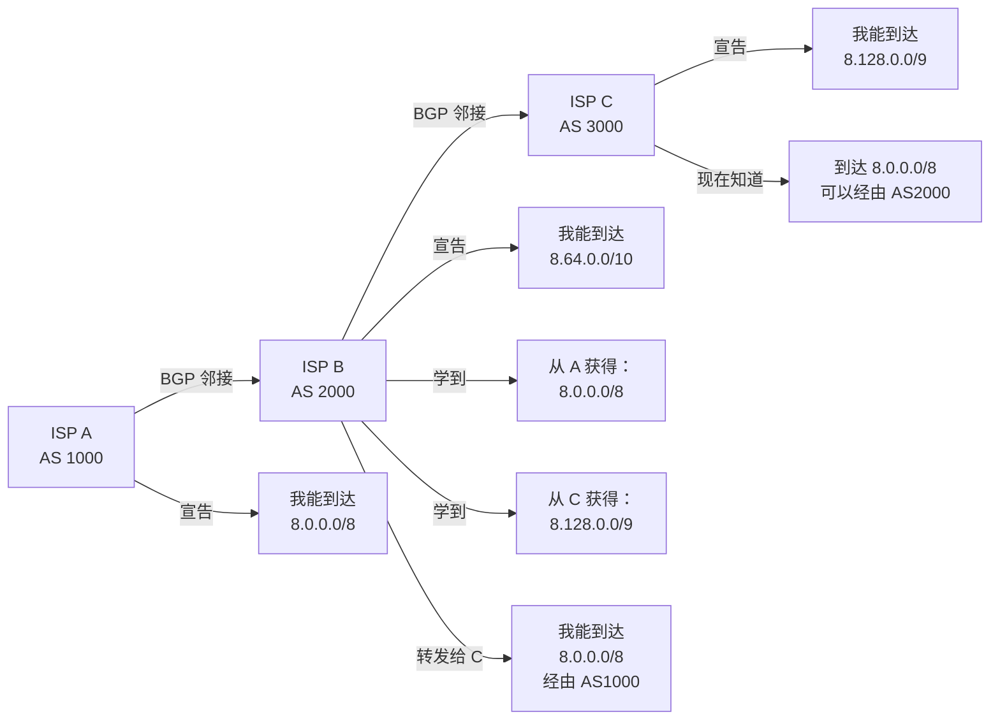
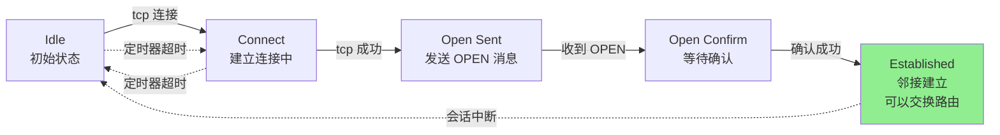
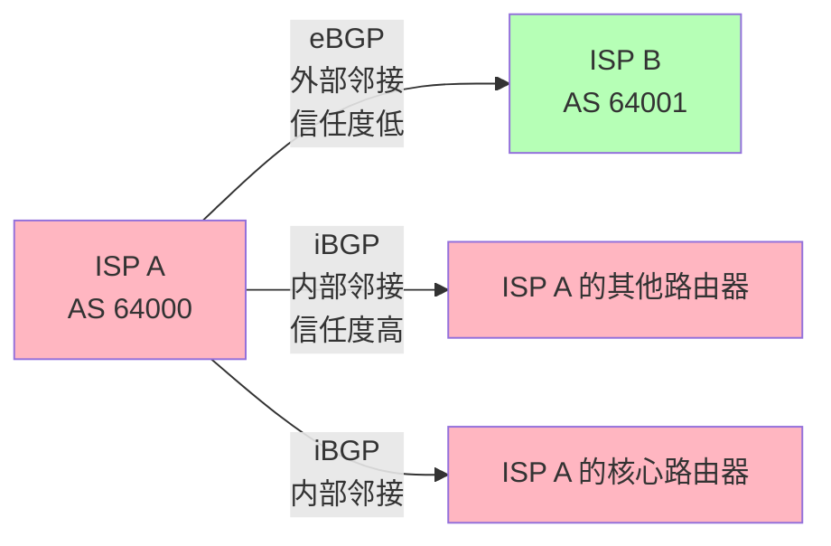

# BGP：互联网的神经系统

## 导言：为什么 BGP 宕机意味着互联网宕机？

2014 年 8 月，Indosat（印度尼西亚最大的 ISP 之一）犯了一个错误，向全球 BGP 路由器错误地宣告了大量 IP 段的所有权。

结果：

```
时间线：
T=0: Indosat 发送错误的 BGP 公告
     "我能到达 Google 的所有 IP（全球任播地址）"

T=5min: 全球大部分 ISP 相信了这个公告
        流量开始经由 Indosat 转向

T=20min: 流向 Indosat 的流量激增 1000 倍
         他们的网络被淹没
         所有数据包被丢弃

T=2hours: Indosat 的对等 ISP 开始撤销与他们的连接
          Indosat 完全与互联网隔离

T=4hours: Indosat 撤销错误公告，恢复连接

结果：东南亚地区 4 小时内无法访问 Google、Facebook、YouTube 等大型网站
```

**核心问题**：BGP 是基于**信任**的。没有人验证"Indosat 真的拥有这些 IP"。

---

## 第一部分：BGP 的本质

BGP（Border Gateway Protocol）是**自治系统（AS，Autonomous System）**之间的路由协议。

```
什么是 AS？
  独立的网络域，有自己的路由策略
  由统一的管理员控制
  例如：
    - ISP 的网络 = 1 个 AS
    - Google 的网络 = 1 个 AS
    - 大型企业的网络 = 1 个 AS

为什么需要 AS？
  否则，每个路由器都需要知道整个互联网的拓扑
  互联网有数百万个路由器，规模无法管理
  
AS 的好处：
  - 每个 AS 内部用 IGP（OSPF）管理
  - AS 之间用 BGP 交换可达性信息
  - 封装内部细节，只公开必要信息
```

### BGP 的工作原理



### BGP 状态机



**为什么 BGP 建立连接这么复杂？**

与 OSPF（直接 Flood LSA）不同，BGP 基于 TCP 连接。为什么？

```
BGP 的信息量很大：
  - 互联网上有约 800,000 个前缀（IP 段）
  - 每个前缀有多条路径信息
  - 总共约 3-5MB 的路由信息
  
TCP 提供：
  ✓ 可靠传输（确保路由信息完整）
  ✓ 有序传输（路由信息顺序重要）
  ✓ 流量控制（防止路由洪泛）
  
相比 OSPF 的 UDP Flood：
  ✗ 无法处理这么大的信息量
  ✗ 无法确保可靠性
```

---

## 第二部分：iBGP vs eBGP



### eBGP（外部 BGP）

```
eBGP = 不同 AS 之间的 BGP 邻接

特点：
  - 建立在 ISP 之间的物理链路上
  - Hop Count = 1（直接邻接）
  - 信息可能被修改（添加本 AS 号、改优先级等）

AS_PATH 的含义：
  当 ISP A 从 ISP B 学到一条路由时：
    原始：8.0.0.0/8（来自 AS 3000）
    ISP B 修改：AS_PATH = [2000, 3000]
    ISP A 收到：8.0.0.0/8 with AS_PATH [2000, 3000]
  
  ISP A 再转发给其他邻接时：
    ISP A 修改：AS_PATH = [1000, 2000, 3000]
  
  这样，全网都能看到这条路由的"历史"

作用：
  ✓ 防止路由环路（如果看到自己的 AS 号在路径上，就丢弃）
  ✓ 用于路由决策（AS_PATH 越短越优先）
```

### iBGP（内部 BGP）

```
iBGP = 同一 AS 内的路由器之间的 BGP

场景：
  大型 ISP 有多个 POP（Point of Presence，接入点）
  每个 POP 有多个边界路由器
  这些边界路由器需要交换学到的外部路由信息

Full Mesh 问题：
  如果 N 个 iBGP 路由器要全互连，需要 N*(N-1)/2 条连接
  例如：30 个路由器 = 435 条邻接
  
Route Reflector 解决方案：
  
  传统 Full Mesh：
    Router 1 ─┐
    Router 2 ─┼── 全互连（复杂度 O(n²)）
    Router 3 ─┘
  
  Route Reflector：
    Router 1 ──┐
    Router 2 ──┼── Route Reflector
    Router 3 ──┘
                   （Route Reflector 转发所有路由信息）
  
  优点：
    ✓ 邻接数量从 435 降到 30
    ✓ 配置简单
    ✓ 收敛快

iBGP 的重要性：
  如果某个边界路由器学到一条外部路由
  但没有告诉其他边界路由器
  这个路由的信息就丢失了
  所以 iBGP 关乎网络的可达性
```

---

## 第三部分：BGP 的 11 条路径选择规则

当有多条路由到达同一目标时，BGP 按顺序选择（从高到低）：

```
1. 优先级（Preference）— 手工配置
   默认：eBGP 路由优先级 20，iBGP 优先级 200
   
2. AS_PATH 长度 — 越短越好
   AS_PATH [1000] 优先于 [1000, 2000]
   
3. 来源类型 — IGP < EGP < Incomplete
   
4. MED（Multi-Exit Discriminator）— 越低越好
   用于告诉对端 ISP "从这个出口进入我的网络最优"
   
5. 邻接类型 — eBGP 优先于 iBGP
   
6. 本地优先级 — 告诉内部路由器 "这条路由的优先级"
   
7. 从本地生成的路由
   
8. 来自邻接的距离 — 越近越好
   
9-11. 其他复杂规则（很少使用）

实际中的配置示例：

  ISP A 有两条与 ISP B 的连接（负载均衡）：
  
    路线 1：ISP A 边界路由器 1 → ISP B
    路线 2：ISP A 边界路由器 2 → ISP B
  
  ISP B 希望流量从路线 1 进入（比如路线 1 带宽大）：
  
    ISP B 发送广告时：
      路线 1 MED = 100（低，优先）
      路线 2 MED = 200（高，备用）
  
    ISP A 收到后：
      选择 MED 较低的路线 1 作为入向流量
```

---

## 第四部分：真实的 BGP 故障

### 故障 1：子前缀劫持

```
场景：
  Google 所有者的 AS 是 15169
  Google 宣告：8.8.0.0/16（拥有 65,536 个 IP）

  某恶意 ISP 或路由劫持者：
  宣告：8.8.8.0/24（拥有 256 个 IP，是 8.8.0.0/16 的子集）

结果：
  BGP 选择最长前缀匹配！
  8.8.8.0/24 比 8.8.0.0/16 更长
  所以流向 8.8.8.0/24 的所有流量都被劫持到恶意 ISP

真实发生过：
  2014 年，Indosat 宣告了 Google 的子前缀
  导致东南亚的 Google 服务受影响

防护：
  RPKI 签名验证
  但全球仅 30% 的 ISP 支持...
```

### 故障 2：路由闪烁（Route Flap）

```
场景：
  某 ISP 的边界链路质量差
  链路时好时坏
  每秒钟连接和断开几次

结果：
  每断开一次，BGP 会发送撤销公告（Withdraw）
  每连上一次，BGP 会发送新公告（Update）
  每次更新都会触发全网路由器的 SPF 计算

表现：
  网络抖动
  用户看到间歇性无法访问
  CPU 飙升（所有路由器都在计算）

解决：
  ✓ 启用 BGP Dampening（抑制）
    多次闪烁的路由被临时抑制
  ✓ 改善链路质量
  ✓ 增加 BGP 定时器参数
```

---

## 第五部分：BGP 安全和未来

### 当前的安全漏洞

```
BGP 设计于 1989 年，那时互联网很小，大家都"彼此信任"

现在的问题：
  1. 任何人都可以宣告任何 IP（如果拥有 AS 号）
  2. BGP 消息没有加密（可以被中间人篡改）
  3. 没有身份验证（ISP A 无法验证声称来自 ISP B 的公告）

历史上的大事故：
  - 2008: YouTube 在巴基斯坦离线（Pakistan Telecom 劫持）
  - 2014: Google 在东南亚离线（Indosat 错误公告）
  - 2020: Facebook 全球离线 7 小时（内部 BGP 配置错误）

其中 Facebook 的事故：
  Facebook 工程师修改了一个 BGP 配置参数
  意思是"停止宣告所有路由"
  Facebook 的 IP 从全球互联网消失
  ISP 无法连接，用户无法访问
  内部员工也无法访问数据中心（需要 VPN，但 VPN 需要连接 Facebook...）
```

### RPKI 和 BGP 安全的未来

```
RPKI（Resource Public Key Infrastructure）：
  
原理：
  1. IP 地址的所有者（IANA、RIR）对 IP 段签名
  2. ISP 从权威证书链验证公告的真实性
  3. 接收虚假公告（无有效签名）时拒绝

部署状态：
  ✓ 已部署：Google、Amazon、Cloudflare、Facebook
  ✗ 未部署：部分老旧 ISP，某些国家的 ISP
  
  全球覆盖率：约 35-40%（2023 年数据）

BGP Sec（BGP 安全扩展）：
  为每个 BGP 公告添加加密签名
  确保整条 AS_PATH 都被验证

预期：
  未来 3-5 年，RPKI 会覆盖全球大多数 ISP
  BGP 劫持会变得困难（虽然不是不可能）
```

---

## 总结

BGP 是互联网的"神经系统"，但同时也是最脆弱的环节：

1. **无中央控制**：没有人能"审核"所有 BGP 公告
2. **基于信任**：假设 ISP 不会故意发布虚假信息（显然是错的）
3. **影响全球**：一个错误的公告可能让数百万用户离线
4. **难以恢复**：错误公告的撤销需要时间传播，恢复缓慢

**关键点**：

- BGP 是 ISP 之间的协议，不是端用户关心的
- 但它决定了互联网的可达性和性能
- 没有 RPKI，互联网的可靠性依赖于"大家都很老实"
- 一旦 ISP 不老实（出于恶意或疏忽），后果严重

---

## 推荐阅读

- [MPLS 和流量工程](mpls.md)
- [SD-WAN 概念](../sdwan/concepts.md)