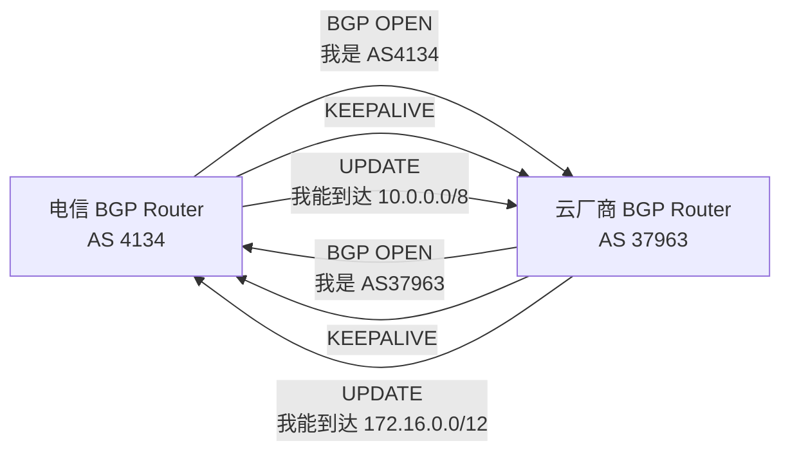

# BGP 深度解析：互联网的血液

## 导言

如果说 IP 路由是网络的"骨架"，那么 ==BGP（边界网关协议）==就是互联网的"血液循环系统"。

全球有超过 800,000 个自治系统（Autonomous System）在运行 BGP，每一秒都在交换路由信息，确保你的数据包能找到到达目的地的最佳路径。

这一章会揭示 BGP 的工作原理、为什么它如此关键，以及在企业网络中如何应用 BGP。

---

## 第一部分：BGP 基础概念

### 什么是 AS（自治系统）？

```
自治系统 = 在单一技术管理下的一组路由器

示例：
  ├─ 中国电信的网络 = 1 个 AS（AS Number 4134）
  ├─ 中国联通的网络 = 1 个 AS（AS Number 9808）
  ├─ 阿里云的网络 = 1 个 AS（AS Number 37963）
  └─ 小企业的专线 = 通常也会分配 1 个 AS

全球 AS 总数：超过 70,000 个（每个都是独立的网络岛屿）
```

### BGP 的核心问题

```
问题：数据包如何从 AS A 路由到 AS Z？
      在中间可能经过 10+ 个其他 AS

答案：
  ├─ 每个 AS 在 BGP 中宣告：我能到达这些 IP 段
  ├─ 路由器学习所有 AS 的宣告
  ├─ 根据策略选择最优路径
  └─ 依赖 BGP 持续交互来维护这个大网络

没有 BGP，互联网会分裂成孤岛。
```

### BGP vs IGP（内部路由协议）

| 特征 | IGP (OSPF, ISIS) | BGP |
|------|-----------------|-----|
| **作用域** | AS 内部 | AS 之间 |
| **收敛速度** | 快（秒级） | 慢（分钟级） |
| **可扩展性** | 数百个路由器 | 数万个 AS |
| **策略控制** | 简单（距离优先） | 复杂（基于策略） |
| **应用场景** | 企业内网 | 互联网骨干 |

---

## 第二部分：BGP 的工作机制

### BGP 邻接建立（Peering）



**三次握手（简化版）**：
1. BGP OPEN：双方交换 AS Number、Router ID 等基本信息
2. 验证：确认对方 AS 是否在允许列表
3. KEEPALIVE：定期交互保活（默认 3 秒）

### BGP 路由宣告（Announcement）

```
场景：阿里云想告诉全世界，它能到达 8.129.0.0/16

宣告内容（UPDATE 消息）：
  └─ NLRI（Network Layer Reachability Information）
     ├─ 前缀（Prefix）：8.129.0.0/16
     ├─ 长度（Prefix Length）：16
     └─ 路径属性（Path Attributes）：
        ├─ AS_PATH：[AS1, AS2, ..., AS37963]（从谁手里学到的）
        ├─ NEXT_HOP：203.0.113.1（下一跳 IP）
        ├─ LOCAL_PREF：100（本地优先级，越大越优）
        ├─ MED：50（多出口判据，越小越优）
        └─ ORIGIN：IGP/EGP/INCOMPLETE（来源类型）
```

### 路径选择：BGP 的"聪明之处"

```
场景：电信的 Router 可以通过 3 条路径到达同一个目标网络

宣告 1：AS_PATH=[AS37963]，LOCAL_PREF=100，MED=10
宣告 2：AS_PATH=[AS45678, AS37963]，LOCAL_PREF=100，MED=5
宣告 3：AS_PATH=[AS12345, AS67890, AS37963]，LOCAL_PREF=100

BGP 选择过程：
  Step 1: 优先级（LOCAL_PREF）
    ├─ 宣告 1 和 2：都是 100
    ├─ 宣告 3：...（通常会设置较低优先级以避免冗长路径）
    └─ → 保留宣告 1 和 2
    
  Step 2: MED（Multi-Exit Discriminator）
    ├─ 宣告 1：MED=10
    ├─ 宣告 2：MED=5 ← 选中！
    └─ → MED 越小越优
    
  Step 3: AS PATH 长度
    └─ 如果前面都相同，更短的路径优先
    
  Step 4: 其他因素
    └─ Router ID、NEXT_HOP、算法优化等

最终结果：选择宣告 2，数据包通过 AS45678 转发到 AS37963
```

---

## 第三部分：BGP 在企业网络中的应用

### 应用 1：多 ISP 接入

```
企业场景：有两条互联网线路（电信和联通），需要智能分流

网络拓扑：
  └─ 企业 AS（私有 AS，比如 65123）
     ├─ 链路 1：到电信 AS4134
     └─ 链路 2：到联通 AS9808

配置：
  1. 企业向电信宣告：我能到达企业的所有 IP
  2. 企业向联通宣告：我能到达企业的所有 IP
  3. 电信和联通分别向全球宣告：通过他们可以到达该企业
  
流量来向选择：
  ├─ 电信用户 → 通过电信线路
  ├─ 联通用户 → 通过联通线路
  └─ 其他用户 → 根据 BGP 选择（通常选择较优路径）

成本效益：
  ✓ 充分利用两条线路
  ✓ 某条线路故障时，自动切到另一条
  ✓ 不需要复杂的 DNS 或 LB 配置
```

### 应用 2：容灾与故障转移

```
场景：企业有两个数据中心（DC1 和 DC2），需要快速故障转移

DC1 宣告：8.129.0.0/16, AS_PATH=[65123]
DC2 宣告：8.129.0.0/16, AS_PATH=[65123, 65123]

含义：
  ├─ DC1：直接宣告（最优）
  ├─ DC2：通过增加自己的 AS（较差）

如果 DC1 故障：
  ├─ DC1 停止宣告 8.129.0.0/16
  ├─ 全球只能通过 DC2 到达
  ├─ BGP 自动收敛（几秒内）
  └─ 流量自动漂移到 DC2

相比传统的 DNS 故障转移（需要 TTL 过期、DNS 更新等），BGP 更快、更可靠。
```

### 应用 3：Anycast 网络

```
Anycast = 同一个 IP 被多个地点宣告

Google 的 DNS 服务：8.8.8.8
  ├─ 在全球 150+ 个位置都宣告 8.8.8.8
  ├─ 用户请求自动路由到距离最近的位置
  └─ 无需用户指定，DNS 查询自动获得最优体验

对比 Unicast：
  Unicast：同一 IP 只在一个地点
    └─ DNS 查询 8.8.8.8 → 回源到最近的数据中心
    
  Anycast：同一 IP 在多个地点
    └─ 用户请求 8.8.8.8 → 自动路由到距离最近的 Google 节点
    └─ 优点：延迟更低，DDoS 攻击分散
```

---

## 第四部分：BGP 的常见问题

### 问题 1：BGP 黑洞（Black Hole）

```
症状：访问某个网站，连接直接超时，但 ping 通

原因：
  ISP 错误配置 BGP，导致宣告的 IP 段无法实际到达

示例：
  阿里云错误宣告：8.129.0.0/16 可以到达
  但实际上没有配置转发规则
  → 数据包到达 ISP 路由器后被丢弃

症状表现：
  └─ 客户端超时（因为即使收到数据也转发不到企业）
  └─ Ping 通（因为只是 ICMP Echo，可能走了其他路径）

排查方法：
  $ traceroute destination.com
  $ mtr destination.com -c 100
  └─ 看是否某一跳后数据包消失

解决：通知 ISP 检查 BGP 配置和转发规则一致性
```

### 问题 2：BGP 分裂脑（BGP Split Brain）

```
症状：用户反映网络偶尔卡顿，监控看不出问题

原因：两个 BGP 路由器没有保持同步

场景：企业有两个出口路由器
  路由器 A 向 ISP 宣告：8.129.0.0/16, LOCAL_PREF=100
  路由器 B 向 ISP 宣告：8.129.0.0/16, LOCAL_PREF=100
  
  但路由器 A 和 B 之间的内网链路断开了
  
问题：
  ├─ 进来的流量可能走 A，但出去无法通过 A 转发（因为 A 和 B 断开）
  ├─ 导致非对称路由、数据包丢失、连接重置
  └─ 只有在特定时间段（某些流量走 A）才出现问题

解决：
  ├─ 启用 BFD（双向转发检测）：快速检测链路故障
  ├─ 配置健康检查：检测到内网链路故障时，停止宣告
  └─ 监控 BGP 邻接状态和同步状态
```

### 问题 3：BGP Dampening 导致的路由抖动隐藏

```
BGP Dampening：如果某个路由器经常上下线（flapping），
             BGP 会暂时忽略它的宣告，以减少全网波动

症状：
  ISP 或云厂商的某个网段间歇性无法访问，
  但他们的 BGP 邻接看起来正常

原因：
  该路由器配置了过于激进的 Dampening，
  导致频繁上下线的宣告被压制

解决：
  └─ 检查 BGP Dampening 参数配置，可能需要调整阈值
```

---

## 第五部分：BGP 故障排查

### 诊断命令

```bash
# 查看 BGP 邻接状态
show ip bgp summary
  └─ 显示所有 BGP neighbor 的状态
  └─ State 应该是 Established

# 查看宣告的路由
show ip bgp
  └─ 显示本地学到的所有路由
  └─ 第一列表示路由状态（> 表示最优选择的路由）

# 查看特定前缀的宣告路径
show ip bgp 8.129.0.0/16
  └─ 显示该前缀的来源、路径、属性

# 实时监看 BGP 更新（新宣告）
debug ip bgp updates
  └─ 显示收到的 UPDATE 消息
  └─ 谨慎在生产使用（会产生大量日志）

# 清空 BGP 缓存并重新同步
clear ip bgp *
  └─ 强制所有 BGP 邻接重新建立
  └─ 会导致短暂的路由波动
```

### 实战案例：BGP 路由泄露事件

```
2008 年 YouTube 事件（真实历史）：

时间：2月 24 日下午
现象：全球用户无法访问 YouTube（youtube.com）

原因分析：
  1. YouTube 的 IP 段：8.8.0.0/12（被 Google 宣告）
  2. Pakistan ISP（PTCL）错误地宣告了整个 8.0.0.0/8
  3. 全球 BGP 路由器收到：
     ├─ Google：8.8.0.0/12 (AS_PATH=[AS15169])
     └─ Pakistan：8.0.0.0/8 (AS_PATH=[AS17069])
  4. BGP 选择：8.0.0.0/8 更特指（更长的前缀），反而被选中
  5. 结果：全球流量被路由到 Pakistan ISP（他们没有 YouTube，所以黑洞）

恢复过程：
  1. Google 检测到 YouTube 不可达，通知 ISP
  2. Pakistan ISP 停止宣告 8.0.0.0/8
  3. BGP 网络重新收敛（10-20 分钟）
  4. YouTube 恢复访问

教训：
  ├─ BGP 没有天然的"防错"机制
  ├─ ISP 需要严格的出站 filter（过滤不该自己宣告的 IP）
  ├─ 需要 RPKI 等机制验证宣告的合法性
  └─ 今天 RPKI 已成为行业标准，此类事件大幅减少
```

---

## 企业级最佳实践

1. **宣告过滤**：只宣告自己真实拥有的 IP 段
2. **接收过滤**：只接收来自已授权 ISP 的路由
3. **社区标签**：用 BGP Community 标记路由属性，便于管理
4. **AS 路径过滤**：拒绝包含不合理路径的路由（比如包含私有 AS）
5. **RPKI 验证**：验证宣告的合法性（需要 ISP 支持）
6. **监控与告警**：监控 BGP 邻接状态、路由变化、黑洞等

---

## 推荐阅读

- [IP 寻址与路由](/guide/basics/routing)
- [网络拓扑详解](/guide/architecture/topology)
- [网络监控与可观测性](/guide/ops/monitoring)
- 返回目录：[首页](/)
