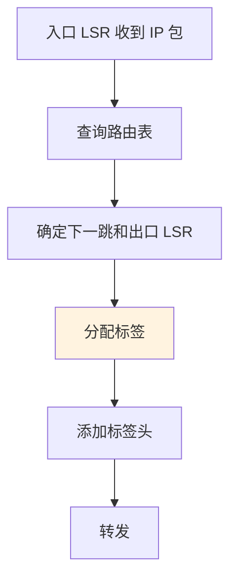
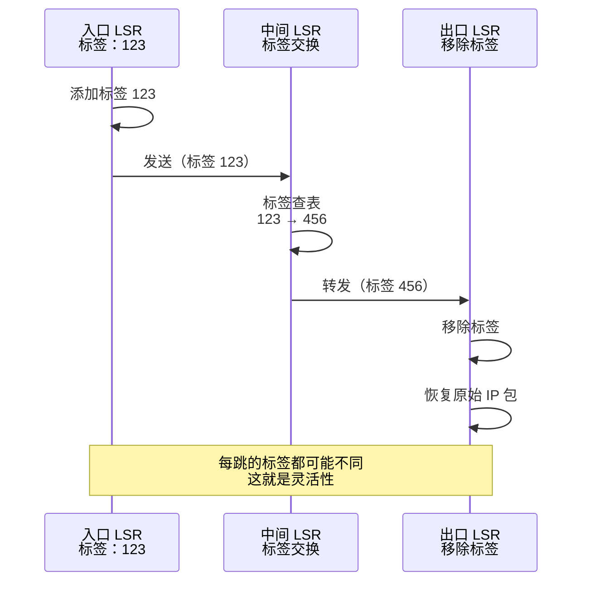

# MPLS 多协议标签交换：运营商级的路由艺术

## 导言

MPLS（Multiprotocol Label Switching）是运营商和大型企业网络的秘密武器。它让路由变得更快、更灵活、更可控。

理解 MPLS 对理解 VPN、流量工程和现代网络架构至关重要。

---

## MPLS 的核心思想

### 传统 IP 路由的问题

```
每个路由器都要：
1. 查看目标 IP
2. 查路由表
3. 找到下一跳
4. 转发数据包

结果：
✗ 每跳都要做一遍（CPU 开销大）
✗ 无法灵活控制路由路径
✗ 难以实现 QoS
```

### MPLS 的解决方案

```
入口路由器：
1. 查看第一个包的目标 IP（只做一次）
2. 添加标签（Label）— 一个简单的数字
3. 所有后续路由器：只看标签，不看 IP
4. 基于标签转发

结果：
✓ 路由快速（标签查询比 IP 路由快）
✓ 灵活控制（可制定任意路径）
✓ 支持 QoS（基于标签的 QoS）
```

### 标签的概念

```
┌──────────────────────────┐
│ IP 包头                  │
├──────────────────────────┤
│ 标签（Label）：123       │
│ (一个 20 位的数字)       │
├──────────────────────────┤
│ 原始数据                 │
└──────────────────────────┘

标签的作用：
123 = "去分支上海，走高质量链路，保证延迟"
```

---

## MPLS 的工作流程

### 标签分配



### 标签转发



---

## MPLS 标签栈

### 什么是标签栈？

一个包可以有**多层标签**：

```
IPv6 包头
    ↓
顶层标签（Outer Label）— VPN 标签
    ↓
次层标签（Inner Label）— 传输标签
    ↓
原始数据

作用：
- 顶层标签：指向目标 VPN
- 次层标签：指向具体的转发路径
```

### 标签栈的可视化

```
MPLS 标签栈示意：

┌────────────────────────────┐
│ 标签 1：100                │  VPN 标签
│ S=0（表示下面还有标签）   │
├────────────────────────────┤
│ 标签 2：456                │  转发标签
│ S=1（表示这是最后一个）   │
├────────────────────────────┤
│ IPv4 包头 + 数据           │
└────────────────────────────┘

LSR 的处理：
1. 看标签 1，转发到下一个 LSR
2. 该 LSR 弹出标签 1，看标签 2
3. 最后的 LSR 弹出标签 2，转发 IP 包
```

---

## MPLS 的关键概念

### LSR（Label Switch Router）— 标签交换路由器

```
MPLS 网络中的设备都是 LSR：

入口 LSR（Ingress LSR）
├─ 第一次看 IP 地址
├─ 分配标签
└─ 进入 MPLS 域

中间 LSR（Transit LSR）
├─ 只看标签
├─ 交换标签
└─ 转发

出口 LSR（Egress LSR）
├─ 弹出标签
├─ 恢复 IP 包
└─ 转发出 MPLS 域
```

### FEC（转发等价类）

**概念**：一组有相同转发路径的包。

```
FEC 示例：
- 所有去往 10.0.0.0/24 的包 → FEC-1
- 所有来自 VPN-A 的包 → FEC-2
- 所有需要高 QoS 的视频流 → FEC-3

每个 FEC 分配一个标签：
- FEC-1 → 标签 100
- FEC-2 → 标签 200
- FEC-3 → 标签 300

相同 FEC 的包使用相同的标签，因此会走相同的路径
```

### LSP（标签转发路径）

```
LSP 是从入口 LSR 到出口 LSR 的路径：

入口 LSR ─→ LSR-2 ─→ LSR-3 ─→ 出口 LSR
   标签 100   标签 200   标签 300

这条 LSP 由管理员或 RSVP-TE 动态创建
可以指定带宽、优先级等约束
```

---

## MPLS 在 VPN 中的应用（MPLS L3 VPN）

### 场景：多个客户共享一个运营商网络

```
客户 A          运营商网络          客户 B
┌────────┐     ┌──────────────┐    ┌────────┐
│ 内网   │────→│ MPLS         │←───│ 内网   │
│10.0/24 │     │ 虚拟 VPN     │    │ 10.0/24│
└────────┘     └──────────────┘    └────────┘

实现：
1. 入口 PE（Provider Edge）路由器
   - 查看客户 A 的包
   - 添加 VPN 标签（如 100 = "客户 A"）
   
2. 运营商网络
   - 只基于标签转发
   - 不知道包的真实内容
   
3. 出口 PE 路由器
   - 根据 VPN 标签识别客户
   - 转发到客户 B
   - 移除标签，恢复原始数据
```

### MPLS VPN 的优势

```
┌─────────────────────────────────────┐
│ MPLS VPN 的优势                     │
├─────────────────────────────────────┤
│ ✓ 安全隔离（标签隔离，不同 VPN 无法互通）|
│ ✓ 高性能（标签转发速度快）          │
│ ✓ 灵活性（支持多种网络拓扑）        │
│ ✓ 可伸缩性（支持数千个 VPN）        │
│ ✓ QoS 支持（基于标签的 QoS）        │
└─────────────────────────────────────┘
```

---

## MPLS 流量工程（Traffic Engineering）

### 传统路由的问题

```
问题：
链接 A：100 Mbps，当前占用 99 Mbps（满）
链接 B：100 Mbps，当前占用 10 Mbps（闲）

新的 50 Mbps 流量到来：
- 传统 IP 路由：必须用链接 A（根据路由表）
- 结果：丢包、延迟（链接过载）
```

### MPLS TE 的解决方案

```
MPLS TE 可以：
1. 监测所有链路的可用容量
2. 动态创建 LSP
3. 让新的 50 Mbps 流量走链接 B
4. 结果：充分利用网络，避免拥塞

配置示例：
创建 LSP：
- 源：北京   目标：上海
- 带宽：50 Mbps
- 优先级：中
- 约束：避免走链接 A（当前容量不足）
→ 系统自动选择路径：北京 → 郑州 → 上海
```

---

## MPLS 的优缺点

### 优点 ✅

```
┌──────────────────────────────────┐
│ MPLS 的优点                      │
├──────────────────────────────────┤
│ ✓ 路由快速（标签查询快）        │
│ ✓ 路由灵活（无需改 IP 配置）    │
│ ✓ QoS 支持（基于标签的 QoS）    │
│ ✓ VPN 支持（安全隔离）          │
│ ✓ 流量工程（精细控制路由）      │
│ ✓ 协议独立（支持 IPv4/IPv6）    │
└──────────────────────────────────┘
```

### 缺点 ❌

```
┌──────────────────────────────────┐
│ MPLS 的缺点                      │
├──────────────────────────────────┤
│ ✗ 配置复杂                      │
│ ✗ 学习曲线陡（概念多）          │
│ ✗ 需要专业运维人员              │
│ ✗ 故障排查困难                  │
│ ✗ 成本高（专业硬件）            │
│ ✗ 互联网不支持（运营商网络用）  │
└──────────────────────────────────┘
```

---

## MPLS vs SD-WAN

### 对比

```
┌──────────────────────────────────────────────┐
│ MPLS vs SD-WAN                               │
├────────────┬──────────────┬─────────────────┤
│ 特性       │ MPLS         │ SD-WAN          │
├────────────┼──────────────┼─────────────────┤
│ 成本       │ 贵（专线）   │ 便宜（宽带）   │
│ 灵活性     │ 中           │ 高              │
│ 部署速度   │ 慢（运营商） │ 快              │
│ 性能       │ 稳定         │ 需优化          │
│ 云支持     │ 弱           │ 强              │
│ 管理       │ 复杂         │ 集中化          │
└────────────┴──────────────┴─────────────────┘
```

### 趋势

```
MPLS 的未来：
- 企业网络：被 SD-WAN 替代
- 运营商网络：继续是核心
- 融合：MPLS + SD-WAN（运营商级 SD-WAN）
```

---

## 总结

**MPLS 是什么**：
- 基于标签的转发机制
- 比 IP 路由更快、更灵活

**MPLS 怎么工作**：
- 入口 LSR 添加标签
- 中间 LSR 交换标签
- 出口 LSR 移除标签

**MPLS 的应用**：
- VPN（MPLS L3 VPN）
- 流量工程（精细控制）
- 运营商网络的骨干

**现在的地位**：
- 运营商网络：仍然主流
- 企业网络：被 SD-WAN 替代
- 学习价值：理解网络演进

---

## 推荐阅读

- 上一章：[GRE 和网络隧道](/guide/security/gre)
- 下一章：[网络拓扑详解](/guide/architecture/topology)
