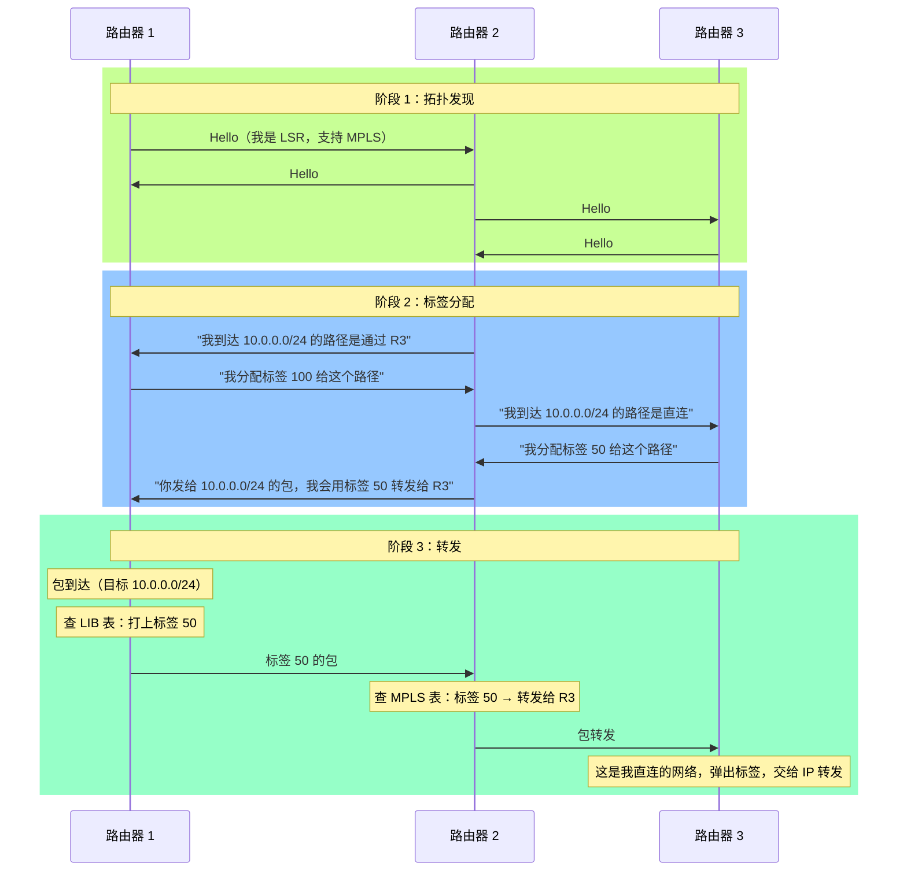
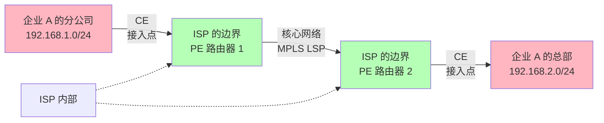
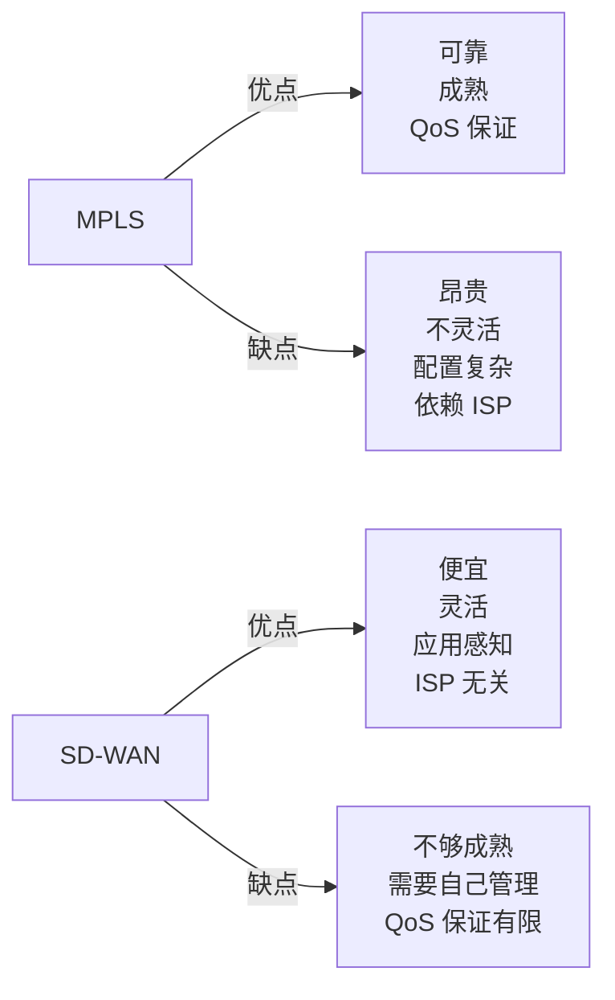

---
title: MPLS：标签交换与流量工程
description: MPLS 标签转发、LSP、与 IP 路由的区别，以及 VPN 与流量工程应用场景。
---

# MPLS：标签交换与流量工程

## 导言：为什么要给数据包贴标签？

IP 路由很"民主"——每个包都被单独评判，按目标 IP 查表转发。

MPLS 很"专制"——特定的包被分配一个标签，沿着预定义的路径走，不需要每跳都查表。

**为什么这种"专制"反而更优？** 因为它让我们可以：

1. **优化性能**：预先规划流量路径，避免拥塞
2. **实现隧道**：在 ISP 网络内部建立虚拟连接
3. **支持 VPN**：在公网上提供私网体验
4. **进行流量工程**：精细控制流量如何分布

---

## 第一部分：MPLS 的本质

### 从 IP 查表到标签转发

```
IP 路由（跳跃式）：
  路由器 1 收到包 → 查路由表 → 转发到路由器 2
  路由器 2 收到包 → 查路由表 → 转发到路由器 3
  路由器 3 收到包 → 查路由表 → 转发到目标

问题：
  - 每跳都要查表（CPU 开销）
  - 无法提前规划路径（只能贪心地选择最短路径）
  - 无法进行复杂的流量工程

MPLS 标签转发：
  标签分配阶段：
    "从 ISP A 到 ISP C 的所有流量"
     → 分配标签 100
     → 规划路径：边界路由器 1 → 核心 1 → 核心 2 → 边界路由器 2
  
  转发阶段：
    边界路由器 1：看到标签 100 → 转发到核心 1
    核心 1：看到标签 100 → 查 MPLS 表 → 转发到核心 2（改标签为 200）
    核心 2：看到标签 200 → 查 MPLS 表 → 转发到边界 2
    边界路由器 2：弹出标签 → 根据 IP 转发（或弹出 VPN 标签）

优势：
  [v] 核心路由器不需要知道每个目标 IP（只看标签）
  [v] 路径由 LSP（标签交换路径）规定，不会偏离
  [v] 支持复杂的流量工程
```

### MPLS 标签的结构

```
MPLS 报头（在第 2 层报头之后，IP 报头之前）：

┌─────────────────────────────────┐
│ 标签（20 位）                   │ 标识流量
├─────────────────────────────────┤
│ TC/EXP（3 位）                  │ 优先级
├─────────────────────────────────┤
│ S（1 位）                       │ 栈底标志（用于标签栈）
├─────────────────────────────────┤
│ TTL（8 位）                     │ 生存时间
└─────────────────────────────────┘

标签范围：
  0-15：保留标签（系统用）
  16-1048575：用户标签

例如 MPLS 标签 100：
  用于标识某一 LSP
  每个 LSP 的标签在每个路由器上可能不同
```

---

## 第二部分：LDP（标签分发协议）

标签怎么分配的？答案是 LDP（Label Distribution Protocol）。



---

## 第三部分：MPLS VPN（L3VPN）

MPLS VPN 是用 MPLS 在公网上构建私网的方案。



**关键概念**：

```
VPN 标签栈（Label Stack）：

当企业 A 的分公司发送包给总部时：

    原始包：
    源 IP：192.168.1.100
    目标 IP：192.168.2.100
    
    ↓（进入 ISP 边界）
    
    添加两层标签：
    [标签 1000][标签 2000] [IP 包]
    
    标签 1000 = VPN 标签
    标签 2000 = LSP 标签（用于在核心网络转发）
    
    核心路由器看到：
    [标签 2000][IP 包]
    只关心标签 2000，不知道这是什么 VPN 的流量
    
    离开 ISP（PE 路由器）时：
    弹出标签 2000
    根据标签 1000 转发到企业 A 的总部
    弹出标签 1000
    交给 IP 转发

好处：
  [v] ISP 核心路由器不知道 VPN 的存在
  [v] 多个 VPN 共享同一条 LSP
  [v] VPN 用户的私网 IP 不会泄露到 ISP 核心
```

---

## 第四部分：MPLS TE（流量工程）

MPLS 最强大的特性是**流量工程**（Traffic Engineering）。

### 为什么需要流量工程？

```
场景：某 ISP 有两条核心链路，都是 10Gbps

    总部 ──── 10Gbps ──── 分公司 1
     │                        │
     └─ 1Gbps ─────┬───── 分公司 2
                   │
              分支机构 3

流量需求：
  总部 → 分公司 1：8Gbps（几乎达到链路极限）
  总部 → 分公司 2：7Gbps
  
问题：
  正常的 OSPF 路由会说：
    "总部 → 分公司 2 的最短路径是经由 分公司 1"
    所以所有 7Gbps 都会经由 10Gbps 链路
    
  结果：8Gbps + 7Gbps = 15Gbps > 10Gbps 的容量
  拥塞！丢包！

MPLS TE 的解决方案：
  管理员手工配置一条 LSP：
    "总部 → 分公司 2 的流量，走长路线（经由 1Gbps 链路）"
    
  即使 OSPF 认为这不是最优路径，MPLS TE 也会强制这样做
  
  结果：8Gbps 走 10Gbps 链路，7Gbps 走 1Gbps 链路
  网络平衡，无拥塞
```

### MPLS TE 的约束条件

```
管理员可以指定 LSP 必须满足的条件：

1. 带宽约束
   "这个 LSP 需要 5Gbps 的保证带宽"
   → 系统自动选择能提供 5Gbps 的路径

2. 延迟约束
   "这个 LSP 的延迟不能超过 50ms"
   → 避免长路径

3. 多协议支持
   "这个 LSP 可以使用任何能连接的链路"
   → 包括原来不支持的链路类型

好处：
  [v] 网络利用率最大化（避免某条链路空闲而另一条拥塞）
  [v] 服务质量保证（关键应用得到专属资源）
  [v] 自动故障转移（备用 LSP）
```

---

## 第五部分：MPLS vs SD-WAN



### 经济账

```
MPLS 专线：
  每条链路 10Mbps：$2000/月
  需要主干道 + 备份 = 2 条链路
  30 个分支机构 = 30 × 2 × $2000 = $120,000/月

SD-WAN + 公网宽带：
  主链路：10Mbps 宽带 $200/月
  备链路：50Mbps 宽带 $400/月
  30 个分支机构 = 30 × ($200 + $400) = $18,000/月
  
  SD-WAN 控制器（云端）：$5,000/月
  
  总成本 = $18,000 + $5,000 = $23,000/月

成本对比：
  MPLS: $120,000/月
  SD-WAN: $23,000/月
  
  节省：80%！

但要考虑：
  MPLS 有更好的 QoS 保证
  SD-WAN 需要更多的运维工作
  大型企业倾向于混合：MPLS 用于关键链路，SD-WAN 用于非关键链路
```

### 迁移策略

```
企业从 MPLS 迁移到 SD-WAN 的步骤：

1. 试点阶段（3 个月）
   选择非关键的 5 个分支机构
   在 SD-WAN 上运行 6 个月
   测试稳定性和性能

2. 分步迁移（6-12 个月）
   非关键应用：完全迁移到 SD-WAN
   关键应用：保留 MPLS 或增加 SD-WAN 备链路

3. 完全迁移（12+ 个月）
   逐步关闭 MPLS 链路
   最后保留 1-2 条 MPLS 用于灾备

关键风险：
  - 迁移前充分测试 QoS
  - 确保备份链路的可用性
  - 建立详细的灾难恢复计划
```

---

## 总结

MPLS 是网络工程的强大工具，但也很复杂：

1. **标签交换**：比查表转发更快，路径可控
2. **VPN 隧道**：在公网上构建私网，ISP 核心无感知
3. **流量工程**：手工规划流量路径，优化网络利用率
4. **向后兼容**：MPLS 可以与 IP、BGP、OSPF 共存

**未来趋势**：

- MPLS 不会消失，但会被 SD-WAN 取代部分角色
- SD-WAN over MPLS = 最佳实践（既有 SD-WAN 的灵活性，又有 MPLS 的可靠性）
- Segment Routing（简化的 MPLS）可能成为新方向

---

## 推荐阅读

- [BGP 协议](bgp.md)
- [SD-WAN 概念和架构](../sdwan/concepts.md)