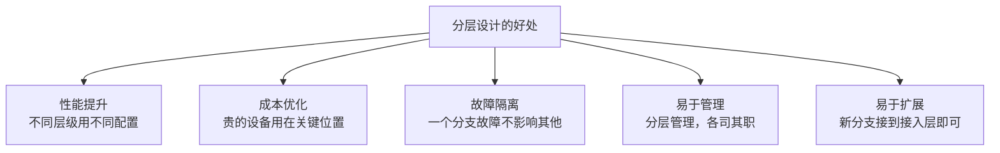

---
title: 骨干网与分支网络：企业网络的分层设计
description: 从核心层、汇聚层到接入层，说明骨干网与分支网络在企业中的分层角色、容量与高可用设计要点。
---

# 骨干网与分支网络：企业网络的分层设计

## 网络分层模型

```
核心层（Core）
    ↕ 高速互联 (10G+)
汇聚层（Distribution）
    ↕ 中速互联 (1G)
接入层（Access）
    ↕ 低速互联 (100M)
终端（End User）
```

## 骨干网（Backbone）

骨干网连接各个区域和数据中心，是企业网络的"高速公路"。

### 特点

```
┌─────────────────────────────┐
│ 骨干网特点                  │
├─────────────────────────────┤
│ 高容量：10G、100G 链路      │
│ 高可靠：多链路冗余          │
│ 低延迟：优化的路由          │
│ 昂贵：成本最高              │
│ 关键：一旦故障全网受影响    │
└─────────────────────────────┘
```

### 骨干网拓扑

```
数据中心（北京）
    ├─ 100G 多路
    ├─ 冗余设计
    └─ 高可用
    
    ↕ （骨干网）
    
区域枢纽（上海）  区域枢纽（广州）
    ↕                  ↕
  分支              分支
```

## 分支网络

分支是离总部较远的办公点，网络相对简单。

### 分支网络特点

```
└─ 分支网络
   ├─ 员工数量：10-100 人
   ├─ 链路：1-2 条（宽带+备份）
   ├─ 设备：简单路由器
   └─ 管理：集中管理，本地配置
```

## 分层的好处



## 总结

分层网络设计是企业网络的标准做法：
- 骨干网：关键、贵、高可用
- 汇聚层：连接骨干和分支
- 接入层：连接分支和用户
- 终端：用户设备

---

推荐阅读：[网络拓扑详解](/guide/architecture/topology)
