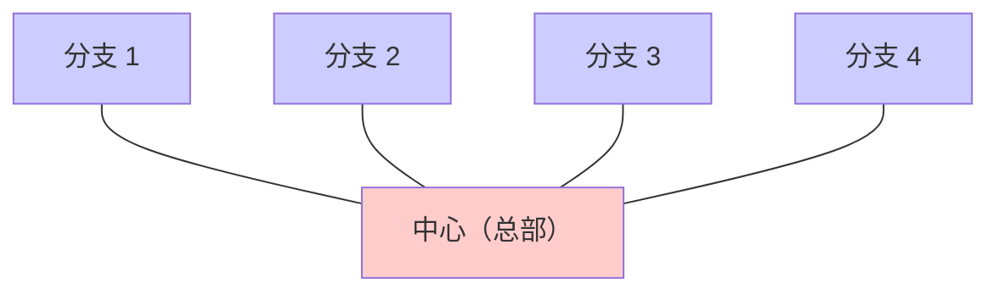
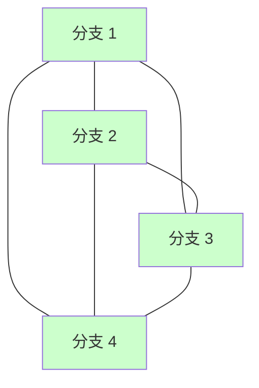
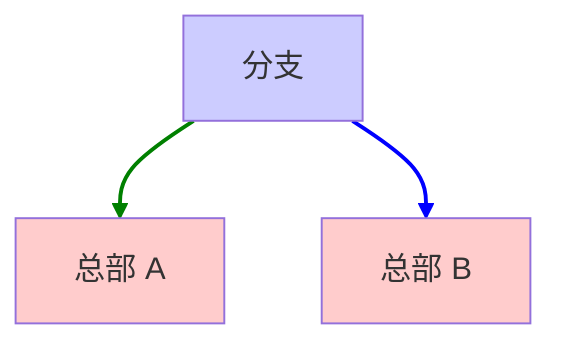
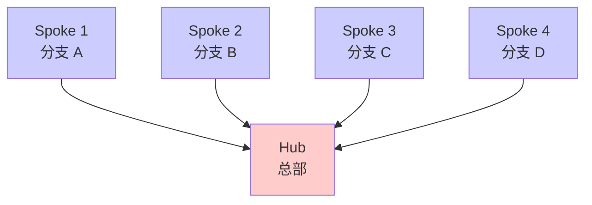
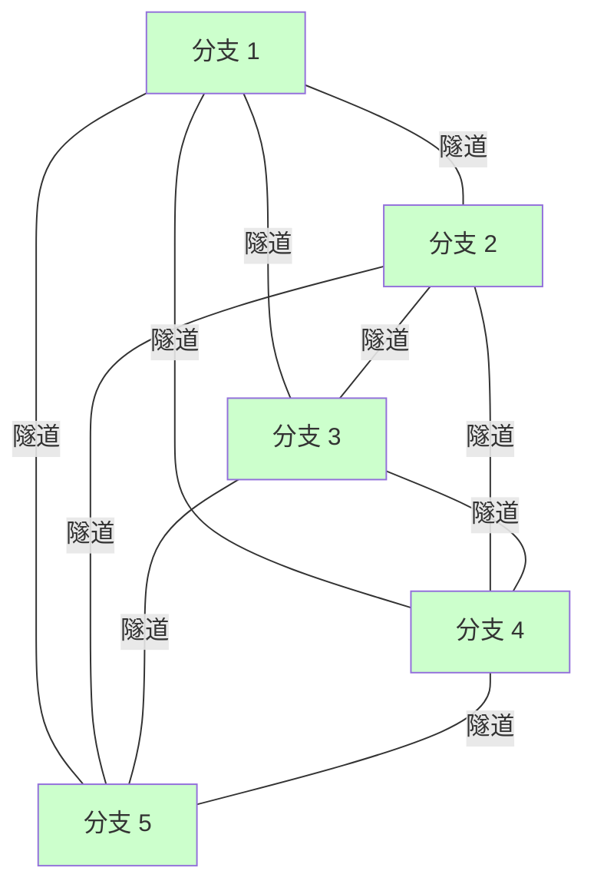
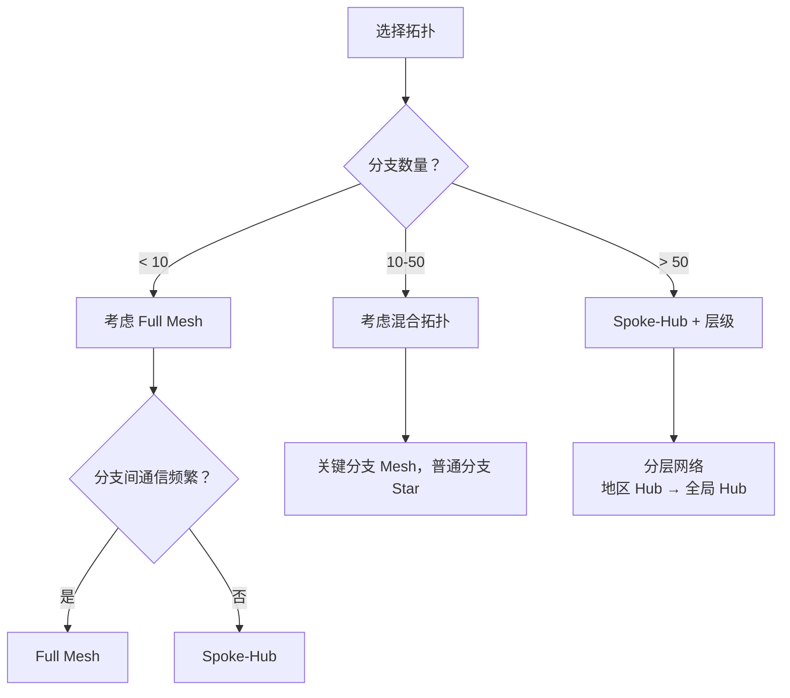

---
title: 网络拓扑详解：从星形到网状的组网艺术
description: 详解星形、网状等企业网络拓扑的特点、优缺点与适用场景，辅助组网形态选型与设计理解。
---

# 网络拓扑详解：从星形到网状的组网艺术

## 三种主要拓扑

### 1. 星形（Star）拓扑



**特点**：
- <Icon name="check" color="green" /> 简单易管理
- <Icon name="check" color="green" /> 低成本（分支少时）
- <Icon name="x" color="danger" /> 单点故障（总部故障全网瘫痪）
- <Icon name="x" color="danger" /> 分支间通信需经过总部（Hair Pinning）
- <Icon name="check" color="green" /> 最常见的企业网络

### 2. 网状（Mesh）拓扑

#### 完全网状



**特点**：
- <Icon name="check" color="green" /> 极高可靠性
- <Icon name="check" color="green" /> 最优路由
- <Icon name="x" color="danger" /> 成本巨高（N 个节点需 N×(N-1)/2 条链路）
- <Icon name="x" color="danger" /> 管理复杂

#### 部分网状

```
只连接关键节点：
总部 ←→ 一级分支
总部 ←→ 二级分支
一级分支 ←→ 一级分支（可选）
```

### 3. DP（Dual Path）组网

**概念**：每个分支有两条链路连接到两个不同的网络。



**特点**：
- <Icon name="check" color="green" /> 高可靠（任一线路故障不影响）
- <Icon name="check" color="green" /> 负载均衡（两条链路都工作）
- <Icon name="check" color="green" /> 成本适中
- <Icon name="check" color="green" /> SD-WAN 时代的标准配置

---

## Spoke-Hub 模型

### 定义

```
Hub（中心）：
- 总部或主要数据中心
- 连接所有分支
- 进行流量汇聚和路由

Spoke（分支）：
- 只连接 Hub
- 相互通信必须经过 Hub
```

### 拓扑图



### 应用场景

**适合**：
- 分支数量多但不经常互通
- 流量集中在分支 ↔ 总部
- 成本优先

**不适合**：
- 分支间频繁通信（延迟高）
- 需要高可靠性（单点故障）

---

## Full Mesh 组网

### 拓扑



### 特点

| 方面 | 情况 |
|-----|------|
| 隧道数量 | N×(N-1)/2（5 分支需 10 条隧道） |
| 延迟 | 最低（直接连接） |
| 可靠性 | 最高（多路备份） |
| 成本 | 最高 |
| 管理 | 最复杂 |

### 适用场景

- 关键分支间高频通信
- 延迟敏感应用（金融交易）
- 灾备要求高
- 分支数量不超过 10 个

---

## 混合拓扑

### 常见模式

```
总部（Hub）
    ├─ 所有分支都连 Hub
    └─ 关键分支间也连接（Mesh）

示意：
        Hub
        / \
       /   \
      B1---B2    （B1 和 B2 关键，互连）
      /     \
     B3     B4   （普通分支，只连 Hub）
```

### 选择标准



---

## 总结对比

```
┌─────────────────────────────────────────┐
│ 拓扑对比总表                            │
├──────────┬────────┬────────┬────────────┤
│ 拓扑     │ 成本   │ 延迟   │ 可靠性     │
├──────────┼────────┼────────┼────────────┤
│ Star     │ 低 [$]  │ 中等   │ 低 (red)      │
│ Mesh     │ 高 [$][$]│ 最低   │ 高 (grn)      │
│ DP       │ 中 [$]  │ 低     │ 中高 (ylw)    │
│ Hybrid   │ 中 [$]  │ 低     │ 中 (ylw)      │
└──────────┴────────┴────────┴────────────┘
```

---

## 推荐阅读

- 下一章：[骨干网与分支网络](/guide/architecture/backbone)
- 相关：[SD-WAN 架构](/guide/sdwan/architecture)
