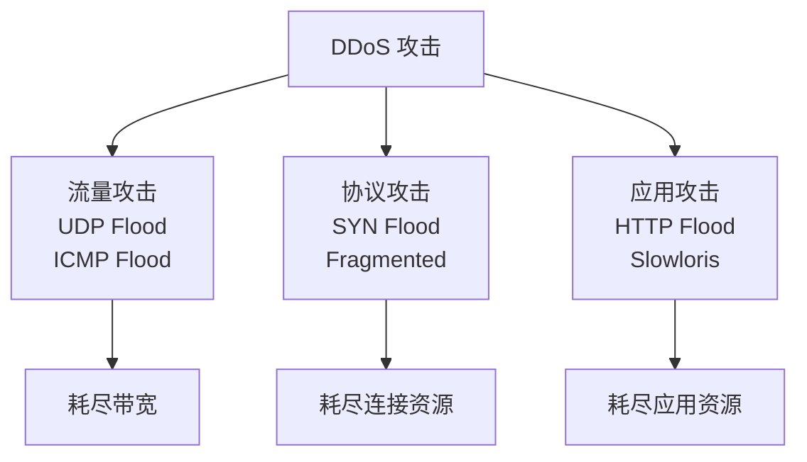

# DDoS 攻击与防御

DDoS（分布式拒绝服务）是网络安全的重大威胁。

## 三种主要攻击类型



## 防御方案

| 层级 | 方案 | 说明 |
|-----|------|------|
| ISP | BGP Flowspec | 源头流量清洗 |
| 边界 | 防火墙/IPS | 识别并丢弃恶意包 |
| 应用 | WAF | Web 应用防火墙 |
| 平台 | DDoS 清洗中心 | 云端清洗 |

## 关键指标

```
平常：100 Mbps 流量
DDoS 时：10 Gbps 流量

防护策略：
1. 检测异常（流量增长 10 倍以上）
2. 立即切换到清洗中心
3. 在云端过滤攻击流量
4. 只转发合法流量回源
```

推荐阅读：[网络安全架构](/guide/attacks/security-arch)
