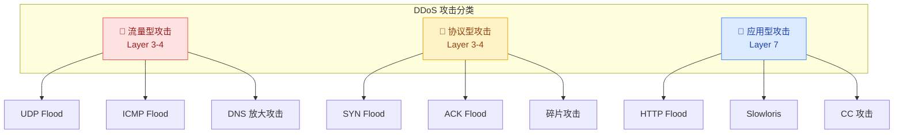
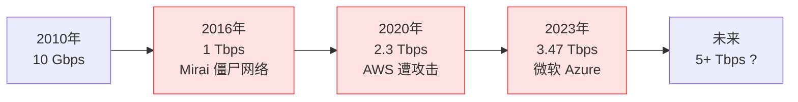
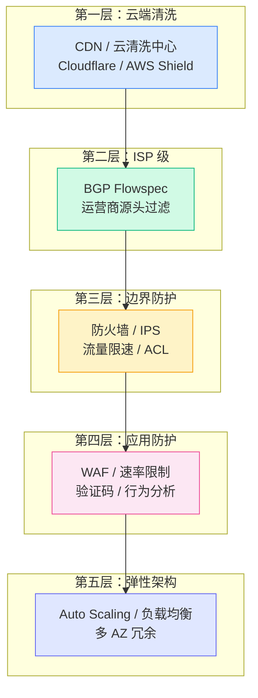
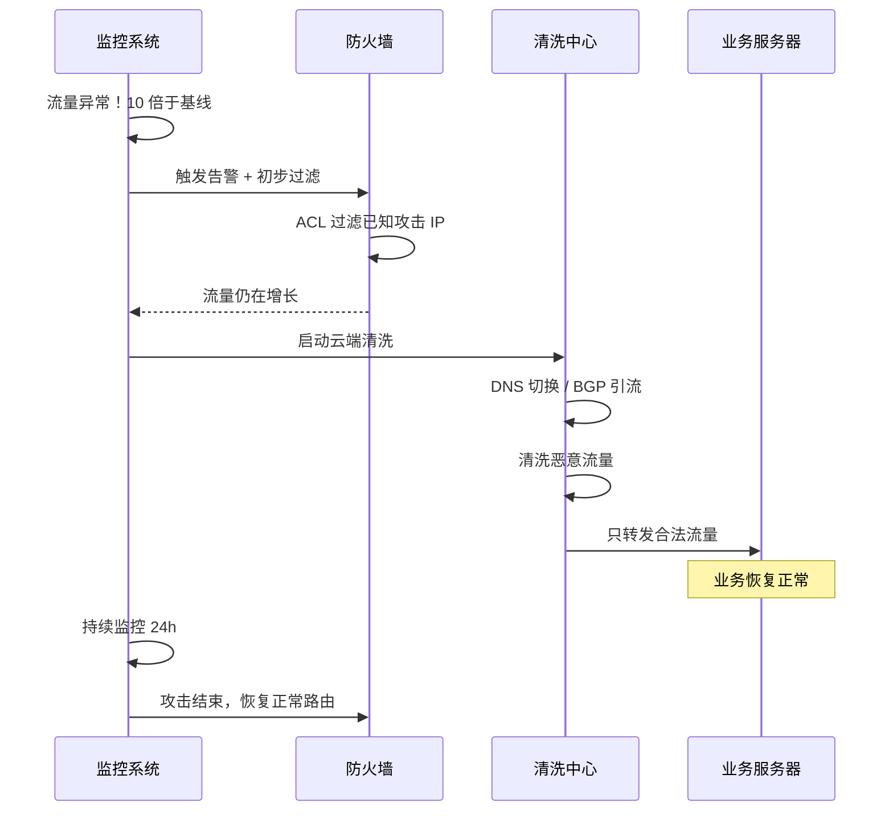

# DDoS 攻击与防御

## 什么是 DDoS？

DDoS（Distributed Denial of Service，分布式拒绝服务）本质上是一种**以量取胜**的攻击方式：攻击者控制大量的"肉鸡"（被入侵的计算机），同时向目标发起海量请求，把服务器或网络的资源耗尽，导致正常用户无法访问。

一个形象的比喻：你开了一家餐厅，突然来了一万个人排队但不点餐，把门堵死了，真正想吃饭的客人进不来。这就是 DDoS。

## 三大攻击类型

DDoS 攻击按照攻击的"目标层级"可以分为三类：

### 1. 流量型攻击——用带宽淹没你

**原理**：发送巨量数据包，把目标的带宽（比如 1Gbps）全部占满。

**典型手法**：
- **UDP Flood**：向目标发送大量 UDP 包，因为 UDP 无连接，不需要握手，发送成本极低
- **DNS 放大攻击**：向公共 DNS 服务器发送查询（伪造源 IP 为受害者），DNS 响应比请求大 50-70 倍，实现流量放大
- **NTP 放大攻击**：利用 NTP 的 `monlist` 命令，放大倍数高达 556 倍

**特征**：流量大（几十 Gbps 到 Tbps 级别），但特征明显，相对容易识别和过滤。

### 2. 协议型攻击——耗尽连接资源

**原理**：利用协议漏洞，让服务器维持大量"半开连接"或无效状态，耗尽内存和连接表。

**典型手法**：
- **SYN Flood**：发送大量 SYN 包但不完成三次握手，服务器的半开连接队列被塞满
- **ACK Flood**：发送大量伪造的 ACK 包，消耗防火墙的状态检测资源
- **碎片攻击**：发送故意分片的 IP 包，让目标耗费资源重组碎片

**特征**：流量不一定很大，但对服务器连接资源打击精准。

### 3. 应用型攻击——最难防御

**原理**：模拟正常用户的请求，让服务器在应用层耗尽 CPU、内存或数据库连接。

**典型手法**：
- **HTTP Flood**：发送大量看似合法的 HTTP 请求（GET/POST），服务器需要完整处理每个请求
- **Slowloris**：故意发送不完整的 HTTP 请求，让服务器一直等待，占用连接不释放
- **CC 攻击**：针对动态页面（如搜索、登录），每次请求都触发大量数据库查询

**特征**：流量小但危害大，因为请求"看起来像正常用户"，极难与合法流量区分。

## 攻击规模演变

## 多层防御体系

DDoS 防御的核心思想：**没有单一方案能解决所有问题，必须多层协同**。

| 防御层级 | 技术方案 | 能防什么 | 局限性 |
|---------|---------|---------|--------|
| **云端清洗** | Cloudflare、AWS Shield | 大流量攻击（Tbps 级） | 有延迟、成本高 |
| **ISP 过滤** | BGP Flowspec、黑洞路由 | 源头就过滤掉 | 需要运营商配合 |
| **边界防火墙** | 状态检测、ACL | 协议攻击、异常包 | 处理能力有限 |
| **WAF** | 规则引擎、AI 检测 | 应用层攻击 | 对流量攻击无效 |
| **弹性架构** | Auto Scaling、CDN | 吸收冲击 | 成本随攻击增长 |

## 实际防御流程

当检测到 DDoS 攻击时，通常按以下流程响应：

## 关键防御指标

| 指标 | 含义 | 建议值 |
|-----|------|-------|
| **MTTR** | 平均恢复时间 | < 5 分钟 |
| **清洗延迟** | 流量切换到清洗中心的时间 | < 10 秒 |
| **防护带宽** | 能承受的最大攻击流量 | 业务带宽的 100 倍以上 |
| **误杀率** | 正常流量被误判为攻击的比例 | < 0.1% |
| **漏杀率** | 攻击流量未被过滤的比例 | < 1% |

## 企业防御建议

::: tip 实用建议
1. **基线先行**：先了解自己的正常流量模式，才能识别异常
2. **分层防御**：不要依赖单一方案，至少 3 层防护
3. **提前签约**：与云清洗服务商签订 SLA，攻击时才有保障
4. **演练测试**：定期模拟 DDoS 攻击，验证防御方案有效性
5. **应急手册**：提前准备好应急响应流程，攻击时不要手忙脚乱
:::

## 小结

DDoS 攻击的本质是**资源不对称**——攻击者用少量成本就能消耗防御方大量资源。防御的核心思路是：

- **流量攻击**：用更大的带宽去抗（云清洗）
- **协议攻击**：用更智能的设备去过滤（防火墙 + IPS）
- **应用攻击**：用更聪明的算法去识别（WAF + AI）

没有银弹，只有体系。

---

**推荐阅读**：
- [网络安全架构](/guide/attacks/security-arch) — 理解纵深防御的设计思路
- [加密与身份认证](/guide/attacks/encryption) — DDoS 之外的另一大安全课题
- [IPSec 协议详解](/guide/security/ipsec) — 加密隧道如何保护数据传输
