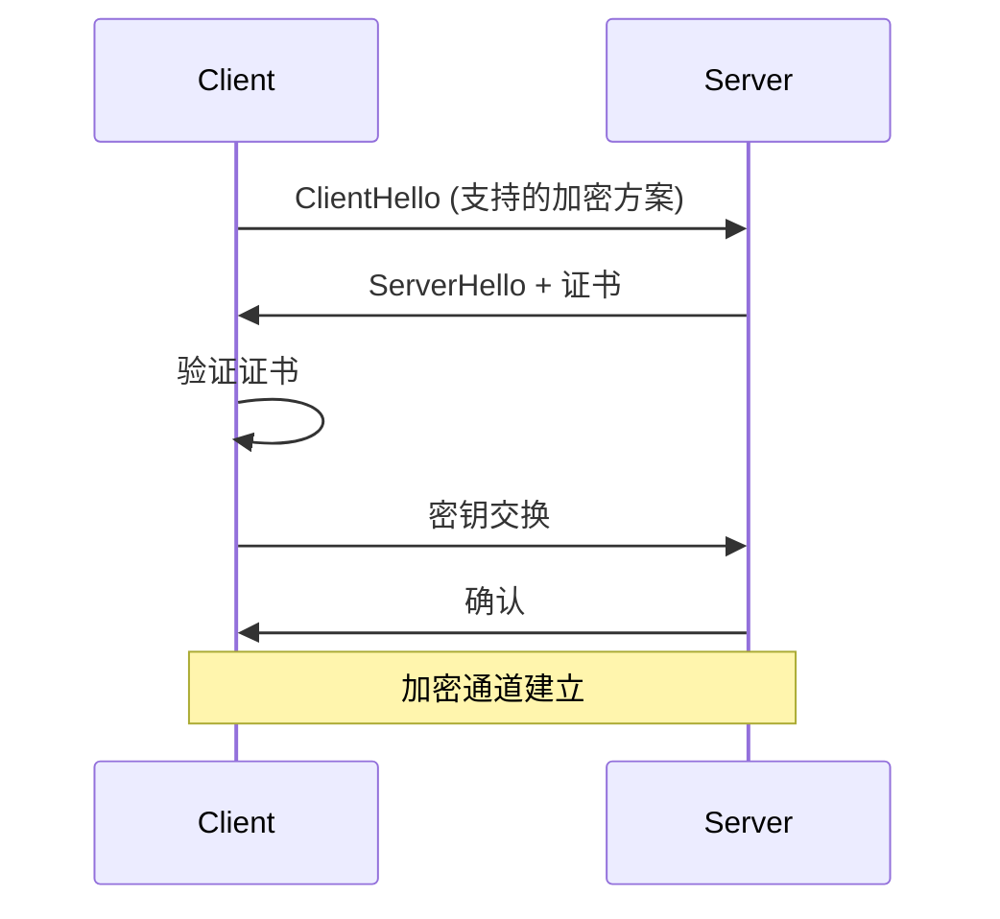

# 加密与身份认证

现代网络中，加密和认证是必需品。

## 加密方式

```
对称加密：
- AES-256：军用级别
- ChaCha20：现代，高性能
- 用途：数据加密

非对称加密：
- RSA：广泛使用
- ECDSA：新兴，高效
- 用途：密钥交换、数字签名

哈希：
- SHA-256：安全哈希
- MD5：已弃用
- 用途：完整性校验
```

## 身份认证

```
单因素：密码
多因素：密码 + OTP + 生物识别

认证协议：
- Kerberos：企业域
- OAuth：互联网服务
- SAML：企业 SSO
- LDAP：目录服务
```

## TLS 握手



推荐阅读：[网络冗余与高可用](/guide/qos/redundancy)
