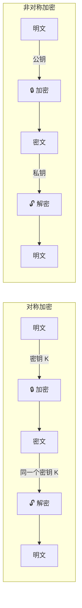
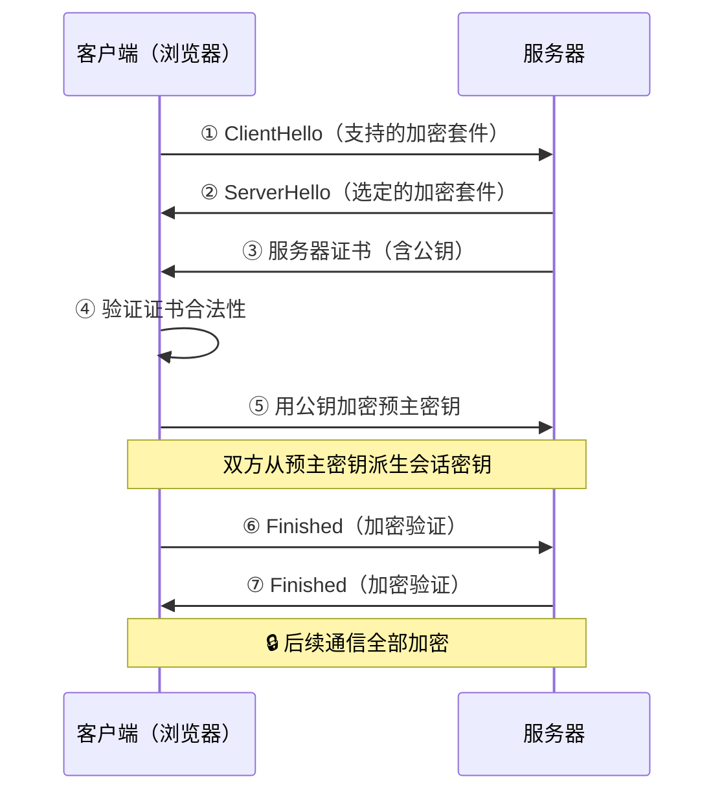
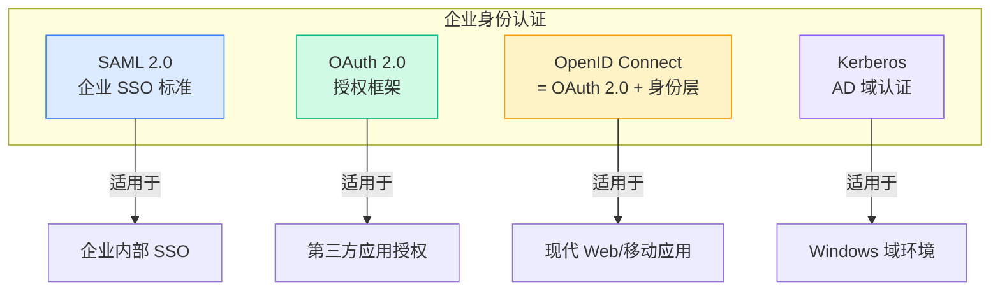
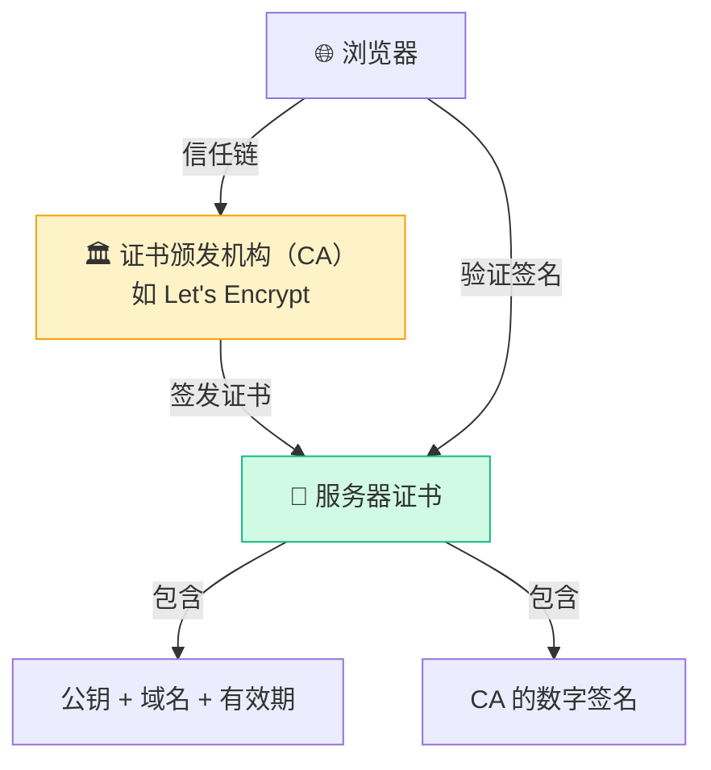

# 加密与身份认证

## 为什么需要加密？

网络传输默认是**明文**的。没有加密，你在网上输入的密码、发送的消息、浏览的网页，在网络的任何一个节点上都可能被截获和阅读。

加密就是给数据穿上一层"隐身衣"：即使被截获，攻击者看到的也只是一堆无意义的乱码。

## 对称加密 vs 非对称加密

| 特性 | 对称加密 | 非对称加密 |
|-----|---------|-----------|
| **密钥** | 加密解密用同一个 | 公钥加密，私钥解密 |
| **速度** | 快（适合大数据） | 慢（适合小数据） |
| **密钥分发** | 难题：怎么安全传密钥？ | 公钥可以公开发送 |
| **典型算法** | AES-256、ChaCha20 | RSA、ECC |
| **应用场景** | 数据传输加密 | 密钥交换、数字签名 |

**实际使用**：两者结合。用非对称加密安全地交换一个"会话密钥"，然后用这个会话密钥做对称加密。这就是 TLS 的工作方式。

## TLS：互联网加密的基石

TLS（Transport Layer Security）是 HTTPS 背后的协议。你在浏览器看到的 🔒 锁标志，就是 TLS 在工作。

### TLS 1.3 的改进

TLS 1.3（2018 年发布）相比 1.2 有重大改进：

| 对比项 | TLS 1.2 | TLS 1.3 |
|-------|---------|---------|
| **握手次数** | 2-RTT | 1-RTT（支持 0-RTT） |
| **加密套件** | 支持弱算法（RC4、3DES） | 仅保留强算法 |
| **前向保密** | 可选 | 强制 |
| **握手加密** | 部分明文 | 几乎全部加密 |
| **性能** | 较慢 | 更快 |

## 身份认证机制

加密解决了"别人看不到"的问题，但还有一个问题：**你怎么确定对方是谁？**

### 多因素认证（MFA）

"你是谁"可以通过三种方式验证：

| 因素 | 含义 | 例子 |
|-----|------|------|
| **你知道的** | 记忆中的信息 | 密码、PIN 码、安全问题 |
| **你拥有的** | 持有的设备 | 手机（OTP）、安全密钥（YubiKey） |
| **你本身的** | 生物特征 | 指纹、面部识别、虹膜 |

MFA = 至少使用两种因素。即使密码被盗，没有第二个因素也无法登录。

### 常见认证协议

| 协议 | 核心功能 | 典型场景 |
|-----|---------|---------|
| **SAML 2.0** | XML 格式的身份断言 | 企业 SSO（如登录 Salesforce） |
| **OAuth 2.0** | 第三方授权（不交出密码） | "用微信/GitHub 登录" |
| **OpenID Connect** | OAuth 2.0 + 身份验证 | 现代 Web 应用统一登录 |
| **Kerberos** | 基于票据的认证 | Windows Active Directory |

## 数字证书和 PKI

数字证书回答一个关键问题：**这个公钥真的属于它声称的那个人/组织吗？**

**信任链**：浏览器预装了根 CA 的证书 → 根 CA 签发中间 CA → 中间 CA 签发服务器证书 → 浏览器逐级验证签名。

## 企业加密最佳实践

::: tip 加密清单
1. **传输加密**：所有流量必须 TLS 1.3，禁用 TLS 1.0/1.1
2. **存储加密**：数据库字段级加密，磁盘 AES-256 加密
3. **密钥管理**：使用 HSM 或 KMS（如 AWS KMS），禁止代码中硬编码密钥
4. **证书自动化**：用 ACME 协议（如 Let's Encrypt）自动签发和续期
5. **MFA 强制**：所有管理后台和 VPN 必须 MFA
6. **前向保密**：确保会话密钥不依赖长期私钥
:::

## 小结

加密和认证是网络安全的两根支柱：

- **加密**确保数据不被窃听（保密性）
- **认证**确保通信对方是谁（真实性）
- **数字签名**确保数据没被篡改（完整性）

三者合一，才是完整的安全保障。

---

**推荐阅读**：
- [IPSec 协议详解](/guide/security/ipsec) — 网络层的加密隧道
- [网络安全架构](/guide/attacks/security-arch) — 加密在整体架构中的位置
- [SD-WAN 安全设计](/guide/sdwan/security) — 企业广域网的加密策略
