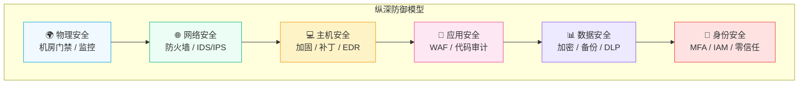
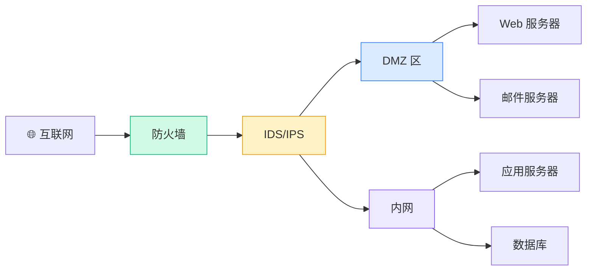
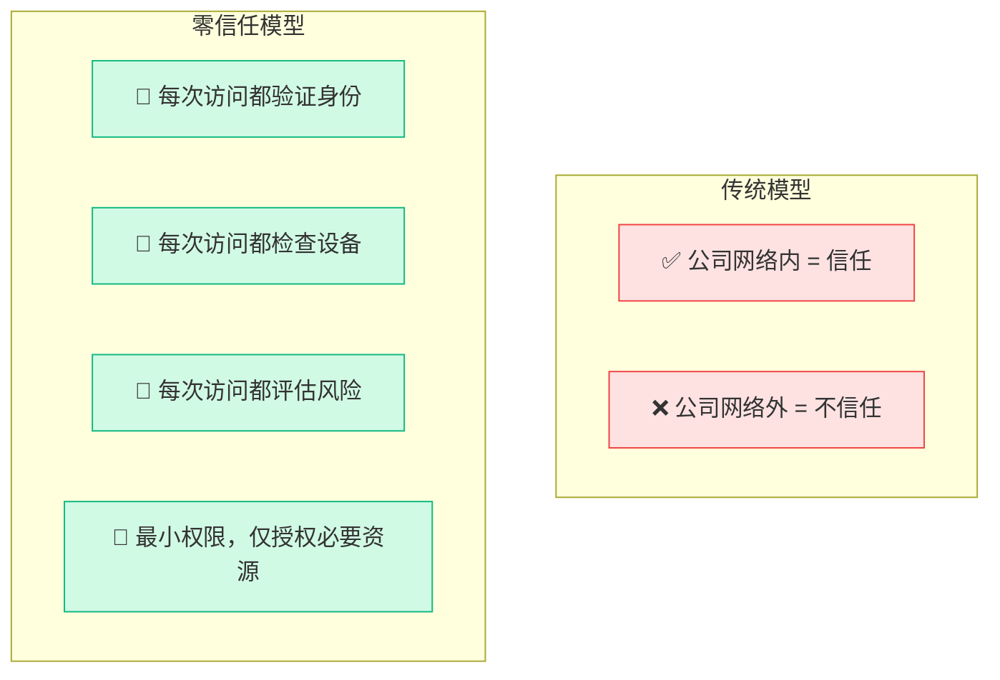

# 网络安全架构

## 核心理念：纵深防御

网络安全没有"万能锁"。纵深防御（Defense in Depth）的核心思想是：**假设任何一层都可能被突破，所以要层层设防**。

就像中世纪的城堡：护城河、城墙、箭塔、内城、密室——攻破一层不代表攻下全城。

## 三道防线

### 第一道：边界防御

目标：**阻止外部威胁进入内网**

| 设备 | 功能 | 部署位置 |
|-----|------|---------|
| **防火墙** | 基于规则过滤流量 | 内外网边界 |
| **IDS/IPS** | 检测/阻断入侵行为 | 防火墙之后 |
| **WAF** | 防护 Web 应用攻击 | Web 服务器前 |
| **Anti-DDoS** | 清洗异常流量 | 入口最前端 |
| **邮件网关** | 过滤钓鱼邮件/恶意附件 | 邮件入口 |

### 第二道：内网隔离

目标：**即使攻击者进入内网，也无法横向移动**

- **网络分区**：按业务划分 VLAN，不同区域之间需要通过防火墙通信
- **微分段**：在虚拟化/容器环境中，每个工作负载都有独立的安全策略
- **最小权限**：每个用户、每个服务只能访问它必须访问的资源
- **东西向流量检测**：监控内网之间的流量，不只是南北向

### 第三道：终端和数据

目标：**保护最终的资产——数据本身**

- **终端检测与响应（EDR）**：监控每台终端的行为，发现异常立即隔离
- **数据加密**：传输中用 TLS，存储用 AES-256
- **数据防泄漏（DLP）**：检测并阻止敏感数据外传
- **备份恢复**：即使数据被加密（勒索软件），也能从备份恢复

## 零信任架构

传统安全的问题：**进了公司网络就信任你**。这在远程办公时代已经不够了。

零信任（Zero Trust）的原则：**永远不信任，始终要验证。**

### 零信任的核心组件

| 组件 | 作用 | 典型产品 |
|-----|------|---------|
| **身份提供商（IdP）** | 统一身份认证 | Okta、Azure AD |
| **设备信任评估** | 检查设备安全状态 | CrowdStrike、Jamf |
| **策略引擎** | 动态权限决策 | Google BeyondCorp |
| **安全网关** | 代理和加密所有访问 | Zscaler、Cloudflare |
| **持续监控** | 实时行为分析 | SIEM、UEBA |

## 安全架构设计原则

::: tip 设计原则
1. **最小权限**：只给必要的权限，没有例外
2. **纵深防御**：不依赖任何单一防护层
3. **默认拒绝**：没有明确允许的，一律拒绝
4. **持续验证**：不是"登录一次就完事"
5. **可审计**：所有操作都有日志，可追溯
6. **故障安全**：安全设备故障时，默认断开（Fail-Close）
:::

## 小结

网络安全架构不是买几台防火墙就完事。它是一个系统工程：

- **外围**用防火墙和 IPS 挡住大部分攻击
- **内部**用分区和微分段限制横向移动
- **终端**用 EDR 监控每台设备
- **数据**用加密和 DLP 保护核心资产
- **身份**用零信任确保每次访问都可信

层层叠叠，环环相扣。

---

**推荐阅读**：
- [DDoS 攻击与防御](/guide/attacks/ddos) — 最常见的外部攻击类型
- [加密与身份认证](/guide/attacks/encryption) — 零信任架构的基石
- [SD-WAN 安全设计](/guide/sdwan/security) — 企业广域网的安全策略
