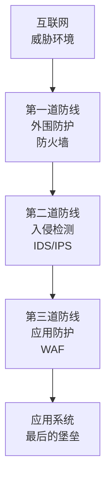

# 网络安全架构

现代网络安全采用纵深防御策略。

## 三道防线

## 关键组件

| 组件 | 功能 |
|-----|------|
| 防火墙 | 基于规则过滤 |
| IDS/IPS | 特征识别检测 |
| WAF | 应用层防护 |
| DLP | 数据损失防护 |
| SIEM | 安全事件管理 |

推荐阅读：[加密与认证](/guide/attacks/encryption)
