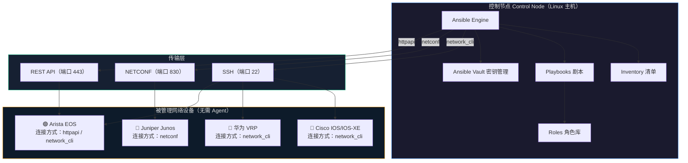
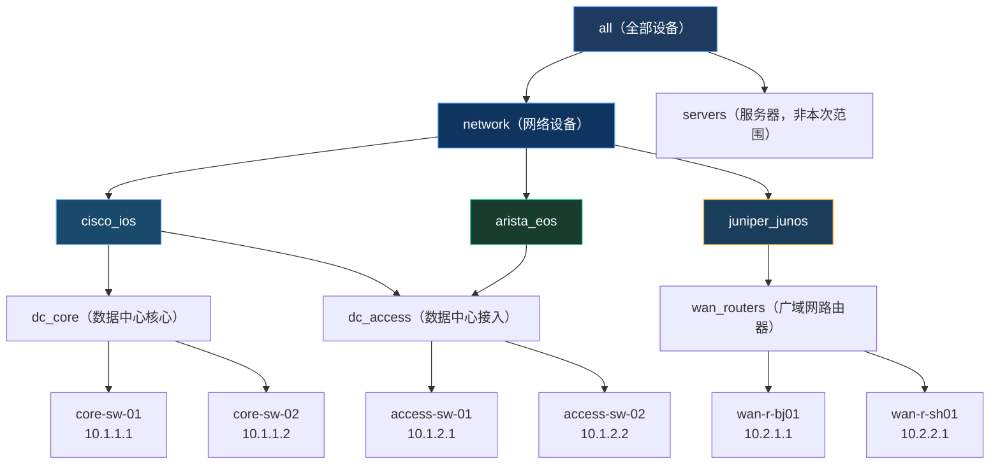
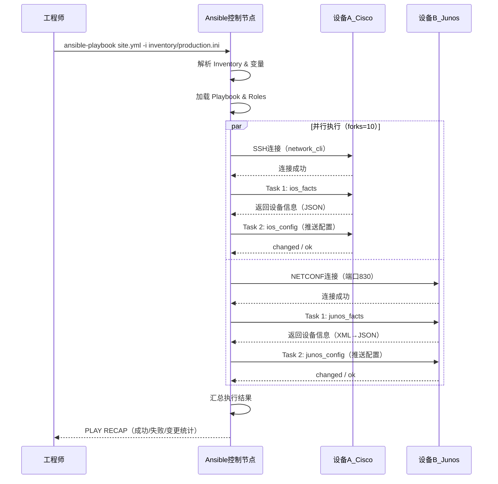
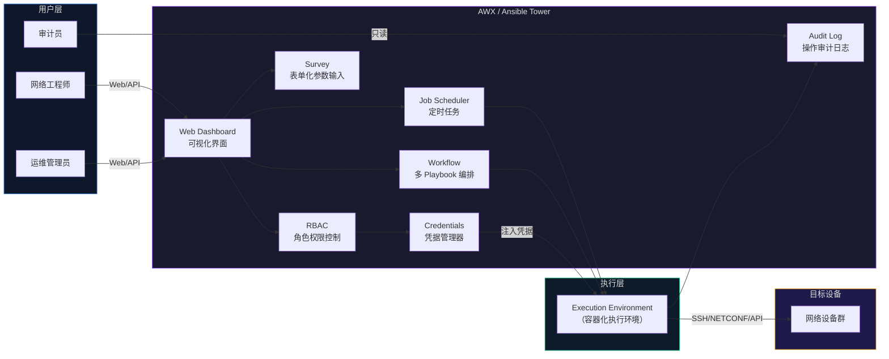

> 📋 **前置知识**：[Python网络编程](/guide/automation/python-networking)
> ⏱️ **阅读时间**：约18分钟

# Ansible网络自动化：批量配置管理实战

---

## 一、场景引入：当手工运维遇到规模化挑战

某金融企业有 400 台交换机、120 台路由器，分布在 6 个数据中心和 30 个分支机构。每逢合规审计季，运维团队需要逐台登录设备、核查 NTP 配置、Banner 信息、SNMP 团体字符串是否符合安全基线。最快的做法也要花 3 名工程师工作整整两周。

更糟的是，某次检查发现有 17 台设备的 Telnet 仍未关闭——而这 17 台恰好分散在不同城市，没有人知道它们到底是什么时候"漏网"的。

**这正是网络自动化要解决的核心问题**：在设备规模超过人力可精细管理的阈值之后，靠人工操作带来的不是灵活，而是风险。

Ansible（安斯博）作为目前最被企业网络团队接受的自动化工具之一，凭借以下三点打动了无数网络工程师：

| 特性 | 说明 |
|------|------|
| **无 Agent（Agentless）** | 网络设备无需安装任何客户端，通过 SSH/NETCONF/API 连接即可管理 |
| **幂等性（Idempotency）** | 多次执行同一 Playbook，结果一致，不会产生副作用 |
| **声明式语言** | YAML 编写配置意图，而非命令序列，降低学习曲线 |
| **厂商模块生态** | Cisco、Juniper、Arista、华为等主流厂商均有官方支持模块 |

---

## 二、概念建模：Ansible网络自动化架构

### 2.1 整体架构图



### 2.2 三种连接方式对比

Ansible 针对网络设备定义了三种核心连接插件（Connection Plugin），理解它们是正确配置 Inventory 的前提：

| 连接类型 | 适用场景 | 工作原理 | 典型厂商 |
|----------|----------|----------|----------|
| `network_cli` | 命令行设备 | 模拟 SSH 终端，发送 CLI 命令 | Cisco IOS, 华为 VRP, Arista EOS |
| `netconf` | 支持 NETCONF 的设备 | 基于 XML/SSH 的结构化配置协议 | Juniper Junos, Cisco IOS-XE |
| `httpapi` | 有 REST API 的设备 | HTTP/HTTPS 调用厂商 API | Arista eAPI, Cisco NX-OS |

::: tip 最佳实践
优先选择 `netconf` 或 `httpapi`——它们提供结构化数据返回，比 `network_cli` 的文本解析更可靠。当设备仅支持 CLI 时才使用 `network_cli`。
:::

---

## 三、原理拆解：核心组件深度解析

### 3.1 Inventory 清单：多厂商分组设计

Inventory 是 Ansible 的设备注册表，良好的 Inventory 设计是可维护性的基础。

```ini
# inventory/production.ini

# === 数据中心核心层 ===
[dc_core]
core-sw-01 ansible_host=10.1.1.1
core-sw-02 ansible_host=10.1.1.2

# === 接入层设备 ===
[dc_access]
access-sw-01 ansible_host=10.1.2.1
access-sw-02 ansible_host=10.1.2.2
access-sw-03 ansible_host=10.1.2.3

# === 广域网路由器 ===
[wan_routers]
wan-r-bj01 ansible_host=10.2.1.1
wan-r-sh01 ansible_host=10.2.2.1

# === 按厂商分组 ===
[cisco_ios]
core-sw-01
core-sw-02
access-sw-01

[juniper_junos]
wan-r-bj01
wan-r-sh01

[arista_eos]
access-sw-02
access-sw-03

# === 厂商组变量 ===
[cisco_ios:vars]
ansible_network_os=ios
ansible_connection=network_cli
ansible_user=netadmin
ansible_ssh_pass={{ vault_cisco_password }}

[juniper_junos:vars]
ansible_network_os=junos
ansible_connection=netconf
ansible_user=netadmin
ansible_ssh_pass={{ vault_junos_password }}

[arista_eos:vars]
ansible_network_os=eos
ansible_connection=httpapi
ansible_httpapi_use_ssl=true
ansible_httpapi_validate_certs=false
ansible_user=admin
ansible_password={{ vault_arista_password }}

# === 父组：所有网络设备 ===
[network:children]
cisco_ios
juniper_junos
arista_eos
```

### 3.2 Inventory 层级结构



### 3.3 变量管理：group_vars 与 host_vars

```
inventory/
├── production.ini          # 主清单文件
├── group_vars/
│   ├── all.yml             # 所有设备共享变量
│   ├── cisco_ios.yml       # Cisco 设备专属变量
│   ├── juniper_junos.yml   # Juniper 设备专属变量
│   └── dc_core.yml         # 核心层设备变量
└── host_vars/
    ├── core-sw-01.yml      # 单台设备独立变量
    └── wan-r-bj01.yml
```

```yaml
# inventory/group_vars/all.yml
---
# 全局 NTP 服务器
ntp_servers:
  - 10.0.0.1
  - 10.0.0.2

# 全局 Syslog 服务器
syslog_servers:
  - host: 10.0.1.100
    port: 514

# 全局 Banner 信息
login_banner: |
  ************************************************************
  *  Authorized access only. All activity is monitored.     *
  *  Unauthorized access is prohibited and will be          *
  *  prosecuted to the fullest extent of the law.           *
  ************************************************************

# SNMP 配置
snmp_location: "China-DC-MainSite"
snmp_contact: "noc@company.com"
```

```yaml
# inventory/group_vars/cisco_ios.yml
---
# Cisco 专属参数
ios_save_when: changed    # 仅配置变更时保存

# ACL 配置
mgmt_acl_name: MGMT-ACCESS
mgmt_allowed_hosts:
  - 10.100.0.0/24
  - 10.100.1.0/24
```

::: warning 注意
敏感变量（密码、密钥）必须使用 `ansible-vault` 加密存储，绝对不能明文写入 group_vars 文件并提交 Git 仓库。
:::

### 3.4 核心网络模块速查

#### Cisco IOS 系列

| 模块名 | 用途 |
|--------|------|
| `cisco.ios.ios_command` | 执行 show 命令，获取设备状态 |
| `cisco.ios.ios_config` | 推送配置（等同于进入 config terminal） |
| `cisco.ios.ios_facts` | 采集设备信息（版本、接口、路由表等） |
| `cisco.ios.ios_vlans` | 声明式管理 VLAN |
| `cisco.ios.ios_interfaces` | 声明式管理接口配置 |
| `cisco.ios.ios_bgp_global` | BGP 全局配置 |

#### Juniper Junos 系列

| 模块名 | 用途 |
|--------|------|
| `junipernetworks.junos.junos_command` | 执行 Junos CLI 命令 |
| `junipernetworks.junos.junos_config` | 推送 Junos 配置（支持 set/merge/replace） |
| `junipernetworks.junos.junos_facts` | 采集设备信息 |

#### 通用模块

| 模块名 | 适用场景 |
|--------|----------|
| `ansible.netcommon.cli_command` | 跨厂商发送 CLI 命令 |
| `ansible.netcommon.cli_config` | 跨厂商推送 CLI 配置 |
| `ansible.netcommon.netconf_config` | 通过 NETCONF 推送 XML 配置 |

---

## 四、实战关联：Playbook 工程实践

### 4.1 Playbook 执行流程



### 4.2 实战一：批量采集接口状态并生成报告

```yaml
# playbooks/collect_interface_status.yml
---
- name: 批量采集网络接口状态报告
  hosts: cisco_ios
  gather_facts: false
  vars:
    report_dir: "/opt/ansible/reports/{{ ansible_date_time.date }}"

  tasks:
    - name: 采集接口信息
      cisco.ios.ios_facts:
        gather_subset:
          - interfaces
      register: device_facts

    - name: 执行 show interfaces 获取详细状态
      cisco.ios.ios_command:
        commands:
          - show interfaces
          - show ip interface brief
          - show interfaces counters errors
      register: interface_output

    - name: 确保报告目录存在
      ansible.builtin.file:
        path: "{{ report_dir }}"
        state: directory
        mode: '0755'
      delegate_to: localhost
      run_once: true

    - name: 生成设备接口状态报告（每台设备独立文件）
      ansible.builtin.template:
        src: templates/interface_report.j2
        dest: "{{ report_dir }}/{{ inventory_hostname }}_interfaces.txt"
      delegate_to: localhost
      vars:
        interfaces: "{{ device_facts.ansible_facts.ansible_net_interfaces }}"
        raw_output: "{{ interface_output.stdout[1] }}"

    - name: 汇总 Down 接口列表（告警用）
      ansible.builtin.set_fact:
        down_interfaces: >-
          {{
            device_facts.ansible_facts.ansible_net_interfaces
            | dict2items
            | selectattr('value.operstatus', 'eq', 'down')
            | map(attribute='key')
            | list
          }}

    - name: 打印 Down 接口（调试）
      ansible.builtin.debug:
        msg: "{{ inventory_hostname }} 发现 Down 接口: {{ down_interfaces }}"
      when: down_interfaces | length > 0
```

对应的 Jinja2 报告模板：

```jinja2
{# templates/interface_report.j2 #}
======================================================
设备名称: {{ inventory_hostname }}
采集时间: {{ ansible_date_time.iso8601 }}
设备 IOS 版本: {{ ansible_facts.ansible_net_version | default('N/A') }}
======================================================

接口状态摘要（show ip interface brief）:
{{ raw_output }}

------------------------------------------------------
Down 接口列表:

  ✓ 所有接口均正常


  ✗ {{ intf }}


======================================================
```

### 4.3 实战二：批量配置 VLAN（完整 Playbook）

这是最常见的批量变更场景。我们需要在所有接入层交换机上统一添加生产 VLAN：

```yaml
# playbooks/configure_vlans.yml
---
- name: 批量配置 VLAN（Cisco IOS）
  hosts: dc_access:&cisco_ios   # 取交集：接入层中的 Cisco 设备
  gather_facts: false
  serial: 5                     # 每批最多并行操作 5 台，防止配置风暴

  vars:
    vlans_to_add:
      - vlan_id: 100
        name: VLAN_PRODUCTION
      - vlan_id: 200
        name: VLAN_MANAGEMENT
      - vlan_id: 300
        name: VLAN_STORAGE
      - vlan_id: 999
        name: VLAN_QUARANTINE

  pre_tasks:
    - name: 检查设备可达性
      cisco.ios.ios_command:
        commands: show version
      register: check_result
      failed_when: false

    - name: 标记不可达设备（跳过，不中断整体任务）
      ansible.builtin.meta: end_host
      when: check_result.failed

  tasks:
    - name: 获取当前 VLAN 数据库（用于变更比较）
      cisco.ios.ios_facts:
        gather_subset:
          - vlans
      register: pre_state

    - name: 配置 VLAN（声明式，幂等）
      cisco.ios.ios_vlans:
        config: "{{ vlans_to_add }}"
        state: merged       # merged = 只添加，不删除现有 VLAN
      register: vlan_result
      notify: 保存配置

    - name: 验证 VLAN 已创建
      cisco.ios.ios_command:
        commands:
          - "show vlan id {{ item.vlan_id }}"
      loop: "{{ vlans_to_add }}"
      register: vlan_verify

    - name: 断言所有 VLAN 均存在
      ansible.builtin.assert:
        that:
          - "'active' in item.stdout[0]"
        fail_msg: "VLAN {{ item.item.vlan_id }} 配置失败，设备 {{ inventory_hostname }}"
        success_msg: "VLAN {{ item.item.vlan_id }} 配置成功"
      loop: "{{ vlan_verify.results }}"

  handlers:
    - name: 保存配置
      cisco.ios.ios_command:
        commands:
          - write memory
      listen: "保存配置"

  post_tasks:
    - name: 获取变更后 VLAN 数据库
      cisco.ios.ios_facts:
        gather_subset:
          - vlans
      register: post_state

    - name: 记录变更报告
      ansible.builtin.template:
        src: templates/vlan_change_report.j2
        dest: "/opt/ansible/reports/vlan_{{ ansible_date_time.date }}/{{ inventory_hostname }}.txt"
      delegate_to: localhost
      vars:
        before: "{{ pre_state.ansible_facts.ansible_net_vlans }}"
        after: "{{ post_state.ansible_facts.ansible_net_vlans }}"
        changed: "{{ vlan_result.changed }}"
```

::: tip 最佳实践
使用 `serial` 参数控制并发批次，避免同时推送配置到大量设备时造成 **配置风暴（Configuration Storm）**。核心层建议 `serial: 1`（逐台），接入层可以 `serial: 10%`（每批 10%）。
:::

### 4.4 实战三：配置回滚机制

网络变更的回滚是企业运维的必备能力：

```yaml
# playbooks/config_rollback.yml
---
- name: 网络配置回滚
  hosts: "{{ target_hosts }}"     # 通过命令行 -e 传入目标设备
  gather_facts: false

  vars:
    rollback_checkpoint: "PRE_CHANGE_{{ change_ticket_id }}"

  tasks:
    # === 变更前：创建检查点（IOS-XE 支持配置归档）===
    - name: 创建变更前配置快照
      cisco.ios.ios_config:
        lines:
          - "archive"
          - "  path flash:backup/"
          - "  write-memory"
      when: phase == 'pre'

    - name: 备份当前 running-config
      cisco.ios.ios_command:
        commands:
          - "show running-config"
      register: running_config
      when: phase == 'pre'

    - name: 保存备份到控制节点
      ansible.builtin.copy:
        content: "{{ running_config.stdout[0] }}"
        dest: "/opt/ansible/backups/{{ inventory_hostname }}_{{ change_ticket_id }}_pre.cfg"
      delegate_to: localhost
      when: phase == 'pre'

    # === 回滚阶段：从备份恢复 ===
    - name: 读取备份配置
      ansible.builtin.set_fact:
        backup_config: "{{ lookup('file', '/opt/ansible/backups/' + inventory_hostname + '_' + change_ticket_id + '_pre.cfg') }}"
      when: phase == 'rollback'
      delegate_to: localhost

    - name: 执行配置回滚（替换模式）
      cisco.ios.ios_config:
        src: "/opt/ansible/backups/{{ inventory_hostname }}_{{ change_ticket_id }}_pre.cfg"
        replace: line
      register: rollback_result
      when: phase == 'rollback'

    - name: 保存回滚后配置
      cisco.ios.ios_command:
        commands: write memory
      when:
        - phase == 'rollback'
        - rollback_result.changed

    - name: 发送回滚完成通知
      ansible.builtin.uri:
        url: "{{ webhook_url }}"
        method: POST
        body_format: json
        body:
          text: "✅ 设备 {{ inventory_hostname }} 配置回滚完成（工单号: {{ change_ticket_id }}）"
      delegate_to: localhost
      when: phase == 'rollback'
```

执行方式：

```bash
# 变更前备份
ansible-playbook playbooks/config_rollback.yml \
  -e "target_hosts=dc_access" \
  -e "phase=pre" \
  -e "change_ticket_id=CHG-2024-0523"

# 推送变更
ansible-playbook playbooks/configure_vlans.yml

# 如需回滚
ansible-playbook playbooks/config_rollback.yml \
  -e "target_hosts=dc_access" \
  -e "phase=rollback" \
  -e "change_ticket_id=CHG-2024-0523" \
  -e "webhook_url=https://hooks.slack.com/services/xxx"
```

::: danger 避坑
`ios_config` 的 `replace: config` 模式会用文件内容**完整替换** running-config，操作前务必确认备份完整可用。建议先在测试设备验证回滚脚本的正确性。
:::

---

## 五、角色（Role）设计：可复用工程结构

### 5.1 为什么需要 Role

当 Playbook 数量超过 10 个、涉及多个场景时，将逻辑封装为 Role（角色）是必然选择：

- **复用性**：同一 `ntp_config` Role 可被多个 Playbook 引用
- **可测试性**：Role 可以独立测试（结合 Molecule 框架）
- **版本管理**：通过 `requirements.yml` 管理 Role 依赖版本

### 5.2 标准 Role 目录结构

```
roles/
├── network_baseline/              # 网络设备基线配置 Role
│   ├── tasks/
│   │   ├── main.yml               # 主任务入口
│   │   ├── ntp.yml                # NTP 配置任务
│   │   ├── snmp.yml               # SNMP 配置任务
│   │   ├── banner.yml             # Banner 配置任务
│   │   └── logging.yml            # Syslog 配置任务
│   ├── vars/
│   │   └── main.yml               # Role 内部变量（不对外覆盖）
│   ├── defaults/
│   │   └── main.yml               # 可被外部覆盖的默认变量
│   ├── templates/
│   │   ├── ios_ntp.j2             # Cisco NTP 配置模板
│   │   └── junos_ntp.j2          # Juniper NTP 配置模板
│   ├── handlers/
│   │   └── main.yml               # 触发式任务（如保存配置）
│   ├── meta/
│   │   └── main.yml               # Role 元信息和依赖声明
│   └── README.md                  # Role 使用文档
│
├── vlan_manager/                  # VLAN 管理 Role
└── acl_manager/                   # ACL 管理 Role
```

### 5.3 带条件判断的 Role 实现

```yaml
# roles/network_baseline/tasks/main.yml
---
- name: 配置 NTP
  ansible.builtin.include_tasks: ntp.yml
  tags: ['ntp', 'baseline']

- name: 配置 SNMP
  ansible.builtin.include_tasks: snmp.yml
  tags: ['snmp', 'baseline']

- name: 配置 Banner
  ansible.builtin.include_tasks: banner.yml
  tags: ['banner', 'baseline']

- name: 配置 Syslog
  ansible.builtin.include_tasks: logging.yml
  tags: ['logging', 'baseline']
```

```yaml
# roles/network_baseline/tasks/ntp.yml
---
# Cisco IOS NTP 配置
- name: 配置 NTP 服务器（Cisco IOS）
  cisco.ios.ios_config:
    lines: |
      
      ntp server {{ ntp }}
      
      ntp update-calendar
      ntp logging
    parents: []
  when: ansible_network_os == 'ios'
  notify: 保存 IOS 配置

# Juniper Junos NTP 配置（NETCONF）
- name: 配置 NTP 服务器（Juniper）
  junipernetworks.junos.junos_config:
    lines:
      - "set system ntp server {{ item }}"
    update: merge
  loop: "{{ ntp_servers }}"
  when: ansible_network_os == 'junos'
  notify: 提交 Junos 配置

# Arista EOS NTP 配置
- name: 配置 NTP 服务器（Arista EOS）
  arista.eos.eos_config:
    lines: |
      
      ntp server {{ ntp }}
      
  when: ansible_network_os == 'eos'
  notify: 保存 EOS 配置
```

```yaml
# roles/network_baseline/defaults/main.yml
---
# 默认 NTP 服务器（可在 group_vars 中覆盖）
ntp_servers:
  - pool.ntp.org

# 默认 SNMP 版本
snmp_version: v2c
snmp_ro_community: "readonly_community"

# 是否启用 SNMP Trap
snmp_trap_enabled: true

# Syslog 级别
syslog_level: informational
```

### 5.4 调用 Role 的顶层 Playbook

```yaml
# site.yml（入口 Playbook）
---
- name: 全网设备基线配置
  hosts: network
  gather_facts: false

  roles:
    - role: network_baseline
      tags: baseline

- name: 数据中心接入层 VLAN 配置
  hosts: dc_access
  gather_facts: false

  roles:
    - role: vlan_manager
      vars:
        vlan_policy: production
      tags: vlan
```

---

## 六、认知升级：AWX/Tower 企业级管理平台

### 6.1 为什么需要 AWX/Tower

对于大型企业，直接在命令行运行 Ansible 存在以下局限：

- **权限控制缺失**：任何人都可以执行任何 Playbook
- **审计困难**：谁在何时执行了什么，没有记录
- **调度能力弱**：无法做到定时任务、触发式执行
- **协作障碍**：多人操作时容易冲突

AWX（企业版为 Ansible Tower，现更名为 Ansible Automation Platform）解决了上述所有问题。

### 6.2 AWX 工作流架构



### 6.3 AWX 核心概念

| 概念 | 说明 | 对应 CLI 概念 |
|------|------|---------------|
| **Organization（组织）** | 最高层资源隔离单元，可按部门划分 | - |
| **Inventory** | 设备清单，支持动态 Inventory | `-i inventory/` |
| **Credentials** | 加密存储设备密码/密钥，与执行分离 | `ansible-vault` |
| **Project** | 关联 Git 仓库，自动同步 Playbook | Playbook 目录 |
| **Job Template** | 执行配置模板（绑定 Inventory + Playbook + Credentials） | `ansible-playbook` 命令 |
| **Workflow** | 多 Job Template 编排，支持条件分支 | Shell 脚本串联 |
| **Survey** | 运行前弹出表单，收集用户输入参数 | `-e` 命令行变量 |

::: tip 最佳实践
在 AWX 中配置 **审批流（Approval Node）**：高风险操作（如核心路由器配置变更）的 Workflow 中插入人工审批节点，变更窗口内由管理员点击确认后才继续执行。
:::

### 6.4 AWX 定时合规巡检配置示例

```yaml
# 这是 Job Template 对应的 Playbook（在 AWX 中调度执行）
# playbooks/compliance_check.yml
---
- name: 网络设备合规基线审计
  hosts: network
  gather_facts: false

  vars:
    compliance_report_path: "/opt/reports/compliance_{{ ansible_date_time.date }}.json"
    violations: []

  tasks:
    - name: 采集设备完整信息
      cisco.ios.ios_facts:
        gather_subset: all
      when: ansible_network_os == 'ios'
      register: device_info

    - name: 检查 NTP 配置合规性
      cisco.ios.ios_command:
        commands: show ntp associations
      register: ntp_status

    - name: 检查 NTP 是否同步
      ansible.builtin.set_fact:
        ntp_compliant: "{{ '*' in ntp_status.stdout[0] }}"

    - name: 检查 Telnet 是否已禁用
      cisco.ios.ios_command:
        commands: show running-config | include transport input
      register: telnet_check

    - name: 判断 Telnet 合规状态
      ansible.builtin.set_fact:
        telnet_compliant: "{{ 'ssh' in telnet_check.stdout[0] and 'telnet' not in telnet_check.stdout[0] }}"

    - name: 检查 SNMP 版本合规（必须 v3）
      cisco.ios.ios_command:
        commands: show snmp user
      register: snmp_check

    - name: 汇总合规状态
      ansible.builtin.set_fact:
        host_compliance:
          device: "{{ inventory_hostname }}"
          ip: "{{ ansible_host }}"
          timestamp: "{{ ansible_date_time.iso8601 }}"
          checks:
            ntp_sync: "{{ ntp_compliant }}"
            telnet_disabled: "{{ telnet_compliant }}"
          overall_status: "{{ 'PASS' if (ntp_compliant and telnet_compliant) else 'FAIL' }}"

    - name: 生成设备合规报告
      ansible.builtin.template:
        src: templates/compliance_report.j2
        dest: "/opt/reports/{{ inventory_hostname }}_compliance.json"
      delegate_to: localhost

  post_tasks:
    - name: 发送不合规告警到 Webhook
      ansible.builtin.uri:
        url: "{{ compliance_webhook_url }}"
        method: POST
        body_format: json
        body:
          title: "合规审计发现违规项"
          device: "{{ inventory_hostname }}"
          violations: "{{ host_compliance.checks | dict2items | selectattr('value', 'eq', false) | list }}"
      when:
        - host_compliance.overall_status == 'FAIL'
        - compliance_webhook_url is defined
      delegate_to: localhost
```

---

## 七、实战项目：完整的设备合规审计系统

### 7.1 项目结构

```
network-automation/
├── ansible.cfg                    # Ansible 全局配置
├── requirements.yml               # 依赖 Collection 声明
├── site.yml                       # 主入口 Playbook
├── inventory/
│   ├── production.ini
│   ├── group_vars/
│   └── host_vars/
├── playbooks/
│   ├── compliance_audit.yml
│   ├── configure_vlans.yml
│   ├── config_rollback.yml
│   └── collect_facts.yml
├── roles/
│   ├── network_baseline/
│   ├── vlan_manager/
│   └── compliance_checker/
├── templates/
│   ├── compliance_report.j2
│   └── interface_report.j2
└── scripts/
    └── generate_html_report.py    # 将 JSON 结果转换为 HTML 报告
```

```ini
# ansible.cfg
[defaults]
inventory          = inventory/production.ini
roles_path         = roles
collections_paths  = ~/.ansible/collections
forks              = 20
timeout            = 30
host_key_checking  = False
retry_files_enabled = False
stdout_callback    = yaml
callback_whitelist = timer, profile_tasks

[ssh_connection]
ssh_args = -o ControlMaster=auto -o ControlPersist=60s
pipelining = True
```

```yaml
# requirements.yml（安装依赖：ansible-galaxy collection install -r requirements.yml）
---
collections:
  - name: cisco.ios
    version: ">=6.0.0"
  - name: junipernetworks.junos
    version: ">=5.0.0"
  - name: arista.eos
    version: ">=6.0.0"
  - name: ansible.netcommon
    version: ">=6.0.0"
```

### 7.2 企业级运维命令速查

```bash
# 安装依赖 Collection
ansible-galaxy collection install -r requirements.yml

# 加密敏感变量
ansible-vault encrypt_string 'SuperSecret123' --name 'vault_cisco_password'

# 测试设备连通性
ansible network -m ping -i inventory/production.ini

# 仅针对 Cisco 设备执行基线配置（干运行，不实际变更）
ansible-playbook site.yml --limit cisco_ios --tags baseline --check --diff

# 执行合规审计（带详细输出）
ansible-playbook playbooks/compliance_audit.yml -v

# 仅对单台设备执行并调试
ansible-playbook playbooks/configure_vlans.yml \
  --limit core-sw-01 \
  --step \              # 每个 Task 手动确认
  -vvv                  # 最详细调试输出

# 通过 Tags 选择性执行
ansible-playbook site.yml --tags ntp,snmp

# 列出 Playbook 将执行的所有 Task（不实际执行）
ansible-playbook playbooks/compliance_audit.yml --list-tasks
```

::: warning 注意
在生产环境推送配置之前，始终先用 `--check --diff` 模式进行**干运行（Dry Run）**，检查 Ansible 将要做的变更是否符合预期，确认无误后再去掉这两个参数正式执行。
:::

---

## 总结：网络自动化的工程演进路径

从手工 CLI 到 Ansible 批量管理，再到 AWX 企业级平台，网络自动化的演进是一个持续深化的过程：

```
手工 CLI（人工逐台操作）
    ↓  脚本化（Python/Shell 批量执行）
    ↓  声明式自动化（Ansible Playbook + Role）
    ↓  平台化管理（AWX/Tower + RBAC + 审计）
    ↓  意图驱动（NetDevOps + CI/CD 流水线）
```

**关键收益总结：**

| 指标 | 手工运维 | Ansible 自动化 |
|------|----------|----------------|
| 400 台设备基线检查 | 2 名工程师 × 2 周 | 1 人 × 30 分钟 |
| 配置一致性 | 难以保证 | 幂等性确保 100% 一致 |
| 变更审计 | 依赖个人记录 | 自动记录，可查询 |
| 回滚速度 | 手工逐台恢复（数小时） | 自动回滚（分钟级） |
| 合规证明 | 人工截图 | 自动生成结构化报告 |

::: tip 最佳实践
构建网络自动化项目时，**第一步不是写代码，而是整理 Inventory**。一份准确、分类清晰的设备清单，是一切自动化的基础。好的 Inventory 设计能节省后续数倍的调试时间。
:::

---

*下一篇：[网络配置版本控制：GitOps 实践](/guide/automation/gitops-network)*
