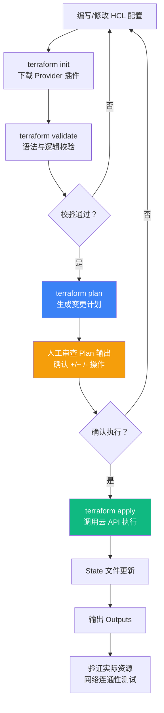
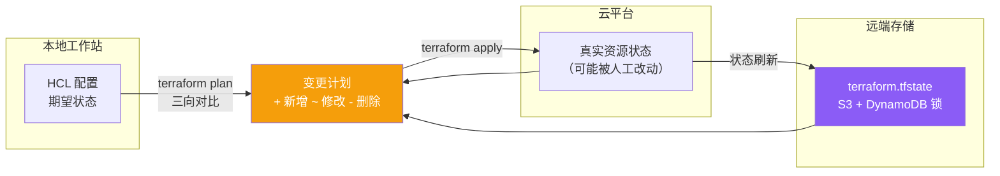
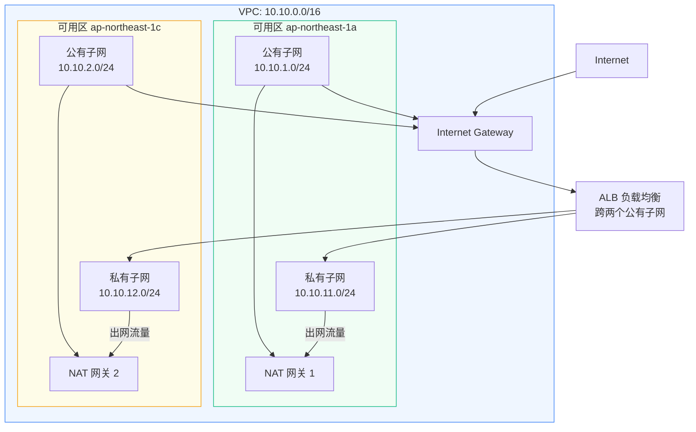
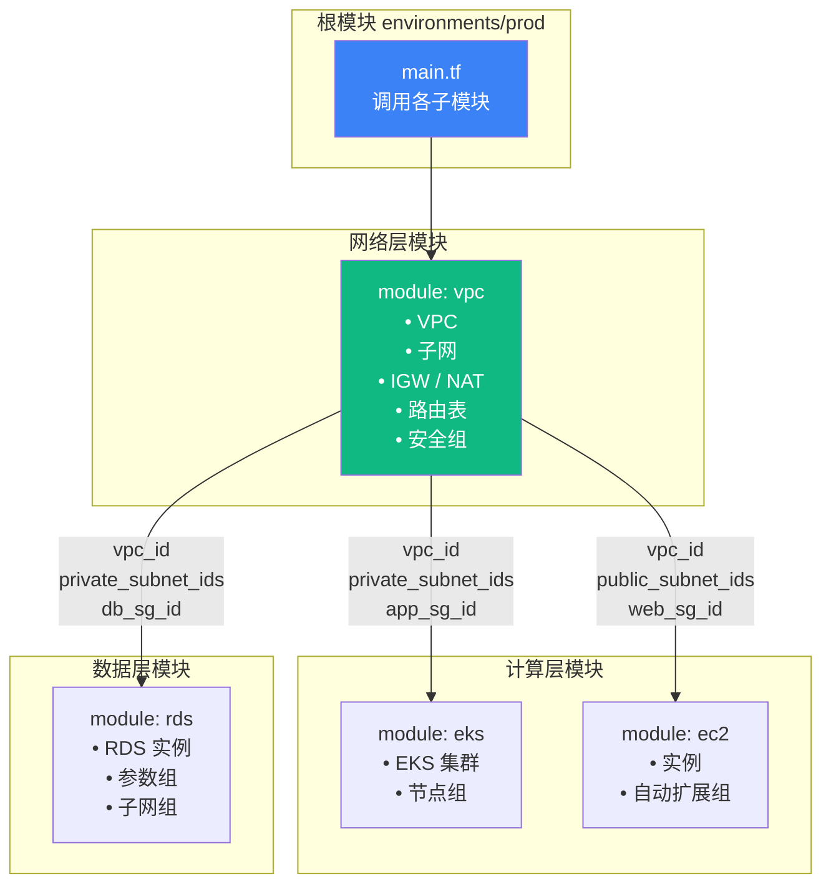
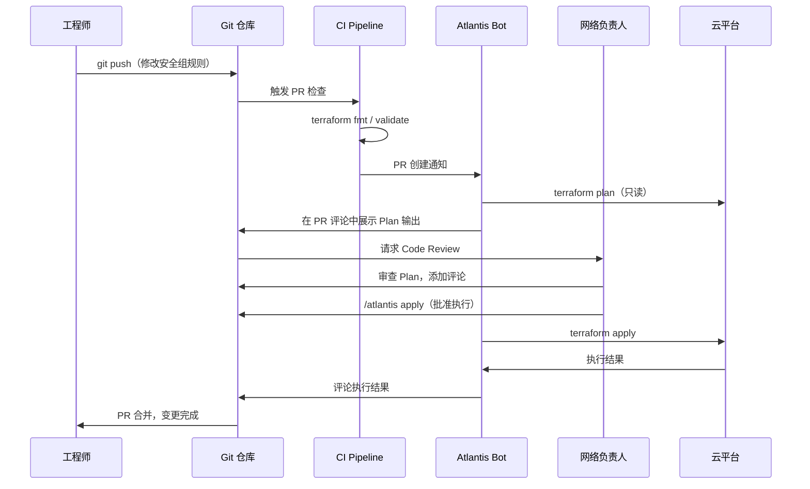

> 📋 **前置知识**：[云网络基础](/guide/cloud/hybrid-networking)、[网络CI/CD](/guide/automation/network-cicd)
> ⏱️ **阅读时间**：约18分钟

# 基础设施即代码：Terraform 网络资源管理

## 一、场景引入：当手动操作成为瓶颈

一家中型电商公司在大促前需要扩容网络：新增 3 个子网、调整 12 条安全组规则、在两个可用区各建一套负载均衡。运维团队用控制台操作了 4 小时，结果上线后发现其中一条路由表规则漏配，导致支付服务无法访问数据库——损失了将近两小时的销售额。

事后复盘，根源只有一个：**网络配置存在于控制台，不在代码里**。没有 diff，没有审查，没有回滚。

这正是基础设施即代码（Infrastructure as Code，IaC）要解决的问题。

---

## 二、IaC 理念：两个核心对立

### 2.1 命令式 vs 声明式

IaC 有两种编程范式，差异在"如何描述意图"：

| 维度 | 命令式（Imperative） | 声明式（Declarative） |
|------|---------------------|----------------------|
| 描述方式 | 描述**怎么做** | 描述**要什么** |
| 典型工具 | Ansible、Shell脚本 | Terraform、CloudFormation |
| 幂等性 | 需手动保证 | 引擎自动保证 |
| 并发处理 | 复杂 | 依赖图自动推导 |
| 状态感知 | 弱 | 强（State文件） |

命令式脚本示例（创建安全组）：

```bash
# 先检查是否存在，再决定是否创建——需要自己写逻辑
SG_ID=$(aws ec2 describe-security-groups \
  --filters "Name=group-name,Values=app-sg" \
  --query 'SecurityGroups[0].GroupId' --output text)

if [ "$SG_ID" == "None" ]; then
  aws ec2 create-security-group \
    --group-name app-sg \
    --description "Application security group"
fi
```

声明式 HCL（HashiCorp Configuration Language）示例：

```hcl
resource "aws_security_group" "app" {
  name        = "app-sg"
  description = "Application security group"
  vpc_id      = aws_vpc.main.id
}
# Terraform 自动判断：存在则跳过，不存在则创建，配置漂移则修正
```

### 2.2 可变基础设施 vs 不可变基础设施

```
可变（Mutable）：
  服务器/资源 → 就地修改 → 同一个资源跑了 3 年
  风险：配置累积漂移，"它在我机器上能跑"

不可变（Immutable）：
  旧资源 → 销毁 → 用新配置重建 → 蓝绿切换
  收益：每次部署都是干净状态，无历史包袱
```

Terraform 的网络资源管理通常介于两者之间：修改安全组规则属于就地更新（可变），替换 VPC CIDR 则必须销毁重建（不可变）。理解这个边界，能避免 `terraform apply` 意外触发网络中断。

::: warning 注意
修改 VPC 的 CIDR、子网的可用区等不可变属性，Terraform 会标注 `-/+`（destroy then create）。在生产环境执行前，务必仔细阅读 `plan` 输出。
:::

---

## 三、Terraform 核心原理拆解

### 3.1 五大核心概念

**Provider（提供商）**：Terraform 与云平台 API 之间的适配层。AWS、Azure、GCP 各有对应 provider，定义了可管理的资源类型。

**Resource（资源）**：被管理的基础设施对象，如 `aws_vpc`、`aws_subnet`。

**Data Source（数据源）**：只读查询现有资源，不创建，用于引用控制台手动创建的对象或跨模块传参。

**Variable（变量）** 与 **Output（输出）**：变量是输入参数，Output 是模块对外暴露的接口。

**State（状态文件）**：Terraform 的"账本"，记录现实世界与配置的映射关系，是实现幂等的基础。

### 3.2 Plan-Apply 工作流



**关键细节**：`plan` 阶段 Terraform 同时读取远端 State 和云 API 的实际状态，对比 HCL 期望状态，生成三向差异。这是声明式系统的精髓——**它不关心你之前做了什么，只关心现在应该是什么**。

### 3.3 State 文件与漂移检测

State 是 Terraform 最容易被误解的部分。它不仅记录资源 ID，更记录资源属性的完整快照。



::: danger 避坑
绝对不要手动编辑 `terraform.tfstate`。如果 State 与实际资源不同步，先用 `terraform refresh`（或 `terraform apply -refresh-only`）重新同步，而不是手动修改 JSON。
:::

**远端 State 配置（推荐生产方案）**：

```hcl
# backend.tf
terraform {
  backend "s3" {
    bucket         = "mycompany-tf-state"
    key            = "network/prod/terraform.tfstate"
    region         = "ap-northeast-1"
    encrypt        = true
    # DynamoDB 表实现状态锁，防止并发 apply 竞争
    dynamodb_table = "terraform-state-lock"
  }
}
```

---

## 四、网络资源管理实战

### 4.1 AWS VPC 完整架构

下面是一套生产级 VPC 配置，覆盖两个可用区的高可用网络架构：

```hcl
# variables.tf
variable "project" {
  description = "项目名称，用于资源命名"
  type        = string
  default     = "netmastery"
}

variable "environment" {
  description = "环境：prod / staging / dev"
  type        = string
}

variable "vpc_cidr" {
  description = "VPC CIDR 块"
  type        = string
  default     = "10.10.0.0/16"
}

variable "azs" {
  description = "使用的可用区列表"
  type        = list(string)
  default     = ["ap-northeast-1a", "ap-northeast-1c"]
}

variable "public_subnets" {
  description = "公有子网 CIDR"
  type        = list(string)
  default     = ["10.10.1.0/24", "10.10.2.0/24"]
}

variable "private_subnets" {
  description = "私有子网 CIDR"
  type        = list(string)
  default     = ["10.10.11.0/24", "10.10.12.0/24"]
}
```

```hcl
# vpc.tf
locals {
  name_prefix = "${var.project}-${var.environment}"
  common_tags = {
    Project     = var.project
    Environment = var.environment
    ManagedBy   = "terraform"
  }
}

resource "aws_vpc" "main" {
  cidr_block           = var.vpc_cidr
  enable_dns_hostnames = true
  enable_dns_support   = true

  tags = merge(local.common_tags, {
    Name = "${local.name_prefix}-vpc"
  })
}

# 公有子网：跨两个可用区
resource "aws_subnet" "public" {
  count             = length(var.public_subnets)
  vpc_id            = aws_vpc.main.id
  cidr_block        = var.public_subnets[count.index]
  availability_zone = var.azs[count.index]

  # 公有子网的 EC2 实例自动获取公网 IP
  map_public_ip_on_launch = true

  tags = merge(local.common_tags, {
    Name = "${local.name_prefix}-public-${count.index + 1}"
    Tier = "public"
  })
}

# 私有子网：跨两个可用区
resource "aws_subnet" "private" {
  count             = length(var.private_subnets)
  vpc_id            = aws_vpc.main.id
  cidr_block        = var.private_subnets[count.index]
  availability_zone = var.azs[count.index]

  tags = merge(local.common_tags, {
    Name = "${local.name_prefix}-private-${count.index + 1}"
    Tier = "private"
  })
}

# 互联网网关（Internet Gateway）
resource "aws_internet_gateway" "main" {
  vpc_id = aws_vpc.main.id

  tags = merge(local.common_tags, {
    Name = "${local.name_prefix}-igw"
  })
}

# NAT 网关：每个公有子网一个，实现私有子网出网
resource "aws_eip" "nat" {
  count  = length(var.public_subnets)
  domain = "vpc"

  tags = merge(local.common_tags, {
    Name = "${local.name_prefix}-nat-eip-${count.index + 1}"
  })
}

resource "aws_nat_gateway" "main" {
  count         = length(var.public_subnets)
  allocation_id = aws_eip.nat[count.index].id
  subnet_id     = aws_subnet.public[count.index].id

  depends_on = [aws_internet_gateway.main]

  tags = merge(local.common_tags, {
    Name = "${local.name_prefix}-nat-${count.index + 1}"
  })
}
```

```hcl
# routes.tf
# 公有路由表：默认路由指向 Internet Gateway
resource "aws_route_table" "public" {
  vpc_id = aws_vpc.main.id

  route {
    cidr_block = "0.0.0.0/0"
    gateway_id = aws_internet_gateway.main.id
  }

  tags = merge(local.common_tags, {
    Name = "${local.name_prefix}-rt-public"
  })
}

resource "aws_route_table_association" "public" {
  count          = length(var.public_subnets)
  subnet_id      = aws_subnet.public[count.index].id
  route_table_id = aws_route_table.public.id
}

# 私有路由表：每个 AZ 独立，出口走对应 NAT 网关
resource "aws_route_table" "private" {
  count  = length(var.private_subnets)
  vpc_id = aws_vpc.main.id

  route {
    cidr_block     = "0.0.0.0/0"
    nat_gateway_id = aws_nat_gateway.main[count.index].id
  }

  tags = merge(local.common_tags, {
    Name = "${local.name_prefix}-rt-private-${count.index + 1}"
  })
}

resource "aws_route_table_association" "private" {
  count          = length(var.private_subnets)
  subnet_id      = aws_subnet.private[count.index].id
  route_table_id = aws_route_table.private[count.index].id
}
```

### 4.2 安全组声明式管理

```hcl
# security-groups.tf

# Web 层安全组：对外暴露 80/443
resource "aws_security_group" "web" {
  name        = "${local.name_prefix}-sg-web"
  description = "Web tier: allow HTTP/HTTPS from Internet"
  vpc_id      = aws_vpc.main.id

  ingress {
    description = "HTTPS from Internet"
    from_port   = 443
    to_port     = 443
    protocol    = "tcp"
    cidr_blocks = ["0.0.0.0/0"]
  }

  ingress {
    description = "HTTP from Internet (redirect to HTTPS)"
    from_port   = 80
    to_port     = 80
    protocol    = "tcp"
    cidr_blocks = ["0.0.0.0/0"]
  }

  egress {
    from_port   = 0
    to_port     = 0
    protocol    = "-1"
    cidr_blocks = ["0.0.0.0/0"]
  }

  tags = merge(local.common_tags, { Name = "${local.name_prefix}-sg-web" })
}

# 应用层安全组：只允许来自 Web 层
resource "aws_security_group" "app" {
  name        = "${local.name_prefix}-sg-app"
  description = "App tier: allow traffic from web tier only"
  vpc_id      = aws_vpc.main.id

  ingress {
    description     = "From web tier"
    from_port       = 8080
    to_port         = 8080
    protocol        = "tcp"
    security_groups = [aws_security_group.web.id]
  }

  egress {
    from_port   = 0
    to_port     = 0
    protocol    = "-1"
    cidr_blocks = ["0.0.0.0/0"]
  }

  tags = merge(local.common_tags, { Name = "${local.name_prefix}-sg-app" })
}

# 数据库安全组：只允许来自应用层
resource "aws_security_group" "db" {
  name        = "${local.name_prefix}-sg-db"
  description = "DB tier: allow MySQL from app tier only"
  vpc_id      = aws_vpc.main.id

  ingress {
    description     = "MySQL from app tier"
    from_port       = 3306
    to_port         = 3306
    protocol        = "tcp"
    security_groups = [aws_security_group.app.id]
  }

  tags = merge(local.common_tags, { Name = "${local.name_prefix}-sg-db" })
}
```

::: tip 最佳实践
使用安全组 ID 引用（`security_groups`）而非 CIDR，可以避免硬编码 IP，让安全策略随实例动态生效。Terraform 会自动处理依赖顺序，确保被引用的安全组先创建。
:::

### 4.3 跨可用区高可用架构示意



---

## 五、模块化设计：网络基础设施的复用

### 5.1 模块封装原则

当同一套网络架构要服务 dev/staging/prod 三个环境时，复制粘贴 HCL 是噩梦——改一处要改三份，极易产生环境间的隐性差异。模块（Module）是 Terraform 的复用单元。

```
modules/
└── vpc/
    ├── main.tf        # 资源定义
    ├── variables.tf   # 输入接口
    ├── outputs.tf     # 输出接口
    └── versions.tf    # Provider 版本约束

environments/
├── prod/
│   ├── main.tf        # 调用 vpc 模块
│   ├── terraform.tfvars
│   └── backend.tf
├── staging/
│   └── main.tf
└── dev/
    └── main.tf
```

**模块的 outputs.tf**（对外暴露 ID）：

```hcl
# modules/vpc/outputs.tf
output "vpc_id" {
  description = "VPC ID"
  value       = aws_vpc.main.id
}

output "public_subnet_ids" {
  description = "公有子网 ID 列表"
  value       = aws_subnet.public[*].id
}

output "private_subnet_ids" {
  description = "私有子网 ID 列表"
  value       = aws_subnet.private[*].id
}

output "web_sg_id" {
  description = "Web 层安全组 ID"
  value       = aws_security_group.web.id
}

output "app_sg_id" {
  description = "应用层安全组 ID"
  value       = aws_security_group.app.id
}

output "db_sg_id" {
  description = "数据库层安全组 ID"
  value       = aws_security_group.db.id
}
```

**生产环境调用模块**：

```hcl
# environments/prod/main.tf
module "vpc" {
  # 从 Terraform Registry 锁定版本
  source  = "terraform-aws-modules/vpc/aws"
  version = "5.8.1"

  # 或引用本地模块
  # source = "../../modules/vpc"

  project     = "netmastery"
  environment = "prod"
  vpc_cidr    = "10.10.0.0/16"

  azs             = ["ap-northeast-1a", "ap-northeast-1c"]
  public_subnets  = ["10.10.1.0/24", "10.10.2.0/24"]
  private_subnets = ["10.10.11.0/24", "10.10.12.0/24"]
}

# 其他服务模块引用 VPC 输出
module "eks_cluster" {
  source = "../../modules/eks"

  vpc_id             = module.vpc.vpc_id
  private_subnet_ids = module.vpc.private_subnet_ids
}
```

### 5.2 模块化架构图



::: tip 最佳实践
优先使用 [Terraform Registry](https://registry.terraform.io/) 上的社区模块（如 `terraform-aws-modules/vpc/aws`），它们经过大量生产验证。但务必锁定版本号（`version = "5.x.x"`），避免自动升级破坏稳定配置。
:::

---

## 六、IaC 工具横向对比

| 特性 | Terraform | Pulumi | CloudFormation |
|------|-----------|--------|----------------|
| 配置语言 | HCL（领域专用语言） | Python/TypeScript/Go | YAML/JSON |
| 学习曲线 | 中 | 低（对开发者友好） | 高（YAML 冗长） |
| 多云支持 | 极强（1000+ Provider） | 强 | 仅 AWS |
| State 管理 | 需自行管理远端 State | 托管（Pulumi Cloud） | AWS 托管 |
| 测试能力 | Terratest（Go） | 原生单元测试 | CloudFormation Guard |
| 生态成熟度 | 最成熟 | 快速成长 | AWS 原生最稳定 |
| 适用场景 | 多云/混合云企业 | 开发者主导的团队 | 纯 AWS、重视稳定性 |
| 漂移检测 | `terraform plan` | `pulumi refresh` | CloudFormation Drift |
| 免费方案 | Terraform OSS | 有限免费 | 免费 |

**结论**：多云战略首选 Terraform，纯 AWS 且团队习惯 YAML 可选 CloudFormation，开发者团队偏好真实编程语言可考虑 Pulumi。

---

## 七、GitOps 实践：代码审查网络变更

### 7.1 GitOps 工作流

网络变更的风险等同于代码变更——都需要 Review、测试、审批。GitOps 将 Terraform 代码纳入 Git 工作流，实现"所有变更都有迹可查"。



### 7.2 Atlantis 配置示例

```yaml
# atlantis.yaml（项目根目录）
version: 3
projects:
  - name: network-prod
    dir: environments/prod
    workspace: default
    autoplan:
      when_modified:
        - "*.tf"
        - "../../modules/vpc/**/*.tf"
      enabled: true
    apply_requirements:
      - approved      # 至少一个审批
      - mergeable     # PR 无冲突

  - name: network-staging
    dir: environments/staging
    workspace: default
    autoplan:
      when_modified:
        - "*.tf"
      enabled: true
    apply_requirements:
      - mergeable     # 非生产环境无需审批
```

::: tip 最佳实践
为生产网络环境配置 `apply_requirements: [approved]`，强制要求网络团队负责人审查 Plan 输出后才能执行。这是将网络变更控制融入 ITIL 变更管理的轻量实现。
:::

---

## 八、企业级最佳实践

### 8.1 Workspace 多环境管理

Terraform Workspace（工作区）允许同一份代码管理多个环境的状态，隔离 State 文件：

```bash
# 创建并切换到 staging 工作区
terraform workspace new staging
terraform workspace select staging

# 查看当前工作区
terraform workspace show
```

在 HCL 中引用工作区名称：

```hcl
locals {
  # 根据工作区自动选择配置
  env_config = {
    default = {
      instance_class   = "db.t3.micro"
      multi_az         = false
      deletion_protection = false
    }
    staging = {
      instance_class   = "db.t3.small"
      multi_az         = false
      deletion_protection = false
    }
    prod = {
      instance_class   = "db.r6g.large"
      multi_az         = true
      deletion_protection = true
    }
  }
  env = local.env_config[terraform.workspace]
}
```

### 8.2 状态锁定：防止并发冲突

两个工程师同时执行 `terraform apply` 会导致 State 文件损坏。DynamoDB 提供分布式锁：

```hcl
# 远端 State 配置（含锁）
terraform {
  backend "s3" {
    bucket         = "mycompany-tf-state-prod"
    key            = "network/terraform.tfstate"
    region         = "ap-northeast-1"
    encrypt        = true
    kms_key_id     = "arn:aws:kms:ap-northeast-1:123456789:key/xxx"
    dynamodb_table = "terraform-state-lock"
    # 锁的 TTL：若进程异常退出，30 分钟后自动释放
  }
}
```

```hcl
# 创建 DynamoDB 锁表（一次性操作，独立管理）
resource "aws_dynamodb_table" "terraform_state_lock" {
  name         = "terraform-state-lock"
  billing_mode = "PAY_PER_REQUEST"
  hash_key     = "LockID"

  attribute {
    name = "LockID"
    type = "S"
  }

  tags = {
    Name      = "Terraform State Lock"
    ManagedBy = "terraform"
  }
}
```

### 8.3 敏感变量保护

网络配置中常涉及敏感信息（VPN 预共享密钥、数据库密码等），禁止写入 HCL 明文：

```hcl
# 声明敏感变量
variable "vpn_preshared_key" {
  description = "VPN 预共享密钥"
  type        = string
  sensitive   = true  # 标记后 plan/apply 输出中不显示值
}

variable "db_password" {
  description = "数据库密码"
  type        = string
  sensitive   = true
}
```

```bash
# 通过环境变量注入（不落盘）
export TF_VAR_vpn_preshared_key="$(aws secretsmanager get-secret-value \
  --secret-id prod/vpn/psk --query SecretString --output text)"

# 或通过 -var-file 引用加密文件（结合 SOPS/Vault）
terraform apply -var-file="secrets.tfvars.enc"
```

::: danger 避坑
永远不要将包含真实密钥的 `.tfvars` 文件提交到 Git，即使是私有仓库。应将敏感变量存储在 AWS Secrets Manager、HashiCorp Vault 或 CI/CD 平台的加密 Secret 中，在流水线执行时动态注入。
:::

### 8.4 漂移检测与修正

人工在控制台修改资源（"紧急变更"）会导致 State 与实际不符——称为配置漂移（Configuration Drift）。定期检测：

```bash
# 仅刷新 State，不执行变更
terraform apply -refresh-only

# 定期在 CI 中运行 plan，检测漂移
terraform plan -detailed-exitcode
# 退出码 0 = 无变更，1 = 错误，2 = 有变更（漂移）
```

在 GitHub Actions 中实现每日漂移检测：

```yaml
# .github/workflows/drift-detection.yml
name: Drift Detection
on:
  schedule:
    - cron: "0 9 * * 1-5"  # 工作日每天 9:00 UTC

jobs:
  detect-drift:
    runs-on: ubuntu-latest
    steps:
      - uses: actions/checkout@v4
      - uses: hashicorp/setup-terraform@v3
        with:
          terraform_version: "1.8.0"

      - name: Configure AWS credentials
        uses: aws-actions/configure-aws-credentials@v4
        with:
          role-to-assume: ${{ secrets.AWS_ROLE_ARN }}
          aws-region: ap-northeast-1

      - name: Terraform Plan (Drift Check)
        id: plan
        run: |
          cd environments/prod
          terraform init -input=false
          terraform plan -detailed-exitcode -out=plan.out 2>&1
        continue-on-error: true

      - name: Alert on Drift
        if: steps.plan.outputs.exitcode == '2'
        uses: actions/github-script@v7
        with:
          script: |
            github.rest.issues.create({
              owner: context.repo.owner,
              repo: context.repo.repo,
              title: '🚨 生产网络配置漂移检测到变化',
              body: '请检查 terraform plan 输出，确认是否有未经审批的手动变更。',
              labels: ['infrastructure', 'drift']
            })
```

---

## 九、认知升级：IaC 改变的不只是工具

从手动控制台到 Terraform 管理网络，表面上是换了工具，本质上是组织文化的转变：

**网络配置变成了 Pull Request**：每次安全组变更、每条路由调整，都有作者、时间戳、审查记录和回滚点。安全审计不再需要翻控制台操作日志。

**环境一致性从期望变成保证**：dev 和 prod 的 VPC 结构由同一份模块生成，差异仅在变量。"staging 能跑，prod 挂了"的问题大幅减少。

**网络基础设施具备了可测试性**：结合 [Terratest](https://terratest.gruntwork.io/)，可以用 Go 测试代码验证 VPC 的连通性、安全组规则的正确性——网络配置也可以有单元测试。

**灾难恢复从"希望"变成"流程"**：整套网络架构的代码在 Git 里，在新区域重建生产网络，理论上只需一条 `terraform apply`。

这是运维思维向工程思维的跃迁：**可靠性不来自谨慎操作，而来自可重复的流程**。

---

## 总结

| 实践要点 | 核心价值 |
|---------|---------|
| 声明式 HCL 描述网络资源 | 关注"是什么"而非"怎么做" |
| 远端 State + DynamoDB 锁 | 团队协作安全，防止并发冲突 |
| 模块化封装 VPC/安全组 | 环境复用，消除配置漂移 |
| GitOps + Atlantis PR 审查 | 网络变更有审计链，可追溯 |
| 敏感变量走 Secrets Manager | 零密钥落盘，合规第一道防线 |
| 每日漂移检测 CI 任务 | 及早发现手动变更，保持 State 权威 |

下一步：将 Terraform 与 [Ansible 自动化配置](/guide/automation/ansible-network) 结合，实现从网络资源创建到设备配置下发的全链路自动化。
