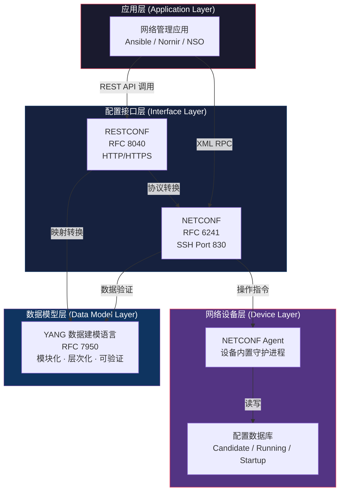
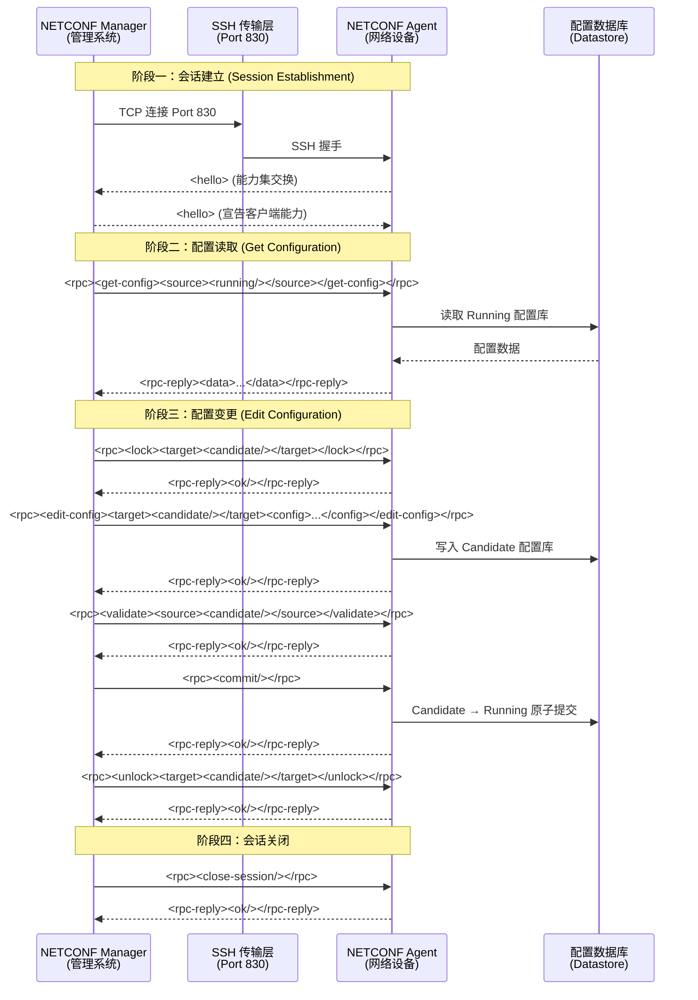
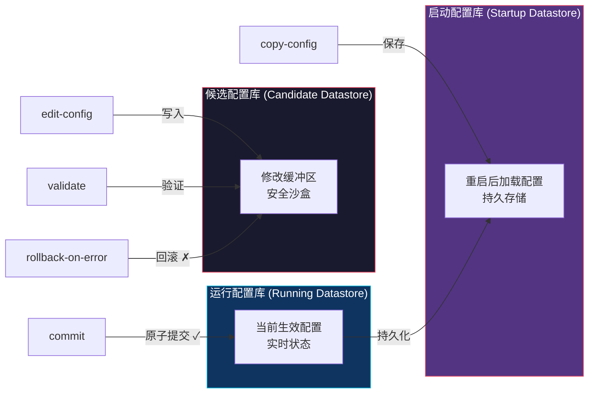
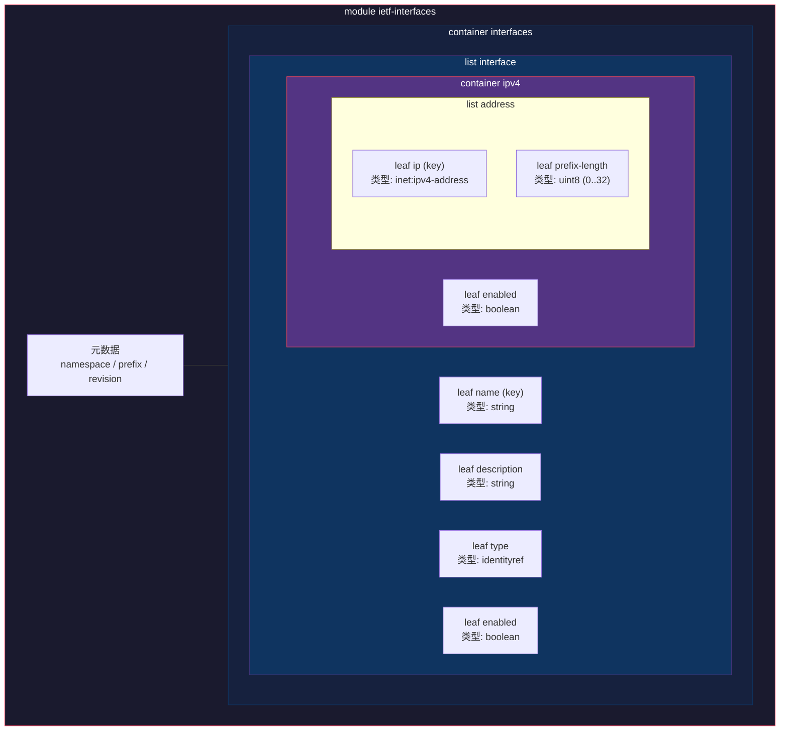
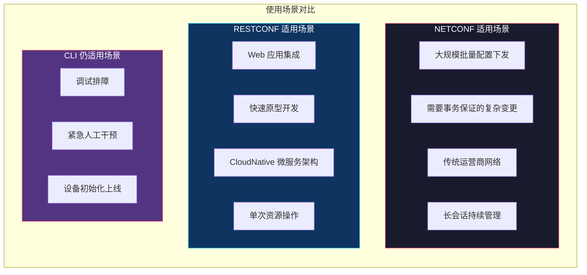
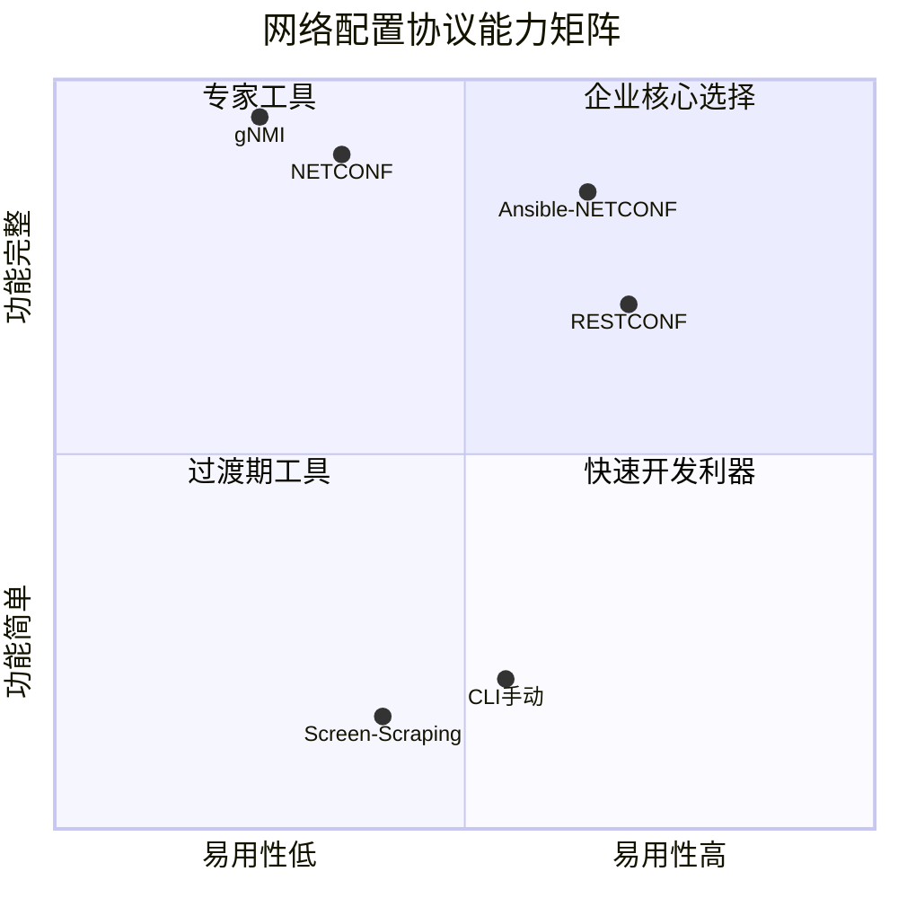

> 📋 **前置知识**：[OSI网络模型](/guide/basics/osi)、[网络运维基础](/guide/ops/monitoring)
> ⏱️ **阅读时间**：约18分钟

# NETCONF/YANG/RESTCONF：网络配置协议详解

---

## 第一部分：场景引入——CLI时代的配置之痛

### 一个真实的噩梦场景

2018年，某银行的网络团队负责管理跨越5个数据中心、来自思科 (Cisco)、华为、瞻博 (Juniper) 三家厂商的共计 324 台网络设备。某次大促备战需要对所有接入交换机的 QoS 策略进行统一变更。

工程师们的操作流程是：

```
1. 打开 Excel 维护设备 IP 清单
2. 用 SecureCRT 逐台 SSH 登录
3. 根据厂商不同，分别记忆不同的 CLI 语法
4. 复制粘贴配置命令，手工确认回显
5. 记录变更日志（经常忘记）
6. 三天后发现有12台设备配置遗漏
```

这不是极端案例，这是**传统 CLI (Command-Line Interface) 配置模式**的日常。它的问题是系统性的：

| 痛点维度 | 具体表现 |
|---------|---------|
| **多厂商异构** | Cisco `interface GigabitEthernet` vs Juniper `set interfaces ge-0/0/0` |
| **无法编程化** | CLI 是人机交互界面，不是 API，屏幕解析 (screen scraping) 极其脆弱 |
| **缺乏事务性** | 配置到一半设备宕机，处于不一致状态 |
| **版本控制缺失** | 没有 "撤销上一次变更" 的标准机制 |
| **验证滞后** | 推送后才知道配置错了 |

> 💡 **思考题**：如果你负责管理500台网络设备，每周需要变更30台，手动方式能保证零失误吗？自动化阈值在哪里？

正是这些痛点，推动了 IETF (Internet Engineering Task Force) 在 2006 年发布 **RFC 4741**，定义了 **NETCONF (Network Configuration Protocol)**，并在此后形成了 NETCONF + YANG + RESTCONF 的完整标准化配置协议栈。

---

## 第二部分：概念建模——三者的关系与分工

在深入每个协议之前，先建立整体的架构认知：



**核心关系**：
- **YANG** 是"语言"——定义数据的结构和约束（类比 JSON Schema 或 SQL DDL）
- **NETCONF** 是"协议"——定义如何传输和操作配置数据
- **RESTCONF** 是"接口风格"——用 HTTP REST 方式访问 NETCONF/YANG 管理的数据

三者协同，构成了一个**可编程的、自描述的、有事务保证的**网络配置体系。

---

## 第三部分：原理拆解

### 3.1 NETCONF 协议深度解析

#### Manager-Agent 架构

NETCONF 采用经典的**管理器-代理 (Manager-Agent)** 模型：



#### 三大配置数据库 (Datastore)

NETCONF 定义了三个配置存储库，这是理解其事务能力的关键：



::: tip 最佳实践
永远使用 **Candidate 配置库**作为变更缓冲区，配合 `validate` 操作在提交前验证，失败时触发 `rollback-on-error`。这是 NETCONF 事务能力的核心价值——相当于数据库的 BEGIN/COMMIT/ROLLBACK。
:::

#### NETCONF 核心操作 (Operations) 速查

| 操作 | RFC 标准 | 作用 |
|------|---------|------|
| `get` | RFC 6241 | 获取运行状态数据（含配置+状态） |
| `get-config` | RFC 6241 | 仅获取配置数据 |
| `edit-config` | RFC 6241 | 修改/创建/删除配置 |
| `copy-config` | RFC 6241 | 复制一个配置库到另一个 |
| `delete-config` | RFC 6241 | 删除配置库（不能删除 Running） |
| `lock` / `unlock` | RFC 6241 | 排他锁定配置库，防止并发冲突 |
| `validate` | RFC 6241 | 验证配置语法和语义 |
| `commit` | RFC 6241 | 将 Candidate 提交到 Running |
| `discard-changes` | RFC 6241 | 丢弃 Candidate 中的未提交变更 |
| `close-session` | RFC 6241 | 优雅关闭会话 |
| `kill-session` | RFC 6241 | 强制终止其他会话 |

::: warning 注意
`lock` 操作是**全局锁**，在锁定期间其他管理系统无法修改该配置库。在高可用场景中应使用**部分锁** (Partial Lock, RFC 5717) 或严格控制锁持有时间，避免影响并发运维。
:::

---

### 3.2 YANG 数据建模语言

#### 为什么需要数据模型

没有 YANG，NETCONF 传输的 XML 数据只是一堆字节流，管理系统不知道：
- 哪些字段是必填的？
- 取值范围是什么？
- 各节点的父子关系是什么？

**YANG (Yet Another Next Generation)** 定义了一套严格的数据描述语言，让设备能够"自描述"自己的配置结构。

#### YANG 模块核心结构



#### YANG 模块示例：接口配置

```yang
module ietf-interfaces {
  namespace "urn:ietf:params:xml:ns:yang:ietf-interfaces";
  prefix "if";
  revision "2018-02-20" {
    description "RFC 8343 更新版本";
  }

  container interfaces {
    description "设备接口列表";

    list interface {
      key "name";           // list 的键字段，必须唯一

      leaf name {
        type string;
        description "接口名称，如 GigabitEthernet0/0/0";
      }

      leaf description {
        type string;
        description "接口描述";
      }

      leaf type {
        type identityref {
          base interface-type;
        }
        mandatory true;     // 必填字段
      }

      leaf enabled {
        type boolean;
        default "true";     // 默认值
      }

      container ipv4 {
        if-feature "ipv4";  // 能力特性条件

        leaf enabled {
          type boolean;
          default "true";
        }

        list address {
          key "ip";
          leaf ip {
            type inet:ipv4-address-no-zone;
          }
          leaf prefix-length {
            type uint8 {
              range "0..32";  // 范围约束
            }
            mandatory true;
          }
        }
      }
    }
  }
}
```

#### 标准模型 vs 厂商原生模型

| 维度 | 标准模型 (IETF/OpenConfig) | 厂商原生模型 (Vendor-Native) |
|------|--------------------------|---------------------------|
| **来源** | IETF RFC / OpenConfig 工作组 | Cisco/Juniper/华为自定义 |
| **跨厂商兼容性** | ✅ 高，同一套代码适配多厂商 | ❌ 低，每家厂商独立代码 |
| **功能覆盖** | 基础功能（BGP、接口、OSPF） | 完整覆盖，含私有特性 |
| **代表模型** | `ietf-interfaces`, `ietf-routing` | `Cisco-IOS-XE-native`, `junos-config` |
| **推荐场景** | 多厂商混合环境、标准化运营 | 单厂商深度功能、精细化运营 |

::: tip 最佳实践
在企业架构设计中，优先使用 **IETF 或 OpenConfig 标准模型**覆盖基础配置（IP 地址、路由、BGP 基础参数），仅在需要厂商特有功能时才引入原生模型。这样可以在保持灵活性的同时最大化代码复用率。
:::

> 💡 **思考题**：OpenConfig 和 IETF YANG 模型都是标准化的，但两者有微妙差异。OpenConfig 是运营商驱动的，IETF 是协议标准化组织驱动的，在实际项目中你会如何选择？考虑哪些因素？

---

### 3.3 RESTCONF 协议

#### RESTCONF 的定位

**RESTCONF (RFC 8040)** 是一个基于 HTTP 的协议，它将 YANG 数据模型暴露为 REST API，让那些习惯 HTTP 而非 SSH+XML 的开发者也能操作网络设备。

**关键理解**：RESTCONF 不是 NETCONF 的替代品，而是其补充。两者共享同一套 YANG 数据模型，面向不同的使用场景：



#### RESTCONF CRUD 操作映射

| HTTP 方法 | NETCONF 对应操作 | 语义 |
|----------|----------------|------|
| `GET` | `get` / `get-config` | 读取资源 |
| `POST` | `edit-config` (create) | 创建新资源（键不存在时） |
| `PUT` | `edit-config` (replace) | 替换整个资源 |
| `PATCH` | `edit-config` (merge) | 部分更新资源 |
| `DELETE` | `edit-config` (remove) | 删除资源 |

#### RESTCONF 实战：curl 命令示例

**1. 获取设备接口列表**

```bash
# GET 请求，Accept 头指定返回格式（JSON 或 XML）
curl -X GET \
  'https://device.example.com/restconf/data/ietf-interfaces:interfaces' \
  -H 'Accept: application/yang-data+json' \
  -u admin:password \
  --insecure
```

响应示例：

```json
{
  "ietf-interfaces:interfaces": {
    "interface": [
      {
        "name": "GigabitEthernet0/0/0",
        "description": "WAN Uplink",
        "type": "iana-if-type:ethernetCsmacd",
        "enabled": true,
        "ietf-ip:ipv4": {
          "address": [
            {
              "ip": "192.168.1.1",
              "prefix-length": 24
            }
          ]
        }
      }
    ]
  }
}
```

**2. 创建新接口配置**

```bash
# POST 请求创建接口
curl -X POST \
  'https://device.example.com/restconf/data/ietf-interfaces:interfaces' \
  -H 'Content-Type: application/yang-data+json' \
  -H 'Accept: application/yang-data+json' \
  -u admin:password \
  --insecure \
  -d '{
    "ietf-interfaces:interface": {
      "name": "Loopback100",
      "description": "Management Loopback",
      "type": "iana-if-type:softwareLoopback",
      "enabled": true,
      "ietf-ip:ipv4": {
        "enabled": true,
        "address": [
          {
            "ip": "10.255.255.1",
            "prefix-length": 32
          }
        ]
      }
    }
  }'
```

**3. 修改接口描述（PATCH 部分更新）**

```bash
curl -X PATCH \
  'https://device.example.com/restconf/data/ietf-interfaces:interfaces/interface=GigabitEthernet0%2F0%2F0' \
  -H 'Content-Type: application/yang-data+json' \
  -u admin:password \
  --insecure \
  -d '{
    "ietf-interfaces:interface": {
      "name": "GigabitEthernet0/0/0",
      "description": "WAN Uplink - Updated"
    }
  }'
```

::: warning 注意
RESTCONF URL 中的接口名称包含 `/` 字符，需要进行 URL 编码：`/` → `%2F`。不同厂商对 URL 编码的处理存在差异，建议在开发时使用 Python `requests` 库或 Postman 自动处理编码，避免手动错误。
:::

::: danger 避坑
RESTCONF 使用 **HTTP PUT** 时是**完全替换**语义——如果你只想更改接口描述，但 PUT Body 没有包含 IP 地址，IP 地址会被删除！生产环境中对于部分字段更新，始终使用 **PATCH** 而非 PUT，并在操作前先 GET 验证当前状态。
:::

---

## 第四部分：实战关联——Python 自动化配置

### 4.1 工具生态概览

| 工具 | 语言/类型 | 主要用途 |
|------|---------|---------|
| **ncclient** | Python 库 | NETCONF 客户端，主流选择 |
| **yang-explorer** | Web GUI | 可视化浏览 YANG 模型树 |
| **pyang** | Python CLI | YANG 模块验证和格式转换 |
| **netmiko** | Python 库 | 多厂商 SSH，含 NETCONF 模式 |
| **Postman** | GUI 工具 | RESTCONF 接口调试 |
| **Ansible netconf 模块** | Ansible | NETCONF playbook 自动化 |
| **Cisco NSO** | 商业平台 | 企业级 NETCONF 编排器 |

### 4.2 ncclient 实战：Python 脚本配置接口

```python
#!/usr/bin/env python3
"""
使用 ncclient 通过 NETCONF 协议配置网络设备接口 IP 地址
适用于支持 NETCONF RFC 6241 的设备（Cisco IOS-XE、Juniper JunOS 等）
"""

from ncclient import manager
from ncclient.xml_ import to_ele
import xmltodict
import json
from contextlib import contextmanager

# 设备连接参数
DEVICE_PARAMS = {
    "host": "192.168.1.1",
    "port": 830,
    "username": "admin",
    "password": "SecurePassword123",
    "hostkey_verify": False,          # 生产环境应启用
    "device_params": {"name": "iosxe"}  # 厂商类型适配
}

# YANG 数据：配置接口 IP 地址的 XML 载荷
INTERFACE_CONFIG_XML = """
<config xmlns:xc="urn:ietf:params:xml:ns:netconf:base:1.0">
  <interfaces xmlns="urn:ietf:params:xml:ns:yang:ietf-interfaces">
    <interface>
      <name>GigabitEthernet0/0/1</name>
      <description>Link to Core Router</description>
      <type xmlns:ianaift="urn:ietf:params:xml:ns:yang:iana-if-type">
        ianaift:ethernetCsmacd
      </type>
      <enabled>true</enabled>
      <ipv4 xmlns="urn:ietf:params:xml:ns:yang:ietf-ip">
        <enabled>true</enabled>
        <address>
          <ip>10.0.1.1</ip>
          <prefix-length>30</prefix-length>
        </address>
      </ipv4>
    </interface>
  </interfaces>
</config>
"""


def get_device_capabilities(conn):
    """获取并打印设备支持的 NETCONF 能力集"""
    print("=== 设备能力集 (Device Capabilities) ===")
    for cap in conn.server_capabilities:
        # 过滤显示重要能力
        if any(kw in cap for kw in ["candidate", "rollback", "validate", "yang"]):
            print(f"  ✓ {cap}")
    print()


def get_running_interfaces(conn):
    """读取当前运行配置中的接口信息"""
    get_filter = """
    <filter type="subtree">
      <interfaces xmlns="urn:ietf:params:xml:ns:yang:ietf-interfaces">
        <interface/>
      </interfaces>
    </filter>
    """
    result = conn.get_config(source="running", filter=get_filter)
    # 将 XML 响应转换为 Python 字典
    data_dict = xmltodict.parse(result.xml)
    interfaces = (
        data_dict.get("rpc-reply", {})
                 .get("data", {})
                 .get("interfaces", {})
                 .get("interface", [])
    )
    if isinstance(interfaces, dict):
        interfaces = [interfaces]  # 单接口时转换为列表
    return interfaces


def configure_interface_with_transaction(conn, config_xml):
    """
    使用 Candidate 配置库实现带事务保证的接口配置
    流程: lock → edit-config → validate → commit / rollback → unlock
    """
    try:
        # Step 1: 锁定 Candidate 配置库
        print("1. 锁定 Candidate 配置库...")
        conn.lock(target="candidate")

        # Step 2: 将配置写入 Candidate 库
        print("2. 写入接口配置到 Candidate 库...")
        conn.edit_config(
            target="candidate",
            config=config_xml,
            error_option="rollback-on-error"  # 出错自动回滚
        )

        # Step 3: 验证配置合法性
        print("3. 验证配置语法和语义...")
        conn.validate(source="candidate")

        # Step 4: 原子提交到 Running 配置库
        print("4. 提交配置 (Commit)...")
        conn.commit()
        print("✅ 配置提交成功！")

    except Exception as e:
        print(f"❌ 配置失败，触发回滚: {e}")
        try:
            conn.discard_changes()
        except Exception:
            pass
        raise

    finally:
        # Step 5: 无论成功失败，都释放锁
        print("5. 释放 Candidate 锁...")
        try:
            conn.unlock(target="candidate")
        except Exception:
            pass


def main():
    print("=== NETCONF 自动化配置示例 ===\n")

    with manager.connect(**DEVICE_PARAMS) as conn:
        # 打印能力集
        get_device_capabilities(conn)

        # 读取配置前状态
        print("=== 配置变更前接口列表 ===")
        interfaces = get_running_interfaces(conn)
        for intf in interfaces:
            name = intf.get("name", "unknown")
            enabled = intf.get("enabled", "unknown")
            desc = intf.get("description", "(无描述)")
            print(f"  • {name} | enabled={enabled} | {desc}")
        print()

        # 执行带事务的配置下发
        print("=== 开始配置下发 ===")
        configure_interface_with_transaction(conn, INTERFACE_CONFIG_XML)
        print()

        # 读取配置后状态（验证变更生效）
        print("=== 配置变更后接口列表 ===")
        interfaces_after = get_running_interfaces(conn)
        for intf in interfaces_after:
            name = intf.get("name", "unknown")
            desc = intf.get("description", "(无描述)")
            ipv4 = intf.get("ipv4", {}).get("address", {})
            if isinstance(ipv4, dict):
                ip_info = f"{ipv4.get('ip')}/{ipv4.get('prefix-length')}"
            else:
                ip_info = "N/A"
            print(f"  • {name} | IP: {ip_info} | {desc}")


if __name__ == "__main__":
    main()
```

::: tip 最佳实践
在生产脚本中，始终将 `lock → edit-config → validate → commit` 包装在 `try/except/finally` 结构中，确保无论操作成功与否，`unlock` 都会被执行。孤立的配置库锁会阻塞其他自动化任务，在高频变更环境中可能引发级联故障。
:::

### 4.3 Ansible NETCONF 模块集成

```yaml
# playbook-netconf-interface.yml
---
- name: 通过 NETCONF 配置网络设备接口
  hosts: routers
  gather_facts: no
  connection: netconf

  tasks:
    - name: 读取当前接口配置
      netconf_get:
        filter: |
          <interfaces xmlns="urn:ietf:params:xml:ns:yang:ietf-interfaces">
            <interface/>
          </interfaces>
      register: current_config

    - name: 配置接口 IP 地址
      netconf_config:
        content: |
          <config>
            <interfaces xmlns="urn:ietf:params:xml:ns:yang:ietf-interfaces">
              <interface>
                <name>GigabitEthernet0/0/1</name>
                <enabled>true</enabled>
                <ipv4 xmlns="urn:ietf:params:xml:ns:yang:ietf-ip">
                  <address>
                    <ip>10.0.1.1</ip>
                    <prefix-length>30</prefix-length>
                  </address>
                </ipv4>
              </interface>
            </interfaces>
          </config>
        commit: yes
        validate: yes
```

---

## 第五部分：认知升级——从协议到网络自动化成熟度

### 5.1 网络自动化成熟度模型

企业在采用 NETCONF/YANG/RESTCONF 技术栈时，通常经历五个阶段：

| 成熟度等级 | 特征 | 典型工具 |
|----------|------|---------|
| **L0：人工操作** | 纯手工 CLI，无自动化 | SecureCRT, PuTTY |
| **L1：脚本辅助** | Expect/Paramiko 屏幕解析 | Python + Paramiko |
| **L2：标准化接口** | NETCONF/RESTCONF + YANG | ncclient, requests |
| **L3：声明式编排** | 意图驱动，幂等配置 | Ansible, Terraform |
| **L4：闭环自动化** | 自动检测→分析→修复 | NSO + 流媒体遥测 |

大多数国内企业处于 L1-L2 过渡阶段。NETCONF/YANG 是从 L1 跃升到 L2+ 的关键跨越。

### 5.2 流媒体遥测 (Streaming Telemetry) 与 YANG 的结合

NETCONF 的 `get` 操作是**拉取 (Pull)** 模式，对于实时监控需求效率较低。现代网络还引入了基于 YANG 数据模型的**流媒体遥测 (Streaming Telemetry)**：

- **协议**：gNMI (gRPC Network Management Interface) + gRPC
- **数据模型**：同样基于 YANG，与 NETCONF/RESTCONF 共享模型
- **模式**：设备主动推送 (Push)，支持采样间隔低至 1 秒
- **下游接收**：Kafka → InfluxDB → Grafana

这形成了完整的**配置 + 监控**闭环：NETCONF 下发配置，Telemetry 推送状态，两者共享同一套 YANG 数据模型定义。

### 5.3 NETCONF vs RESTCONF vs CLI 综合对比



> 💡 **思考题**：YANG 数据模型在 NETCONF、RESTCONF、gNMI 三个协议中都扮演核心角色。如果你要从零构建企业网络自动化平台，你会优先投入哪个协议栈的能力建设？不同规模、不同厂商构成的企业答案会一样吗？

### 5.4 学习路径建议

```
初学者
  ↓
掌握 YANG 基础语法（推荐 RFC 7950 + pyang 工具实践）
  ↓
用 ncclient 连接 Cisco DevNet 沙箱练习 NETCONF 操作
  ↓
用 curl/Postman 练习 RESTCONF CRUD
  ↓
用 Ansible netconf_config 模块实现幂等配置
  ↓
深入 OpenConfig 模型，实践跨厂商统一管理
  ↓
接触 gNMI + Streaming Telemetry，构建完整运维闭环
  ↓
高级用户
```

::: tip 最佳实践
**Cisco DevNet Sandbox** 提供免费的 IOS-XE、IOS-XR 沙箱环境，支持 NETCONF（端口 830）和 RESTCONF（HTTPS）。强烈建议在此环境中完成从零到实战的完整演练，无需真实硬件。访问 [developer.cisco.com/site/sandbox](https://developer.cisco.com/site/sandbox) 注册免费账号。
:::

---

## 总结

NETCONF/YANG/RESTCONF 协议栈代表了网络配置管理从"人工艺术"到"工程科学"的演进：

- **NETCONF** 提供了可靠、有事务保证的配置传输通道，解决了"怎么传"的问题
- **YANG** 提供了标准化、自描述的数据建模语言，解决了"传什么"的问题  
- **RESTCONF** 降低了 HTTP 生态开发者的接入门槛，解决了"谁来用"的问题

三者共同构建的体系，让网络配置管理从"每台设备手工操作"变为"声明式、幂等、可版本控制"的软件工程实践。

在云原生、SD-WAN 大规模部署的今天，掌握这一协议栈不只是技术加分项，而是网络工程师向**网络可靠性工程师 (NRE, Network Reliability Engineer)** 进阶的必备能力。

---

## 延伸阅读

- [RFC 6241 - NETCONF 协议](https://www.rfc-editor.org/rfc/rfc6241)
- [RFC 7950 - YANG 数据建模语言](https://www.rfc-editor.org/rfc/rfc7950)
- [RFC 8040 - RESTCONF 协议](https://www.rfc-editor.org/rfc/rfc8040)
- [OpenConfig 工作组官网](https://www.openconfig.net/)
- [ncclient 官方文档](https://ncclient.readthedocs.io/)
- [Cisco DevNet NETCONF 学习实验室](https://developer.cisco.com/learning/labs/intro-device-level-interfaces/)
