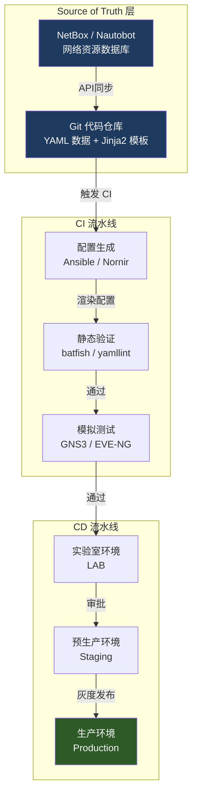
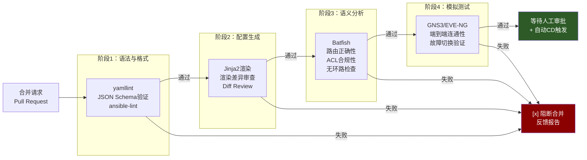
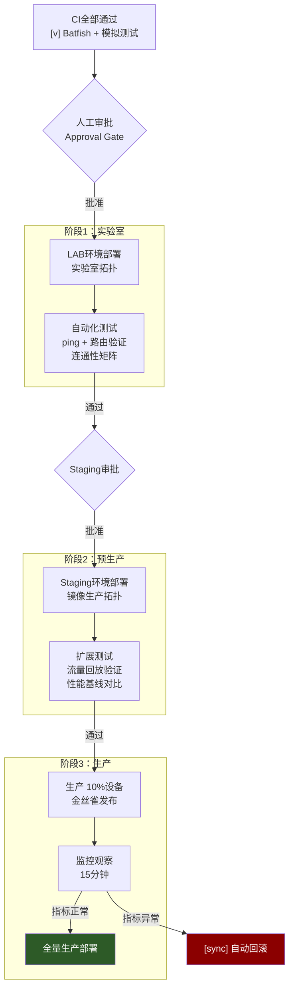
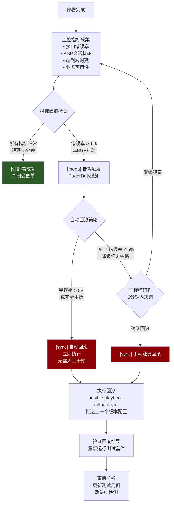

# 网络CI/CD：配置即代码的自动化流水线

> <Icon name="clipboard-list" color="cyan" /> **前置知识**：[Ansible网络自动化](/guide/automation/ansible-network)、[IaC网络管理](/guide/automation/iac-networking)
> ⏱ **阅读时间**：约18分钟

---

一次看似简单的VLAN变更，在传统流程下需要：填写变更申请单、等候变更委员会（CAB）周会审批、安排凌晨2点的变更窗口、网络工程师手动SSH登录十几台交换机逐一执行命令——最后因为某台设备配置笔误，引发生产故障，回滚又要再折腾两小时。

这不是极端案例，而是大多数企业网络运维的日常。软件工程用了十年时间用CI/CD（持续集成/持续部署）解决了代码部署的混乱，**网络运维现在正在经历同样的转型**。

---

## 第一层：理解问题——传统变更的结构性缺陷

### 变更窗口的代价

传统网络变更依赖三个假设：

1. **变更越少越安全**：把变更压缩到最低频率（每季度一次大版本）
2. **人工审核能发现错误**：CAB委员会的会议纪要能防止配置失误
3. **手工执行最可靠**：有经验的工程师不会出错

这三个假设在小规模网络里勉强成立。但当企业规模扩大到数百台设备、数千条配置项时，它们全部失效。

**真实数据**：根据网络可靠性研究，约75%的网络中断事件与变更操作直接相关，而在这些变更引发的故障中，超过60%源于人工输入错误——多打了一个字符、漏掉了一条ACL、在错误设备上执行了正确命令。

::: warning 变更窗口的悖论
"减少变更频率"并不能降低风险，反而会放大每次变更的爆炸半径。每次变更包含的改动越多，出错的概率越高，回滚越复杂。软件工程界早在2010年代就证明了这一点——持续小批量部署比低频大批量发布安全得多。
:::

### 网络运维的特殊挑战

与应用软件不同，网络配置有几个独特的困难：

- **实时性**：配置修改即刻生效，没有"申请上线后观察一段时间"的缓冲期
- **副作用传播**：BGP路由策略的一个改动可能影响整个AS（自治系统）的路由路径
- **环境差异**：实验室拓扑永远无法100%还原生产网络的流量、BGP邻居、策略继承关系
- **供应商多样性**：思科（Cisco）、华为（Huawei）、瞻博（Juniper）语法各异，自动化难度高

---

## 第二层：Network as Code架构设计

### 核心思路：配置的唯一真实来源

Network as Code（网络即代码，NaC）的核心主张是：**设备上的配置，永远是代码仓库的派生产物，而不是真实来源（Source of Truth）**。



### Git分支策略（Branch Strategy）

借鉴软件工程的GitFlow，网络CI/CD推荐如下分支模型：

```
main
  ├── 受保护分支，只接受经过完整CI/CD验证的合并请求
  ├── 每次合并即代表一次生产变更记录
  └── Git标签（Tag）标记每次变更版本

develop
  ├── 集成分支，汇集各特性分支
  └── 自动触发实验室环境部署

feature/vlan-100-add
feature/bgp-policy-update
feature/ospf-timer-tune
  ├── 工程师在特性分支（Feature Branch）上工作
  └── 提交合并请求（Merge Request / Pull Request）触发CI
```

### YAML数据模型设计

源数据（Source Data）用结构化YAML描述网络意图，而非直接编写设备命令：

```yaml
# inventory/vlans/datacenter-core.yaml
vlans:
  - id: 100
    name: "prod-app-tier"
    description: "生产应用层，承载微服务流量"
    subnet: "10.100.0.0/24"
    gateway: "10.100.0.1"
    assigned_switches:
      - sw-dc-core-01
      - sw-dc-core-02
      - sw-dc-leaf-01
    dhcp_enabled: true
    acl_inbound: "ACL_VLAN100_IN"
    acl_outbound: "ACL_VLAN100_OUT"

  - id: 200
    name: "prod-db-tier"
    description: "生产数据库层，严格访问控制"
    subnet: "10.200.0.0/24"
    gateway: "10.200.0.1"
    assigned_switches:
      - sw-dc-core-01
      - sw-dc-core-02
    dhcp_enabled: false
    acl_inbound: "ACL_VLAN200_STRICT_IN"
```

对应的Jinja2模板将数据渲染为思科IOS配置：

```jinja2
{# templates/cisco_ios/vlans.j2 #}

vlan {{ vlan.id }}
 name {{ vlan.name }}
!
interface Vlan{{ vlan.id }}
 description {{ vlan.description }}
 ip address {{ vlan.gateway }} {{ vlan.subnet | ipaddr('netmask') }}

 ip helper-address 10.0.0.53


 ip access-group {{ vlan.acl_inbound }} in


 ip access-group {{ vlan.acl_outbound }} out

 no shutdown
!

```

::: tip Jinja2 vs Jinja2 + Ansible
纯Jinja2模板适合配置生成；Ansible结合Jinja2则同时处理配置生成和推送。两者不互斥。对于大规模环境，推荐用Nornir（纯Python并发框架）替代Ansible以提升执行速度。
:::

---

## 第三层：CI流水线设计——变更上线前的质量门禁

CI（持续集成，Continuous Integration）流水线的任务是在代码合并之前尽可能多地发现问题。以下是四个核心检查阶段：



### 阶段1：语法验证

这是最廉价的检查，应该在30秒内完成：

```yaml
# .gitlab-ci.yml 片段
lint:
  stage: validate
  image: python:3.11-slim
  script:
    # YAML格式验证
    - pip install yamllint ansible-lint
    - yamllint -c .yamllint.yml inventory/
    # Ansible playbook语法检查
    - ansible-lint playbooks/
    # JSON Schema验证数据模型
    - python scripts/validate_schema.py inventory/vlans/
  rules:
    - if: '$CI_PIPELINE_SOURCE == "merge_request_event"'
```

`.yamllint.yml` 配置规范：

```yaml
extends: default
rules:
  line-length:
    max: 120
    level: warning
  truthy:
    allowed-values: ['true', 'false']
  comments:
    min-spaces-from-content: 1
```

### 阶段2：Batfish静态语义分析

Batfish是网络配置的静态分析工具，类似代码的类型检查器（Type Checker），它**不需要真实设备**就能分析路由行为：

```python
# scripts/batfish_analysis.py
from pybatfish.client.session import Session
from pybatfish.datamodel.flow import HeaderConstraints
import pandas as pd

bf = Session(host='batfish-server')
bf.set_network('dc-network')
bf.init_snapshot('configs/', name='pr-snapshot', overwrite=True)

# 检查1：确认路由可达性
print("=== 路由可达性分析 ===")
reachability = bf.q.reachability(
    pathConstraints=PathConstraints(startLocation='sw-dc-leaf-01'),
    headers=HeaderConstraints(
        srcIps='10.100.0.0/24',
        dstIps='10.200.0.0/24'
    )
).answer().frame()

# 检查2：ACL规则命中分析
print("=== ACL合规性检查 ===")
acl_result = bf.q.filterLineReachability().answer().frame()
unreachable_lines = acl_result[acl_result['Unreachable_Line'].notna()]
if not unreachable_lines.empty:
    print("发现不可达ACL规则（冗余或遮蔽）：")
    print(unreachable_lines[['Node', 'Filter', 'Unreachable_Line']])
    exit(1)

# 检查3：BGP路由策略一致性
print("=== BGP路由策略验证 ===")
bgp_peers = bf.q.bgpEdges().answer().frame()
bgp_sessions = bf.q.bgpSessionCompatibility().answer().frame()
incompatible = bgp_sessions[bgp_sessions['Established_Status'] != 'ESTABLISHED']
if not incompatible.empty:
    print("BGP会话兼容性问题：")
    print(incompatible)
    exit(1)

print("[v] Batfish分析全部通过")
```

::: tip Batfish的核心价值
Batfish能在零流量、无真实设备的情况下，分析变更后的路由收敛行为、ACL命中顺序、BGP路由泄露风险。它相当于给网络配置做了一次"编译器静态检查"，能在部署前发现人工审查难以发现的逻辑错误。
:::

### 阶段3：安全合规扫描

```yaml
# CI阶段：合规扫描
compliance-check:
  stage: security
  script:
    # 检查是否有Telnet配置（禁止明文协议）
    - |
      if grep -r "transport input telnet" configs/; then
        echo "[x] 发现Telnet配置，违反安全基线"
        exit 1
      fi
    # 检查默认凭证
    - python scripts/check_hardened_config.py configs/
    # 检查是否有未经授权的BGP邻居
    - python scripts/validate_bgp_peers.py configs/ inventory/allowed_peers.yaml
```

---

## 第四层：CD流水线设计——分级灰度发布

CD（持续部署，Continuous Deployment）流水线解决"如何安全地把通过验证的配置推到生产"的问题。关键原则是**分级发布（Staged Rollout）**：



### GitHub Actions完整流水线示例

```yaml
# .github/workflows/network-cicd.yml
name: Network CI/CD Pipeline

on:
  pull_request:
    branches: [main, develop]
    paths:
      - 'inventory/**'
      - 'templates/**'
      - 'playbooks/**'
  push:
    branches: [main]

env:
  BATFISH_HOST: ${{ secrets.BATFISH_HOST }}
  NETBOX_URL: ${{ secrets.NETBOX_URL }}
  NETBOX_TOKEN: ${{ secrets.NETBOX_TOKEN }}

jobs:
  # ===== CI阶段 =====
  lint:
    name: "语法与格式验证"
    runs-on: ubuntu-latest
    steps:
      - uses: actions/checkout@v4
      - name: Setup Python
        uses: actions/setup-python@v5
        with:
          python-version: '3.11'
      - name: Install dependencies
        run: pip install yamllint ansible-lint jsonschema
      - name: Run yamllint
        run: yamllint -c .yamllint.yml inventory/
      - name: Run ansible-lint
        run: ansible-lint playbooks/
      - name: Validate YAML Schema
        run: python scripts/validate_schema.py

  config-generate:
    name: "配置渲染与差异审查"
    needs: lint
    runs-on: ubuntu-latest
    steps:
      - uses: actions/checkout@v4
        with:
          fetch-depth: 0  # 获取完整历史用于diff
      - name: Generate configs from templates
        run: |
          pip install ansible jinja2 netaddr
          ansible-playbook playbooks/generate_configs.yml \
            -e "output_dir=configs/rendered/"
      - name: Generate config diff report
        run: |
          git diff HEAD~1 configs/rendered/ > /tmp/config_diff.txt
          python scripts/format_diff_report.py /tmp/config_diff.txt
      - name: Upload diff artifact
        uses: actions/upload-artifact@v4
        with:
          name: config-diff
          path: /tmp/config_diff.txt
      - name: Comment diff on PR
        uses: actions/github-script@v7
        with:
          script: |
            const fs = require('fs');
            const diff = fs.readFileSync('/tmp/config_diff.txt', 'utf8');
            github.rest.issues.createComment({
              issue_number: context.issue.number,
              owner: context.repo.owner,
              repo: context.repo.repo,
              body: `## 配置变更差异报告\n\`\`\`diff\n${diff.slice(0, 3000)}\n\`\`\``
            });

  batfish-analysis:
    name: "Batfish语义分析"
    needs: config-generate
    runs-on: ubuntu-latest
    services:
      batfish:
        image: batfish/batfish:latest
        ports:
          - 9997:9997
          - 9996:9996
    steps:
      - uses: actions/checkout@v4
      - name: Run Batfish analysis
        run: |
          pip install pybatfish pandas
          python scripts/batfish_analysis.py configs/rendered/
      - name: Upload Batfish report
        uses: actions/upload-artifact@v4
        with:
          name: batfish-report
          path: reports/batfish/

  # ===== CD阶段 =====
  deploy-lab:
    name: "部署到实验室环境"
    needs: batfish-analysis
    runs-on: self-hosted  # 需要访问实验室网络
    environment:
      name: lab
      url: https://netbox.lab.company.com
    if: github.ref == 'refs/heads/main'
    steps:
      - uses: actions/checkout@v4
      - name: Deploy to LAB
        run: |
          ansible-playbook playbooks/deploy.yml \
            -i inventory/lab/ \
            --diff \
            -e "target_env=lab"
      - name: Run post-deploy tests
        run: python scripts/network_tests.py --env lab --suite full

  deploy-staging:
    name: "部署到预生产环境"
    needs: deploy-lab
    runs-on: self-hosted
    environment:
      name: staging
      url: https://netbox.staging.company.com
    steps:
      - uses: actions/checkout@v4
      - name: Deploy to Staging
        run: |
          ansible-playbook playbooks/deploy.yml \
            -i inventory/staging/ \
            --diff \
            -e "target_env=staging"
      - name: Run extended test suite
        run: python scripts/network_tests.py --env staging --suite extended

  deploy-production:
    name: "部署到生产环境（金丝雀）"
    needs: deploy-staging
    runs-on: self-hosted
    environment:
      name: production
      url: https://netbox.prod.company.com
    steps:
      - uses: actions/checkout@v4
      - name: Canary deploy (10% devices)
        run: |
          ansible-playbook playbooks/deploy.yml \
            -i inventory/production/ \
            --limit "{{ groups['canary'] }}" \
            -e "target_env=production"
      - name: Monitor canary (15 min)
        run: python scripts/monitor_rollout.py --duration 900 --threshold 0.01
      - name: Full production deploy
        run: |
          ansible-playbook playbooks/deploy.yml \
            -i inventory/production/ \
            -e "target_env=production"
```

### 自动化网络测试脚本

```python
# scripts/network_tests.py
import subprocess
import sys
import yaml
from nornir import InitNornir
from nornir_netmiko.tasks import netmiko_send_command
from nornir_utils.plugins.functions import print_result

def run_connectivity_matrix(env: str) -> bool:
    """执行连通性矩阵测试（ping矩阵）"""
    with open(f'tests/{env}/connectivity_matrix.yaml') as f:
        matrix = yaml.safe_load(f)
    
    nr = InitNornir(config_file=f'nornir_{env}.yaml')
    failures = []
    
    for test in matrix['tests']:
        result = nr.filter(name=test['source']).run(
            task=netmiko_send_command,
            command_string=f"ping {test['destination']} repeat 5 source {test['source_ip']}"
        )
        
        output = list(result.values())[0][0].result
        success_rate = parse_ping_success(output)
        
        if success_rate < 100:
            failures.append({
                'test': f"{test['source']} -> {test['destination']}",
                'success_rate': success_rate
            })
    
    if failures:
        print("[x] 连通性测试失败：")
        for f in failures:
            print(f"  {f['test']}: {f['success_rate']}%")
        return False
    
    print(f"[v] 所有连通性测试通过 ({len(matrix['tests'])} 个测试点)")
    return True

def verify_routing_table(env: str) -> bool:
    """验证路由表符合预期"""
    with open(f'tests/{env}/expected_routes.yaml') as f:
        expected = yaml.safe_load(f)
    
    nr = InitNornir(config_file=f'nornir_{env}.yaml')
    
    for device_name, routes in expected.items():
        result = nr.filter(name=device_name).run(
            task=netmiko_send_command,
            command_string="show ip route"
        )
        routing_table = list(result.values())[0][0].result
        
        for route in routes:
            if route['prefix'] not in routing_table:
                print(f"[x] {device_name} 缺少预期路由: {route['prefix']}")
                return False
    
    print("[v] 路由表验证通过")
    return True

if __name__ == '__main__':
    env = sys.argv[sys.argv.index('--env') + 1]
    suite = sys.argv[sys.argv.index('--suite') + 1]
    
    tests = [run_connectivity_matrix(env), verify_routing_table(env)]
    
    if not all(tests):
        sys.exit(1)
    print(f"[v] {env} 环境所有测试通过")
```

---

## 第五层：回滚机制与实战案例

### 回滚决策流程



### 回滚实现：基于Git标签的版本管理

```yaml
# playbooks/rollback.yml
---
- name: 网络配置回滚
  hosts: "{{ target_hosts | default('all') }}"
  gather_facts: false
  
  vars:
    rollback_version: "{{ lookup('env', 'ROLLBACK_TO_VERSION') }}"
  
  tasks:
    - name: 检出指定版本配置
      delegate_to: localhost
      run_once: true
      shell: |
        git checkout {{ rollback_version }} -- configs/rendered/
      args:
        chdir: "{{ playbook_dir }}/.."

    - name: 推送回滚配置到设备
      cisco.ios.ios_config:
        src: "configs/rendered/{{ inventory_hostname }}.cfg"
      register: rollback_result

    - name: 验证回滚结果
      cisco.ios.ios_command:
        commands:
          - show ip interface brief
          - show ip bgp summary
      register: post_rollback_state

    - name: 记录回滚事件
      delegate_to: localhost
      run_once: true
      uri:
        url: "{{ netbox_url }}/api/extras/journal-entries/"
        method: POST
        headers:
          Authorization: "Token {{ netbox_token }}"
        body_format: json
        body:
          assigned_object_type: "dcim.device"
          kind: "warning"
          comments: |
            自动回滚执行
            回滚至版本: {{ rollback_version }}
            触发时间: {{ ansible_date_time.iso8601 }}
            触发原因: {{ rollback_reason | default('监控指标超阈值') }}
```

### 实战案例：VLAN 100 新增的完整CI/CD流程

以下是一个真实变更的完整生命周期记录：

**变更背景**：数据中心新增一个应用层VLAN（VLAN 100），需要在6台核心交换机上部署，涉及SVI接口、DHCP中继、ACL绑定三类配置。

| 阶段 | 耗时 | 操作 |
|------|------|------|
| 修改YAML数据文件 | 10分钟 | 工程师在feature分支添加vlan 100定义 |
| 提交PR，CI自动触发 | 0分钟 | Git push自动触发流水线 |
| yamllint + schema验证 | 45秒 | 通过 |
| Jinja2配置渲染 | 2分钟 | 生成6个设备配置文件，PR自动评论差异 |
| Batfish语义分析 | 4分钟 | 验证ACL逻辑、路由可达性，通过 |
| 网络模拟测试 | 8分钟 | GNS3环境端到端ping，通过 |
| 人工代码审查 | 15分钟 | 高级工程师确认YAML变更合理 |
| 合并PR，自动部署LAB | 3分钟 | 实验室6台设备配置推送完成 |
| LAB连通性测试 | 5分钟 | 30个测试点全部通过 |
| Staging部署 | 3分钟 | 自动 |
| 生产金丝雀发布（2台） | 5分钟 | 监控15分钟，指标正常 |
| 全量生产部署 | 4分钟 | 4台设备完成 |
| **总耗时** | **~60分钟** | 对比传统流程：1-2周 |

::: tip 变更频率的改变
采用CI/CD后，某大型电商的网络变更频率从平均每月8次提升到每天数十次，同时因变更引起的故障率下降了70%。更高的频率意味着每次变更更小、更可控、更容易回滚。
:::

::: warning ITSM集成注意事项
企业通常要求每次网络变更对应一个ServiceNow或Jira变更单（Change Request）。CI/CD流水线应通过API自动创建变更单，并在部署完成后自动关闭，避免"流水线绕过审计"的合规风险。GitLab和GitHub Actions均有成熟的ServiceNow集成插件。
:::

::: danger 生产自动化的红线
以下场景**禁止**完全自动化（CD），必须保留人工审批门禁：
- 核心路由器的BGP策略变更
- 防火墙规则的大范围修改
- 影响超过50%设备的拓扑变更
- 涉及互联网出口策略的任何修改

自动化加速的是**标准化的、低风险的变更**；高风险变更仍需要人的判断力。
:::

---

## 工具链全景

| 工具 | 类别 | 用途 | 推荐场景 |
|------|------|------|---------|
| **GitLab CI / GitHub Actions** | CI/CD引擎 | 流水线编排、触发、审批 | 通用 |
| **Ansible** | 配置管理 | 配置渲染与推送 | 多厂商混合环境 |
| **Nornir** | 配置管理 | 高并发Python自动化 | 大规模设备（100+） |
| **Batfish** | 静态分析 | 路由语义分析、ACL验证 | 所有CI流水线必备 |
| **NetBox / Nautobot** | Source of Truth | 网络资源数据库 | 新建体系首选Nautobot |
| **GNS3 / EVE-NG** | 网络模拟 | 变更前模拟验证 | 关键变更 |
| **yamllint** | 格式检查 | YAML语法验证 | 所有CI必备 |
| **Pytest + Nornir** | 测试框架 | 部署后自动化验证 | 所有CD必备 |

---

## 关键要点

1. **从YAML数据到设备配置的单向数据流**是Network as Code的核心——设备配置永远是派生产物，Git仓库是唯一真实来源。

2. **CI流水线的四层检查**（语法→渲染→Batfish语义→模拟）能在无真实设备的情况下发现超过80%的配置错误，大幅降低部署风险。

3. **分级发布（LAB→Staging→金丝雀→全量）**比一次性全量推送安全得多；每个阶段都有自动化测试守护。

4. **回滚不是失败，而是安全机制**。基于Git标签的版本管理让回滚可以在5分钟内完成，这比传统手工回滚快10倍以上。

5. **自动化与人工审批不对立**。高风险变更保留人工门禁，低风险标准化变更走全自动流水线——这才是成熟的分级治理策略。
