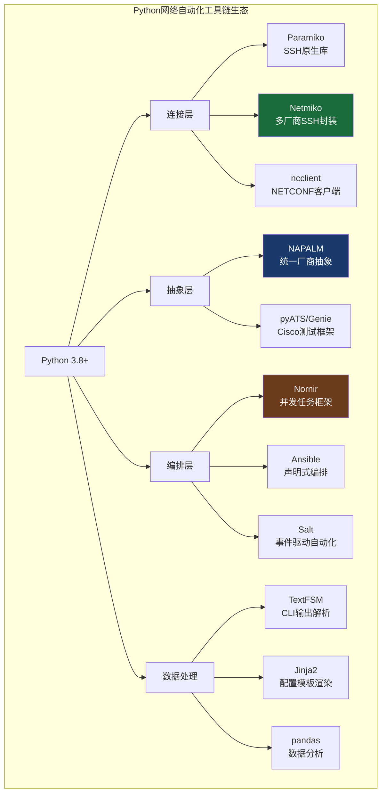
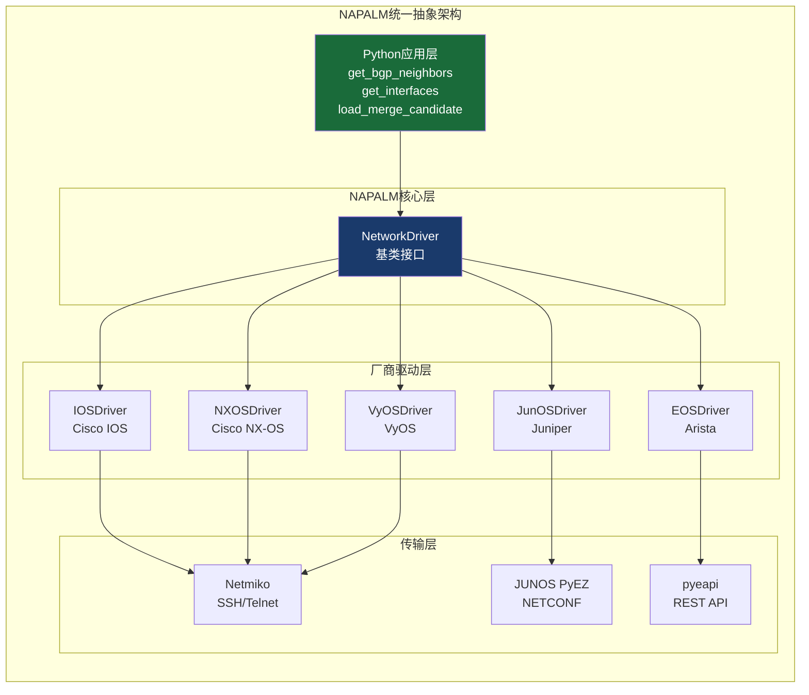
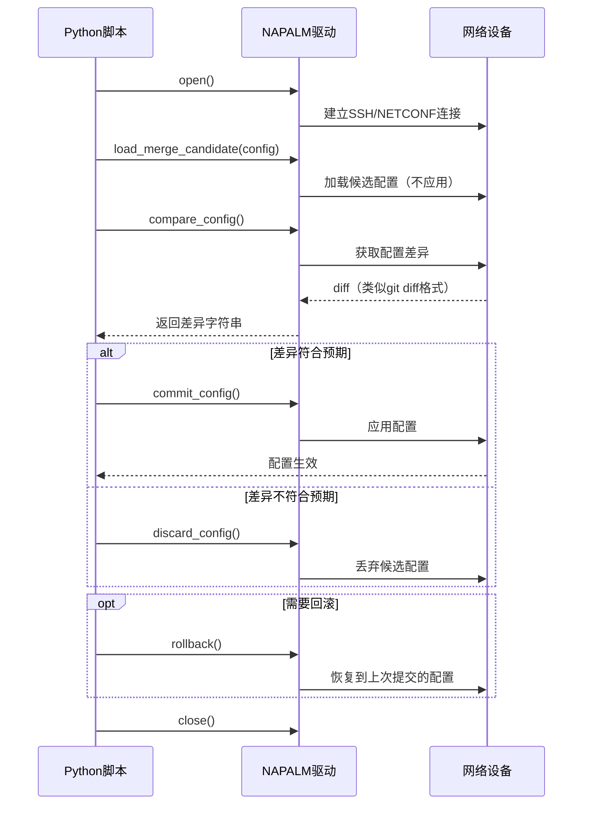
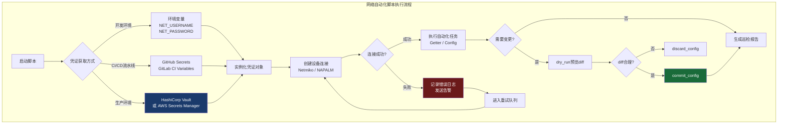

> 📋 **前置知识**：[网络运维基础](/guide/ops/monitoring)、[NETCONF/YANG](/guide/automation/netconf-yang)
> ⏱️ **阅读时间**：约20分钟

# Python网络编程：Netmiko与NAPALM实战

## 场景引入：一次凌晨3点的告警

凌晨3:17，监控告警：核心交换机集群12台设备的STP (Spanning Tree Protocol) 拓扑发生变化，BGP邻居抖动，业务中断风险红色预警。

传统做法：值班工程师一台台SSH登录，手动敲命令，抄录输出，逐一比对配置——12台设备，至少45分钟。

用Python自动化之后，同样的巡检脚本6秒钟返回所有设备的接口状态、BGP邻居、路由表摘要和配置变更对比。差距不在能力，在工具。

这正是本文要解决的问题：**如何用Python把重复的网络运维动作变成可复用的自动化脚本**。

---

## 一、Python在网络自动化中的地位

### 从Perl时代到Python生态

2000年代初，Perl是网络自动化的主流语言：`expect`脚本、正则解析`show`命令输出，代码可读性差、维护成本高。

Python从2010年前后逐渐取代Perl，核心原因有三：

- **丰富的库生态**：Paramiko → Netmiko → NAPALM → Nornir，整个工具链持续演进
- **文本处理能力**：TextFSM (TextFSM)、Genie解析器能结构化解析非结构化的CLI输出
- **社区标准化**：IETF的YANG模型配合Python绑定，让厂商接口差异变得可屏蔽



---

## 二、Netmiko：多厂商SSH连接的事实标准

### 为什么不直接用Paramiko？

Paramiko (Paramiko) 是Python的SSH库，功能完整但需要手动处理大量细节：

- 不同厂商的SSH协商参数不同（Cisco IOS的分页、Juniper的提示符）
- `enable`模式切换需要额外处理
- `show`命令的延迟超时难以统一设置
- 特殊字符转义各厂商不一致

Netmiko在Paramiko之上封装了这些差异，目前支持超过**80种**网络操作系统，包括：

| 厂商 | 支持设备类型 | device_type参数 |
|------|-------------|----------------|
| Cisco | IOS / IOS-XE | `cisco_ios` |
| Cisco | NX-OS | `cisco_nxos` |
| Cisco | ASA | `cisco_asa` |
| Juniper | JunOS | `juniper_junos` |
| Arista | EOS | `arista_eos` |
| HPE | Comware | `hp_comware` |
| Huawei | VRP | `huawei_vrp` |
| Palo Alto | PAN-OS | `paloalto_panos` |

### 安装与基础连接

```bash
pip install netmiko
# 推荐锁定版本
pip install netmiko==4.3.0
```

最简单的连接示例：

```python
from netmiko import ConnectHandler

device = {
    "device_type": "cisco_ios",
    "host": "192.168.1.1",
    "username": "admin",
    "password": "secret",
    "secret": "enable_secret",   # enable密码，可选
    "port": 22,
    "timeout": 30,
}

with ConnectHandler(**device) as conn:
    conn.enable()                          # 进入enable模式
    output = conn.send_command("show version")
    print(output)
```

`with`语句会在退出时自动断开连接，这是处理连接的推荐方式。

### 核心方法详解

#### `send_command`：读操作的主力

```python
with ConnectHandler(**device) as conn:
    # 基础用法
    output = conn.send_command("show ip interface brief")

    # 使用TextFSM自动解析（需要安装ntc-templates）
    parsed = conn.send_command(
        "show ip interface brief",
        use_textfsm=True
    )
    # parsed 是一个列表，每个元素是字典
    for intf in parsed:
        print(f"{intf['intf']}: {intf['ipaddr']} [{intf['status']}]")

    # 处理特殊分页提示
    output = conn.send_command(
        "show running-config",
        expect_string=r"#",     # 等待这个提示符
        read_timeout=90         # 大配置文件需要更长超时
    )
```

#### `send_config_set`：写操作的核心

```python
config_commands = [
    "interface GigabitEthernet0/1",
    "description Connected to Core Switch",
    "ip address 10.0.1.1 255.255.255.0",
    "no shutdown",
]

with ConnectHandler(**device) as conn:
    conn.enable()
    output = conn.send_config_set(config_commands)
    print(output)
    # 保存配置
    conn.save_config()
```

::: tip 最佳实践
`send_config_set`会自动进入和退出配置模式。如果需要更细粒度的控制，可以使用`config_mode()`和`exit_config_mode()`手动管理。
:::

#### `send_command_timing`：处理不确定延迟

```python
# 某些命令（如reload、write erase）需要确认，用timing版本
with ConnectHandler(**device) as conn:
    conn.enable()
    output = conn.send_command_timing(
        "copy running-config startup-config",
        delay_factor=2    # 乘以基础延迟时间
    )
    if "Destination filename" in output:
        output += conn.send_command_timing("\n")
```

### 实战：批量获取接口状态

```python
import json
from netmiko import ConnectHandler
from netmiko.exceptions import NetmikoTimeoutException, NetmikoAuthenticationException
import logging

logging.basicConfig(
    level=logging.INFO,
    format="%(asctime)s [%(levelname)s] %(message)s"
)
logger = logging.getLogger(__name__)


def get_interface_status(device_info: dict) -> dict:
    """获取单台设备的接口状态，返回结构化数据"""
    result = {
        "host": device_info["host"],
        "status": "success",
        "interfaces": [],
        "error": None,
    }

    try:
        with ConnectHandler(**device_info) as conn:
            parsed = conn.send_command(
                "show ip interface brief",
                use_textfsm=True
            )
            result["interfaces"] = parsed
            logger.info(f"[{device_info['host']}] 获取到 {len(parsed)} 个接口")

    except NetmikoTimeoutException:
        result["status"] = "timeout"
        result["error"] = f"连接超时：{device_info['host']}"
        logger.error(result["error"])

    except NetmikoAuthenticationException:
        result["status"] = "auth_failed"
        result["error"] = f"认证失败：{device_info['host']}"
        logger.error(result["error"])

    except Exception as e:
        result["status"] = "error"
        result["error"] = str(e)
        logger.error(f"[{device_info['host']}] 未知错误: {e}")

    return result


# 设备列表
devices = [
    {
        "device_type": "cisco_ios",
        "host": "192.168.1.1",
        "username": "admin",
        "password": "secret",
    },
    {
        "device_type": "cisco_nxos",
        "host": "192.168.1.2",
        "username": "admin",
        "password": "secret",
    },
]

results = [get_interface_status(d) for d in devices]
print(json.dumps(results, indent=2, ensure_ascii=False))
```

### 实战：批量配置VLAN

```python
def configure_vlan(device_info: dict, vlan_id: int, vlan_name: str) -> bool:
    """在单台设备上配置VLAN"""
    commands = [
        f"vlan {vlan_id}",
        f"name {vlan_name}",
        "exit",
    ]

    try:
        with ConnectHandler(**device_info) as conn:
            conn.enable()
            output = conn.send_config_set(commands)

            # 验证配置是否成功
            verify = conn.send_command(f"show vlan id {vlan_id}")
            if str(vlan_id) in verify and "active" in verify:
                conn.save_config()
                logger.info(f"[{device_info['host']}] VLAN {vlan_id} 配置成功")
                return True
            else:
                logger.warning(f"[{device_info['host']}] VLAN {vlan_id} 验证失败")
                return False

    except Exception as e:
        logger.error(f"[{device_info['host']}] VLAN配置异常: {e}")
        return False
```

### 并发连接：用ThreadPoolExecutor提速

串行连接10台设备，每台5秒，总计50秒。用线程池并发可以压缩到接近单台的时间。

```python
from concurrent.futures import ThreadPoolExecutor, as_completed
from typing import List


def batch_get_interface_status(
    devices: List[dict],
    max_workers: int = 10
) -> List[dict]:
    """并发获取多台设备接口状态"""
    results = []

    with ThreadPoolExecutor(max_workers=max_workers) as executor:
        future_to_device = {
            executor.submit(get_interface_status, device): device
            for device in devices
        }

        for future in as_completed(future_to_device):
            device = future_to_device[future]
            try:
                result = future.result(timeout=60)
                results.append(result)
            except Exception as e:
                logger.error(f"[{device['host']}] 并发任务异常: {e}")
                results.append({
                    "host": device["host"],
                    "status": "error",
                    "error": str(e)
                })

    return results
```

::: warning 注意
并发数量不要设得过高。每个Netmiko连接会占用一个SSH会话，设备通常有最大VTY线路数限制（Cisco IOS默认15条）。生产环境建议`max_workers`不超过设备VTY线路数的80%。
:::

---

## 三、NAPALM：统一抽象层的价值

### 问题：多厂商导致的代码爆炸

如果只用Netmiko，获取BGP邻居信息需要为每个厂商写不同的命令和解析逻辑：

```python
# Cisco IOS
output = conn.send_command("show ip bgp summary", use_textfsm=True)

# Juniper JunOS
output = conn.send_command("show bgp summary")  # 输出格式完全不同

# Arista EOS
output = conn.send_command("show ip bgp summary")  # 格式又不一样
```

项目规模扩大后，这种厂商差异会让代码变成一堆`if vendor == "cisco"`的判断。

NAPALM (Network Automation and Programmability Abstraction Layer) 解决了这个问题：**用统一的Python方法，屏蔽底层厂商差异**。



### 安装

```bash
pip install napalm
# 支持的驱动
pip install napalm[ios]       # Cisco IOS
pip install napalm[junos]     # Juniper（需要额外依赖）
pip install napalm[eos]       # Arista EOS
pip install napalm[nxos]      # Cisco NX-OS
```

### 基础连接

```python
import napalm

driver = napalm.get_network_driver("ios")  # 选择驱动

device = driver(
    hostname="192.168.1.1",
    username="admin",
    password="secret",
    optional_args={
        "secret": "enable_secret",
        "port": 22,
    }
)

device.open()
# ... 操作 ...
device.close()

# 或者使用上下文管理器（推荐）
with driver(hostname="192.168.1.1", username="admin", password="secret") as dev:
    facts = dev.get_facts()
    print(facts)
```

### Getter方法：标准化数据获取

所有NAPALM驱动都实现了相同的Getter接口，返回格式完全一致：

#### `get_facts`：设备基本信息

```python
facts = dev.get_facts()
# 返回格式：
# {
#     "vendor": "Cisco",
#     "model": "CSR1000V",
#     "os_version": "16.09.05",
#     "serial_number": "9KIBQAQ3OPE",
#     "hostname": "core-sw-01",
#     "fqdn": "core-sw-01.example.com",
#     "uptime": 86400,
#     "interface_list": ["GigabitEthernet1", "GigabitEthernet2", ...]
# }
```

#### `get_interfaces`：接口详情

```python
interfaces = dev.get_interfaces()
# {
#     "GigabitEthernet1": {
#         "is_up": True,
#         "is_enabled": True,
#         "description": "Uplink to Core",
#         "speed": 1000,
#         "mtu": 1500,
#         "mac_address": "FA:16:3E:57:33:61",
#         "last_flapped": 1619700000.0
#     },
#     ...
# }
```

#### `get_bgp_neighbors`：BGP邻居状态

```python
bgp = dev.get_bgp_neighbors()
# {
#     "global": {
#         "router_id": "10.0.0.1",
#         "peers": {
#             "10.0.0.2": {
#                 "local_as": 65001,
#                 "remote_as": 65002,
#                 "is_up": True,
#                 "is_enabled": True,
#                 "uptime": 86400,
#                 "address_family": {
#                     "ipv4": {
#                         "received_prefixes": 120,
#                         "sent_prefixes": 15,
#                         "accepted_prefixes": 120
#                     }
#                 }
#             }
#         }
#     }
# }
```

#### `get_arp_table`：ARP表

```python
arp_table = dev.get_arp_table()
# [
#     {
#         "interface": "GigabitEthernet1",
#         "mac": "FA:16:3E:00:00:01",
#         "ip": "192.168.1.100",
#         "age": 100.0
#     },
#     ...
# ]
```

### 配置管理：NAPALM的核心优势

NAPALM的配置管理流程设计参考了Juniper的候选配置模型 (Candidate Configuration Model)，能做到**预览变更、原子提交、一键回滚**。



#### 完整配置变更示例

```python
import napalm

def apply_config_safely(
    hostname: str,
    username: str,
    password: str,
    driver_name: str,
    new_config: str,
    dry_run: bool = True
) -> dict:
    """
    安全应用配置变更
    dry_run=True：只预览diff，不实际提交
    """
    driver = napalm.get_network_driver(driver_name)
    result = {
        "hostname": hostname,
        "status": "pending",
        "diff": "",
        "error": None,
    }

    try:
        with driver(hostname=hostname, username=username, password=password) as dev:
            # 加载新配置（merge模式：增量合并）
            dev.load_merge_candidate(config=new_config)

            # 获取差异
            diff = dev.compare_config()
            result["diff"] = diff

            if not diff.strip():
                result["status"] = "no_change"
                dev.discard_config()
                return result

            if dry_run:
                result["status"] = "dry_run_ok"
                dev.discard_config()
            else:
                dev.commit_config()
                result["status"] = "committed"
                logger.info(f"[{hostname}] 配置已提交")

    except Exception as e:
        result["status"] = "error"
        result["error"] = str(e)
        logger.error(f"[{hostname}] 配置应用失败: {e}")

    return result


# 使用示例
new_ntp_config = """
ntp server 10.0.0.1 prefer
ntp server 10.0.0.2
"""

result = apply_config_safely(
    hostname="192.168.1.1",
    username="admin",
    password="secret",
    driver_name="ios",
    new_config=new_ntp_config,
    dry_run=True  # 先预览
)

print(f"配置差异：\n{result['diff']}")

if result['status'] == 'dry_run_ok' and input("确认提交？(y/n): ") == "y":
    result = apply_config_safely(
        hostname="192.168.1.1",
        username="admin",
        password="secret",
        driver_name="ios",
        new_config=new_ntp_config,
        dry_run=False  # 真实提交
    )
```

::: tip 最佳实践
使用`load_replace_candidate`而非`load_merge_candidate`时要格外小心：replace模式会用新配置**完整替换**当前配置，遗漏关键行可能导致设备失联。生产环境建议始终先`dry_run=True`预览差异，并保留手动回滚通道。
:::

### 厂商支持矩阵

| Getter方法 | IOS | IOS-XR | NX-OS | JunOS | EOS |
|-----------|:---:|:------:|:-----:|:-----:|:---:|
| get_facts | ✅ | ✅ | ✅ | ✅ | ✅ |
| get_interfaces | ✅ | ✅ | ✅ | ✅ | ✅ |
| get_bgp_neighbors | ✅ | ✅ | ✅ | ✅ | ✅ |
| get_arp_table | ✅ | ✅ | ✅ | ✅ | ✅ |
| get_route_to | ✅ | ✅ | ✅ | ✅ | ✅ |
| get_lldp_neighbors | ✅ | ✅ | ✅ | ✅ | ✅ |
| get_mac_address_table | ✅ | ❌ | ✅ | ✅ | ✅ |
| load_replace_candidate | ✅ | ✅ | ✅ | ✅ | ✅ |
| rollback | ✅ | ✅ | ✅ | ✅ | ✅ |

---

## 四、Nornir：任务并发框架简介

当设备数量超过50台时，手写`ThreadPoolExecutor`开始变得繁琐。Nornir (Nornir) 是专为网络自动化设计的任务框架，内置并发、过滤和结果聚合。

```python
from nornir import InitNornir
from nornir_napalm.plugins.tasks import napalm_get
from nornir_utils.plugins.functions import print_result

# 初始化Nornir（从inventory文件读取设备列表）
nr = InitNornir(config_file="config.yaml")

# 过滤特定站点的设备
site_a = nr.filter(site="datacenter-a")

# 并发执行任务（默认20个worker）
result = site_a.run(
    task=napalm_get,
    getters=["get_facts", "get_interfaces"]
)

print_result(result)
```

Nornir的inventory支持多种后端：YAML文件、Ansible inventory、NetBox (NetBox)、Nautobot等，可以直接与你的CMDB (Configuration Management Database) 集成。

---

## 五、实战项目

### 项目一：网络设备巡检脚本（完整实现）

```python
#!/usr/bin/env python3
"""
网络设备巡检脚本
功能：并发获取所有设备的关键健康指标，生成报告
"""
import json
import os
from datetime import datetime
from concurrent.futures import ThreadPoolExecutor, as_completed
from typing import List, Dict, Any
import logging

import napalm
from netmiko.exceptions import NetmikoTimeoutException

logging.basicConfig(
    level=logging.INFO,
    format="%(asctime)s [%(levelname)s] %(name)s - %(message)s",
    handlers=[
        logging.StreamHandler(),
        logging.FileHandler(f"patrol_{datetime.now():%Y%m%d}.log"),
    ]
)
logger = logging.getLogger("network_patrol")

# 从环境变量读取凭证（生产环境必须，禁止硬编码）
DEFAULT_USERNAME = os.environ.get("NET_USERNAME", "")
DEFAULT_PASSWORD = os.environ.get("NET_PASSWORD", "")
DEFAULT_SECRET = os.environ.get("NET_SECRET", "")


def inspect_device(device_cfg: Dict[str, Any]) -> Dict[str, Any]:
    """
    巡检单台设备，返回健康报告
    """
    host = device_cfg["host"]
    driver_name = device_cfg.get("driver", "ios")
    username = device_cfg.get("username", DEFAULT_USERNAME)
    password = device_cfg.get("password", DEFAULT_PASSWORD)

    report = {
        "host": host,
        "timestamp": datetime.now().isoformat(),
        "status": "success",
        "facts": {},
        "interface_summary": {},
        "bgp_summary": {},
        "alerts": [],
        "error": None,
    }

    try:
        driver = napalm.get_network_driver(driver_name)
        with driver(
            hostname=host,
            username=username,
            password=password,
            optional_args={"secret": DEFAULT_SECRET, "timeout": 30},
        ) as dev:
            # 基本信息
            report["facts"] = dev.get_facts()

            # 接口汇总
            interfaces = dev.get_interfaces()
            down_intfs = [
                name for name, data in interfaces.items()
                if data["is_enabled"] and not data["is_up"]
            ]
            report["interface_summary"] = {
                "total": len(interfaces),
                "up": sum(1 for d in interfaces.values() if d["is_up"]),
                "down": len(down_intfs),
                "down_list": down_intfs,
            }

            # 告警：接口异常下线
            if down_intfs:
                report["alerts"].append({
                    "level": "WARNING",
                    "message": f"接口异常：{', '.join(down_intfs)} 管理启用但物理DOWN",
                })

            # BGP汇总
            try:
                bgp_data = dev.get_bgp_neighbors()
                global_bgp = bgp_data.get("global", {})
                peers = global_bgp.get("peers", {})
                down_peers = [
                    ip for ip, data in peers.items() if not data["is_up"]
                ]
                report["bgp_summary"] = {
                    "total_peers": len(peers),
                    "up": sum(1 for d in peers.values() if d["is_up"]),
                    "down_peers": down_peers,
                }
                if down_peers:
                    report["alerts"].append({
                        "level": "CRITICAL",
                        "message": f"BGP邻居DOWN：{', '.join(down_peers)}",
                    })
            except Exception:
                report["bgp_summary"] = {"note": "设备不支持BGP或无BGP配置"}

    except Exception as e:
        report["status"] = "error"
        report["error"] = str(e)
        logger.error(f"[{host}] 巡检失败: {e}")

    return report


def run_patrol(devices: List[Dict], max_workers: int = 20) -> List[Dict]:
    """并发巡检所有设备"""
    logger.info(f"开始巡检，设备数量: {len(devices)}，并发数: {max_workers}")
    start_time = datetime.now()
    reports = []

    with ThreadPoolExecutor(max_workers=max_workers) as executor:
        futures = {executor.submit(inspect_device, d): d for d in devices}
        for future in as_completed(futures):
            device = futures[future]
            try:
                report = future.result(timeout=90)
                reports.append(report)
            except Exception as e:
                reports.append({
                    "host": device["host"],
                    "status": "timeout",
                    "error": str(e),
                    "alerts": [],
                })

    elapsed = (datetime.now() - start_time).total_seconds()
    logger.info(f"巡检完成，耗时 {elapsed:.1f}s")

    # 打印告警汇总
    all_alerts = [
        {"host": r["host"], **alert}
        for r in reports
        for alert in r.get("alerts", [])
    ]
    if all_alerts:
        logger.warning(f"发现 {len(all_alerts)} 条告警：")
        for alert in sorted(all_alerts, key=lambda x: x["level"]):
            logger.warning(f"  [{alert['level']}] {alert['host']}: {alert['message']}")

    return reports


if __name__ == "__main__":
    # 设备列表示例（实际可从NetBox/CMDB接口获取）
    device_list = [
        {"host": "192.168.1.1", "driver": "ios"},
        {"host": "192.168.1.2", "driver": "nxos"},
        {"host": "192.168.1.3", "driver": "eos"},
    ]

    patrol_results = run_patrol(device_list)

    # 输出JSON报告
    report_file = f"patrol_report_{datetime.now():%Y%m%d_%H%M%S}.json"
    with open(report_file, "w", encoding="utf-8") as f:
        json.dump(patrol_results, f, indent=2, ensure_ascii=False)

    logger.info(f"报告已保存: {report_file}")
```

### 项目二：配置备份自动化

```python
#!/usr/bin/env python3
"""
配置备份脚本
功能：每日自动备份所有设备运行配置，保留30天历史
"""
import os
from pathlib import Path
from datetime import datetime, timedelta

import napalm


BACKUP_DIR = Path("./config_backups")
RETENTION_DAYS = 30


def backup_device_config(device_cfg: dict) -> bool:
    """备份单台设备配置"""
    host = device_cfg["host"]
    driver_name = device_cfg.get("driver", "ios")
    today = datetime.now().strftime("%Y%m%d")

    backup_path = BACKUP_DIR / host / f"{today}.cfg"
    backup_path.parent.mkdir(parents=True, exist_ok=True)

    # 如果今天已经备份，跳过
    if backup_path.exists():
        logger.info(f"[{host}] 今日已备份，跳过")
        return True

    try:
        driver = napalm.get_network_driver(driver_name)
        with driver(hostname=host, **device_cfg) as dev:
            config = dev.get_config(retrieve="running")
            running_config = config["running"]

            with open(backup_path, "w", encoding="utf-8") as f:
                f.write(running_config)

            logger.info(f"[{host}] 配置已备份: {backup_path} ({len(running_config)} 字节)")

            # 清理过期备份
            cleanup_old_backups(backup_path.parent, RETENTION_DAYS)
            return True

    except Exception as e:
        logger.error(f"[{host}] 备份失败: {e}")
        return False


def cleanup_old_backups(device_dir: Path, retention_days: int):
    """清理超过保留天数的备份文件"""
    cutoff = datetime.now() - timedelta(days=retention_days)
    for cfg_file in device_dir.glob("*.cfg"):
        try:
            file_date = datetime.strptime(cfg_file.stem, "%Y%m%d")
            if file_date < cutoff:
                cfg_file.unlink()
                logger.info(f"清理过期备份: {cfg_file}")
        except ValueError:
            pass  # 非日期格式文件名，跳过
```

### 项目三：合规检查脚本

```python
#!/usr/bin/env python3
"""
网络合规检查脚本
功能：检查设备是否符合安全基线要求
"""
from dataclasses import dataclass, field
from typing import List, Callable


@dataclass
class ComplianceCheck:
    """单项合规检查"""
    name: str
    description: str
    check_fn: Callable
    severity: str = "HIGH"  # HIGH / MEDIUM / LOW


@dataclass
class ComplianceResult:
    """合规检查结果"""
    host: str
    passed: List[str] = field(default_factory=list)
    failed: List[dict] = field(default_factory=list)

    @property
    def is_compliant(self) -> bool:
        return len(self.failed) == 0

    @property
    def score(self) -> float:
        total = len(self.passed) + len(self.failed)
        return len(self.passed) / total * 100 if total > 0 else 0.0


def check_ntp_configured(dev) -> bool:
    """检查NTP服务器是否配置"""
    config = dev.get_config(retrieve="running")["running"]
    return "ntp server" in config.lower()


def check_ssh_version(dev) -> bool:
    """检查是否仅使用SSH v2"""
    config = dev.get_config(retrieve="running")["running"]
    return "ip ssh version 2" in config


def check_no_telnet(dev) -> bool:
    """检查是否禁用Telnet"""
    config = dev.get_config(retrieve="running")["running"]
    # 检查VTY线路是否没有telnet，或明确只允许SSH
    return "transport input ssh" in config or "transport input none" in config


def check_logging_configured(dev) -> bool:
    """检查日志服务器配置"""
    config = dev.get_config(retrieve="running")["running"]
    return "logging host" in config


# 合规检查列表
COMPLIANCE_CHECKS = [
    ComplianceCheck(
        name="NTP配置",
        description="设备必须配置NTP服务器以同步时间",
        check_fn=check_ntp_configured,
        severity="HIGH",
    ),
    ComplianceCheck(
        name="SSH v2",
        description="管理访问必须使用SSH v2，禁止SSH v1",
        check_fn=check_ssh_version,
        severity="HIGH",
    ),
    ComplianceCheck(
        name="禁用Telnet",
        description="VTY线路必须禁用明文Telnet访问",
        check_fn=check_no_telnet,
        severity="CRITICAL",
    ),
    ComplianceCheck(
        name="日志配置",
        description="设备必须配置集中日志服务器",
        check_fn=check_logging_configured,
        severity="MEDIUM",
    ),
]


def run_compliance_check(device_cfg: dict) -> ComplianceResult:
    """对单台设备运行所有合规检查"""
    host = device_cfg["host"]
    driver_name = device_cfg.get("driver", "ios")
    result = ComplianceResult(host=host)

    try:
        driver = napalm.get_network_driver(driver_name)
        with driver(hostname=host, **device_cfg) as dev:
            for check in COMPLIANCE_CHECKS:
                try:
                    passed = check.check_fn(dev)
                    if passed:
                        result.passed.append(check.name)
                    else:
                        result.failed.append({
                            "check": check.name,
                            "description": check.description,
                            "severity": check.severity,
                        })
                except Exception as e:
                    result.failed.append({
                        "check": check.name,
                        "description": f"检查执行异常: {e}",
                        "severity": check.severity,
                    })
    except Exception as e:
        logger.error(f"[{host}] 合规检查连接失败: {e}")

    return result
```

---

## 六、最佳实践

### 凭证管理：永远不要硬编码密码



```python
import os
import hvac  # HashiCorp Vault客户端


def get_credentials_from_vault(
    vault_addr: str,
    vault_token: str,
    secret_path: str
) -> dict:
    """从Vault获取网络设备凭证"""
    client = hvac.Client(url=vault_addr, token=vault_token)
    secret = client.secrets.kv.v2.read_secret_version(path=secret_path)
    return secret["data"]["data"]


# 生产环境使用Vault
if os.environ.get("ENV") == "production":
    creds = get_credentials_from_vault(
        vault_addr=os.environ["VAULT_ADDR"],
        vault_token=os.environ["VAULT_TOKEN"],
        secret_path="network/cisco/credentials"
    )
else:
    # 开发环境使用环境变量
    creds = {
        "username": os.environ["NET_USERNAME"],
        "password": os.environ["NET_PASSWORD"],
    }
```

### 错误处理与重试机制

```python
from tenacity import (
    retry,
    stop_after_attempt,
    wait_exponential,
    retry_if_exception_type,
)
from netmiko.exceptions import NetmikoTimeoutException


@retry(
    retry=retry_if_exception_type(NetmikoTimeoutException),
    stop=stop_after_attempt(3),
    wait=wait_exponential(multiplier=1, min=4, max=30),
    reraise=True,
)
def connect_with_retry(device_cfg: dict):
    """带指数退避重试的连接函数"""
    return ConnectHandler(**device_cfg)
```

::: danger 避坑
**不要在重试逻辑中包含配置写入操作**。如果`commit_config`在写入后超时，你无法确定操作是否成功——重试可能导致配置被应用两次。对于写操作，失败后应记录状态、人工介入，而不是自动重试。
:::

### 日志记录：结构化日志方便分析

```python
import structlog

logger = structlog.get_logger()

# 结构化日志：每个字段可被日志系统索引
logger.info(
    "device_inspection_complete",
    host="192.168.1.1",
    duration_seconds=5.3,
    interfaces_down=2,
    bgp_peers_down=0,
    alerts_count=1,
)
```

结构化日志输出可以直接接入 ELK Stack (Elasticsearch + Logstash + Kibana) 或 Splunk，实现自动化运维的可观测性。

::: tip 最佳实践
**Python网络自动化的完整技术选型建议**：
- 连接层：**Netmiko**（CLI设备）+ **ncclient**（支持NETCONF的设备）
- 抽象层：**NAPALM**（多厂商环境，需要统一接口）
- 编排层：**Nornir**（大规模并发任务）或 **Ansible**（声明式配置管理）
- 数据源：**NetBox** 作为网络 CMDB，提供设备清单和IP管理
- 配置模板：**Jinja2** 渲染多厂商配置模板
- 凭证管理：**HashiCorp Vault** 或云厂商的 Secrets Manager
:::

---

## 七、认知升级：从脚本到平台

掌握Netmiko和NAPALM只是开始。真正的网络自动化平台需要考虑更多维度：

**可靠性**：脚本失败不能导致设备处于中间状态。NAPALM的事务性配置管理（预览→提交→回滚）是这个方向的正确思路。

**可观测性**：每次自动化操作都应该有完整的审计日志——谁在什么时间对哪台设备做了什么变更，变更前后的配置diff是什么。

**意图驱动**：下一步演进是从"执行命令"到"声明意图"。工程师描述"我要这个网段的东西流量优先级最高"，平台自动计算出跨厂商的QoS配置并推送。这是NetDevOps (Network Development and Operations) 的方向。

**与CI/CD集成**：把网络配置当作代码管理（Network as Code），变更经过代码审查、自动测试（在GNS3或Batfish上验证）、流水线部署，而不是工程师手工登录设备。

你现在写的每一个巡检脚本，都是朝这个方向走的一步。

---

## 参考资源

- [Netmiko官方文档](https://ktbyers.github.io/netmiko/)
- [NAPALM官方文档](https://napalm.readthedocs.io/)
- [Nornir官方文档](https://nornir.readthedocs.io/)
- [Network to Code ntc-templates](https://github.com/networktocode/ntc-templates)（TextFSM模板库）
- Kirk Byers的[Python for Network Engineers](https://pynet.twb-tech.com/)课程（Netmiko作者）
