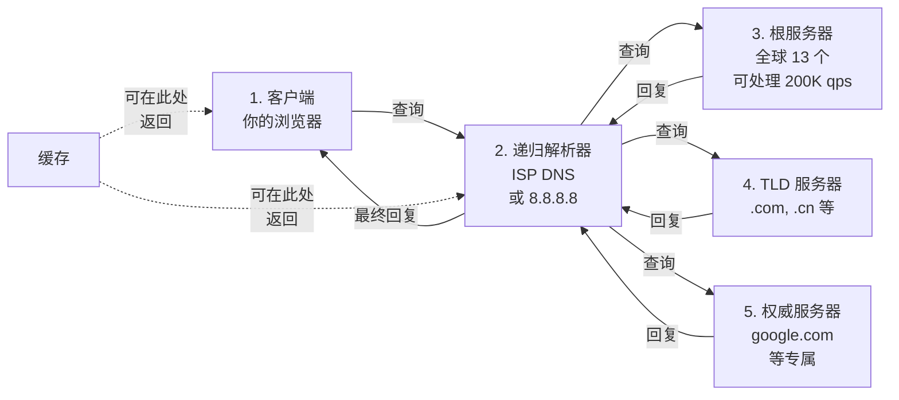
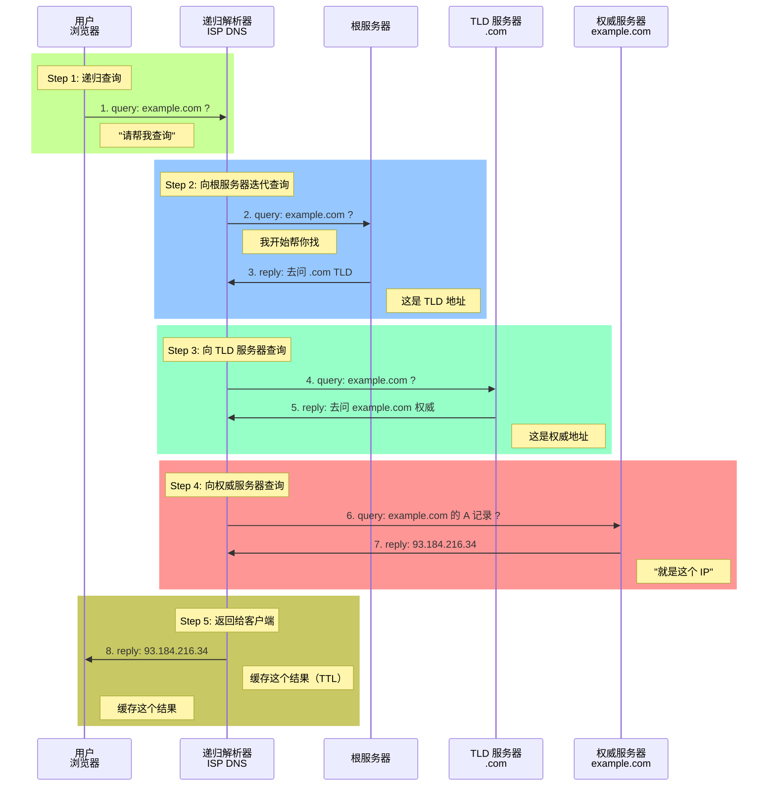
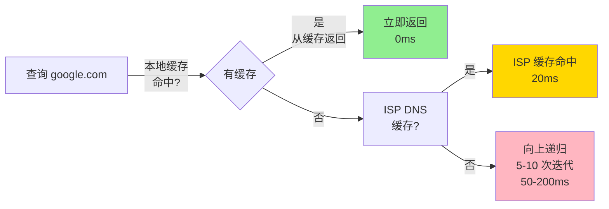

# DNS：互联网的电话簿与生命线

## 导言：DNS 是怎样的黑科技？

你知道一个事实吗？**互联网所有的可用性问题中，DNS 故障导致的宕机占比超过 30%**。

有人会问："不就是域名解析吗？这有什么难的？"

事实上，DNS 是整个互联网上最复杂的分布式系统之一。它要在 50 毫秒内，从根服务器、TLD 服务器、权威服务器、递归服务器、本地缓存中，找到 IP 地址。稍有错误，全球互联网就开始瘫痪。

---

## 第一部分：DNS 的分层架构

### 域名的树形结构

```
                    . (根)
                    |
        |-----------|-----------|
       .com         .cn         .org
        |           |           |
     google       baidu      wikipedia
        |           |           |
      www        news          en
```

**这个树形结构有什么妙处？**

如果域名是扁平的（所有域名由一个服务器管理），那么：

```
问题 1：单点故障
  一个服务器宕机 → 全球 DNS 查询失败

问题 2：负载无法分散
  1 亿个并发查询 → 一个服务器处理不了

问题 3：扩展性差
  新增域名需要通知全球所有人

树形结构解决了这些问题：
  ✓ 每个 TLD 只需知道自己的子域名
  ✓ 负载分散到全球数千个权威服务器
  ✓ 新增域名只需通知 TLD 服务器
```

### DNS 查询的五个关键角色



**关键统计**：

- **根服务器**：全球 13 个（但用任播技术，实际有 1000+ 个物理服务器）
- **TLD 服务器**：约 6,000 个（分布全球）
- **权威服务器**：数百万个（每个域名一个）
- **递归解析器**：你的 ISP、公共 DNS（8.8.8.8, 1.1.1.1）

---

## 第二部分：DNS 查询的完整过程



**为什么是这样的流程？**

如果递归解析器直接查询权威服务器，它怎么知道权威服务器的地址呢？答案是**逐层问**：

```
递归解析器没有 example.com 的权威服务器地址
↓
问根服务器："谁知道 .com 的信息？"
↓
根服务器回复："去问 TLD 服务器"（给出 IP 地址）
↓
递归解析器问 TLD 服务器："谁知道 example.com？"
↓
TLD 回复："去问权威服务器"（给出 IP 地址）
↓
递归解析器问权威服务器
↓
最终得到 IP 地址
```

---

## 第三部分：DNS 记录类型

```
A 记录：将域名映射到 IPv4 地址
  example.com → 93.184.216.34

AAAA 记录：将域名映射到 IPv6 地址
  example.com → 2606:2800:220:1:248:1893:25c8:1946

CNAME 记录：别名
  www.example.com → example.com
  含义：www.example.com 是 example.com 的别名，查询时最终指向 A 记录

MX 记录：邮件交换服务器
  example.com 的邮件发送到：mail.example.com（优先级 10）
  用于发送邮件

TXT 记录：文本信息（通常用于验证）
  用途 1：SPF（Sender Policy Framework）— 防止邮件欺骗
    "v=spf1 include:_spf.google.com ~all"
  用途 2：DKIM（DomainKeys Identified Mail）— 邮件签名验证
  用途 3：域名验证（SSL 证书申请时需要）

SRV 记录：服务记录
  _sip._udp.example.com SRV 10 60 5060 sipserver.example.com
  用于 SIP、Skype 等 VoIP 应用

NS 记录：名字服务器
  example.com 的权威服务器是 ns1.example.com 和 ns2.example.com
```

---

## 第四部分：DNS 缓存的艺术

缓存是 DNS 能够处理全球数亿级查询的关键。



### TTL（Time To Live）的陷阱

TTL 是缓存的生命周期，单位是秒。

```
TTL 太长的后果：
  假设 TTL = 86400（24 小时）
  
  T=0: 权威服务器更新 DNS 记录（A → B）
  T=0: 某人查询得到新 A 记录
  T=1: 另一个用户查询，得到缓存的旧 A 记录
  ...
  T=86400: ISP 缓存才过期
  
  问题：24 小时内，部分用户访问新 IP，部分访问旧 IP
  表现：网站看起来"有时能用，有时不能用"

TTL 太短的后果：
  假设 TTL = 1（1 秒）
  
  每秒都有新的 DNS 查询需要递归解析
  权威服务器 QPS（Queries Per Second）从 1000 增加到 100,000
  权威服务器负载增加 100 倍
  成本大幅增加

最佳实践：
  正常情况：TTL = 3600（1 小时）
  准备迁移：TTL = 300（5 分钟，提前 1 小时设置）
  迁移中：TTL = 300
  迁移完成：等 1 小时后，TTL 恢复到 3600
```

### DNS 缓存在不同层级的分布

```
用户电脑的 DNS 缓存（操作系统）
  ↑ 命中：1ms
  ↓ 未命中

浏览器的 DNS 缓存
  ↑ 命中：2ms
  ↓ 未命中

ISP DNS 解析器的缓存
  ↑ 命中：20ms
  ↓ 未命中

公共 DNS 的缓存（8.8.8.8）
  ↑ 命中：30ms
  ↓ 未命中

权威服务器
  ↓ 无缓存，直接回复：50-200ms
```

---

## 第五部分：DNS 的安全威胁

### DNS 劫持（DNS Hijacking）

```
攻击场景 1：DNS 服务器被黑客入侵
  
  正常流程：
    example.com → 93.184.216.34（真实 IP）
  
  被攻击后：
    example.com → 10.0.0.1（攻击者的服务器）
    用户访问攻击者的假网站
    输入用户名密码 → 被攻击者盗取
    
  防护：
    ✓ DNSSEC 对 DNS 记录签名
    ✓ 使用信誉好的权威 DNS 服务商
    ✓ 启用 2FA、HTTPS

### DNS 污染（DNS Spoofing）

  攻击方式：
    攻击者在网络中间截获 DNS 查询
    冒充权威服务器，发送虚假回复
    速度一定要快（通常在 100ms 内，在递归服务器收到真实回复之前）
  
  真实案例：
    GFW（中国防火墙）污染特定域名的 DNS 回复
    导致部分用户无法访问被墙网站
  
  防护：
    ✓ 使用加密 DNS（DoT、DoH）
    ✓ 使用信誉好的 DNS 服务商（如 Cloudflare 1.1.1.1）
    ✓ 企业内网用 DNSSEC

### DNS 放大攻击（DNS Amplification DDoS）

  原理：
    攻击者发送小查询到递归解析器
    递归解析器回复大回应（递归解析结果可能很大）
    如果有 10,000 个受害的递归解析器
    5KB 的查询被放大成 5GB 的流量
  
  防护：
    ✓ ISP 限制递归解析器只服务本网络用户
    ✓ 使用 DNS 防火墙过滤异常流量
```

---

## 第六部分：企业 DNS 设计

大型企业需要设计分层的 DNS 系统：

```
┌─────────────────────────────────────────┐
│        外部 DNS（互联网可见）           │
│    权威服务器：Amazon Route53/Cloudflare │
│    NS 记录指向：ns1.example.com 等      │
└─────────────────────────────────────────┘
              ↕ 需要同步
┌─────────────────────────────────────────┐
│    内部 DNS（仅内网可见）                │
│  • 内部 AD/LDAP 服务器（员工机器自动解析）
│  • 内部服务发现（Kubernetes 等）        │
│  • 分支机构本地缓存（降低 WAN 查询）     │
└─────────────────────────────────────────┘
              ↕ 最后的回源
┌─────────────────────────────────────────┐
│    Split-Horizon DNS                    │
│  内网用户查询 api.example.com            │
│    → 返回内部 IP（10.1.1.100）          │
│  互联网用户查询 api.example.com          │
│    → 返回外部 IP（93.184.216.34）       │
└─────────────────────────────────────────┘
```

**真实故障案例**：

某公司所有 DNS 记录都指向单一权威服务器。权威服务器所在机房故障（停电）。结果：

```
症状：
  T=0: 机房停电
  T=1: 权威 DNS 服务器离线
  T=2: 全球 DNS 缓存开始失效
  T=5min: ISP DNS 缓存开始回源，得不到回复
  T=10min: 用户新查询的域名都失败
  T=30min: 甚至已缓存的 TTL 过期的查询也失败
  
实际表现：
  网站突然无法访问（所有 DNS 查询都失败）
  邮件服务崩溃（MX 记录无法查询）
  VPN 无法连接（服务器地址需要 DNS 解析）

恢复时间：
  权威 DNS 从备用机房转移：45 分钟
  全球 DNS 缓存过期和刷新：6 小时
  总宕机时间：6 小时
  
损失：6 小时 × 平均 QPS 1 万 × 平均单请求价值 $0.001 ≈ $60,000
```

---

## 总结

DNS 看似简单（不就是域名转 IP 吗？），但其复杂性体现在：

1. **全球分布**：必须在 50ms 内处理，跨越 13 个根、6000 个 TLD、数百万权威
2. **可靠性**：不能有单点故障，否则互联网瘫痪
3. **性能**：需要精心设计缓存层级，从本地缓存到权威服务器
4. **安全性**：面临劫持、污染、DDoS 等多重威胁

**关键要点**：

- TTL 的选择对 DNS 迁移至关重要
- DNSSEC 和加密 DNS 是未来的方向
- 企业 DNS 必须分层设计，避免单点故障
- DNS 故障通常是"看不见"的（用户看不到 DNS，只看到"网络不可用"）

---

## 推荐阅读

- [网络故障诊断](../ops/packet-analysis.md)
- [HTTP 和 HTTPS](../basics/http.md)（下一章）