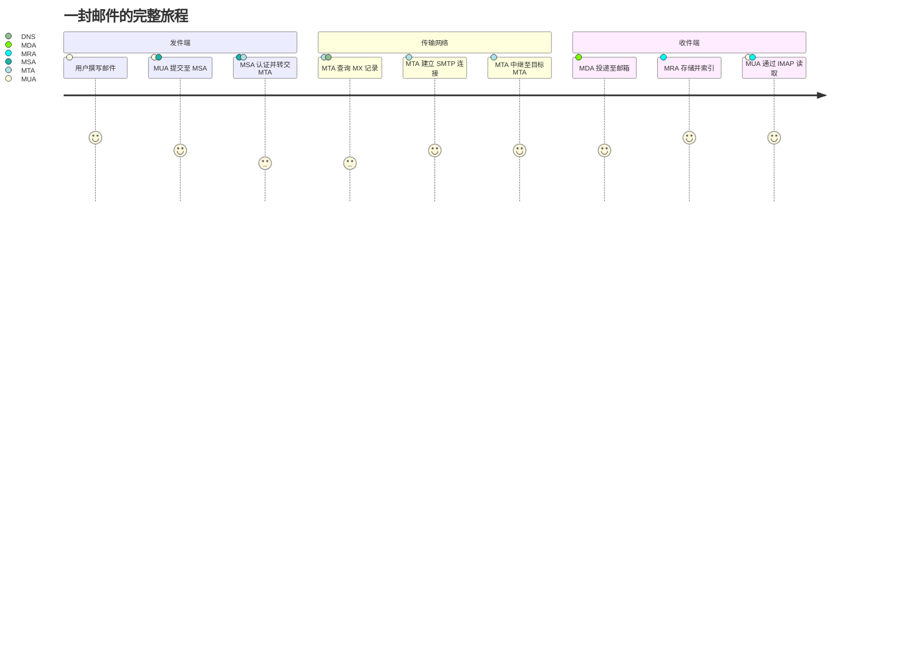
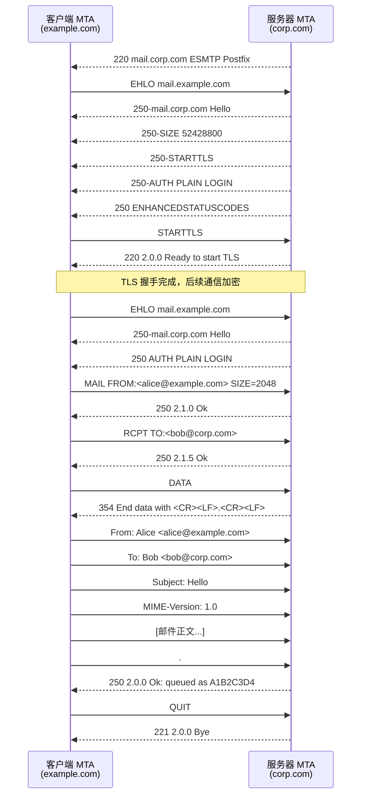
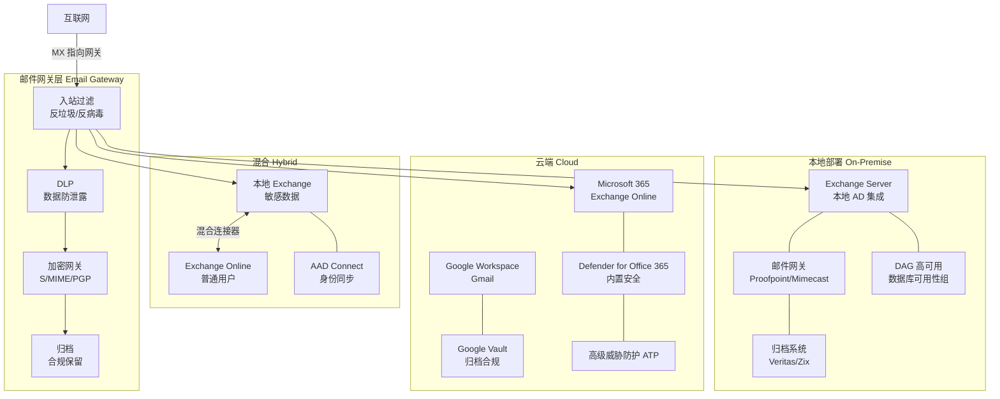

> <Icon name="clipboard-list" color="cyan" /> **前置知识**：[DNS协议](/guide/basics/dns)、[TLS加密](/guide/basics/tls)
> ⏱ **阅读时间**：约18分钟

# 邮件协议体系：SMTP、IMAP与反垃圾邮件机制

电子邮件是互联网最古老、使用最广泛的应用层协议之一。一封邮件从发件人键入"发送"到出现在收件人收件箱，要经过多个协议的接力配合——`SMTP` 负责传输、`IMAP/POP3` 负责访问、`SPF/DKIM/DMARC` 负责身份验证与防伪造。理解这套完整的协议体系，是构建可靠企业邮件基础设施的前提。

---

## 第一层：电子邮件的架构角色

在深入协议细节之前，需要厘清邮件系统的四类核心组件：

| 角色 | 英文全称 | 典型实现 | 功能 |
|------|----------|----------|------|
| **MUA** | Mail User Agent（邮件用户代理） | Outlook、Thunderbird、Apple Mail | 用户读写邮件的客户端 |
| **MSA** | Mail Submission Agent（邮件提交代理） | Postfix submission、Exchange | 接收 MUA 提交，进行认证和格式校验 |
| **MTA** | Mail Transfer Agent（邮件传输代理） | Postfix、Sendmail、Exchange Hub | 在服务器之间转发邮件（SMTP 中继） |
| **MDA** | Mail Delivery Agent（邮件投递代理） | Procmail、Dovecot LDA | 将邮件投递至本地邮箱 |
| **MRA** | Mail Retrieval Agent（邮件检索代理） | Dovecot IMAP/POP3 server | 响应客户端的邮件读取请求 |

### 邮件完整旅程



```mermaid
flowchart LR
    subgraph 发件方域 example.com
        A[[user] Alice\nMUA] -->|SMTP 587\nSTARTTLS| B[MSA\nsmtp.example.com]
        B -->|SMTP 25| C[MTA\n出站网关]
    end

    subgraph 互联网 DNS
        D[(DNS\nMX 查询)]
    end

    subgraph 收件方域 corp.com
        E[MTA\n入站网关] -->|本地投递| F[MDA\nDovecot LDA]
        F --> G[(邮箱\n/var/mail/bob)]
        G -->|IMAP 993| H[[user] Bob\nMUA]
    end

    C -->|查询 corp.com MX| D
    D -->|返回 mail.corp.com| C
    C -->|SMTP 25\nTLS| E
```

::: tip 为什么有 MSA 和 MTA 之分？
`MSA`（端口 587）专门接收经过认证的用户提交，可以实施速率限制和内容策略。`MTA`（端口 25）负责服务器间转发，通常不对外开放用户认证。将两者分离是现代邮件系统的最佳实践，可以防止开放中继（Open Relay）滥用。
:::

---

## 第二层：SMTP 协议深度解析

`SMTP`（Simple Mail Transfer Protocol，简单邮件传输协议）诞生于 1982 年（RFC 821），历经 RFC 2821（ESMTP）和 RFC 5321 的演进，至今仍是邮件传输的基础。

### SMTP 命令详解

| 命令 | 说明 | 示例 |
|------|------|------|
| `EHLO` | 扩展问候，声明服务器能力（替代旧版 HELO） | `EHLO mail.example.com` |
| `MAIL FROM` | 声明信封发件人（Envelope From） | `MAIL FROM:<alice@example.com>` |
| `RCPT TO` | 声明信封收件人，可多次使用 | `RCPT TO:<bob@corp.com>` |
| `DATA` | 开始传输邮件正文（以单独一行 `.` 结束） | `DATA` |
| `STARTTLS` | 将连接升级为 TLS 加密 | `STARTTLS` |
| `AUTH` | 进行 SMTP 身份认证 | `AUTH PLAIN` / `AUTH LOGIN` |
| `QUIT` | 结束会话 | `QUIT` |

### 完整 SMTP 会话序列



### SMTP 端口对比

| 端口 | 协议 | 用途 | 加密方式 |
|------|------|------|----------|
| **25** | SMTP | MTA 间服务器对服务器传输 | 明文 + STARTTLS（可选） |
| **465** | SMTPS | 客户端提交（历史遗留，已废弃但广泛使用） | TLS 隐式加密（Implicit TLS） |
| **587** | Submission | 客户端认证提交（推荐） | STARTTLS（强制升级） |

::: warning STARTTLS vs 隐式 TLS
`STARTTLS` 在明文连接上升级为 TLS（机会性加密），存在降级攻击风险（STRIPTLS 攻击）。`隐式 TLS`（端口 465/993/995）从连接建立之初就是加密的，安全性更高。现代部署推荐为客户端配置隐式 TLS 端口，服务器间传输配置 STARTTLS 并要求证书验证（MTA-STS）。
:::

---

## 第三层：MX 记录与邮件路由

### MX 记录工作原理

当 MTA 需要向 `bob@corp.com` 发送邮件时，它不会直接查询 `corp.com` 的 A 记录，而是查询 `MX 记录`（Mail Exchanger Record）：

```bash
# DNS 查询示例
$ dig corp.com MX

;; ANSWER SECTION:
corp.com.    300    IN    MX    10    mail1.corp.com.
corp.com.    300    IN    MX    20    mail2.corp.com.
corp.com.    300    IN    MX    30    backup-mx.example.net.
```

**MX 记录优先级规则**：
- 数值越**小**，优先级越**高**
- MTA 优先连接优先级最高的服务器
- 如果最高优先级服务器不可达，依次尝试优先级较低的服务器
- 相同优先级的记录进行负载均衡（随机选择）

```mermaid
flowchart TD
    A[MTA 需要发送邮件\n至 bob@corp.com] --> B{查询 DNS\ncorp.com MX}

    B --> C[MX 10 mail1.corp.com\nMX 20 mail2.corp.com\nMX 30 backup.corp.com]

    C --> D{连接 mail1.corp.com:25}

    D -->|连接成功| E[[v] 通过 mail1 投递]
    D -->|连接失败/超时| F{连接 mail2.corp.com:25}

    F -->|连接成功| G[[v] 通过 mail2 投递]
    F -->|连接失败| H{连接 backup.corp.com:25}

    H -->|连接成功| I[[v] 通过 backup 投递]
    H -->|全部失败| J[[x] 邮件进入重试队列\n返回 4xx 临时错误\n最长重试 4-5 天]

    style E fill:#22c55e,color:#fff
    style G fill:#22c55e,color:#fff
    style I fill:#22c55e,color:#fff
    style J fill:#ef4444,color:#fff
```

::: tip 空 MX 记录（Null MX）
RFC 7505 定义了空 MX 记录：`example.com. IN MX 0 .`，表示该域名不接受邮件。这可以防止发件方 MTA 退回到 A 记录查找，避免将邮件误投递至 Web 服务器。
:::

---

## 第四层：邮件访问协议

邮件传输到达收件服务器后，用户需要通过`邮件访问协议`从服务器读取邮件。

### IMAP vs POP3 对比

| 特性 | IMAP4（RFC 3501） | POP3（RFC 1939） |
|------|-------------------|-----------------|
| **设计理念** | 在线协议，邮件存储在服务器 | 下载协议，邮件下载到本地 |
| **端口** | 143（STARTTLS）/ 993（TLS） | 110（STARTTLS）/ 995（TLS） |
| **多设备支持** | 完美支持，服务器端同步 | 不支持（邮件被删除） |
| **文件夹管理** | 服务器端文件夹，全客户端可见 | 仅本地文件夹 |
| **邮件状态** | 已读/未读/标记同步 | 无状态同步 |
| **离线访问** | 支持（IMAP IDLE + 本地缓存） | 天然支持（本地存储） |
| **服务器存储** | 高（所有邮件留在服务器） | 低（邮件可删除） |
| **适用场景** | 企业用户、多设备访问 | 存储受限的遗留系统 |

### IMAP 核心能力

**IMAP IDLE（推送通知）**：客户端建立长连接，服务器主动推送新邮件通知，避免轮询：

```
C: A001 IDLE
S: + idling
S: * 3 EXISTS          ← 服务器主动推送：新增第3封邮件
S: * 3 FETCH (FLAGS (\Recent))
C: DONE
S: A001 OK IDLE terminated
```

**IMAP 文件夹操作**：

```
C: A002 LIST "" "*"           ← 列出所有文件夹
S: * LIST (\HasNoChildren) "/" "INBOX"
S: * LIST (\HasNoChildren) "/" "Sent"
S: * LIST (\HasNoChildren) "/" "Spam"
S: A002 OK LIST completed

C: A003 SELECT INBOX           ← 选择收件箱
S: * 42 EXISTS                 ← 共 42 封邮件
S: * 2 RECENT                  ← 2 封新邮件
S: * FLAGS (\Answered \Flagged \Deleted \Seen \Draft)
S: A003 OK [READ-WRITE] SELECT completed
```

### Exchange/MAPI 协议

微软 `Exchange` 使用专有的 `MAPI`（Messaging Application Programming Interface）协议，提供比标准 IMAP 更丰富的功能：

- **日历与会议室预订**同步
- **联系人**与 `Active Directory` 集成
- **公共文件夹**（Public Folders）
- **委托访问**（Delegate Access）
- **Exchange Web Services（EWS）**：基于 SOAP 的 HTTP API
- **Microsoft Graph API**：现代 REST API，替代 EWS

::: warning POP3 在企业环境的风险
POP3 的"下载删除"模式导致邮件散落在各终端设备，无法集中归档，违反大多数行业合规要求（如 SOX、GDPR）。企业环境应强制使用 IMAP 或 Exchange 协议，并禁用 POP3 访问。
:::

---

## 第五层：邮件安全体系（SPF / DKIM / DMARC）

电子邮件协议设计之初未考虑安全性，`SMTP` 的 `MAIL FROM` 字段可以任意伪造，这导致了钓鱼邮件和品牌冒充的泛滥。现代邮件安全依赖三个相互配合的 DNS 标准：

### SPF（Sender Policy Framework，发件人策略框架）

`SPF`（RFC 7208）通过 DNS TXT 记录声明哪些 IP 地址被授权代表某域名发送邮件。

**SPF 记录示例**：

```dns
# 基础配置：允许来自 MX 服务器和指定 IP 的邮件
example.com.  IN  TXT  "v=spf1 mx ip4:203.0.113.10 ip4:203.0.113.11 -all"

# 企业复杂配置：包含第三方服务
example.com.  IN  TXT  "v=spf1 include:_spf.google.com include:sendgrid.net ip4:198.51.100.0/24 ~all"
```

**SPF 限定符说明**：

| 限定符 | 含义 | 建议 |
|--------|------|------|
| `+all` | 通过（Pass） | 禁止使用，等同于无限制 |
| `~all` | 软失败（SoftFail） | 测试阶段使用 |
| `-all` | 硬失败（HardFail） | 生产环境推荐 |
| `?all` | 中立（Neutral） | 不建议，无实际效果 |

::: danger SPF 的局限性
SPF 只验证信封发件人（`MAIL FROM`，也称 Return-Path），**不验证**用户看到的 `From` 头部。攻击者可以伪造 `From: ceo@example.com`，只需让信封发件人通过 SPF 检查即可。这就是为什么 DKIM 和 DMARC 不可或缺。另外，SPF 在邮件转发场景下会失效，因为转发服务器的 IP 不在原域的 SPF 记录中。
:::

### DKIM（DomainKeys Identified Mail，域密钥标识邮件）

`DKIM`（RFC 6376）使用非对称加密对邮件进行数字签名：发件方 MTA 用私钥签名，接收方通过 DNS 获取公钥验证。

**DKIM DNS 记录**（公钥发布）：

```dns
# 格式：selector._domainkey.example.com
# selector 是选择器，允许同时使用多个密钥对
20240101._domainkey.example.com.  IN  TXT  "v=DKIM1; k=rsa; p=MIIBIjANBgkqhkiG9w0BAQEFAAOCAQ8AMIIBCgKCAQEA..."

# Ed25519 密钥（更短更安全，2024年推荐）
ed2024._domainkey.example.com.    IN  TXT  "v=DKIM1; k=ed25519; p=11qYAYKxCrfVS/7TyWQHOg7hcvPapiMlrwIaaPcHURo="
```

**邮件头中的 DKIM 签名**：

```email
DKIM-Signature: v=1; a=rsa-sha256; c=relaxed/relaxed;
    d=example.com; s=20240101;
    h=from:to:subject:date:message-id:content-type;
    bh=2jUSOH9NhtVGCQWNr9BrIAPreKQjO6Sn7XIkfJVOzv8=;
    b=AuUoFEfDxTDkHQMR4mEBJmQAkUEAGRoJNNlZaB5ygmY/...
```

### DMARC（Domain-based Message Authentication, Reporting and Conformance）

`DMARC`（RFC 7489）在 SPF 和 DKIM 基础上增加了**策略执行**和**报告机制**，解决了两者的核心缺口——确保 `From` 头部与验证通过的域名对齐。

**DMARC DNS 记录**：

```dns
# 基础配置：监控模式（不拒绝邮件，只发报告）
_dmarc.example.com.  IN  TXT  "v=DMARC1; p=none; rua=mailto:dmarc-reports@example.com"

# 过渡配置：隔离可疑邮件
_dmarc.example.com.  IN  TXT  "v=DMARC1; p=quarantine; pct=25; rua=mailto:dmarc@example.com; ruf=mailto:forensics@example.com"

# 严格配置：完全拒绝未通过验证的邮件
_dmarc.example.com.  IN  TXT  "v=DMARC1; p=reject; pct=100; rua=mailto:dmarc@example.com; adkim=s; aspf=s"
```

**DMARC 关键参数**：

| 参数 | 说明 | 可选值 |
|------|------|--------|
| `p` | 主域策略 | `none`（监控）/ `quarantine`（隔离）/ `reject`（拒绝） |
| `sp` | 子域策略 | 同 `p`，未设置则继承 `p` |
| `pct` | 策略应用百分比 | 0-100，用于灰度部署 |
| `adkim` | DKIM 对齐模式 | `r`（宽松，子域可通过）/ `s`（严格，完全匹配） |
| `aspf` | SPF 对齐模式 | `r`（宽松）/ `s`（严格） |
| `rua` | 汇总报告接收地址 | `mailto:` URI |
| `ruf` | 取证报告接收地址 | `mailto:` URI |

### SPF / DKIM / DMARC 协同验证流程

```mermaid
sequenceDiagram
    participant S as 发件方 MTA<br/>mail.example.com
    participant R as 收件方 MTA<br/>mail.corp.com
    participant D as DNS 服务器

    S->>R: SMTP 连接，传输邮件
    Note over R: 开始三重验证

    R->>D: 查询 example.com SPF TXT 记录
    D-->>R: "v=spf1 ip4:203.0.113.10 -all"
    Note over R: 检查发件 IP 是否在 SPF 授权列表中

    R->>D: 查询 DKIM 公钥<br/>20240101._domainkey.example.com TXT
    D-->>R: "v=DKIM1; k=rsa; p=MIIBIj..."
    Note over R: 用公钥验证邮件头 DKIM 签名

    R->>D: 查询 DMARC 策略<br/>_dmarc.example.com TXT
    D-->>R: "v=DMARC1; p=reject; rua=mailto:..."

    Note over R: DMARC 对齐检查：<br/>From 头部域名必须与<br/>SPF/DKIM 通过的域对齐

    alt SPF [v] + DKIM [v] + DMARC 对齐 [v]
        R-->>S: 250 Message accepted
        Note over R: 邮件正常投递至收件箱
    else SPF [x] 或 DKIM [x]，DMARC 策略 = quarantine
        R-->>S: 250 Message accepted (quarantined)
        Note over R: 邮件投递至垃圾箱
    else SPF [x] 且 DKIM [x]，DMARC 策略 = reject
        R-->>S: 550 5.7.1 DMARC policy violation
        Note over R: 邮件被拒绝
    end

    R->>S: DMARC 汇总报告（每日发送）
    Note right of S: XML 格式，显示通过/失败统计
```

### DMARC 部署路线图

::: tip 企业 DMARC 渐进式部署策略
1. **第 1-4 周**：`p=none`，收集报告，了解邮件发送源
2. **第 5-8 周**：`p=quarantine; pct=10`，逐步增加百分比
3. **第 9-12 周**：`p=quarantine; pct=100`，监控误判
4. **第 13 周+**：`p=reject; pct=100`，完全执行

切勿在未充分分析报告的情况下直接上 `p=reject`，否则可能阻断合法邮件（如营销工具、第三方服务）。
:::

---

## 垃圾邮件防护机制

### 实时黑名单（RBL / DNSBL）

`DNSBL`（DNS-based Blackhole List）是一种通过 DNS 查询判断 IP 信誉的机制：

```bash
# 查询 IP 1.2.3.4 是否在 Spamhaus ZEN 黑名单中
# 将 IP 反转后拼接黑名单域名
$ dig 4.3.2.1.zen.spamhaus.org A

# 返回 127.0.0.x 表示在黑名单中
;; ANSWER SECTION:
4.3.2.1.zen.spamhaus.org.  300  IN  A  127.0.0.2   ← 在 SBL 列表
4.3.2.1.zen.spamhaus.org.  300  IN  A  127.0.0.10  ← 在 PBL 列表（动态 IP）
```

**主要 DNSBL 列表**：

| 列表 | 维护方 | 覆盖范围 |
|------|--------|---------|
| Spamhaus SBL | Spamhaus | 已知垃圾邮件发送源 |
| Spamhaus XBL | Spamhaus | 被劫持/感染主机 |
| Spamhaus PBL | Spamhaus | 动态 IP（不应直接发 SMTP） |
| Barracuda BRBL | Barracuda | IP 信誉 |
| SORBS | SORBS | 开放代理/中继 |

### Greylisting（灰名单）

灰名单利用合规 MTA 的重试机制过滤垃圾邮件：

1. 首次连接：返回 `451 Temporary failure`，记录 (发件 IP, 发件人, 收件人) 三元组
2. 合规 MTA 在 5-30 分钟后重试（遵守 RFC）
3. 重试成功：加入白名单，后续不再检查
4. 垃圾邮件程序：通常不重试，被有效过滤

**缺点**：造成首封邮件延迟，大型发件方（Gmail、Outlook）通常通过白名单绕过。

### 内容过滤技术

| 技术 | 原理 | 工具 |
|------|------|------|
| 贝叶斯过滤 | 统计词频，学习型分类 | SpamAssassin |
| 规则匹配 | 预定义正则表达式和评分 | SpamAssassin、Rspamd |
| URL 信誉 | 检查邮件中链接的域名信誉 | SURBL、URIBL |
| 附件沙盒 | 在隔离环境执行附件，检测恶意行为 | Proofpoint、Mimecast |
| AI/ML 分类 | 深度学习模型识别钓鱼特征 | Google AI、Microsoft Defender |

---

## 企业邮件架构

### 本地部署 vs 云端



### 企业邮件安全最佳实践

**DNS 配置检查清单**：

```bash
# 检查 SPF 记录
$ dig example.com TXT | grep spf
# 期望：v=spf1 ... -all

# 检查 DKIM 公钥（需要知道 selector 名称）
$ dig 20240101._domainkey.example.com TXT

# 检查 DMARC 策略
$ dig _dmarc.example.com TXT
# 期望：v=DMARC1; p=reject; ...

# 检查 MX 记录
$ dig example.com MX

# 检查 MTA-STS 策略（防 STARTTLS 降级）
$ dig _mta-sts.example.com TXT
# 期望：v=STSv1; id=20240101
```

**MTA-STS（SMTP MTA Strict Transport Security）**：

`MTA-STS`（RFC 8461）是防止 STARTTLS 降级攻击的机制，通过 HTTPS 发布策略文件，要求 MTA 使用有效证书的 TLS 连接：

```
# https://mta-sts.example.com/.well-known/mta-sts.txt
version: STSv1
mode: enforce
mx: mail.example.com
mx: mail2.example.com
max_age: 604800
```

**BIMI（Brand Indicators for Message Identification）**：

`BIMI`（RFC 草案）在已通过 DMARC 的邮件中显示品牌 Logo，需要 VMC（Verified Mark Certificate）认证：

```dns
default._bimi.example.com.  IN  TXT  "v=BIMI1; l=https://example.com/bimi-logo.svg; a=https://example.com/bimi.pem"
```

### 合规与归档要求

| 法规/标准 | 邮件相关要求 | 保留期限 |
|-----------|-------------|---------|
| SOX（萨班斯-奥克斯利法案） | 财务沟通邮件必须归档不可篡改 | 7 年 |
| HIPAA | 含 PHI 的邮件须加密，审计日志 | 6 年 |
| GDPR | 个人数据处理告知，删除权响应 | 视情况 |
| MiFID II | 金融交易相关通信归档 | 5-7 年 |
| eDiscovery | 诉讼保全（Legal Hold），禁止删除 | 视诉讼 |

::: tip 企业邮件架构决策框架
- **<500 用户，无严格合规要求**：直接使用 Microsoft 365 / Google Workspace，降低运维成本
- **500-5000 用户，需要精细安全控制**：云端 + 第三方邮件网关（Proofpoint/Mimecast）
- **>5000 用户或金融/医疗行业**：评估混合架构，敏感数据本地存储，结合专业归档解决方案
- **主权云/数据出境限制**：考虑本地部署或主权云版本（如 Microsoft 365 Government）
:::

---

## 总结：协议栈全景

| 层次 | 协议/机制 | 解决的问题 |
|------|-----------|-----------|
| 传输 | SMTP（端口 25/587/465） | 服务器间邮件传输 |
| 路由 | MX 记录（DNS） | 找到目标邮件服务器 |
| 访问 | IMAP4（993）/ POP3（995） | 用户读取邮件 |
| 发件人验证 | SPF TXT 记录 | 验证发件 IP 授权 |
| 内容完整性 | DKIM 签名 + DNS 公钥 | 验证邮件未被篡改 |
| 策略执行 | DMARC TXT 记录 | 统一策略 + 获取报告 |
| 传输加密 | STARTTLS / 隐式 TLS | 防止窃听 |
| 通道安全 | MTA-STS + TLSRPT | 防止降级攻击 |
| 品牌认证 | BIMI + VMC | 显示品牌 Logo |
| 垃圾过滤 | DNSBL + 内容过滤 + 灰名单 | 减少垃圾邮件 |

一套完整的企业邮件安全体系需要在 **DNS 配置**（SPF/DKIM/DMARC/MTA-STS）、**网关过滤**（反垃圾/反病毒/DLP）、**访问控制**（MFA/条件访问）和**合规归档**四个维度协同建设，缺一不可。
