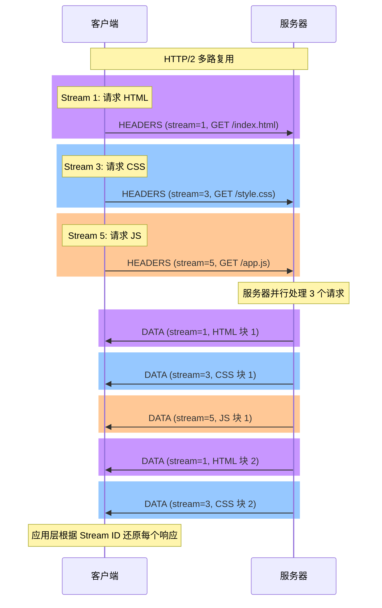

> <Icon name="clipboard-list" color="cyan" /> **前置知识**：[TCP/IP 协议栈](/guide/basics/tcpip)
> ⏱ **阅读时间**：约 12 分钟

# HTTP 协议详解：从 1.0 到 3.0 的演进史

## 导言：HTTP 如何统治了 Web

1991 年，Tim Berners-Lee 发明了 HTTP（HyperText Transfer Protocol）。最初只是为了在 CERN 实验室内共享物理论文。

谁能想到，30 年后，它会成为互联网最重要的协议之一？

从最初的**单行 GET 请求**到今天的**二进制帧多路复用**，HTTP 的演进史就是在**不断解决性能问题**的历史。

本章将深入讲解：
- HTTP 各版本的本质差异（不只是功能堆砌）
- 为什么 HTTP/1.1 的队头阻塞问题如此根深蒂固
- HTTP/2 的多路复用是如何 10 倍提速的
- HTTP/3 为什么要放弃 TCP
- 真实世界中的性能优化案例

---

## 第一部分：HTTP/1.0 的诞生与局限

### HTTP/1.0：最初的设计

```
1991 年的互联网：
  - 网页都是静态的 HTML
  - 每个页面 < 10 KB
  - 用户网络 = 56K 拨号猫
  - 没有人想到要传输视频
```

**HTTP/1.0 的设计**：

```
请求格式（简洁到可怜）：

GET /index.html HTTP/1.0
Host: example.com
<空行>

响应格式：

HTTP/1.0 200 OK
Content-Type: text/html
Content-Length: 1024
<空行>
<1024 字节的 HTML 内容>

特点：
  1. 请求方法少（只有 GET/POST/HEAD）
  2. 头部字段少（Host、Content-Type）
  3. 无持久连接（每个请求都要新建 TCP 连接）
  4. 无缓存机制（没有 Expires、Cache-Control）
```

### HTTP/1.0 的致命缺陷：连接建立开销

```
时间轴分析：

请求 index.html
│
├─ 1. DNS 查询：example.com → 1.2.3.4
│     耗时：50-200ms（网络延迟）
│
├─ 2. TCP 三次握手
│     │
│     ├─ [C→S] SYN
│     ├─ [S→C] SYN+ACK
│     └─ [C→S] ACK
│     
│     耗时：50ms（1 个 RTT，往返延迟）
│
└─ 3. 发送 HTTP 请求 + 接收响应
      耗时：100ms（网络传输 + 服务器处理）


总耗时 = 50 + 50 + 100 = 200ms [slow]

但更糟的是...
页面有 50 个资源（HTML + CSS + JS + 图片）
每个资源都要重复上述 3 步！

总耗时 = 50 + (50 + 100) × 50 = 7,550ms ≈ 7.5 秒 [skull]

用户体验：
  加载一个简单的网页需要 7.5 秒
  在 1990 年代，这已经是奇迹了
  但现在无法接受
```

**为什么每个资源都需要新建连接？**

因为 HTTP/1.0 的默认行为是：
```
1. 建立连接
2. 发送请求
3. 接收响应
4. 关闭连接 ← 每次都关闭！
```

有个头部字段可以改变这个行为：

```
请求：
GET /index.html HTTP/1.0
Connection: keep-alive  ← 保持连接！

但是：
1. 这是一个 hack，不是规范
2. 很多代理服务器不支持
3. 成功率只有 60-70%
```

---

## 第二部分：HTTP/1.1 的革命

### HTTP/1.1：持久连接与改进

**核心创新：Keep-Alive 成为默认行为**

```
HTTP/1.0 (默认关闭连接)：
请求1 → 响应1 → 关闭
请求2 → [新建连接] → 响应2 → 关闭
请求3 → [新建连接] → 响应3 → 关闭

HTTP/1.1 (默认持久连接)：
请求1 → 响应1 ← 保持连接
请求2 →        响应2 ← 保持连接
请求3 →              响应3

收益：
  减少 TCP 握手次数：从 50 次减少到 1 次
  减少整体延迟：从 7.5 秒到 2 秒
  提升 3.75 倍 [run]
```

### HTTP/1.1 的其他改进

**1. 管道化（Pipelining）**

```
理想情况：
客户端：[请求1] [请求2] [请求3] ──→
服务器：            ← [响应1] [响应2] [响应3]

实际上是这样：
客户端发送：req1 → req2 → req3
服务器处理：req1 → req2 → req3
服务器回复：resp1 → resp2 → resp3

看起来不错，但存在一个致命问题...
```

**队头阻塞问题（Head-of-Line Blocking）**

```
假设：
  请求1（获取小图片）：100ms 处理
  请求2（查询数据库）：2000ms 处理
  请求3（获取小 CSS）：50ms 处理

时间轴（使用管道化）：

T=0ms   [req1]
T=0ms   [req1][req2]
T=0ms   [req1][req2][req3]  ← 三个请求都已发送

T=100ms [resp1]  ← 请求1 完成
T=100ms [resp1]  → 发给客户端

T=100ms [req2 正在处理中...]

T=2100ms [resp2]  ← 请求2 finally 完成！

T=2100ms [resp3]  ← 请求3 的响应立即发出

等等，请求3 已经在 T=50ms 时完成了！
但我们不能发送 resp3，因为 resp2 还没有发送！

这就是队头阻塞：
  ▶ 慢的请求（req2）阻塞了快的请求（req3）的响应
  ▶ 总耗时：2100ms
  ▶ 而理想情况下应该：max(100, 2000, 50) = 2000ms
```

**在实践中，管道化 90% 时间失效**

```
为什么？

1. 中间的代理服务器不支持
   - 老旧的 proxy、CDN、防火墙
   - 它们不理解管道化，可能搞坏顺序
   
2. 客户端也不敢用
   - 如果中间有坏的 proxy，会导致请求失败
   - 浏览器默认禁用管道化
   
3. 基于 HTTP 的服务（REST API）不保证顺序
   - GET /user/1  (快)
   - POST /data    (慢，可能超时)
   - DELETE /temp  (中等)
   - 无法保证完全按顺序响应

结果：管道化成为了一个理论特性，实际很少用
```

**2. 虚拟主机（Host 头部）**

```
在 HTTP/1.0 中，一个服务器只能托管一个网站
因为没有办法在请求中说明你要访问哪个网站

HTTP/1.1 引入 Host 头部：

GET /index.html HTTP/1.1
Host: www.example.com

现在一个服务器可以托管多个网站！

数据中心节省：
  - 从 1 服务器 = 1 网站
  - 变成 1 服务器 = N 个网站
  - 降低成本 10 倍
```

**3. 更多 HTTP 方法和状态码**

```
HTTP/1.1 方法：
  GET, POST, PUT, DELETE, HEAD, OPTIONS, PATCH

状态码扩展：
  1xx (Informational) - 继续请求
  2xx (Success)       - 成功
  3xx (Redirection)   - 重定向
  4xx (Client Error)  - 客户端错误
  5xx (Server Error)  - 服务器错误

特别的：
  100 Continue - 客户端可以先问"我能发数据吗？"
                再发送大型请求体
  
  304 Not Modified - 结合缓存，无需传输 body
```

**4. 缓存机制**

```
HTTP/1.0：
  Expires: Wed, 21 Oct 2025 07:28:00 GMT
  （单纯的过期时间）

HTTP/1.1：
  Cache-Control: max-age=3600, must-revalidate
  ETag: "12345"
  Last-Modified: Wed, 21 Oct 2024 07:28:00 GMT
  
两种缓存策略：
  1. 强缓存（不用问服务器）
     - 浏览器本地有副本
     - 检查 max-age 未过期
     - 直接用本地副本（200 from cache）
     
  2. 协商缓存（需要问服务器）
     - 如果 ETag 没变，服务器返回 304
     - 浏览器继续用本地副本
     - 节省带宽（不用传输 body）
```

### HTTP/1.1 的根本局限：仍然无法解决队头阻塞

即使有 Keep-Alive，根本问题依然存在：

```
TCP 是有序的字节流：
  所有数据必须按顺序到达
  
这意味着：
  ┌─────────────────────────┐
  │  响应1 的数据（还在传输）│
  │  响应2 在后面等待...     │
  │  响应3 在更后面等待...   │
  └─────────────────────────┘
  
只要响应1 还没完全发完，响应2、3 都无法被应用层处理
即使响应2、3 已经完全到达接收缓冲区

这是 TCP 的特性，HTTP/1.1 无法绕过
```

---

## 第三部分：HTTP/2 的突破：多路复用

### HTTP/2 的设计哲学

```
HTTP/1.1 缺陷：
  1. 请求-响应是串行的（慢）
  2. 头部 1-5 KB（浪费带宽）
  3. 无法服务器推送（客户端总是被动拉取）

HTTP/2 解决方案：
  1. 多路复用（多个请求并行）
  2. 头部压缩（减少冗余）
  3. 服务器推送（主动发送）
```

### 二进制分帧和多路复用

**Frame 结构**

```
HTTP/1.1 是文本协议（人可读）：
  GET /index.html HTTP/1.1\r\n
  Host: example.com\r\n
  \r\n

HTTP/2 是二进制协议：
  在 TCP 上面，HTTP/2 定义了一个帧层
  
  ┌──────────────────────────────────┐
  │ Frame Header (9 bytes)           │
  ├──────────────┬────────┬──────────┤
  │ Length (3B)  │ Type   │ Flags    │
  └──────────────┴────────┴──────────┘
  │ Stream ID (4B)                   │
  ├──────────────────────────────────┤
  │ Payload (variable length)        │
  └──────────────────────────────────┘
```

**Frame 类型**

```
主要类型：

1. HEADERS  - HTTP 头部（使用 HPACK 压缩）
2. DATA     - HTTP body 数据
3. SETTINGS - 连接参数协商
4. PING     - 连接健康检查
5. RST_STREAM - 重置流
6. PUSH_PROMISE - 服务器推送

关键创新：每个 Frame 都有 Stream ID
          同一连接上，不同 Stream 的帧可以交错发送
```

**多路复用演示**



**对比 HTTP/1.1 的队头阻塞**

```
HTTP/1.1 时间轴：

T=0ms   发送请求1  →
T=100ms ← 接收响应1（快）
T=100ms 发送请求2  →
T=2100ms← 接收响应2（慢！阻塞了其他请求）
T=2100ms 发送请求3 →
T=2150ms← 接收响应3

总耗时 = 2150ms


HTTP/2 时间轴：

T=0ms   发送请求1 + 请求2 + 请求3 （同时发送） →
        
        服务器并行处理

T=100ms  ← 接收响应1（快）
T=2100ms ← 接收响应2（慢）
T=2150ms ← 接收响应3（快）

总耗时 = max(100, 2100, 2150) = 2150ms


等等，HTTP/2 和 HTTP/1.1 总耗时一样？
```

**关键洞察**：

```
HTTP/2 的改进不是减少总耗时（如果都是 2100ms 的请求）
而是：
  
  [v] 隐藏了队头阻塞（应用层看不到）
  [v] 更高效利用带宽（交错发送数据包）
  [v] 减少了重传（一个丢包不会阻塞其他流）
  [v] 更好的优先级支持
  
真正的好处来自于：
  - 减少连接数（1 个连接 vs 6 个连接）
  - 减少 TCP 慢启动的影响
  - 减少握手延迟
```

### HPACK 头部压缩

**问题**：HTTP 头部太大

```
典型的 HTTP/1.1 请求头：

GET /index.html HTTP/1.1\r\n
Host: www.example.com\r\n
User-Agent: Mozilla/5.0 (Windows NT 10.0; Win64; x64) ...\r\n
Accept: text/html,application/xhtml+xml,...\r\n
Accept-Language: zh-CN,zh;q=0.9,en;q=0.8\r\n
Accept-Encoding: gzip, deflate\r\n
Cookie: session=abc123; user_id=456; path=/; ...\r\n
... 更多头部

总大小：1-5 KB，有时更多！

如果有 50 个请求，头部总大小：
  50 × 3KB = 150KB（只是头部！）
  
这些头部 90% 是重复的：
  Host、User-Agent、Accept 都一样
```

**HPACK 的三层压缩**

```
1. 静态表（Static Table）
   Index=1  :authority
   Index=2  :method GET
   Index=3  :path /
   Index=4  :scheme http
   ...
   Index=61 www-authenticate

   对于常见的头部，用 1 字节的索引替代：
   "GET" (3 字节) → Index 2 (1 字节)
   压缩率 300%

2. 动态表（Dynamic Table）
   第一次发送头部时，加入动态表：
   Index=62 User-Agent: Mozilla/5.0...
   
   后续请求重复这个头部时，只需发 1 字节的索引！
   
   动态表大小：4096 字节（可配置）
   
   问题：内存开销
   解决：Apache/Nginx 都设置了 http2_max_requests 限制

3. Huffman 编码
   对于头部值进行比特级压缩
   "mozilla" (7 字节) → 5 字节（假设）
```

**实际压缩效果**

```
第 1 个请求：
  头部 3KB + Huffman + 静态表
  最终：1KB（减少 66%）

第 2 个请求（相同域名）：
  因为动态表有缓存
  最终：100 字节（减少 97%）

第 50 个请求：
  因为动态表充分建立
  最终：50 字节（减少 99%）

总数据量：
  HTTP/1.1：150KB
  HTTP/2：1KB + 99×100B ≈ 11KB
  
  减少 93% 的头部数据！[!]
```

### 服务器推送（Server Push）

**HTTP/1.1 模式**

```
时间轴：

T=0ms   客户端：GET /index.html
        服务器：← [发送 HTML 页面]
        
T=100ms 客户端：[浏览器解析 HTML]
        发现需要 style.css
        GET /style.css
        
T=100ms 服务器：← [发送 CSS]

T=150ms 客户端：[继续解析]
        发现需要 app.js
        GET /app.js
        
T=150ms 服务器：← [发送 JS]

总耗时：150ms + 网络延迟
问题：浏览器必须解析 HTML 才能发现需要的资源
```

**HTTP/2 服务器推送**

```
时间轴：

T=0ms   客户端：GET /index.html
        服务器：→ [发送 HTML 页面]
                → [预测：需要 style.css 和 app.js]
                → [推送 PUSH_PROMISE (stream=2)]
                → [推送 style.css 数据]
                → [推送 PUSH_PROMISE (stream=4)]
                → [推送 app.js 数据]
        
        客户端同时接收：
        - HTML (stream=1)
        - CSS (stream=2) ← 推送！
        - JS (stream=4) ← 推送！

T=100ms 客户端：[浏览器解析 HTML]
        发现需要 style.css → 已经有了（使用推送的）
        发现需要 app.js → 已经有了（使用推送的）

总耗时：100ms + 单次网络延迟（不用再 RTT）
```

**推送的陷阱**

```
[x] 问题：盲目推送

假设：
  - 用户第 1 次访问网站，缓存为空
  - 服务器推送所有资源
  - 效果：很快 [v]
  
  - 用户第 2 次访问，浏览器缓存有 CSS
  - 服务器仍然推送 CSS
  - 客户端收到重复的 CSS 但不用
  - 浪费带宽 [x]

[v] 解决：

1. 使用 Cookie 标记"已经推送过"
   Cookie: pushed_resources=css,js
   
2. 监听 PUSH_PROMISE + 404
   如果客户端对推送的资源返回 404
   说明已经有缓存，下次不推送

3. 使用 Link 预加载
   Link: </style.css>; rel=preload; as=style
   （告诉客户端预加载，但不强制推送）
```

---

## 第四部分：HTTP/3 与 QUIC

### 为什么要创建 HTTP/3？

**HTTP/2 仍然存在队头阻塞（在 TCP 层）**

```
虽然 HTTP/2 解决了应用层的队头阻塞
但 TCP 层的问题依然存在

情景：

TCP 接收缓冲区：
  [Stream 1 的 Frame A] [Stream 1 的 Frame B（丢失）] [Stream 2 的 Frame C] [Stream 3 的 Frame D]
  
问题：
  - Stream 2、3 的 Frame 已经到了
  - 但因为 Stream 1 的 Frame B 丢失
  - 整个 TCP 连接卡住，等待重传
  - 无法向应用层递交数据
  
这是 TCP 的字节流特性决定的
无法改变 TCP，只能放弃 TCP
```

### QUIC 协议（Quick UDP Internet Connection）

**设计哲学：基于 UDP 重新实现 TCP 的功能**

```
TCP 的问题：
  1. 位置固定（内核实现）- 改不了
  2. 握手 3 次 RTT（太慢）
  3. 队头阻塞无法避免

解决方案：
  QUIC = UDP + (TCP 的所有好东西)
  
QUIC 提供：
  [v] 有序交付（像 TCP）
  [v] 可靠性（像 TCP）
  [v] 流（Stream）- 独立的有序通道
  [v] 多路复用 - 流之间互不影响
  [v] 0-RTT 连接建立（比 TCP 快）
  [v] 连接迁移（WiFi ↔ LTE 无缝切换）
```

**关键创新：Connection ID**

```
TCP 连接标识：
  <源IP, 源Port, 目标IP, 目标Port>
  
问题：
  如果从 WiFi 切换到 LTE，源 IP 变了
  → 连接断开 → 需要重新建立
  
QUIC 连接标识：
  Connection ID（一个任意的 64 位数字）
  
好处：
  无论 IP 地址如何变化
  只要 Connection ID 相同，连接继续
  
现实场景：
  用户在地铁上：WiFi → 移动网络 → WiFi
  TCP：连接断 3 次
  QUIC：连接从不断
  
  移动用户体验：完全无缝
```

**0-RTT 握手**

```
TCP TLS 1.2:
  1. TCP SYN → SYN+ACK → ACK  (1 RTT)
  2. TLS ClientHello → ServerHello + Cert → ClientKey Exchange
     (1 RTT)
  3. [开始发送数据]
  
总计：2 RTT 的延迟后才能发送数据

QUIC TLS 1.3:
  1. ClientHello + 密钥分享 + [应用数据]
     ← 一次发送，可以携带应用数据！
     
  2. ServerHello + [应用数据]
     
总计：0 RTT（首次连接后）
     或真正的 0 RTT（如果客户端有缓存的密钥）

实际延迟：
  TCP：200ms（2 RTT × 100ms）
  QUIC：0ms（0 RTT）
  
  改进：100% 快！
```

**独立的流（Stream）**

```
HTTP/2 在 TCP 上的多路复用：
  Stream 1 Frame → Stream 2 Frame → [Stream 1 Frame 丢失]
  
  整个 TCP 连接等待重传
  Stream 2 被阻塞

QUIC 的流：
  Stream 1 的包丢失 → 只有 Stream 1 重传
  Stream 2、3、4 继续发送
  完全独立！
```

---

## 第五部分：HTTP 状态码的真正含义

### 2xx 成功 vs "假成功"

```
200 OK - 真的成功了
  实际：请求被处理，响应完整

201 Created - 资源被创建
  用途：POST /users → 创建新用户
  响应应该包含：Location 头部（新资源的 URL）
  
  [x] 错误做法：
  POST /users
  202 OK
  {"id": 123}
  
  [v] 正确做法：
  POST /users
  201 Created
  Location: /users/123
  {"id": 123}

202 Accepted - 请求已接受但尚未处理
  用途：长耗时的异步操作
  
  例子：
  POST /video/process
  202 Accepted
  {"job_id": "xyz123"}
  
  客户端可以稍后查询：
  GET /jobs/xyz123
  200 OK
  {"status": "processing", "progress": 45%}

204 No Content - 成功但无数据
  用途：DELETE 请求
  
  [v] 正确：
  DELETE /users/123
  204 No Content
  （无响应体）
  
  [x] 错误：
  DELETE /users/123
  200 OK
  {"status": "deleted"}
```

### 3xx 重定向的微妙之处

```
301 Moved Permanently - 永久重定向
  用途：网站迁移、URL 重组
  
  Location: https://example.com/new-path
  
  特性：
  - 浏览器会缓存这个重定向
  - GET /old → 浏览器自动跳到 /new
  - 搜索引擎也会更新索引
  
  [!] 陷阱：
  如果原请求是 POST，301 重定向后会变成 GET！
  
  POST /login (旧地址) → 301 → GET /new-login
  
  这可能丢失 POST 数据

302 Found - 临时重定向
  用途：临时地址变化（维护期间）
  
  vs 301：
  - 浏览器每次都会询问（不缓存）
  - 搜索引擎暂时不更新索引
  
  现代实践：
  - 应该用 303（见下）
  - 很少用 302

303 See Other - 查看其他资源
  用途：POST 后的重定向（Post-Redirect-Get 模式）
  
  场景：
  POST /form
  处理表单...
  303 See Other
  Location: /result
  
  浏览器自动：GET /result
  
  好处：
  - 刷新页面不会重复提交表单
  - 用户体验更好

304 Not Modified - 缓存有效
  用途：结合 ETag 或 Last-Modified
  
  流程：
  
  第 1 次请求：
  GET /style.css
  200 OK
  ETag: "abc123"
  [1MB 的 CSS 内容]
  
  第 2 次请求（浏览器缓存，但不确定是否过期）：
  GET /style.css
  If-None-Match: "abc123"
  
  服务器验证：ETag 未变
  304 Not Modified
  （无响应体！节省 1MB 带宽）
```

### 4xx 客户端错误的细节

```
400 Bad Request - 请求格式错误
  意思：我收到了请求，但无法理解
  
  原因：
  - JSON 格式错误
  - 缺少必要参数
  - Content-Type 错误
  
  [x] 不应该用 400 的情况：
  - 认证失败 → 401
  - 权限不足 → 403
  - 资源不存在 → 404

401 Unauthorized - 需要认证
  意思：谁？你是谁？
  
  场景：
  GET /api/private-data
  [没有提供 Authorization 头]
  
  401 Unauthorized
  WWW-Authenticate: Bearer realm="api"
  
  客户端应该：
  再次请求，并提供认证信息

403 Forbidden - 禁止访问
  意思：我知道你是谁，但你无权访问
  
  vs 401：
  401 = "我不知道你是谁"
  403 = "我知道你，但你权限不足"
  
  场景：
  GET /admin (用户是普通用户，非管理员)
  403 Forbidden
  
  vs
  
  GET /admin (没有登录)
  401 Unauthorized

404 Not Found - 资源不存在
  是否应该返回 404？
  
  安全考虑：
  GET /admin
  - 如果返回 404，说明 /admin 不存在（可能没有管理后台）
  - 如果返回 403，说明存在但无权访问
  
  聪明的 API 可能这样做：
  无论资源是否存在，都返回 403
  隐藏系统结构

410 Gone - 永久删除
  vs 404：
  404 = "不知道这个资源存在过"
  410 = "资源确实存在过，但现在被永久删除了"
  
  用途：SEO
  搜索引擎看到 410，会删除索引
  看到 404，可能认为是临时不可用

429 Too Many Requests - 限流
  意思：你请求太频繁了，请稍后再试
  
  应该包含：
  Retry-After: 60
  RateLimit-Limit: 1000
  RateLimit-Remaining: 0
  RateLimit-Reset: 1234567890
  
  现代实践：
  大多数 API 使用这个状态码实现限流
```

### 5xx 服务器错误

```
500 Internal Server Error - 通用错误
  意思：发生了什么坏事，但我不想告诉你具体是什么
  
  最常见的原因：
  - 代码 bug（NullPointerException 等）
  - 数据库连接失败
  - 外部 API 调用失败
  
  好的实践：
  记录详细错误日志，用户不需要看到

502 Bad Gateway - 网关错误
  意思：我（前置 Nginx）收不到后端服务的响应
  
  场景：
  用户 → Nginx → Django 应用
  
  Nginx 等 5 秒，Django 没有响应
  Nginx → 用户：502 Bad Gateway
  
  原因：
  - Django 进程崩溃
  - Django 慢查询导致超时
  - Django 服务器宕机

503 Service Unavailable - 服务不可用
  意思：我没有宕机，但我不能处理你的请求
  
  场景：
  - 数据库维护中
  - 服务正在重启
  - 服务过载（但没有完全宕机）
  
  应该包含：
  Retry-After: 300
  
  客户端看到 503，应该等待后重试

504 Gateway Timeout - 网关超时
  意思：我（网关）等待后端的响应超时了
  
  vs 502：
  502 = 连接被拒绝或立即断开
  504 = 连接建立，但等待响应超时
```

---

## 第六部分：HTTP 缓存的深层机制

### 强缓存 vs 协商缓存

```
强缓存：浏览器完全不问服务器，直接用本地副本

  请求：GET /style.css
  
  浏览器检查：
    缓存中有 /style.css 吗？ [v] 有
    是否过期？
      Cache-Control: max-age=86400 (24 小时)
      缓存时间：今天 10:00
      现在时间：今天 14:00
      [v] 未过期，4 小时有效期还剩 20 小时
  
  浏览器直接用本地副本
  状态：200 OK (from disk cache)
  
  零网络往返！[*]

协商缓存：浏览器问服务器"我的副本还行吗？"

  请求 1 (初次)：GET /style.css
  响应：
    200 OK
    ETag: "v1-abc123"
    Last-Modified: Mon, 10 Mar 2024 10:00:00
    [1 MB CSS 内容]
  
  请求 2 (再次访问)：GET /style.css
    缓存已过期，或需要验证
  请求头：
    If-None-Match: "v1-abc123"
    If-Modified-Since: Mon, 10 Mar 2024 10:00:00
  
  服务器验证：
    CSS 文件未变（ETag 相同）
  响应：
    304 Not Modified
    （无响应体，节省带宽）
  
  状态：200 OK (from cache)
```

### 缓存头部的完整策略

```
Cache-Control: public, max-age=31536000
├─ public：CDN、代理都可以缓存
├─ private：只有浏览器可以缓存（涉及用户隐私）
├─ max-age=31536000：31536000 秒 = 1 年
│
├─ must-revalidate：过期后必须验证（不能用过期缓存）
├─ no-cache：（名字骗人）缓存后必须验证（可以缓存，但要问）
└─ no-store：不缓存（真的不缓存）

实际例子：

静态资源（永不变化）：
  Cache-Control: public, max-age=31536000, immutable
  比如：/js/app.abc123def456.js
       只要 hash 变了（内容变），URL 就变
       所以 365 天都不用重新验证

HTML（经常变化）：
  Cache-Control: public, max-age=3600, must-revalidate
  比如：/index.html
       1 小时内用缓存
       1 小时后必须验证
       如果 ETag 未变，继续用缓存

API 响应（用户特定）：
  Cache-Control: private, max-age=300
  比如：/api/user/profile
       只有这个浏览器缓存
       5 分钟过期
       不能被 CDN 缓存

用户认证信息（绝密）：
  Cache-Control: private, no-cache, no-store
  比如：/auth/token
       不缓存
       每次都重新获取
```

---

## 第七部分：真实 Bug 案例

### 案例 1：302 重定向滥用导致的性能灾难

```
背景：某电商网站的登录流程

代码逻辑（假设用 PHP）：

if (!isset($_SESSION['user'])) {
    header('HTTP/1.1 302 Found');
    header('Location: /login');
    exit;
}

// 显示用户数据
echo json_encode($user_data);

问题：
  用户第 1 次访问 /checkout
  ↓
  因为未登录，返回 302 /login
  ↓
  浏览器跳转到 /login 页面
  ↓
  用户登录，设置 session
  ↓
  再次访问 /checkout
  [v] 现在有 session，显示数据
  
这看起来没问题...

但实际的灾难：

代码作者犯了一个错误：

if (!isset($_SESSION['user'])) {
    header('HTTP/1.1 302 Found');  // [x] 这是临时重定向！
    header('Location: /login');
    exit;
}

当用户登录后，多次访问 /checkout：

第 1 次：
  GET /checkout
  302 Found → Location: /login
  
  浏览器重新读取代码... 等等，我有 session 了
  
第 2 次：
  GET /checkout
  200 OK [v]

但如果代码中还有其他地方也用 302：

对于每个需要认证的页面：
  GET /products?page=2
  302 Found → /login
  (每次都要重定向！)
  
  GET /cart
  302 Found → /login
  
  GET /orders
  302 Found → /login

性能影响：
  每个请求多了 1 个往返（RTT）
  正常速度：100ms
  有 302：200ms（多了 100ms）
  
  如果网站有 1000 个页面访问：
    正常：100 秒
    有 302：200 秒
    慢了 100%

解决方案：

[v] 正确的做法：
  if (!isset($_SESSION['user'])) {
      header('HTTP/1.1 303 See Other');  // 或 307
      header('Location: /login');
      exit;
  }

为什么？
  303 告诉浏览器这是临时转向，不缓存
  缓存浏览器每次都会检查，而不是盲目跳转
  
  (实际上，现代浏览器 302 也会每次检查，但 301 会缓存)

更好的做法：
  // 用 401 替代 302
  if (!isset($_SESSION['user'])) {
      header('HTTP/1.1 401 Unauthorized');
      header('WWW-Authenticate: Bearer realm="login"');
      echo json_encode(['error' => 'Please login']);
      exit;
  }
  
  这样：
  - API 客户端会正确处理 401
  - 浏览器可以自动弹出登录框
  - 不需要额外的重定向
```

### 案例 2：缓存策略导致的"鬼魂更新"

```
背景：某 SaaS 平台的前端更新失败

用户反馈："更新后的功能没有生效"

历史：

前端代码 v1：
  </style.css?v=1
  Cache-Control: max-age=86400

前端代码 v2（发布新功能）：
  </style.css?v=1  （原 URL 未变！）
  Cache-Control: max-age=86400

问题：
  用户之前缓存了 v1 的 CSS
  新版本发布，但 URL 完全相同
  用户浏览器检查：缓存未过期 [v]
  用户看到的仍然是 v1 功能 [skull]

症状：
  - 部分用户看到新功能 [v]
  - 部分用户看不到 [x]
  - 同一个浏览器，有时行有时不行
  - "只要清除缓存就好"
  - 网络工程师很困惑

根本原因：
  开发人员不知道这个 URL 已被缓存
  应该改 URL 版本号

正确做法：

webpack 配置：
  output: {
    filename: '[name].[contenthash].js',
    //          ↑
    //    文件内容的哈希值
  }

结果：
  style.abc123.js (v1)
  style.def456.js (v2)
  
  当代码变化，输出文件名也会变
  浏览器会请求新 URL，即使有缓存
  因为缓存 key 是 URL，不同 URL = 不同缓存
```

---

## 总结：HTTP 的未来

### HTTP/3 的采用现状

```
2024 年的统计：

  HTTP/1.1：20% 的网站
  HTTP/2：70% 的网站
  HTTP/3：~5% 的网站（但在增长）

为什么 HTTP/3 推广慢？

1. 需要操作系统支持
   - Linux：需要内核 UDP 处理优化
   - Windows：需要更新
   - 不是所有公网路由器都支持

2. CDN 需要升级
   - Cloudflare、Akamai 已支持
   - 但中小型 CDN 还在跟进

3. 向后兼容性
   - 服务器需要同时支持 HTTP/2 和 HTTP/3
   - 增加复杂度

4. 调试困难
   - HTTP/2 可以用 Wireshark 清楚看到
   - HTTP/3 基于 UDP，需要特殊工具

未来趋势：
  - 2026：HTTP/3 达到 30%
  - 2028：HTTP/3 成为主流
```

### 记住的关键点

1. **HTTP 本质是无状态的**
   - 用 Session/Cookie 模拟状态
   - 每个请求都需要重新发送身份信息

2. **缓存是最强的优化**
   - 200 from cache (0ms)
   - vs 正常请求 (100-500ms)

3. **HTTP 状态码有细微差别**
   - 不要混用 301/302/303
   - 不要用 200 表示所有成功（401/403/404 有各自用途）

4. **HTTP/2 多路复用改变了优化策略**
   - HTTP/1.1：合并资源、域名分片
   - HTTP/2：分散资源（减少初始 HTML）

5. **用户体验的关键指标**
   - TTFB (Time to First Byte)：第一个字节的时间
   - FCP (First Contentful Paint)：首次内容绘制
   - LCP (Largest Contentful Paint)：最大内容绘制

---

## 推荐阅读

- RFC 7230-7235：HTTP/1.1 规范
- RFC 7540：HTTP/2 规范
- RFC 9000：QUIC 协议
- [High Performance Browser Networking](https://hpbn.co/)
- Google 的 Web 性能指南

---

## 下一步

- [TCP/IP 协议栈深度解析](./tcpip.md)
- [网络抓包与分析](../ops/packet-analysis.md)
- [网络性能优化](/guide/qos/performance)

## 总结与下一步

| 维度 | 要点 |
|------|------|
| 核心价值 | Web 通信的基石，从 HTTP/1.0 到 HTTP/3 持续优化性能 |
| 关键演进 | 持久连接 → 多路复用 → QUIC 协议 |
| 安全要点 | HTTPS = HTTP + TLS，已成为现代 Web 的标配 |

> <Icon name="book-open" color="cyan" /> **下一步学习**：[DHCP 动态主机配置](/guide/basics/dhcp) — 了解设备如何自动获取网络配置