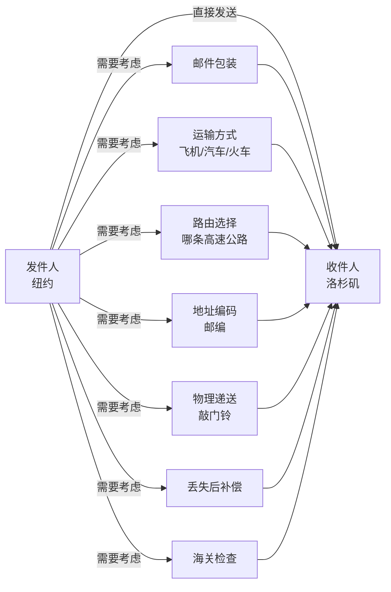
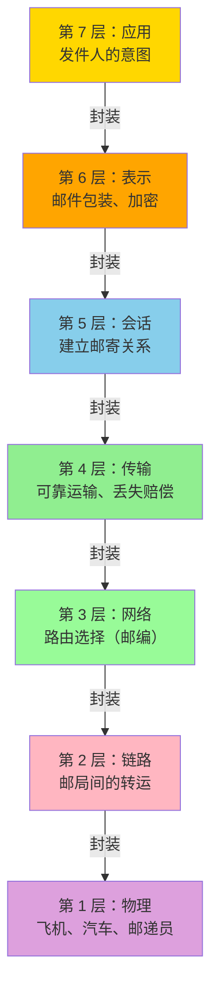
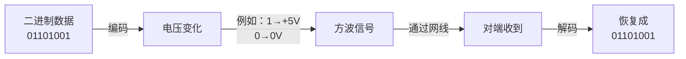
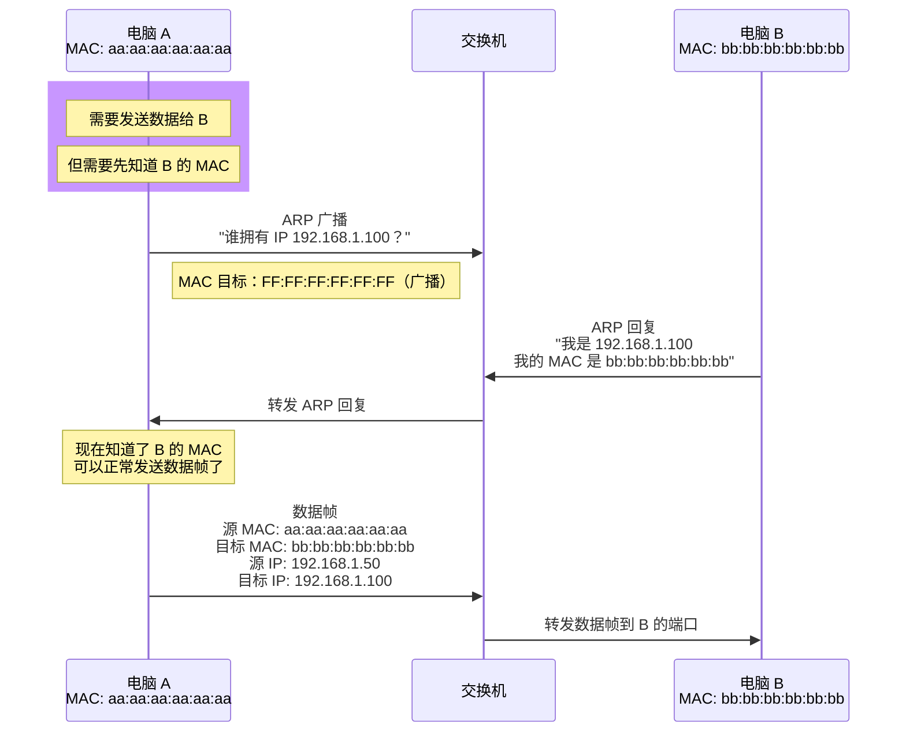
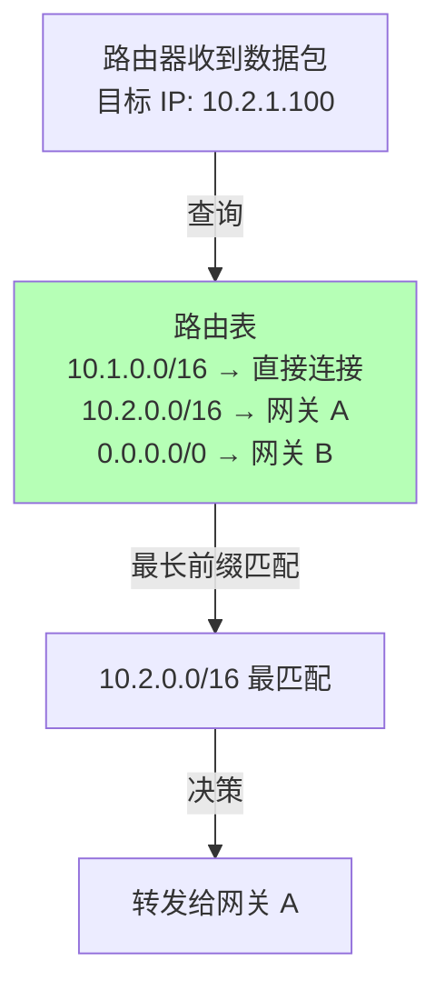
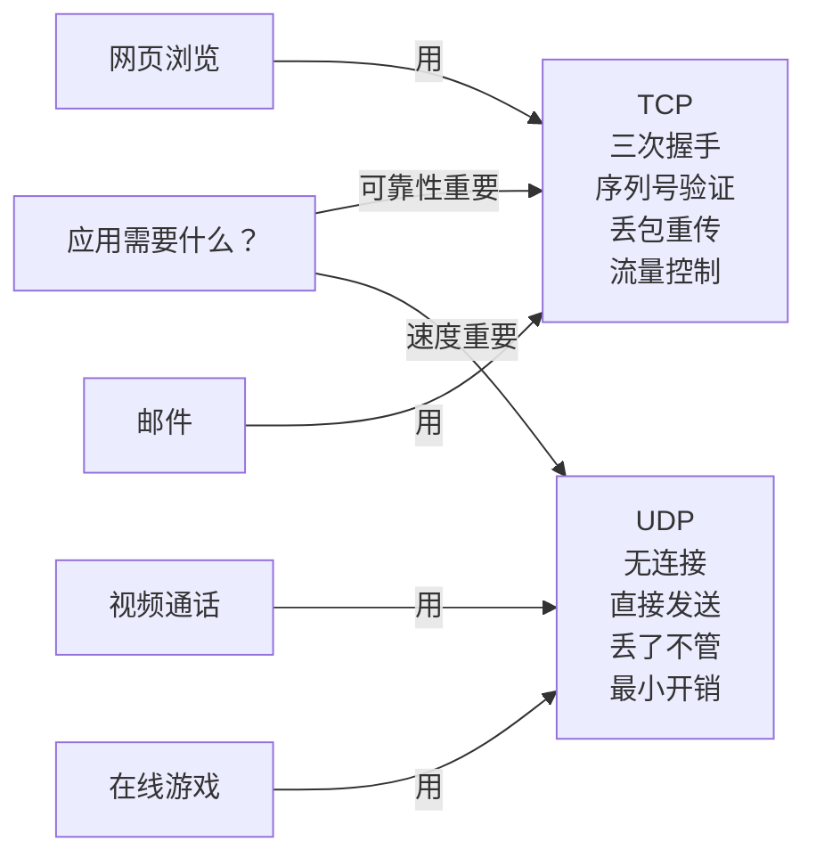
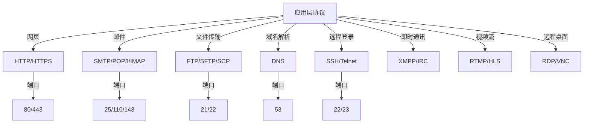
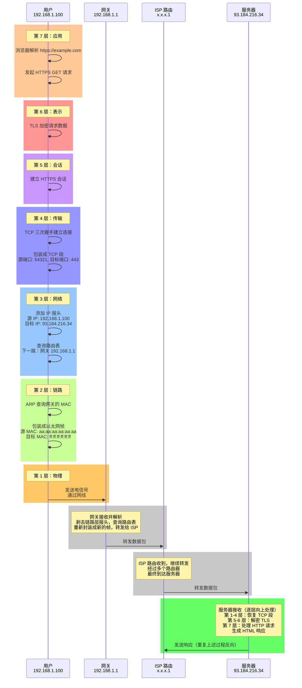
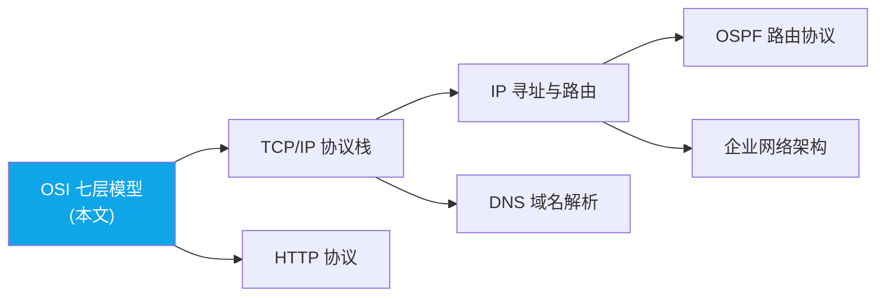

<ConceptMap id="osi" />

> <Icon name="clipboard-list" color="cyan" /> **前置知识**：无，这是学习网络的起点
> ⏱ **阅读时间**：约 15 分钟

# OSI 七层模型：网络通信的分层哲学

## 导言：从混沌到秩序

1974 年之前，网络通信是一团乱麻。不同厂商的设备互相不兼容，电话交换机和计算机网络各自为战，没有人能清楚地解释"网络是怎么工作的"。

直到 ISO（国际标准化组织）在 1984 年发布了 **OSI（开放式系统互连）七层模型**，才把这团乱麻整理成了条理分明的架构。

**这不只是一个模型，而是一种思维方式**：复杂的系统可以通过分层设计变得可理解、可修复、可扩展。

---

## 第一部分：为什么需要分层？

### 没有分层会怎样？

想象你要设计一个从纽约到洛杉矶的邮件系统：



**问题**：发件人需要同时处理 8 个不同的问题！

如果其中任何一个规则改变（比如，从汽车运输改为飞机），发件人的整个系统都要重写。

### 分层的魔力

如果把这个系统分成 7 层：



**好处**：

1. **各司其职**：每一层只需要专注自己的问题
2. **独立演进**：改变运输方式（第 1 层）不需要改变邮件包装方式（第 6 层）
3. **复用性强**：不同的发件人可以共享同一套运输系统
4. **故障隔离**：邮件丢失（第 4 层问题）与路由错误（第 3 层问题）是两个独立的故障

---

## 第二部分：七层详细解析

### 第 1 层：物理层（Physical Layer）

**职责**：将比特（0 和 1）转换成电磁信号，并通过物理媒介传播。

**物理媒介**：

```
网线（Twisted Pair）：
  Cat5e:    100Mbps ~ 1Gbps（工作距离 100m）
  Cat6:     1Gbps ~ 10Gbps
  Cat6a:    10Gbps（工作距离 100m）
  Cat7/8:   40Gbps ~ 400Gbps（数据中心级）

光纤（Fiber Optic）：
  单模光纤（SMF）：10Gbps ~ 400Gbps，距离 > 40km
  多模光纤（MMF）：1Gbps ~ 100Gbps，距离 < 2km
  
无线（Wireless）：
  WiFi 5 (802.11ac):  433Mbps ~ 1.3Gbps
  WiFi 6 (802.11ax):  600Mbps ~ 9.6Gbps
  5G：                 100Mbps ~ 10Gbps
```

**信号编码方式**：



**物理层设备**：

- **集线器（Hub）**：将一根网线的信号复制到所有其他端口（效率极低）
- **中继器（Repeater）**：放大和重新时序信号，延长传输距离
- **网络接口卡（NIC）**：计算机和网络媒介之间的接口

**真实故障**：

```
症状：新办公室网络间歇性掉线
原因：使用了 Cat5 网线（标注错误，实际是铝箔屏蔽）
      铝箔屏蔽会干扰信号，导致比特错误增加
      每秒会有几个 0 变成 1，或 1 变成 0
      
诊断：
  ethtool -S eth0  # 查看网卡统计
  RX errors: 450    # 收到错误的包
  TX errors: 23     # 发送错误的包
  
解决：更换质量认证的 Cat6 网线
```

### 第 2 层：数据链路层（Data Link Layer）

**职责**：在**同一链路上**的两个设备之间建立可靠的帧传输。

**核心概念：MAC 地址**

```
MAC 地址格式：48 位，表示为 6 个十六进制字节
  例如：00:1a:2b:3c:4d:5e
        └──┬──┘
        厂商代码（IEEE 分配）
        
  00:1a:2b = Apple Inc.
  00:0a:95 = Cisco Systems
  00:14:6c = Dell Inc.
  
全局唯一性：理论上，世界上每张网卡都有唯一的 MAC
实际：可以手动修改，不一定全局唯一
```

**数据链路层的工作流程**：



**常见协议**：

- **以太网（Ethernet）**：最广泛使用的有线 LAN 标准
- **WiFi（IEEE 802.11）**：无线 LAN
- **PPP**：点对点链接（拨号上网时代）

**第 2 层设备**：

| 设备 | 工作原理 | 优点 | 缺点 |
|------|--------|------|------|
| **集线器（Hub）** | 收到一个端口的信号，复制到所有其他端口 | 廉价 | 所有端口共享带宽、容易冲突 |
| **交换机（Switch）** | 学习 MAC 地址，只转发到目标端口 | 隔离冲突域、性能好 | 相对贵 |
| **网桥（Bridge）** | 两个交换机之间的连接器 | 扩展 LAN | 过时技术 |

**MAC 地址表（MAC Table）的奥秘**：

```
交换机如何知道某个 MAC 在哪个端口？

初始状态：表为空

T=0: 电脑 A (MAC: aa:aa:aa:aa:aa:aa) 从端口 1 发出数据
     交换机学到：aa:aa:aa:aa:aa:aa → 端口 1

T=5: 电脑 B (MAC: bb:bb:bb:bb:bb:bb) 从端口 2 发出数据
     交换机学到：bb:bb:bb:bb:bb:bb → 端口 2

现在交换机的 MAC 表：
  aa:aa:aa:aa:aa:aa  →  端口 1
  bb:bb:bb:bb:bb:bb  →  端口 2

T=10: 电脑 C (MAC: cc:cc:cc:cc:cc:cc) 想发给 A
      交换机查表：cc:cc:cc:cc:cc:cc 不在表里 → 广播给所有端口
      只有 A 会接收（因为不是给自己的，其他设备忽略）
      同时，交换机从 C 的端口学到：cc:cc:cc:cc:cc:cc → 某端口

总结：交换机通过"学习"逐步填充 MAC 表
     用源 MAC 学习（看数据是从哪个端口来的）
     用目标 MAC 转发（查表看要发到哪个端口）
```

### 第 3 层：网络层（Network Layer）

**职责**：跨越多个网络，实现**全局寻址和路由**。

**IP 地址的设计哲学**：

```
不同于 MAC（物理地址），IP 是逻辑地址
这意味着：
  1. IP 可以修改（MAC 很难改）
  2. IP 可以根据地理位置分配
  3. 路由可以基于 IP 拓扑优化

例如：
  你从办公室（IP: 10.1.1.100）拿笔记本
  走到咖啡馆，连接 WiFi（IP: 192.168.1.200）
  
  同一个设备，MAC 不变，但 IP 完全不同
  这给了网络"动态性"的自由度
```

**路由决策的流程**：



**ICMP：网络诊断工具**

```
ICMP 不是一个"传输协议"，而是一个辅助协议
它用于报告网络中的错误和获取网络信息

常见类型：
  Type 8: Echo Request (ping 请求)
  Type 0: Echo Reply (ping 响应)
  Type 3: Destination Unreachable (目标不可达)
  Type 11: Time Exceeded (生存时间超出)
  Type 12: Parameter Problem (参数错误)

实战案例：
  $ ping google.com
  发送 ICMP Type 8 (Echo Request)
  等待 ICMP Type 0 (Echo Reply)
  
  $ traceroute google.com
  发送 TTL=1 的数据包，收到 Type 11（超时）
  发送 TTL=2 的数据包，收到 Type 11
  ...
  每一跳都告诉你一个路由器的地址
```

### 第 4 层：传输层（Transport Layer）

**职责**：提供**进程间的通信**和**端到端的流量管理**。

**端口号的含义**：

```
IP 地址定位到"哪台电脑"
端口号定位到"电脑上的哪个应用"

例如：
  192.168.1.100:80    = 电脑 100 的 HTTP 服务
  192.168.1.100:22    = 电脑 100 的 SSH 服务
  192.168.1.101:80    = 电脑 101 的 HTTP 服务

同一台电脑，可以在不同端口运行不同服务
  - 端口 80：HTTP
  - 端口 443：HTTPS
  - 端口 3306：MySQL
  - 端口 6379：Redis
```

**TCP vs UDP 的根本区别**：



### 第 5 层：会话层（Session Layer）

**职责**：建立、维护、关闭**通信会话**。

实际上，这一层在现代网络中被严重边缘化了（HTTP 是无状态的）。

```
会话层的典型任务：
  1. 身份验证（登录）
  2. 会话同步（确保双方都在线）
  3. 会话恢复（网络中断后重新连接）
  4. 对话模式（全双工 vs 半双工）

现实中：
  HTTP（无状态）+ Cookie（客户端保存状态）
  逐步取代了会话层的功能
  
  所以很多教材中，会话层"形同虚设"
```

### 第 6 层：表示层（Presentation Layer）

**职责**：数据的**格式转换、加密、压缩**。


**常见转换**：

| 类别 | 例子 | 目的 |
|-----|------|------|
| **编码** | ASCII, UTF-8, Base64 | 字符和字节互转 |
| **加密** | AES, RSA, TLS | 保护隐私和真实性 |
| **压缩** | GZIP, BROTLI, ZSTD | 减少带宽占用 |
| **格式** | JSON, XML, Protocol Buffers | 数据结构序列化 |

### 第 7 层：应用层（Application Layer）

**职责**：为用户和应用提供**网络服务**。



---

## 第三部分：完整的数据之旅

现在让我们跟踪一个 HTTPS 请求从浏览器到服务器再回来的完整过程：



---

## 第四部分：分层中的陷阱

### 陷阱 1：错误诊断

```
症状：用户说"网络很慢"

容易犯的错误：
  [x] 立刻检查应用层（是否是代码问题？）
  [x] 可能忽略了网络层的路由堵塞
  [x] 可能忽略了物理层的丢包

正确的诊断流程（自下而上）：
  1. 物理层：是否有线路中断？丢包率是多少？
  2. 链路层：是否有网卡故障？MAC 表溢出？
  3. 网络层：ping 延迟是多少？有没有路由环路？
  4. 传输层：TCP 连接是否建立？重传率是否过高？
  5. 应用层：应用本身是否有问题？
```

### 陷阱 2：跨层混淆

```
常见的混淆：
  [x] "网络很慢" 是第几层的问题？
     → 可能是第 1 层（丢包）
     → 可能是第 3 层（路由不优化）
     → 可能是第 7 层（应用逻辑效率低）
  
  [x] "无法连接" 是第几层的问题？
     → 可能是第 2 层（网卡驱动故障）
     → 可能是第 3 层（网关配置错误）
     → 可能是第 4 层（防火墙阻止）
     → 可能是第 7 层（服务未启动）
```

### 陷阱 3：设计中的跨层依赖

```
一个常见的错误设计：

应用层直接依赖链路层的信息
  [x] 应用根据 MAC 地址判断用户身份
  
为什么不对：
  MAC 可以被伪造（MAC spoofing）
  用户切换网络时 MAC 变化
  应该依赖 IP 或应用层认证

正确的做法：
  [v] 应用层：使用用户名密码或 OAuth 认证
  [v] 网络层：使用 IP 白名单
  [v] 链路层：用于本地 LAN 寻址，仅此而已
```

---

## 第五部分：OSI vs TCP/IP

现实中用的是简化的 TCP/IP 四层模型：

```
OSI 七层              TCP/IP 四层
应用层 ┐
表示层 ├─ 应用层
会话层 ┘
传输层   ─ 传输层
网络层   ─ 网络层
链路层 ┐
物理层 ├─ 链接层
```

**为什么 TCP/IP 模型更流行？**

1. **简洁**：四层比七层好记
2. **实用**：涵盖了 99% 的实际应用
3. **有效**：互联网就是用 TCP/IP 建造的
4. **灵活**：会话层的功能可以在应用层实现

---

## 总结与应用

### 分层的智慧

1. **每层独立**：修改某一层不需要改动其他层
2. **接口标准**：上一层只需要知道下一层的接口，不需要知道实现细节
3. **故障隔离**：问题可以清晰地定位到某一层
4. **向后兼容**：新的应用可以运行在旧的网络基础设施上

### 实战建议

- **理解分层但不要被困住**：分层是思维工具，不是教条
- **学会自下而上诊断**：大多数问题存在于低层，但表现在高层
- **记住关键协议**：每层必须掌握 2-3 个核心协议
- **实践很关键**：用 tcpdump、Wireshark 抓包看看真实的数据长什么样

---

## 推荐阅读

- [TCP/IP 协议栈深度解析](tcpip.md)
- [网络诊断和抓包分析](../ops/packet-analysis.md)
- 经典书籍：*TCP/IP Illustrated* Volume 1

## 与其他技术的关系



*OSI 模型是理解所有网络技术的基石，掌握分层思想后可以逐步深入各层的具体协议和实现。*

## 总结与下一步

| 维度 | 要点 |
|------|------|
| 核心价值 | 提供网络通信的统一思维框架，让复杂系统可理解、可修复 |
| 适用场景 | 网络设计、故障排查、协议分析、技术沟通 |
| 局限性 | 理论模型，实际实现（TCP/IP）合并了部分层次 |

> <Icon name="book-open" color="cyan" /> **下一步学习**：[TCP/IP 协议栈](/guide/basics/tcpip) — 了解真实网络中最广泛使用的协议族