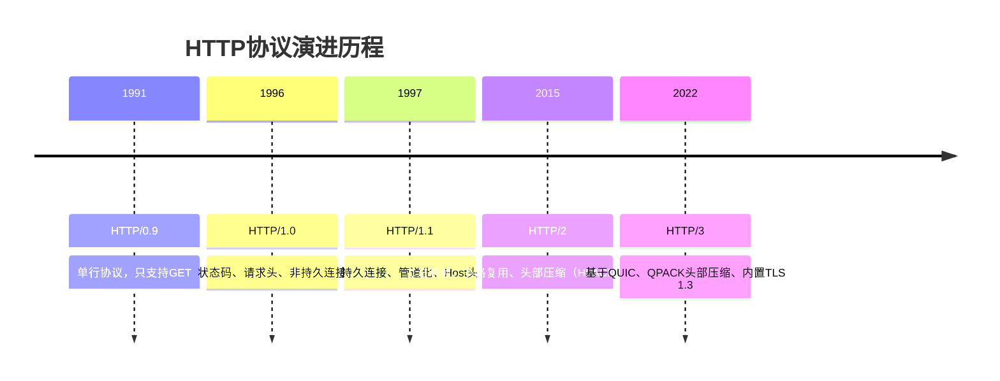
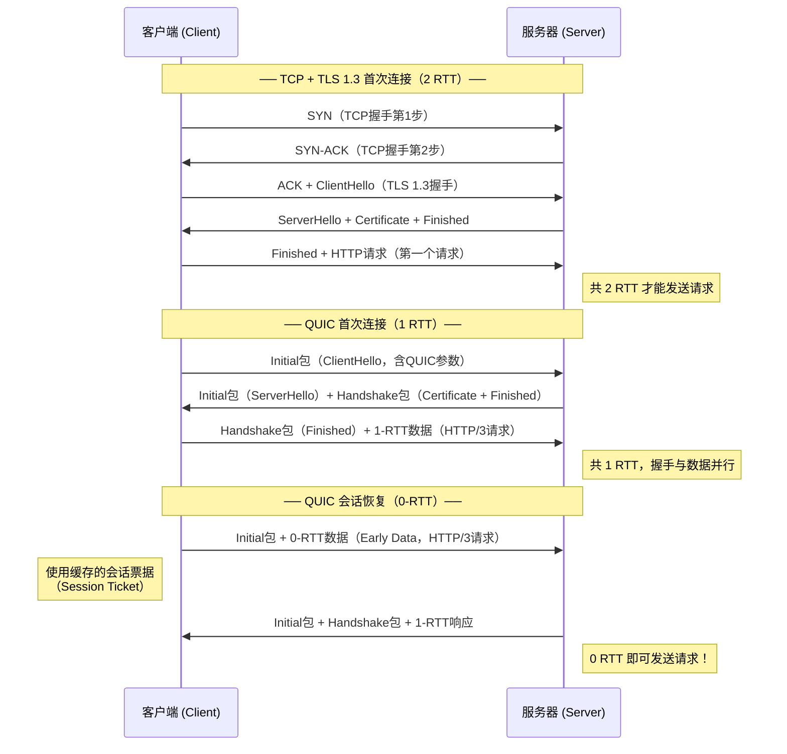
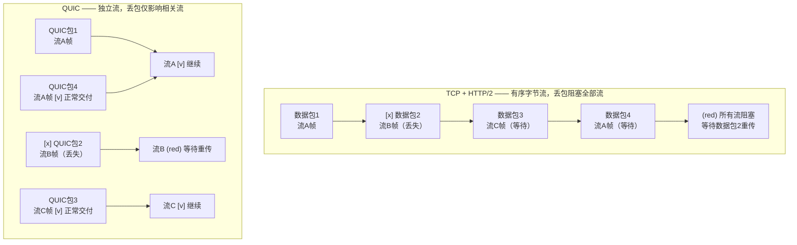
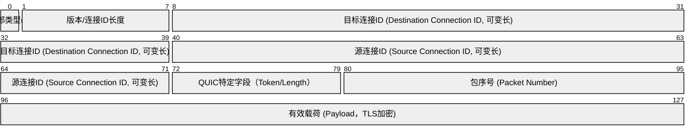

> <Icon name="clipboard-list" color="cyan" /> **前置知识**：[HTTP协议演进](/guide/basics/http)、[TCP/IP协议栈](/guide/basics/tcpip)、[TLS 1.3](/guide/basics/tls)
> ⏱ **阅读时间**：约18分钟

# QUIC与HTTP/3：传输层的下一次革命

互联网传输协议在过去五十年间基本沿用了1981年定稿的TCP（传输控制协议）。尽管TCP经历了无数次优化补丁，其根本性局限在移动互联、高延迟弱网、多路复用等现代场景中愈发凸显。QUIC（Quick UDP Internet Connections）由Google于2012年提出，后经IETF标准化（RFC 9000，2021年），并作为HTTP/3的底层传输层重塑了Web通信的基础。

本文将从**设计动机**出发，逐层剖析QUIC的核心机制，并给出企业环境下部署HTTP/3的实践指南。

---

## 第一层：HTTP/2的遗憾——为什么还需要新协议

### 1.1 HTTP演进时间线



### 1.2 HTTP/2解决了什么，又带来了什么

HTTP/2通过**二进制分帧（Binary Framing）**和**多路复用（Multiplexing）**彻底消除了HTTP/1.1的应用层头阻塞（Head-of-Line Blocking）——多个请求/响应可在同一TCP连接上并发传输，无需排队等待。

然而，HTTP/2运行在TCP之上，而TCP本身是字节流协议，具有严格的**有序交付**语义。当网络发生丢包时，TCP必须等待丢失的数据段重传并按序重组，即使后续数据包已完整到达缓冲区。这造成了**TCP层的队头阻塞**：

- 单次丢包会阻塞同一连接上的**所有**HTTP/2流
- HTTP/2的多路复用在丢包场景下反而比多个HTTP/1.1连接更脆弱
- 移动网络切换（Wi-Fi → 4G）导致IP地址变更，TCP四元组失效，连接必须重建

**连接建立延迟**是另一个瓶颈：HTTPS通信需要完成TCP三次握手（1 RTT）+ TLS 1.2握手（2 RTT）= **3 RTT**才能发送第一个字节。即使TLS 1.3优化到了 1 RTT（首次）+ 0 RTT（恢复），TCP握手仍是无法绕过的固定开销。

::: warning TCP的内在局限
TCP设计于1981年，彼时互联网规模极小、移动设备不存在、丢包率极低。其有序字节流模型在高丢包、高延迟、频繁切换的移动网络环境下性能损耗严重，且由于中间设备（NAT、防火墙、中间盒）的广泛部署，无法通过修改TCP头部在网络层实现协议升级。
:::

---

## 第二层：QUIC设计哲学——在UDP上重建可靠传输

### 2.1 为什么选择UDP

QUIC选择UDP作为底层载体，原因是**现实而非技术**：

1. **中间设备兼容性**：互联网路径上大量防火墙、NAT、代理对TCP有深度理解，但对任何新传输协议（SCTP、DCCP等）存在广泛阻断。UDP是防火墙普遍放行的无连接协议。
2. **用户空间实现**：QUIC运行在用户空间（User Space），无需修改操作系统内核，可随应用快速迭代升级，彻底绕开"内核协议栈更新缓慢"的困境。
3. **协议加密**：QUIC将大部分头部字段加密（区别于TCP明文头部），防止中间设备对协议行为进行干预或"优化"。

### 2.2 QUIC的四大设计目标

| 目标 | 实现机制 |
|------|----------|
| **消除传输层头阻塞** | 独立的流（Stream）抽象，丢包仅影响相关流 |
| **最小化连接建立延迟** | 内置TLS 1.3，1-RTT首次握手，0-RTT会话恢复 |
| **支持连接迁移** | 连接标识符（Connection ID）替代IP+端口四元组 |
| **可演进的拥塞控制** | 可插拔的拥塞控制算法（Cubic、BBR、COPA等） |

---

## 第三层：QUIC核心机制深度解析

### 3.1 连接建立：1-RTT与0-RTT



::: tip 0-RTT的安全考量
0-RTT（Early Data）存在**重放攻击（Replay Attack）**风险：攻击者可截获并重放0-RTT数据包。因此，服务端对0-RTT请求应仅允许幂等操作（如HTTP GET），不应允许非幂等的状态修改操作（如HTTP POST支付请求）。TLS 1.3的0-RTT规范（RFC 8446）中对此有明确约束。
:::

### 3.2 流多路复用：彻底消除头阻塞

QUIC的流（Stream）是协议的核心抽象单元。每个QUIC连接可承载**最多2^62个并发流**，每个流独立编号，具备独立的流量控制窗口。



**QUIC流类型：**

| 流类型 | Stream ID特征 | 用途 |
|--------|--------------|------|
| 客户端发起双向流 | 0, 4, 8, … （末2位=00） | HTTP/3请求/响应 |
| 服务器发起双向流 | 1, 5, 9, … （末2位=01） | 服务器推送 |
| 客户端发起单向流 | 2, 6, 10, … （末2位=10） | QPACK编码器/解码器流 |
| 服务器发起单向流 | 3, 7, 11, … （末2位=11） | QPACK编码器/解码器流 |

### 3.3 QUIC数据包结构



**关键字段说明：**

- **连接ID（Connection ID）**：客户端和服务器各自选择，用于标识连接而非依赖IP+端口。当客户端IP变化时（如从Wi-Fi切换到4G），连接ID保持不变，连接无需重建。
- **包序号（Packet Number）**：单调递增，**不复用**（区别于TCP序列号），彻底消除重传歧义（TCP重传歧义问题，RFC 6937）。
- **加密载荷**：QUIC载荷及大部分头部字段经TLS 1.3加密，防止中间设备检测和干预。

### 3.4 流量控制：双层架构

QUIC实现了**两级流量控制**：

```
连接级流量控制窗口 (Connection-level Flow Control)
├── 流A的流量控制窗口 (Stream-level Flow Control)
├── 流B的流量控制窗口
└── 流C的流量控制窗口
```

- **流级窗口**：限制单个流的未确认数据量，防止单个流占满连接带宽
- **连接级窗口**：限制所有流的总未确认数据量，防止连接耗尽接收方缓冲区

发送方通过 `MAX_STREAM_DATA` 帧更新流级窗口，通过 `MAX_DATA` 帧更新连接级窗口。

### 3.5 ACK机制对比

| 特性 | TCP ACK | QUIC ACK帧 |
|------|---------|-----------|
| 确认粒度 | 字节序号（累积确认） | 包序号（精确确认） |
| SACK支持 | 可选扩展（RFC 2018） | 原生支持多区间确认 |
| 重传歧义 | 存在（序列号复用） | 不存在（包序号单调递增） |
| ACK延迟测量 | 不支持 | `ACK Delay`字段，精确RTT测量 |
| ECN支持 | 扩展支持 | 原生支持 |

### 3.6 连接迁移（Connection Migration）

连接迁移是QUIC相对于TCP最具革命性的特性之一。其工作原理如下：

1. **连接标识**：QUIC连接由连接ID（Connection ID）标识，与底层IP地址和端口**解耦**
2. **路径验证**：客户端切换到新网络路径后，发送 `PATH_CHALLENGE` 帧验证新路径可达性
3. **无缝切换**：服务器收到来自新地址的数据包，验证连接ID有效后，使用新路径继续传输

典型场景：用户驾车时手机从公司Wi-Fi（192.168.1.100）切换到4G（10.0.0.50），基于HTTP/3的视频通话**毫无感知**地继续，而基于TCP的连接必须重新握手，造成明显卡顿。

::: tip 主动迁移 vs 被动迁移
- **被动迁移（Passive Migration）**：NAT重绑定导致的端口变化，服务器检测到源地址变化后自动适应
- **主动迁移（Active Migration）**：客户端主动发起 `PATH_CHALLENGE`，常见于多宿主（Multi-homing）场景
:::

### 3.7 拥塞控制

QUIC的拥塞控制算法在用户空间实现，**可插拔、可快速迭代**：

- **NewReno**：默认保守算法，适合稳定网络
- **CUBIC**：Linux内核默认，适合高带宽延迟乘积（BDP）网络
- **BBR（Bottleneck Bandwidth and Round-trip propagation time）**：Google开发，基于带宽和RTT建模，在高丢包率（如卫星网络）下显著优于丢包驱动算法

---

## 第四层：HTTP/3架构——构建于QUIC之上

### 4.1 分层架构对比

```mermaid
graph TB
    subgraph HTTP2_STACK["HTTP/2 协议栈"]
        H2["HTTP/2（应用层）\n二进制帧 · 多路复用 · HPACK"]
        TLS12["TLS 1.2/1.3（安全层）"]
        TCP2["TCP（传输层）\n可靠有序字节流"]
        IP2["IP（网络层）"]
        H2 --> TLS12 --> TCP2 --> IP2
    end

    subgraph HTTP3_STACK["HTTP/3 协议栈"]
        H3["HTTP/3（应用层）\n帧映射 · QPACK · Server Push"]
        QPACK["QPACK（头部压缩）\n无头阻塞的头部压缩"]
        QUIC_STREAMS["QUIC Streams（流层）\n可靠有序流 · 独立交付"]
        QUIC_CORE["QUIC Core（核心层）\n连接管理 · 流量控制 · 拥塞控制 · 连接迁移"]
        TLS13["TLS 1.3（内置加密）\n1-RTT/0-RTT握手"]
        UDP3["UDP（传输层）"]
        IP3["IP（网络层）"]
        H3 --> QPACK --> QUIC_STREAMS --> QUIC_CORE --> TLS13 --> UDP3 --> IP3
    end
```



### 4.2 QPACK：无头阻塞的头部压缩

HTTP/2使用HPACK压缩HTTP头部，维护一个**动态头部表（Dynamic Header Table）**，通过索引引用之前发送过的头部键值对以减少冗余。然而，HPACK要求头部帧**严格按序处理**——一旦某个帧丢失，后续所有帧的头部解压都会失败，退化为头阻塞。

QPACK（HTTP/3头部压缩，RFC 9204）通过以下设计解决此问题：

- **独立的编码器/解码器控制流**：头部表更新通过专用单向流传输，与数据流解耦
- **Required Insert Count（RIC）**：每个头部块携带所需的最小动态表插入计数，接收方等待动态表满足条件再解压
- **静态表扩展**：QPACK静态表有99个预定义条目（HPACK有61个），覆盖更多HTTP/3常见头部

### 4.3 HTTP/3帧类型

| 帧类型 | 十六进制 | 用途 |
|--------|---------|------|
| DATA | 0x0 | 承载请求/响应体 |
| HEADERS | 0x1 | QPACK压缩的头部 |
| CANCEL_PUSH | 0x3 | 取消服务器推送 |
| SETTINGS | 0x4 | 连接级配置参数 |
| PUSH_PROMISE | 0x5 | 服务器推送承诺 |
| GOAWAY | 0x7 | 优雅关闭连接 |
| MAX_PUSH_ID | 0xD | 限制推送ID范围 |

::: warning 服务器推送的现状
HTTP/3虽然保留了服务器推送（Server Push）能力，但Chrome浏览器已于2022年移除对HTTP/2 Server Push的支持，并在HTTP/3中同样不再鼓励使用。原因是Push的缓存协调问题（服务器无法感知客户端已缓存的资源）导致实际收益有限，甚至带来带宽浪费。现代最佳实践推荐使用103 Early Hints响应替代Server Push。
:::

---

## 第五层：企业实践——性能数据、部署与运维

### 5.1 性能收益数据

大量生产环境实测数据表明HTTP/3在以下场景有显著提升：

| 场景 | 指标 | 提升幅度 |
|------|------|---------|
| **高延迟网络（RTT > 100ms）** | TTFB（首字节时间） | 降低 30-40% |
| **移动网络（2G/3G/弱4G）** | 页面加载时间 | 降低 20-35% |
| **网络切换（Wi-Fi ↔ 4G）** | 连接重建时延 | 接近0（vs TCP 1-3秒） |
| **视频流媒体（直播/点播）** | 卡顿率（Rebuffering Rate） | 降低 15-25% |
| **稳定宽带（低延迟低丢包）** | 页面加载时间 | 与HTTP/2相近或略低 |

::: tip 何时HTTP/3收益最大
- 用户设备处于移动网络或弱Wi-Fi
- 服务器与用户地理距离远（高RTT）
- 请求数量多（多流并发优势明显）
- 页面资源体积小（握手开销占比高）

**何时收益有限**：用户处于稳定低延迟网络（如企业内网），HTTP/2性能已足够优秀。
:::

### 5.2 服务端部署配置

#### Nginx（with nginx-quic补丁或mainline 1.25+）

```nginx
server {
    listen 443 quic reuseport;  # QUIC/UDP监听
    listen 443 ssl;              # TLS/TCP回退

    ssl_certificate     /etc/nginx/certs/server.crt;
    ssl_certificate_key /etc/nginx/certs/server.key;

    # 启用HTTP/3
    http3 on;
    http3_hq off;  # 仅使用标准QUIC，不使用Google QUIC

    # 通知客户端支持HTTP/3
    add_header Alt-Svc 'h3=":443"; ma=86400';

    # QUIC专项优化
    quic_retry on;          # 启用Retry机制防放大攻击
    ssl_early_data on;      # 启用0-RTT（注意幂等性限制）
}
```

#### Caddy（原生支持HTTP/3，无需额外配置）

```caddyfile
example.com {
    # Caddy默认启用HTTP/3，自动添加Alt-Svc头
    root * /var/www/html
    file_server
    
    # 可选：显式配置QUIC参数
    servers {
        protocols h1 h2 h3
    }
}
```

### 5.3 Alt-Svc协商机制

HTTP/3的发现依赖 `Alt-Svc`（Alternative Services，RFC 7838）响应头，流程如下：

1. 客户端首次使用HTTP/1.1或HTTP/2访问服务器
2. 服务器在响应中携带 `Alt-Svc: h3=":443"; ma=86400`
3. 客户端缓存此信息（`ma`指最大缓存时间，单位秒）
4. 后续请求**尝试**使用HTTP/3连接至相同地址的443/UDP端口
5. 若HTTP/3连接建立失败，**自动回退**（Happy Eyeballs算法）至HTTP/2或HTTP/1.1

::: danger 防火墙与UDP 443的阻断问题
企业网络环境下的最大部署障碍：

**问题**：许多企业防火墙、下一代防火墙（NGFW）默认阻断 UDP 443 流量，因为：
- 传统HTTPS使用TCP 443，UDP 443历史上无流量
- 部分安全策略将大量UDP流量视为异常（DDoS嫌疑）
- 深度包检测（DPI）设备无法解密QUIC加密内容，影响安全审计

**解决方案**：
1. 在防火墙规则中显式允许 `UDP/443` 出站流量
2. 对于企业内网服务，评估是否真正需要HTTP/3
3. 客户端正确实现回退机制，确保UDP阻断时自动降级
4. 考虑使用QUIC Alt-Svc指纹检测工具评估路径可达性
:::

### 5.4 监控与可观测性挑战

HTTP/3引入了新的运维观测挑战：

| 挑战 | 原因 | 解决方案 |
|------|------|---------|
| **抓包困难** | QUIC载荷全程加密，Wireshark需要导出TLS密钥 | 配置 `SSLKEYLOGFILE` 环境变量，结合Wireshark QUIC解密 |
| **中间设备盲区** | DPI设备无法检测加密QUIC内容 | 依赖端点日志和应用层监控 |
| **连接统计区别** | UDP是无状态的，连接计数不同于TCP | 使用QUIC连接ID追踪，配置应用层连接埋点 |
| **丢包率监控** | UDP无内核级别的丢包统计 | 使用QUIC ACK帧统计，或部署eBPF探针 |

```bash
# 使用curl测试HTTP/3连接
curl -v --http3 https://example.com

# 检查响应头中的Alt-Svc
curl -sI https://example.com | grep -i alt-svc

# Nginx查看QUIC连接统计（需ngx_http_stub_status_module）
curl http://127.0.0.1/nginx_status
```

### 5.5 QUIC vs TCP+TLS 1.3 全面对比

| 对比维度 | TCP + TLS 1.3 | QUIC（HTTP/3） |
|---------|--------------|--------------|
| **首次握手** | 2 RTT（TCP 1 + TLS 1） | 1 RTT |
| **会话恢复** | 1 RTT（TLS 1.3 Session Ticket） | 0 RTT（受限于幂等性） |
| **头阻塞** | 存在（TCP层字节流有序） | 无（流级独立交付） |
| **连接迁移** | 不支持（IP变更必须重连） | 支持（Connection ID机制） |
| **协议加密** | 头部明文（IP、端口、序列号可见） | 大部分头部加密 |
| **拥塞控制** | 内核实现，升级缓慢 | 用户空间，可快速迭代 |
| **中间设备兼容** | 极佳（全球普遍支持） | 良好（UDP 443可能被阻断） |
| **CPU开销** | 较低（内核原生优化） | 较高（用户空间加密计算） |
| **生态成熟度** | 极成熟 | 快速成熟中（2022年后主流支持） |
| **适用场景** | 低延迟稳定网络、内网服务 | 移动网络、高丢包、全球CDN |

---

## 延伸阅读

### 关键RFC文档

- **RFC 9000**：QUIC: A UDP-Based Multiplexed and Secure Transport（核心规范）
- **RFC 9001**：Using TLS to Secure QUIC（QUIC与TLS 1.3集成）
- **RFC 9002**：QUIC Loss Detection and Congestion Control（丢包检测与拥塞控制）
- **RFC 9114**：HTTP/3（HTTP/3规范）
- **RFC 9204**：QPACK: Field Compression for HTTP/3（QPACK头部压缩）

### 实用工具

- [quic.cloud](https://quic.cloud) — QUIC连接测试与CDN
- [http3check.net](https://http3check.net) — 检测目标域名是否支持HTTP/3
- [Wireshark 3.4+](https://www.wireshark.org) — 支持QUIC解密的网络分析工具
- [qvis](https://qvis.quictools.info) — QUIC连接可视化分析（基于qlog格式）

::: tip 生产部署建议
1. **先从CDN层启用**：Cloudflare、Fastly、Akamai均已支持HTTP/3，可零配置收益
2. **监控回退率**：统计HTTP/3连接失败自动降级为HTTP/2的比例，评估网络环境兼容性
3. **渐进式上线**：使用功能开关（Feature Flag）按比例放量，对比HTTP/2与HTTP/3的TTFB、错误率
4. **注意0-RTT安全**：服务端应检测并拒绝0-RTT请求中的非幂等操作，或完全禁用0-RTT
5. **更新防火墙规则**：与网络团队协作，确保UDP/443在企业出口和数据中心入口均已放行
:::

---

*下一节：[DNS工作原理与企业DNS架构](/guide/basics/dns) | [NAT与端口映射详解](/guide/basics/nat)*
