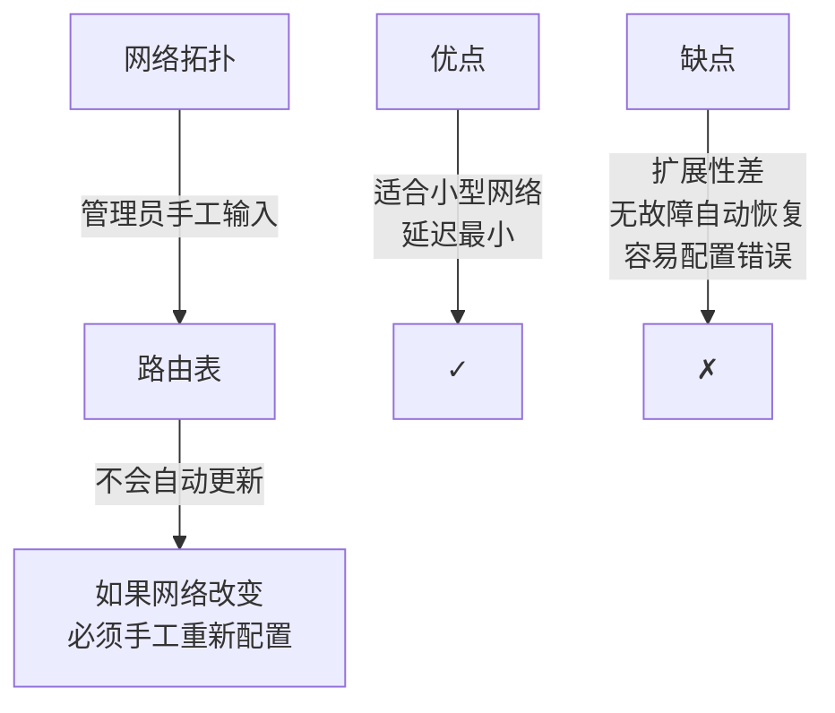
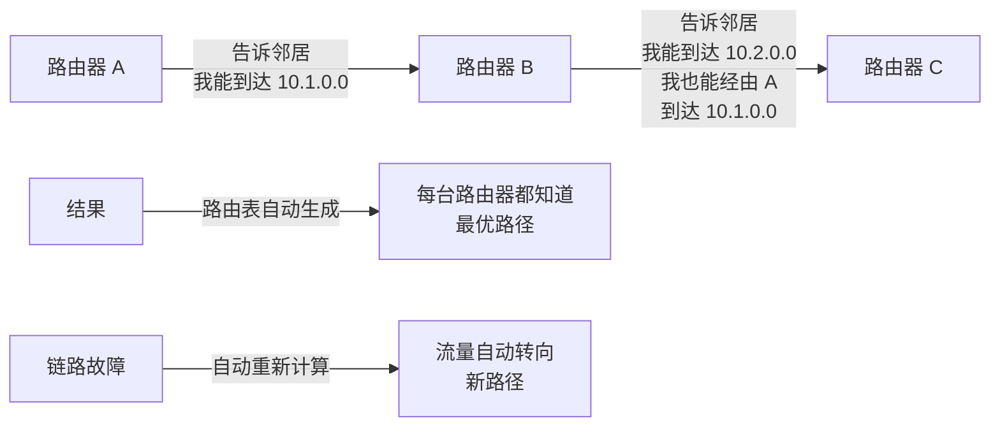
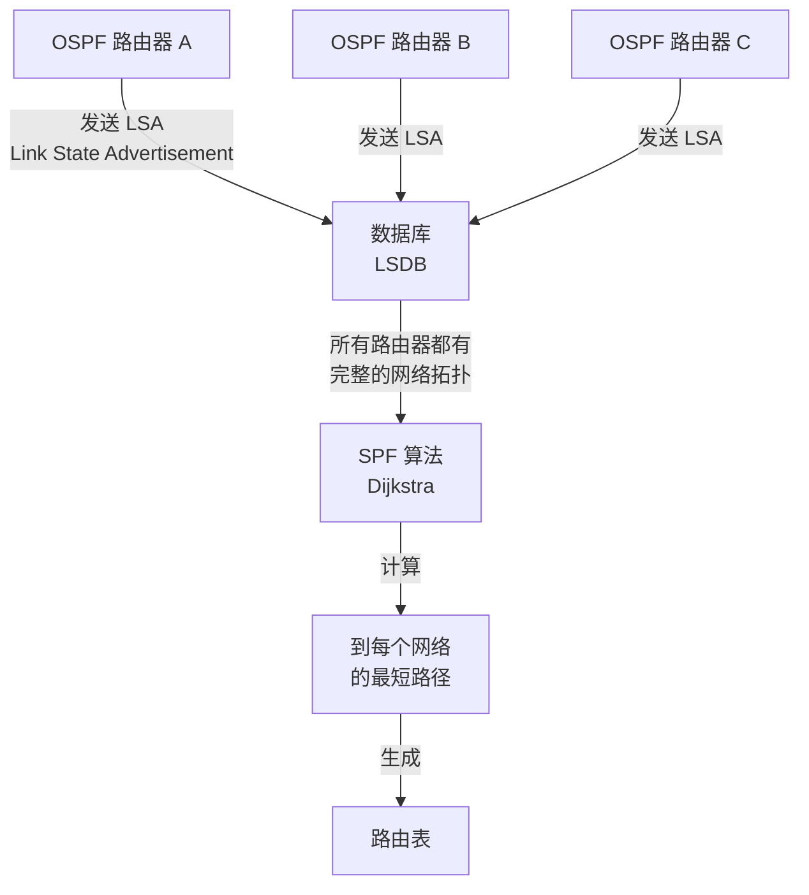
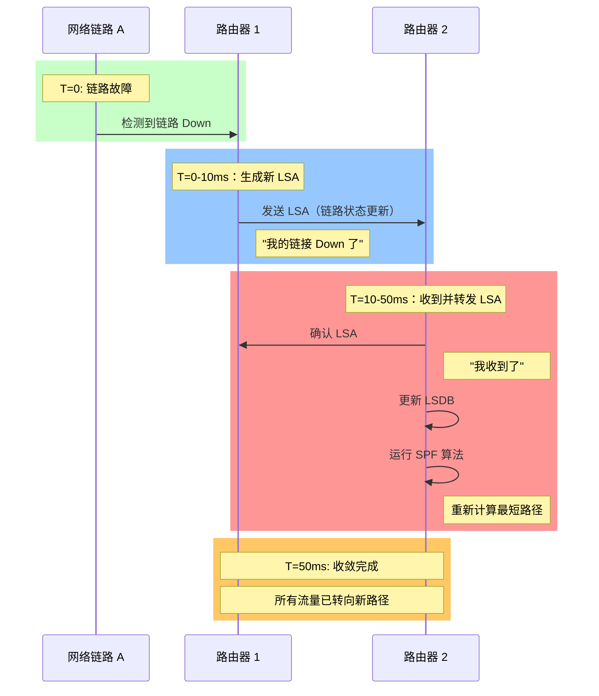
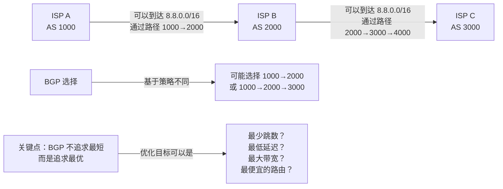
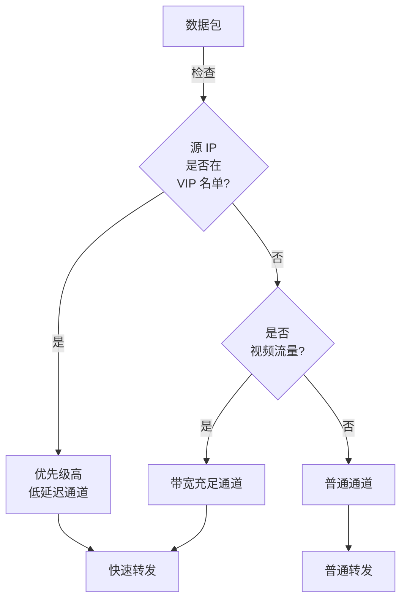
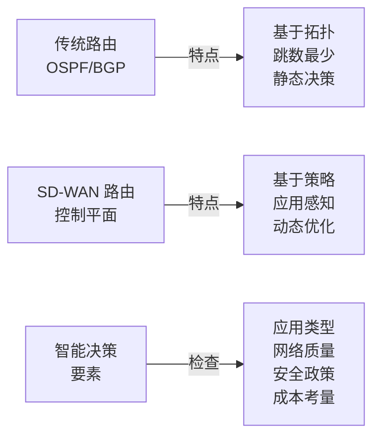

# 路由：互联网的交通指挥系统

## 导言：路由的本质

想象你在纽约，要寄信到洛杉矶。邮局不会凭空"创造"一条路线，而是依赖一份详细的路由表——告诉邮递员，给定目标邮编，下一步应该转发到哪个地区分公司。

**网络路由的原理完全相同**。每台路由器都持有一份**路由表**，当收到一个数据包时，查表决定：这个包应该转发给谁？

---

## 第一部分：静态路由 vs 动态路由

### 静态路由：人工维护的死路



**配置示例**（Cisco）：

```cisco
ip route 10.2.0.0 255.255.0.0 192.168.1.1
# 目标网络    子网掩码      下一跳网关
# 含义：到达 10.2.x.x 的流量，转发给 192.168.1.1
```

**真实故障案例**：

某小型企业有两条 Internet 链路（主链路和备份链路）。网络管理员手工配置了静态路由。某天主链路故障，但备份链路没有自动激活——因为管理员忘记配置故障转移规则。公司离线 4 小时。

### 动态路由：自己学习的聪明系统



**关键优势**：

- **自动发现**：新加入的路由器自动被发现和学习
- **故障恢复**：链路中断后自动转向备份路径
- **负载均衡**：可以在多条等成本路径上负载均衡
- **可扩展性**：支持数千个路由器的大规模网络

---

## 第二部分：动态路由协议

### OSPF（开放最短路径优先）：企业网络的标准

OSPF 是**链路状态（Link State）**协议，意思是每台路由器维护整个网络的"地图"。



**OSPF 的五种 LSA 类型**：

| LSA 类型 | 用途 | 范围 |
|---------|------|------|
| **Type 1** | 路由器发布自己链接 | 本区域内 |
| **Type 2** | 多路访问网络（如以太网） | 本区域内 |
| **Type 3** | 区域间汇总 | 跨区域 |
| **Type 4** | ASBR（自治系统边界路由）信息 | 全域 |
| **Type 5** | 外部路由信息（其他 AS） | 全域 |

**OSPF 区域设计**：

```
OSPF 可以分成多个区域（Area），以降低开销

┌────────────────────────────────────┐
│         骨干区域（Area 0）         │
│  ┌──────────────┐  ┌──────────────┐│
│  │   Area 1     │  │   Area 2     ││
│  │  30 个路由   │  │  40 个路由   ││
│  │  600 个链接  │  │  800 个链接  ││
│  └──────────────┘  └──────────────┘│
│         │                  │        │
│    Area BR1          Area BR2       │
│  (区域边界路由)   (区域边界路由)   │
│                                     │
└────────────────────────────────────┘

优点：
  - Area 1 的路由器只需要知道 Area 1 的完整拓扑
  - 其他区域的详细信息被汇总成一条路由
  - LSDB 大小从 O(n²) 降到 O(n)
```

**OSPF 收敛速度**：



**真实的 OSPF 故障案例**：

某大型企业数据中心内部使用 OSPF，但配置了一个"坏邻居"（bad neighbor）。这个路由器每次崩溃重启时，都会向所有邻居发送一个"序列号重置"的包。结果：

```
症状：每隔 2 小时，所有路由都收敛一次（重新计算）
表现：网络间歇性延迟上升，某些连接断开
原因：路由器重启周期是 2 小时（看门狗保护）
        每次重启，它的序列号归 0
        其他路由器认为有新的拓扑变化
        全网路由重新计算（convergence）

解决：更新路由器固件，修复序列号管理 bug
```

### BGP（边界网关协议）：互联网的大脑

BGP 是**路径向量（Path Vector）**协议。不同于 OSPF 的"最短路径"，BGP 基于**策略**选择路由。



**BGP 的 11 条路径选择规则（简化版）**：

```
当有多条路由到达同一目标时，BGP 按顺序选择：

1. 优先级（Preference）最高
2. AS_PATH 长度最短
3. 来源类型：IBGP < EBGP < 静态
4. MED（Multi-Exit Discriminator）最低
5. EBGP 路由优于 IBGP 路由
6. 从最近的邻居学到
7. ... 还有 5 条复杂的规则

实际中，运营商会手工配置优先级
使得流量按需求的方向转发
```

**BGP 劫持的真实故事**：

2008 年 2 月，YouTube 的 IP 地址段被错误地宣告给了巴基斯坦电信（Pakistan Telecom）。

```
时间线：
T=0: 巴基斯坦电信向全球 BGP 路由器发送错误的路由公告
     "8.8.0.0/16 可以通过 AS 17069 (PTCL) 到达"
     
T=5min: 全球 ISP 开始接收到这个公告
        因为巴基斯坦电信的 AS 号是有效的，BGP 认为这是真实的

T=10min: 全球互联网的大部分流量开始转向巴基斯坦
         用户尝试访问 YouTube，但连接到了 PTCL 的黑洞路由
         所有访问被丢弃

T=2hours: YouTube 在全球离线
          用户无法访问该服务

T=4hours: PTCL 撤销错误公告
          流量回归正常路径

结果：全球第二大视频网站离线 2-4 小时
     经济损失：预估 500 万美元
```

**教训**：
- BGP 是基于信任的，如果 ISP 发布假的路由，很难在短时间内被检测
- RPKI（资源公钥基础设施）可以签名验证路由的合法性
- 但到今天，互联网上仍有大量 ISP 没有启用 RPKI

---

## 第三部分：路由收敛和黑洞

### 什么是路由收敛（Convergence）？

当网络拓扑改变时（链接上线/下线），所有路由器需要时间检测、传播、计算新的路由。在这个过程中，有些包可能被丢弃，这叫**收敛时间**。


**为什么收敛时间对企业很关键？**

```
假设一家银行的网络故障收敛时间是 5 秒

每次故障：
  - 前 5 秒内转账无法完成（超时）
  - 客户投诉"银行系统故障"
  - 每小时约 100 次故障，5 秒 × 100 = 500 秒的宕机

如果优化到 100ms（现代 SD-WAN）：
  500 秒 → 10 秒
  用户几乎感受不到
```

### 路由黑洞（Routing Black Hole）

```mermaid
graph LR
    A["电脑 A<br/>10.1.1.100"] -->|"发送包到<br/>10.2.1.50"| B["路由器 1"]
    B -->|"查路由表：<br/>下一跳是路由器 2"| C["路由器 2"]
    C -->|"哎呀，我没配置<br/>到 10.2.1.50 的路由<br/>丢弃包！"| D["✗ 包丢失"]
    
    A -->|"没有收到回复<br/>重试"| B
    B -->|"...再次到达<br/>路由器 2"| C
    C -->|"...再次丢弃"| D
    
    E["结果"] -->|"连接超时<br/>应用层报错"] F["最终故障"]
```

**导致黑洞的原因**：

1. **配置错误**：某个路由器的路由表不完整
2. **收敛延迟**：更新消息还没到达某些路由器
3. **MTU 不匹配**：包太大，需要分片但被防火墙阻止（PMTU Discovery 失败）
4. **单向链接**：A → B 能到，但 B → A 无法回复

---

## 第四部分：策略路由（Policy-Based Routing）

普通路由只看"目标 IP"。策略路由可以基于更多条件做决策。



**企业应用场景**：

```
公司有两条 Internet 链路：
  - 链路 A：MPLS 专线，10Mbps，延迟 20ms，费用 $5000/月
  - 链路 B：宽带，100Mbps，延迟 50ms，费用 $500/月

目标：成本最优 + 体验满足

策略路由规则：
  1. VoIP（电话）→ 链路 A（对延迟敏感，费用贵但值得）
  2. 视频会议 → 链路 A（体验重要）
  3. 文件备份 → 链路 B（可以容忍延迟）
  4. 日常上网 → 链路 B（费用优先）

结果：
  - 关键应用有最好的体验
  - 次要应用自动降级到便宜链路
  - 月成本下降 60%（从 $15000 降到 $6000）
```

---

## 第五部分：SD-WAN 路由 vs 传统路由



**真实对比**：

某企业从 MPLS 迁移到 SD-WAN：

```
迁移前（OSPF）：
  - 链路 1 故障，OSPF 需要 2 秒感知
  - 2 秒内，关键应用（VoIP）已经丢弃多个包
  - 用户听到"断音"和"延迟"

迁移后（SD-WAN）：
  - 链路 1 故障，探测器 200ms 内发现
  - 立即切换到链路 2
  - 对 VoIP 无影响（SDK 的缓冲机制吸收了延迟）

关键改进：
  1. 更快的故障检测（探测器 vs 协议超时）
  2. 应用感知（知道哪个应用在用，优先级不同）
  3. 多链路主动利用（不是故障时才切换，平时就负载均衡）
```

---

## 第六部分：路由优化的黑科技

### Equal-Cost Multi-Path（ECMP）负载均衡

```
如果有多条等成本路由到同一目标，ECMP 会轮流使用

流量分布：

        ┌──────── 链路 1（通过 ISP A）→ 25% 流量
        │
源 ─────┼──────── 链路 2（通过 ISP B）→ 25% 流量
        │
        └──────── 链路 3（通过 ISP C）→ 50% 流量

好处：
  ✓ 充分利用多条链路
  ✓ 容量翻倍（从 10Mbps 增加到 30Mbps）
  ✓ 故障保护（一条链路故障，只影响 33% 的流量）

坏处：
  ✗ 基于五元组（源 IP、目标 IP、源端口、目标端口、协议）的哈希
  ✗ 可能导致不同包乱序（TCP 可以处理，但降低效率）
  ✗ 配置复杂，需要精心规划
```

### 前缀劫持防护（RPKI）

```
BGP 的问题：任何人都可以宣告任何 IP 段的所有权

RPKI 解决方案：
  1. 数字签名所有 BGP 公告
  2. 验证签名的有效性
  3. 拒绝无效公告

状态：
  ✗ 部署缓慢：全球仅 30% 的 ISP 支持 RPKI
  ✓ 新兴协议：大型 ISP（Google、AWS、Cloudflare）在积极推动
  
趋势：
  未来 3-5 年，RPKI 会成为互联网的安全基础
```

---

## 总结

路由是网络通信的"交通系统"。从简单的静态路由，到复杂的 BGP 策略，再到现代的 SD-WAN 应用感知路由，每个阶段都反映了网络工程师对"如何让流量走最优路径"的深化理解。

**关键要点**：

1. **静态 vs 动态**：小网络用静态简单；大网络必须自动化
2. **OSPF 的威力**：任何企业网络的基础，快速收敛、可扩展
3. **BGP 的复杂性**：互联网的大脑，但基于信任而不是技术
4. **路由收敛**：每毫秒都重要，尤其是关键应用
5. **SD-WAN 的价值**：不只是省钱，而是让路由变得"聪明"

---

## 推荐阅读

- [BGP 深入解析](../routing/bgp.md)
- [SD-WAN 概念](../sdwan/concepts.md)
- [网络抓包分析](../ops/packet-analysis.md)