<ConceptMap id="tcpip" />

> <Icon name="clipboard-list" color="cyan" /> **前置知识**：[OSI 七层模型](/guide/basics/osi)
> ⏱ **阅读时间**：约 18 分钟

# TCP/IP 协议栈：互联网的骨架与灵魂

## 导言：为什么互联网没有崩溃？

1969 年，ARPANET 的工程师们面临一个终极问题：**如何让两台相距千里的计算机可靠地通信？**

如果没有正确答案，互联网可能在今天就崩溃了。几个 TIME_WAIT 状态泄漏，连接池配置不当，或者一个简单的握手漏洞，都可能导致数十亿次通信失败。

**TCP/IP 之所以成功，不是因为它简单，而是因为它的设计者充分考虑了现实中的每一个陷阱。**

本章不仅讲"是什么"，更重要的是讲"为什么这样设计"和"实际中如何踩坑"。

---

## 第一部分：TCP/IP 四层模型的演进

### TCP/IP 与 OSI 模型的斗争史

OSI 七层模型是 ISO 在 1984 年发布的标准，本应成为网络通信的国际标准。但它死了。

TCP/IP 四层模型虽然是后来者，却统治了互联网。为什么？

**官僚 vs 务实的战争**：

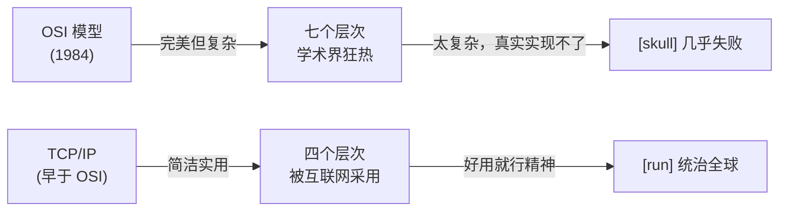

**本质差异**：

| 维度 | TCP/IP | OSI |
|-----|--------|-----|
| **诞生背景** | 实际需求（ARPANET） | 学术标准化 |
| **设计哲学** | 最少必要原则 | 完整覆盖所有情况 |
| **实现难度** | 相对容易 | 极其复杂 |
| **适应性** | IPv4→IPv6 平稳演进 | 试图定义一切，结果什么都定义不了 |
| **市场采用** | 事实标准 | 教科书标准 |

**一个真实的对比**：某大型金融机构的网络工程师曾说，"如果我们用 OSI 标准来设计，系统会在原型阶段就破产。用 TCP/IP 四层，我们在一周内就能上线。"

### TCP/IP 四层模型详解

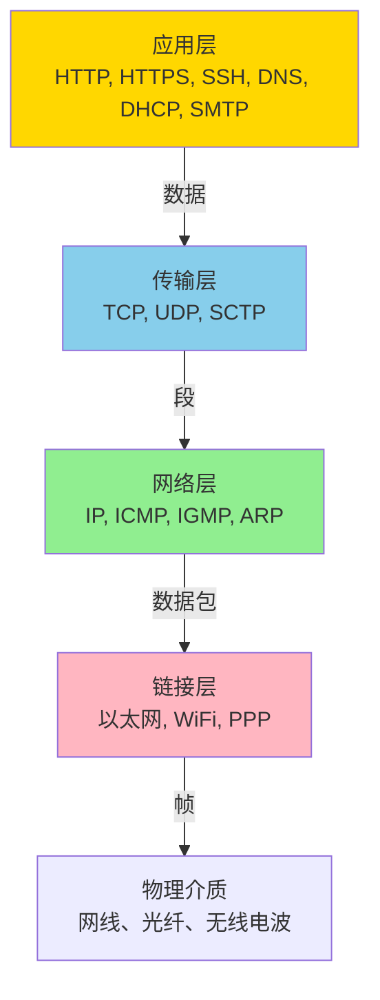

**每层的职责（用快递比喻）**：

- **链接层**：包裹包装、物流标签（MAC 地址）、送上卡车
- **网络层**：地址编码（IP 地址）、多个城市的路由规划
- **传输层**：确保完整性（TCP 的确认机制）、多件快递的管理（端口）
- **应用层**：快递内容本身（HTTP 请求体、DNS 查询）

---

## 第二部分：网络层深度解析

### IP 协议：互联网寻址的哲学

IP 地址不是"物理地址"，而是**逻辑地址**。这个区分至关重要。

**对比：物理 MAC vs 逻辑 IP**

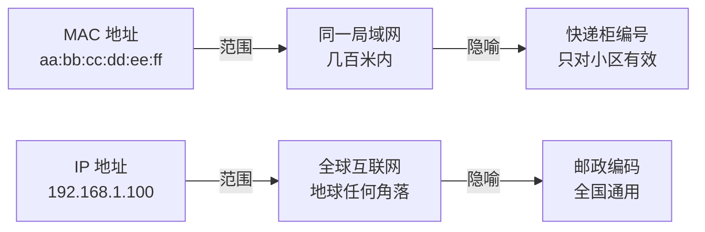

**为什么需要 IP 分类？**

想象互联网是一个递归的快递网络：

```
┌─────────────────────────────────────────┐
│         全球互联网（ISP 级别）          │
│                                         │
│  ┌──────────────────────────────────┐  │
│  │   运营商 A 网络 (AS1)            │  │
│  │                                  │  │
│  │  ┌────────────────────────────┐  │  │
│  │  │  公司网络 (10.0.0.0/8)    │  │  │
│  │  │                            │  │  │
│  │  │ ┌──────────────────────┐  │  │  │
│  │  │ │  部门网络 10.1.0.0/16│  │  │  │
│  │  │ │ ┌────────────────┐  │  │  │  │
│  │  │ │ │ 主机: 10.1.1.5 │  │  │  │  │
│  │  │ │ └────────────────┘  │  │  │  │
│  │  │ └──────────────────────┘  │  │  │
│  │  └────────────────────────────┘  │  │
│  └──────────────────────────────────┘  │
│                                         │
└─────────────────────────────────────────┘
```

**CIDR 记法的深意**：

```
192.168.1.0/24  表示：
192.168.1.[0-255]  → 256 个 IP
但实际可用的是 192.168.1.1 ~ 192.168.1.254（254 个）
因为：
  - 192.168.1.0 = 网络地址（代表整个网络）
  - 192.168.1.255 = 广播地址（发给所有主机）
  
所以可用主机数 = 2^(32-24) - 2 = 256 - 2 = 254
```

### 路由：互联网的神经系统

路由的核心是**最长前缀匹配（Longest Prefix Match，LPM）**。

**真实场景**：某金融企业的路由表配置失误

```
公司网络：10.0.0.0/8
- 总部：10.1.0.0/16
  - IT 部门：10.1.1.0/24
  - 财务部门：10.1.2.0/24
- 分公司 A：10.2.0.0/16
- 分公司 B：10.3.0.0/16

问题：财务部门需要访问分公司 A 的数据库，但网络工程师错误地配置了路由：
```

```mermaid
graph TD
    A["财务主机<br/>10.1.2.50"] -->|发送数据到<br/>10.2.1.100| B["路由器"]
    B -->|查询路由表| C{"匹配规则"}
    C -->|规则1: 10.0.0.0/8| D["直接转发给 10.2.x.x<br/>[x] 跨越多个网段"]
    C -->|规则2: 10.1.0.0/16<br/>最长匹配！| E["转发给总部<br/>[x] 错误的方向"]
    
    D -->|结果| F["丢包"]
    E -->|结果| F
```

**正确的配置应该是**：

```
目标网络        下一跳         优先级
10.2.0.0/16    分公司A网关    高（最长前缀）
10.0.0.0/8     总部网关       低（最短前缀）
```

**为什么是最长前缀而不是最短？**

最长前缀匹配确保流量走最优路径。这是 **BGP 路由的基础**，没有它，互联网会被 N 倍的数据重复和网络拥塞瘫痪。

### ICMP：网络医生的听诊器

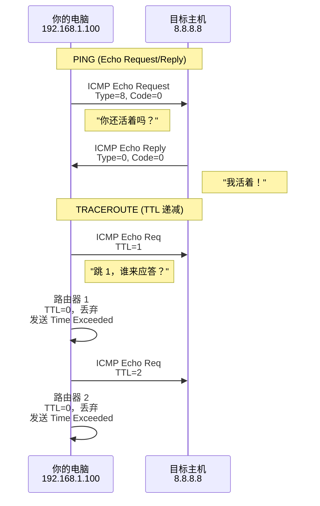

**真实故障案例**：

某互联网公司突然发现 DNS 查询变慢。工程师用 `ping` 测试服务器，一切正常。问题是什么？

**答案**：公司防火墙被配置为**阻止所有 ICMP**（过度安全）。这导致：
1. `ping` 能工作（因为走了特殊通道）
2. 但 ICMP 超时（来自路由器的错误报告）被丢弃
3. 导致 TCP 连接的 `Path MTU Discovery` 失败
4. DNS 查询包被分片，接收方无法重组
5. 表现为"DNS 忽快忽慢"

**教训**：不要完全阻止 ICMP。它不是安全漏洞，而是网络的血液。

---

## 第三部分：TCP 的深度设计

### TCP 三次握手：为什么一定要三次？

看似简单的握手过程，实际上要解决四个致命问题：

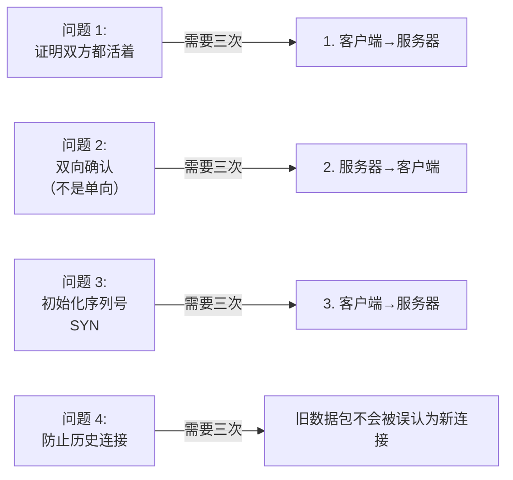

**深度解析：为什么不能是两次？**

假设我们只用两次握手：

```
客户端                              服务器
  │                                   │
  │────── SYN (seq=1000) ──────→      │
  │                                   │
  │ ←──── SYN-ACK (seq=5000) ────     │ 连接建立
  │
此时，客户端和服务器各开辟了一块内存缓冲区。
但如果客户端在第二步后宕机了呢？
```

**灾难场景 1：网络抖动的幽灵连接**

```
客户端想连接服务器，但网络延迟 30 秒

时间线：
T=0：客户端发送 SYN (seq=x)
T=5：网络抖动，包还在网络中
T=5.5：客户端超时，重新发送 SYN (seq=x+1000)
T=10：老的 SYN (seq=x) 终于到达服务器
T=10.1：服务器回复 SYN-ACK (seq=5000, ack=x+1)
T=10.5：客户端收到 SYN-ACK
T=10.6：新的 SYN-ACK 也到了（来自第二个 SYN）

▶ 问题：服务器开辟了两个连接缓冲区，浪费资源！
        更糟：如果客户端误以为这是新连接，会发送数据给错误的"连接"
```

**三次握手如何解决这个问题**：

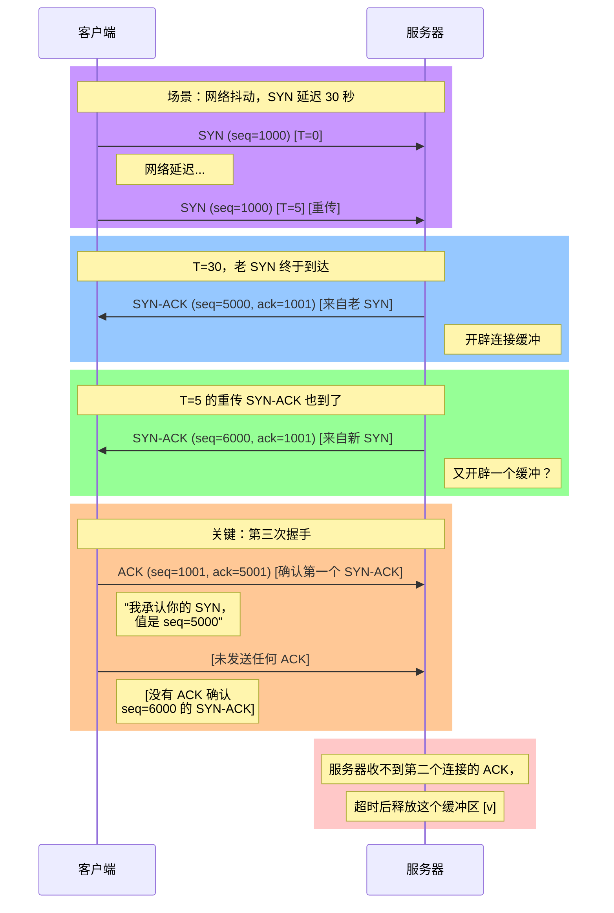

**序列号的真正含义**：

```
TCP 序列号不是"包的序号"，而是"字节流的起始位置"

应用层数据：
  "Hello, World!"  (13 个字符，13 个字节)

TCP 如何编码：
  SYN: seq=1000                  (如果 SYN 占 1 个序列号)
  第一个 ACK: ack=1001           (期望下一个字节从 1001 开始)
  
  数据包: seq=1001, data="Hello" (5 个字节)
  下一个 ACK: ack=1006           (期望从 1006 开始)
  
  数据包: seq=1006, data=", World!" (8 个字节)
  最终 ACK: ack=1014             (全部接收完毕)
```

**防止历史连接的机制**：

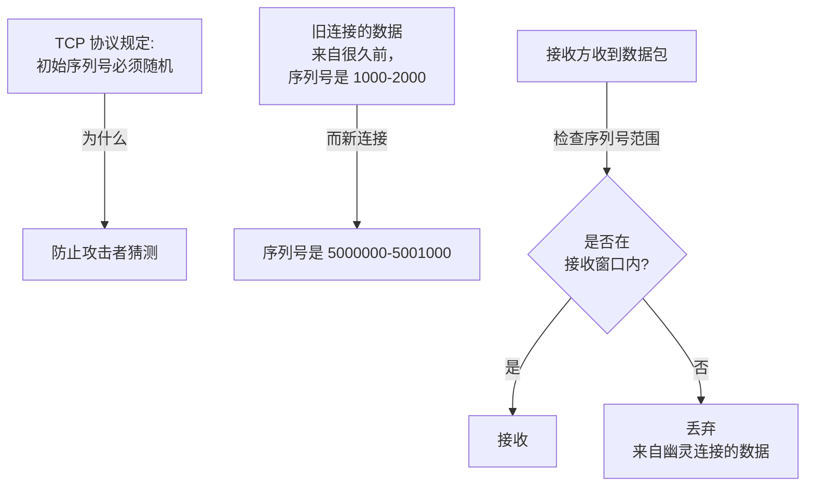

### TIME_WAIT 状态：为什么要等 2MSL？

TCP 关闭连接需要四次挥手，但这不是故事的全部。

```
客户端（主动关闭）              服务器（被动关闭）
  │                                │
  │────── FIN ────────────────→    │
  │                                │
  │ ←──── ACK ─────────────────     │
  │                                │
  │ ←──── FIN ─────────────────     │
  │                                │
  │────── ACK ────────────────→    │
  │                                │ (立即关闭)
  │ (进入 TIME_WAIT)                │
  │  ↓ 等待 2MSL 秒                  │
  │ (才真正关闭)
```

**为什么 TIME_WAIT 要等？**

`MSL` = Maximum Segment Lifetime = TCP 包在网络中的最大生存时间（通常 30-120 秒，TCP 标准推荐 2 分钟）

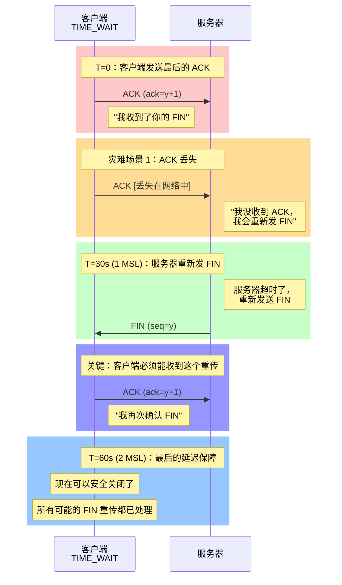

**灾难场景 2：端口复用问题**

```
TIME_WAIT 为什么关键？看这个例子：

T=0: 客户端 A 连接到 服务器:80，本地端口 5000
     连接 ID: (192.168.1.100:5000 → 8.8.8.8:80)

T=5: 客户端 A 关闭连接，进入 TIME_WAIT
     客户端本地端口 5000 仍然被认为"被占用"

T=10: 应用重启，试图绑定本地端口 5000
      ▶ 如果 TIME_WAIT 已过期：新连接绑定到 5000
      ▶ 问题：网络中还有老连接的数据包
              (来自 1 分钟前，还在 MSL 时间内)
      ▶ 新连接可能收到来自老连接的数据
      ▶ 协议混乱！

正确做法：
  - 等待 2MSL （120秒）后才释放端口
  - 确保所有老数据包都被丢弃（TTL 超时）
  - 新连接不会受到影响
```

### TIME_WAIT 爆炸问题：现实中的噩梦

**场景**：高并发 HTTP 服务器

```
假设网站日均 10 亿次请求，每个连接 100ms

平均同时活跃连接 = 10^9 × 100ms / (24×3600s) ≈ 115,000

但 HTTP 客户端关闭后进入 TIME_WAIT，如果平均等待 60 秒：

TIME_WAIT 占用的连接数 = 115,000 × (60/0.1) = 6,900,000

▶ 问题：
  1. 内存爆炸：每个 TCP 连接元数据占 ~1KB → 6GB 内存
  2. 文件描述符爆炸：Linux 默认最多 65,536 个
  3. 新连接无法建立："Too many open files"
```

**真实故障案例**（来自 LinkedIn 的故事）：

2011 年，某大型社交网站突然无法接收新连接，表现为"时不时卡顿"。诊断发现：

```
# netstat 的输出
tcp    0   0 0.0.0.0:8080        0.0.0.0:*          LISTEN
tcp    0   0 192.168.1.1:5000    192.168.1.2:80     TIME_WAIT  ← 230 万个！
tcp    0   0 192.168.1.1:5001    192.168.1.2:80     TIME_WAIT
tcp    0   0 192.168.1.1:5002    192.168.1.2:80     TIME_WAIT
  ... 还有 2,299,997 个类似的
  
# 系统日志
[错误] Cannot assign requested address

原因：本地端口 1024-65535 全被 TIME_WAIT 占用了
```

**解决方案 1：开启 SO_REUSEADDR**

```c
// C 代码示例
int reuse = 1;
setsockopt(sock, SOL_SOCKET, SO_REUSEADDR, &reuse, sizeof(reuse));

// 允许端口在 TIME_WAIT 时被重新绑定
// 但要谨慎！确保没有旧数据包会到达
```

**解决方案 2：减少 TIME_WAIT 时间**

```bash
# Linux 调优：降低 MSL 时间（谨慎！）
sysctl -w net.ipv4.tcp_fin_timeout=30  # 默认 60

# 但更好的做法是增加本地端口范围
sysctl -w net.ipv4.ip_local_port_range="1024 65535"  # 扩大到 64,511 个端口
```

**解决方案 3：使用连接池**

```python
# Python 示例：使用连接池避免频繁建立/关闭
import requests
from requests.adapters import HTTPAdapter
from urllib3.util.retry import Retry

session = requests.Session()
retry = Retry(connect=3, backoff_factor=0.5)
adapter = HTTPAdapter(max_retries=retry, pool_connections=100, pool_maxsize=100)
session.mount('http://', adapter)
session.mount('https://', adapter)

# 复用连接，避免 TIME_WAIT 爆炸
for i in range(1000000):
    response = session.get('http://example.com')
```

**解决方案 4：Server 端采取主动关闭策略**

```
传统 HTTP：
  1. 客户端发起请求
  2. 服务器响应
  3. 客户端主动关闭 ← 进入 TIME_WAIT

改进策略（Keep-Alive）：
  1. 建立一个持久连接
  2. 复用多个 HTTP 请求
  3. 减少关闭的频率 ← TIME_WAIT 数量减少 90%
  
HTTP/2：
  多路复用，单个连接同时处理数百个请求
  TIME_WAIT 影响微乎其微
```

### 拥塞控制：TCP 的自适应之舞

TCP 是如何知道网络有多快/多慢的？答案是：**慢启动 + 拥塞避免 + 快重传 + 快恢复**。

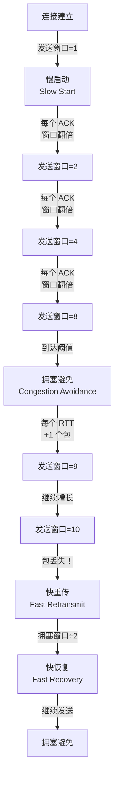

**为什么要"慢启动"？**

```
直觉错误的做法：建立连接后，立刻以满速发送 1000 个包

现实：
  1. 你的网卡可以 1Gbps
  2. ISP 接入是 10Mbps
  3. 网络路径上的某条链路只有 1Mbps
  4. 对方的接收缓冲只有 100 个包

▶ 结果：大量丢包，网络拥塞，需要全部重新发送
   成本：最多浪费 100 倍的带宽和时间

聪明做法：从 1 个包开始，逐步增加
  1. 发 1 个包，没丢包？试试 2 个
  2. 发 2 个，没丢包？试试 4 个
  3. 发 4 个，没丢包？试试 8 个
  ...
  
▶ 结果：快速找到瓶颈，稳定运行
   成本：最多浪费 log(N) 个包
```

**深度讲解：快重传的妙处**

```
正常的包丢失检测：
  - 发送包 1, 2, 3, 4, 5
  - 包 3 丢失
  - 接收端只收到 1, 2，等待 3
  - 发送端等待包 3 的 ACK，超时后重新发送
  - 问题：要等待 1-2 秒（RTO = Retransmission TimeOut）
  - 网络处于"盲目" 状态，继续发包？还是停止？

快重传：
  - 发送包 1, 2, 3, 4, 5
  - 包 3 丢失
  - 接收端收到 1, 2，期望下一个是 3
  - 接收端收到 4，期望还是 3 → 发送"3 号 ACK"（重复 ACK）
  - 接收端收到 5，期望还是 3 → 又发送"3 号 ACK"（第 2 个重复）
  - 发送端收到 3 个连续的重复 ACK
  - 立即重新发送包 3（不等超时！）
  - 延迟：几毫秒而非几秒 [v]
```

---

## 第四部分：传输层的流量控制

### TCP 接收窗口：背压（Backpressure）机制

TCP 的接收窗口（Receive Window）让接收方可以告诉发送方："我只能接收这么多数据，请慢一点。"

```
发送方窗口：每个 ACK 中声称的接收窗口大小

例如：
  第 1 个 ACK: "我的窗口是 65536 字节"
  第 2 个 ACK: "我的窗口是 32768 字节"（应用层处理缓慢，还没读完）
  第 3 个 ACK: "我的窗口是 0 字节"（缓冲区满了！）

发送方的行为：
  [v] 可以继续发送数据直到达到 65536 字节
  [v] 当收到窗口=32768 时，开始背压，逐渐放慢
  [x] 当收到窗口=0 时，必须停止，只能等待
```

**为什么这个机制很关键？**

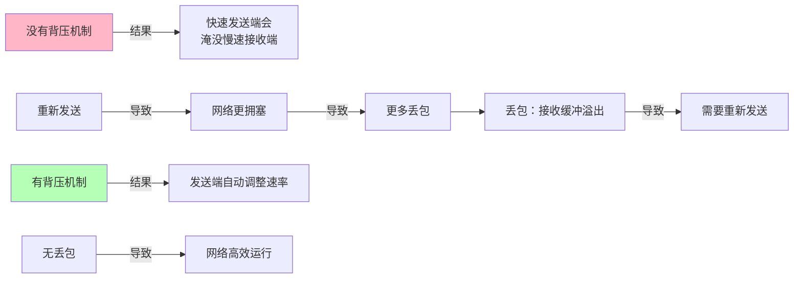

### UDP：为什么放弃了 TCP 的可靠性？

UDP 看似简单粗暴，但在特定场景下是**唯一的选择**。

```
TCP vs UDP 的抉择矩阵：

              需要可靠     可以丢包      需要低延迟   可以接受延迟
              ────────     ────────     ──────────   ──────────
网页浏览         [v]            [x]            [x]            [v]  → TCP
邮件发送         [v]            [x]            [x]            [v]  → TCP
远程登录         [v]            [x]            [x]            [v]  → TCP
视频流           [x]            [v]            [v]            [x]  → UDP
语音通话         [x]            [v]            [v]            [x]  → UDP
在线游戏         [x]            [v]            [v]            [x]  → UDP
DNS 查询         [v]            可选         [v]            [x]  → UDP(主),TCP(备)
```

**UDP 的数据包结构很简单**：

```
UDP 报文头（8 字节）：
┌──────────────────────────┐
│ 源端口(16)  | 目标端口(16)│
├──────────────────────────┤
│ 长度(16)    | 校验和(16) │
├──────────────────────────┤
│ 数据...                  │
└──────────────────────────┘

vs TCP 报文头（至少 20 字节）：
  - 4 倍的开销
  - 序列号、确认号、窗口、状态标志等
```

**为什么 DNS 默认用 UDP？**

```
DNS 查询是典型的"快速问答"：
  1. 问：google.com 的 IP 是什么？
  2. 答：142.251.41.14
  3. 完成

TCP 的代价：
  - 三次握手：+3 个 RTT（往返延迟）
  - 关闭连接：+2 个 RTT
  - 总共：+100-200ms（在高延迟网络中）

UDP 的优势：
  - 直接发送问题：0 个额外 RTT
  - 如果丢包，客户端 1-2 秒后重试即可
  
现实：UDP DNS 丢包率 < 1%，完全可接受
```

---

## 第五部分：应用层协议

### HTTP：万维网的语言

HTTP 是**无状态**的，这个设计决定贯穿了互联网的 30 年。

```
无状态的含义：
  服务器不记住任何客户端的信息
  每个请求都是独立的，互不相关

优点：
  [v] 服务器超级简单，可以随意扩展（任何服务器都能处理任何请求）
  [v] 缓存超级高效（相同请求总是得到相同响应）
  [v] 故障隔离：某个服务器宕机，切换到另一个，对客户端无影响

缺点：
  [x] 需要 Cookie/Session 来维持状态（登录、购物车等）
  [x] 多个请求之间无法共享上下文
```

**HTTP 状态码的真实含义**：

```
2xx (成功)：
  200 OK            请求成功，返回数据
  201 Created       创建了新资源（POST 操作）
  204 No Content    请求成功，但没有返回数据（DELETE 操作）

3xx (重定向)：
  301 Moved Permanently   资源已永久移动（旧 URL 废弃，更新书签）
  302 Found              资源临时移动（维护期间）
  304 Not Modified       资源未修改（客户端缓存仍有效）

4xx (客户端错误)：
  400 Bad Request        请求格式错误（语法错误）
  401 Unauthorized       需要身份验证
  403 Forbidden          没有权限访问
  404 Not Found          资源不存在
  429 Too Many Requests  限流（请求过频繁）

5xx (服务器错误)：
  500 Internal Server Error   服务器内部错误
  502 Bad Gateway            网关错误（代理层故障）
  503 Service Unavailable    服务暂时不可用（维护/重启）
  504 Gateway Timeout        网关超时（后端响应太慢）
```

### DNS：互联网的电话簿

DNS 递归解析是一个**多跳查询**过程：

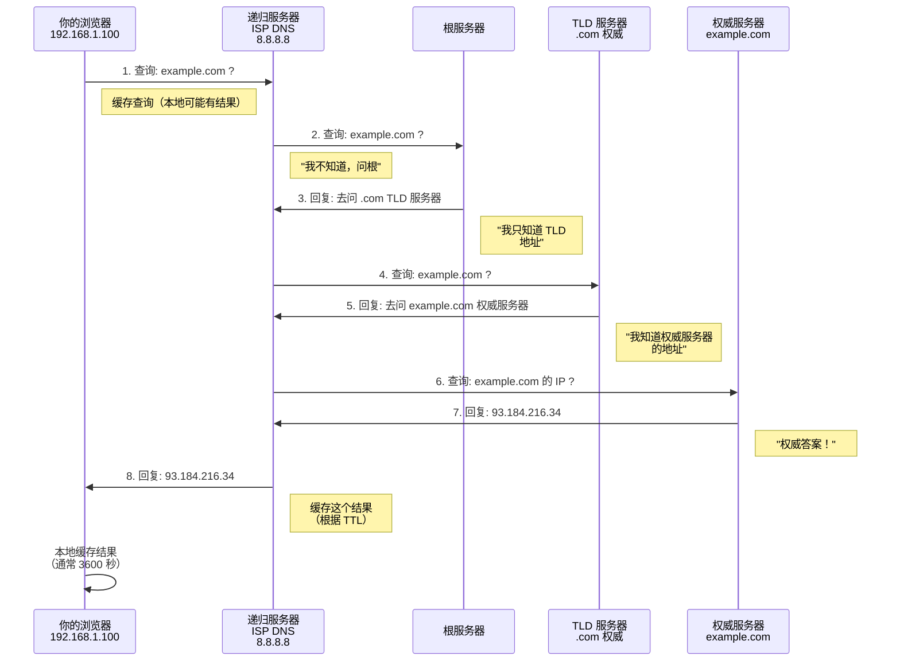

**DNS 缓存的陷阱**：

```
场景：你的网站从 IP A 迁移到 IP B

T=0: 服务器更新 DNS 记录（A → B）
T=0: 你立即看到新 IP（因为浏览器查询了最新 DNS）

但其他人呢？

如果他们的 ISP DNS 缓存了老记录（TTL=3600）：
  T=0 ~ T=3600：他们的浏览器被重定向到旧 IP A
  T=3600+：DNS 缓存过期，查询最新的记录，获得新 IP B

▶ 结果：迁移期间可能有 1 小时的不同结果
  - 部分用户看到新网站
  - 部分用户看到旧网站
  - 混乱！

解决方案：
  1. 迁移前，降低 TTL（60 秒）
  2. 等待所有缓存过期
  3. 更新 DNS 记录
  4. 观察 1 小时，确保一切正常
  5. 恢复 TTL（3600 秒）
```

### HTTPS：加密的 HTTP

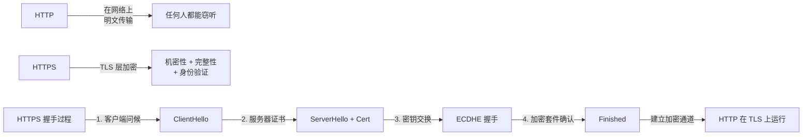

---

## 第六部分：真实故障案例集锦

### 案例 1：DNS 污染导致全公司离线

**发生时间**：2015 年某互联网公司

**背景**：公司内网 DNS 被错误配置

```
错误配置：
  DNS 服务器回复所有不认识的域名为 0.0.0.0
  
问题：
  1. 当 Windows Update 检查 update.microsoft.com 时
  2. 获得了 0.0.0.0（无效 IP）
  3. Windows 系统崩溃（试图连接到 0.0.0.0）
  4. 大量员工的电脑重启无法启动
  
结果：
  整个公司失去了 200 台电脑的工作能力
  花费 2 天才完全恢复
```

### 案例 2：TCP TIME_WAIT 耗尽导致服务雪崩

**发生时间**：2017 年某电商秒杀活动

**背景**：突然 10 倍流量涌入

```
正常状态：
  QPS = 1000
  平均连接时间 = 100ms
  活跃连接数 = 1000 × 0.1 = 100

秒杀期间：
  QPS = 10000
  平均连接时间 = 100ms
  活跃连接数 = 10000 × 0.1 = 1000

关键问题：
  HTTP 短连接，每个请求都建立一个 TCP 连接
  每个连接关闭后，进入 TIME_WAIT（60 秒）
  
TIME_WAIT 连接数 = 10000 × 60 / 0.1 ≈ 6,000,000 个

Linux 文件描述符限制 = 65,536
▶ 新连接无法建立：connect: Too many open files
▶ 所有新请求被拒绝：502 Bad Gateway
▶ 雪崩开始
```

**解决方案**：

```bash
# 立即应急调整
sysctl -w net.ipv4.tcp_fin_timeout=30
sysctl -w net.ipv4.tcp_tw_reuse=1
sysctl -w net.ipv4.tcp_tw_recycle=1  # 谨慎，可能有 SYN 攻击风险

# 长期方案：
# 1. 改为 HTTP Keep-Alive（复用连接）
# 2. 升级到 HTTP/2（多路复用）
# 3. 增加服务器数量（横向扩展）
```

### 案例 3：MTU 分片导致的随机丢包

**发生时间**：2018 年某云计算公司

**背景**：迁移到新的网络基础设施

```
症状：
  - 应用间通信正常
  - 但传输大文件（>1MB）时间不时失败
  - 失败率看似随机：10% ~ 50%
  - 重试后往往成功
  
原因诊断：

MTU（Maximum Transmission Unit）= 最大传输单元

旧网络：
  物理网卡 MTU = 1500（标准以太网）
  
新网络：
  VPN 隧道 MTU = 1400（隧道有开销）
  但配置错误，应用不知道

数据传输：
  应用发送 10,000 字节的数据
  TCP 分成 7 个 1,500 字节的包
  VPN 隧道尝试转发，但最大只能 1400 字节
  ▶ 7 个包中，每个都超出 MTU 限制
  ▶ 需要分片（IP 分片）
  ▶ 如果任何一个分片丢失，整个 10,000 字节都丢失
  ▶ 需要完整重新发送

Path MTU Discovery 失败的原因：
  - 防火墙阻止 ICMP（包括 MTU 超出错误）
  - 隧道层未正确设置 DF（Don't Fragment）标志
```

**解决方案**：

```bash
# 检查 MTU
ip link show
# output: eth0: ... mtu 1500

# 设置正确的 MTU（根据隧道情况）
ip link set eth0 mtu 1400

# 启用 PMTU（Path MTU Discovery）
# Linux 默认启用，但要确保 ICMP 未被完全阻止
```

---

## 第七部分：TCP 优化的黑科技

### BBR：Google 的拥塞控制算法

2016 年，Google 推出 BBR（Bottleneck Bandwidth and Round-trip propagation time），改变了 TCP 拥塞控制的游戏规则。

**为什么传统拥塞控制（CUBIC）不够好？**

```
传统逻辑：
  - 没有丢包 = 网络还能承受更多 → 继续增加流量
  - 丢包了 = 网络拥塞 → 减半流量
  
问题：
  在现代网络（长延迟、高带宽）中
  丢包可能是由于缓冲区满或随机错误，不一定是拥塞
  
  例如：
    - 卫星网络：延迟 500ms，带宽 10Mbps
    - 一个丢包 → CUBIC 认为拥塞了
    - CUBIC 把流量从 10Mbps 降到 5Mbps
    - 但网络其实还能处理 10Mbps
    - 导致吞吐量浪费 50%
```

**BBR 的革命性思想**：

```
BBR 不关心丢包，只关心：
  1. 瓶颈的实际带宽（Bandwidth）
  2. 从我到瓶颈的往返时间（RTT）

控制策略：
  发送速率 = 带宽 × RTT

例如：
  瓶颈带宽 = 10Mbps
  RTT = 100ms
  
  应该同时有多少个包在网络中？
  = 10Mbps × 100ms = 1.25MB ÷ 1500字节/包 ≈ 833 个包
  
  不多不少，刚好充满管道，最大化吞吐量
```

**BBR 的性能提升**：

```
测试场景：高延迟、丢包率 1% 的网络

CUBIC 算法：
  吞吐量 = 5Mbps
  延迟 = 500ms（排队等待）
  
BBR 算法：
  吞吐量 = 9.8Mbps（接近最大）
  延迟 = 110ms（接近最小）

改进幅度：吞吐量 +96%，延迟 -78%
```

**如何启用 BBR（Linux 4.9+）**：

```bash
# 检查内核版本
uname -r

# 修改 /etc/sysctl.conf
net.ipv4.tcp_congestion_control=bbr
net.core.default_qdisc=fq  # Fq Qdisc（Fair Queuing）

# 应用设置
sysctl -p

# 验证
sysctl net.ipv4.tcp_congestion_control
# 输出: net.ipv4.tcp_congestion_control = bbr
```

### TCP Fast Open（TFO）：减少 RTT

```
传统 TCP：
  T=0: SYN
  T=RTT: SYN-ACK（握手完成）
  T=2RTT: 发送 HTTP 请求
  T=3RTT: 收到响应
  
总延迟：3 RTT

TCP Fast Open：
  T=0: SYN + HTTP 请求头（第一个 SYN 中携带）
  T=RTT: SYN-ACK + HTTP 响应（服务器立即处理）
  T=2RTT: 响应完整接收
  
总延迟：2 RTT（减少 33%）

代价：
  服务器需要验证 Cookie（防止 SYN 欺骗）
  稍微增加复杂度
  
收益：
  对于延迟敏感的应用（Web、API）非常有效
```

---

## 总结：TCP/IP 的智慧

TCP/IP 协议栈之所以统治了 30 年，核心在于：

1. **简洁的分层**：每层专注一个问题，不过度设计
2. **强大的容错**：三次握手、序列号、时间戳、校验和
3. **自适应**：拥塞控制、流量控制、动态调整
4. **向后兼容**：IPv4 到 IPv6 可以平稳过渡
5. **充分的诊断工具**：ICMP、tcpdump、Wireshark

但它也不完美。BBR、TFO 这些新技术正在继续优化它。未来，QUIC（基于 UDP 的快速协议）可能会挑战 TCP 的地位。

**最后的建议**：
- 理解 TCP 的本质，不要盲目调优
- TIME_WAIT 不是敌人，它在保护网络
- 连接池比频繁新建连接快 1000 倍
- BBR 在高延迟网络中是个游戏规则改变者

---

## 第七部分：TCP 滑动窗口深度机制

### 为什么需要滑动窗口？

想象两个人对话：

```
朴素方式（停等）：
A: "你好"  ------>  B 接收并回复
A: <------ "你好"
A: "今天天气真好"  ------>  B 接收并回复
A: <------ "是啊"

效率：太低！每说一句都要等待。

滑动窗口方式（批量发送）：
A: "你好 / 今天天气真好 / 晚上见"  ------>  B 一次性接收
B: <------ 一次性回复 "你好 / 是啊 / 好的"

效率：高 3 倍！
```

**滑动窗口的核心概念**：

```
发送方缓冲区的四个区间：

┌─────────────────────────────────────────────────┐
│                                                 │
│  ┌──────┬──────────┬──────────┬──────────────┐ │
│  │ 已发 │ 已发未确 │ 未发可发 │  未发不可发  │ │
│  │      │          │          │              │ │
│  │ 数据 │  数据    │  数据    │    数据      │ │
│  └──────┴──────────┴──────────┴──────────────┘ │
│    ▲                ▲
│    SND.UNA           SND.NXT
│                      (window 指针)
└─────────────────────────────────────────────────┘

可用窗口大小 = SND.WND - (SND.NXT - SND.UNA)
```

### 滑动窗口工作机制详解

**完整的发送-接收-确认流程**：

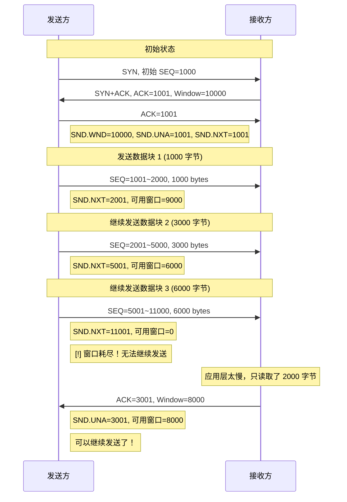

### 接收方的滑动窗口

```
接收方缓冲区的三个区间：

┌─────────────────────────────────┐
│                                 │
│  ┌──────┬────────┬────────────┐ │
│  │ 已收 │ 已收   │  未收      │ │
│  │ 已确 │ 未确认 │  可接收    │ │
│  └──────┴────────┴────────────┘ │
│                   ▲
│                   RCV.NXT
│                   (期望的下一个序列号)
└─────────────────────────────────┘

接收窗口大小 = RCV.WND - (已接收未确认的字节数)
```

**关键点**：
- 发送方的 `SND.WND` 是由接收方通过 ACK 报文中的 Window 字段告知的
- 接收方的 `RCV.WND` 是操作系统根据应用层消费速度动态调整的
- 如果应用层处理太慢，`RCV.WND` 会不断缩小
- 最终可能导致发送方窗口为 0（窗口关闭）

### 窗口关闭的危险：死锁现象

```
场景：应用层处理速度极慢

时间  发送方状态               接收方状态
────  ─────────────            ─────────────
T0    可用窗口=100            可接收=100
      发送 100 字节数据   ──→  
                          ←──  ACK, Window=0
T1    可用窗口=0
      [!] 无法发送任何数据！    应用层进行处理...
      
T2    ⏳ 等待             应用层处理完 50 字节
                          准备发送 ACK, Window=50
                          
      [stop] 但这个 ACK 丢失了！
      
T∞    [!] 发送方永远等待
      接收方不知道发送方在等待
      
      [skull] 死锁！互相等待，没人先动
```

**TCP 的解决方案：持续定时器（Persist Timer）**

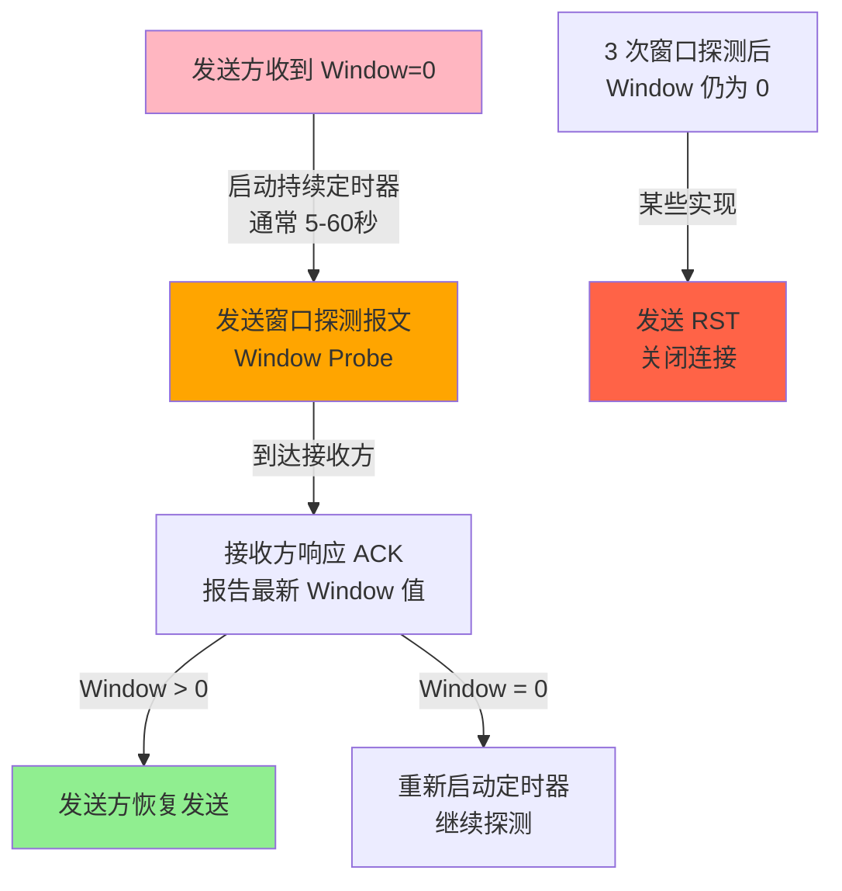

### 糊涂窗口综合症（Silly Window Syndrome）

**问题定义**：

接收方因为应用层缓慢消费，导致窗口不断缩小。每次只能发送几个字节的数据，但 TCP/IP 头部就占 40 字节。

```
场景：

初始状态：
  接收缓冲区大小 = 64,000 字节
  应用层消费速度 = 1 字节/秒
  
流程：
  T=0s:   接收 1000 字节，缓冲区剩余 63,000，Window=63,000
  T=1s:   应用层读取 1 字节，缓冲区剩余 62,999，Window=62,999
  T=2s:   应用层读取 1 字节，缓冲区剩余 62,998，Window=62,998
  ...
  
发送方看到窗口在 62,999 → 62,998 → 62,997 变化
每次只能发送 1 字节！

数据利用率：
  有效数据 = 1 字节
  TCP/IP 头 = 40 字节
  效率 = 1/(1+40) = 2.4% [!]‍
```

**Nagle 算法的救赎**（发送方解决方案）

```javascript
// Nagle 算法的伪代码
if 尚有未确认的数据:
    缓冲新数据，不立即发送
else if 新数据大小 >= MSS:
    立即发送
else if 收到了一个 ACK:
    发送缓冲中的数据
else:
    继续等待
```

**接收方的解决方案**

```
当接收窗口 < min(MSS, 缓冲区大小/2) 时：
    向发送方通告 Window=0
    
等到：
    接收窗口 >= MSS    或
    接收缓冲区有 >= 50% 空间
    
才向发送方通告 Window > 0
```

**实际测试**：

```bash
# 禁用 Nagle 算法（用于像 SSH 这样需要低延迟的应用）
setsockopt(sock, IPPROTO_TCP, TCP_NODELAY, 1)

# 应用场景：
# - SSH：需要按键即响应，否则卡顿难受
# - Web 推送：需要立即响应客户端
# 
# 不应禁用的场景：
# - HTTP 文件下载：Nagle 可以合并小数据包
# - 数据库查询：可以等待数据积累再发送
```

---

## 第八部分：拥塞控制的四个算法详解

### 拥塞窗口 vs 接收窗口

```
发送窗口大小 = min(CWND, RWND)
           ↑      ↑        ↑
      实际      拥塞窗口  接收窗口
      发送窗口  (我能发多少) (对方能收多少)
```

**类比**：

```
CWND = 自来水公司的流量限制（防止网络拥塞）
RWND = 你家水桶的大小（防止淹没接收方）

发送窗口 = min(流量限制, 水桶大小)
```

### 慢启动（Slow Start）

**为什么叫"慢"？**

```
不是因为网络慢，而是因为：
1. 新连接不知道网络状况
2. 不敢一开始就发全速
3. 谨慎地探测网络容量
```

**指数增长阶段**：

```
轮次  CWND    发送包数
────  ─────   ────────
1     1 MSS   1
      收到 ACK → CWND = 1 + 1 = 2
      
2     2 MSS   2
      收到 2 个 ACK → CWND = 2 + 2 = 4
      
3     4 MSS   4
      收到 4 个 ACK → CWND = 4 + 4 = 8
      
4     8 MSS   8
      收到 8 个 ACK → CWND = 8 + 8 = 16

规律：CWND = CWND + 1 (对于每个 ACK)
     相当于：CWND *= 2 (每个 RTT)
```

**可视化**：

```
CWND
  │
  │                    ╱╱
  │                 ╱╱
16├───────────  ╱╱
  │           ╱╱
  │        ╱╱
 8├──  ╱╱
  │   ╱╱
 4├╱╱
  │╱
 2├
  │
 1├
  │
  └──────────────────────
    1  2  3  4   RTT
    
    ↑
    ssthresh 阈值
    (当 CWND 达到时，转入拥塞避免)
```

### 拥塞避免（Congestion Avoidance）

**从指数增长到线性增长**：

```
当 CWND >= ssthresh 时触发

CWND 增长规则：
  CWND = CWND + 1/CWND (对于每个 ACK)
  
相当于：
  每个 RTT，CWND 只增加 1 MSS（线性！）
```

**为什么是 1/CWND？**

```
假设 CWND = 100 MSS

收到 100 个 ACK（1 个 RTT）：
  增量 = 100 * (1/100) = 1
  新 CWND = 101 MSS
  
这样，无论 CWND 多大，每 RTT 只增加 1 个 MSS
网络变得更稳定，不会暴增。
```

### 拥塞发生（Congestion Event）

**触发条件**：

1. **超时重传**（网络非常糟糕）
2. **快速重传**（丢了几个包，但网络还活着）

**超时重传时的激进处理**：

```
发生超时重传 →
  ssthresh = CWND / 2
  CWND = 1
  
效果：从 100 MSS 直接跌到 1 MSS
       相当于网络被隔离了，要从头开始探测

这就是为什么 "一个超时重传，回到解放前"
```

**快速重传的温和处理**：

```
收到 3 个重复 ACK →
  ssthresh = CWND / 2
  CWND = ssthresh + 3
  进入快速恢复
  
效果：从 100 MSS 跌到 50+3 = 53 MSS
     没有完全重置，给网络一个缓冲
```

### 快速恢复（Fast Recovery）

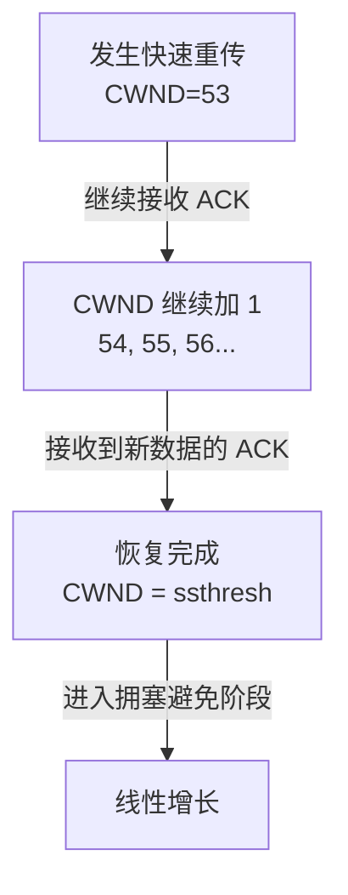

**核心思想**：

```
我们收到了 3 个重复 ACK，说明：
  - 有 3 个包已经被接收方接到
  - 只有 1 个包丢失了
  - 网络不是完全破裂

所以：
  - 不用完全重启（不必 CWND=1）
  - 也要谨慎（减少 50%）
  - 继续发送新数据，同时重传丢失的包
```

**完整的拥塞控制状态机**：

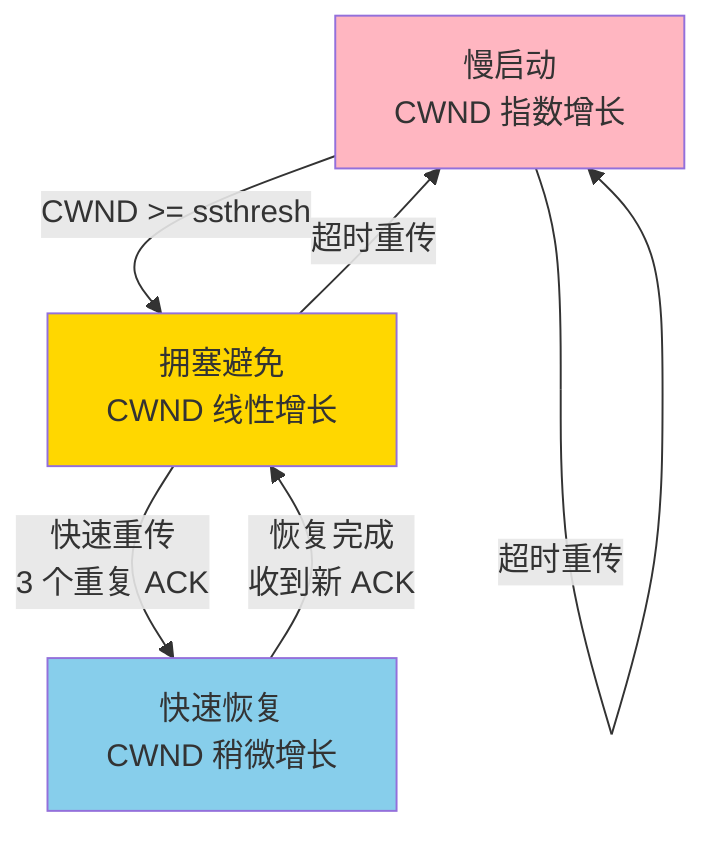

---

## 第九部分：TCP 粘包问题与解决方案

### 什么是粘包？

```
发送方：
  write(sock, "hello", 5)
  write(sock, "world", 5)

接收方期望：
  read(sock) → "hello"
  read(sock) → "world"

实际接收：
  read(sock) → "helloworld"  [x] 粘在一起
  
  或者
  
  read(sock) → "hel"         [x] 分开了
  read(sock) → "loworld"
```

### 为什么会粘包？

**原因 1：TCP 是字节流协议，不是消息流**

```
TCP 只负责可靠传输数据，不关心边界

TCP 层：
  │ 应用层说"发这 5 字节"  │ 应用层说"发这 5 字节"
  │ hello                  │ world
  └──────────────────────────────────┘
              ↓
  ┌──────────────────────────────────────────┐
  │          helloworld (10 字节连续流)     │
  │  TCP 不记录这里有两个边界！
  └──────────────────────────────────────────┘
```

**原因 2：发送方缓冲**

```
write(sock, "hello") - 返回成功（但可能还在缓冲）
write(sock, "world") - 返回成功（也在缓冲）

TCP 发送缓冲：
  [h e l l o w o r l d]
  
等到 TCP 决定发送时，会一起发送
接收方收到的就是粘在一起的数据
```

**原因 3：接收方缓冲**

```
TCP 接收缓冲：
  [h e l l o w o r l d]
  
应用层 read(sock, buf, 10)
  会读取整个 "helloworld"
  
如果 read(sock, buf, 3)
  会读取 "hel"
  剩下 "loworld" 留在缓冲等下次 read
```

### 四种解决方案

**方案 1：固定长度（简单但浪费）**

```
协议设计：
  │ 长度 │ 内容          │
  │ 4 B  │ 消息（补齐 4B）│
  
例子：
  发送 "hi" →
  │ 0x00000002 │ h i [0x00][0x00] │
  
接收端：
  read(4) 字节得到长度 = 2
  read(2) 字节得到 "hi"
  
问题：
  - 如果每条消息平均 10 字节，但最多 1000 字节
  - 每条消息都占用 1000 字节（浪费）
```

**方案 2：分隔符（简单但需转义）**

```
协议设计：使用 \n 作为分隔符

发送 "hello\nworld\n"

接收端：
  read() 直到看到 \n
  得到 "hello"
  
  read() 直到看到 \n
  得到 "world"
  
问题：
  如果消息本身包含 \n，需要转义
  "hello\nworld" →  "hello\\nworld"
  解析时需要反转义，增加复杂度
```

**方案 3：前缀长度（工业标准）** ⭐

```
协议设计：
  │ 长度字段（4B）│ 消息内容（可变长） │
  
例子：
  消息："hello world"（11 字节）
  
  发送：
  │ 0x0000000B │ hello world │
     长度=11    
  
  接收端：
  1. read(4) → 得到 0x0000000B，知道消息长度 = 11
  2. read(11) → 得到 "hello world"
  
优点：
  - 完全避免粘包和分包
  - 支持任意二进制数据（不需转义）
  - 效率高（无冗余）
```

**代码实现（Go 语言）**：

```go
package main

import (
    "encoding/binary"
    "net"
)

// 发送消息
func SendMessage(conn net.Conn, msg []byte) error {
    // 前 4 字节存储长度
    header := make([]byte, 4)
    binary.BigEndian.PutUint32(header, uint32(len(msg)))
    
    // 发送：长度 + 消息
    _, err := conn.Write(append(header, msg...))
    return err
}

// 接收消息
func ReceiveMessage(conn net.Conn) ([]byte, error) {
    // 先读长度字段
    header := make([]byte, 4)
    _, err := conn.Read(header)
    if err != nil {
        return nil, err
    }
    
    // 解析长度
    length := binary.BigEndian.Uint32(header)
    
    // 根据长度读取消息
    msg := make([]byte, length)
    _, err = conn.Read(msg)
    return msg, err
}
```

**方案 4：消息格式（Protobuf / MessagePack）**

```
使用序列化库，自动处理边界

Protobuf 消息定义：
  message User {
    string name = 1;
    int32 age = 2;
  }

序列化时，Protobuf 自动添加：
  - 字段标签（哪个字段）
  - 字段类型（字符串？整数？）
  - 长度信息
  
接收端可以完美还原原始消息

优点：
  - 无需手工处理边界
  - 自动支持版本升级
  - 跨语言兼容
  
缺点：
  - 性能略低（多了序列化开销）
  - 需要引入外部库
```

### Socket 编程的注意事项

```python
# [x] 错误：假设一个 send 对应一个 recv
server.send(b"hello")
server.send(b"world")

client_data = client.recv(1024)  # 可能收到 "helloworld" 或 "hel"

# [v] 正确：使用前缀长度
def send_msg(sock, msg):
    length = len(msg).to_bytes(4, 'big')  # 长度前缀
    sock.sendall(length + msg)

def recv_msg(sock):
    # 先读 4 字节的长度
    length_data = b''
    while len(length_data) < 4:
        chunk = sock.recv(4 - len(length_data))
        if not chunk:
            return None
        length_data += chunk
    
    length = int.from_bytes(length_data, 'big')
    
    # 再根据长度读消息
    msg = b''
    while len(msg) < length:
        chunk = sock.recv(length - len(msg))
        if not chunk:
            return None
        msg += chunk
    
    return msg
```

---

## 推荐阅读和参考

- [TCP/IP Illustrated, Vol. 1](http://www.kohala.com/start/tcpipwork/)（经典教材）
- [BBR 论文](https://queue.acm.org/detail.cfm?id=3022184)
- Linux 内核网络代码（`net/ipv4/tcp_*.c`）
- Wireshark 官方文档

---

## 下一步

- 深入学习：[BGP 深入解析](../routing/bgp.md) 与 [MPLS 和流量工程](../advanced/mpls.md)
- 故障诊断：[运维工具 → 网络抓包分析](../ops/packet-analysis.md)
- 安全加固：[网络安全 → IPSec](../security/ipsec.md)

## 与其他技术的关系

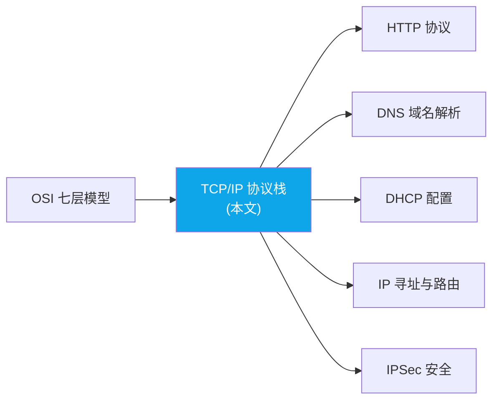

*TCP/IP 是互联网的实际协议标准，掌握它之后可以深入各层具体协议（HTTP、DNS）和安全机制（IPSec）。*

## 总结与下一步

| 维度 | 要点 |
|------|------|
| 核心价值 | 互联网的实际协议标准，TCP 保证可靠传输，IP 负责寻址路由 |
| 与 OSI 关系 | TCP/IP 四层模型是 OSI 七层的实用化简版 |
| 关键协议 | TCP/UDP（传输层）、IP/ICMP（网络层）、ARP（链路层） |

> <Icon name="book-open" color="cyan" /> **下一步学习**：[HTTP 协议详解](/guide/basics/http) — 了解应用层最广泛使用的协议