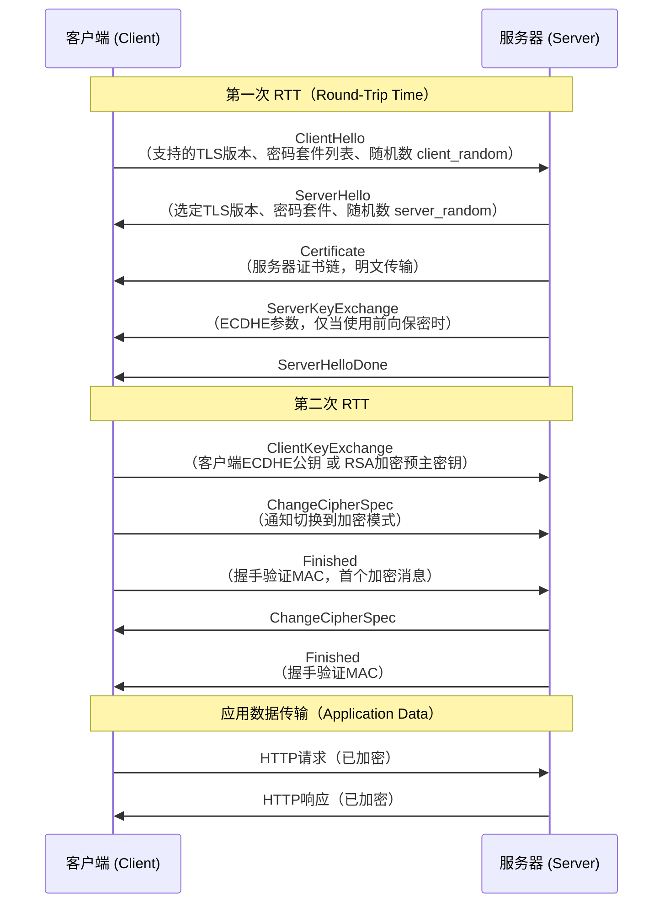
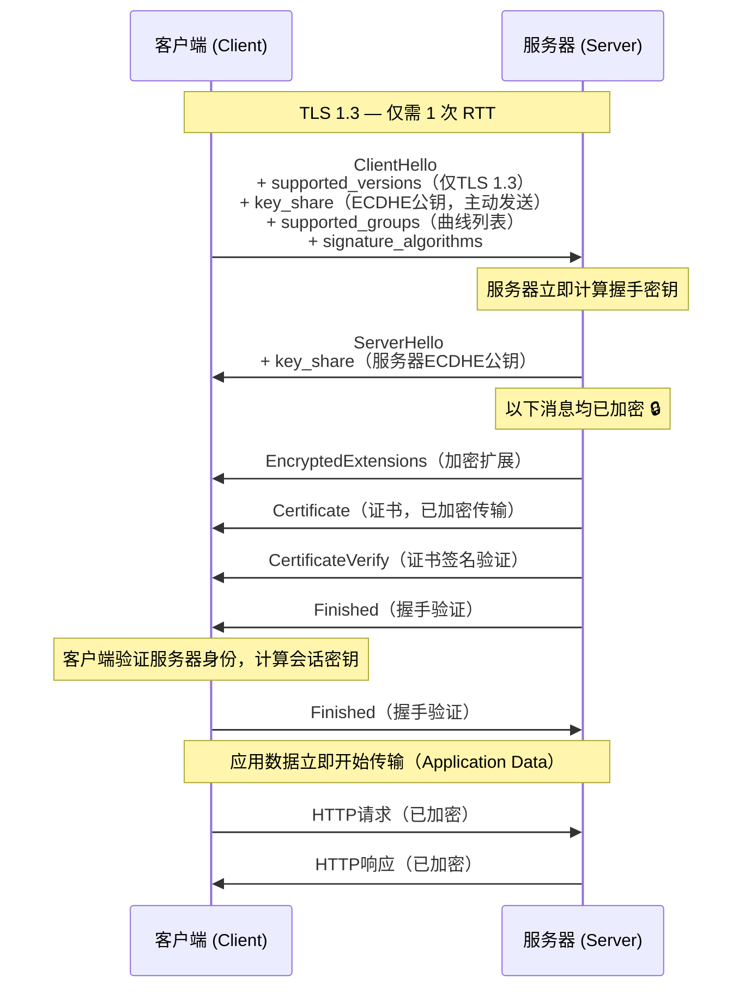
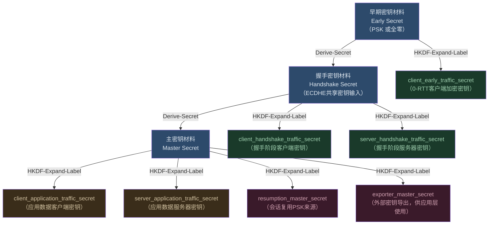
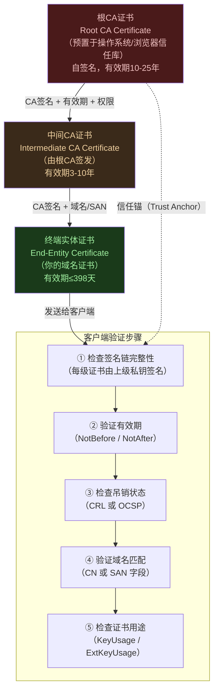
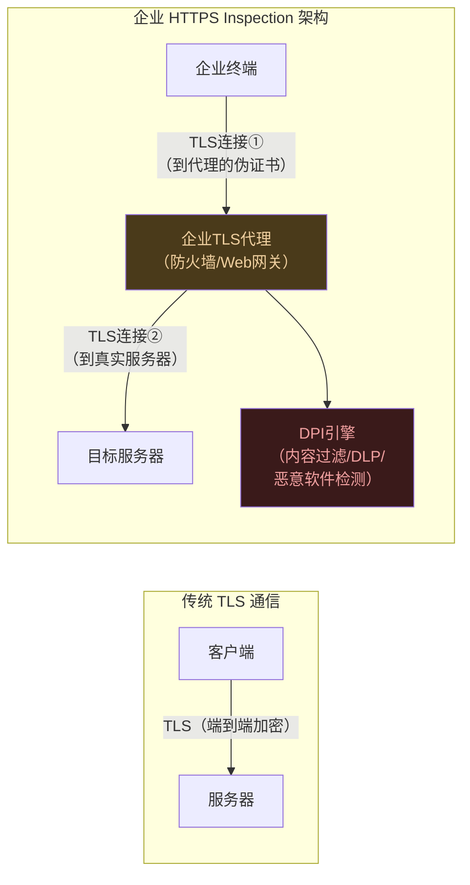
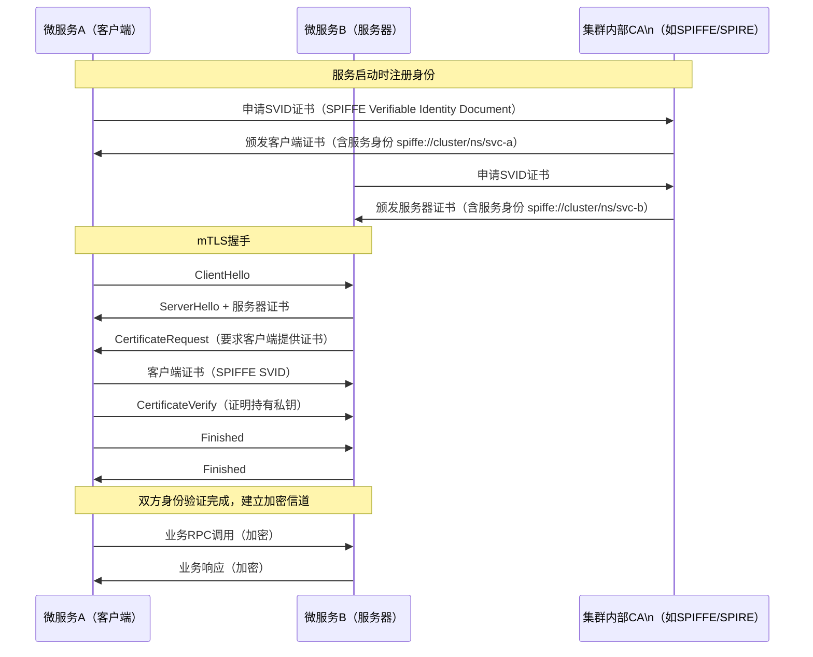

> 📋 **前置知识**：[PKI与数字证书](/guide/security/pki)、[HTTP协议](/guide/basics/http)、[网络加密基础](/guide/attacks/encryption)
> ⏱️ **阅读时间**：约20分钟

# TLS 1.3详解：现代网络加密的基石

## 导言：为什么TLS 1.3是历史上最重要的安全升级

2018年8月，IETF正式发布RFC 8446，宣告TLS 1.3（传输层安全协议 Transport Layer Security 1.3）正式成为标准。这不是一次简单的版本迭代——它几乎是对TLS协议的**彻底重写**。

自1994年Netscape发明SSL（安全套接字层 Secure Sockets Layer）以来，这个协议家族承载了互联网上几乎所有敏感数据的传输：银行密码、医疗记录、企业机密通信。然而随着密码学研究的深入，旧版本的弱点被一个接一个地曝光——POODLE、BEAST、DROWN——每一次攻击都在提醒我们：**安全协议的设计必须与时俱进**。

TLS 1.3做到了：
- **握手速度提升**：1-RTT（往返时间 Round-Trip Time）完成握手，比TLS 1.2减少一个网络来回
- **彻底清除历史包袱**：删除所有已知不安全的密码算法（RSA密钥交换、RC4、MD5等）
- **强制前向保密**（前向安全性 Perfect Forward Secrecy，PFS）：今天泄露的私钥无法解密过去的流量
- **握手加密**：证书信息不再以明文传输，防止流量分析

本文将从协议演进史出发，逐层深入TLS 1.3的技术细节，最终落脚于企业级部署实践。

---

## 第一部分：SSL/TLS演进史与已知漏洞

### 协议版本时间线

| 版本 | 发布时间 | 状态 | 主要问题 |
|------|----------|------|----------|
| SSL 2.0 | 1995年 | 已废弃（RFC 6176） | 消息认证缺陷、密钥交换弱点 |
| SSL 3.0 | 1996年 | 已废弃（RFC 7568） | POODLE攻击 |
| TLS 1.0 | 1999年 | 已废弃（RFC 8996） | BEAST攻击、CBC模式漏洞 |
| TLS 1.1 | 2006年 | 已废弃（RFC 8996） | 仍存在CBC问题 |
| TLS 1.2 | 2008年 | 可用（需正确配置） | 配置复杂，易出错 |
| TLS 1.3 | 2018年 | **推荐使用** | 无已知严重漏洞 |

### 历史上的重大漏洞

**POODLE攻击**（2014年，Padding Oracle On Downgraded Legacy Encryption）
攻击者通过强迫降级至SSL 3.0，利用其CBC（密码块链接 Cipher Block Chaining）填充验证缺陷，逐字节还原明文。这直接导致SSL 3.0被彻底废弃。

**BEAST攻击**（2011年，Browser Exploit Against SSL/TLS）
针对TLS 1.0的CBC模式实现，攻击者可对同一密钥加密的多个分组进行选择明文攻击，在浏览器场景下部分还原HTTP请求内容。

**DROWN攻击**（2016年，Decrypting RSA with Obsolete and Weakened eNcryption）
如果服务器同时支持SSLv2和TLS，且共享相同的RSA密钥对，攻击者可利用SSLv2的缺陷破解TLS会话——即使服务器的TLS配置本身没有问题。

::: danger 合规要求
PCI DSS（支付卡行业数据安全标准）自2018年起**明确禁止**使用TLS 1.0；NIST SP 800-52r2建议所有联邦系统**不得使用TLS 1.0/1.1**。企业若仍支持旧版本TLS，面临合规审计失败风险。
:::

---

## 第二部分：TLS 1.2握手——基准对比

理解TLS 1.3的改进，必须先深入TLS 1.2的握手流程。TLS 1.2使用**2-RTT握手**（未复用会话时），意味着在实际数据传输开始前，客户端与服务器需要完成两次完整的网络往返。

### TLS 1.2 完整握手（2-RTT）



### TLS 1.2密码套件解析

TLS 1.2的密码套件（Cipher Suite）名称编码了整个加密协商的参数，以 `TLS_ECDHE_RSA_WITH_AES_128_GCM_SHA256` 为例：

| 字段 | 值 | 含义 |
|------|----|------|
| 密钥交换（Key Exchange） | ECDHE | 椭圆曲线Diffie-Hellman临时密钥交换 |
| 认证（Authentication） | RSA | 用RSA证书验证服务器身份 |
| 加密（Encryption） | AES_128_GCM | 128位AES-GCM对称加密 |
| 消息摘要（Hash/MAC） | SHA256 | 握手完整性验证 |

**TLS 1.2支持的密钥交换方式**：
- **RSA**：客户端用服务器公钥加密预主密钥——无前向保密，私钥泄露则历史流量全部暴露
- **ECDHE**（椭圆曲线Diffie-Hellman临时 Ephemeral）：每次连接生成临时密钥对，提供前向保密
- **DHE**（有限域Diffie-Hellman临时 Finite Field）：类似ECDHE但性能较低

### TLS 1.2会话复用

为避免每次都进行完整的2-RTT握手，TLS 1.2提供两种会话复用（Session Resumption）机制：

**Session ID**：服务器在内存中存储会话状态，为每个会话分配一个ID。客户端再次连接时携带此ID，服务器可直接恢复会话，握手降至1-RTT。缺点：服务器有状态，集群环境需要Session同步。

**Session Ticket**（会话票据）：服务器将加密的会话状态打包成Ticket，发给客户端保存。下次连接时客户端带上Ticket，服务器解密后恢复会话。缺点：Ticket加密密钥本身需要妥善轮转管理。

::: warning TLS 1.2配置陷阱
TLS 1.2本身的安全性高度依赖**正确的密码套件配置**。若服务器开启了带有RSA密钥交换的套件（如 `TLS_RSA_WITH_AES_256_CBC_SHA`），则不具备前向保密。许多历史系统的配置问题正源于此。
:::

---

## 第三部分：TLS 1.3的革命性改进

### 1-RTT握手：化繁为简

TLS 1.3最显著的改进是将完整握手从2-RTT压缩到1-RTT。实现方式是：客户端在发送`ClientHello`时，**同时附上自己的密钥共享参数**（Key Share），无需等待服务器回应后再发送。



**关键改进对比**：

| 特性 | TLS 1.2 | TLS 1.3 |
|------|---------|---------|
| 握手RTT（首次） | 2-RTT | **1-RTT** |
| 握手RTT（复用） | 1-RTT | **0-RTT**（可选） |
| 证书传输 | 明文 | **加密传输** |
| ChangeCipherSpec | 需要 | **已移除** |
| RSA密钥交换 | 支持 | **已移除** |
| 前向保密 | 可选 | **强制** |

### 0-RTT会话恢复

TLS 1.3通过**PSK（预共享密钥 Pre-Shared Key）机制**实现0-RTT恢复。首次连接结束时，服务器颁发一个PSK给客户端（类似Ticket）。下次连接时，客户端可在第一个网络包中直接附上加密的应用数据——连握手都不需要等待完成。

```
客户端                              服务器
  |                                   |
  |──ClientHello + early_data──────>  |  ← 0-RTT，应用数据随握手一起发出
  |  (PSK身份标识 + 加密HTTP请求)     |
  |                                   |
  |<──ServerHello + ...────────────── |
  |<──HTTP响应────────────────────── |
```

::: danger 0-RTT重放攻击风险
0-RTT数据**不提供前向保密**，且**容易受到重放攻击**（Replay Attack）。攻击者若截获0-RTT数据包，可以原样重发，服务器无法区分这是合法请求还是重放。

**企业建议**：
- **仅对幂等操作启用0-RTT**（如HTTP GET请求、静态资源）
- **绝不对POST、支付、状态修改类请求使用0-RTT**
- 若不确定，默认禁用0-RTT，安全性优先于性能
:::

### 密码套件的极简化

TLS 1.3将支持的密码套件从TLS 1.2的数百个**压缩至5个**，全部基于AEAD（认证加密与关联数据 Authenticated Encryption with Associated Data）算法：

```
TLS_AES_128_GCM_SHA256         ← 默认推荐
TLS_AES_256_GCM_SHA384         ← 高安全需求
TLS_CHACHA20_POLY1305_SHA256   ← 移动端/低性能设备优选
TLS_AES_128_CCM_SHA256         ← IoT场景
TLS_AES_128_CCM_8_SHA256       ← 受限环境（标签缩短）
```

**被明确移除的不安全算法**：
- RC4（流密码，已有统计攻击）
- MD5、SHA-1（哈希碰撞已被证明）
- DES、3DES（密钥空间不足）
- CBC模式（填充预言攻击向量）
- RSA密钥交换（无前向保密）
- Export-grade密码（历史出口管制遗留）

---

## 第四部分：密码学原语深解

### ECDHE密钥交换

ECDHE（椭圆曲线Diffie-Hellman临时 Elliptic Curve Diffie-Hellman Ephemeral）是TLS 1.3强制使用的密钥交换机制。

基本原理：
1. 双方各自生成临时密钥对 `(私钥d, 公钥Q = d×G)`，其中G是椭圆曲线的基点
2. 双方互换公钥
3. 双方各自计算 `共享密钥 = d_client × Q_server = d_server × Q_client`（由椭圆曲线数学保证结果相同）
4. 共享密钥作为后续密钥派生的输入

TLS 1.3支持的椭圆曲线：
- **X25519**：Curve25519，高性能，抗侧信道攻击，**首选**
- **P-256**（secp256r1）：NIST标准曲线，兼容性好
- **P-384**（secp384r1）：更高安全级别，适合政府/金融

::: tip 为什么"临时"至关重要？
"Ephemeral"（临时）意味着每次连接都生成**全新的密钥对**，用完即弃。即使服务器的长期私钥未来被泄露，攻击者也无法解密之前用临时密钥加密的历史流量——这就是**前向保密（PFS）**的本质。
:::

### HKDF密钥派生

TLS 1.3使用HKDF（HMAC-based Key Derivation Function，基于HMAC的密钥派生函数）从单个输入密钥材料（IKM）派生多个用途各异的密钥：



这种**层次化密钥派生**的设计优势：
- 不同阶段（握手、应用数据、0-RTT）使用独立密钥，相互隔离
- 任一阶段密钥泄露不影响其他阶段
- 密钥可定期轮转（Key Update），无需重新握手

### AEAD加密：一次完成加密与认证

TLS 1.3强制使用AEAD（认证加密与关联数据）算法，而非TLS 1.2中分离的"加密+MAC"模式。

**AES-GCM**（高级加密标准-伽罗瓦/计数器模式 Galois/Counter Mode）：
- 使用CTR模式实现并行加密（高吞吐）
- GCM认证标签（128位）同时覆盖密文和关联数据（头部）
- 硬件加速广泛（Intel AES-NI指令集）

**ChaCha20-Poly1305**：
- ChaCha20流密码加密，Poly1305消息认证
- 无需AES硬件加速即可达到高性能
- 适合ARM移动处理器、嵌入式设备
- 抗时序侧信道攻击（恒定时间实现）

---

## 第五部分：证书验证与信任链

### X.509证书链验证

TLS握手中的服务器身份验证依赖PKI（公钥基础设施 Public Key Infrastructure）信任链：



### OCSP Stapling：解决证书吊销性能问题

传统OCSP（在线证书状态协议 Online Certificate Status Protocol）要求客户端在每次TLS握手时向CA的OCSP响应者发起查询，这带来两个问题：
1. **延迟**：增加一次额外的网络往返
2. **隐私泄露**：OCSP响应者得知用户访问了哪些网站

**OCSP Stapling**（OCSP钉扎）解决了这两个问题：
- 服务器定期向CA获取OCSP响应，并将其"钉"在TLS握手消息中直接发给客户端
- 客户端无需单独联系CA
- 服务器对OCSP响应进行缓存，通常有效期1-7天

::: tip OCSP Stapling配置（Nginx示例）
```nginx
ssl_stapling on;
ssl_stapling_verify on;
resolver 8.8.8.8 8.8.4.4 valid=300s;
resolver_timeout 5s;
ssl_trusted_certificate /path/to/chain.pem;
```
:::

### Certificate Transparency（CT日志）

CT（证书透明度 Certificate Transparency）是Google主导的证书公开审计机制，要求所有公开信任的TLS证书必须记录在可公开审计的CT日志（Append-only Merkle Tree）中。

**工作流程**：
1. CA签发证书后，将证书提交至一个或多个CT日志服务器
2. CT日志服务器返回SCT（签名证书时间戳 Signed Certificate Timestamp）
3. 证书或TLS握手中携带SCT，证明证书已登记
4. 浏览器（Chrome自2018年起）要求证书包含有效SCT，否则显示警告

这使得任何未经授权的错误证书签发（如CA被黑客入侵、错误颁发）都能被快速发现。

---

## 第六部分：企业TLS部署实践

### TLS版本强制配置

**Nginx**（推荐配置）：
```nginx
ssl_protocols TLSv1.2 TLSv1.3;
# 若有条件，可以只保留TLS 1.3
# ssl_protocols TLSv1.3;
```

**Apache**：
```apache
SSLProtocol -all +TLSv1.2 +TLSv1.3
```

**HAProxy**：
```
bind *:443 ssl crt /etc/ssl/certs/server.pem ssl-min-ver TLSv1.2
```

### 密码套件配置

推荐使用Mozilla SSL Config Generator（[ssl-config.mozilla.org](https://ssl-config.mozilla.org)）生成配置。以下是"现代"级别配置：

**Nginx（现代模式，仅TLS 1.3）**：
```nginx
ssl_protocols TLSv1.3;
ssl_prefer_server_ciphers off;
# TLS 1.3密码套件由OpenSSL内置，无需手动指定
```

**Nginx（中间兼容模式，TLS 1.2+1.3）**：
```nginx
ssl_protocols TLSv1.2 TLSv1.3;
ssl_ciphers ECDHE-ECDSA-AES128-GCM-SHA256:ECDHE-RSA-AES128-GCM-SHA256:ECDHE-ECDSA-AES256-GCM-SHA384:ECDHE-RSA-AES256-GCM-SHA384:ECDHE-ECDSA-CHACHA20-POLY1305:ECDHE-RSA-CHACHA20-POLY1305;
ssl_prefer_server_ciphers off;
```

::: warning 关于ssl_prefer_server_ciphers
TLS 1.3中推荐设置 `ssl_prefer_server_ciphers off`，让客户端根据自身性能选择最优密码套件（如移动端优先选ChaCha20）。若设为on，则强制使用服务器偏好的套件。
:::

### HSTS：HTTP严格传输安全

HSTS（HTTP Strict Transport Security，HTTP严格传输安全）通过响应头告知浏览器：**在指定时间内，必须使用HTTPS访问本站，禁止HTTP降级**。

```nginx
# Nginx配置
add_header Strict-Transport-Security "max-age=63072000; includeSubDomains; preload" always;
```

参数说明：
- `max-age=63072000`：有效期2年（HSTS Preload List要求最少1年）
- `includeSubDomains`：覆盖所有子域名
- `preload`：申请加入浏览器内置HSTS列表，即使首次访问也强制HTTPS

::: danger HSTS部署前提
部署HSTS前，必须确保：
1. **站点所有子域名均已支持HTTPS**（includeSubDomains会影响所有子域）
2. **证书有效且配置正确**（一旦HSTS生效，证书错误将导致用户无法访问）
3. **先用较短的max-age测试**（如 `max-age=300`），确认无误后再增大
:::

### TLS中间检测（HTTPS Inspection）的问题

企业防火墙、Web代理常常进行HTTPS拆包检查（TLS Inspection / SSL Inspection / MITM Proxy）：



**已知问题**：
- 代理使用自签证书，破坏了E2E（端到端 End-to-End）加密的信任模型
- 部分老旧TLS代理不支持TLS 1.3，会导致连接降级
- 代理设备本身成为安全瓶颈（若被攻破，所有流量暴露）
- 破坏了Certificate Transparency验证

**最佳实践**：
1. 确保代理设备支持TLS 1.3并及时更新
2. 对核心金融/医疗系统建立明确的bypass规则
3. 代理自签CA根证书通过企业MDM（移动设备管理）分发，而非手动安装
4. 记录所有HTTPS Inspection日志，用于审计追溯

### TLS安全测试工具

**testssl.sh**（开源命令行工具）：
```bash
# 全面测试服务器TLS配置
./testssl.sh example.com

# 仅检查协议支持情况
./testssl.sh -p example.com

# 检查密码套件
./testssl.sh -e example.com

# 检查已知漏洞
./testssl.sh -U example.com
```

**SSL Labs Server Test**（在线工具）：
访问 [ssllabs.com/ssltest](https://www.ssllabs.com/ssltest/)，输入域名获得A到F的评级报告，包含详细的配置问题分析。

**OpenSSL命令行验证**：
```bash
# 查看服务器证书详情
openssl s_client -connect example.com:443 -servername example.com

# 验证TLS版本支持
openssl s_client -connect example.com:443 -tls1_3

# 检查证书链完整性
openssl verify -CAfile chain.pem server.crt
```

---

## 第七部分：mTLS——服务网格中的双向认证

### 什么是mTLS

标准TLS只验证服务器身份（客户端匿名）。mTLS（双向TLS Mutual TLS）在此基础上**同时验证客户端身份**：服务器也会要求客户端提供证书，并验证其是否由可信CA签发。

**典型应用场景**：
- 微服务间通信（Service Mesh，如Istio、Linkerd）
- API网关认证（B2B API接口）
- 零信任网络中的设备身份验证
- Kubernetes集群内部服务通信

### mTLS握手流程



**SPIFFE**（安全生产身份框架 Secure Production Identity Framework for Everyone）是云原生环境下mTLS身份管理的标准，通过URI格式 `spiffe://<trust-domain>/<path>` 表达工作负载身份，与IP地址解耦，适应容器的动态调度特性。

::: tip Istio mTLS自动配置
在Istio服务网格中，mTLS可以通过PeerAuthentication策略自动启用，无需修改应用代码：
```yaml
apiVersion: security.istio.io/v1beta1
kind: PeerAuthentication
metadata:
  name: default
  namespace: production
spec:
  mtls:
    mode: STRICT  # 强制所有服务间通信使用mTLS
```
:::

---

## 总结：TLS 1.3的企业迁移路径

| 阶段 | 任务 | 优先级 |
|------|------|--------|
| **立即执行** | 禁用TLS 1.0/1.1，仅保留1.2+1.3 | 🔴 高 |
| **立即执行** | 移除所有无PFS的密码套件（RSA密钥交换） | 🔴 高 |
| **近期规划** | 启用OCSP Stapling | 🟡 中 |
| **近期规划** | 部署HSTS（从短max-age开始） | 🟡 中 |
| **近期规划** | 用SSL Labs对公网服务评级，目标A+ | 🟡 中 |
| **中期规划** | 评估并启用TLS 1.3（独占模式） | 🟢 低 |
| **中期规划** | 微服务场景引入mTLS（Istio/SPIRE） | 🟢 低 |
| **持续运营** | 证书有效期监控（避免证书过期） | 🔴 高 |
| **持续运营** | TLS代理/负载均衡器固件更新 | 🟡 中 |

TLS 1.3代表了密码协议设计的最高水准：在不牺牲安全性的前提下，通过精心的协议工程大幅提升性能；通过强制约束消除了配置失误的空间。对于企业安全团队而言，迁移至TLS 1.3不仅是技术升级，更是系统性降低攻击面的战略选择。

---

## 延伸阅读

- [RFC 8446 — The Transport Layer Security (TLS) Protocol Version 1.3](https://datatracker.ietf.org/doc/html/rfc8446)
- [Mozilla SSL Configuration Generator](https://ssl-config.mozilla.org/)
- [SSL Labs — SSL Server Test](https://www.ssllabs.com/ssltest/)
- [NIST SP 800-52r2 — Guidelines for TLS Implementations](https://csrc.nist.gov/publications/detail/sp/800-52/rev-2/final)
- [SPIFFE/SPIRE 官方文档](https://spiffe.io/)
