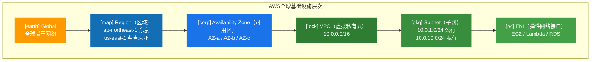
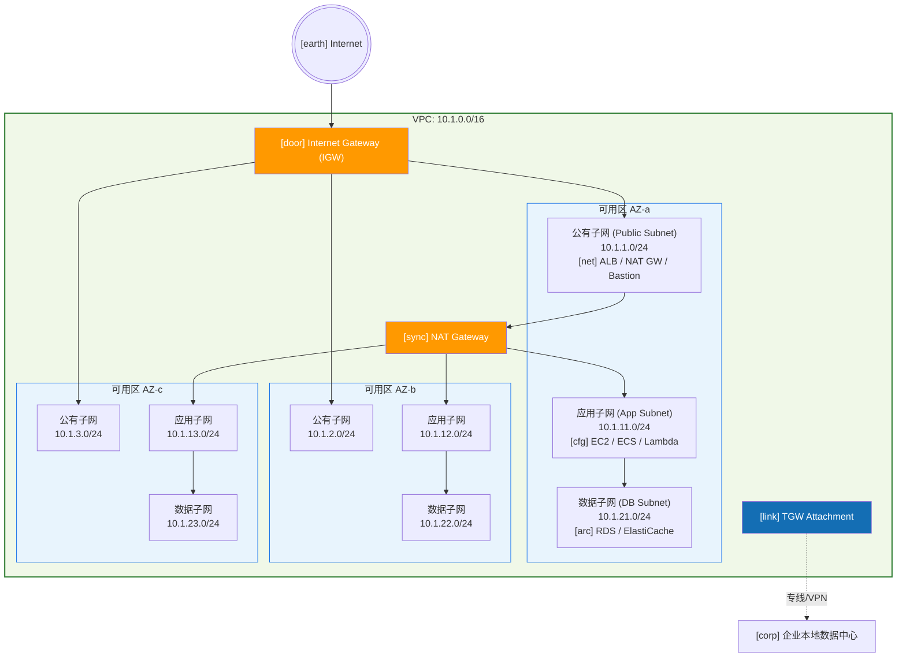
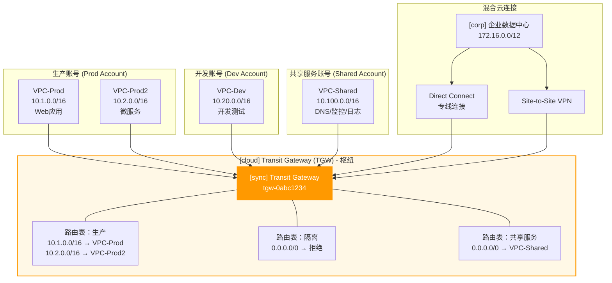
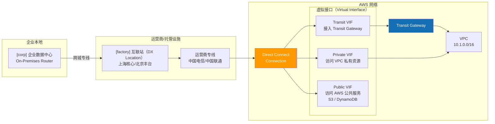
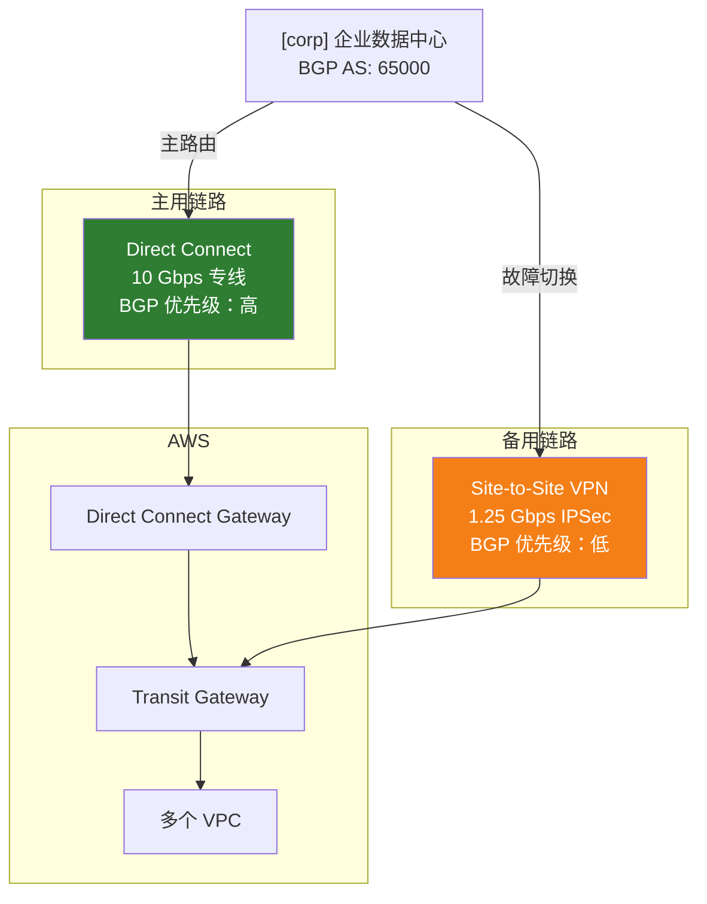
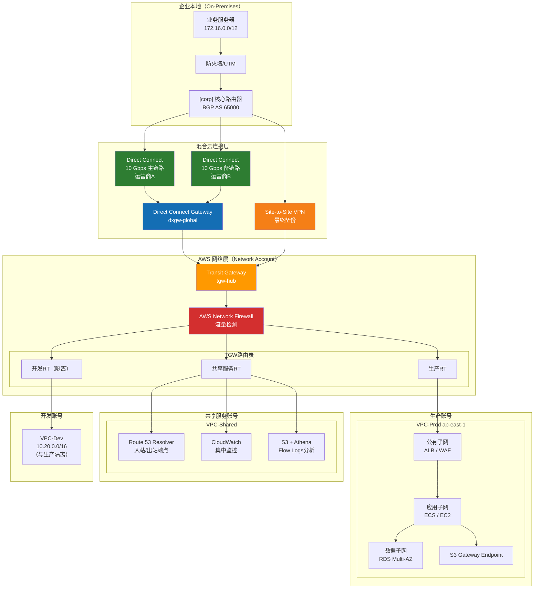

> <Icon name="clipboard-list" color="cyan" /> **前置知识**：[云网融合基础](/guide/cloud/hybrid-networking)、[IPSec VPN](/guide/security/ipsec)
> ⏱ **阅读时间**：约20分钟

# AWS云网络：VPC架构与混合云连接

AWS（Amazon Web Services）是全球最成熟的公有云平台，其网络体系以**虚拟私有云**（Virtual Private Cloud，VPC）为核心基石，向上延伸出 Transit Gateway（TGW）、Direct Connect（DX）、PrivateLink 等企业级互联能力。理解 AWS 网络，不仅仅是学习产品功能，更是掌握一套**软件定义网络**（SDN）在超大规模云环境中的工程实践。

本文从基础概念出发，逐层递进，覆盖 VPC 设计、多账号互联、混合云连接、网络安全及成本优化五个维度，帮助网络工程师与架构师建立系统性认知。

---

## 第一层：AWS网络基础概念层次

### 1.1 全球基础设施：从物理到逻辑

AWS 的网络从物理层到逻辑层分为四个嵌套层级：



| 层级 | 含义 | 关键特性 |
|------|------|---------|
| **Region（区域）** | 地理隔离的独立云环境 | 独立故障域，数据不自动跨区域复制 |
| **AZ（可用区）** | Region 内的物理数据中心集群 | 独立电力/网络，AZ间延迟 <2ms |
| **VPC** | 用户专属的虚拟网络 | 软件定义，CIDR 范围 /16 ~ /28 |
| **Subnet（子网）** | VPC 内的网段划分 | 每个子网必须绑定单个 AZ |
| **ENI** | 虚拟网卡 | 承载 IP、安全组、MAC 地址 |

::: tip 架构设计原则
**每个 Region 至少部署 3 个 AZ 的子网**，以实现真正的高可用。单 AZ 故障不应影响业务连续性。
:::

### 1.2 VPC 是软件定义的专属网络

VPC 本质上是一张**用代码定义的二层广播域隔离 + 三层路由**的虚拟网络。它的特点是：

- **完全隔离**：不同 VPC 之间默认无法通信（即使 CIDR 相同）
- **弹性扩展**：子网、路由表、安全策略均可动态修改
- **多租户共存**：物理网络由 AWS 共享，但逻辑上完全独立
- **IPv4 + IPv6 双栈**：支持 RFC 1918 私有地址 + AWS 分配的 IPv6 前缀

---

## 第二层：VPC 设计精要

### 2.1 CIDR 规划原则

CIDR（Classless Inter-Domain Routing）规划是 VPC 设计最关键的第一步，错误的规划会导致后期网络扩展时出现**地址冲突**，迁移成本极高。

::: warning 核心禁忌：避免 CIDR 重叠
若两个 VPC 需要 Peering（对等连接），其 CIDR **不能重叠**。规划阶段务必预留足够空间，且在企业内部建立统一的 IP 地址管理（IPAM）台账。
:::

**企业级 CIDR 规划建议**：

```
企业总体地址池：10.0.0.0/8

├── 生产账号（Production Account）
│   ├── VPC-Prod-Shanghai：10.1.0.0/16（65534个IP）
│   └── VPC-Prod-Tokyo：10.2.0.0/16
│
├── 测试账号（Staging Account）
│   └── VPC-Staging：10.10.0.0/16
│
├── 开发账号（Dev Account）
│   └── VPC-Dev：10.20.0.0/16
│
└── 共享服务账号（Shared Services）
    └── VPC-Shared：10.100.0.0/16（DNS、监控、日志）
```

### 2.2 三层子网架构（Multi-Tier Architecture）

企业生产环境标准三层子网设计，在每个 AZ 中重复部署：



### 2.3 路由表设计

**公有子网路由表**（关联 Internet Gateway）：

| 目标（Destination） | 目标网关（Target） | 说明 |
|---------------------|-------------------|------|
| `10.1.0.0/16` | local | VPC 内部本地路由 |
| `0.0.0.0/0` | igw-xxxxxxxx | 访问互联网 |
| `10.0.0.0/8` | tgw-xxxxxxxx | 访问企业内网（经TGW） |

**私有子网路由表**（关联 NAT Gateway）：

| 目标（Destination） | 目标网关（Target） | 说明 |
|---------------------|-------------------|------|
| `10.1.0.0/16` | local | VPC 内部本地路由 |
| `0.0.0.0/0` | nat-xxxxxxxx | 出站访问互联网（单向） |
| `10.0.0.0/8` | tgw-xxxxxxxx | 访问企业内网（经TGW） |

### 2.4 Internet Gateway vs NAT Gateway

| 特性 | Internet Gateway (IGW) | NAT Gateway |
|------|----------------------|-------------|
| **方向** | 双向（入站+出站） | 单向（仅出站） |
| **适用** | 公有子网资源（ALB、堡垒机） | 私有子网资源主动访问互联网 |
| **IP 类型** | 需要 EIP 或公有 IP | 固定 EIP（出站 SNAT） |
| **高可用** | 单 VPC 单 IGW，天然高可用 | 每个 AZ 部署独立 NAT GW |
| **费用** | 免费 | 约 $0.045/小时 + 数据处理费 |

::: tip 最佳实践
每个 AZ 部署独立的 NAT Gateway，避免跨 AZ 流量费用（$0.01/GB）和单点故障。私有子网路由表分别指向本 AZ 的 NAT GW。
:::

### 2.5 VPC Endpoint：消除数据出口费用

**VPC Endpoint** 允许 VPC 内资源通过 AWS 私有网络访问 S3、DynamoDB 等服务，**不经过公网**，消除 NAT Gateway 的数据处理费用。

| 类型 | 接口型（Interface Endpoint） | 网关型（Gateway Endpoint） |
|------|------------------------------|---------------------------|
| **原理** | 在 VPC 内创建 ENI，私有 IP | 修改路由表，添加前缀列表路由 |
| **支持服务** | 100+ AWS 服务（SQS、SNS、ECR…） | 仅 S3 和 DynamoDB |
| **费用** | ~$0.01/小时/AZ + 数据费 | **免费** |
| **DNS 解析** | 服务域名解析为私有 IP | 路由表条目匹配 |

::: tip 成本优化
S3 和 DynamoDB 必须使用**免费的网关型 Endpoint**。若大量访问 ECR（容器镜像拉取），接口型 Endpoint 的费用往往远低于 NAT Gateway 的数据处理费。
:::

---

## 第三层：VPC 互联架构

### 3.1 VPC Peering（对等连接）

VPC Peering 是两个 VPC 之间的**点对点私有连接**，流量不经过公网。

**核心限制**：
- **不可传递（Non-transitive）**：A↔B、B↔C，不代表 A↔C 可达，需单独创建 A↔C 的 Peering
- CIDR 不能重叠
- 跨 Region Peering 支持，但有跨区域数据传输费用

适用场景：少量 VPC（<5个）之间简单互联。VPC 数量增加时，Peering 数量呈 **O(n²)** 增长，难以管理，应使用 Transit Gateway。

### 3.2 Transit Gateway（TGW）：枢纽辐射架构

Transit Gateway 是 AWS 的**云上网络交换机**，支持数千个 VPC 和本地网络的统一连接，采用枢纽辐射（Hub-and-Spoke）架构。



### 3.3 TGW 路由表隔离设计

TGW 通过**多路由表**实现网络分段（Segmentation），不同安全等级的 VPC 使用不同路由表，精确控制互访关系：

```
TGW 路由表设计（网络分区隔离）：

[list] 生产路由表（Production RT）
  ├── 关联（Association）：VPC-Prod、VPC-Prod2
  ├── 10.1.0.0/16 → VPC-Prod Attachment
  ├── 10.2.0.0/16 → VPC-Prod2 Attachment
  ├── 10.100.0.0/16 → VPC-Shared Attachment（访问共享服务）
  └── 172.16.0.0/12 → DX/VPN Attachment（访问本地）

[list] 开发路由表（Dev RT）
  ├── 关联（Association）：VPC-Dev
  ├── 10.20.0.0/16 → VPC-Dev Attachment（仅限本VPC）
  └── 10.100.0.0/16 → VPC-Shared Attachment（可访问共享服务）
  [x] 无法访问生产网络

[list] 共享服务路由表（Shared RT）
  ├── 关联（Association）：VPC-Shared
  ├── 10.0.0.0/8 → 所有VPC（可被所有环境访问）
  └── 172.16.0.0/12 → DX/VPN Attachment
```

### 3.4 Resource Access Manager（RAM）跨账号共享

TGW 创建在**共享服务账号**，通过 **AWS RAM（Resource Access Manager）** 共享给组织（AWS Organizations）内的其他账号，各账号只需创建 VPC Attachment 接入即可，TGW 本身由平台团队统一管理。

```
AWS Organizations
└── 组织根（Root）
    ├── 平台账号（Platform）
    │   └── TGW（通过RAM共享）→ 整个组织
    ├── 生产 OU（Production OU）
    │   ├── 账号A → 接受TGW共享，创建Attachment
    │   └── 账号B → 接受TGW共享，创建Attachment
    └── 开发 OU（Dev OU）
        └── 账号C → 接受TGW共享，创建Attachment
```

::: tip 企业最佳实践
在 AWS Landing Zone 架构中，TGW 统一放在"网络账号"（Network Account），通过 RAM 向组织共享。这样可以实现**集中管控**：统一路由策略、统一流量监控、统一成本归属。
:::

---

## 第四层：混合云连接

### 4.1 连接方案全景对比

企业将本地数据中心（On-Premises）与 AWS 连接，主要有三种方案：

| 特性 | Site-to-Site VPN | Direct Connect（DX）| DX + VPN备份 |
|------|-----------------|---------------------|-------------|
| **传输介质** | 公网加密隧道 | 专用物理线路 | 专线主用+VPN备用 |
| **带宽** | 最高 1.25 Gbps/隧道 | 1G / 10G / 100G | 取决于DX规格 |
| **延迟** | 较高（50-100ms） | 稳定低延迟（<10ms） | 通常走DX |
| **可靠性** | 依赖互联网 | SLA 99.9% | 高可用 |
| **建设周期** | 分钟级（软件配置） | 数周至数月（运营商施工） | 较长 |
| **费用** | 低（$0.05/小时/连接） | 高（端口费+数据费） | 最高 |
| **适用场景** | 快速接入、灾备 | 大流量、关键业务 | 生产首选 |

### 4.2 AWS Site-to-Site VPN（IPSec）

AWS VPN 使用**标准 IPSec 协议**，每个连接包含两条隧道（Tunnel），分别终结在不同 AZ 的 AWS VPN 端点，实现冗余：

```
企业防火墙（Customer Gateway）
  ├── Tunnel 1 → AWS VPN Endpoint（AZ-a） ─┐
  └── Tunnel 2 → AWS VPN Endpoint（AZ-b） ─┘
                                           Virtual Private Gateway (VGW)
                                           或 Transit Gateway
```

**关键参数**：
- 加密：AES-256-GCM
- 完整性：SHA-256 / SHA-384
- DH 组：14、19、20（推荐 20 = 256-bit ECC）
- BGP（Border Gateway Protocol）动态路由：推荐，支持自动故障切换
- 静态路由：简单但不支持自动切换

::: warning VPN 带宽限制
每条 VPN 连接（2条隧道）的总带宽上限约 **1.25 Gbps**。若需更高带宽，必须使用 Direct Connect 或多条 VPN 并行（结合 ECMP 等价多路径负载均衡，需 TGW 支持）。
:::

### 4.3 AWS Direct Connect（DX）专线

Direct Connect 是 AWS 提供的**物理专线接入**服务，通过合作运营商（Partner）或直接在 AWS 接入点（DX Location）拉光纤实现：



**虚拟接口（Virtual Interface，VIF）类型**：
- **Private VIF**：访问单个 VPC 的私有资源，需关联 Virtual Private Gateway（VGW）
- **Transit VIF**：接入 Transit Gateway，可访问多个 VPC（企业首选）
- **Public VIF**：访问 AWS 公共端点（如 S3、DynamoDB），流量不过 VPC

::: tip Direct Connect Gateway（DXGW）
使用 **Direct Connect Gateway** 可以将一条专线连接到多个 Region 的 TGW，实现全球网络的统一专线接入，避免每个 Region 单独拉线。
:::

### 4.4 DX + VPN 冗余设计（推荐生产方案）



**BGP 路由优化策略**：
- DX 路由：使用较长的 AS Path 让本地路由优先走 DX（不附加 AS-PATH）
- VPN 路由：附加额外 AS-PATH Prepend，使其成为备用路由
- AWS 侧：通过 Local Preference 或 MED 属性控制流量优先级

::: danger 专线冗余必须性
生产环境中，**单条 DX 专线不等于高可用**。AWS DX SLA 保障的是连接可用性，但物理链路（运营商侧）故障无法预防。企业关键业务必须同时部署 DX + VPN 或双 DX（不同运营商）作为冗余。
:::

---

## 第五层：网络安全与高级服务

### 5.1 安全组（Security Group）vs 网络 ACL（NACL）

AWS 提供两层网络访问控制，两者的设计哲学截然不同：

| 特性 | 安全组（Security Group） | 网络ACL（NACL） |
|------|--------------------------|----------------|
| **作用层级** | ENI（网卡）级别 | 子网级别 |
| **状态跟踪** | **有状态**（Stateful）：自动放行响应流量 | **无状态**（Stateless）：需单独配置入站和出站 |
| **规则类型** | 仅允许规则（白名单） | 允许 + 拒绝规则 |
| **规则评估** | 所有规则取并集 | 按规则编号顺序匹配，首条匹配即止 |
| **适用场景** | 精细控制资源级访问 | 子网级别粗粒度封锁（如屏蔽特定 IP 段） |

**典型配置组合**：

```
NACL（子网级防护）：
  入站 100: ALLOW TCP 443 FROM 0.0.0.0/0
  入站 200: ALLOW TCP 80 FROM 0.0.0.0/0
  入站 900: DENY ALL FROM 203.0.113.0/24  ← 屏蔽恶意IP段
  入站 *:   DENY ALL

安全组（EC2实例防护）：
  入站: ALLOW TCP 443 FROM ALB安全组ID  ← 仅允许来自ALB的流量
  入站: ALLOW TCP 22 FROM 运维堡垒机安全组ID
  出站: ALLOW ALL
```

### 5.2 VPC Flow Logs（流量日志）

VPC Flow Logs 捕获进出 ENI 的网络流量元数据（非内容），是**网络安全分析**和**故障排查**的重要工具：

```
# Flow Log 记录格式示例
版本  账号ID          接口ID      源IP           目标IP         源端口  目标端口 协议 包数 字节数  开始时间   结束时间   动作
2     123456789012    eni-abc123  10.1.11.50     10.100.1.10    54321   443      6    10   15400   1620000000 1620000060 ACCEPT
2     123456789012    eni-abc123  10.1.11.50     1.2.3.4        34567   443      6    5    7200    1620000000 1620000060 REJECT
```

Flow Logs 可发送到 **CloudWatch Logs** 或 **S3**，结合 Athena 进行大规模查询分析。

### 5.3 AWS Network Firewall

AWS Network Firewall 是托管的**有状态防火墙**服务，支持：
- 5元组流量过滤（源/目的 IP、端口、协议）
- **Suricata 兼容规则**（IDS/IPS 规则）
- 域名过滤（FQDN 白名单/黑名单）
- TLS 检测（SNI 字段）

部署位置：通常部署在**专用防火墙子网**，所有出入 VPC 的流量通过 Gateway Load Balancer（GWLB）Endpoint 引流：

```
互联网流量进入路径：
IGW → IGW路由表（引流至GWLBe）→ GWLBe → Network Firewall
→ GWLBe → 公有子网（ALB）→ 私有子网（EC2）
```

### 5.4 高级网络服务

#### AWS Global Accelerator（全球加速器）

Global Accelerator 为应用提供**全球任播（Anycast）IP**，用户流量从最近的 AWS 边缘节点接入，经 AWS 骨干网传输至应用所在 Region，解决跨大洲长距离网络质量不稳定问题：

```
用户（北京）→ 就近接入 AWS 中国边缘节点
           → AWS 骨干网（低延迟、低抖动）
           → 应用 Region（如 ap-southeast-1 新加坡）
           
对比直接访问：
用户（北京）→ 公共互联网（路由不稳定、丢包）→ 应用 Region
```

**适用场景**：跨洲际用户访问、游戏、实时通信、全球 API 网关。

#### AWS PrivateLink

PrivateLink 允许将**自己的服务**或 AWS 服务通过私有 ENI 的方式暴露给其他 VPC 消费，**完全不经过公网，也不需要 VPC Peering**：

```
服务提供方 VPC（Service Provider）：
  EC2/NLB → Endpoint Service（VPC Endpoint Service）

服务消费方 VPC（Service Consumer）：
  Interface Endpoint（ENI，私有IP：10.x.x.x）→ 访问服务提供方

优势：
  [v] 无需暴露 CIDR，CIDR 可以重叠
  [v] 服务提供方控制谁可以连接（白名单）
  [v] 适合 SaaS 多租户场景、内部微服务跨账号调用
```

#### Amazon Route 53（DNS 服务）

Route 53 在 AWS 网络中扮演核心 DNS 角色：

| 功能 | 说明 |
|------|------|
| **公有 DNS** | 注册域名、解析公有 IP |
| **私有托管区（Private Hosted Zone）** | 在 VPC 内解析内部域名（`*.internal`） |
| **健康检查 + 故障转移** | 自动将流量切换到健康端点 |
| **延迟路由（Latency Routing）** | 将用户路由到延迟最低的 Region |
| **加权路由（Weighted Routing）** | 蓝绿发布、灰度发布场景 |

::: tip 混合云 DNS 解析
在混合云场景下，需要通过 **Route 53 Resolver**（入站/出站端点）实现本地数据中心与 AWS VPC 之间的 DNS 互相解析，是混合云网络打通后的必要配置。
:::

---

## 第六层：成本优化

### 6.1 AWS 数据传输费用规律

数据传输（Data Transfer）费用是 AWS 网络成本的主要来源，掌握以下规律可显著降低费用：

```
费用从低到高排列：

免费：
  ① VPC 内同 AZ 之间的流量（使用私有 IP）
  ② AWS 服务访问 S3/DynamoDB（通过 Gateway Endpoint）
  ③ 入站流量（Internet → AWS）

低费：
  ④ 同 Region 跨 AZ 流量：$0.01/GB（双向）
  ⑤ 使用 VPC Endpoint 访问支持服务（仅处理费）

中等费：
  ⑥ NAT Gateway 数据处理：$0.045/GB
  ⑦ Direct Connect 数据出站：$0.02-0.08/GB（低于公网）

高费：
  ⑧ 跨 Region 流量：$0.02-0.09/GB
  ⑨ 公网出站（Internet 出站）：$0.09/GB（前 10TB/月）
```

### 6.2 十大降本建议

1. **同 AZ 内通信**：将频繁通信的服务部署在同一 AZ，使用**私有 IP** 通信
2. **Gateway Endpoint**：S3 和 DynamoDB 必须使用免费的 Gateway Endpoint
3. **Interface Endpoint**：评估 ECR/SQS/SNS 的 Endpoint 费用 vs NAT Gateway 数据费
4. **VPC Peering**：对于少量固定的 VPC 互联，Peering 比 TGW（$0.02/GB）便宜
5. **CloudFront**：静态内容通过 CloudFront 分发，大幅减少源站出站流量费
6. **Direct Connect**：高带宽场景下 DX 数据传输费（$0.02/GB）远低于公网（$0.09/GB）
7. **S3 Transfer Acceleration** vs **CloudFront**：评估具体场景选择最优上传加速方案
8. **压缩传输**：在应用层启用 gzip/brotli 压缩，减少实际传输字节数
9. **Cost Allocation Tags**：对 NAT GW、TGW 流量打标签，定位高成本流量来源
10. **VPC Flow Logs 采样**：大流量 VPC 使用流量采样（1/10 或 1/100），降低 CloudWatch Logs 存储成本

---

## 架构实战：企业混合云网络参考架构

下图展示一个典型的企业级 AWS 混合云网络完整拓扑：



---

## 核心知识点总结

| 知识域 | 核心要点 | 关键服务 |
|--------|---------|---------|
| **VPC 基础** | CIDR 不重叠，三层子网（公有/应用/数据） | VPC, Subnet, IGW, NAT GW |
| **VPC 互联** | <5个VPC用Peering，否则用TGW；TGW路由表实现隔离 | VPC Peering, Transit Gateway |
| **混合云** | DX主+VPN备，BGP动态路由实现自动切换 | Direct Connect, Site-to-Site VPN |
| **网络安全** | SG（有状态/资源级）+ NACL（无状态/子网级）双层防护 | Security Group, NACL, Network Firewall |
| **DNS** | Route 53 Resolver 实现混合云双向 DNS 解析 | Route 53, Resolver Endpoints |
| **成本** | 同AZ通信免费，S3用Gateway Endpoint，大流量用DX | VPC Endpoint, CloudFront |

::: tip 下一步深入
掌握 AWS 网络基础后，可继续深入：
- [容器网络（Container Networking）](/guide/cloud/container-networking)：EKS CNI 插件与 Pod 网络设计
- [零信任安全架构](/guide/security/zero-trust)：在云环境实施零信任网络访问（ZTNA）
- [SD-WAN 架构](/guide/sdwan/architecture)：AWS 网络与 SD-WAN Overlay 的集成
:::

---

*参考文档：[AWS VPC 用户指南](https://docs.aws.amazon.com/vpc/latest/userguide/) | [AWS Direct Connect 用户指南](https://docs.aws.amazon.com/directconnect/latest/UserGuide/) | [Transit Gateway 最佳实践](https://docs.aws.amazon.com/vpc/latest/tgw/)*
