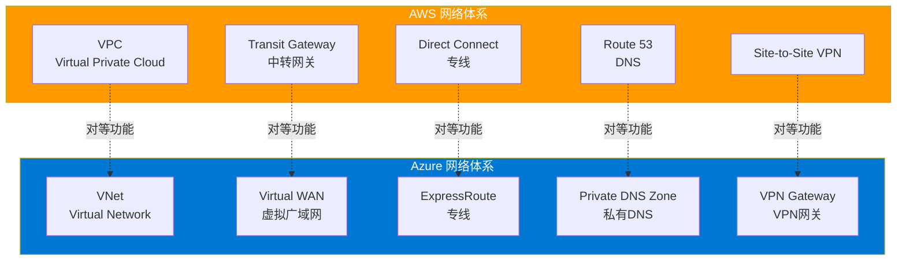
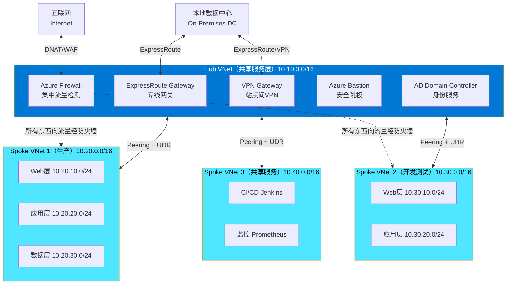
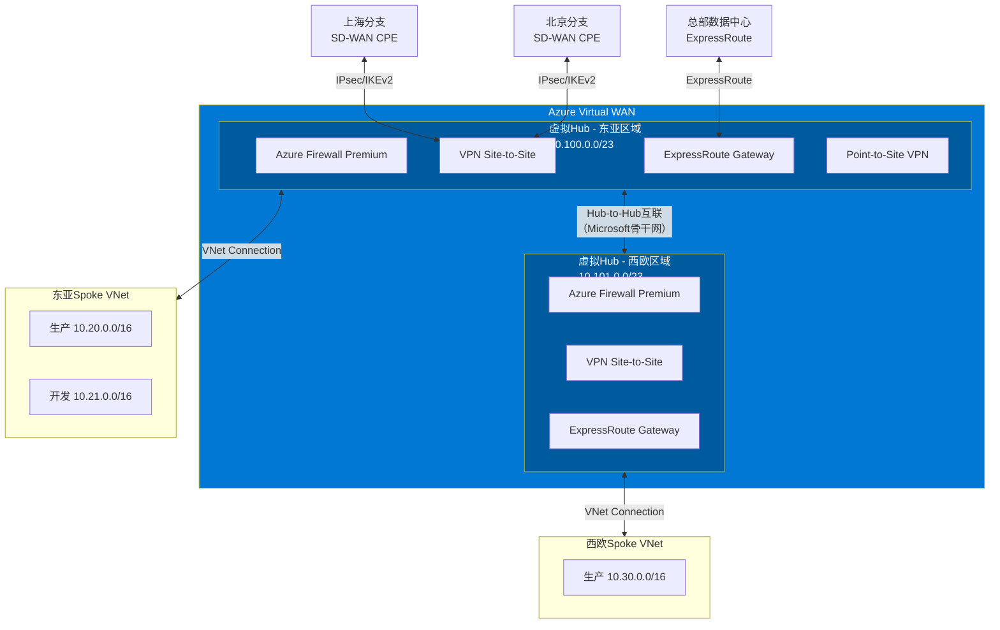
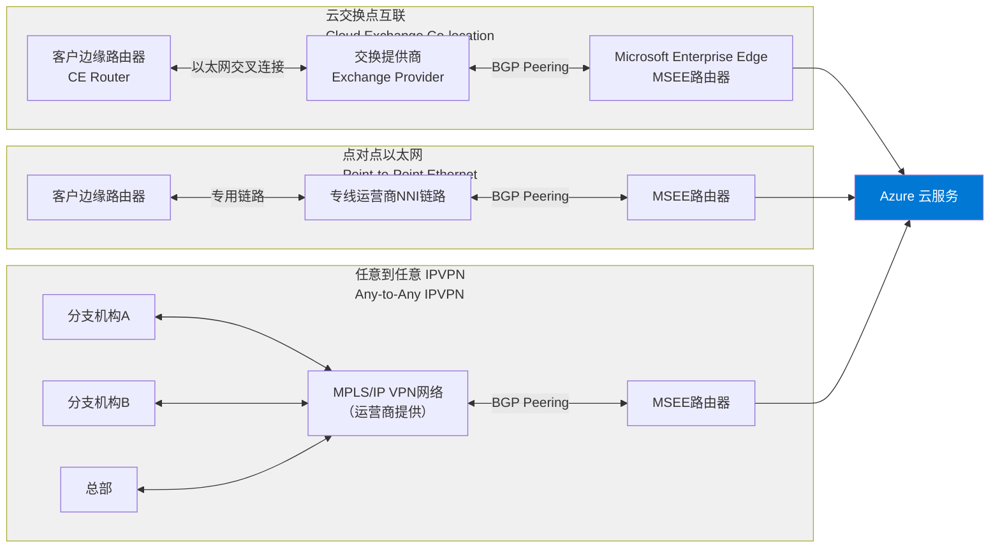
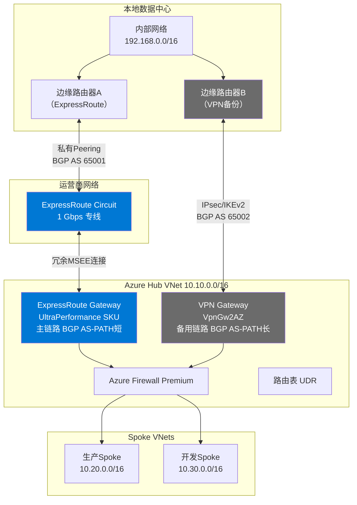
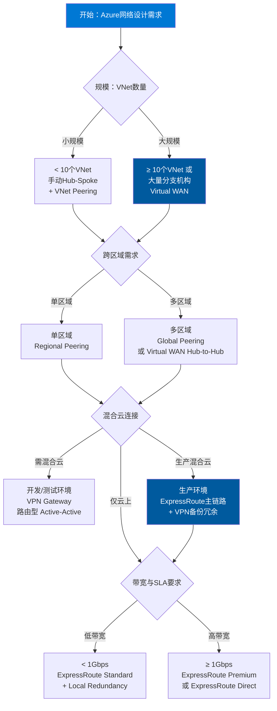

> <Icon name="clipboard-list" color="cyan" /> **前置知识**：[AWS云网络](/guide/cloud/aws-networking)、[混合云网络](/guide/cloud/hybrid-networking)
> ⏱ **阅读时间**：约18分钟

# Azure云网络：虚拟网络与混合云架构

Azure（Microsoft Azure）是全球三大公有云平台之一，其网络体系以**软件定义网络（Software Defined Networking, SDN）**为基础，提供从基础隔离到全球互联的完整能力。与AWS相比，Azure的网络设计更侧重企业级混合云场景，ExpressRoute专线的成熟度与覆盖范围在业界处于领先地位。

本文从企业架构师的视角，系统讲解Azure网络的核心组件、设计模式与最佳实践，帮助团队在迁移或扩展Azure基础设施时做出有依据的架构决策。

---

## 第一层：Azure网络的层次结构

### 1.1 全局组织层次

Azure网络资源的组织遵循清晰的层次结构，理解这一层次是设计任何Azure网络架构的前提。

```
Azure Active Directory 租户 (Tenant)
└── 管理组 (Management Group)
    └── 订阅 (Subscription)
        └── 资源组 (Resource Group)
            ├── 虚拟网络 (VNet)
            │   ├── 子网 (Subnet)
            │   └── 网络安全组 (NSG)
            ├── 公共IP (Public IP)
            ├── 负载均衡器 (Load Balancer)
            └── 其他网络资源
```

- **租户（Tenant）**：对应一个Azure AD目录，是身份与访问管理的顶层边界。
- **订阅（Subscription）**：计费与配额边界，也是资源部署的基本单位。大型企业通常按业务部门或环境（生产/测试/开发）划分订阅。
- **资源组（Resource Group）**：逻辑容器，同一资源组内的资源共享生命周期。网络资源建议独立资源组管理，与计算资源解耦。
- **区域（Region）**：Azure在全球超过60个地理区域提供服务，VNet属于区域级资源，跨区域互联需要VNet Peering或Virtual WAN。
- **可用区（Availability Zone, AZ）**：同一区域内物理隔离的数据中心，用于高可用部署。VPN Gateway、ExpressRoute Gateway等支持区域冗余（Zone-Redundant）部署。

::: tip 订阅设计建议
企业应采用**Landing Zone**模式组织订阅，将网络、身份、安全等平台服务放置在独立的"平台订阅"中，应用工作负载放置在各自的"工作负载订阅"中，通过管理组统一治理策略。
:::

### 1.2 Azure网络与AWS网络对比概览



| AWS服务 | Azure对等服务 | 主要差异 |
|---------|--------------|---------|
| VPC | VNet | Azure VNet不支持次级CIDR，但支持多地址空间 |
| Transit Gateway | Virtual WAN | VWAN全托管，TGW更灵活可控 |
| Direct Connect | ExpressRoute | ExpressRoute覆盖更多运营商，支持Global Reach |
| Security Group | NSG | NSG可绑定子网或网卡，规则支持服务标签 |
| AWS Firewall | Azure Firewall | Azure Firewall原生支持FQDN过滤与威胁情报 |
| Route 53 Private | Private DNS Zone | 均支持自动注册，Azure通过链接VNet关联 |
| VPC Endpoint | Private Endpoint / Service Endpoint | Azure有两种模式，Private Endpoint更强 |

---

## 第二层：虚拟网络（VNet）核心设计

### 2.1 地址空间与子网规划

Azure VNet的地址空间（Address Space）支持RFC 1918私有地址范围，一个VNet可以有多个不连续的地址空间（与AWS VPC只支持单一CIDR不同）。

**子网（Subnet）设计原则：**

1. **预留Azure保留地址**：每个子网前4个IP和最后1个IP由Azure保留（共5个），规划时需将此计入。
2. **按工作负载隔离子网**：Web层、应用层、数据层分别使用独立子网，结合NSG实施最小权限控制。
3. **专用子网不要混用**：`GatewaySubnet`（VPN/ExpressRoute）、`AzureFirewallSubnet`、`AzureBastionSubnet`必须独占，不能部署其他资源。
4. **为未来扩展留余量**：建议至少预留20%的地址空间供后续扩展。

```
企业典型VNet地址规划（示例：10.10.0.0/16）
├── 10.10.0.0/27   - GatewaySubnet（VPN/ExpressRoute网关）
├── 10.10.1.0/26   - AzureFirewallSubnet（Azure Firewall）
├── 10.10.2.0/27   - AzureBastionSubnet（跳板机）
├── 10.10.10.0/24  - Web层子网（公开访问）
├── 10.10.20.0/24  - 应用层子网（内部通信）
├── 10.10.30.0/24  - 数据层子网（严格隔离）
├── 10.10.40.0/24  - 管理子网（运维专用）
└── 10.10.100.0/22 - 预留扩展空间
```

### 2.2 网络安全组（NSG）vs Azure Firewall

这是Azure网络安全设计中最常见的决策点之一。

**网络安全组（Network Security Group, NSG）**是L4级别的无状态（Stateful）访问控制列表，支持绑定到子网或网络接口卡（NIC）。规则按优先级（100-4096，数字越小优先级越高）匹配，可使用**服务标签（Service Tag）**（如`Internet`、`AzureCloud`、`Storage`）代替具体IP段。

**Azure Firewall**是托管的云原生防火墙，提供：
- L3-L7应用层过滤（FQDN、URL过滤）
- 威胁情报（Threat Intelligence）集成，可阻断已知恶意IP/域名
- DNAT规则（入站流量转发）
- 全局策略通过**Azure Firewall Policy**统一管理
- 原生支持主动/主动区域冗余部署

::: warning NSG与Azure Firewall不是互斥关系
生产环境推荐**同时使用**：NSG作为子网级别的基础隔离（最小粒度控制），Azure Firewall作为Hub中央控制点处理跨子网/跨VNet/出口流量的精细策略。两层防御形成纵深安全（Defense in Depth）。
:::

### 2.3 用户定义路由（UDR）

Azure VNet内默认有系统路由，流量按最长前缀匹配原则转发。**用户定义路由（User Defined Route, UDR）**允许覆盖系统路由，强制流量经过特定下一跳（Next Hop），典型场景：

- **强制隧道（Forced Tunneling）**：将互联网出口（0.0.0.0/0）指向本地防火墙或Azure Firewall
- **Hub-Spoke流量控制**：Spoke子网的路由表将目标Spoke流量指向Hub中的Azure Firewall，实现东西向流量检测

```
路由表示例（应用层子网）
目标前缀          下一跳类型        下一跳地址
0.0.0.0/0        Virtual Appliance  10.10.1.4（Azure Firewall内网IP）
10.0.0.0/8       Virtual Appliance  10.10.1.4（所有内网流量经防火墙）
```

### 2.4 服务端点 vs 私有端点

访问Azure PaaS服务（存储、数据库等）有两种私有化方案，差异显著：

| 特性 | 服务端点（Service Endpoint） | 私有端点（Private Endpoint） |
|------|---------------------------|---------------------------|
| 实现机制 | 路由优化，流量走Azure骨干网 | 在VNet内分配私有IP | 
| 公网访问 | 可限制，但服务仍有公网端点 | 服务完全无公网端点（可配置） |
| 跨VNet访问 | 不支持跨VNet（需Peering） | 通过私有IP，可跨Peering/VPN访问 |
| DNS集成 | 无需额外DNS配置 | 需Private DNS Zone解析 |
| 适用场景 | 快速内网化，安全要求一般 | 高安全要求，严格隔离PaaS服务 |
| 成本 | 免费 | 按端点数量和数据量计费 |

::: tip 企业推荐
新建项目优先使用**私有端点**，尤其是涉及敏感数据的存储账户、Azure SQL、Key Vault等。服务端点适合低敏感度的辅助服务快速内网化。
:::

---

## 第三层：VNet互联架构模式

### 3.1 VNet Peering（虚拟网络对等互联）

VNet Peering是两个VNet之间的私有IP直连，流量不经公网，延迟极低。分为两种：
- **同区域Peering（Regional VNet Peering）**：同一Azure区域内，不收取数据传输费。
- **跨区域Peering（Global VNet Peering）**：跨区域连接，按传输数据量计费。

**Peering关键特性：**
- 非传递性（Non-Transitive）：VNet A ↔ B、B ↔ C，A不能直接访问C，需要显式建立A ↔ C的Peering或使用Hub-Spoke+UDR中转
- 必须双向创建：需在两个VNet上分别创建Peering链接
- 不支持重叠地址空间

### 3.2 Hub-Spoke拓扑（推荐企业架构）

Hub-Spoke是Azure官方推荐的企业网络拓扑，将共享服务（网关、防火墙、跳板机）集中在Hub VNet，各业务VNet作为Spoke通过Peering连接Hub。



**Hub-Spoke设计要点：**

1. **Hub VNet**：部署VPN/ExpressRoute网关、Azure Firewall、Azure Bastion、共享DNS服务器
2. **Spoke VNet**：各业务团队独立订阅，通过Peering接入Hub，Spoke间不直接Peering
3. **UDR强制路由**：所有Spoke子网的路由表将默认路由（0.0.0.0/0）和跨Spoke流量指向Hub中Azure Firewall的私有IP
4. **网关传递（Gateway Transit）**：Hub VNet启用"允许网关传递"，Spoke VNet启用"使用远程网关"，使Spoke可通过Hub的VPN/ExpressRoute访问本地

### 3.3 Virtual WAN（VWAN）：大规模互联解决方案

当企业VNet数量超过10个，或有大量分支机构接入需求时，Virtual WAN（VWAN）是Hub-Spoke的升级替代方案。



**VWAN vs 手动Hub-Spoke对比：**

| 维度 | 手动Hub-Spoke | Virtual WAN |
|------|--------------|-------------|
| 管理复杂度 | VNet数量增加时，Peering和UDR运维负担大 | 全托管，自动建立路由 |
| 跨区域互联 | 需手动全球Peering + UDR | Hub-to-Hub自动互联 |
| 分支接入 | 每个分支需手动配置 | 支持SD-WAN自动化接入 |
| 路由控制 | 精细可控（自定义UDR） | 路由策略（Routing Intent）控制 |
| 适用规模 | <20个VNet，分支较少 | 大型企业，分支众多 |
| 成本模式 | 按Peering数据量计费 | 按Hub部署数量+数据量计费 |

::: warning VWAN的限制
VWAN虚拟Hub的地址空间（/23至/8）一旦创建不可修改。Hub中的防火墙须使用Azure Firewall，暂不支持第三方NVA（Network Virtual Appliance）。如需深度定制，建议评估是否采用手动Hub-Spoke架构。
:::

---

## 第四层：混合云连接

### 4.1 VPN Gateway（VPN网关）

Azure VPN Gateway提供加密的网站间（Site-to-Site）和点到站点（Point-to-Site）VPN连接，基于IPsec/IKEv2协议。

**VPN类型：**
- **策略型（Policy-Based）**：基于策略匹配（源/目的IP对），仅支持IKEv1，适合与老旧设备互联，功能受限。
- **路由型（Route-Based）**：基于路由表转发，支持IKEv2、BGP动态路由、主动/主动模式，**强烈推荐**。

**网关SKU与性能：**

| SKU | 吞吐量 | 隧道数 | BGP支持 | 区域冗余 |
|-----|--------|--------|---------|---------|
| VpnGw1 | 650 Mbps | 30 | 是 | 否 |
| VpnGw2 | 1 Gbps | 30 | 是 | 否 |
| VpnGw3 | 1.25 Gbps | 30 | 是 | 否 |
| VpnGw1AZ | 650 Mbps | 30 | 是 | 是 |
| VpnGw5AZ | 10 Gbps | 100 | 是 | 是 |

::: tip 生产环境VPN配置建议
启用**主动/主动（Active-Active）**模式：每个VPN Gateway实例都有独立的公网IP，本地端配置两个IPsec隧道，任意实例故障时流量无缝切换，消除单点故障。
:::

### 4.2 ExpressRoute：企业级专线连接

ExpressRoute提供通过合作伙伴运营商或直连（ExpressRoute Direct）建立的私有专线连接，绕过公共互联网，实现高带宽、低延迟、确定性SLA的混合云连接。

**三种连接模型（Connectivity Models）：**



**ExpressRoute关键参数：**

- **带宽（Circuit Bandwidth）**：50 Mbps ~ 10 Gbps，ExpressRoute Direct支持100 Gbps
- **Peering类型**：
  - **私有Peering（Private Peering）**：连接Azure VNet内资源，最常用
  - **Microsoft Peering**：连接Office 365、Azure PaaS服务公网端点
- **SLA**：99.95%可用性（含冗余配置）

**ExpressRoute Global Reach：**

通过Microsoft骨干网将两个不同地理位置的ExpressRoute电路直接互联，实现本地数据中心之间通过Azure骨干网的私有互通，无需流量经本地路由，适合跨国企业多数据中心互联。

### 4.3 ExpressRoute + VPN双冗余架构

生产环境最高可用性方案：ExpressRoute作为主链路，VPN作为备份链路，通过BGP路由权重实现自动故障切换。



**BGP路由权重配置（实现自动故障切换）：**

```
ExpressRoute路由（主路径）：
  本地路由以较短AS-PATH通告，优先被选择
  Local Preference = 200（高优先级）

VPN备份路由：
  本地路由以较长AS-PATH通告（追加额外AS号）
  Local Preference = 100（低优先级）
  
故障检测：BFD（Bidirectional Forwarding Detection）
切换时间目标：< 1分钟
```

::: danger ExpressRoute冗余部署要求
生产ExpressRoute线路必须配置**两个冗余物理链路**（每个MSEE位置一个），否则无法满足SLA。单链路ExpressRoute不具备运营商层面的冗余保障。同时建议部署在两个不同的Peering位置，防止区域级故障。
:::

---

## 第五层：DNS设计与网络监控

### 5.1 Azure私有DNS设计

Azure Private DNS Zone提供VNet级别的私有DNS解析，无需部署和维护DNS服务器基础设施。

**典型多区域DNS架构：**

```
企业私有DNS Zone规划
├── contoso.internal          - 内部主域（A记录、CNAME）
├── eastasia.contoso.internal - 东亚区域子域
├── westeurope.contoso.internal - 西欧区域子域
├── privatelink.blob.core.windows.net  - 存储私有端点
├── privatelink.database.windows.net   - Azure SQL私有端点
├── privatelink.vaultcore.azure.net    - Key Vault私有端点
└── privatelink.azurecr.io             - Container Registry私有端点
```

**关键配置要点：**

1. **VNet链接（VNet Link）**：将Private DNS Zone链接到VNet，可选启用**自动注册（Auto Registration）**——VM部署时自动创建A记录
2. **条件转发（Conditional Forwarding）**：对于需要解析`privatelink.*`域名的场景，本地DNS服务器需配置条件转发到Azure提供的DNS解析器（168.63.129.16）
3. **Azure DNS Private Resolver**：微软托管的DNS转发服务，部署在VNet子网中，替代传统自建DNS转发服务器，支持入站/出站规则集，是混合DNS解析的最佳实践

::: tip 混合DNS解析最佳实践
```
本地DNS服务器
  ├── 条件转发规则：*.privatelink.* → Azure DNS Private Resolver（入站端点IP）
  └── 条件转发规则：*.contoso.internal → Azure DNS Private Resolver

Azure DNS Private Resolver
  ├── 出站规则集：*.corp.contoso.com → 本地DNS服务器IP
  └── 其余查询 → Azure递归解析（168.63.129.16）
```
:::

### 5.2 Network Watcher与NSG Flow Logs

Azure Network Watcher提供网络诊断和监控能力：

| 功能 | 用途 | 场景 |
|------|------|------|
| IP Flow Verify | 检测NSG规则是否阻断特定流量 | 快速排查连通性问题 |
| Next Hop | 查看特定数据包的路由下一跳 | 验证UDR配置 |
| Connection Troubleshoot | 端到端TCP连接测试 | 跨VNet/跨区域连通性验证 |
| Packet Capture | 捕获VM网卡流量 | 深度网络故障分析 |
| NSG Flow Logs | 记录NSG允许/拒绝的所有流量日志 | 合规审计、威胁检测 |
| Traffic Analytics | 可视化网络流量模式 | 容量规划、安全分析 |

**NSG Flow Logs最佳实践：**

```
NSG Flow Log配置要点：
├── 版本：使用Version 2（含流量统计字节数）
├── 存储账户：使用私有端点，选择LRS/GRS
├── 保留期：至少90天（合规要求通常180天）
├── Traffic Analytics工作区：Log Analytics工作区
└── 流处理间隔：10分钟（实时性与成本平衡）

Traffic Analytics关键监控指标：
├── 恶意流量来源（威胁情报关联）
├── 高流量主机（Top Talkers）
├── 未使用的NSG规则（优化机会）
└── 允许端口统计（攻击面评估）
```

---

## 总结：Azure网络架构决策矩阵



### 企业Azure网络架构核心原则

1. **采用Hub-Spoke或Virtual WAN**：避免全网格Peering，集中化共享服务，简化路由治理
2. **最小权限网络访问**：NSG（子网级）+ Azure Firewall（集中策略）双层控制，东西向流量不得绕过检测
3. **私有端点优先**：PaaS服务通过Private Endpoint接入VNet，禁用公网访问，结合Private DNS Zone实现透明解析
4. **ExpressRoute + VPN双冗余**：生产混合云链路必须主备冗余，BGP路由权重控制自动切换，BFD加速故障检测
5. **基础设施即代码（IaC）管理网络**：使用Terraform（`azurerm` provider）或Bicep管理所有网络资源，禁止手动控制台修改，网络变更走GitOps流程
6. **Network Watcher全面启用**：所有生产订阅和区域启用NSG Flow Logs + Traffic Analytics，集中到Log Analytics工作区进行安全分析和容量规划

---

*本文档基于Azure 2024年网络服务规格，部分功能和限制可能随Azure平台更新变化，建议参考[Azure官方文档](https://docs.microsoft.com/azure/virtual-network/)获取最新信息。*
