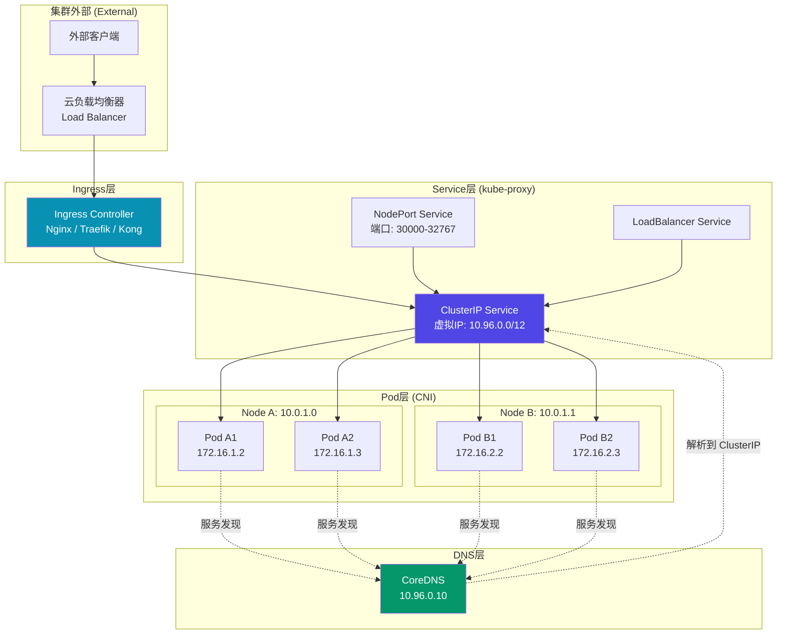
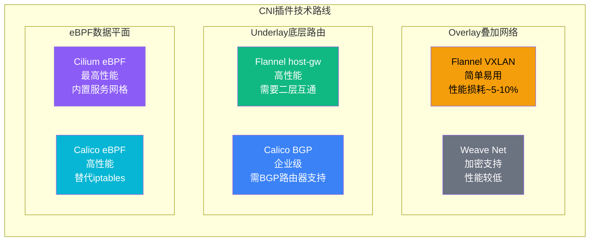
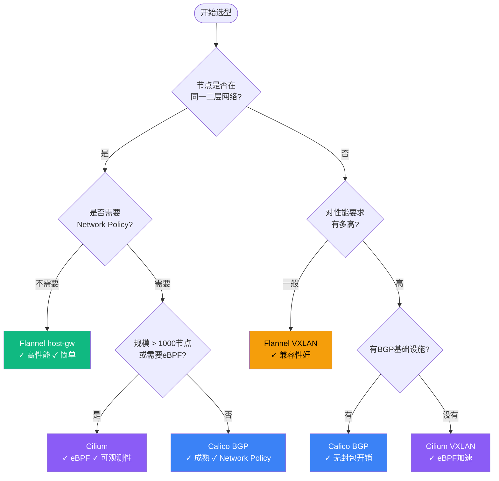
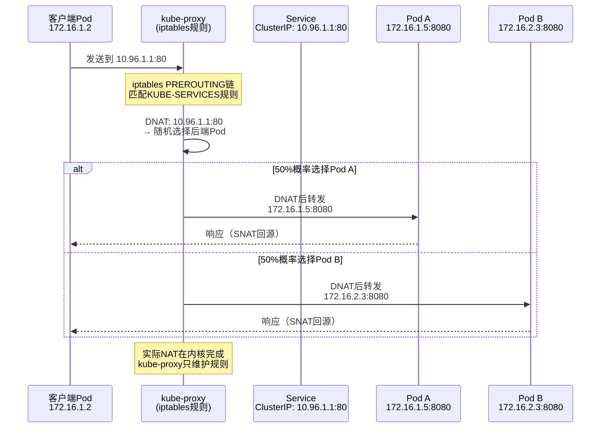

> 📋 **前置知识**：[容器网络基础](/guide/cloud/container-networking)、[VXLAN技术](/guide/advanced/vxlan)
> ⏱️ **阅读时间**：约22分钟

# Kubernetes网络模型：从Pod通信到Ingress的深度解析

Kubernetes（K8s）的网络层是整个平台最复杂的部分，也是生产故障最集中的区域。一个典型的K8s集群同时运行着Pod网络（Pod Network）、Service网络（Service Network）和节点网络（Node Network）三张叠加的逻辑网络，再加上CNI插件、kube-proxy、CoreDNS和Ingress控制器四个核心组件，任何一环出现问题都可能引发难以定位的故障。

本文从设计原则出发，逐层拆解K8s网络体系的工作机制，最终落脚到生产选型与Network Policy的安全实践。

## 第一层：K8s网络设计原则

Kubernetes的网络模型建立在四条不可妥协的规则上，任何CNI实现都必须满足这些约束：

| 规则 | 含义 |
|------|------|
| **Pod内部通信** | 同一Pod内的容器共享网络命名空间（Network Namespace），通过`localhost`互访 |
| **Pod间直连通信** | 任意两个Pod之间可以直接通信，无需NAT（Network Address Translation）中转 |
| **Pod与节点互通** | 节点（Node）与节点上运行的Pod之间无需NAT即可互达 |
| **IP地址一致性** | Pod看到自己的IP地址与外部访问它的IP地址完全相同 |

第四条规则尤为关键。传统Docker的端口映射（Port Mapping）会导致容器内外IP不一致，给服务发现和配置管理带来巨大麻烦。K8s通过要求CNI插件实现"扁平网络"（Flat Network）解决了这个问题。

```
K8s网络分层全景图
```



::: tip 为什么不用NAT？
NAT打破了IP的端到端语义，使得基于IP的访问控制、日志追踪和服务发现都变得复杂。K8s选择扁平网络模型，代价是需要CNI插件来管理更大的IP地址空间，换来的是网络语义的简洁性。
:::

---

## 第二层：Pod网络的实现机制

### pause容器与Network Namespace共享

每个Pod启动时，K8s首先创建一个名为`pause`（也叫`infra`）的基础容器，这个容器持有Pod的网络命名空间（Network Namespace）。Pod内的其他业务容器通过`--net=container:<pause_id>`加入同一个网络命名空间。

这个设计的关键点在于：即使业务容器崩溃重启，pause容器继续持有网络命名空间，Pod的IP地址不会改变，避免了因容器重启导致的网络中断。

```bash
# 查看pause容器
$ crictl ps | grep pause
d3f4a8bc9e2f  pause:3.9  k8s.io/pause  6h   CONTAINER   k8s_POD_nginx...

# 查看Pod的网络命名空间
$ crictl inspect d3f4a8bc9e2f | jq '.info.runtimeSpec.linux.namespaces'
[
  {"type": "network", "path": "/var/run/netns/cni-a3d5f29c-..."},
  ...
]
```

### veth pair与网桥连接

Pod与主机网络的连接通过**虚拟以太网对**（veth pair，Virtual Ethernet Pair）实现。veth pair是一对互连的虚拟网卡，发送到一端的数据包必然从另一端出来。

```
Pod网络命名空间
┌─────────────────────────┐
│  eth0 (172.16.1.2/24)   │
│    ↕ veth pair           │
└─────────────────────────┘
         │
         │ veth0 (主机侧)
         │
┌─────────────────────────┐
│   cni0 网桥 (bridge)    │  ← 连接节点上所有Pod
│   172.16.1.1/24         │
└─────────────────────────┘
         │
         │ 路由表 / 隧道
         ↓
    到其他节点的路由
```

CNI插件在Pod创建时执行以下操作：
1. 创建veth pair，一端放入Pod的网络命名空间（命名为`eth0`），另一端留在主机命名空间
2. 将主机侧的veth连接到节点网桥（通常是`cni0`或`flannel.1`）
3. 从IPAM（IP Address Management）组件分配IP，配置路由

```bash
# 查看节点上的veth pair
$ ip link show type veth
5: veth3a8b1c2@if4: <BROADCAST,MULTICAST,UP,LOWER_UP> mtu 1450 ...
7: veth9d2e4f1@if8: <BROADCAST,MULTICAST,UP,LOWER_UP> mtu 1450 ...

# 查看节点路由表（Flannel示例）
$ route -n
Destination     Gateway         Genmask         Iface
172.16.1.0      0.0.0.0         255.255.255.0   cni0      # 本节点Pod网段
172.16.2.0      10.0.1.1        255.255.255.0   flannel.1 # 其他节点Pod网段（VXLAN隧道）
```

---

## 第三层：CNI插件的选型与机制

CNI（Container Network Interface）是K8s的网络插件规范，定义了容器运行时调用网络插件的接口。选错CNI插件，意味着性能瓶颈、安全策略缺失或者运维复杂度上升。

### 主流CNI插件对比



#### Flannel：最简单的起点

Flannel是K8s最早流行的CNI插件，配置简单，适合学习环境和小规模集群：

- **VXLAN模式**：将Pod流量封装在UDP包中跨节点传输，兼容性好但有封包开销
- **host-gw模式**：在节点路由表中直接添加到Pod子网的路由，性能接近原生，但要求节点在同一二层网络

```bash
# Flannel VXLAN封包结构
外层 Ethernet + IP + UDP (8472端口) + VXLAN头
└── 内层 Ethernet + IP (Pod IP) + TCP/UDP
```

#### Calico：企业首选

Calico使用BGP（Border Gateway Protocol，边界网关协议）在节点间交换路由，不需要封包，性能优秀：

- **BGP模式**：每个节点作为BGP Speaker，直接向路由器宣告Pod网段路由
- **IPIP/VXLAN模式**：在不支持BGP的环境中作为fallback
- **eBPF数据平面**：替代kube-proxy，使用eBPF程序处理Service负载均衡，延迟更低

```yaml
# Calico BGP配置示例
apiVersion: projectcalico.org/v3
kind: BGPConfiguration
metadata:
  name: default
spec:
  logSeverityScreen: Info
  nodeToNodeMeshEnabled: true  # 节点间全mesh BGP会话
  asNumber: 64512              # 私有ASN
```

#### Cilium：eBPF的未来

Cilium完全基于eBPF（Extended Berkeley Packet Filter）构建，将网络处理逻辑直接注入Linux内核，绕过了传统的iptables链，实现了最低的网络延迟：

- 内核级别的负载均衡，完全取代kube-proxy
- 基于身份（Identity）而非IP的安全策略，对微服务友好
- 内置Hubble可观测性平台，提供网络流量可视化
- 支持多集群Cluster Mesh，跨集群服务发现

### CNI选型决策矩阵



::: warning 生产环境不要用Flannel
Flannel没有内置Network Policy支持，意味着集群内所有Pod默认可以互访。在多租户或安全合规要求较高的场景下，这是不可接受的。生产环境建议最低使用Calico，追求性能和可观测性则选Cilium。
:::

---

## 第四层：Service网络与kube-proxy

Pod的IP地址是临时的——Pod重启后IP会变化。Service（服务）提供了一个稳定的虚拟IP（ClusterIP）和DNS名称，作为一组Pod的统一入口。

### Service的四种类型

**1. ClusterIP（集群内访问）**

最基础的Service类型，分配一个集群内部虚拟IP，只能被集群内部访问：

```yaml
apiVersion: v1
kind: Service
metadata:
  name: my-service
spec:
  type: ClusterIP          # 默认类型
  selector:
    app: my-app
  ports:
    - port: 80             # Service端口
      targetPort: 8080     # Pod端口
```

**2. NodePort（节点端口暴露）**

在每个节点上开放一个静态端口（默认范围30000-32767），外部流量通过`<节点IP>:<NodePort>`访问：

```yaml
spec:
  type: NodePort
  ports:
    - port: 80
      targetPort: 8080
      nodePort: 30080      # 可指定或自动分配
```

**3. LoadBalancer（云负载均衡集成）**

调用云厂商API（AWS ELB、GCP Cloud Load Balancing、阿里云SLB等）创建外部负载均衡器，自动将流量转发到NodePort：

```yaml
spec:
  type: LoadBalancer
  # 云厂商特定注解
  annotations:
    service.beta.kubernetes.io/aws-load-balancer-type: "nlb"
    service.beta.kubernetes.io/aws-load-balancer-cross-zone-load-balancing-enabled: "true"
```

**4. ExternalName（外部服务别名）**

不代理流量，而是返回一个CNAME记录，用于将集群内DNS名称映射到外部域名：

```yaml
spec:
  type: ExternalName
  externalName: legacy-db.corp.example.com  # 外部服务域名
```

### kube-proxy的三种工作模式

kube-proxy在每个节点上运行，负责将发往ClusterIP的流量转发到实际的Pod。它有三种实现模式：



| 模式 | 实现方式 | 优点 | 缺点 |
|------|----------|------|------|
| **iptables**（默认） | 内核iptables规则链 | 稳定成熟 | 规则数O(n)，大集群性能差；随机负载均衡 |
| **IPVS**（推荐） | 内核IPVS哈希表 | O(1)查找，支持多种负载均衡算法 | 需要内核模块`ip_vs` |
| **eBPF**（Cilium） | eBPF程序内核挂载 | 最低延迟，绕过iptables | 需要Cilium，内核≥4.19 |

```bash
# 切换到IPVS模式
$ kubectl edit configmap kube-proxy -n kube-system
# 修改 mode: "ipvs"

# 查看IPVS规则
$ ipvsadm -Ln
IP Virtual Server version 1.2.1
Prot LocalAddress:Port Scheduler Flags
  -> RemoteAddress:Port           Forward Weight ActiveConn InActConn
TCP  10.96.1.1:80 rr              # rr = round-robin
  -> 172.16.1.5:8080              Masq    1      0          0
  -> 172.16.2.3:8080              Masq    1      0          0
```

::: tip IPVS vs iptables
当Service数量超过1000个时，iptables的性能会显著下降（每个数据包需要遍历数万条规则）。IPVS使用哈希表实现O(1)查找，在大规模集群中是必选项。阿里云、腾讯云的托管K8s服务默认已启用IPVS。
:::

---

## 第五层：DNS服务发现（CoreDNS）

CoreDNS是K8s默认的集群DNS服务，运行在kube-system命名空间，通常以`10.96.0.10`（或配置的DNS ClusterIP）提供服务。

### CoreDNS的域名解析规则

K8s为Service自动生成DNS记录，格式为：

```
<service-name>.<namespace>.svc.<cluster-domain>
```

默认`cluster-domain`是`cluster.local`，因此访问`my-service.default.svc.cluster.local`会解析到其ClusterIP。

Pod内部通过`/etc/resolv.conf`的`search`域简化访问：

```bash
# Pod内的 /etc/resolv.conf
nameserver 10.96.0.10
search default.svc.cluster.local svc.cluster.local cluster.local
options ndots:5
```

这意味着Pod内直接访问`my-service`，DNS会依次尝试：
1. `my-service.default.svc.cluster.local` → 匹配，返回ClusterIP

### CoreDNS架构

```yaml
# CoreDNS Corefile核心配置
.:53 {
    errors
    health {
       lameduck 5s
    }
    ready
    kubernetes cluster.local in-addr.arpa ip6.arpa {
       pods insecure
       fallthrough in-addr.arpa ip6.arpa
       ttl 30
    }
    prometheus :9153      # Prometheus指标暴露
    forward . /etc/resolv.conf {  # 上游DNS转发
       max_concurrent 1000
    }
    cache 30              # DNS缓存30秒
    loop
    reload
    loadbalance
}
```

::: warning DNS解析性能陷阱
`ndots:5`配置意味着短域名（不含5个点）会触发多次DNS查询（依次尝试search域），在高并发场景下会显著增加CoreDNS压力。生产建议：
1. 使用FQDN（末尾加`.`）访问外部域名
2. 调低`ndots`值（如设为2）
3. 为CoreDNS配置HPA（水平自动扩缩容）
:::

---

## 第六层：Ingress与Gateway API

Service的NodePort和LoadBalancer适合简单场景，但在微服务架构下，每个服务一个LoadBalancer会产生大量云资源费用。Ingress提供了七层（HTTP/HTTPS）路由能力，用一个入口点管理多个服务的路由。

### Ingress Controller的工作原理

Ingress本身只是K8s的一个API对象（资源定义），真正处理流量的是Ingress Controller。主流选择：

| Controller | 底层 | 适用场景 |
|------------|------|----------|
| **Nginx Ingress** | Nginx | 通用场景，社区最成熟 |
| **Traefik** | Go原生 | 微服务，自动服务发现 |
| **Kong** | Nginx + Lua | API网关场景，插件丰富 |
| **Istio Ingress Gateway** | Envoy | 已有Istio服务网格 |
| **AWS ALB Controller** | 云原生ALB | AWS环境，深度集成 |

### Ingress路由规则示例

```yaml
apiVersion: networking.k8s.io/v1
kind: Ingress
metadata:
  name: app-ingress
  annotations:
    nginx.ingress.kubernetes.io/rewrite-target: /
    nginx.ingress.kubernetes.io/ssl-redirect: "true"
spec:
  ingressClassName: nginx
  tls:
    - hosts:
        - api.example.com
      secretName: api-tls-secret    # TLS证书（cert-manager自动管理）
  rules:
    - host: api.example.com
      http:
        paths:
          - path: /users
            pathType: Prefix
            backend:
              service:
                name: user-service
                port:
                  number: 80
          - path: /orders
            pathType: Prefix
            backend:
              service:
                name: order-service
                port:
                  number: 80
```

### Gateway API：新一代标准

Ingress API存在表达能力不足（许多功能依赖注解）和角色权限模糊（开发者与基础设施管理员使用同一资源）等问题。Gateway API（`gateway.networking.k8s.io`）是其继任者，于2023年进入GA（Generally Available）状态：

```yaml
# Gateway API示例：分离基础设施管理与应用路由
# 基础设施团队管理 Gateway
apiVersion: gateway.networking.k8s.io/v1
kind: Gateway
metadata:
  name: prod-gateway
  namespace: infra
spec:
  gatewayClassName: nginx
  listeners:
    - name: https
      port: 443
      protocol: HTTPS
      tls:
        certificateRefs:
          - name: wildcard-cert

---
# 应用团队管理 HTTPRoute
apiVersion: gateway.networking.k8s.io/v1
kind: HTTPRoute
metadata:
  name: user-route
  namespace: app
spec:
  parentRefs:
    - name: prod-gateway
      namespace: infra
  hostnames:
    - "api.example.com"
  rules:
    - matches:
        - path:
            type: PathPrefix
            value: /users
      backendRefs:
        - name: user-service
          port: 80
          weight: 90         # 流量权重，支持金丝雀发布
        - name: user-service-canary
          port: 80
          weight: 10
```

::: tip Gateway API的核心优势
Gateway API将网关基础设施（GatewayClass、Gateway）和路由规则（HTTPRoute、TCPRoute）分离，基础设施团队管理Gateway，应用团队管理HTTPRoute，职责清晰，支持更细粒度的权限控制（RBAC）。
:::

---

## 第七层：Network Policy网络安全策略

默认情况下，K8s集群内所有Pod可以互相访问。Network Policy提供了基于Pod选择器（Pod Selector）和命名空间选择器（Namespace Selector）的访问控制，实现"白名单"（Default Deny + Allow List）安全模型。

::: danger Network Policy依赖CNI支持
并非所有CNI都支持Network Policy。Flannel不支持（需要搭配Calico的policy-only模式）。Calico、Cilium、Weave Net均原生支持。使用不支持Network Policy的CNI时，即使创建了NetworkPolicy资源，规则也不会生效，且不会有任何警告。
:::

### 默认拒绝所有流量

生产环境最佳实践：先为每个命名空间创建默认拒绝策略，再按需开放：

```yaml
# 拒绝所有入站流量
apiVersion: networking.k8s.io/v1
kind: NetworkPolicy
metadata:
  name: default-deny-ingress
  namespace: production
spec:
  podSelector: {}     # 选择该Namespace下所有Pod
  policyTypes:
    - Ingress

---
# 拒绝所有出站流量
apiVersion: networking.k8s.io/v1
kind: NetworkPolicy
metadata:
  name: default-deny-egress
  namespace: production
spec:
  podSelector: {}
  policyTypes:
    - Egress
```

### 精细化访问控制示例

```yaml
# 允许 frontend 访问 backend，backend 访问 database
apiVersion: networking.k8s.io/v1
kind: NetworkPolicy
metadata:
  name: backend-policy
  namespace: production
spec:
  podSelector:
    matchLabels:
      app: backend           # 策略应用到 backend Pod
  policyTypes:
    - Ingress
    - Egress
  ingress:
    - from:
        - podSelector:
            matchLabels:
              app: frontend  # 只允许 frontend Pod 访问
        - namespaceSelector:
            matchLabels:
              kubernetes.io/metadata.name: monitoring  # 允许监控命名空间访问
      ports:
        - protocol: TCP
          port: 8080
  egress:
    - to:
        - podSelector:
            matchLabels:
              app: database  # backend 只能访问 database
      ports:
        - protocol: TCP
          port: 5432
    - to:                    # 允许访问 CoreDNS（DNS解析必须开放）
        - namespaceSelector:
            matchLabels:
              kubernetes.io/metadata.name: kube-system
          podSelector:
            matchLabels:
              k8s-app: kube-dns
      ports:
        - protocol: UDP
          port: 53
```

::: warning 不要忘记DNS的Egress规则
开启Egress限制后，最常见的错误是忘记放开到CoreDNS的UDP 53端口。Pod会无法解析任何服务名，报错`dial tcp: lookup my-service on 10.96.0.10:53: read udp: i/o timeout`。
:::

---

## 第八层：多集群网络

单一K8s集群在超大规模或多云场景下会遇到限制。多集群（Multi-Cluster）网络解决方案主要有两种：

### Submariner：集群间L3互联

Submariner在集群间建立IPsec或Wireguard隧道，使不同集群的Pod和Service可以直接互访：

```
集群A (aws-us-east)          集群B (aws-eu-west)
Pod: 10.244.0.0/16    ←——隧道——→    Pod: 10.245.0.0/16
Service: 10.96.0.0/12               Service: 10.97.0.0/12

Submariner Gateway Pod ←—IPsec/WireGuard—→ Submariner Gateway Pod
```

### Cilium Cluster Mesh：服务网格级互联

Cilium Cluster Mesh允许跨集群的服务发现和负载均衡，通过共享etcd实现身份和策略同步：

```yaml
# 在集群A中注解Service，使其对Cluster Mesh可见
apiVersion: v1
kind: Service
metadata:
  name: shared-db
  annotations:
    service.cilium.io/global: "true"       # 全局可见
    service.cilium.io/shared: "true"       # 跨集群负载均衡
spec:
  selector:
    app: database
  ports:
    - port: 5432
```

---

## 生产最佳实践总结

经历过大规模K8s集群运维的工程师，通常会在以下几个点上吃亏，整理如下：

**网络组件选型**
- 50节点以下测试集群：Flannel VXLAN（够用、简单）
- 生产环境：Calico（BGP模式 + IPVS kube-proxy）或 Cilium
- 追求可观测性和零信任安全：Cilium + Hubble

**Service与Ingress**
- 不要给每个服务都创建LoadBalancer类型的Service，一个Ingress Controller服务所有HTTP/HTTPS流量
- 使用cert-manager自动管理TLS证书，对接Let's Encrypt或内部CA
- 新项目直接采用Gateway API而非Ingress，面向未来

**Network Policy**
- 每个命名空间必须有`default-deny`策略
- 开放最小权限，包括对CoreDNS的UDP 53 Egress
- 使用Cilium的`CiliumNetworkPolicy`扩展标准NetworkPolicy，获得基于FQDN（全限定域名）的Egress控制能力

**DNS调优**
- 高并发场景设置`ndots: 2`减少不必要的DNS查询
- CoreDNS配置副本数≥2，设置Pod反亲和性确保分布在不同节点
- 对访问外部域名的服务使用FQDN（如`redis.external.com.`末尾加点）

**故障排查工具箱**

```bash
# 测试Pod间连通性
kubectl run -it --rm debug --image=nicolaka/netshoot --restart=Never -- bash

# 抓取Pod网络流量
kubectl sniff <pod-name> -n <namespace> -f "tcp port 8080" -o capture.pcap

# 查看Service的Endpoint
kubectl get endpoints my-service -o yaml

# 检查iptables规则（ClusterIP）
iptables -t nat -L KUBE-SERVICES -n | grep <clusterip>

# 查看Cilium网络策略状态
cilium policy get
cilium monitor --type drop  # 实时查看被丢弃的数据包
```

K8s网络并不神秘，每一层都有清晰的职责边界。理解了pause容器、veth pair、iptables NAT和CoreDNS解析链路，95%的网络故障都能在30分钟内定位到具体组件。

---

## 延伸阅读

- [Kubernetes网络文档（官方）](https://kubernetes.io/docs/concepts/cluster-administration/networking/)
- [Cilium网络文档](https://docs.cilium.io/)
- [Calico网络文档](https://docs.tigera.io/calico/)
- [Gateway API规范](https://gateway-api.sigs.k8s.io/)
- [CNI规范](https://github.com/containernetworking/cni/blob/main/SPEC.md)
