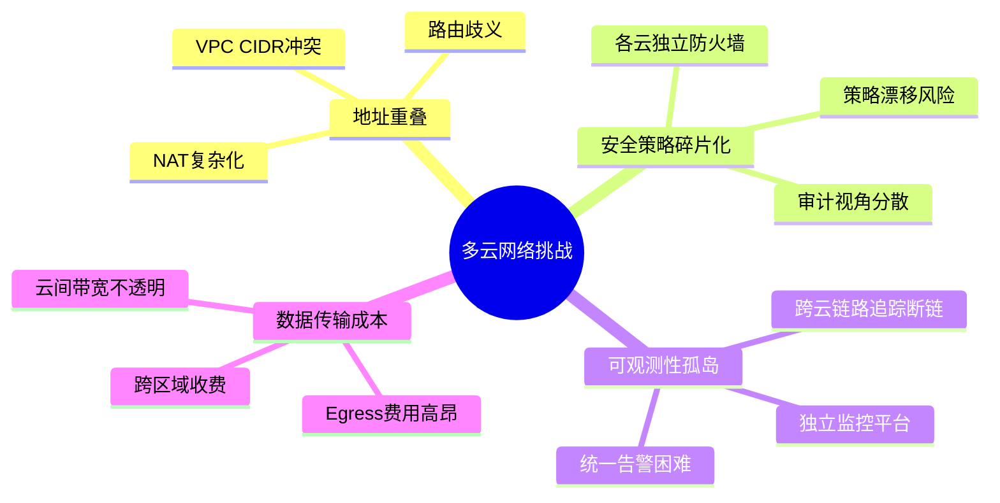
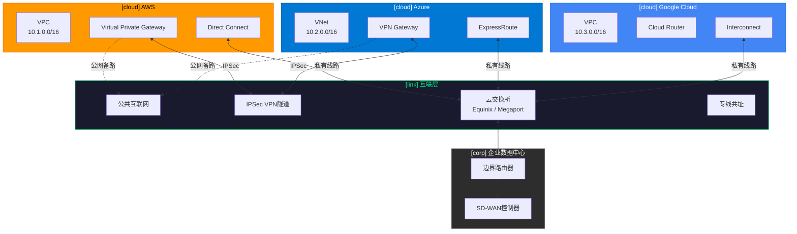
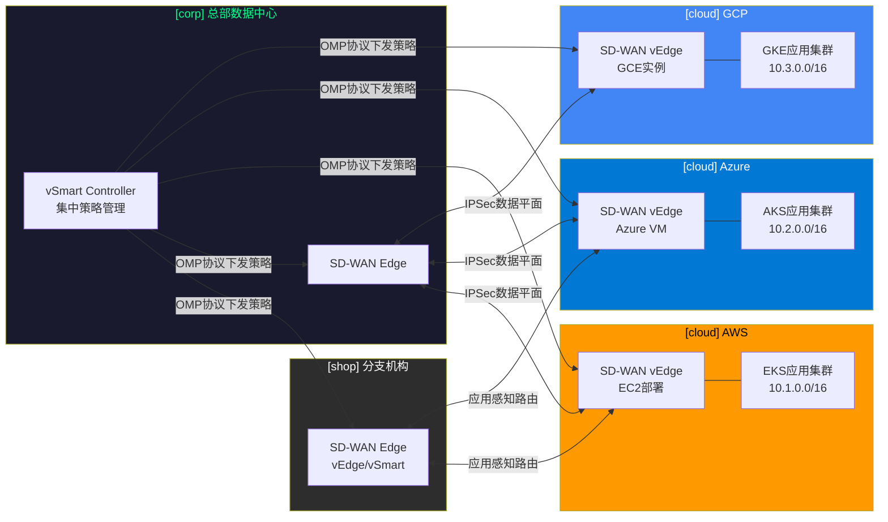
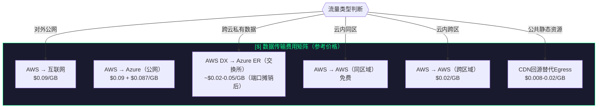
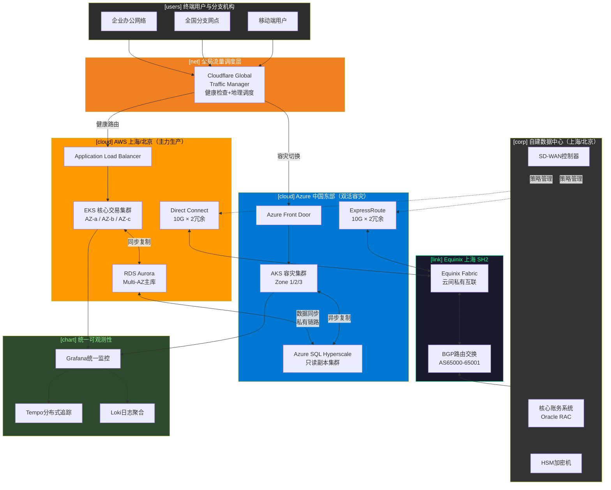

> <Icon name="clipboard-list" color="cyan" /> **前置知识**：[AWS云网络](/guide/cloud/aws-networking)、[Azure云网络](/guide/cloud/azure-networking)、[SD-WAN概念](/guide/sdwan/concepts)
> ⏱ **阅读时间**：约18分钟

# 多云网络架构：互联策略与流量治理

企业采用多云战略已成行业共识——根据 Flexera 2024 年报告，超过 87% 的大型企业同时使用两个以上公有云平台。然而，多云带来的不仅是弹性与选择自由，更带来了网络层面前所未有的复杂性：地址空间重叠、安全策略碎片化、可观测性孤岛以及高昂的数据传输成本，这些挑战正困扰着众多架构师和运维团队。

本文从企业实践视角出发，系统梳理多云网络互联的核心技术路径、统一策略管理平台，以及金融行业双活多云的完整设计方案。

---

## 一、多云驱动因素：为什么企业必须拥抱多云

### 1.1 避免供应商锁定（Vendor Lock-in）

单一云平台依赖带来的议价能力丧失和迁移风险，促使企业将核心工作负载分散部署。当 AWS 调整定价策略或某一服务出现区域性故障时，依赖单云的企业往往陷入被动。

### 1.2 最优服务选择（Best-of-Breed）

不同云厂商在特定领域拥有技术优势：
- **AWS**：EC2 生态、Lambda 函数计算、Kinesis 数据流
- **Azure**：Active Directory 集成、混合云 Arc、M365 生态
- **Google Cloud**：BigQuery 分析、Vertex AI、全球 Anycast 网络
- **阿里云**：国内合规、游戏加速、本地化支撑

企业将 AI 训练负载放在 GCP，将 SAP 系统迁移至 Azure，同时在 AWS 上运行核心 API——这一模式正在大量企业落地。

### 1.3 合规与数据主权（Data Sovereignty）

GDPR、中国数据安全法、金融行业等保要求数据不能跨境传输，多云架构允许企业在不同司法管辖区内隔离存储敏感数据，同时保持统一的应用层访问。

### 1.4 业务连续性与灾备（Business Continuity）

以不同云为两个隔离故障域，实现真正意义上的 RPO≈0、RTO<分钟级双活容灾，避免单一云平台大规模故障导致的全业务中断。

---

## 二、多云网络的核心挑战



### 2.1 IP 地址重叠（Address Overlap）

当 AWS VPC 使用 `10.1.0.0/16`，Azure VNet 也使用 `10.1.0.0/16` 时，两云之间的路由将产生严重歧义。传统方案依赖 NAT 层转换，但这会破坏端到端连接追踪，增加故障排查难度，并使 mTLS 证书验证复杂化。

::: warning 地址规划是多云架构的地基
企业在多云初期必须制定全局 IP 地址管理（IPAM）策略，为每个云、每个区域分配非重叠的 CIDR 块。推荐使用 AWS RAM、Azure IPAM 或 Infoblox 等专用工具统一管理。
:::

### 2.2 统一安全策略（Unified Security Policy）

AWS 使用安全组（Security Group）和网络 ACL，Azure 使用 NSG（Network Security Group），GCP 使用防火墙规则——三套完全不同的安全原语，导致"同一策略意图，三套独立实现"，策略漂移（Policy Drift）几乎不可避免。

### 2.3 可观测性孤岛（Observability Silos）

AWS CloudWatch、Azure Monitor、GCP Cloud Monitoring 各自为政，跨云的分布式追踪（Distributed Tracing）经常在云边界处断链，导致故障定位时间（MTTR）大幅增加。

### 2.4 数据传输成本（Data Transfer Cost）

云厂商的 Egress 收费模式使跨云数据传输成为隐性成本黑洞。以典型场景为例，AWS 到互联网的 Egress 费用约为 $0.09/GB，跨云传输若走公网将叠加双向 Egress 费用。

---

## 三、云间互联技术全景



### 3.1 公网互联（Internet-based）

**适用场景**：开发测试环境、非敏感公共 API  
**技术实现**：直接通过公网路由，各云工作负载使用公有 IP 互访  
**优势**：零成本、零配置复杂度  
**劣势**：安全性极低、延迟不可控、带宽无 SLA 保证

::: danger 生产环境禁止裸用公网互联
将生产数据库或内部 API 通过公网互连，即使配置了安全组，也面临路由劫持、中间人攻击等风险。生产环境必须使用加密隧道或私有线路。
:::

### 3.2 IPSec VPN 跨云互联

**AWS VGW + Azure VPN Gateway** 构建跨云加密隧道是中小企业最常见的选择：

```
AWS VGW (BGP ASN: 65000)
  └── IPSec IKEv2 隧道 (AES-256-GCM)
        └── Azure VPN Gateway (BGP ASN: 65001)
```

**关键配置要点**：
- 使用 BGP（Border Gateway Protocol）动态路由，避免静态路由维护负担
- 配置双隧道冗余（Active-Active 或 Active-Standby）
- 带宽上限受限于 VPN Gateway SKU（Azure VpnGw5 最高 10 Gbps）

**成本参考**：AWS VGW 约 $0.05/小时 + 数据传输费，Azure VPN Gateway 约 $0.19-1.25/小时（按 SKU）。

### 3.3 云交换所（Cloud Exchange）

Equinix Fabric 和 Megaport 提供"云中立"的私有互联服务，允许企业在同一物理设施内直连 AWS Direct Connect、Azure ExpressRoute 和 GCP Cloud Interconnect：

**Equinix Fabric 典型架构**：
```
AWS Direct Connect (1 Gbps)
    │
    ├── Equinix Fabric Cross-Connect
    │       │
    │   Azure ExpressRoute (1 Gbps)
    │
    └── GCP Partner Interconnect (1 Gbps)
```

**核心优势**：
- 私有链路，无公网暴露
- 低延迟（交换所内部延迟 <1ms）
- 统一计费管理
- 弹性带宽按需调整（Megaport MVE 支持软件定义带宽）

**适用规模**：月均跨云流量 >10 TB 的企业，交换所方案通常优于 VPN。

### 3.4 专线直连共址（Dedicated Interconnect at Colocation）

对于对延迟和安全性要求极高的金融、医疗行业，在同一 Colocation 数据中心同时部署 AWS Direct Connect 和 Azure ExpressRoute 专用端口，实现真正的"零互联网"路径：

- **延迟**：AWS 到 Azure 单向 <5ms（同区域 Equinix）
- **带宽**：最高 100 Gbps（AWS DX 和 Azure ER 均支持 100G 端口）
- **成本**：端口费用较高，适合 TB 级日均流量场景

### 3.5 云路由器（Cloud Router）

Google Cloud Router 基于 BGP 动态交换路由，支持与 AWS、Azure 及本地网络的路由学习，是 GCP 多云架构的核心组件。其 Global Routing 模式允许跨 GCP 区域的 VPC 通过单一 Cloud Router 统一管理路由表。

---

## 四、SD-WAN 驱动的多云互联

传统 MPLS + 专线方案难以适应云端工作负载的动态迁移需求，SD-WAN 以其软件定义、应用感知的特性成为多云网络的理想骨干。



### 4.1 应用感知路由（Application-Aware Routing）

SD-WAN 的核心价值在于能够根据应用类型动态选择最优路径：

| 应用类型 | 优先路径 | 备路 | 关键指标 |
|----------|----------|------|----------|
| 视频会议（Teams/Zoom） | 专线 ExpressRoute | MPLS | 抖动 <30ms |
| 数据库同步 | 交换所私有链路 | IPSec VPN | 带宽 >1 Gbps |
| AI 推理 API | GCP Interconnect | AWS DX | 延迟 <20ms |
| 备份归档 | 公网（低优先级） | — | 成本最优 |

**Cisco SD-WAN（原 Viptela）** 和 **VMware VeloCloud** 均支持在云端部署虚拟 Edge 节点，与本地 SD-WAN 覆盖网络无缝融合，实现企业网到多云的统一 Overlay。

### 4.2 统一管理平面

SD-WAN 控制器集中管理所有节点（无论是本地路由器还是云端虚拟 Edge），实现：

- **Zero-touch Provisioning（ZTP）**：新增云端 Edge 自动注册、自动获取策略
- **集中策略下发**：一次配置，自动推送到所有 Edge 节点
- **实时遥测（Telemetry）**：每条隧道的延迟、丢包、抖动实时可见
- **自动故障切换**：主路径指标劣化时，毫秒级切换到备路

::: tip SD-WAN 多云的关键设计原则
在每个云区域至少部署两个 vEdge 实例（跨可用区），配置 Active-Active 以避免单点故障。同时启用 BFD（双向转发检测）以实现秒级故障感知。
:::

---

## 五、统一网络策略管理平台

### 5.1 Aviatrix 多云网络平台

Aviatrix 是目前最成熟的多云网络控制平面，提供跨 AWS、Azure、GCP、阿里云的统一抽象层：

**核心功能**：
- **Transit Gateway 编排**：统一管理各云的 Transit VPC/VNet，消除复杂的对等连接（Peering）网状结构
- **FQDN 过滤（Egress 控制）**：在应用层控制出站访问，替代粗粒度的 IP 规则
- **多云 VPN 用户管理**：统一 User VPN 门户，用户无需关心后端是哪朵云
- **Copilot 可观测性**：跨云网络拓扑可视化、流量热力图、安全审计

**Aviatrix Transit 架构**：
```
                    Aviatrix Controller
                          │
              ┌───────────┼───────────┐
              ▼           ▼           ▼
        AWS Transit   Azure Transit  GCP Transit
        Gateway       Hub            Hub
              │           │           │
         Spoke VPCs   Spoke VNets  Spoke VPCs
```

### 5.2 Cisco Cloud ACI

对于已在数据中心部署 Cisco ACI 的企业，Cloud ACI 将 ACI 的意图驱动策略模型延伸到公有云：

- **EPG（End Point Group）**：在云端以标签（Tag）的形式映射为 AWS Security Group 或 Azure NSG 规则
- **合约（Contract）**：跨云服务间的访问策略统一定义，自动翻译为各云原生防火墙规则
- **一致性检查**：持续对比期望策略与实际配置，自动修复漂移

### 5.3 HashiCorp Consul 多云服务发现

在服务网格（Service Mesh）层面，Consul 通过在各云部署 Agent 实现跨云服务注册与健康检查：

```
# consul.hcl 多云联邦配置示例
datacenter = "aws-us-east-1"
primary_datacenter = "aws-us-east-1"

connect {
  enabled = true
}

federation {
  datacenter = "azure-eastus"
  mesh_gateways = [{
    address = "10.2.1.10"
    port    = 8443
  }]
}
```

Consul 的 Mesh Gateway 允许跨云服务通过 mTLS 加密隧道互访，同时维持各自 Service Registry 的独立性，避免单点故障。

---

## 六、数据传输成本优化

数据传输费用（Data Transfer / Egress）是多云架构中最容易被低估的成本项。



### 6.1 就近落地策略（Local Breakout）

将用户请求就近引导至最近的云 Region，减少数据跨区域传输：

- **DNS 地理解析**：使用 AWS Route 53 Geolocation、Azure Traffic Manager 或 Cloudflare 将用户流量导向最近 Region
- **Anycast IP**：GCP 全球 Anycast 网络天然支持就近路由，无需额外配置
- **CDN 前置**：将高频读取内容缓存在 CDN 边缘节点，从根本上消除 Origin Egress

### 6.2 CDN 与全球加速

- **AWS CloudFront + S3 Transfer Acceleration**：S3 对外 Egress 经 CloudFront 分发后，成本可降低 60-80%
- **Azure Front Door + CDN**：内置 WAF，适合全球 SaaS 应用
- **Cloudflare R2**：零 Egress 费用对象存储，适合替换频繁读取的 S3/GCS Bucket

### 6.3 数据传输成本控制 Checklist

::: tip 成本控制关键行动项
1. 使用 AWS Cost Explorer、Azure Cost Management 设置 Egress 费用告警阈值
2. 对跨云数据流量启用压缩（gzip/zstd），降低传输量
3. 评估 Committed Use Discount（CUD）或 Savings Plan 对网络服务的适用性
4. 将只读副本放置在读请求来源最近的云区域
5. 定期审计跨云数据流向，识别异常的大流量路径
:::

---

## 七、实战架构：金融行业双活多云设计



### 7.1 架构设计要点

**双活策略（Active-Active）**：
- AWS 承载 60% 生产流量，Azure 承载 40%；两侧均具备全量处理能力
- GTM 健康检查每 10 秒探测，故障时 30 秒内完成全量切流
- 数据库层采用同步复制（AWS Aurora → Azure SQL），RPO = 0

**网络层设计**：
- Equinix SH2 交换所作为云间互联枢纽，避免跨公网传输任何金融数据
- 自建数据中心通过 Direct Connect + ExpressRoute 双向专线连接
- SD-WAN 覆盖全国 300+ 分支网点，统一策略管理，关键应用强制走专线

**安全合规**：
- 所有跨云数据加密（TLS 1.3 in-transit，AES-256 at-rest）
- HSM 集中管理密钥，密钥材料不出自建数据中心
- 满足中国金融行业等保 2.0 三级及 PCI-DSS 要求

### 7.2 故障场景演练

| 故障场景 | 自动响应 | RTO | RPO |
|----------|----------|-----|-----|
| AWS 单 AZ 故障 | EKS Pod 自动调度到其他 AZ | <30 秒 | 0 |
| AWS 单区域不可用 | GTM 切流至 Azure | <2 分钟 | 0 |
| Equinix 链路中断 | 备用 IPSec VPN 自动激活 | <60 秒 | 0 |
| 核心数据库故障 | Aurora Global 自动提升 | <1 分钟 | <5 秒 |

---

## 八、多云网络成熟度模型

随着企业多云实践深化，网络能力也应随之演进：

| 成熟度等级 | 特征 | 关键能力 |
|-----------|------|----------|
| **L1 基础互联** | 各云独立管理，VPN 点对点连接 | IPSec VPN、基本路由 |
| **L2 统一连接** | 集中 Transit Hub，统一地址管理 | 云交换所、IPAM |
| **L3 策略驱动** | 意图驱动安全策略，自动化合规 | Aviatrix/Cloud ACI |
| **L4 应用感知** | SD-WAN 应用路由，服务网格 | SD-WAN + Consul Service Mesh |
| **L5 自治网络** | AIOps 驱动，预测性流量编排 | 网络 AI、自愈闭环 |

::: tip 分阶段演进建议
不要试图一步到位实现 L5。大多数企业应优先解决 L1→L2（地址统一、连接私有化），再逐步引入策略自动化（L3），最后在业务驱动下引入 SD-WAN 和服务网格。每个阶段均需充分验证后再推进。
:::

---

## 总结

多云网络不是简单地将工作负载分布到多个云平台，而是需要在连接、安全、可观测性和成本四个维度建立统一的治理体系。核心决策路径如下：

1. **优先建立全局 IPAM**，杜绝地址重叠为后续埋下隐患
2. **选择适合规模的互联技术**：小型场景用 IPSec VPN，中大型场景投资交换所或专线
3. **以 SD-WAN 统一应用路由**，实现云间流量的智能调度
4. **引入 Aviatrix/Consul 等多云控制平面**，解决策略碎片化和可观测性孤岛
5. **用数据驱动成本优化**，定期审计 Egress 流向，善用 CDN 和就近落地策略

多云架构的复杂性与收益并存，清晰的网络层设计是整个多云战略成功落地的基石。

---

## 延伸阅读

- [SD-WAN 架构与设计](/guide/sdwan/architecture)
- [容器网络（Container Networking）](/guide/cloud/container-networking)
- [混合云网络设计](/guide/cloud/hybrid-networking)
- [BGP 高级路由协议](/guide/advanced/bgp)
- [网络安全架构](/guide/attacks/security-arch)
