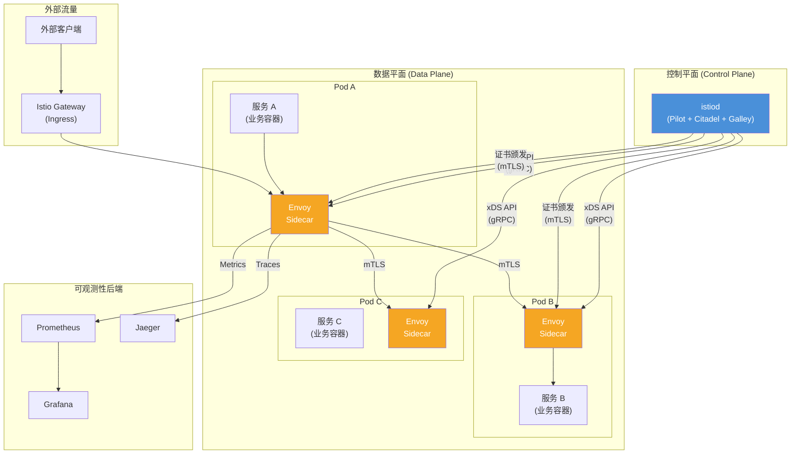
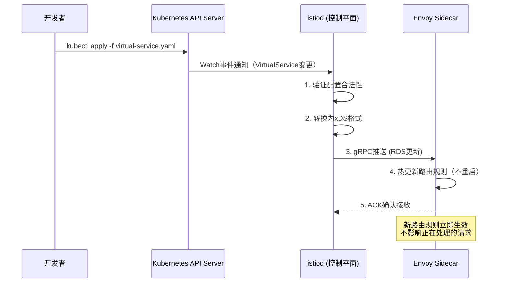
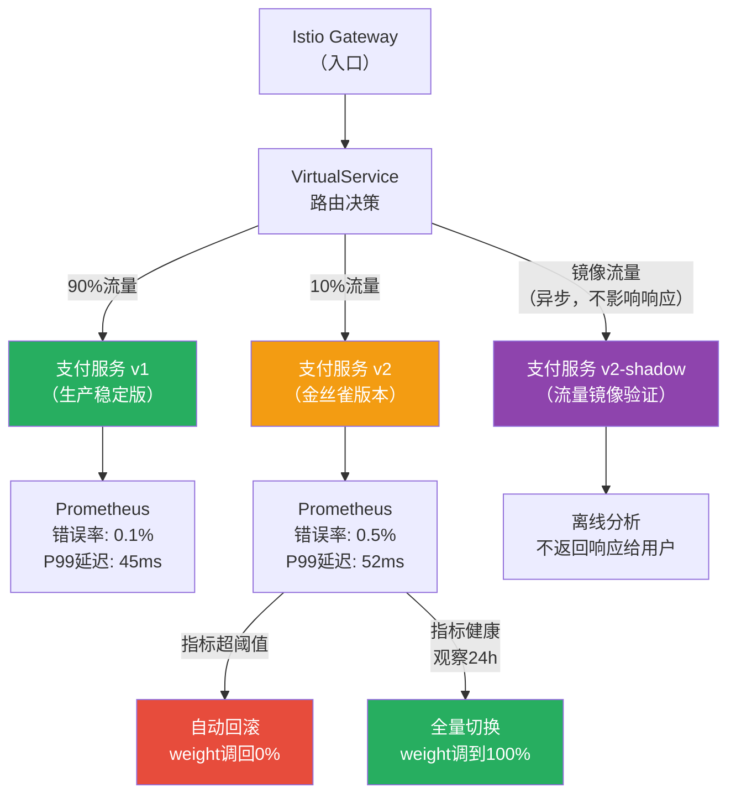
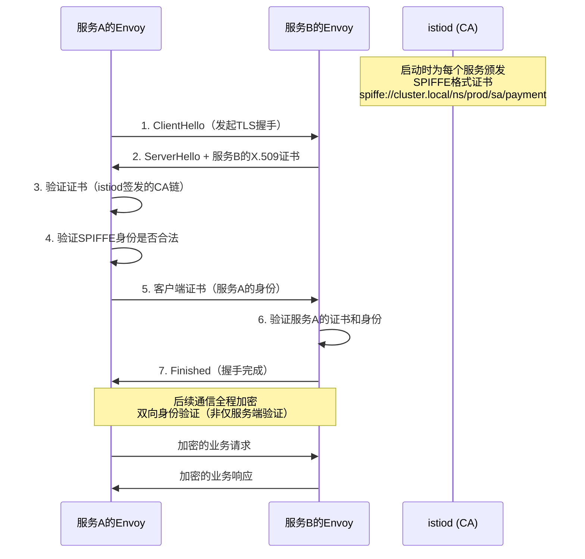

> 📋 **前置知识**：[Kubernetes网络](/guide/cloud/container-networking)、[零信任安全](/guide/security/zero-trust)
> ⏱️ **阅读时间**：约20分钟

# 服务网格：Istio架构与微服务通信治理

## 导言

一个电商平台拆分成300个微服务之后，团队发现一个让人头疼的问题：**每个服务都需要自己实现重试、超时、熔断、链路追踪**。Java团队用Hystrix，Go团队用自研库，Node.js团队直接不做——出了故障根本没法查。

服务网格（Service Mesh）解决的就是这个问题：把所有服务间通信的基础能力从应用代码中剥离出来，下沉到基础设施层，让开发者只关心业务逻辑。

---

## 第一层：为什么需要服务网格

### 微服务通信复杂性的真实成本

微服务架构把一个单体应用拆散之后，服务间调用数量呈指数级增长。

```
单体应用时代：
  用户请求 → 应用 → 数据库
  网络复杂度：O(1)

微服务时代（100个服务）：
  用户请求 → 网关 → 服务A → 服务B → 服务C → ...
  最坏情况下服务间连接数：100 × 99 / 2 = 4950条
  每条连接都需要：重试、超时、熔断、认证、加密、追踪
```

**如果每个服务都自己实现这些能力**：

| 能力 | 代价 |
|------|------|
| 服务发现 | 每个服务引入 Consul/etcd 客户端 |
| 负载均衡 | 每种语言实现一套 |
| 熔断器 | Hystrix（Java）、go-hystrix（Go）、polly（.NET）各不相同 |
| 可观测性 | 日志格式混乱，链路无法串联 |
| mTLS | 证书管理分散，轮转困难 |

这就是"**分布式系统税**"——业务代码要为网络的不可靠性买单。

::: tip 服务网格的核心价值
将分布式系统的通信基础设施从应用代码中**解耦**，形成统一的控制面，让运维团队可以在不修改任何一行业务代码的前提下，对全局流量施加策略。
:::

### Sidecar代理模式：优雅的解耦方案

服务网格的核心思想是：**在每个服务Pod旁注入一个代理进程（Sidecar），拦截所有进出流量**。

```
传统模式：
  [服务A] ──── TCP ────→ [服务B]
           应用层处理重试/超时

Sidecar模式：
  [服务A] → [Envoy Sidecar A] ──── mTLS ────→ [Envoy Sidecar B] → [服务B]
              ↑ 流量拦截                          ↑ 流量拦截
           iptables规则                       iptables规则
           自动注入                           自动注入
```

Sidecar对应用完全透明——服务A仍然连接`localhost:8080`，感知不到Envoy的存在。所有的重试、熔断、mTLS、指标采集都在Envoy中完成。

---

## 第二层：Istio架构详解

Istio是目前生产环境中最成熟的服务网格实现。它由**控制平面（Control Plane）**和**数据平面（Data Plane）**两部分构成。



### istiod：合并后的控制平面

Istio 1.5之前，控制平面拆分为三个独立组件（Pilot、Citadel、Galley）。1.5起合并为单一的**istiod**进程，降低了运维复杂度。

| 原组件 | 职责 | 现在在istiod中的功能 |
|--------|------|----------------------|
| **Pilot** | 服务发现、流量管理 | 将Kubernetes Service/Endpoint转换为xDS配置推送给Envoy |
| **Citadel** | 证书管理 | 为每个服务签发SPIFFE格式的X.509证书，支持自动轮转 |
| **Galley** | 配置验证 | 校验VirtualService、DestinationRule等CRD的合法性 |

### xDS API：Envoy的配置协议

istiod通过**xDS（x Discovery Service）**协议与Envoy通信，这是一套基于gRPC的动态配置下发接口：

```
xDS协议族：

LDS (Listener Discovery Service)
  └─ 配置Envoy监听哪些端口、用什么过滤器链

RDS (Route Discovery Service)
  └─ 配置HTTP路由规则（对应VirtualService）

CDS (Cluster Discovery Service)
  └─ 配置上游服务集群（对应DestinationRule）

EDS (Endpoint Discovery Service)
  └─ 配置集群中每个Pod的具体IP和端口
```

配置下发流程：



::: tip 热更新能力
Envoy支持**不重启进程**的配置热更新。当VirtualService规则变更时，已建立的连接不会中断，新规则仅对新建连接生效。这使金丝雀发布等操作对用户无感知。
:::

### Sidecar流量拦截原理

Envoy注入Pod后，通过**iptables规则**拦截所有流量：

```
Pod网络命名空间内：

入站流量:
  外部请求 → iptables PREROUTING → Envoy:15006(入站端口) → 业务容器

出站流量:
  业务容器 → iptables OUTPUT → Envoy:15001(出站端口) → 目标服务

关键iptables规则：
  -A PREROUTING -p tcp -j REDIRECT --to-ports 15006
  -A OUTPUT -p tcp -m owner ! --uid-owner 1337 -j REDIRECT --to-ports 15001
  # UID 1337 是Envoy进程自身，避免循环重定向
```

::: warning 性能开销说明
Sidecar引入额外的网络跳数，延迟增加约**0.2-1ms**（取决于规则复杂度）。对于P99延迟要求在1ms以内的超低延迟场景，需评估是否适用。Ambient Mesh（无Sidecar模式）可以解决这个问题，见本文末节。
:::

---

## 第三层：流量管理

Istio通过三个核心CRD（Custom Resource Definition）实现精细化流量控制。

### VirtualService：路由规则

VirtualService定义流量如何路由到目标服务，类似于应用层的路由表。

```yaml
# 金丝雀发布：将10%流量路由到v2版本
apiVersion: networking.istio.io/v1beta1
kind: VirtualService
metadata:
  name: payment-service
spec:
  hosts:
    - payment-service
  http:
    - match:
        - headers:
            x-canary-user:
              exact: "true"    # 内测用户强制走v2
      route:
        - destination:
            host: payment-service
            subset: v2
    - route:                   # 正常用户按权重分流
        - destination:
            host: payment-service
            subset: v1
          weight: 90
        - destination:
            host: payment-service
            subset: v2
          weight: 10
```

VirtualService支持的匹配条件：

```
匹配维度：
  ├─ HTTP Header（如：x-user-region: us-west）
  ├─ URI前缀/正则（如：/api/v2/*）
  ├─ 请求方法（GET/POST/PUT）
  ├─ 查询参数（如：?version=beta）
  └─ 源服务标签（只允许某些服务访问）
```

### DestinationRule：目标策略

DestinationRule定义到达目标服务后的行为：负载均衡算法、熔断配置、连接池。

```yaml
apiVersion: networking.istio.io/v1beta1
kind: DestinationRule
metadata:
  name: payment-service
spec:
  host: payment-service
  trafficPolicy:
    connectionPool:
      http:
        http1MaxPendingRequests: 100
        http2MaxRequests: 1000
    outlierDetection:         # 熔断配置
      consecutive5xxErrors: 5  # 连续5次5xx触发熔断
      interval: 30s            # 检测间隔
      baseEjectionTime: 30s    # 最短隔离时间
      maxEjectionPercent: 50   # 最多隔离50%的实例
  subsets:
    - name: v1
      labels:
        version: v1
      trafficPolicy:
        loadBalancer:
          simple: ROUND_ROBIN
    - name: v2
      labels:
        version: v2
      trafficPolicy:
        loadBalancer:
          simple: LEAST_CONN   # v2用最少连接算法
```

### Gateway：南北向流量入口

Gateway处理从集群外部进入的流量（南北向），与Ingress Controller的区别是它专注于L4-L6，配合VirtualService做L7路由。

```yaml
apiVersion: networking.istio.io/v1beta1
kind: Gateway
metadata:
  name: api-gateway
spec:
  selector:
    istio: ingressgateway
  servers:
    - port:
        number: 443
        name: https
        protocol: HTTPS
      tls:
        mode: SIMPLE
        credentialName: api-tls-cert   # 引用K8s Secret
      hosts:
        - "api.example.com"
```

### 金丝雀发布与流量镜像

以下是完整的金丝雀发布流程：



**流量镜像（Traffic Mirroring）**配置：

```yaml
http:
  - route:
      - destination:
          host: payment-service
          subset: v1
    mirror:
      host: payment-service
      subset: v2-shadow
    mirrorPercentage:
      value: 100.0    # 100%镜像到shadow版本（异步，不影响响应）
```

::: tip 流量镜像的企业价值
镜像流量让你可以用**真实生产流量**验证新版本的行为，而完全不影响用户体验。这是比压测更真实的验证手段，特别适合支付、订单等关键链路的版本验证。
:::

---

## 第四层：可观测性三大支柱

服务网格的一个核心价值是**开箱即用的可观测性**——无需修改任何业务代码。

### 指标（Metrics）：Prometheus + Grafana

每个Envoy Sidecar自动暴露标准化的指标，包含：

```
Istio标准指标（以HTTP为例）：

请求级指标：
  istio_requests_total{
    source_app="frontend",
    destination_app="payment-service",
    response_code="200",
    reporter="source"
  }

延迟直方图：
  istio_request_duration_milliseconds_bucket{
    destination_service="payment-service.prod.svc.cluster.local",
    le="50"    # 50ms以内的请求数
  }

TCP级指标（gRPC/TCP服务）：
  istio_tcp_sent_bytes_total
  istio_tcp_received_bytes_total
```

**黄金信号（Golden Signals）**监控配置要点：

| 信号 | PromQL示例 | 告警阈值建议 |
|------|-----------|-------------|
| 错误率 | `sum(rate(istio_requests_total{response_code=~"5.."}[5m])) / sum(rate(istio_requests_total[5m]))` | > 1% 告警 |
| 延迟P99 | `histogram_quantile(0.99, sum(rate(istio_request_duration_milliseconds_bucket[5m])) by (le, destination_app))` | > 500ms 告警 |
| 吞吐量 | `sum(rate(istio_requests_total[5m])) by (destination_app)` | 突降50% 告警 |
| 饱和度 | `sum(envoy_cluster_upstream_cx_active) by (cluster_name)` | 接近连接池上限告警 |

### 链路追踪（Distributed Tracing）：Jaeger/Zipkin

Istio自动在请求头中注入追踪上下文（B3/W3C TraceContext格式），**但业务代码需要传递这些Header**：

```python
# 业务代码需要传递的追踪Header（否则链路会断开）
TRACE_HEADERS = [
    'x-request-id',
    'x-b3-traceid',
    'x-b3-spanid',
    'x-b3-parentspanid',
    'x-b3-sampled',
    'x-b3-flags',
    'x-ot-span-context',
]

@app.route('/api/order')
def create_order():
    # 从入站请求中提取追踪Header，转发给下游服务
    headers = {k: request.headers.get(k) for k in TRACE_HEADERS if request.headers.get(k)}
    response = requests.post('http://payment-service/pay', headers=headers, json=order_data)
    return response.json()
```

::: warning 追踪Header传递是唯一的业务侵入
服务网格实现了"零代码修改"的目标，但链路追踪是唯一的例外——业务代码必须在上下游调用间传递追踪Header。可以通过框架中间件统一处理，避免遗漏。
:::

### 日志（Logging）

Envoy的访问日志格式可通过Telemetry API统一配置：

```yaml
apiVersion: telemetry.istio.io/v1alpha1
kind: Telemetry
metadata:
  name: mesh-default
  namespace: istio-system
spec:
  accessLogging:
    - providers:
        - name: envoy
      filter:
        expression: response.code >= 400   # 只记录错误请求
```

---

## 第五层：mTLS零信任安全

### 自动mTLS证书管理

传统的服务间通信通常是明文HTTP——任何在同一网络中的人都可以嗅探。Istio的**自动mTLS（mutual TLS）**在不修改代码的情况下加密所有服务间通信。

mTLS握手流程：



证书自动轮转默认每**24小时**进行一次，istiod通过xDS的SDS（Secret Discovery Service）主动推送新证书给Envoy，不需要重启。

### PeerAuthentication：认证策略

```yaml
# 对整个命名空间强制启用mTLS
apiVersion: security.istio.io/v1beta1
kind: PeerAuthentication
metadata:
  name: default
  namespace: production
spec:
  mtls:
    mode: STRICT    # STRICT: 拒绝明文; PERMISSIVE: 明文和mTLS都接受（迁移期）

---
# 针对特定服务放宽（如对外暴露的健康检查端口）
apiVersion: security.istio.io/v1beta1
kind: PeerAuthentication
metadata:
  name: payment-service-mtls
  namespace: production
spec:
  selector:
    matchLabels:
      app: payment-service
  mtls:
    mode: STRICT
  portLevelMtls:
    8086:           # 健康检查端口允许明文
      mode: DISABLE
```

### AuthorizationPolicy：细粒度访问控制

```yaml
# 只允许frontend服务访问payment-service的POST /pay接口
apiVersion: security.istio.io/v1beta1
kind: AuthorizationPolicy
metadata:
  name: payment-service-authz
  namespace: production
spec:
  selector:
    matchLabels:
      app: payment-service
  action: ALLOW
  rules:
    - from:
        - source:
            principals:
              - "cluster.local/ns/production/sa/frontend"  # 基于SPIFFE身份
      to:
        - operation:
            methods: ["POST"]
            paths: ["/pay", "/refund"]
```

::: danger 默认拒绝策略
生产环境建议先创建一条拒绝所有流量的默认策略，再逐步添加允许规则。Istio的默认行为是"如果没有任何AuthorizationPolicy，则允许所有"——这在安全上是危险的。

```yaml
# 默认拒绝所有，再按需放行
apiVersion: security.istio.io/v1beta1
kind: AuthorizationPolicy
metadata:
  name: deny-all
  namespace: production
spec: {}   # 空spec = 拒绝所有
```
:::

---

## 横向对比：Istio vs Linkerd vs Consul Connect

| 维度 | Istio | Linkerd | Consul Connect |
|------|-------|---------|----------------|
| **数据平面** | Envoy (C++) | linkerd2-proxy (Rust) | Envoy |
| **控制平面** | istiod (Go) | control plane (Go) | Consul (Go) |
| **性能开销** | ~3-5ms p99延迟增加 | ~1ms，更轻量 | ~2-3ms |
| **功能丰富度** | ★★★★★ | ★★★ | ★★★★ |
| **运维复杂度** | 较高 | 低 | 中（需要Consul） |
| **适用场景** | 大型企业，需要完整功能 | 追求简单性 | HashiCorp技术栈 |
| **多集群支持** | 原生支持 | 有限 | 原生支持 |
| **WASM扩展** | 支持（Envoy WASM） | 不支持 | 支持 |
| **Ambient Mesh** | 支持（1.22+） | 不适用 | 不支持 |
| **CNCF状态** | Graduated | Graduated | - |

::: tip 选型建议
- **初创团队**：Linkerd，学习曲线低，运维简单
- **大型企业**：Istio，功能完整，生态最成熟
- **HashiCorp用户**：Consul Connect，与已有基础设施集成
:::

---

## Ambient Mesh：无Sidecar的新模式

Istio 1.22引入GA的**Ambient Mesh**彻底改变了服务网格的形态，解决Sidecar模式的两个核心问题：**资源开销大**和**滚动重启注入Sidecar带来的运维风险**。

```
Sidecar模式（传统）：
  [Pod A: 业务容器 + Envoy sidecar]   每Pod: ~50MB内存，~0.5 CPU核
  [Pod B: 业务容器 + Envoy sidecar]
  [Pod C: 业务容器 + Envoy sidecar]
  总开销: N个Pod × 资源开销

Ambient Mesh（新模式）：
  [Pod A: 仅业务容器]   无sidecar
  [Pod B: 仅业务容器]
  [Pod C: 仅业务容器]
       ↓
  [ztunnel: 每Node一个DaemonSet]    处理L4 mTLS（资源极低）
       ↓
  [Waypoint Proxy: 按命名空间部署]  处理L7流量管理（按需启动）
```

**Ambient Mesh的分层设计**：

- **ztunnel（零信任隧道）**：在Node级别以DaemonSet运行，负责L4的mTLS加密和基于身份的访问控制，资源极低
- **Waypoint Proxy**：仅在需要L7能力（如HTTP路由、熔断）时按命名空间部署，不需要则跳过

这使得：
- 不需要L7特性的服务，**无额外资源开销**
- 升级Envoy不再需要滚动重启所有业务Pod
- Sidecar注入失败导致服务不可用的风险消失

::: tip Ambient Mesh迁移时机
2024年Istio 1.22将Ambient Mesh标记为GA。对于新项目，建议直接采用Ambient Mesh模式；现有Sidecar集群可渐进迁移，两种模式可在同一集群并存。
:::

---

## 企业落地要点总结

**第一阶段（观测先行）**：以PERMISSIVE模式部署，先收集指标和链路追踪数据，建立服务拓扑图，不强制加密和策略。

**第二阶段（流量治理）**：针对核心链路配置VirtualService熔断和重试策略，实施金丝雀发布流程。

**第三阶段（安全加固）**：切换STRICT mTLS模式，逐步为关键服务添加AuthorizationPolicy，建立最小权限访问模型。

**第四阶段（全面零信任）**：对所有命名空间启用默认拒绝策略，实现完整的服务间访问审计，将Istio纳入CI/CD流程做策略即代码（Policy as Code）。

```
核心配置文件组织建议（GitOps方式）：

service-mesh-policies/
├── traffic/
│   ├── virtual-services/
│   │   ├── payment-service.yaml
│   │   └── order-service.yaml
│   └── destination-rules/
│       ├── payment-service.yaml
│       └── order-service.yaml
├── security/
│   ├── peer-authentication/
│   │   └── production-mtls.yaml
│   └── authorization-policies/
│       ├── default-deny.yaml
│       ├── frontend-to-payment.yaml
│       └── payment-to-database.yaml
└── telemetry/
    └── mesh-telemetry.yaml
```

服务网格不是银弹——它引入了额外的运维复杂度，需要团队具备Kubernetes和Envoy的运维能力。但对于微服务规模超过20个服务的团队，**统一的通信基础设施**带来的收益远超学习成本。
