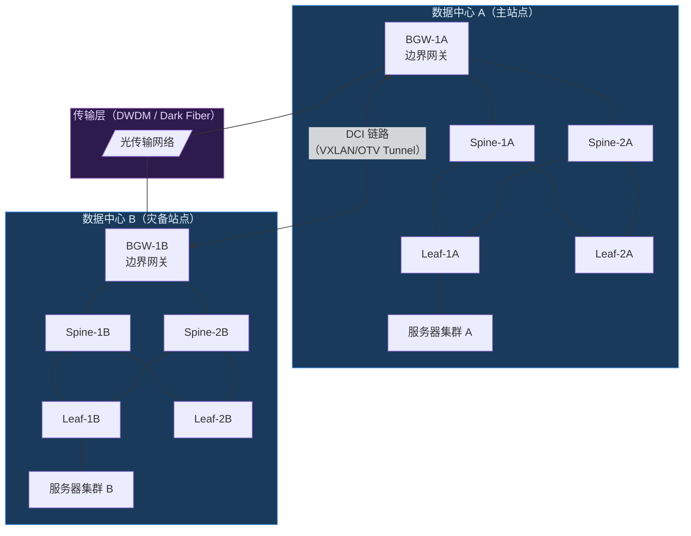
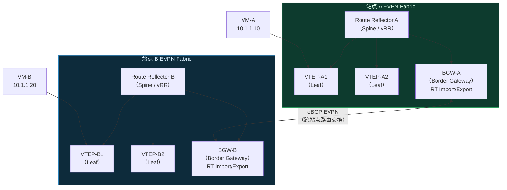
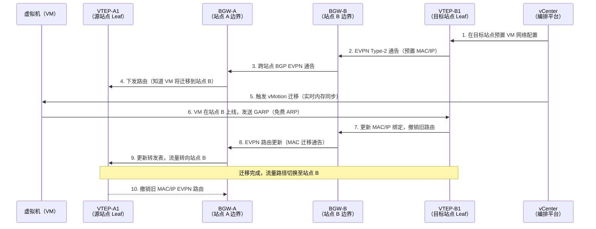
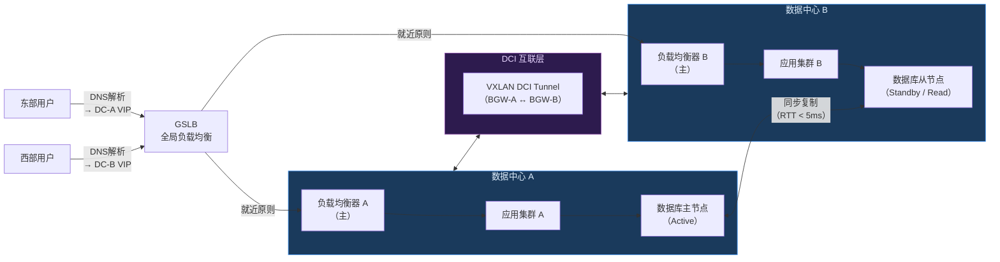

> <Icon name="clipboard-list" color="cyan" /> **前置知识**：[Spine-Leaf架构](/guide/datacenter/spine-leaf)、[VXLAN技术](/guide/advanced/vxlan)、[EVPN](/guide/routing/evpn)
> ⏱ **阅读时间**：约18分钟

# 数据中心互联（DCI）：多站点网络架构深度解析

## 第一层：业务驱动——为什么需要 DCI？

现代企业的 IT 基础设施已不再局限于单一机房。无论是合规要求的异地灾备、云计算时代的资源池化，还是收购兼并后的网络整合，都在推动企业构建**多数据中心互联（Data Center Interconnect，DCI）**架构。

### 三大核心业务场景

**1. 灾难恢复（Disaster Recovery，DR）**

金融、政务、医疗等行业的 RPO（恢复点目标）往往要求接近于零，RTO（恢复时间目标）控制在分钟级。这意味着主备数据中心之间必须维持实时数据同步，而同步的前提是二层网络的连通性——存储阵列的同步复制通常依赖于同一个广播域。

**2. 资源池化（Resource Pooling）**

超融合与容器化架构让计算、存储资源跨数据中心调度成为可能。Kubernetes 联邦集群、VMware vSphere vMotion 跨站点迁移，都要求底层网络提供低延迟、高带宽的二层或三层连通性。

**3. 业务连续性与负载均衡**

双活数据中心（Active-Active DC）架构允许两个站点同时承载生产流量，通过全局负载均衡（GSLB）将用户请求路由至最近的站点，既提升用户体验，又消除单点故障。

::: tip 企业决策要点
选择 DCI 方案前，务必明确：**需要二层延伸还是纯三层互联？** 二层延伸带来更高的灵活性（支持 VM 热迁移），但也引入广播风暴、STP 等传统二层风险。大多数现代 DCI 设计正在向**三层为主、二层按需**的方向演进。
:::

---

## 第二层：传输选型——DCI 物理与逻辑承载

DCI 的技术选型从"管道"开始。选择什么样的传输介质，直接决定了带宽上限、延迟基准和成本结构。

### 主流传输方案对比

| 传输方案 | 带宽 | 延迟 | 典型距离 | 适用场景 |
|----------|------|------|----------|----------|
| 暗光纤（Dark Fiber） | 100G~400G+ | 极低（纯光传播） | 同城/园区 | 高频交易、存储同步 |
| DWDM 波分复用 | 多波×100G | 低（含转发延迟） | 同城~骨干 | 运营商骨干、长距离 |
| Metro Ethernet | 1G~10G | 中（3~10ms） | 同城 | 中等规模企业 DCI |
| IP/MPLS 骨干 | 灵活 | 中~高 | 全国/全球 | 广域多站点互联 |
| SD-WAN DCI | 灵活 | 可变 | 全球 | 混合云、分支整合 |

**暗光纤（Dark Fiber）**是企业自建高性能 DCI 的首选：租用运营商的未点亮光纤，自行部署 DWDM 设备，可获得独占带宽和极低的传播延迟（同城 <1ms）。

**DWDM（Dense Wavelength Division Multiplexing，密集波分复用）**在单根光纤上通过不同波长叠加多路 100G/200G 信号，是运营商级 DCI 的标配。现代相干光传输系统（Coherent Optics）支持单波 400G，100km 无需中继。

::: warning DWDM 延迟注意事项
每个 DWDM 转发节点会引入 1~2ms 的固定延迟。对于数据库同步复制（如 Oracle Data Guard Sync 模式），超过 5ms RTT 可能触发性能降级。选型时务必实测端到端 RTT，而非仅看理论传播延迟。
:::

**SD-WAN DCI** 则代表了另一个方向：利用互联网宽带叠加 IPsec 加密隧道，通过软件智能路由实现成本可控的 WAN 互联。适合对延迟不敏感的业务，或作为专线的备用路径。

---

## 第三层：二层 DCI 技术——跨数据中心广播域延伸

当业务需要跨数据中心进行 VM 热迁移（vMotion）或存储同步时，就需要二层网络延伸技术。

### DCI 拓扑总览



### OTV（Overlay Transport Virtualization）

OTV 是 Cisco 提出的二层 DCI 技术标准（RFC 6325 参考实现），核心思想是将以太网帧封装在 IP 报文中进行传输，同时**在站点边界阻断 STP**，防止二层环路跨站点传播。

**OTV 的关键特性：**
- **MAC 路由化**：OTV 设备维护 MAC-to-Site 映射表，单播流量单播转发
- **多播优化**：利用组播或 Headend Replication 处理 BUM（Broadcast、Unknown Unicast、Multicast）流量
- **STP 隔离**：OTV Edge Device 终结 STP，不允许 STP BPDU 跨站点传播

::: warning OTV 的局限性
OTV 与传统 STP 架构的数据中心兼容性较好，但不支持分布式网关场景。在现代 Spine-Leaf + VXLAN 架构中，VXLAN DCI 已基本取代 OTV。
:::

### VXLAN DCI

在已部署 VXLAN Fabric 的数据中心中，DCI 最自然的扩展方式是将 VXLAN 隧道延伸到站点边界设备（BGW，Border Gateway），再通过 BGW 之间建立跨站点的 VXLAN 隧道。

**VXLAN DCI 的两种模式：**

1. **多站点（Multi-Site）模式**：BGW 充当路由反射器边界，控制面使用 EVPN，每个站点独立维护本地 VTEP（Virtual Tunnel Endpoint）。这是业界推荐的生产模式。

2. **扩展 Fabric 模式**：将单一 VXLAN Fabric 物理延伸到第二个数据中心。结构简单但扩展性差，不推荐用于生产环境。

### 跨 DC 广播域延伸的风险

::: danger 广播域延伸警告
二层 DCI 将广播域跨越物理站点边界延伸，这意味着：
- **广播风暴可以跨站点传播**，单个 ARP 洪泛可以消耗 DCI 链路带宽
- **MAC 表同步延迟**可能导致单播流量临时转为泛洪
- **脑裂（Split-Brain）场景**下，两个站点可能同时声明同一 IP/MAC，引发网络混乱

必须通过 ARP 抑制（ARP Suppression）、BUM 流量限速和 BGW 隔离策略来控制这些风险。
:::

---

## 第四层：EVPN 多站点架构——现代 DCI 的控制平面

EVPN（Ethernet VPN，RFC 7432）为 VXLAN DCI 提供了强大的控制平面，而 EVPN 多站点（Multi-Site）架构是目前企业级 DCI 最主流的技术选择。

### EVPN 多站点架构图



### BGW（Border Gateway）的核心角色

BGW 是 EVPN 多站点架构的关键节点，承担以下职责：

**1. 路由目标（Route Target，RT）转换**

每个站点内部使用本地 RT（如 `65001:1000`），BGW 在向对端站点通告路由时，将站点内 RT 替换为**全局 RT**（如 `65000:1000`），实现跨站点路由策略的精细控制。

```
站点 A 内部：RT = 65001:VNI10000
BGW-A 向 BGW-B 通告：RT = 65000:VNI10000（全局 RT）
站点 B BGW 导入：RT = 65000:VNI10000
站点 B 内部传播：RT = 65002:VNI10000
```

**2. 跨站点 BUM 流量抑制**

BGW 通过 EVPN Type-3 路由（Inclusive Multicast Ethernet Tag，IMET）统一管理 BUM（Broadcast、Unknown Unicast、Multicast）流量的复制树，并在站点边界进行**ARP/ND 代理应答**，大幅减少跨 DCI 链路的 BUM 流量。

**3. 数据平面封装转换**

BGW 可以终结站点内的 VXLAN 封装，并重新封装后发往对端 BGW，实现不同 VNI 命名空间的隔离。

### 跨 DC VM 迁移序列图



::: tip 迁移延迟优化
vMotion 跨 DC 迁移对网络延迟极为敏感。VMware 官方建议：
- **RTT < 150ms**（最大容忍值）
- **RTT < 10ms**（最佳用户体验）
- 带宽需求：单次迁移峰值可达 **10Gbps**

实际生产中建议将 vMotion 流量单独划入专用 VLAN，并通过 QoS 保障带宽。
:::

---

## 第五层：三层 DCI 与高可用设计——生产级架构

### 三层 DCI 路由设计

并非所有跨 DC 流量都需要二层延伸。对于不需要 VM 热迁移的业务，纯三层 DCI 更加稳定、可扩展。

**三层 DCI 的核心设计模式：**

**1. DCI 路由器（DCI Router）**

在站点边界部署专用 DCI 路由器，负责：
- 将站点内 OSPF/ISIS 路由引入（Redistribution）至 DCI eBGP 会话
- 执行路由过滤策略，防止路由泄漏
- 提供 BFD（双向转发检测）快速链路检测

**2. Anycast 服务 IP**

在双活场景中，同一服务（如 DNS、NTP、数据库 VIP）在两个站点发布相同的 IP 地址，通过 BGP 路由度量（MED、Local Preference）引导流量就近访问。

```
站点 A 发布：10.100.0.1/32（服务 VIP，LP=200）
站点 B 发布：10.100.0.1/32（服务 VIP，LP=100）
正常情况：流量优先访问站点 A
站点 A 故障：BGP 撤销路由，流量自动切至站点 B
```

**3. 路由引入策略**

```
策略设计原则：
  站点内部：OSPF Area 0（或 ISIS Level-2）
  站点边界：重分发进 BGP，添加 Community 标记来源
  DCI 链路：eBGP（不同 AS 或同一 AS 使用 allowas-in）
  过滤策略：仅允许明细路由通过，拒绝默认路由和聚合路由下发
```

### 双活数据中心流量模型



### Active-Active vs Active-Standby 对比

| 维度 | Active-Active（双活） | Active-Standby（主备） |
|------|----------------------|----------------------|
| 资源利用率 | 高（两站点均承载业务） | 低（备站点资源闲置） |
| 切换时间 | 毫秒级（流量自动重路由） | 分钟级（需手动或自动触发） |
| 数据一致性 | 复杂（需分布式锁/一致性协议） | 简单（主站点写，备站点同步） |
| 成本 | 高（两倍资源投入） | 较低 |
| 适用场景 | 金融交易、电商核心链路 | 政企灾备、非实时业务 |

### 脑裂（Split-Brain）防护

脑裂是双活 DCI 最危险的故障场景：当 DCI 链路中断时，两个站点都认为对方已故障，双方同时接管服务，导致数据不一致甚至数据损坏。

**防护机制：**

**1. 仲裁节点（Witness / Quorum）**

在第三个站点（或云端）部署仲裁节点。当 DCI 链路中断时，两个站点向仲裁节点"抢锁"，获得仲裁权的站点继续服务，另一站点主动降级。

```
正常状态：
  DC-A ←── DCI链路 ──→ DC-B
  DC-A ←── 仲裁链路 ──→ Quorum
  DC-B ←── 仲裁链路 ──→ Quorum

DCI链路断开：
  DC-A → 联系Quorum → 获得仲裁权 → 继续服务 [v]
  DC-B → 联系Quorum → 未获仲裁权 → 主动降级 ⏸
```

**2. 延迟感知（RTT-based Failover）**

持续监测 DCI 链路 RTT，设定阈值触发告警或自动故障切换：

```
RTT < 5ms：正常运行
5ms ≤ RTT < 20ms：告警，存储同步切换为异步模式
RTT ≥ 20ms：触发自动故障切换预案
RTT 超时（无响应）：执行脑裂防护协议
```

::: danger 脑裂场景的数据库风险
在双活数据库场景（如 Oracle RAC Stretch Cluster），脑裂可能导致两个站点同时对同一数据块执行写入，造成**不可恢复的数据损坏**。必须在数据库层面实现仲裁机制（如 Oracle Voting Disk），而不仅仅依赖网络层防护。
:::

---

## 实战案例：金融行业双活数据中心设计

### 背景

某头部券商需要构建同城双活数据中心，满足以下要求：
- **RPO = 0**（零数据丢失）
- **RTO < 60 秒**（一分钟内恢复）
- **两站点距离**：约 15km（同城园区）
- **业务类型**：交易撮合系统（极低延迟）、风控系统、客户门户

### 方案设计

**传输层**：租用运营商暗光纤，自建 DWDM 系统，双路由物理隔离，实测 RTT 约 **0.8ms**。

**网络层**：
- 站点内：Cisco ACI 或 Arista EVPN/VXLAN Spine-Leaf Fabric
- 站点间：EVPN Multi-Site，BGW 部署 vPC/MLAG 双活，避免 BGW 单点故障
- 三层互联：eBGP，AS 65001（DC-A）↔ AS 65002（DC-B）

**存储层**：
- 交易核心数据：同步复制（RTT 0.8ms 满足要求）
- 历史数据：异步复制，RPO 约 30 秒

**应用层**：
- 交易撮合：Active-Standby，主站点故障后 30 秒内切换
- 风控/门户：Active-Active，GSLB 按延迟就近路由

**仲裁层**：在第三机房（云端 VPC）部署仲裁服务，脑裂时自动触发站点降级。

### 关键配置片段

**BGW EVPN 多站点配置（Cisco NX-OS）：**

```
feature nv overlay
feature bgp
feature pim

evpn multisite border-gateway 100

interface nve1
  host-reachability protocol bgp
  multisite border-gateway interface loopback100
  source-interface loopback0
  member vni 10000
    multisite ingress-replication
    suppress-arp
    ingress-replication protocol bgp

router bgp 65001
  neighbor 192.168.200.1  ! BGW-B 互联地址
    remote-as 65002
    address-family l2vpn evpn
      send-community both
      rewrite-evpn-rt-asn        ! RT 自动转换
```

**Anycast 服务 VIP 路由策略（Arista EOS）：**

```
ip prefix-list SERVICE_VIP seq 10 permit 10.100.0.0/24

route-map DCI_EXPORT permit 10
   match ip address prefix-list SERVICE_VIP
   set local-preference 200        ! 主站点 LP 更高
   set community 65000:100         ! 标记为 DCI 服务路由

router bgp 65001
   neighbor 192.168.200.1 remote-as 65002
   address-family ipv4 unicast
      neighbor 192.168.200.1 route-map DCI_EXPORT out
```

---

## 总结与技术选型建议

DCI 技术栈的选择，本质上是**业务需求与工程复杂度**之间的权衡。

| 场景 | 推荐方案 |
|------|----------|
| 新建双活 DC，预算充足 | EVPN Multi-Site + VXLAN + 暗光纤/DWDM |
| 存量数据中心灾备改造 | OTV 或 VXLAN DCI（渐进式迁移） |
| 跨城市/跨省多站点 | IP/MPLS + L3VPN + SD-WAN 备份 |
| 公有云混合互联 | SD-WAN DCI + Cloud VPN / Direct Connect |
| 对延迟极度敏感（金融） | 暗光纤同城双活 + 同步复制 |

::: tip 架构演进建议
不要一步到位追求最复杂的 EVPN Multi-Site 架构。建议按以下路径演进：
1. **起点**：单 DC + 云端 DR（低成本验证）
2. **中期**：同城双 DC Active-Standby（满足合规）
3. **目标**：同城双活 + 异地灾备（三中心架构）

每个阶段都在前一阶段基础上增量演进，避免大规模重建的风险。
:::

**延伸阅读：**
- [VXLAN 技术原理](/guide/advanced/vxlan)
- [BGP 路由协议](/guide/routing/bgp)
- [OSPF 协议深度解析](/guide/routing/ospf)
- [SD-WAN 架构与案例](/guide/sdwan/architecture)
