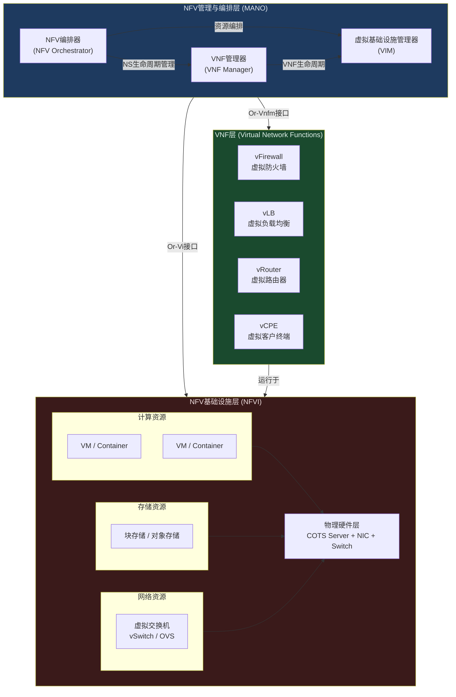
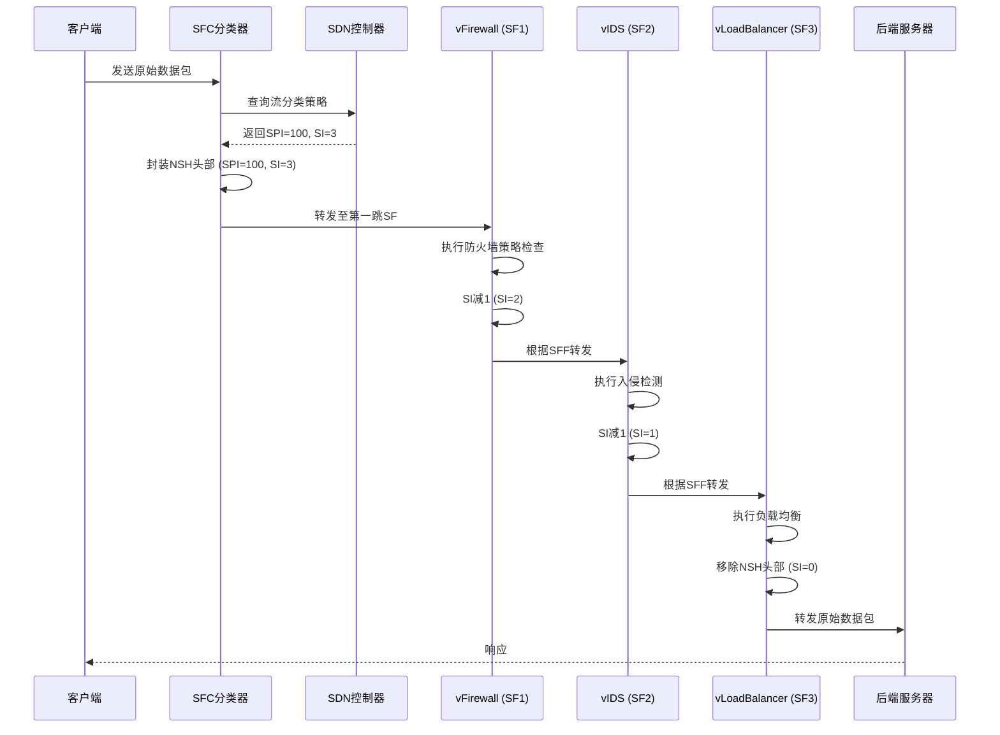
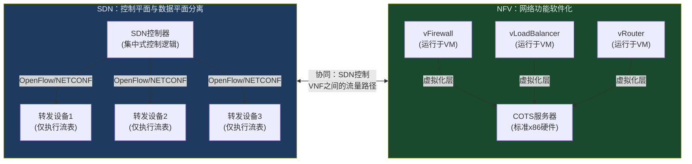
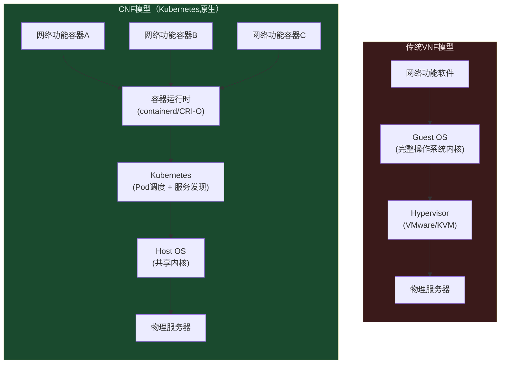
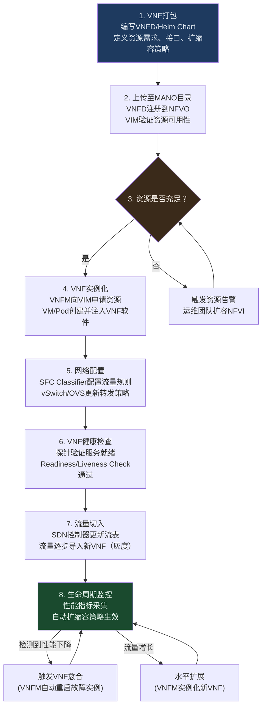

> 📋 **前置知识**：[SDN基础](/guide/sdn/fundamentals)、[Spine-Leaf架构](/guide/datacenter/spine-leaf)、[容器网络](/guide/cloud/container-networking)
> ⏱️ **阅读时间**：约18分钟

# 网络功能虚拟化（NFV）：从专用硬件到软件定义

2012年，AT&T、BT、德国电信等13家运营商联合发布了一份白皮书，提出了一个当时看来相当激进的想法：把路由器、防火墙、负载均衡器这些专用硬件盒子，全部用运行在标准服务器上的软件来替代。这就是网络功能虚拟化（Network Function Virtualization，NFV）的起点。

十年之后，这个想法已经成为电信行业的基础设施范式。5G核心网几乎全部基于NFV/云原生构建，全球头部运营商的NFV部署规模已达数万VNF实例。但NFV绝非万能药——性能损耗、运维复杂度、多厂商集成，至今仍是工程团队每天要面对的真实挑战。

本文从架构原理到工程实践，系统梳理NFV的核心知识体系。

---

## 一、为什么需要NFV：专用硬件的痛点

传统网络设备采购一台中高端防火墙或负载均衡器，从立项到上线通常需要6到18个月。这不是夸张，而是由硬件供应链决定的现实：

- **采购周期长**：定制ASIC芯片、专有操作系统、捆绑许可证，每一层都锁定在单一厂商
- **扩容困难**：流量增长时，唯一的选择是购买更多硬件；缩容时，闲置设备变成固定资产
- **TCO（Total Cost of Ownership，总拥有成本）高**：硬件折旧、机房空间、功耗、专有维保，叠加起来远超软件方案
- **创新速度慢**：厂商的固件更新周期以季度计，运营商无法快速响应业务需求

::: tip 典型数字
运营商调研数据显示，传统专用硬件的平均利用率不足35%。大量计算资源在业务低峰期白白空转，而在业务高峰期又面临扩容周期过长的困境。
:::

NFV的核心思路是：将网络功能从专用硬件（Proprietary Hardware）中解耦，用运行在商用现货（Commercial Off-The-Shelf，COTS）服务器上的软件来实现相同功能。底层基础设施标准化，上层功能软件化，两者通过标准接口解耦。

---

## 二、ETSI NFV参考架构

欧洲电信标准协会（ETSI）的NFV工作组定义了业界最广泛采用的参考架构，分为三大层次：



### 2.1 NFV基础设施层（NFVI）

NFVI是整个NFV栈的地基，负责提供虚拟化的计算、存储和网络资源。

**计算资源**：标准x86服务器，通过虚拟化层（Hypervisor或容器运行时）切分为多个虚拟机或容器实例，每个实例承载一个VNF。

**存储资源**：为VNF提供持久化存储，通常使用分布式存储（如Ceph）实现块存储和对象存储。

**网络资源**：这是NFVI中最复杂的部分。虚拟交换机（vSwitch，通常是Open vSwitch或DPDK-accelerated OVS）负责VNF之间、VNF与外部网络之间的流量转发。

::: warning 性能瓶颈警告
软件vSwitch是NFV性能损耗的主要来源之一。标准Linux内核网络栈的包转发能力约为1-5 Mpps，而专用硬件ASIC可达数百Mpps。这就是为什么高性能NFV场景必须引入DPDK（Data Plane Development Kit）或SR-IOV（Single Root I/O Virtualization）等加速技术。
:::

### 2.2 VNF层：软件化的网络功能

虚拟网络功能（Virtual Network Function，VNF）是运行在NFVI之上、实现具体网络功能的软件实体。每个VNF通常包含：

- **VNFD（VNF Descriptor）**：描述VNF的元数据，包括资源需求、接口定义、扩缩容策略
- **VNF实例**：VNFD实例化后的运行时对象，可能包含多个VNF组件（VNFC）
- **管理接口**：通过Ve-Vnfm接口与VNF Manager通信，接受生命周期操作指令

### 2.3 MANO：管理与编排

MANO（Management and Orchestration）是NFV的"大脑"，由三个关键组件构成：

| 组件 | 全称 | 职责 |
|------|------|------|
| NFVO | NFV Orchestrator | 编排网络服务（NS），管理跨VIM的资源，维护NFVO目录 |
| VNFM | VNF Manager | 管理单个VNF的生命周期（实例化、扩缩容、终止、愈合） |
| VIM | Virtualized Infrastructure Manager | 管理NFVI资源，通常由OpenStack或Kubernetes担任 |

::: tip 开源MANO实现
- **OSM（Open Source MANO）**：ETSI主导的开源项目，生态成熟
- **OpenBaton**：Fraunhofer研究院开发，符合ETSI规范
- **Tacker**：OpenStack生态的NFV编排组件
- **Nephio**：CNCF项目，面向Kubernetes原生的电信NFV编排
:::

---

## 三、典型VNF类型与应用场景

### 虚拟防火墙（vFirewall）

vFW是NFV最早大规模部署的场景之一。相比物理防火墙，vFW的优势在于：

- **弹性扩缩容**：根据流量自动调整实例数量，应对DDoS攻击峰值
- **多租户隔离**：在同一物理基础设施上为不同租户提供独立的防火墙策略
- **快速策略下发**：通过API/NETCONF即时更新规则，无需登录设备CLI

主流实现包括：Cisco CSRv、Fortinet FortiGate-VM、Checkpoint CloudGuard、开源的pfSense/VyOS。

### 虚拟负载均衡器（vLB）

vLB在云数据中心的应用已经相当普遍，AWS ELB、Azure Load Balancer本质上都是vLB的商业实现。在电信NFV场景中，vLB负责GTP-U（General Packet Radio Service Tunnelling Protocol User Plane）流量的会话分发，对性能要求极高。

### 虚拟路由器（vRouter）

vRouter是最能体现NFV价值的场景之一。传统运营商边界路由器（PE Router）价格动辄数百万元，而vRouter方案可以在标准服务器上运行思科、Juniper或开源（FRRouting、Bird）的路由软件，成本降低90%以上。

### 虚拟CPE（vCPE）

vCPE（Virtual Customer Premises Equipment）将传统放置在客户机房的网络设备（路由器、防火墙、WAN优化器）虚拟化，运行在运营商POP点或客户侧的通用硬件上。这使得运营商可以通过软件远程配置和管理客户网络，大幅降低驻场运维成本。

---

## 四、服务功能链（Service Function Chaining，SFC）

### 4.1 什么是SFC

网络流量在到达目的地之前，往往需要经过一系列网络功能的处理：先过防火墙检查，再经IDS检测，然后通过负载均衡器分发。这种"流量按序穿越多个网络功能"的机制，就是服务功能链（Service Function Chaining，SFC）。

SFC由三个关键元素构成：
- **SF（Service Function）**：提供具体服务的网络功能，如防火墙、NAT
- **SFF（Service Function Forwarder）**：负责将数据包转发到正确SF的转发节点
- **SFC Classifier**：在流量入口处识别数据流，并将其引导到对应的服务链

### 4.2 NSH（Network Service Header）

IETF RFC 8300定义了NSH协议，为SFC提供了标准的数据平面封装格式。NSH在原始数据包外层增加一个固定头部：

```
 0                   1                   2                   3
 0 1 2 3 4 5 6 7 8 9 0 1 2 3 4 5 6 7 8 9 0 1 2 3 4 5 6 7 8 9 0 1
+-+-+-+-+-+-+-+-+-+-+-+-+-+-+-+-+-+-+-+-+-+-+-+-+-+-+-+-+-+-+-+-+
|Ver|O|U|    TTL    |   Length  |U|U|U|U|MD Type|  Next Proto   |
+-+-+-+-+-+-+-+-+-+-+-+-+-+-+-+-+-+-+-+-+-+-+-+-+-+-+-+-+-+-+-+-+
|          Service Path Identifier (SPI)        | Service Index |
+-+-+-+-+-+-+-+-+-+-+-+-+-+-+-+-+-+-+-+-+-+-+-+-+-+-+-+-+-+-+-+-+
|                  Variable Length Context Headers              |
+-+-+-+-+-+-+-+-+-+-+-+-+-+-+-+-+-+-+-+-+-+-+-+-+-+-+-+-+-+-+-+-+
```

其中：
- **SPI（Service Path Identifier）**：标识服务链路径，24位，最多支持1600万条服务链
- **SI（Service Index）**：标识当前在服务链中的位置，每经过一个SF减1

### 4.3 SFC与SDN控制器协同



::: tip 动态服务链的价值
传统网络中，修改流量的处理路径需要重新配置物理设备和网络拓扑。基于NSH的SFC只需在SDN控制器上更新策略，流量立即走新路径，无需中断现有连接。这对于安全事件响应、灰度发布等场景价值极大。
:::

---

## 五、NFV与SDN的关系：互补而非等同

NFV和SDN经常被放在一起讨论，但两者解决的是不同层面的问题：



| 维度 | SDN | NFV |
|------|-----|-----|
| **核心目标** | 控制平面与数据平面分离，集中控制 | 网络功能从专用硬件解耦到软件 |
| **主要受益者** | 数据中心网络运营商 | 电信运营商、企业边界网络 |
| **标准组织** | ONF（Open Networking Foundation） | ETSI NFV ISG |
| **典型实现** | OpenFlow + OpenDaylight/ONOS | OpenStack + OSM/Tacker |
| **硬件依赖** | 仍需网络硬件，但可编程化 | 使用COTS服务器替代专用硬件 |
| **互补关系** | SDN可作为NFV的底层网络控制平面 | NFV可将SDN控制器本身虚拟化 |

两者结合使用时，SDN负责控制VNF之间的流量路径（即SFC的数据平面实现），NFV负责弹性地实例化和管理VNF本身。这种组合在5G核心网和云数据中心中已成为标配。

---

## 六、容器化NFV：Cloud-Native Network Functions（CNF）

### 6.1 从VNF到CNF

第一代NFV将网络功能打包成虚拟机镜像（VNF），获得了硬件解耦的优势，但也继承了虚拟机的笨重：启动时间分钟级、镜像体积GB级、资源开销大。

Cloud-Native Network Functions（CNF）用容器替代虚拟机，利用Kubernetes的编排能力来管理网络功能的生命周期：



| 对比维度 | VNF（VM-based） | CNF（Container-based） |
|----------|-----------------|------------------------|
| **启动时间** | 1-5分钟 | 秒级（通常<10秒） |
| **镜像大小** | 1-10 GB | 10-500 MB |
| **资源密度** | 低（每个VM需完整OS） | 高（共享Host内核） |
| **弹性扩缩容** | 慢（VM克隆） | 快（Pod水平扩缩） |
| **编排工具** | OpenStack Nova | Kubernetes |
| **成熟度** | 生产验证充分 | 快速成熟，部分场景仍有挑战 |
| **网络性能** | 相对稳定 | 需额外配置（DPDK/SR-IOV） |

### 6.2 Kubernetes作为VIM

将Kubernetes用作NFV的VIM（Virtualized Infrastructure Manager）是CNF的核心选择。ETSI已发布相关规范（SOL001/SOL002/SOL003的CNF扩展），定义了如何将Kubernetes原语（Pod、Deployment、Service）映射到NFV概念模型。

主要工具链：
- **Helm Chart**：CNF的打包格式，对应VNF的VNFD
- **Operator Pattern**：将VNF特定的运维逻辑编码为Kubernetes Operator，实现自愈和自动扩缩容
- **Nephio**（CNCF）：专为电信NFV场景设计的Kubernetes原生编排框架

### 6.3 高性能网络：DPDK与SR-IOV

容器化带来了内核网络栈的性能瓶颈。电信级CNF（如5G UPF）通常需要处理数十Gbps的用户面流量，必须绕过内核：

**DPDK（Data Plane Development Kit）**：将网卡驱动移至用户空间，使应用程序直接操作网卡，消除内核中断和内存拷贝开销。单核可达数十Mpps。在Kubernetes中通过`intel/userspace-cni`插件支持。

**SR-IOV（Single Root I/O Virtualization）**：在物理网卡层面创建多个虚拟功能（VF），每个VF直接分配给一个Pod，实现接近裸金属的网络性能。在Kubernetes中通过`k8s-device-plugin`和`sriov-cni`插件实现。

::: warning 性能与可移植性的权衡
DPDK和SR-IOV显著提升性能，但也带来了可移植性问题：Pod与特定物理网卡绑定，限制了Kubernetes的灵活调度能力。在设计CNF部署方案时，需要在性能要求和基础设施灵活性之间做出明确权衡。
:::

---

## 七、运营商实践：5G核心网VNF/CNF化

5G核心网（5GC）是NFV/CNF规模化落地的最大战场。3GPP SA2工作组在设计5GC架构时，从一开始就以服务化架构（Service-Based Architecture，SBA）为基础，天然适合NFV/CNF部署。

主要5GC网络功能的虚拟化路径：

| 5GC网络功能 | 全称 | 主要部署形态 |
|------------|------|------------|
| AMF | Access and Mobility Management Function | CNF（Kubernetes Pod） |
| SMF | Session Management Function | CNF |
| UPF | User Plane Function | CNF + DPDK/SR-IOV加速 |
| PCF | Policy Control Function | CNF |
| UDM/UDR | Unified Data Management/Repository | CNF + 分布式数据库 |
| NRF | NF Repository Function | CNF（服务注册中心） |

::: tip 运营商案例
- **中国移动**：基于OpenStack+OSM构建NFV平台，在全国数十个城市部署虚拟EPC（4G核心网），现阶段向5GC CNF演进
- **Verizon**：与AWS合作，将5GC部分功能部署在AWS Wavelength边缘计算节点，实现超低时延
- **Deutsche Telekom**：主导开源Magma和Nephio项目，推动电信级Kubernetes编排标准化
:::

---

## 八、NFV部署工作流

从VNF的描述文件到运行实例，标准的NFV部署流程如下：



---

## 九、挑战与工程权衡

### 9.1 性能损耗

NFV的性能损耗来自多个层次：虚拟化开销（Hypervisor或容器运行时）、vSwitch转发开销、内存拷贝（VM与Host之间）。在不使用DPDK/SR-IOV的情况下，NFV的转发性能通常只有专用ASIC的10%-30%。

对于延迟敏感型应用（如5G用户面、金融交易），这个差距是不可接受的，必须引入硬件加速。

### 9.2 运维复杂度

NFV将网络运维从"管理物理设备"变成了"管理分布式软件系统"。这对运维团队提出了更高要求：需要同时掌握网络协议知识和云原生技术栈（Kubernetes、Prometheus、Helm），传统网络工程师的技能需要大幅更新。

::: danger 陷阱：过早CNF化
部分团队在VNF运维尚不成熟的情况下，急于向CNF迁移，导致两套系统都不稳定。建议先在VNF模型上积累生产经验，再有序迁移到CNF。Kubernetes带来的复杂度（网络策略、存储、安全）不可低估。
:::

### 9.3 多厂商集成

NFV的理想场景是"开放生态"——各厂商的VNF可以运行在任何NFVI上，由任何MANO管理。现实中，标准接口（如ETSI SOL）的实现存在大量厂商私有扩展，多厂商集成仍然是最常见的工程痛点。

推荐做法：
1. 优先选择通过ETSI测试认证的VNF和MANO组件
2. 建立完善的互操作测试（IOT）流程
3. 考虑使用开源MANO降低厂商锁定风险

### 9.4 有状态VNF的高可用

防火墙、NAT、会话管理类VNF是有状态的——故障切换时，连接状态必须同步到备份实例，否则用户会话中断。实现有状态VNF的高可用（Active-Standby或Active-Active集群）比无状态服务复杂得多，需要专门的状态同步机制。

---

## 十、核心要点总结

| 知识点 | 关键结论 |
|--------|---------|
| **NFV动机** | 解决专用硬件的高成本、低灵活性、慢创新问题 |
| **ETSI框架** | 三层架构：NFVI（基础设施）、VNF（功能层）、MANO（管理编排） |
| **SFC** | NSH协议实现流量有序穿越多个VNF，与SDN控制器协同 |
| **NFV vs SDN** | 互补关系：SDN管流量路径，NFV管功能软件化 |
| **CNF趋势** | 容器化VNF带来更快启动和更高密度，需要DPDK/SR-IOV应对性能挑战 |
| **5G落地** | 5GC是CNF规模化部署的最大驱动力，SBA架构天然适配 |
| **核心权衡** | 性能损耗、运维复杂度、多厂商集成是落地的三大工程挑战 |

::: tip 延伸阅读
- ETSI GS NFV 002: Architectural Framework（官方架构规范）
- RFC 8300: Network Service Header（NSH协议定义）
- CNCF CNF Testbed: [github.com/cncf/cnf-testbed](https://github.com/cncf/cnf-testbed)
- Nephio项目: [nephio.org](https://nephio.org)
:::
