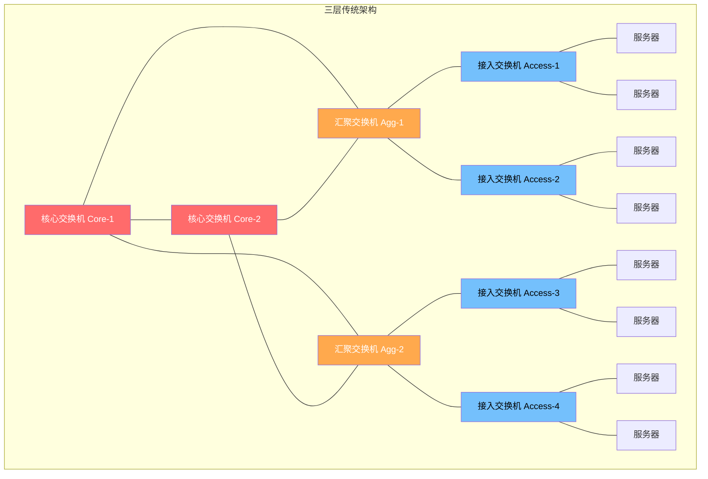
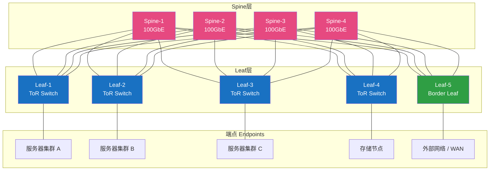
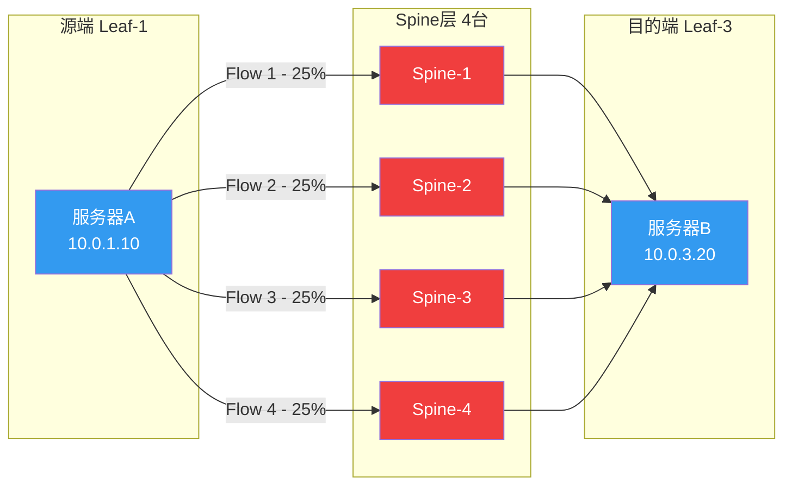
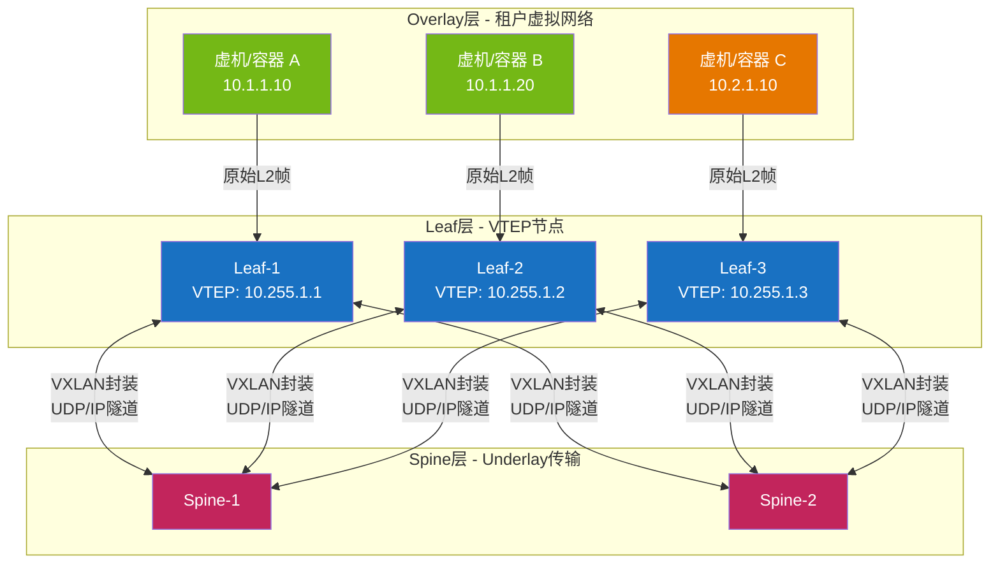
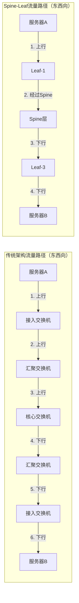
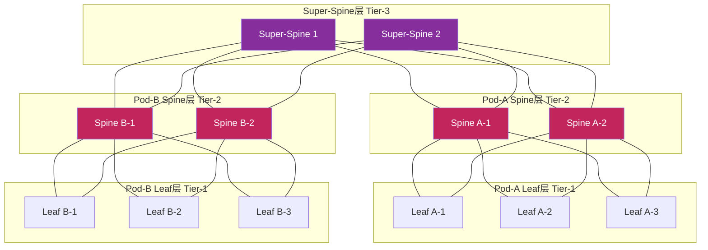

> 📋 **前置知识**：[以太网交换](/guide/basics/switching)、[VXLAN技术](/guide/advanced/vxlan)、[OSPF路由](/guide/routing/ospf)
> ⏱️ **阅读时间**：约20分钟

# Spine-Leaf架构：现代数据中心网络的基石

---

## 一、场景引入：当传统架构遭遇现代负载

### 那一天，数据中心网络工程师的噩梦

设想这样一个场景：某互联网公司的数据中心运行着数百台应用服务器，每逢大促活动，流量洪峰席卷而来。监控屏幕上，告警此起彼伏——核心聚合交换机（Aggregation Switch）的CPU使用率飙升到95%，某条上行链路拥塞丢包，另一条却几乎空闲。更糟糕的是，当有服务器需要从同一机架的另一台服务器获取数据时，流量竟然要绕一大圈，从接入层爬上聚合层，再爬上核心层，然后原路返回——只为完成一次服务器间（东西向，East-West）通信。

这正是传统**三层架构（Three-Tier Architecture）**——核心层（Core）、汇聚层（Aggregation）、接入层（Access）——在现代云原生工作负载下的集体失灵。

### 传统三层架构的结构图



### 三大核心痛点

**痛点一：生成树协议（Spanning Tree Protocol, STP）的性能代价**

传统以太网网络依赖STP防止广播环路，但代价是：为保留一棵逻辑树，大量物理链路被强制阻塞（Blocking State）。这意味着网络带宽的大量浪费——花了钱铺的链路，却有50%甚至75%处于闲置状态。

**痛点二：超额订购（Oversubscription）的带宽瓶颈**

在三层架构中，接入层到汇聚层通常存在严重的超额订购比，典型比例为20:1甚至更高。当东西向流量（服务器间通信）规模超过南北向流量（客户端-服务器通信），汇聚交换机便成为全局瓶颈，无论如何升级单台设备都难以根本解决。

**痛点三：东西向流量的低效路径**

微服务架构（Microservices）、分布式计算和存储网络（如Ceph、HDFS）的兴起，使得数据中心内部服务器间流量激增。传统三层架构的流量必须"上山下山"——即使是同一汇聚域的两台服务器通信，流量也要经历接入→汇聚→核心→汇聚→接入的漫长路径，延迟高、路径利用率低。

::: warning 时代的拐点
2010年前后，云计算、大数据、容器化技术的爆发式增长彻底改变了数据中心流量模型。以谷歌、Facebook为代表的超大规模（Hyperscale）数据中心率先探索新的网络架构，Spine-Leaf由此进入主流视野。
:::

---

## 二、概念建模：Spine-Leaf的两层世界

### 2.1 架构概览

Spine-Leaf架构由两层交换机组成，彻底消除了传统三层架构的中间汇聚层：

- **Spine层（脊柱层）**：高速核心交换机，只负责转发，不直接连接服务器
- **Leaf层（叶子层）**：接入交换机，连接所有端点（服务器、存储、防火墙、负载均衡器等）

**全连接（Full-Mesh）设计**是Spine-Leaf的核心规则：**每台Leaf交换机都与每台Spine交换机相连，且Leaf之间、Spine之间不直接互连**。

### 2.2 完整拓扑图



::: tip 特殊Leaf角色
- **ToR Leaf（Top of Rack）**：标准服务器接入叶子交换机
- **Border Leaf（边界叶子）**：连接外部WAN、Internet或其他数据中心
- **Service Leaf（服务叶子）**：连接防火墙、负载均衡器等共享网络服务设备
:::

### 2.3 核心设计指标

| 指标 | 传统三层架构 | Spine-Leaf架构 |
|------|------------|----------------|
| 服务器间最大跳数 | 可变（2-8跳） | 固定（**2跳**） |
| 链路利用效率 | 25-50%（STP阻塞） | **近100%（ECMP）** |
| 水平扩展方式 | 复杂（需改造核心） | 简单（**增加Leaf节点**） |
| 东西向带宽 | 受汇聚层瓶颈限制 | **全二分带宽（Bisectional Bandwidth）** |
| 故障域 | 大（汇聚/核心故障影响范围广） | 小（**单Leaf故障隔离**） |
| 管理复杂度 | 高（STP、VLAN trunk复杂） | 中（IP路由统一管理） |

---

## 三、原理拆解：让架构真正运转的机制

### 3.1 等价多路径路由（Equal-Cost Multipath，ECMP）

ECMP是Spine-Leaf架构充分利用所有链路的核心机制。在全连接拓扑中，从Leaf-1到Leaf-3的流量有多条等价路径，ECMP将流量在这些路径上均匀（或基于哈希）分发。



**ECMP哈希算法**通常基于五元组（5-tuple）：源IP、目的IP、源端口、目的端口、协议号。同一TCP连接的所有数据包被哈希到同一条路径，保证了**流（Flow）级别的有序性**，避免了包级别的乱序问题。

::: tip ECMP容量计算
若Spine层有N台交换机，每台Spine与每台Leaf之间的链路带宽为B，则：
- **上行总带宽 = N × B**
- **有效二分带宽（Bisectional Bandwidth）= N × B / 2**（考虑到最坏情况下所有流量穿越Spine层）

例：4台Spine，每条链路100GbE → 单Leaf最大上行带宽 = **400GbE**
:::

### 3.2 Underlay网络设计：为什么选eBGP而非OSPF？

Spine-Leaf的Underlay网络是纯IP路由网络，负责为Overlay（VXLAN）提供可达的物理基础。协议选型上，**eBGP（External BGP）**已成为业界共识，理由如下：

| 对比维度 | OSPF | eBGP（Underlay推荐）|
|---------|------|---------------------|
| 协议类型 | 链路状态（Link-State） | 路径矢量（Path-Vector） |
| 故障隔离 | 整网LSA泛洪，故障域大 | **AS边界隔离，爆炸半径小** |
| 扩展性 | 单区域路由表受限 | **支持数万路由条目** |
| 策略控制 | 有限 | **丰富的路由策略（Route Policy）** |
| 与BGP EVPN集成 | 需要额外重分发 | **天然集成，统一控制平面** |
| 收敛速度 | 快（配合BFD） | 快（配合BFD） |

**eBGP Underlay的关键设计决策**：

1. **每台设备独立AS号（Private ASN）**：Spine交换机使用相同的AS号（如AS65000），每台Leaf使用唯一AS号（AS65001、AS65002……），这样Leaf的路由不会在Spine间形成路由环路。

2. **Loopback接口作为路由器ID**：每台设备配置Loopback0接口，用于BGP邻居建立和VTEP地址（VXLAN Tunnel Endpoint）宣告。

3. **BFD（Bidirectional Forwarding Detection）快速检测**：BGP默认故障检测需要数十秒，配合BFD可将链路故障检测降至**毫秒级（通常50-300ms）**，大幅提升网络可用性。

```
# 典型Leaf交换机BGP配置示例（Cisco NX-OS风格）
router bgp 65001
  router-id 10.255.1.1          # Loopback地址
  address-family ipv4 unicast
    network 10.255.1.1/32       # 宣告Loopback（VTEP地址）

  neighbor 192.168.1.0          # 连接Spine-1的P2P接口
    remote-as 65000
    address-family ipv4 unicast
      send-community extended   # 为EVPN传递扩展Community

  neighbor 192.168.2.0          # 连接Spine-2的P2P接口
    remote-as 65000
    address-family ipv4 unicast
      send-community extended
```

### 3.3 IP编址规划

清晰的IP规划是Spine-Leaf架构可维护性的基础：

| 地址段 | 用途 | 示例 |
|--------|------|------|
| `10.255.0.0/16` | Loopback / VTEP地址 | Spine: `10.255.0.x/32`，Leaf: `10.255.1.x/32` |
| `192.168.x.0/31` | Spine-Leaf点对点互联（P2P） | 每对链路一个/31子网 |
| `172.16.0.0/12` | 服务器/租户Overlay网段 | 由VXLAN EVPN分配 |

::: tip /31子网节省IP地址
点对点链路使用`/31`子网（RFC 3021），只包含两个可用地址，比传统`/30`（4个地址，浪费2个）更节省。在大规模数据中心中，Spine-Leaf互联链路数量可达数百条，IP节省效果显著。
:::

---

## 四、实战关联：VXLAN Overlay与EVPN控制平面

### 4.1 Underlay与Overlay的分层模型

Spine-Leaf架构通常与VXLAN（Virtual Extensible LAN）Overlay结合使用，构成完整的数据中心网络方案：



**Spine交换机的角色**：在VXLAN Overlay中，Spine层保持"传输透明"——它只看到外层IP头（VTEP间的隧道），完全不关心VXLAN内部的租户流量，真正实现了**Underlay与Overlay的解耦**。

### 4.2 EVPN控制平面：告别泛洪学习

传统VXLAN依赖**泛洪与学习（Flood and Learn）**机制——当VTEP不知道目标MAC地址对应的远端VTEP时，它将流量广播给所有VTEP，效率低下且消耗带宽。

**EVPN（Ethernet VPN，RFC 7432）**引入了BGP控制平面，通过路由协议预先分发MAC/IP绑定信息（EVPN Route Type-2），使得VTEP在发送数据前就已知道目标VTEP地址，彻底消除了不必要的泛洪。

在Spine-Leaf中，EVPN的BGP会话通常有两种部署模式：

- **Spine作为Route Reflector（RR，路由反射器）**：Leaf只与Spine建立iBGP EVPN邻居，Spine负责反射MAC/IP路由，拓扑简洁
- **eBGP EVPN**：在eBGP Underlay基础上扩展EVPN地址族，Leaf间通过Spine传递EVPN路由，无需单独的RR

### 4.3 分布式网关（Anycast Gateway）

在Spine-Leaf + VXLAN EVPN架构中，网关功能下沉到每台Leaf交换机，形成**分布式网关**：

- 所有Leaf上配置**相同的虚拟IP和虚拟MAC**（Anycast Gateway IP/MAC）
- 虚机的默认网关永远是本地Leaf，**无需跨节点转发网关流量**
- 当虚机迁移时，新Leaf自动接管网关角色，感知延迟极低

这彻底解决了传统架构中集中式网关成为瓶颈的问题，使**东西向L3路由性能与东西向L2转发性能相当**。

### 4.4 流量模型对比：传统 vs Spine-Leaf



| 流量类型 | 传统架构跳数 | Spine-Leaf跳数 | 时延改善 |
|---------|------------|----------------|---------|
| 同机架东西向 | 6跳（接入→汇聚→核心→汇聚→接入） | **2跳** | ~60%↓ |
| 跨机架东西向 | 6跳 | **2跳** | ~60%↓ |
| 南北向（N/S）入口 | 4-6跳 | **2跳** | ~40%↓ |
| 跨数据中心（DCI） | 8+跳 | **4跳（含Border Leaf）** | ~50%↓ |

---

## 五、认知升级：超大规模扩展与厂商实现

### 5.1 规模扩展：当两层不够用时

标准Spine-Leaf支持的规模：
- Spine层：通常4-8台（受Leaf端口密度限制）
- Leaf层：受Spine交换机端口数限制，典型支持64-128台Leaf
- **总服务器规模**：若每台Leaf接48台服务器，128台Leaf = **约6000台服务器**

当规模突破这一上限，需要引入**Super-Spine层（超级脊柱层）**，构建三层Clos（Tier-3）架构：



### 5.2 Pod设计与数字化容量规划

**Pod（Point of Delivery）**是大规模数据中心的基本建设单元，通常包含一组Leaf+Spine构成的完整Spine-Leaf域。Pod设计使得数据中心可以**以Pod为单位进行批量部署（Cookie-cutter deployment）**，标准化建设流程，大幅降低运营复杂度。

**容量规划示例**（以Cisco Nexus 9000平台为例）：

```
Spine交换机：Nexus 9364C
  └── 64端口 × 100GbE QSFP28

Leaf交换机：Nexus 93180YC-FX
  └── 48端口 × 25GbE（服务器下行）
  └── 6端口 × 100GbE（Spine上行）

单Pod容量：
  Spine数量：4台
  Leaf数量：最大 min(64, 6×4) = 24台（受Leaf上行口数限制：6口上行÷4台Spine）
  实际Leaf：通常部署20-22台（保留余量）
  服务器容量：22 × 48 = 1,056台服务器/Pod
  
上行带宽：
  单Leaf → Spine总带宽：6 × 100GbE = 600GbE
  Oversubscription ratio：(48 × 25GbE) / 600GbE = 1,200 / 600 = 2:1
```

::: tip 超额订购比（Oversubscription Ratio）的设计哲学
Spine-Leaf并不追求零超额订购，而是**根据业务特性精确匹配**：
- **高性能计算（HPC）/ 存储网络**：目标1:1，所有流量都可能同时爆发
- **通用Web服务**：2:1~4:1，流量有自然的错峰
- **开发测试环境**：5:1~10:1，资源利用率低
:::

### 5.3 厂商实现对比

| 特性维度 | Cisco ACI | VMware NSX-T | Cumulus Linux |
|---------|-----------|--------------|---------------|
| **控制平面** | APIC集群（集中式SDN） | NSX Manager（集中式） | BGP + EVPN（分布式） |
| **Overlay协议** | VXLAN + OpFlex | VXLAN + Geneve | VXLAN + EVPN |
| **硬件依赖** | 强（需Cisco ACI专用交换机） | 弱（支持第三方VTEP） | **弱（白盒硬件支持）** |
| **学习曲线** | 高（ACI对象模型复杂） | 中（VMware体系熟悉即可） | **低（标准Linux/BGP）** |
| **多租户** | EPG + Contract模型 | Segment + Gateway | VRF + VXLAN VNI |
| **自动化** | APIC REST API / Ansible | NSX API / Terraform | **Ansible / Netbox天然集成** |
| **适用场景** | 大型企业，VMware重度用户 | VMware主导数据中心 | **云原生，DevOps团队** |
| **许可证成本** | 高 | 高 | **低（开源）** |

::: warning ACI的隐性成本
Cisco ACI虽然功能强大，但其闭源的APIC控制器、专有的OpFlex协议和ACI专用硬件，形成了深度厂商锁定（Vendor Lock-in）。在评估时，除硬件采购成本外，还需充分考虑培训成本、运维工具的重建成本以及未来迁移的难度。
:::

::: tip Cumulus Linux与白盒网络的崛起
以Cumulus Linux（现隶属NVIDIA）为代表的网络操作系统，将Linux的开放生态引入数据中心网络。工程师可以用熟悉的FRRouting（FRR）配置BGP，用Ansible进行批量配置推送，彻底打破了传统网络设备的封闭模式，特别适合具备强DevOps文化的互联网公司。
:::

### 5.4 Spine-Leaf的适用边界

Spine-Leaf并非万能，以下场景需要审慎评估：

**适合Spine-Leaf的场景**：
- 服务器数量超过200台的中大型数据中心
- 东西向流量占比超过南北向流量
- 需要支持多租户隔离（多云、托管服务）
- 追求自动化运营和DevOps文化

**可能不适合Spine-Leaf的场景**：
- 小型数据中心（服务器数量<50台），两层架构反而引入不必要复杂性
- 工控/工业网络，对延迟一致性要求极高但流量规模小
- 已有大量传统三层架构投资，迁移ROI不高

::: danger 迁移风险提示
从传统三层架构迁移到Spine-Leaf是一次重大的架构变革，涉及IP重规划、BGP协议部署、VXLAN Overlay迁移等多个复杂环节。在没有充分的迁移演练和双栈过渡方案的情况下，**切勿在生产环境直接实施**。建议先在测试环境完整验证，并制定详细的回滚预案。
:::

---

## 小结：Spine-Leaf的设计哲学

Spine-Leaf的成功并非源于某项单一技术突破，而是一套**系统性的工程设计哲学**：

1. **对等性（Symmetry）**：全连接拓扑消除了单点瓶颈，任何两点间路径等价
2. **可预测性（Predictability）**：固定2跳路径使延迟一致，容量规划精确
3. **可扩展性（Scalability）**：水平扩展替代垂直扩展，增加节点而非升级单机
4. **解耦（Decoupling）**：Underlay与Overlay分离，物理网络与虚拟网络各自演进

从谷歌的Jupiter网络到微软的Azure数据中心，从国内头部云厂商到大型金融机构的私有云，Spine-Leaf已成为现代数据中心网络的**事实标准（De facto standard）**。理解这一架构，是掌握云数据中心网络设计的必经之路。

---

*下一步学习推荐：*
- *[EVPN控制平面详解](/guide/advanced/vxlan)*——深入理解BGP EVPN的路由类型与工作机制
- *[数据中心BGP设计](/guide/routing/bgp)*——掌握eBGP Underlay的完整配置实践
- *[SDN控制器架构](/guide/sdn/controllers)*——了解ACI、OpenDaylight等SDN方案的实现原理
