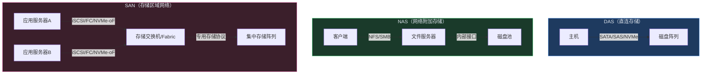
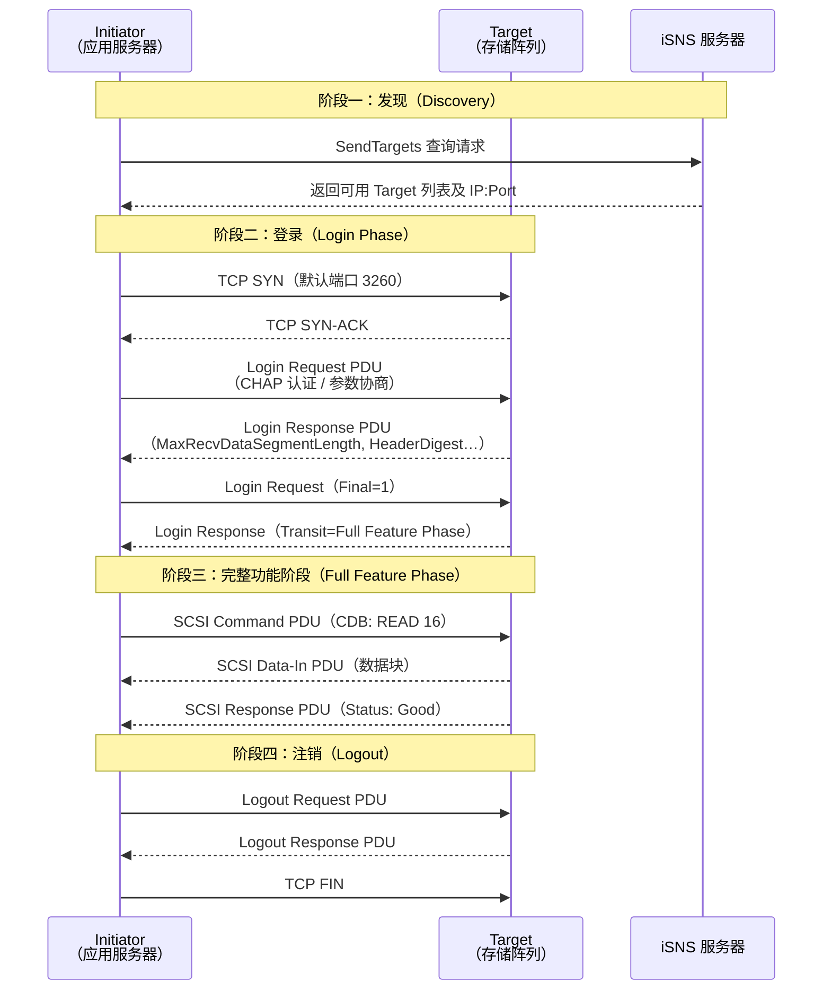
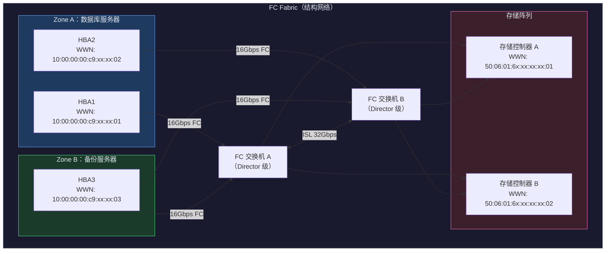
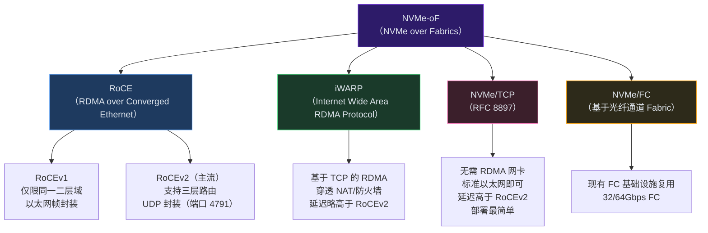
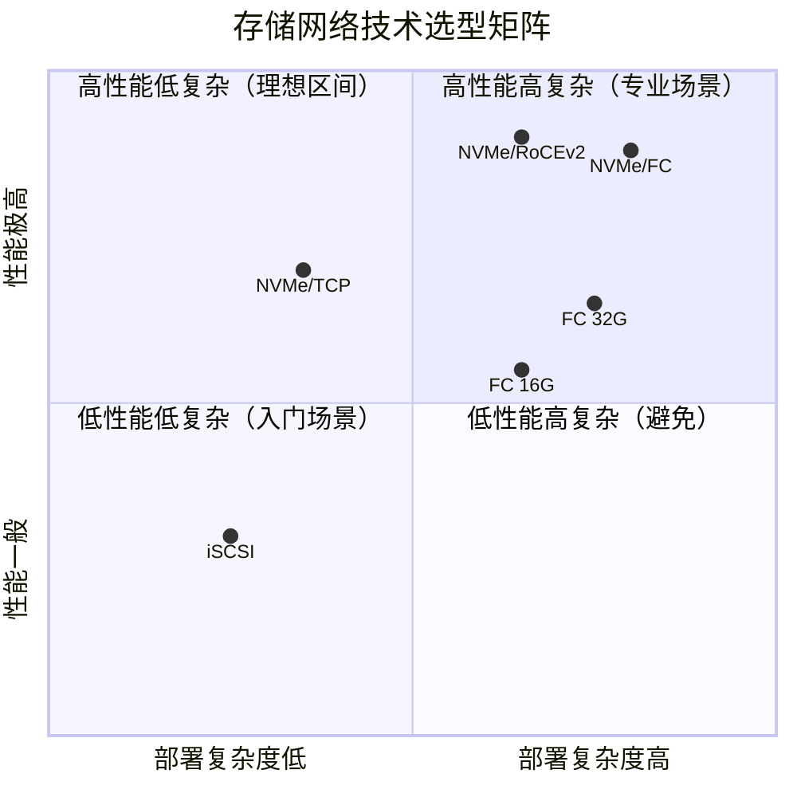
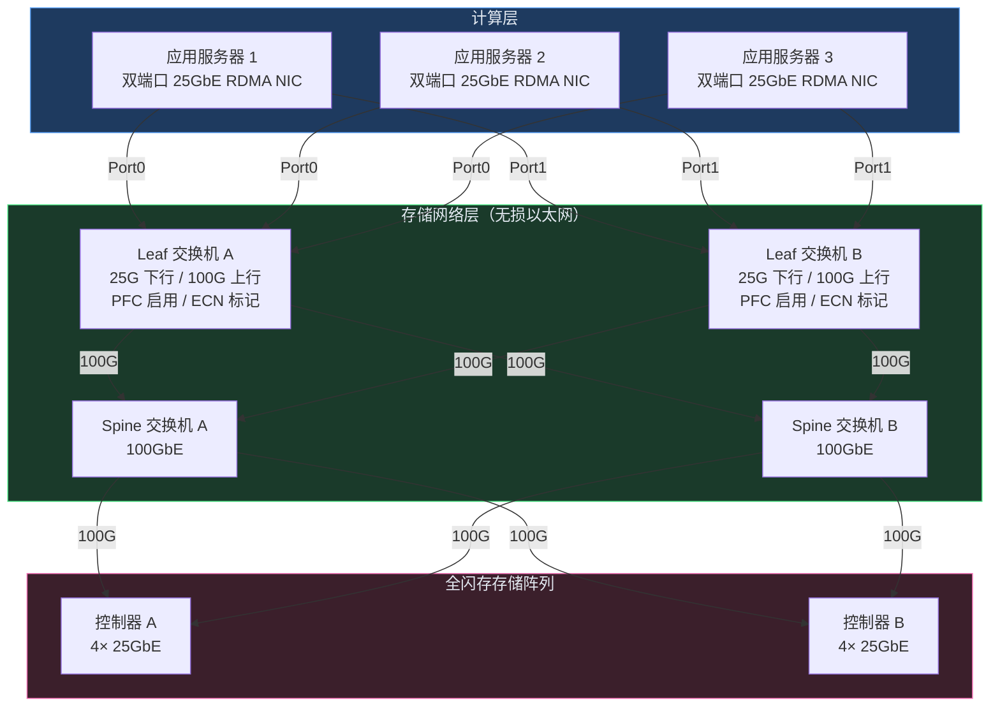

# 存储网络：iSCSI、FC与NVMe-oF深度解析

> 📋 **前置知识**：[Spine-Leaf架构](/guide/datacenter/spine-leaf)、[以太网交换](/guide/basics/switching)
> ⏱️ **阅读时间**：约18分钟

---

数据库节点写入一条记录，这个请求穿越了多少层协议才真正落到磁盘上？在传统以太网中，答案是 TCP/IP + SCSI 命令封装（iSCSI），延迟通常在 **500µs–2ms** 区间。换成 NVMe-oF + RoCEv2 的全闪存路径，同一条写入可以压缩到 **50–200µs**。这个数量级差距在 OLTP 场景中直接转化为 QPS（每秒查询数）天花板。

存储网络（Storage Networking）不是配置几个 iSCSI 目标就完事。它涉及协议栈选择、物理拓扑设计、路径冗余策略和业务优先级隔离——每一层错误都会在高压力时刻以不可预测的方式爆发。

---

## 第一层：存储接入模式的基本分野

在深入协议细节之前，先明确三种存储接入模式的本质区别，这决定了什么场景该用 SAN（存储区域网络）。



| 维度 | DAS | NAS | SAN |
|------|-----|-----|-----|
| 协议层 | 块级（Block） | 文件级（File） | 块级（Block） |
| 共享方式 | 不共享 | 多客户端共享文件系统 | 多主机共享原始块设备 |
| 典型延迟 | <100µs | 1–10ms（受网络影响） | 100µs–2ms（依协议而定） |
| 适用场景 | 单机数据库、开发机 | 文件共享、归档 | 企业数据库、虚拟化、容器持久卷 |
| 扩展性 | 差 | 中等 | 优秀 |

::: tip 为什么虚拟化平台偏爱 SAN
VMware vSphere 的 VMFS（虚拟机文件系统）构建在 SAN 块设备之上，允许多台 ESXi 主机同时访问同一个 LUN（逻辑单元），这是 vMotion 和 HA 的基础。NFS 同样支持 vSphere，但在高 IOPS 场景下 SAN 的延迟优势显著。
:::

---

## 第二层：iSCSI——IP 网络上的块存储

### 协议架构

iSCSI（Internet Small Computer System Interface）的核心思想很直白：把 SCSI 命令封装进 TCP/IP 数据报，让普通以太网承载块存储流量。这意味着无需专用硬件，用现有 IP 网络即可构建 SAN。

协议栈从上到下：

```
应用层：SCSI 命令集（READ/WRITE/INQUIRY…）
         ↓ 封装
iSCSI 层：PDU 构造、会话管理、数据摘要
         ↓
TCP 层：可靠传输、流量控制
         ↓
IP 层：路由寻址
         ↓
以太网：物理传输
```

**核心角色**：
- **发起端（Initiator）**：应用服务器上的软件驱动或 HBA（Host Bus Adapter），发起 SCSI 命令
- **目标端（Target）**：存储阵列上的服务进程，接收并执行命令
- **iSNS（Internet Storage Name Service）**：类似 DNS，负责 Initiator/Target 的自动发现

每个 Initiator 和 Target 以 **IQN（iSCSI Qualified Name）** 唯一标识，格式为：

```
iqn.2024-01.com.example:storage01.lun0
iqn.{年-月}.{反向域名}:{自定义标识}
```

### iSCSI 会话建立序列

一次完整的 iSCSI 连接从 TCP 三次握手开始，经过登录协商（Login Negotiation），才能进入数据传输阶段。



::: warning TCP 开销不可忽视
iSCSI 跑在 TCP 之上意味着每个 SCSI 命令都要经历 ACK 确认、拥塞控制等 TCP 机制。在高 IOPS 负载下，CPU 用于处理 TCP/IP 协议栈的开销可能成为瓶颈——这是推动 **TOE（TCP Offload Engine）网卡** 和后来 NVMe-oF 发展的根本原因之一。
:::

### 多路径（MPIO）配置

生产环境中，单路径 iSCSI 是不可接受的。**MPIO（Multipath I/O）** 通过多条独立路径同时连接 Target，实现负载均衡和故障切换。

典型的双控双网卡配置：

```
应用服务器
├── NIC0 (10.0.1.10) ──→ 存储交换机A ──→ 控制器A (10.0.1.100)
└── NIC1 (10.0.2.10) ──→ 存储交换机B ──→ 控制器B (10.0.2.100)
                                            ↘
                                          同一 LUN（双活）
```

Linux 配置示例（`multipath.conf` 关键片段）：

```ini
defaults {
    polling_interval    10
    path_selector       "round-robin 0"
    path_grouping_policy multibus
    failback            immediate
    rr_weight           priorities
    no_path_retry       queue
}

devices {
    device {
        vendor          "PURE"
        product         "FlashArray"
        path_checker    tur
        features        "0"
        hardware_handler "1 alua"
        path_grouping_policy group_by_prio
        prio            alua
    }
}
```

### 性能优化要点

**Jumbo Frame（巨帧）**：将以太网 MTU 从默认 1500 字节调整到 9000 字节，减少大块 I/O 的分片次数，显著降低 CPU 中断频率。要求存储网络路径上所有设备（交换机、NIC、存储控制器）一致启用。

```bash
# Linux 启用 Jumbo Frame
ip link set eth0 mtu 9000

# 验证路径 MTU
ping -M do -s 8972 10.0.1.100  # 8972 + 28 字节头部 = 9000
```

**iSCSI 专用 VLAN**：将存储流量与业务流量物理隔离在不同 VLAN，避免广播风暴或业务流量峰值影响存储 I/O 延迟。

---

## 第三层：光纤通道（Fibre Channel, FC）

### FC 协议栈

FC（Fibre Channel，光纤通道）是为存储网络专门设计的协议，从设计之初就优化了低延迟和高可靠性，而非通用网络的灵活性。

FC 协议栈分为五层（FC-0 到 FC-4）：

| 层次 | 名称 | 职责 |
|------|------|------|
| FC-4 | 协议映射层 | 承载上层协议：FCP（SCSI）、FICON（IBM 大机）、NVMe/FC |
| FC-3 | 公共服务层 | 组播、加密、RAID（较少使用） |
| FC-2 | 帧/流控层 | 帧封装、序列管理、信用（Credit）流控 |
| FC-1 | 编码层 | 8b/10b 或 64b/66b 编码、字符同步 |
| FC-0 | 物理层 | 光纤/铜缆介质、信号速率（8/16/32/64 Gbps） |

FC 的**基于信用的流量控制（Credit-Based Flow Control）**是其低延迟的核心：发送方只有在接收方明确授予信用（Buffer-to-Buffer Credit, BB_Credit）后才能发送帧，从根本上避免了 TCP 重传导致的延迟抖动。

### FC Fabric 拓扑



### WWN 寻址与分区（Zoning）

FC 网络中，每个设备端口有全球唯一的 **WWN（World Wide Name）**，格式为 8 字节十六进制，例如：`20:00:00:25:b5:00:a0:13`。WWN 分两类：

- **WWNN（Node Name）**：标识整个主机或存储控制器
- **WWPN（Port Name）**：标识具体的端口，分区和访问控制基于 WWPN

**Zoning（分区）** 是 FC 网络访问控制的核心机制，决定哪些 Initiator 能看到哪些 Target：

```
Zone DB_to_Storage {
    member: 10:00:00:00:c9:xx:xx:01  # 数据库服务器 HBA1
    member: 10:00:00:00:c9:xx:xx:02  # 数据库服务器 HBA2
    member: 50:06:01:6x:xx:xx:xx:01  # 存储控制器 A
    member: 50:06:01:6x:xx:xx:xx:02  # 存储控制器 B
}

Zone Backup_to_Storage {
    member: 10:00:00:00:c9:xx:xx:03  # 备份服务器 HBA
    member: 50:06:01:6x:xx:xx:xx:01  # 仅控制器 A（备份不需要双控访问）
}
```

::: tip Single Initiator Zoning 最佳实践
每个 Zone 只包含**一个 Initiator** 和所有它需要访问的 Target 端口。避免将多个 Initiator 放在同一 Zone——这样当一个 Initiator 产生 RSCN（注册状态变更通知）事件时，不会触发其他 Initiator 重新登录，减少风暴效应。
:::

### VSAN（虚拟 SAN）

类似以太网的 VLAN，FC 交换机（Cisco MDS 系列）支持将物理 Fabric 划分为多个逻辑 **VSAN（Virtual SAN）**。不同 VSAN 中的设备相互不可见，即使运行在同一物理交换机上。典型用途：

- VSAN 10：生产数据库存储
- VSAN 20：灾备环境
- VSAN 30：测试/开发（完全隔离，故障不影响生产）

### FCoE（FC over Ethernet）

**FCoE（Fibre Channel over Ethernet）** 将 FC 帧封装在增强型以太网（IEEE 802.1Qbb，Priority Flow Control）中传输，实现 LAN 和 SAN 的网络融合，减少数据中心网卡和线缆数量。

::: warning FCoE 的现实处境
FCoE 在架构上颇具吸引力，但实际部署中面临诸多挑战：需要支持 DCB（数据中心桥接）的专用交换机、CNA（融合网络适配器）采购成本高，且随着 NVMe-oF 兴起，FCoE 的市场份额已大幅萎缩。新建数据中心应优先评估 NVMe/TCP 或 RoCEv2 方案。
:::

---

## 第四层：NVMe-oF——下一代存储网络

### 为什么需要 NVMe-oF

传统 SCSI 协议设计于机械磁盘时代：单队列、深度有限、命令集臃肿。NVMe（Non-Volatile Memory Express）为 SSD 重新设计了主机接口：**65535 个队列 × 65535 深度**，命令集精简，延迟极低。

但 NVMe 最初只能通过 PCIe 直连——这意味着它必须在本地插槽上。**NVMe-oF（NVMe over Fabrics）** 将 NVMe 命令通过网络传输，让远端存储的性能接近本地 NVMe。

| 指标 | 本地 SATA SSD | 本地 NVMe PCIe | iSCSI（10GbE） | NVMe/TCP（25GbE） | NVMe/RoCE（25GbE） |
|------|------|------|------|------|------|
| 读延迟（µs） | ~70 | ~20 | 500–2000 | 100–300 | 50–150 |
| 4K 随机读 IOPS | ~100K | ~1000K | ~200K | ~800K | ~1500K |
| CPU 开销 | 低 | 极低 | 高（TCP 栈） | 中（部分卸载） | 极低（RDMA 硬件卸载） |

### NVMe-oF 传输类型



### RoCEv2 深度解析

RoCEv2 是当前高性能存储网络的首选传输层，其核心是 **RDMA（Remote Direct Memory Access，远程直接内存访问）**：数据直接从源主机内存传输到目标主机内存，**完全绕过操作系统内核和 CPU**，由网卡硬件完成。

RoCEv2 数据包结构：

```
┌──────────┬──────────┬──────────┬─────────────────────┬──────────┐
│ Ethernet │    IP    │   UDP    │   IB Transport（BTH）│  数据载荷 │
│  帧头     │ 20 bytes │ 8 bytes  │    RDMA 控制头      │          │
└──────────┴──────────┴──────────┴─────────────────────┴──────────┘
                                UDP dst port = 4791
```

::: danger RoCEv2 必须启用 PFC
RDMA 协议不具备 TCP 的重传机制——一旦发生丢包，RDMA 操作会直接报错。因此 RoCEv2 网络**必须**配置 **PFC（Priority-based Flow Control，IEEE 802.1Qbb）** 来实现无损以太网，防止队列溢出导致丢包。

未正确配置 PFC 和 ECN 的 RoCEv2 部署是生产事故的高发来源：表面上一切正常，但在突发流量时存储 I/O 会出现大量超时。
:::

**DCQCN（Data Center QCN）** 是配合 PFC 使用的拥塞控制算法，通过 ECN（显式拥塞通知）标记触发发送速率降低，避免 PFC 风暴。

### NVMe/TCP：零门槛的选择

NVMe/TCP 不需要 RDMA 网卡，使用标准以太网和 TCP 栈即可运行。延迟高于 RoCEv2，但对于多数应用（非极低延迟数据库），100–300µs 的读延迟完全可接受。

Linux 内核 5.14+ 已内置 NVMe/TCP 支持，部署极为简单：

```bash
# 加载 NVMe/TCP 模块（Initiator 侧）
modprobe nvme-tcp

# 发现 Target
nvme discover -t tcp -a 10.0.1.100 -s 4420

# 连接
nvme connect -t tcp -n "nqn.2024-01.com.example:nvme-subsystem1" \
             -a 10.0.1.100 -s 4420

# 查看连接
nvme list
```

---

## 第五层：技术选型与企业实践

### 三大技术全面对比



| 维度 | iSCSI | FC | NVMe-oF (RoCEv2) |
|------|-------|-----|-----------------|
| **传输介质** | 以太网（1/10/25GbE） | 专用光纤（8/16/32Gbps） | 以太网（25/100GbE） |
| **延迟** | 500µs–2ms | 200–500µs | 50–200µs |
| **最大 IOPS** | ~500K | ~1.5M | ~5M+ |
| **CPU 开销** | 高 | 低（HBA 卸载） | 极低（RDMA） |
| **基础设施成本** | 低（复用现有网络） | 高（专用 SAN 交换机） | 中（需 RDMA 网卡和无损网络） |
| **运维复杂度** | 低 | 高（WWN 管理、Zoning） | 中（PFC/ECN 调优） |
| **适用场景** | SMB、测试、归档 | 金融核心、大型数据库 | AI 训练、NVMe 闪存阵列 |
| **成熟度** | 极高（20+ 年） | 极高（30+ 年） | 快速成熟（2018+ 主流） |

### 全闪存阵列（AFA）的存储网络设计

以 Pure Storage FlashArray 或 NetApp AFF 为例，接入全闪存阵列（All-Flash Array）时的推荐拓扑：



**设计要点**：

1. **双活控制器路径**：每台服务器的两个端口分别连接两台 Leaf 交换机，任意单点故障（NIC、交换机、控制器）不中断业务
2. **存储专用 Spine-Leaf**：存储网络独立部署，与业务网络物理隔离，避免共享带宽竞争
3. **Leaf 交换机配置无损以太网**：仅存储 VLAN 启用 PFC，避免 PFC 风暴扩散到业务流量
4. **超额订阅比控制**：存储网络建议上行带宽比不超过 3:1，高性能场景维持 1:1

### 高可用路径设计原则

```
规则一：路径完全冗余
  每条路径必须经过不同的：NIC → 交换机 → 存储控制器端口
  任意单个组件故障不影响 I/O 连续性

规则二：路径对称
  主/备路径的带宽和跳数保持对称
  避免非对称路径导致 MPIO 负载均衡失效

规则三：故障域隔离
  A 路径和 B 路径连接不同电源域的交换机
  存储控制器 A 和 B 连接不同的 Leaf 交换机

规则四：监控路径健康
  配置路径状态告警：当可用路径数从 4 降至 2 时立即通知
  不要等到 0 路径时才发现问题
```

::: tip 路径数量建议
对于关键业务数据库：每个 LUN 至少 4 条独立路径（2 个 HBA × 2 个存储控制器端口）。Pure Storage 等 AFA 厂商通常推荐每个主机 4–8 条路径，结合 ALUA（非对称逻辑单元访问）优先使用优化路径，备用路径自动接管。
:::

### 选型决策框架

**选择 iSCSI 的场景**：
- 预算有限，无法新建专用存储网络
- 性能需求在 100K IOPS 以内，延迟容忍 >1ms
- 中小型虚拟化环境（100 台 VM 以下）
- 测试、开发、备份存储

**选择 FC 的场景**：
- 现有 FC 基础设施，运维团队熟悉 FC 运维
- 金融、医疗等对稳定性要求极高的场景
- 需要 IBM 大机（FICON）互联
- 监管合规要求物理隔离的存储网络

**选择 NVMe-oF 的场景**：
- 新建数据中心，使用全闪存阵列
- AI 训练集群（GPU 服务器访问共享 NVMe 存储）
- 高频交易、实时分析（延迟 <200µs 的硬要求）
- Kubernetes 容器持久卷（高并发小块 I/O）

::: warning 不要在不确定的情况下选择 RoCEv2
RoCEv2 的性能上限极高，但对网络配置的要求也极为严格。一个错误配置的 PFC 参数可能导致全网 PFC 风暴，影响远超预期。如果团队没有 RDMA 网络调优经验，建议先从 NVMe/TCP 入手，待积累经验后再评估 RoCEv2 迁移。
:::

---

## 关键要点总结

存储网络的演进路径清晰可见：从 iSCSI 的"够用就好"，到 FC 的"专业可靠"，再到 NVMe-oF 的"极致性能"。没有最好的协议，只有最适合当前约束的方案。

**核心判断依据**：

1. **延迟敏感度**：<200µs → NVMe/RoCEv2；<500µs → FC 或 NVMe/TCP；>1ms → iSCSI 足够
2. **现有投资**：有 FC 基础设施 → 评估 FC 升级或 NVMe/FC；全新建设 → NVMe/TCP 起步
3. **团队能力**：RDMA 调优经验不足 → 避免 RoCEv2 冒险
4. **规模效益**：>500 台服务器的大规模部署中，NVMe-oF 的 CPU 节省可以直接转化为可观的硬件成本降低

存储网络故障往往不是协议本身的问题，而是路径冗余设计不足、PFC 未正确配置、或多路径软件版本不兼容。**把最多的精力放在可靠性设计和监控覆盖上**，比追求最新协议更重要。
