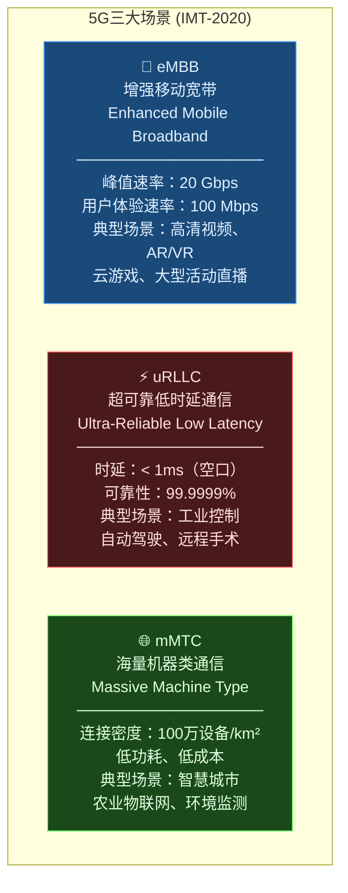
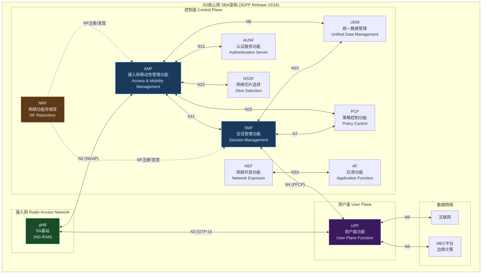
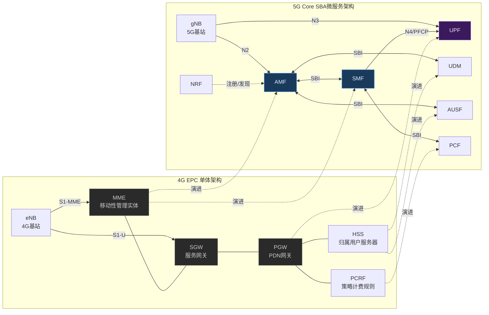
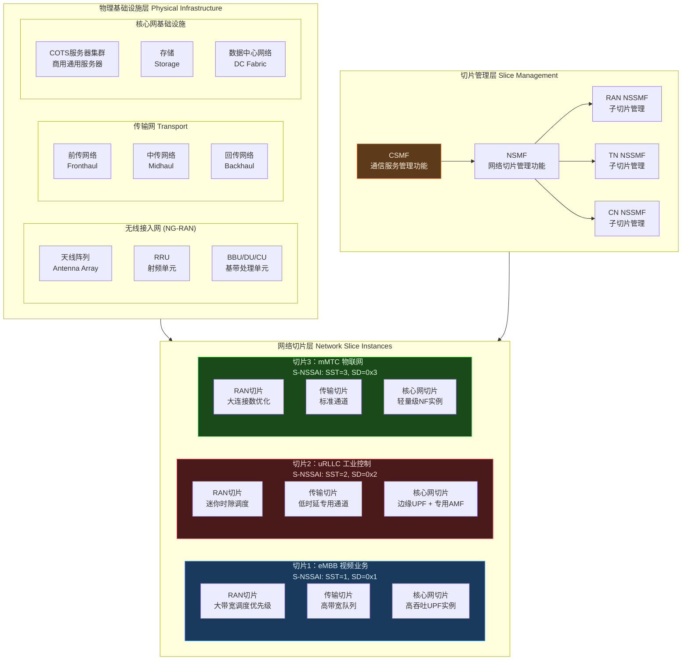
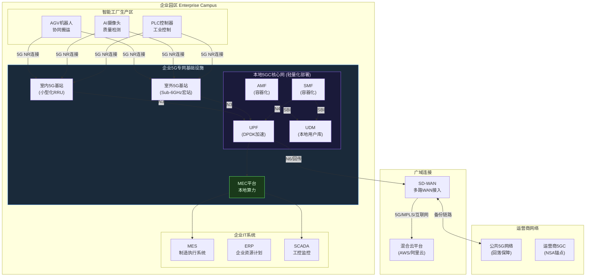

> 📋 **前置知识**：[网络功能虚拟化（NFV）](/guide/datacenter/nfv)、[网络切片](/guide/advanced/network-slicing)
> ⏱️ **阅读时间**：约20分钟

# 5G核心网：网络切片、边缘计算与企业专网

5G不仅是速度的提升，更是网络架构的根本性重构。从单体式演进到云原生微服务，从"尽力而为"演进到确定性时延保障，5G核心网（5G Core，5GC）将电信网络彻底改造为一个可编程、可切片、可按需弹性扩缩的数字基础设施平台。

对企业架构师而言，5G带来的不仅是更快的无线接入，更是一套全新的网络服务能力集合——通过网络切片为不同业务场景提供定制化的网络保障，通过多接入边缘计算（MEC）将算力下沉至业务现场，通过企业专网实现生产网络与公网的彻底隔离。

## 一、5G三大应用场景

国际电信联盟（ITU）在IMT-2020框架中定义了5G的三大应用场景，构成了整个5G网络设计的出发点：

::: tip 场景选择决定网络切片设计
三大场景对网络的需求截然不同，这正是网络切片存在的核心价值——同一张物理网络，通过切片为不同场景提供差异化的网络保障。一个工业控制切片需要极低时延但带宽可以较窄；一个视频直播切片需要大带宽但对时延要求宽松。
:::

### 1.1 eMBB：增强移动宽带

eMBB（Enhanced Mobile Broadband）是4G LTE的自然延伸，关注峰值速率和用户体验速率的提升。5G在eMBB场景下通过以下技术实现大幅提速：

- **毫米波（mmWave）**：使用24GHz以上频段，带宽可达800MHz甚至更宽，但覆盖距离短
- **大规模MIMO（Massive MIMO）**：基站配置64~256根天线，通过波束赋形提高频谱效率
- **载波聚合（Carrier Aggregation）**：聚合多个频段，提升有效带宽

### 1.2 uRLLC：超可靠低时延通信

uRLLC（Ultra-Reliable Low Latency Communication）是5G最具革命性的能力，也是工业互联网的核心诉求。实现uRLLC需要在无线接入侧和核心网侧同时优化：

- **空口时延**：通过缩短时隙（Mini-slot调度）将空口时延压缩至0.5ms
- **核心网时延**：通过UPF下沉至基站侧（边缘部署）减少数据路径
- **可靠性保障**：通过双连接（Dual Connectivity）和冗余传输实现99.9999%可靠性

### 1.3 mMTC：海量机器类通信

mMTC（Massive Machine Type Communication）面向物联网设备的大规模连接，5G通过NB-IoT（窄带物联网）和eMTC（增强型机器类型通信）技术演进支持此场景，核心设计目标是低功耗和低成本。

## 二、5G核心网（5GC）服务化架构

5G核心网彻底抛弃了4G EPC（Evolved Packet Core）的单体架构，采用**服务化架构（Service-Based Architecture，SBA）**，将网络功能（Network Function，NF）设计为独立的微服务，通过标准化HTTP/2接口（服务化接口，SBI）进行交互。

::: tip SBA架构的核心思想
所有控制面网络功能（NF）通过HTTP/2 REST API相互调用，NRF（网络功能存储库）充当服务注册与发现中心，类似于微服务架构中的Consul或Eureka。每个NF既是服务提供者（NF Service Producer），也可以是服务消费者（NF Service Consumer）。
:::

### 2.1 核心网络功能详解

| 网络功能 | 全称 | 主要职责 | 类比4G功能 |
|---------|------|---------|-----------|
| **AMF** | Access and Mobility Management Function | 终端注册、接入认证、移动性管理、寻呼 | MME（部分） |
| **SMF** | Session Management Function | PDU会话建立/修改/释放、UPF选择与控制、IP地址分配 | MME（部分）+ SGW-C + PGW-C |
| **UPF** | User Plane Function | 数据包路由转发、QoS执行、流量检测与上报 | SGW-U + PGW-U |
| **PCF** | Policy Control Function | 策略规则制定、QoS授权、计费规则 | PCRF |
| **UDM** | Unified Data Management | 用户签约数据管理、鉴权凭证生成 | HSS（部分） |
| **AUSF** | Authentication Server Function | 执行UE认证（5G-AKA/EAP-AKA'） | HSS（部分） |
| **NRF** | NF Repository Function | NF注册、发现、状态管理 | DNS（类比） |
| **NSSF** | Network Slice Selection Function | 为UE选择合适的网络切片实例 | 全新功能 |
| **NEF** | Network Exposure Function | 向第三方应用安全开放网络能力 | SCEF |

### 2.2 控制面与用户面分离（CUPS）

5GC最重要的架构设计决策之一是**控制面与用户面分离（Control and User Plane Separation，CUPS）**：

- **SMF（控制面）** 通过 **N4接口（PFCP协议）** 下发转发规则给 **UPF（用户面）**
- UPF负责纯数据转发，不参与任何控制逻辑
- UPF可以独立部署在边缘，靠近终端设备，大幅降低数据面时延
- 控制面可以集中在区域数据中心，统一管控多个UPF实例

这种分离使得UPF能够灵活部署——可以放在核心机房，也可以下沉到基站附近的边缘节点，实现本地分流（Local Breakout）。

### 2.3 与4G EPC架构对比

::: warning 4G向5G迁移的兼容性考量
4G EPC和5G核心网并非完全割裂。非独立组网（NSA，Non-Standalone）模式下，5G NR（新空口）可以锚定在4G LTE上，核心网仍使用4G EPC。只有在独立组网（SA，Standalone）模式下才使用真正的5GC。大多数运营商的5G建设路径是：先NSA快速扩展覆盖，再逐步向SA演进。
:::

## 三、网络切片：一网多用的技术实现

**网络切片（Network Slicing）** 是5G最具商业价值的技术之一——在一张共享的物理网络基础设施上，通过虚拟化和软件定义技术，创建多个逻辑上相互隔离、功能上相互独立的"虚拟专网"。

### 3.1 切片标识符：S-NSSAI

每个网络切片通过 **S-NSSAI（Single Network Slice Selection Assistance Information）** 唯一标识，由两部分组成：

- **SST（Slice/Service Type）**：标准化切片类型
  - `SST=1`：eMBB
  - `SST=2`：uRLLC  
  - `SST=3`：MIoT（大规模物联网）
  - `SST=4`：V2X（车联网）

- **SD（Slice Differentiator）**：可选的3字节差异化标识符，用于区分同类型的多个切片实例（例如，为不同行业客户提供不同的eMBB切片）

终端设备（UE）在注册网络时，在注册请求（Registration Request）消息中携带所需的 **NSSAI（Requested NSSAI）**，AMF根据签约数据（UDM）和网络策略（NSSF）为UE选择合适的切片。

### 3.2 端到端切片三层结构

端到端网络切片跨越三个网络域：

**RAN切片（无线接入网切片）**

- 空口资源调度优先级（Scheduling Priority）
- 物理资源块（PRB，Physical Resource Block）预留比例
- HARQ（混合自动重传请求）参数配置
- 不同切片的QoS配置文件（QoS Profile）

**传输网切片（Transport Network Slicing）**

- FlexE（灵活以太网）硬管道隔离
- SR-TE（分段路由流量工程）路径定制
- MPLS VPN隔离
- TSN（时间敏感网络）时间同步

**核心网切片（Core Network Slicing）**

- 专用或共享的NF实例（AMF、SMF、UPF）
- 独立的UPF数据平面，保证性能隔离
- 独立的策略配置（PCF）和用户数据库（UDM）

### 3.3 切片隔离机制

::: warning 切片隔离的安全边界
网络切片的隔离不等于物理隔离。切片间的隔离通过以下机制实现，但仍存在共享基础设施带来的潜在风险：
- **计算隔离**：容器命名空间（Namespace）和cgroups资源限制
- **网络隔离**：VLAN/VxLAN、独立的VRF路由实例
- **数据隔离**：独立的数据库实例或schema
- **管理隔离**：RBAC（角色访问控制）防止跨切片操作

对于安全要求极高的行业（如国防、金融），应考虑独立核心网实例甚至物理隔离的专用硬件。
:::

### 3.4 切片管理架构（CSMF/NSMF/NSSMF）

切片的生命周期管理通过三层管理架构实现：

| 管理层级 | 功能组件 | 主要职责 |
|---------|---------|---------|
| **业务层** | CSMF（通信服务管理功能） | 将客户业务需求（SLA、带宽、时延）转化为网络切片需求描述 |
| **切片层** | NSMF（网络切片管理功能） | 端到端切片生命周期管理（创建/修改/激活/去激活/终止） |
| **子切片层** | NSSMF（网络子切片管理功能） | 分别管理RAN、传输网、核心网子切片的资源编排 |

切片创建流程：客户通过运营商门户提交切片需求 → CSMF转化为NSMF可理解的切片模板 → NSMF分解为三个子切片任务 → 各NSSMF调用底层NFVO（网络功能虚拟化编排器）和SDN控制器实例化资源。

## 四、UPF与多接入边缘计算（MEC）

UPF（User Plane Function）是5G中最具战略价值的网络功能，它不仅是数据平面的核心转发节点，更是边缘计算（Edge Computing）能力部署的"锚点"。

```mermaid
graph TB
    subgraph UE_Side["终端侧"]
        UE1["工业机器人\n(uRLLC UE)"]
        UE2["高清摄像头\n(eMBB UE)"]
        UE3["温湿度传感器\n(mMTC UE)"]
    end

    subgraph RAN_Layer["无线接入层"]
        gNB1["5G基站\ngNB/DU/CU"]
    end

    subgraph Edge_Layer["边缘层 (MEC)"]
        UPF_Edge["边缘UPF\nLocal UPF\n(本地分流节点)"]
        MEC_Platform["MEC平台\nMEC Platform"]
        subgraph MEC_Apps["MEC应用"]
            App1["实时控制应用\n时延 < 5ms"]
            App2["视频分析应用\n AI推理"]
            App3["IoT数据聚合\n边缘存储"]
        end
        UPF_Edge --> MEC_Platform
        MEC_Platform --> App1
        MEC_Platform --> App2
        MEC_Platform --> App3
    end

    subgraph Regional["区域核心层"]
        UPF_Regional["区域UPF\nRegional UPF"]
        AMF_Regional["AMF"]
        SMF_Regional["SMF\n(ULCL策略控制)"]
    end

    subgraph Central["中心层"]
        UPF_Central["中心UPF\nAnchor UPF"]
        Internet["互联网\nInternet"]
        Enterprise_DC["企业数据中心\nEnterprise DC"]
    end

    UE1 & UE2 & UE3 -->|"N3 (GTP-U)"| gNB1
    gNB1 -->|"N3"| UPF_Edge
    UPF_Edge -->|"本地业务流量\nLocal Traffic"| MEC_Platform
    UPF_Edge -->|"N9 (上行分类器ULCL)"| UPF_Regional
    UPF_Regional -->|"N9"| UPF_Central
    UPF_Central -->|"N6"| Internet
    UPF_Central -->|"N6"| Enterprise_DC

    SMF_Regional -->|"N4 PFCP\n分流规则下发"| UPF_Edge
    SMF_Regional -->|"N4 PFCP"| UPF_Regional
    SMF_Regional -->|"N4 PFCP"| UPF_Central

    style UPF_Edge fill:#3a1a5c,stroke:#9a6bff,color:#f0e0ff
    style MEC_Platform fill:#1a4a1a,stroke:#6bff6b,color:#e0ffe0
    style App1 fill:#4a1a1a,stroke:#ff6b6b,color:#ffe0e0
```

### 4.1 本地分流（Local Breakout / ULCL）

**上行分类器（Uplink Classifier，ULCL）** 是SMF在UPF中部署的一种流量分类机制：

- SMF通过N4接口（PFCP协议）向边缘UPF下发PDR（包检测规则）
- 边缘UPF根据目标IP、端口、应用特征，将流量分为两类：
  - **本地业务流量**：直接转发至MEC平台（N6接口），不经过区域/中心UPF
  - **Internet/远端流量**：通过N9接口转发至上级UPF，再出互联网
- 本地分流流量路径：UE → gNB → 边缘UPF → MEC应用，端到端时延可低至3~5ms

### 4.2 MEC部署模型

ETSI（欧洲电信标准协会）定义了MEC（Multi-access Edge Computing）的标准架构，在5G网络中有三种典型部署模型：

**模型一：与gNB共站部署（最低时延）**
- MEC平台与5G基站（CU/DU）部署在同一机柜或相邻机房
- UPF同步下沉，实现真正的"边"缘计算
- 适用场景：工厂内部工业控制（时延 < 5ms）

**模型二：汇聚点部署（平衡型）**
- MEC部署在多个基站共享的汇聚机房
- 覆盖半径约10~20km
- 适用场景：园区、港口、机场的视频分析和业务加速

**模型三：区域数据中心部署（大范围覆盖）**
- MEC部署在运营商区域DC
- 覆盖城市级别
- 适用场景：CDN内容缓存、视频直播加速、区域性IoT数据聚合

### 4.3 MEC与CDN/IoT的融合

| 集成对象 | 集成方式 | 业务价值 |
|---------|---------|---------|
| **CDN（内容分发网络）** | 将CDN节点部署于MEC，通过N6直接访问本地缓存 | 视频点播首帧时间从2s降至100ms以内 |
| **工业IoT网关** | IoT设备通过5G mMTC接入，MEC上运行协议转换和数据聚合 | 消除M2M协议碎片化，统一数据格式上云 |
| **AI推理引擎** | 将TensorRT/OpenVINO推理服务部署于MEC GPU | 摄像头画面实时分析，无需将原始视频回传中心 |
| **工业OT系统** | UPF提供与PLC、SCADA系统的二层/三层互通 | 保留原有工控系统投资，无缝接入5G网络 |

## 五、企业5G专网

企业5G专网（Private 5G Network）是将5G技术引入企业内部网络的重要形式，为工业互联网、智慧园区、港口、矿山等场景提供"企业自主可控"的无线网络能力。

### 5.1 三种部署模式对比

| 部署模式 | 描述 | 核心网位置 | 数据本地化 | 适用场景 |
|---------|------|-----------|----------|---------|
| **独立专网（Standalone Private）** | 企业自建频谱、RAN和核心网 | 企业本地 | 完全本地 | 高安全要求：军工、金融、矿山 |
| **共享网络（Network Slicing）** | 租用运营商网络切片 | 运营商 | 部分（UPF可托管） | 中小企业、园区快速部署 |
| **混合模式（Hybrid）** | 专用RAN + 运营商核心网，或RAN共享 + 本地核心网 | 混合 | 可配置 | 大型园区、港口、医院 |

### 5.2 频谱选择策略

**Sub-6GHz频段（FR1：410MHz ~ 7.125GHz）**
- 覆盖能力强，穿透力好
- 典型频段：3.5GHz（n78）、2.6GHz（n41）
- 适合大面积室外覆盖：港口、机场、矿山
- 企业可通过运营商共享频谱或申请行业专用频谱

**毫米波（mmWave，FR2：24.25GHz ~ 52.6GHz）**
- 极大带宽（800MHz以上），极高速率
- 覆盖距离短（200m以内），穿透性差
- 适合室内高密度场景：仓储物流中心、体育馆、展览中心
- 工厂车间内部署，可实现1Gbps+的设备连接速率

::: tip 行业专用频谱政策
各国政府陆续为垂直行业开放专用频谱。德国联邦网络局开放了3.7~3.8GHz专用频段；中国工信部为工业企业提供5G专频申请通道（如5925-6125 MHz）。企业在规划5G专网时应优先调研本地监管政策，确保频谱合规使用。
:::

### 5.3 工业专网案例

**智能工厂案例**

某汽车制造厂在冲压、焊装、涂装、总装四大车间部署5G专网：

- **AGV协同控制**：uRLLC切片，时延 < 5ms，300台AGV实时路径协调
- **AI视觉质检**：eMBB切片，每台相机上传4K视频至MEC，每秒处理30帧质检任务
- **设备IoT监控**：mMTC切片，3000+传感器监控设备状态，NB-IoT协议接入
- **本地算力**：MEC平台部署AI推理服务，质检结果实时反馈至PLC，无需数据出园

**智慧港口案例**

某集装箱港口通过5G专网实现：

- **岸桥自动化**：5G替代光纤连接，岸桥AGC（自动吊具控制）延伸至全场
- **无人集卡**：Sub-6GHz宏站覆盖全港区，无人集装箱卡车V2X通信
- **视频监控**：120路高清摄像头通过5G上传，港口大脑统一调度
- **港口专网与公网融合**：港区访客设备通过运营商公网切片隔离，核心生产系统使用专用频率和独立核心网

## 六、5G与SD-WAN的融合

5G为SD-WAN提供了全新的WAN接入选项，显著增强了企业广域网的灵活性和弹性。

### 6.1 5G作为WAN接入链路

在SD-WAN场景中，5G可扮演以下角色：

- **主路径（Primary Path）**：在无法铺设光纤的场景（如临时工地、移动零售车），5G作为主要WAN链路，提供100~500Mbps的可靠接入
- **备份路径（Backup Path）**：当MPLS或光纤专线中断时，SD-WAN自动切换至5G链路，实现亚秒级故障切换
- **带宽叠加（Bonding）**：将5G与MPLS、宽带同时使用，通过SD-WAN流量调度算法实现多链路负载均衡

### 6.2 5G+SD-WAN架构优势

| 维度 | 传统WAN | 5G+SD-WAN |
|------|---------|-----------|
| **接入方式** | MPLS专线（3~6个月部署） | 5G即插即用（数小时） |
| **弹性扩展** | 固定带宽，扩容周期长 | 按需切换带宽，近实时扩容 |
| **故障恢复** | 人工介入，小时级 | 自动切换，秒级 |
| **分支部署** | 需要固定机房和专线 | 可部署于移动车辆、临时场所 |
| **成本** | 高（MPLS按带宽计费） | 中（5G按流量或包月，弹性更高） |

::: tip SD-WAN与5G核心网的深度集成
领先的SD-WAN厂商（如思科Viptela、VMware VeloCloud、Fortinet）已与主要运营商合作，实现SD-WAN策略引擎与5G网络切片的联动——SD-WAN的应用感知路由可以动态选择不同的5G切片（如将VoIP流量映射至uRLLC切片，将文件备份映射至eMBB切片），实现端到端的应用级QoS保障。
:::

### 6.3 企业5G+SD-WAN设计要点

实施5G+SD-WAN融合架构时，需要关注以下关键设计决策：

1. **SIM卡管理**：企业需要管理大量SIM卡（或eSIM），建议引入MDM（移动设备管理）平台统一管理
2. **路由策略**：明确哪些业务流量走5G、哪些走专线，避免敏感数据经公网泄露
3. **CPE选型**：确认5G CPE（客户端设备）支持所需频段（FR1/FR2）和运营商NSA/SA模式
4. **SLA监控**：通过SD-WAN的实时链路质量监测，建立5G链路的时延、抖动、丢包基线，触发告警和自动切换

## 七、安全与合规

::: danger 5G企业专网的安全威胁面
5G专网在带来便利的同时，也引入了新的安全威胁面：
- **无线接入点（gNB）**：若物理安全控制不足，可能遭受伪基站攻击
- **开放的5GC接口（SBI/N4）**：基于HTTP/2的SBI接口若未做充分的TLS互认证，存在API注入风险
- **MEC平台**：边缘应用与5G核心网同平台部署，应用漏洞可能横向移动影响核心网功能
- **多租户切片共享**：切片隔离机制的配置错误可能导致跨租户数据泄露

建议参照3GPP TS 33.501安全规范和ETSI NFV安全标准，对5G专网实施系统性安全加固。
:::

### 7.1 5G内生安全机制

5G核心网在安全设计上相比4G有显著增强：

- **SUCI（隐藏用户标识）**：UE使用运营商公钥加密SUPI（用户永久标识），防止IMSI捕获攻击
- **5G-AKA协议**：改进的认证与密钥协商协议，引入归属网络确认机制，防止降维攻击
- **NF间双向TLS**：SBI接口强制要求双向TLS认证，防止伪冒NF攻击
- **N2/N3接口保护**：基站与AMF/UPF之间的IPSec加密隧道

## 总结

5G核心网通过服务化架构（SBA）、控制用户面分离（CUPS）和网络切片技术，将传统电信网络转型为一个灵活、可编程的数字基础设施平台。

对企业而言，5G带来的核心价值不在于速度，而在于**确定性**——通过网络切片为关键业务提供有SLA保障的专属网络资源，通过MEC将计算能力下沉至业务现场消除时延，通过企业专网实现数据主权和网络自主可控。

随着5G SA网络的普及和3GPP Release 16/17特性的成熟，网络切片的商业部署、MEC的规模化应用以及5G与SD-WAN的深度融合，将成为企业数字化转型的核心技术基石。

---

## 延伸阅读

- [网络功能虚拟化（NFV）架构](/guide/datacenter/nfv) — 理解5GC底层虚拟化基础设施
- [网络切片技术详解](/guide/advanced/network-slicing) — 深入切片管理和编排细节
- [SD-WAN架构与实践](/guide/sdwan/architecture) — 5G与SD-WAN融合的企业WAN设计
- [脊叶架构（Spine-Leaf）](/guide/datacenter/spine-leaf) — 5GC数据中心网络设计
