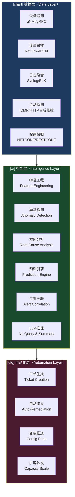
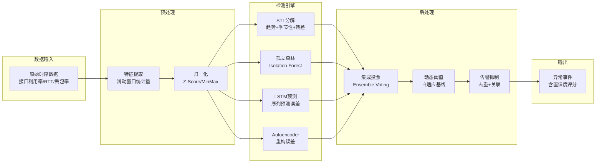
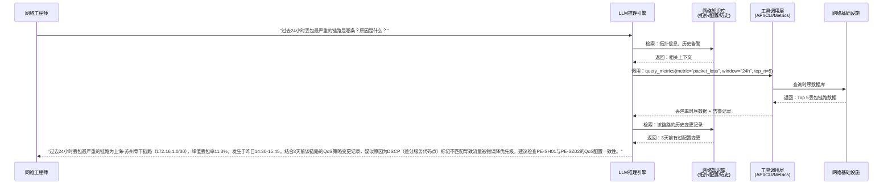
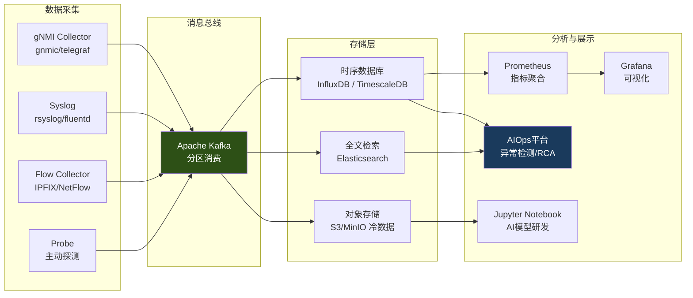
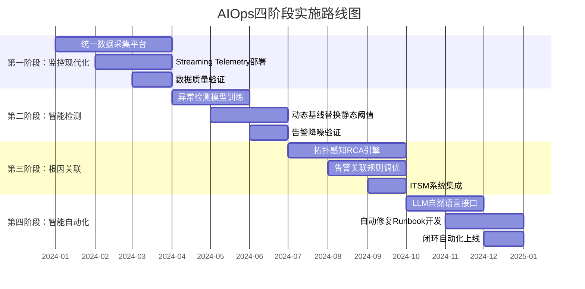

> <Icon name="clipboard-list" color="cyan" /> **前置知识**：[网络监控体系](/guide/ops/monitoring)、[意图驱动网络](/guide/emerging/intent-based-networking)
> ⏱ **阅读时间**：约18分钟

# AIOps网络运维：AI驱动的智能网络管理

在数字化转型加速的今天，企业网络承载着越来越多的业务负载，其复杂度呈指数级上升。传统以"人盯屏幕"为核心的网络运维模式正面临根本性挑战：每天产生数十万条告警，工程师深陷告警风暴无法自拔；每次故障排查耗时数小时乃至数天，关键业务SLA频繁告急。**AIOps（人工智能运维）**的出现，为这一困境提供了系统性的解决路径。

---

## 第一层：传统网络运维的困境

### 1.1 告警风暴的噩梦

现代企业数据中心部署了来自不同厂商的数百台网络设备，每台设备都可以独立产生告警。当一条核心链路出现抖动时，级联效应可以在数秒内触发数千条相关告警——OSPF（开放最短路径优先）邻居断开、BGP（边界网关协议）会话重置、VLAN（虚拟局域网）流量中断……运维人员面对海量重复、相互关联却以独立形式呈现的告警，往往陷入"不知道该先处理哪一条"的困境。

::: warning 行业数据
Gartner研究显示，大型企业网络运维团队平均每天接收超过 **10万条** 原始告警，其中有效告警（真正需要人工处理）的占比不足 **5%**。告警疲劳（Alert Fatigue）已成为影响运维质量的首要风险。
:::

### 1.2 MTTR（平均修复时间）居高不下

传统网络故障排查高度依赖人工经验：

- **数据孤岛**：设备日志、流量数据、配置历史分散在不同系统，关联分析需要手动完成
- **经验依赖**：复杂故障的根因分析往往只有少数高级工程师能完成，形成严重的人才依赖
- **工具割裂**：SNMP（简单网络管理协议）、Syslog、NetFlow 等数据来自不同工具，缺乏统一分析平台
- **被动响应**：等到用户投诉才发现故障，而非在业务影响之前主动发现问题

平均MTTR（Mean Time To Repair）超过4小时是许多企业面临的现实，而这4小时对于金融交易、电商平台等对网络高度敏感的业务而言，意味着巨大的损失。

### 1.3 规模增长超越人力边界

云原生架构、微服务化部署使得网络端点数量急剧膨胀。容器编排平台（Kubernetes）中，Pod的生命周期以秒计算，网络连接关系瞬息万变。传统的"一人管50台设备"的运维比例在这种架构下已经失效——**AIOps不是对人的替代，而是对人力边界的扩展**。

---

## 第二层：AIOps定义与架构层次

AIOps（Artificial Intelligence for IT Operations）由Gartner于2017年首次提出，其核心思想是：**利用机器学习（Machine Learning）和大数据分析技术，对海量IT运维数据进行实时处理，实现从被动响应到主动预测的范式转变**。

在网络领域，AIOps的架构可以划分为三个层次：



### 2.1 数据层：遥测数据的基础设施

数据层的质量决定了上层AI模型的上限。现代AIOps平台需要消费多维度的网络遥测（Telemetry）数据：

| 数据类型 | 协议/标准 | 采集频率 | 典型数据量 |
|---------|---------|---------|----------|
| 接口统计 | gNMI (gRPC Network Management Interface) | 每秒 | ~1KB/接口/秒 |
| 路由表变化 | BGP BMP（BGP Monitoring Protocol） | 事件驱动 | 可变 |
| 流量采样 | IPFIX/NetFlow v9 | 采样1:1000 | ~500B/流记录 |
| 设备日志 | Syslog、Structured Logging | 事件驱动 | 高度可变 |
| 应用性能 | HTTP合成监控、RUM | 每分钟 | ~2KB/探测点 |

### 2.2 智能层：机器学习引擎

智能层是AIOps的核心，承担从"数据"到"洞察"的转换。不同的AI技术被应用于不同的场景：

- **无监督学习**：用于异常检测，无需历史标注数据，适合网络环境的动态特性
- **时序预测**：用于容量规划和故障预测，基于历史趋势推断未来状态
- **图神经网络（GNN）**：用于拓扑感知的根因分析，理解故障在网络图结构中的传播路径
- **大语言模型（LLM）**：用于自然语言交互和告警摘要，降低运维门槛

### 2.3 自动化层：闭环响应

智能层产出的洞察，通过自动化层转化为实际行动。根据自动化程度，可以划分为三个级别：

- **L1 - 告警与工单**：自动生成工单，推送到ITSM（IT服务管理）系统
- **L2 - 辅助决策**：提供根因分析报告和推荐修复方案，由人工审核后执行
- **L3 - 自动修复**：对于低风险、高置信度的故障场景，触发自动化Runbook直接修复

::: tip 最佳实践
企业AIOps实施应遵循"先观察、再辅助、后自动化"的渐进路径。切忌在数据质量未验证前直接启用自动修复，以避免AI误判导致的连锁故障（Cascading Failure）。
:::

---

## 第三层：核心AI技术深度解析

### 3.1 异常检测（Anomaly Detection）

网络异常检测的核心挑战在于：网络流量具有强烈的**周期性**（工作日/周末、白天/夜间）、**趋势性**（业务增长）和**突发性**（DDoS攻击、大文件传输）。传统基于静态阈值的告警无法适应这种复杂性。



**主要算法对比：**

**基线学习（Baseline Learning）**：统计历史同期数据（如每周一上午9点的接口利用率），建立动态基线。当实时值超出基线±N个标准差时触发告警。优点是可解释性强，缺点是对突发业务变化不敏感。

**孤立森林（Isolation Forest）**：通过随机切割特征空间，异常点因为"难以被其他点包围"而被更快地孤立。适合高维特征场景，无需标注数据，计算效率高，适合实时处理。

**LSTM（长短时记忆网络）**：将过去N个时间步的数据作为输入，预测下一时间步的期望值，以预测误差（Prediction Error）作为异常分数。对复杂时序模式（节假日效应、事件驱动峰值）有较好的捕捉能力。

::: tip 工程实践
在实际部署中，推荐采用**集成方法（Ensemble）**：将多种算法的结果进行加权投票，可以显著降低单一模型的误报率（False Positive Rate），通常能将FPR从30%以上降低到10%以内。
:::

### 3.2 根因分析（Root Cause Analysis, RCA）

根因分析是AIOps中技术难度最高的模块，需要将孤立的告警事件与网络拓扑关联起来，理解故障传播链。

**拓扑感知RCA的核心思路**：

1. **构建网络拓扑图（Graph）**：节点为网络设备，边为物理/逻辑连接关系，持续从网络发现（Network Discovery）系统同步
2. **告警事件映射**：将告警与具体的节点/边关联，形成"事件图"
3. **因果传播分析**：利用图算法（PageRank变体、图神经网络）识别最可能的故障源节点
4. **置信度评分**：输出候选根因列表，按置信度排序

**图神经网络（GNN）在RCA中的应用**：

传统图算法依赖人工定义的因果规则，而GNN可以从历史故障数据中自动学习故障传播的拓扑模式。例如，模型可以学习到"当某核心交换机（Core Switch）的CPU利用率超过90%时，其下游接入层设备（Access Switch）依次出现ARP超时的概率为87%"，从而在未来类似场景中快速定位根因。

### 3.3 预测性维护（Predictive Maintenance）

预测性维护旨在在故障实际发生之前，识别设备老化、容量趋势等信号。

**设备故障预测**：光模块（Optical Transceiver）的光功率衰减、CPU/内存长期高位运行、FCS（帧校验序列）错误缓慢增加——这些信号单独看并不触发告警，但组合来看往往是设备即将故障的前兆。AI模型通过学习大量历史故障案例，可以在故障发生前数天甚至数周发出预警。

**容量耗尽预测（Capacity Exhaustion Prediction）**：

基于时序预测模型（如Facebook Prophet、ARIMA、LSTM），对接口带宽利用率、路由表规模、ARP表规模等关键容量指标进行趋势外推，预测"何时将达到80%阈值"，提前触发容量扩展流程。

```
预测结果示例：
链路 Gi0/0/1 (北京 -> 上海)
当前利用率: 73.2%
增长趋势: +2.1%/周
预计到达80%阈值: 3.3周后 (2024-05-15)
置信区间 (95%): [2.8周, 4.1周]
建议动作: 启动带宽扩容评估流程
```

### 3.4 智能告警管理（Intelligent Alert Management）

**告警关联（Alert Correlation）**：将时间窗口内（如5分钟内）的相关告警聚合为单个"事件（Incident）"，减少运维人员处理的工单数量。关联维度包括：时间相关性、拓扑相邻性、共同根因假设。

实践数据显示，经过良好调优的告警关联引擎，可以将原始告警数量压缩 **80-95%**，同时保持接近100%的Recall（不遗漏真实故障）。

**优先级排序（Priority Scoring）**：基于业务影响评估，综合考虑：
- 受影响的网络路径上承载的业务类型（VoIP > 批量数据传输）
- 受影响用户/服务的数量
- 故障持续时长
- SLA合同约定

---

## 第四层：LLM在网络运维中的革命性应用

大语言模型（Large Language Model）的出现，为AIOps带来了全新的人机交互范式。工程师不再需要掌握复杂的查询语法，可以用自然语言与网络运维系统对话。



### 4.1 自然语言查询（Natural Language Query）

传统的网络监控系统需要运维人员学习特定的查询语言（如PromQL、Flux、SQL），而LLM集成后，工程师可以用日常语言提问：

- "上周哪台设备重启次数最多？"
- "找出所有BGP会话异常断开的记录，按时间排序"
- "北京数据中心到上海的所有核心链路，过去7天的平均时延是多少？"

LLM将自然语言请求解析为结构化查询，调用底层API获取数据，再将结果以人类可读的方式呈现，并主动提供分析洞察。

### 4.2 告警摘要与根因解释

当一个复杂故障触发数十条告警时，LLM可以自动生成故障摘要：

> **故障摘要（AI生成）**
> 
> 北京DC-A核心交换机 Core-SW-BJ-01 于 14:23 出现LACP（链路聚合控制协议）协商失败，导致两条10G成员链路降级为单链路运行，带宽损失50%。下游接入层交换机 Access-SW-BJ-03 至 Access-SW-BJ-08 的流量在14:25-14:31间出现不同程度拥塞，触发QoS队列丢弃告警42条。初步判断根因为 Core-SW-BJ-01 的 GigabitEthernet 1/0/47 接口出现物理层错误（FCS errors 快速增加），建议现场检查该接口的光模块与跳线连接状态。

这类摘要通常需要资深工程师花费30-60分钟关联分析才能得出，而AI可以在秒级完成。

### 4.3 自动生成排障建议（Troubleshooting Runbook Generation）

基于历史故障处理记录、厂商知识库和最佳实践文档，LLM可以为特定故障类型自动生成步骤化的排障建议：

```
[AI生成的排障建议]
故障类型: OSPF邻居震荡 (Flapping)
设备: Router-HQ-01 <-> Router-DC-02
检查步骤:
1. 验证Hello/Dead计时器一致性
   命令: show ip ospf interface GigabitEthernet0/1
   预期: Hello=10s, Dead=40s (两端必须一致)
2. 检查MTU（最大传输单元）匹配
   命令: show interface GigabitEthernet0/1 | include MTU
   注意: OSPF要求两端MTU一致，否则DD包无法完成交换
3. 查看接口错误计数
   命令: show interface GigabitEthernet0/1 | include error
4. 检查认证配置
   命令: show ip ospf interface GigabitEthernet0/1 | include auth
```

### 4.4 Cisco AI Assistant 实例

Cisco在其Catalyst Center（原DNA Center）和Meraki平台中集成了AI Assistant功能，允许管理员以对话形式管理网络。工程师可以问："给Site A的所有接入层交换机推送新的QoS策略"，AI会将意图解析为具体的配置变更，并在人工确认后自动执行。这是**意图驱动网络（Intent-Based Networking）**与AIOps融合的典型体现。

::: warning 安全注意
在启用LLM辅助配置变更时，必须实施严格的**变更审批流程**和**回滚机制**。LLM存在幻觉（Hallucination）风险，生成的配置命令必须经过语法验证和沙箱测试，不可直接用于生产环境推送。
:::

---

## 第五层：遥测数据基础与工具平台

### 5.1 Streaming Telemetry vs 传统SNMP轮询

AIOps对数据实时性和精度的要求，使得传统SNMP轮询的局限性暴露无遗：

| 维度 | SNMP轮询 | Streaming Telemetry (gNMI/gRPC) |
|-----|---------|--------------------------------|
| 数据推送方式 | 主动轮询（Pull） | 设备主动推送（Push/Subscribe） |
| 最小采集间隔 | 30-60秒（实际受限于轮询规模） | 亚秒级（100ms可行） |
| 数据模型 | MIB（松散，厂商差异大） | YANG（标准化，结构化） |
| 扩展性 | 差（中心化轮询瓶颈） | 好（分布式接收者） |
| 加密支持 | SNMPv3（配置复杂） | TLS（原生支持） |
| CPU开销 | 设备端高（响应轮询） | 设备端低（异步推送） |

::: tip 迁移建议
建议新建基础设施直接采用 **gNMI/gRPC Streaming Telemetry**，存量设备可通过部署 **SNMP-to-Telemetry 转换器**（如Telegraf的SNMP插件）逐步过渡，实现新旧协议共存。
:::

### 5.2 数据湖架构



### 5.3 主流AIOps工具与平台

**Cisco ThousandEyes（主动测量）**

ThousandEyes通过在全球部署的探针节点（Agent）对应用路径进行端到端主动探测，提供从最终用户视角的网络体验数据。其AI分析能力可以自动识别Internet路径上的故障点，判断问题是出在企业内网、ISP（互联网服务提供商）还是CDN（内容分发网络）。

**Arista NetDL（网络数据湖）**

Arista的NetDL将Arista设备的遥测数据统一收集到数据湖中，并提供标准化的数据访问API，支持客户自行构建AI分析应用。配合CloudVision平台，可以实现跨多站点的统一遥测和分析。

**Juniper Mist AI（无线AI）**

Juniper Mist专注于无线网络的AI优化，通过Mist AI引擎实时分析Wi-Fi（无线保真）环境，自动调整无线信道、功率和漫游参数，并能将用户投诉（"Wi-Fi很慢"）自动关联到具体的无线故障根因。其用户体验SLE（Service Level Expectation）指标体系，将抽象的网络质量转化为可量化的业务指标。

**开源AIOps栈（Prometheus + Grafana + Prophet）**

对于预算有限或希望自主掌控数据的企业，开源技术栈是可行的选择：

- **Prometheus + Alertmanager**：指标采集、存储和告警路由
- **Grafana**：可视化和告警管理
- **Facebook Prophet / scikit-learn**：Python编写的异常检测和预测模型
- **Apache Kafka + Flink**：实时流数据处理
- **Elasticsearch**：日志全文检索

---

## 第六层：AIOps实施路径——四阶段渐进模型

成功的AIOps实施不是一蹴而就的，需要按照"数据→感知→智能→自治"的路径逐步推进：



### 阶段一：监控现代化（Month 1-3）

**目标**：建立统一的数据采集基础，保障数据质量。

关键任务：
- 部署Streaming Telemetry采集器（gnmic、Telegraf），覆盖核心/汇聚层设备
- 搭建时序数据库（InfluxDB Cluster）和日志平台（ELK Stack）
- 建立数据质量监控：覆盖率、延迟、缺失率

**验收标准**：核心网络设备遥测数据覆盖率>95%，采集延迟<10秒。

### 阶段二：智能检测（Month 4-6）

**目标**：用AI驱动的动态异常检测替换静态阈值告警。

关键任务：
- 收集3-6个月历史数据，训练基线模型
- 并行运行：新模型与旧阈值告警同时运行，对比效果
- 逐步调优：降低误报率，直到运维团队认可

**验收标准**：有效告警占比（Precision）>80%，不遗漏关键故障（Recall>95%）。

### 阶段三：根因关联（Month 7-9）

**目标**：将告警事件与网络拓扑关联，实现自动根因定位。

关键任务：
- 构建并持续维护准确的网络拓扑图
- 开发告警关联引擎，将告警风暴压缩为故障事件
- 集成ITSM系统，自动创建工单并附带RCA报告

**验收标准**：告警压缩比>80%，RCA准确率（前3候选中含真实根因）>70%。

### 阶段四：智能自动化（Month 10-12）

**目标**：实现从告警到修复的闭环自动化，并引入LLM自然语言接口。

关键任务：
- 部署LLM集成的自然语言查询界面
- 开发高置信度场景的自动修复Runbook（如接口自动重置、路由策略切换）
- 建立自动化变更的审计日志和熔断机制

**验收标准**：L1自动处理率>30%，MTTR降低50%以上。

::: danger 风险控制
自动修复上线前，必须在测试环境（Staging Environment）进行充分验证，并设置**熔断器（Circuit Breaker）**：当自动修复在5分钟内触发超过3次仍未恢复时，自动停止自动化并升级人工处理，防止AI进入修复循环（Remediation Loop）。
:::

---

## 实践总结与关键成功因素

AIOps在网络运维领域的价值已被众多企业实践所验证，但成功实施需要克服几个关键挑战：

**数据质量是第一优先级**："Garbage In, Garbage Out"——在AI模型上投入再多资源，如果遥测数据不准确、不完整，模型的输出毫无价值。数据质量工程往往是被低估的关键工作。

**拓扑准确性是RCA的基础**：网络拓扑图必须与真实网络保持同步，包括动态变化的逻辑拓扑（VXLAN隧道、EVPN路由）。依赖手工维护的拓扑文档必然失效，需要自动化的网络发现（Network Discovery）机制。

**人机协作而非人机替代**：最成功的AIOps实施，是将AI定位为运维工程师的"智能副驾驶"，而不是完全替代人工。AI处理海量数据和模式识别，人工处理高风险决策和异常边界情况。

**持续学习与模型迭代**：网络环境持续演变，AI模型需要定期重训练（Retraining），将新的故障案例纳入训练集，保持模型的准确性。建立ModelOps（模型运维）流程与建立AIOps平台本身同等重要。

随着边缘计算（Edge Computing）、5G网络切片（Network Slicing）和量子加密（Quantum Cryptography）等新技术的普及，网络复杂度将继续攀升。AIOps不再是"可选项"，而是企业维持网络运维质量、控制运维成本的**战略必选项**。掌握AIOps技术体系，是新一代网络工程师的核心竞争力。

---

*本文涵盖了AIOps网络运维的核心概念与实施方法论。如需深入了解具体技术模块，可参考[自动化运维](/guide/automation/python-networking)和[网络监控体系](/guide/ops/monitoring)章节。*
