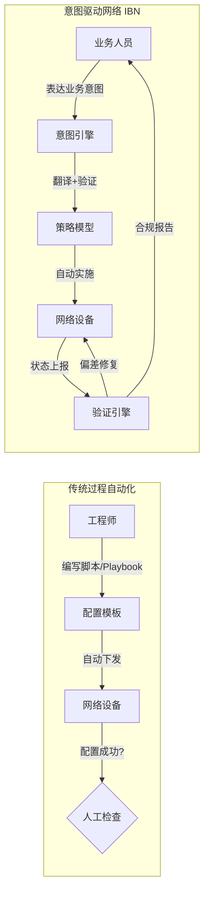
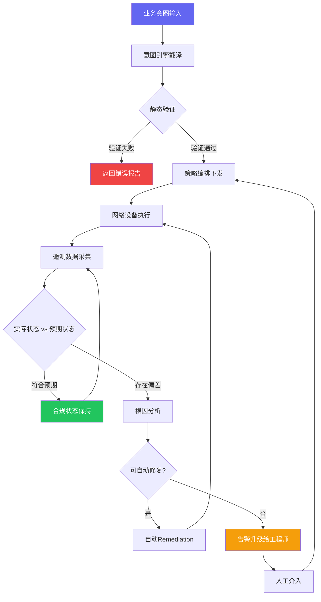
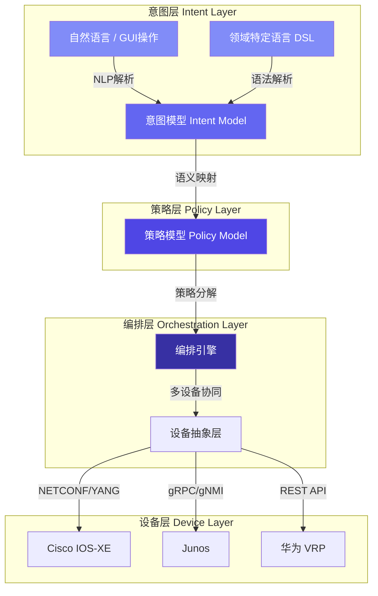
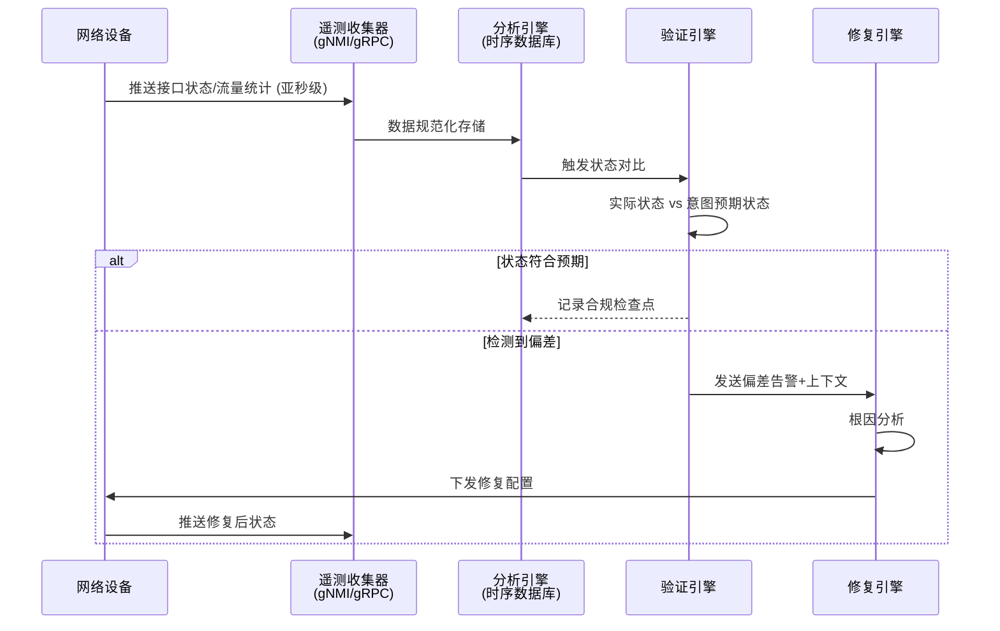
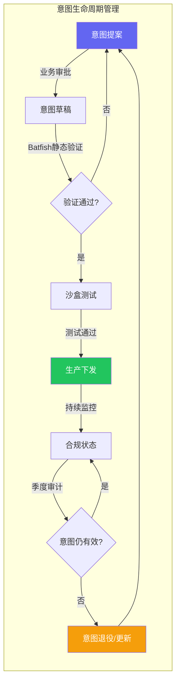

> <Icon name="clipboard-list" color="cyan" /> **前置知识**：[SDN基础](/guide/sdn/fundamentals)、[网络自动化CI/CD](/guide/automation/network-cicd)
> ⏱ **阅读时间**：约16分钟

# 意图驱动网络（IBN）：用业务语言管理网络

一个典型的企业网络变更流程是这样的：业务部门提交工单，说"我们需要让财务系统能访问新上线的ERP"。网络工程师收到需求后，开始手动翻译——判断涉及哪些VLAN、ACL规则如何写、QoS策略如何调、防火墙规则在哪台设备上更改。整个过程平均需要3到5天，出错概率不低，而且没有任何机制验证最终配置是否真正实现了"财务访问ERP"这个目标。

意图驱动网络（Intent-Based Networking，IBN）要解决的正是这个问题：让网络工程师描述**做什么**，而不是**怎么做**。

---

## 一、为什么自动化不等于意图驱动

很多企业已经部署了Ansible Playbook、Terraform模板、Python脚本。这些工具显著降低了重复性配置工作。但它们本质上是**过程自动化（Procedural Automation）**，不是**意图驱动（Intent-Driven）**。

区别在于三点：

| 维度 | 过程自动化 | 意图驱动网络 |
|------|----------|------------|
| 输入语言 | CLI命令、YAML模板 | 业务策略、自然语言 |
| 验证机制 | 配置下发成功即认为完成 | 持续验证网络行为是否符合预期 |
| 偏差处理 | 人工发现、人工修复 | 系统自动检测、自动修复 |
| 知识层次 | 需要网络专家编写模板 | 业务人员可表达需求 |

Gartner在2017年首次定义IBN时，明确指出它必须具备四大核心能力。仅具备自动化部署能力的系统，不能称为真正的IBN。



---

## 二、Gartner定义的IBN四大核心能力

### 2.1 翻译与验证（Translation and Validation）

这是IBN的入口。系统接收业务意图——可以是结构化策略语言、图形界面操作，甚至是自然语言描述——将其翻译为具体的网络策略，并在实施前完成静态验证。

**翻译**负责解析意图语义：
- "研发网段不能访问生产数据库" → ACL规则集合
- "视频会议流量优先转发" → QoS DSCP标记 + 队列策略
- "所有外部访问必须经过代理" → 流量重定向策略

**验证**确保翻译结果不引入冲突：
- 与现有策略是否产生矛盾
- 是否违反安全合规基线
- 是否存在路由可达性问题

::: tip 意图≠配置
IBN系统在翻译阶段不直接生成设备CLI命令，而是生成设备无关的策略模型（Policy Model）。下层的配置生成引擎再将策略模型渲染为各厂商的具体配置。这使得同一意图可以在Cisco、Juniper、华为等不同设备上一致执行。
:::

### 2.2 自动化实施（Automated Implementation）

验证通过后，IBN编排层将策略模型下发到网络设备。关键特征：

- **幂等性（Idempotency）**：多次执行产生相同结果，不累积副作用
- **原子性（Atomicity）**：策略跨多设备下发时，要么全部成功，要么全部回滚
- **多厂商适配**：通过NETCONF/YANG、REST API、gRPC等协议对接异构设备

### 2.3 网络状态感知（Awareness of Network State）

IBN系统必须持续采集网络的实际运行状态，而不仅仅是依赖配置数据。采集维度包括：

- **控制面状态**：BGP邻居关系、OSPF拓扑、路由表
- **数据面状态**：实际流量路径、丢包率、延迟
- **事件流**：接口抖动、设备重启、链路故障

现代IBN系统普遍采用**流式遥测（Streaming Telemetry）**替代传统SNMP轮询，采样间隔可以达到亚秒级，大幅提升异常检测的时效性。

### 2.4 保证与动态优化（Assurance and Dynamic Optimization）

这是IBN与传统自动化最本质的区别：系统在策略实施后，**持续对比预期状态与实际状态**，发现偏差时自动触发修复。



---

## 三、意图翻译技术栈

从业务语言到设备配置，中间经过多个翻译层次。理解这个技术栈，是评估和部署IBN系统的基础。



### 3.1 自然语言处理（NLP）与领域特定语言（DSL）

**NLP路径**适合初级用户快速表达需求，但存在歧义风险。以下是同一需求的不同表达方式，IBN系统需要将其映射到相同的策略模型：

- "财务部门的电脑不能连外网"
- "Finance VLAN禁止Internet访问"
- "将10.10.20.0/24的出口流量丢弃"

**DSL路径**更适合网络工程师使用，提供结构化的意图表达语法。Cisco的IBN平台使用类似SQL的策略描述语言，Juniper Apstra则采用声明式的Intent模板。

示例——Apstra风格的意图描述：

```yaml
intent:
  name: finance-internet-block
  description: 财务网段禁止访问互联网
  targets:
    - source: vrf=FINANCE
      destination: external
  action: deny
  priority: high
  audit:
    owner: security-team
    review_cycle: 90d
```

### 3.2 意图建模（Intent Modeling）

意图模型是IBN系统的核心数据结构，承担两个关键职责：

1. **消歧义**：将模糊的业务描述绑定到精确的网络语义（哪个VRF、哪段IP、哪种协议）
2. **存储预期状态**：意图模型是后续持续验证的基准（Ground Truth）

意图模型的核心属性：

```
IntentModel {
  id: string                    // 唯一标识
  name: string                  // 业务可读名称
  endpoints: Endpoint[]         // 涉及的网络端点
  policy: PolicySpec            // 策略规格（允许/拒绝/QoS/限速）
  constraints: Constraint[]     // 约束条件（时间窗口、流量上限等）
  expected_state: StateSpec     // 预期的可观测网络状态
  audit_trail: AuditRecord[]    // 变更审计链
}
```

### 3.3 策略转化与配置生成

策略模型经过厂商适配层，渲染为具体设备配置。同一策略在不同平台的实现：

| 策略 | Cisco IOS-XE | Juniper JunOS | 华为 VRP |
|------|-------------|---------------|---------|
| 拒绝VLAN间访问 | `ip access-list extended` | `firewall filter` | `acl number` |
| QoS优先级标记 | `policy-map + class-map` | `class-of-service` | `traffic policy` |
| BGP路由策略 | `route-map` | `policy-statement` | `route-policy` |

::: warning 多厂商环境的挑战
策略转化层的质量参差不齐。商业IBN平台（如Cisco DNA Center）对自家设备的支持远优于第三方设备。在异构环境中，需要评估IBN系统对每类设备的覆盖深度，避免出现"核心功能无法下发"的情况。
:::

---

## 四、持续验证闭环（Closed-Loop Verification）

IBN的持续验证分为两个阶段：**变更前的静态验证**和**运行中的动态验证**。

### 4.1 静态验证——Batfish网络分析

[Batfish](https://github.com/batfish/batfish) 是开源的网络配置分析工具，能在不接触真实设备的情况下，对配置进行离线建模和分析。IBN系统在策略下发前，通过Batfish完成：

- **可达性验证**：意图要求的流量路径是否在路由层面可达
- **冲突检测**：新策略与现有ACL/防火墙规则是否产生矛盾
- **一致性检查**：跨设备的策略是否逻辑自洽

```python
# 使用pybatfish进行策略预验证示例
from pybatfish.client.session import Session
from pybatfish.question import bfq

bf = Session(host="batfish-server")
bf.set_network("enterprise-wan")
bf.init_snapshot("configs/", name="pre-change")

# 验证财务VLAN到Internet的可达性（预期：不可达）
result = bfq.reachability(
    pathConstraints=PathConstraints(
        startLocation="finance-vlan",
        endLocation="internet-gateway"
    ),
    actions=["DENY"]
).answer()

print(result.frame())  # 输出验证结果
```

### 4.2 动态验证——实时遥测与闭环

运行时验证依赖流式遥测（Streaming Telemetry）基础设施：



::: tip 遥测订阅路径示例
gNMI订阅路径（OpenConfig格式）：

```
/interfaces/interface[name=GigE0/0]/state/counters
/network-instances/network-instance[name=FINANCE]/protocols/protocol/bgp/neighbors
/qos/interfaces/interface/output/queues/queue/state
```
:::

### 4.3 修复（Remediation）策略

不是所有偏差都适合自动修复。IBN系统通常按风险级别分级处理：

| 偏差类型 | 风险级别 | 处理策略 |
|---------|---------|---------|
| 接口配置被手动覆盖 | 低 | 自动回滚到意图状态 |
| 路由表出现预期外路由 | 中 | 自动修复+告警 |
| ACL规则被删除 | 高 | 告警+暂停流量+等待人工确认 |
| 核心设备配置大幅偏差 | 紧急 | 立即告警+触发变更冻结 |

::: danger 自动修复的边界
自动修复（Auto-Remediation）必须设置严格边界。对于核心路由设备或生产防火墙，建议仅开启**告警模式**，由工程师审批后执行修复。过于激进的自动修复可能将局部故障放大为全网事故。
:::

---

## 五、主流IBN平台对比

### 5.1 Cisco DNA Center / Catalyst Center

Cisco在2017年随同IBN概念一起推出了DNA Center（现更名为Catalyst Center），是目前企业园区网市场最成熟的IBN平台。

**核心能力**：
- **Assurance**模块：基于机器学习的网络状态评分（0-1000分），可视化定位问题
- **Policy**模块：基于用户身份（SGT标签）的微分段策略
- **Automation**模块：Day-0/1/2全生命周期自动化
- **AI Endpoint Analytics**：自动识别接入设备类型和安全风险

**适用场景**：以Cisco设备为主的企业园区网，与Cisco ISE深度集成的零信任架构。

### 5.2 Juniper Apstra

Apstra（2021年被Juniper收购）专注于**数据中心网络**的IBN，支持多厂商环境，是目前数据中心IBN领域技术成熟度最高的商业平台。

**差异化能力**：
- **Graph-based Intent Model**：将整个数据中心网络建模为图结构，意图基于图约束表达
- **Time Voyager**：任意时刻的历史状态回溯，快速定位变更引入的问题
- **Multi-vendor by Design**：原生支持Juniper、Cisco、Arista、SONiC等

**适用场景**：大规模数据中心（Spine-Leaf架构），有多厂商设备混用需求的场景。

### 5.3 Forward Networks

Forward Networks走的是**网络数字孪生（Network Digital Twin）**路径，在不接触设备控制面的情况下，通过采集配置和状态数据，在软件中构建精确的网络数学模型。

**核心价值**：
- 任意两点间的可达性数学证明
- 变更前的全网影响分析
- 安全合规策略的全网验证

::: tip Forward Networks的定位
Forward Networks本身不做配置下发，它是IBN工具链中的**验证层**。很多企业将其与Ansible或Terraform组合使用：Ansible负责执行，Forward Networks负责验证结果是否符合业务意图。
:::

### 5.4 平台能力对比

```mermaid
quadrantChart
    title IBN平台能力定位
    x-axis 多厂商支持弱 --> 多厂商支持强
    y-axis 验证能力弱 --> 验证能力强
    quadrant-1 全能型
    quadrant-2 验证专家
    quadrant-3 有限场景
    quadrant-4 单厂商强
    Forward Networks: [0.85, 0.95]
    Juniper Apstra: [0.80, 0.80]
    Cisco DNA Center: [0.25, 0.70]
    Batfish (开源): [0.90, 0.60]
```

| 平台 | 适用场景 | 多厂商 | 自动修复 | 开放性 | 典型价位 |
|------|---------|--------|---------|--------|---------|
| Cisco Catalyst Center | 企业园区 | 有限 | 支持 | 中 | 高 |
| Juniper Apstra | 数据中心 | 强 | 支持 | 高 | 高 |
| Forward Networks | 验证/合规 | 强 | 不支持 | 高 | 中 |
| 开源（Batfish+AWX） | 自建 | 强 | 需定制 | 最高 | 低 |

---

## 六、AI/LLM在IBN中的角色

大型语言模型（Large Language Model，LLM）的出现，正在重塑IBN的意图翻译层。

### 6.1 自然语言意图理解

传统IBN系统对自然语言的支持依赖固定的规则解析器，表达方式稍有偏差就无法识别。GPT类模型的加入，使系统能理解更灵活的描述：

```
用户输入：
"把从分支机构到总部SAP系统的流量，在上班时间保证至少10Mbps带宽，
其他时间限制在2Mbps，周末全部切到备用MPLS链路"

LLM解析输出（JSON意图模型）：
{
  "policy_type": "bandwidth_guarantee",
  "source": "branch-offices",
  "destination": "hq-sap-system",
  "schedules": [
    {
      "condition": "weekday-business-hours",
      "min_bandwidth_mbps": 10,
      "primary_path": "main-mpls"
    },
    {
      "condition": "weekday-off-hours",
      "max_bandwidth_mbps": 2,
      "primary_path": "main-mpls"
    },
    {
      "condition": "weekend",
      "primary_path": "backup-mpls"
    }
  ]
}
```

### 6.2 异常根因分析

当遥测数据显示网络偏差时，LLM能结合历史变更记录、当前告警、拓扑上下文，生成人类可读的根因分析报告，大幅降低MTTR（Mean Time To Resolve）。

Cisco Catalyst Center的AI Network Analytics已部分具备这种能力：系统不只告诉工程师"有问题"，而是说明"此次无线客户端连接失败，可能由3小时前推送的RADIUS策略变更引起，受影响设备为AP-B3-07到AP-B3-12"。

### 6.3 预测性网络优化

通过分析历史遥测数据，AI模型可以：
- **提前预测**容量瓶颈（如每周一早9点的会议流量高峰）
- **主动建议**策略调整（如提前扩展BGP路由聚合）
- **评估风险**：在计划变更前，预测该变更在当前网络负载下的影响

::: warning LLM集成的风险
LLM在意图解析中引入了不确定性。一个表述不清的指令经过LLM解析后，可能生成语义正确但业务上错误的策略。**所有LLM生成的意图模型，在下发前必须经过人工确认或严格的自动化测试验证**，不能直接进入生产网络。
:::

---

## 七、企业实施IBN的挑战与应对

### 7.1 意图歧义性

业务人员的需求描述往往不精确。"重要系统需要高优先级"——什么叫重要？高优先级对应哪个DSCP值？这种歧义如果不在翻译阶段消除，会导致策略与预期不符。

**应对**：
- 建立企业级意图词汇表（Ontology），规范化业务术语与网络参数的映射关系
- 所有意图在确认前，向业务人员展示"这条策略实际会做什么"的业务语言解释
- 对关键策略强制要求场景测试用例

### 7.2 多厂商环境下的一致性

一个典型企业WAN环境可能同时存在Cisco路由器、Juniper防火墙、华为交换机、Fortinet VPN网关。没有任何商业IBN平台能完美覆盖所有厂商。

**应对**：
- 分域实施：园区网用DNA Center，数据中心用Apstra，WAN用手动+Batfish验证
- 在选型阶段，要求厂商提供具体设备型号的功能覆盖矩阵（Feature Coverage Matrix）
- 对IBN平台不支持的设备，保留传统自动化工具（Ansible）作为补充，验证层统一使用Forward Networks或Batfish

### 7.3 变更验证的覆盖率

IBN保证的是"意图被正确实施"，但无法保证"意图本身是正确的"。一个错误的业务意图，会被系统高效、准确地执行错误。

**应对**：
- 建立**意图测试框架**：每个意图对应一组行为验证用例（类比软件单元测试）
- 部署沙盒环境（Network Sandbox）：意图先在仿真环境验证，再推送生产
- 定期进行**意图审计**：检查当前活跃的意图集合是否与业务需求仍然一致



---

## 八、从传统自动化向IBN演进的路径

完整的IBN不需要一步到位。对于大多数企业，一个务实的演进路径是：

**阶段一：自动化基础（6-12个月）**
- 统一配置管理：GitOps模式管理网络配置
- 部署Ansible AWX/Tower，标准化变更流程
- 建立IPAM/CMDB，确保资产数据可信

**阶段二：验证能力建设（6-12个月）**
- 部署Batfish，实现变更前的静态验证
- 接入流式遥测（gNMI），建立网络可观测性基础设施
- 建立网络行为基准线（Baseline）

**阶段三：IBN试点（12-18个月）**
- 选择一个控制域（园区网或数据中心）部署商业IBN平台
- 从低风险策略开始：接入控制策略、QoS模板
- 逐步扩大自动修复范围，积累闭环运营经验

**阶段四：全域扩展（持续演进）**
- 建立跨域意图协调机制
- 集成AI根因分析能力
- 推动业务系统与IBN API直接集成（NetOps as Code）

---

## 核心要点回顾

- **IBN ≠ 自动化**：自动化解决"如何做"，IBN解决"做什么"与"是否做对了"
- **四大支柱**：翻译验证 → 自动实施 → 状态感知 → 保证优化，缺一不可
- **闭环是关键**：没有持续验证和自动修复能力的系统，不是真正的IBN
- **LLM是加速器**：降低了意图表达门槛，但不能绕过验证流程
- **渐进实施**：先建自动化基础和验证能力，再引入IBN平台，避免在沙堆上建大厦
- **多厂商现实**：没有完美的全覆盖平台，分域实施+统一验证层是务实选择

::: tip 下一步
理解IBN的运作机制后，推荐深入了解支撑IBN状态感知的基础设施：[网络监控与可观测性](/guide/ops/network-monitoring) 和 [流量分析与报文捕获](/guide/ops/packet-analysis)。
:::
