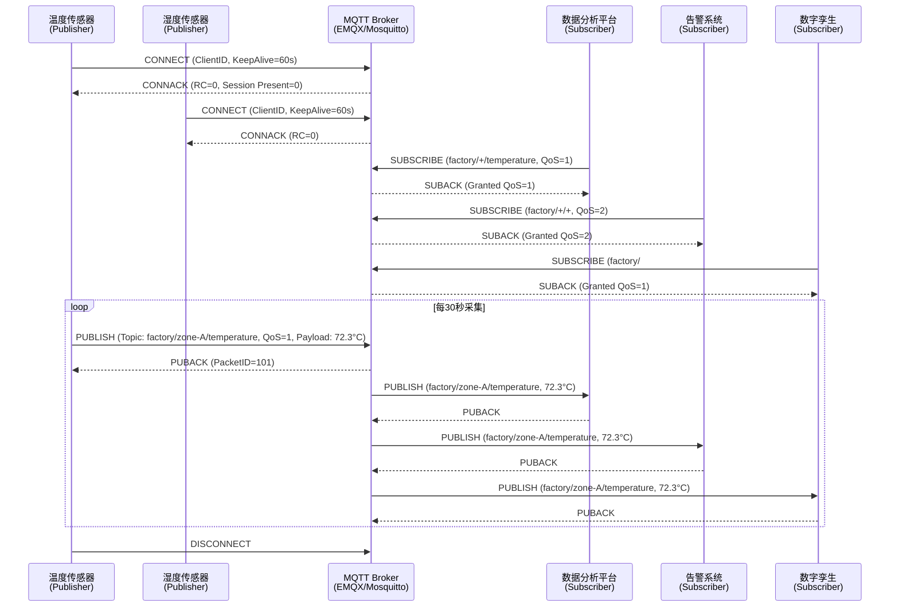
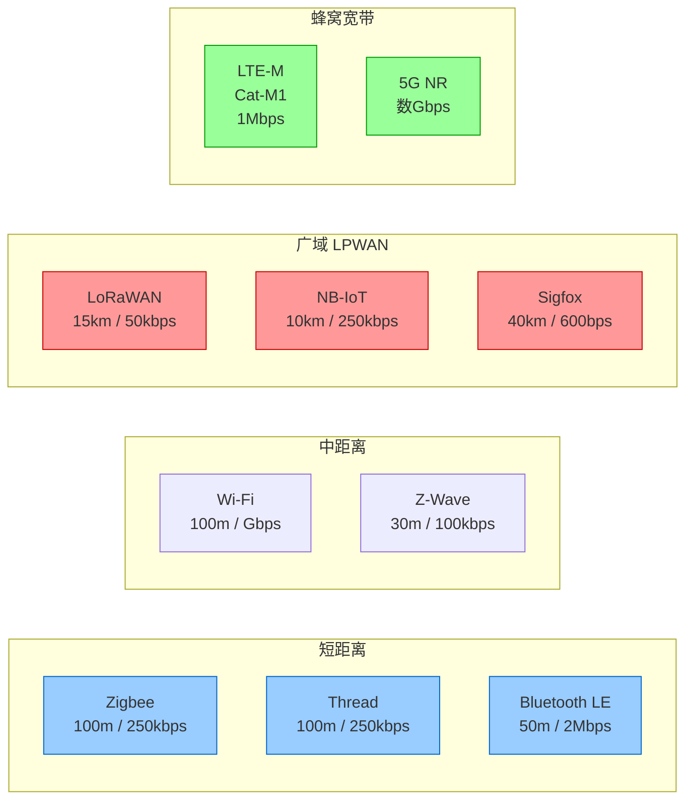
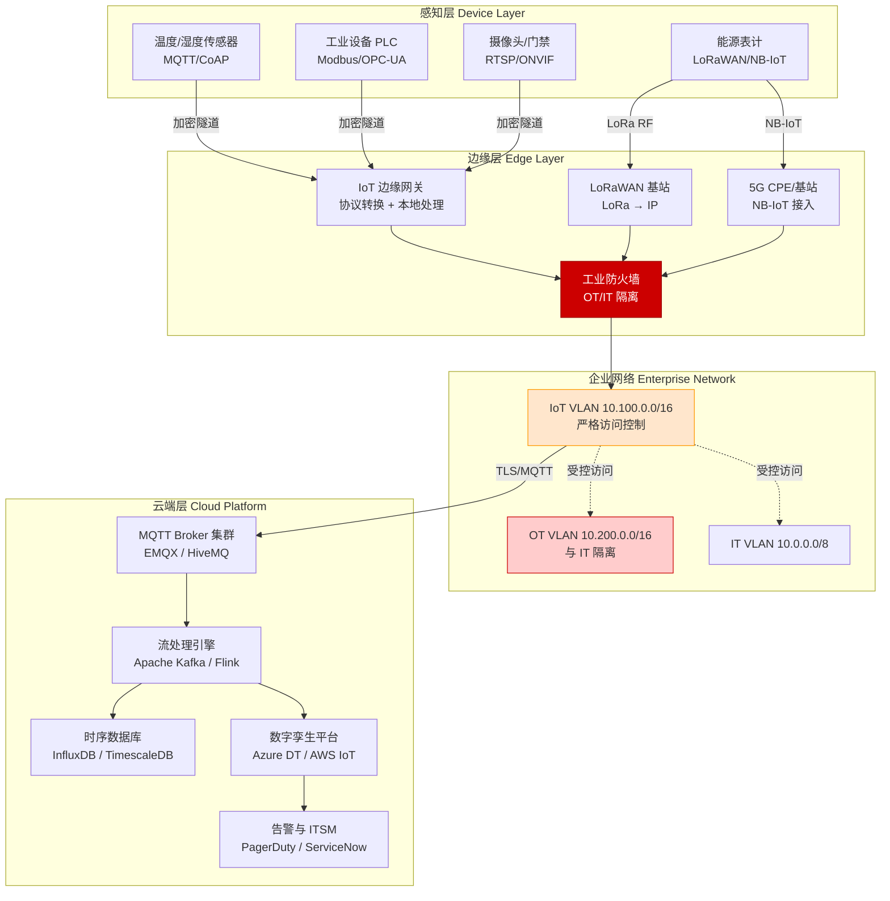
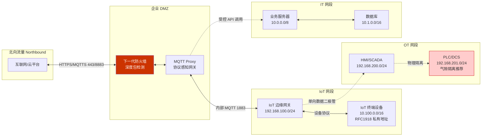
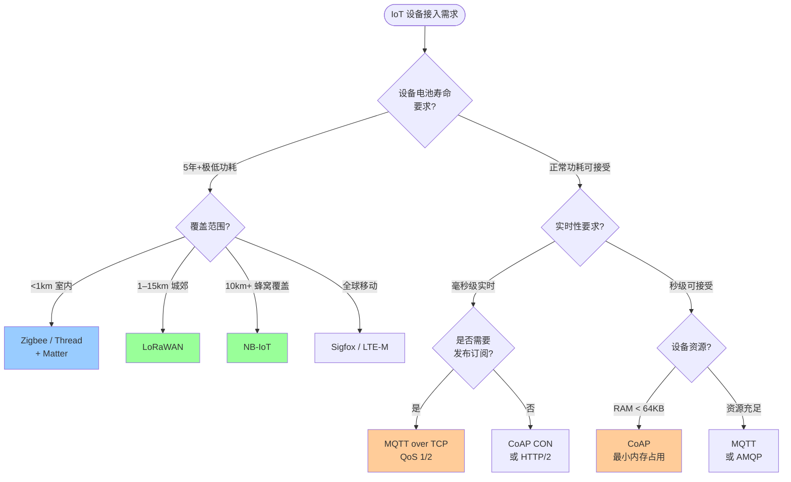

> 📋 **前置知识**：[5G核心网](/guide/emerging/5g-networking)、[网络基础](/guide/basics/osi)
> ⏱️ **阅读时间**：约18分钟

# IoT网络协议：MQTT、CoAP与Matter标准

物联网（Internet of Things，IoT）正在重塑企业基础设施的边界。从工厂车间的振动传感器，到医院的实时监护设备，再到智慧城市的百万量级终端节点，IoT网络规模已远超传统IT架构的设计假设。与通用互联网不同，IoT场景对协议提出了截然不同的约束：极低功耗、超大连接密度、不可靠的无线链路，以及从 8 位微控制器到云端平台的跨越式资源差异。

本文从**协议设计哲学**出发，系统梳理MQTT、CoAP、Matter三大主流协议，并深入探讨LoRaWAN、NB-IoT等低功耗广域网（LPWAN）技术，最终给出企业IoT网络架构的落地参考。

---

## 第一层：IoT网络的特殊挑战

### 资源约束（Resource Constraints）

工业传感器、环境监测节点往往运行在 Cortex-M0 级别的微控制器上，典型配置为：

- **CPU**：48 MHz，无浮点单元（FPU）
- **RAM**：16–64 KB
- **Flash**：128–512 KB
- **电池**：CR2032 纽扣电池，目标使用寿命 5–10 年

在这种硬件条件下，TLS 握手的几十 KB 证书缓冲区、HTTP 头部的数百字节开销，都是不可接受的奢侈。协议必须在**代码体积、运行时内存和网络带宽**三个维度同时压缩。

### 大规模机器类通信（mMTC）

5G 定义的 mMTC（massive Machine-Type Communications）场景要求单基站支持百万级连接。此时，TCP 的三次握手、HTTP 的长头部、TLS 的握手延迟，都会在规模化部署时成为系统瓶颈。协议需要具备：

- **连接多路复用**：单个 Broker 节点支撑数十万并发设备
- **轻量心跳**：最小化保活（Keep-Alive）开销
- **批量操作**：聚合小包，降低每条消息的固定成本

### 不可靠网络（Unreliable Networks）

工业 Wi-Fi、Zigbee、LoRa 等无线链路的丢包率远高于有线以太网。协议必须内置**消息可靠性机制**，而非依赖 TCP 的端到端重传——因为低功耗设备往往采用 UDP 或单跳无线，无法承担 TCP 的连接状态开销。

### 安全性（Security at Scale）

IoT 设备的攻击面极广：固件更新通道、弱默认凭据、明文协议、物理访问。企业 IoT 网络需要在**设备认证、通信加密、访问控制**三个层面建立系统性防御，同时兼顾资源受限设备的计算能力边界。

::: warning 安全盲区
大量工业 IoT 设备至今仍使用明文 MQTT，原因是"节省功耗"。这是企业 IoT 网络中最常见的安全债务来源。建议在网关层强制终止 TLS，设备到网关段采用轻量认证，而非完全绕过加密。
:::

---

## 第二层：MQTT——发布/订阅的工业级标准

### 协议设计哲学

MQTT（Message Queuing Telemetry Transport）由 IBM 的 Andy Stanford-Clark 和 Arcom 的 Arlen Nipper 于 1999 年设计，最初用于卫星链路的油管监控。其核心设计原则：

1. **解耦**：发布者（Publisher）和订阅者（Subscriber）互不感知
2. **异步**：消息经由 Broker 中转，无需双方同时在线
3. **轻量**：最小固定头部仅 2 字节

### 发布/订阅架构

MQTT 的核心是**消息代理（Broker）**，所有设备只与 Broker 通信，形成星形拓扑。



### Topic 层级设计

MQTT Topic 采用斜杠分隔的层级结构，支持两种通配符：

| 通配符 | 语法 | 含义 | 示例 |
|--------|------|------|------|
| 单层通配 | `+` | 匹配单个层级 | `factory/+/temperature` 匹配 `factory/zone-A/temperature` |
| 多层通配 | `#` | 匹配剩余所有层级 | `factory/#` 匹配所有工厂主题 |

**推荐的企业 Topic 命名规范**：

```
{tenant}/{site}/{building}/{floor}/{device-type}/{device-id}/{metric}

示例：
acme/shanghai/hq/b2f3/hvac/unit-007/temperature
acme/shanghai/hq/b2f3/hvac/unit-007/status
acme/+/+/+/hvac/+/temperature   ← 订阅所有站点温度
```

::: tip Topic 设计原则
- 避免使用 `$` 开头的 Topic（系统保留）
- 层级不超过 7 层，超过后 Broker 路由效率显著下降
- 设备 ID 使用全局唯一标识（UUID 或设备序列号），避免冲突
- 敏感标识符（如具体地理位置）不应出现在 Topic 中，防止信息泄露
:::

### QoS 三级模型

```
QoS 0 — At Most Once（最多一次）
  发布者 ──PUBLISH──→ Broker  （无确认，可能丢失）

QoS 1 — At Least Once（至少一次）
  发布者 ──PUBLISH──→ Broker
  发布者 ←──PUBACK── Broker  （确认，可能重复）

QoS 2 — Exactly Once（恰好一次）
  发布者 ──PUBLISH──→ Broker
  发布者 ←──PUBREC── Broker
  发布者 ──PUBREL──→ Broker
  发布者 ←──PUBCOMP─ Broker  （四次握手，无重复）
```

| QoS 级别 | 消息保证 | 适用场景 | 开销 |
|----------|----------|----------|------|
| QoS 0 | 最多一次，可能丢失 | 高频遥测（温湿度，每秒多次） | 最低 |
| QoS 1 | 至少一次，可能重复 | 事件告警、状态上报 | 中等 |
| QoS 2 | 恰好一次，精确投递 | 计费数据、控制指令 | 最高 |

### MQTT 5.0 关键新特性

MQTT 3.1.1 是当前最广泛部署的版本，但 MQTT 5.0（2019 年发布）引入了企业场景急需的功能：

- **消息过期时间（Message Expiry Interval）**：防止离线设备上线后收到大量过期消息
- **原因码（Reason Codes）**：细化错误语义，从 1 个字节扩展到更丰富的错误描述
- **用户属性（User Properties）**：在消息头部携带自定义键值对，无需修改 Payload
- **共享订阅（Shared Subscriptions）**：`$share/{group}/{topic}` 实现消费者组负载均衡
- **主题别名（Topic Alias）**：用整数替代长 Topic 字符串，节省带宽
- **请求/响应模式（Request/Response）**：通过 `Response Topic` 和 `Correlation Data` 实现同步请求语义

### 会话持久化（Persistent Session）

当设备断线重连时，Broker 可保留其订阅关系和未投递的 QoS 1/2 消息：

```
CONNECT → CleanSession=0（请求持久会话）
Broker 保存：订阅列表 + 未投递消息队列
设备离线期间 → Broker 缓存所有匹配消息
设备重连 → CONNACK.SessionPresent=1 → 恢复会话
```

::: warning 会话存储成本
持久会话在 Broker 侧消耗存储资源。百万设备规模下，每个设备保留 1000 条消息的积压，总存储需求可达数百 GB。需配置 `max-queued-messages` 上限，并定期清理长期离线设备的"僵尸会话"。
:::

### MQTT 安全：TLS/SSL + 认证

```
设备认证层次（推荐三层）：
1. TLS 双向认证（mTLS）
   设备证书 ←→ Broker 证书
   CA 签发设备证书，每设备唯一

2. MQTT 层用户名/密码（作为补充）
   username: device-uuid
   password: HMAC-SHA256(device-secret, timestamp)

3. 授权（ACL）
   设备只能 PUBLISH 到自己的 Topic
   SUBSCRIBE 范围受 ACL 约束
```

### Broker 选型对比

| Broker | 许可证 | 最大并发连接 | 集群支持 | 特点 |
|--------|--------|-------------|----------|------|
| **Mosquitto** | EPL-2.0 | ~10 万 | 有限（桥接模式） | 轻量，嵌入式首选 |
| **EMQX** | Apache 2.0 / 商业 | 1000 万+ | 原生分布式 | 企业级，规则引擎强大 |
| **HiveMQ** | 商业 / 社区版 | 数百万 | 原生集群 | 企业合规，金融/工业首选 |
| **VerneMQ** | Apache 2.0 | 数百万 | Erlang/OTP 分布式 | 高可用，运维复杂度较高 |

---

## 第三层：CoAP——UDP 承载的轻量 REST

### 设计动机

CoAP（Constrained Application Protocol）由 IETF RFC 7252 定义，专为**8 位/16 位微控制器**和**低速无线网络**设计。其核心思路是：在 UDP 上复刻 HTTP 的 REST 语义，同时将开销压缩至极致。

**与 HTTP 的关键对比**：

| 特性 | HTTP/1.1 | CoAP |
|------|----------|------|
| 传输层 | TCP | UDP |
| 头部大小 | 数百字节 | 4 字节固定头 |
| 方法 | GET/POST/PUT/DELETE/... | GET/POST/PUT/DELETE |
| 状态码 | 100–599 | 类似但编码为 4位 |
| 内容协商 | 支持 | 支持（Option） |
| 连接状态 | 有状态 | 无状态 |
| 典型场景 | Web API | 传感器读取/控制 |

### CoAP 消息类型与可靠性

CoAP 在 UDP 上实现了简单的可靠传输机制：

```
CON（Confirmable）：需要 ACK 确认，超时重传
NON（Non-confirmable）：即发即忘，类似 MQTT QoS 0
ACK（Acknowledgement）：对 CON 消息的确认
RST（Reset）：拒绝消息
```

**CON 消息的确认流程**：

```
Client          Server
  |──CON GET /sensors/temp──→|
  |←──────────ACK 2.05 ──────|  （含 Payload）
```

若 Server 响应延迟，也可先发空 ACK，再发 CON 响应（称为"分离响应"）：

```
Client          Server
  |──CON GET /sensors/temp──→|
  |←────────Empty ACK ────────|  （立即确认，防止重传）
  |←──CON 2.05 (payload) ────|  （延迟响应）
  |──────────────ACK ────────→|
```

### Observe 机制——订阅资源变化

CoAP 的 Observe 扩展（RFC 7641）实现了类似 MQTT 订阅的推送效果：

```
Client 注册观察：
  GET /sensors/temperature  [Observe: 0]

Server 确认：
  2.05 Content [Observe: 1234] temperature=22.3°C

每次资源变化，Server 主动推送：
  2.05 Content [Observe: 1235] temperature=22.7°C
  2.05 Content [Observe: 1236] temperature=23.1°C

Client 取消观察：
  GET /sensors/temperature  [Observe: 1]  （Observe=1 表示取消）
```

### CoAP vs MQTT 选型指南

| 维度 | MQTT | CoAP |
|------|------|------|
| **网络** | TCP（需要稳定连接） | UDP（适合不稳定链路） |
| **消息模型** | 发布/订阅（一对多） | 请求/响应（一对一，含 Observe） |
| **Broker 依赖** | 必须有中心 Broker | 无需中间节点（P2P 可行） |
| **推送** | 天然支持 | 需要 Observe 扩展 |
| **安全** | TLS | DTLS（UDP 上的 TLS） |
| **适用场景** | 遥测数据流、事件驱动 | 设备控制、资源读取 |

::: tip 混合架构
企业 IoT 实践中，MQTT 和 CoAP 并不互斥。常见模式：设备侧使用 CoAP 与本地边缘网关通信（节省资源），网关使用 MQTT 将聚合数据上报云平台（利用 Broker 的扇出能力）。
:::

---

## 第四层：Matter 与 LPWAN

### Matter——统一智能家居的终结者

Matter（原 Project CHIP，Connected Home over IP）由苹果、谷歌、亚马逊、三星等共同主导，通过 Connectivity Standards Alliance（CSA）于 2022 年发布 1.0 版本。其核心目标：**消除智能家居生态碎片化**。

**Matter 的协议栈**：

```
┌─────────────────────────────────────────────────────┐
│                  应用层（Matter Application）          │
│         设备类型模型（灯具/开关/传感器/门锁/...）         │
├─────────────────────────────────────────────────────┤
│              Matter 数据模型与交互模型                  │
│         属性（Attributes）/ 命令（Commands）            │
├─────────────────────────────────────────────────────┤
│                   安全层（CASE/PASE）                  │
│        设备认证（DAC）/ 会话加密（AES-CCM 128）          │
├────────────────────┬────────────────────────────────┤
│    Thread（802.15.4）│      Wi-Fi / Ethernet          │
│  低功耗网格网络      │      高带宽媒体设备              │
└────────────────────┴────────────────────────────────┘
```

**Thread**：Matter 为低功耗设备选择 Thread 作为网络层。Thread 是基于 IEEE 802.15.4 的 IPv6 网格网络，无单点故障，设备互为路由节点。Thread Border Router（通常是智能音箱或家庭网关）负责连接 Thread 网络与 Wi-Fi/以太网。

**Matter 的设备配网（Commissioning）**流程：

```
1. 新设备广播 BLE 信标（含设备配网信息）
2. Commissioner（如手机 App）扫描到设备
3. PASE（Passcode-Authenticated Session Establishment）建立安全通道
4. Commissioner 验证设备证书（DAC → PAI → PAA 证书链）
5. Commissioner 将 Wi-Fi/Thread 网络凭证注入设备
6. 设备加入目标网络
7. 通过 CASE 建立正式操作会话
```

::: tip Matter 的企业意义
Matter 降低了企业楼宇自动化（Building Automation）的供应商锁定风险。兼容 Matter 的设备可被任意 Matter 控制器管理，打破了 KNX、BACnet、Zigbee 各自为政的局面。
:::

### LPWAN：低功耗广域网协议对比



**LPWAN 详细对比**：

| 协议 | 频段 | 覆盖范围 | 速率 | 功耗 | 延迟 | 成本 | 适用场景 |
|------|------|----------|------|------|------|------|----------|
| **LoRaWAN** | 非授权（ISM） | 城郊 15km | 0.3–50 kbps | 极低（10年+电池） | 秒级 | 低 | 农业、环保监测、资产追踪 |
| **NB-IoT** | 授权（蜂窝） | 10km+ | 20–250 kbps | 低（5–10年电池） | 秒级 | 中（SIM卡费用） | 智能表计、城市基础设施 |
| **Sigfox** | 非授权（ISM） | 40km | 100 bps | 极低 | 分钟级 | 低 | 超低频遥测、资产追踪 |
| **LTE-M** | 授权（蜂窝） | 蜂窝覆盖 | 1 Mbps | 中等 | 毫秒级 | 中高 | 可移动资产、语音+数据 |

**LoRaWAN 网络架构**：

```
终端节点                网关                  网络服务器           应用服务器
[传感器] ──LoRa无线──→ [LoRa Gateway] ──IP──→ [TTN/ChirpStack] ──→ [业务系统]
[传感器] ──LoRa无线──→ [LoRa Gateway]
                        （多网关接收同一包）
```

LoRaWAN 采用**星形拓扑**，终端节点直连网关，网关通过以太网或蜂窝回传至网络服务器。支持自适应数据速率（ADR），根据信号质量动态调整扩频因子（SF7–SF12）：SF 越高，传输距离越远，速率越低。

---

## 第五层：企业 IoT 网络架构

### 分层架构设计

企业 IoT 网络通常采用三层架构：**感知层 → 边缘层 → 云端层**。



### IoT 网络隔离策略



### OT 与 IT 融合安全（Purdue 模型）

工业控制系统传统上遵循 **Purdue 模型**（IEC 62443 标准的参考架构），将网络分为 0–5 级：

```
Level 5：企业网络（ERP、邮件、互联网）
Level 4：工厂信息系统（MES、历史数据库）
─────────────── 工业 DMZ（Demilitarized Zone）───────────────
Level 3：站点控制（SCADA、工程师站）
Level 2：区域控制（HMI、实时服务器）
Level 1：基本控制（PLC、DCS）
Level 0：物理过程（传感器、执行器）
```

随着 IoT 设备大量接入，**Level 3.5**（工业 DMZ）的建设至关重要：

- **单向安全网关（Data Diode）**：只允许数据从 OT 流向 IT，物理层面防止逆向攻击
- **协议白名单**：工业防火墙仅允许特定 Modbus/OPC-UA 功能码，拒绝所有未知流量
- **时间敏感网络（TSN）**：确保关键控制流量的实时性，防止 IoT 数据洪泛影响控制回路

::: danger 关键安全警告
将工业控制网络（Level 0–2）与企业 IT 网络直接连通，是工业安全事故的主要根源之一。**绝对不要**将 PLC 暴露在企业 VLAN 中，即使是"临时调试"目的。Triton/TRISIS 等工业恶意软件的传播路径正是从 IT 网络横向渗透到 OT 网络。
:::

### 协议选型决策树



---

## 生产实践与常见陷阱

### MQTT 性能调优

**Broker 侧优化**（以 EMQX 为例）：

```bash
# emqx.conf 关键参数
node.process_limit = 2048000       # Erlang 进程上限
node.max_ports = 1048576           # 文件描述符上限

listener.tcp.external.acceptors = 64   # TCP 接受者线程数
listener.tcp.external.max_connections = 1000000

# 消息队列（避免慢消费者拖垮 Broker）
mqtt.max_mqueue_len = 1000
mqtt.mqueue_store_qos0 = false     # QoS 0 不入队，降低内存压力

# 会话过期
mqtt.session_expiry_interval = 7200  # 2小时，平衡持久化与存储
```

**客户端侧最佳实践**：

```python
import paho.mqtt.client as mqtt
import ssl
import time

def create_resilient_client(broker, port, client_id, cert_path):
    client = mqtt.Client(
        client_id=client_id,
        protocol=mqtt.MQTTv5,
        clean_session=False  # 持久会话
    )

    # mTLS 双向认证
    client.tls_set(
        ca_certs=f"{cert_path}/ca.crt",
        certfile=f"{cert_path}/device.crt",
        keyfile=f"{cert_path}/device.key",
        tls_version=ssl.PROTOCOL_TLS_CLIENT
    )

    # 遗嘱消息（LWT）：设备异常下线时自动发布
    client.will_set(
        topic=f"devices/{client_id}/status",
        payload='{"online": false, "reason": "unexpected_disconnect"}',
        qos=1,
        retain=True  # 保留消息，新订阅者可立即获取最新状态
    )

    # 指数退避重连
    client.reconnect_delay_set(min_delay=1, max_delay=120)
    return client
```

### MQTT 消息格式：JSON vs Protobuf vs CBOR

| 格式 | 编码大小 | 解析速度 | 可读性 | IoT 适用性 |
|------|----------|----------|--------|------------|
| JSON | 基准（100%） | 慢 | 高 | 调试友好，生产不建议 |
| Protocol Buffers | 30–50% | 快 | 低 | 需要 Schema 管理，适合中大型设备 |
| CBOR | 50–70% | 中等 | 中 | 无需预编译 Schema，嵌入式友好 |
| MessagePack | 40–60% | 快 | 低 | 与 JSON 结构兼容，迁移成本低 |

::: tip 实践建议
对于 RAM < 64KB 的设备，优先选择 CBOR 或 MessagePack——无需代码生成工具链，解析库体积小于 10KB，且压缩比接近 Protobuf。MQTT Payload 格式建议在 Topic 中携带内容类型提示（如 `/sensors/temp/cbor`），方便消费端自动选择解析器。
:::

---

## 总结：IoT 协议选型矩阵

| 维度 | MQTT | CoAP | Matter | LoRaWAN | NB-IoT |
|------|------|------|--------|---------|--------|
| **传输层** | TCP | UDP | Thread/Wi-Fi | LoRa RF | 蜂窝（LTE） |
| **消息模型** | 发布/订阅 | 请求/响应 | 属性/命令 | 上行为主 | 双向 |
| **资源需求** | 中等 | 极低 | 中等 | 极低 | 低 |
| **安全机制** | TLS | DTLS | CASE/PASE+证书 | 网络/应用双密钥 | LTE 内置 |
| **覆盖距离** | 依赖 IP 网络 | 依赖 IP 网络 | 100m | 15km | 10km+ |
| **标准化程度** | OASIS MQTT 5.0 | IETF RFC 7252 | CSA 1.3 | LoRa Alliance | 3GPP |
| **企业成熟度** | ★★★★★ | ★★★☆☆ | ★★★★☆ | ★★★☆☆ | ★★★★☆ |

物联网协议的选型没有银弹。企业应从**设备资源约束、网络覆盖、消息模式、安全合规和运营成本**五个维度综合评估。在多协议共存的混合架构中，边缘网关承担协议翻译和安全终结的双重职责，是 IoT 网络安全与效率的关键枢纽。

随着 Matter 生态日趋成熟、NB-IoT 在 5G RedCap 演进中的持续增强，以及 MQTT 5.0 在企业级 Broker 中的全面落地，IoT 协议生态正在从碎片化走向有序融合。把握这一趋势，是企业构建面向未来的 IoT 基础设施的核心能力。

---

*延伸阅读：[SD-WAN 架构](/guide/sdwan/architecture) | [网络安全架构](/guide/attacks/security-arch) | [边缘计算与容器网络](/guide/cloud/container-networking)*
