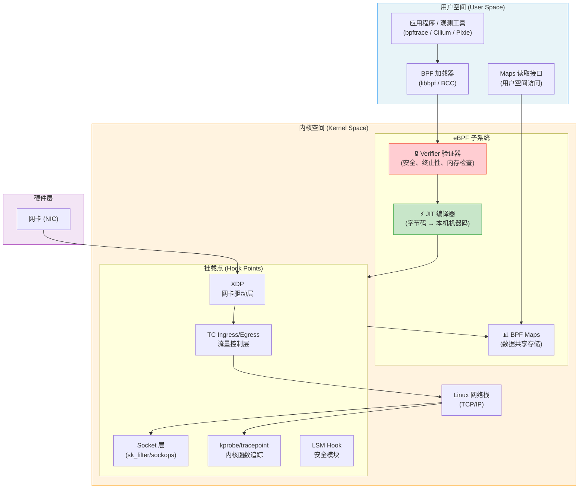
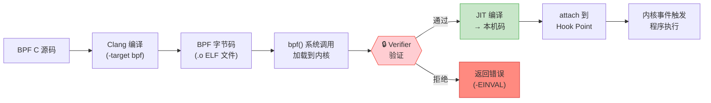
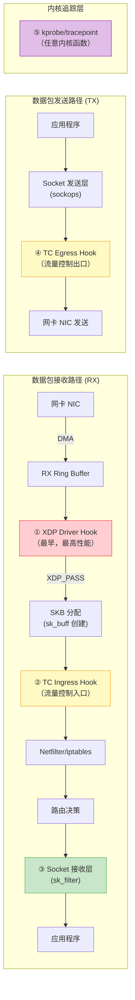
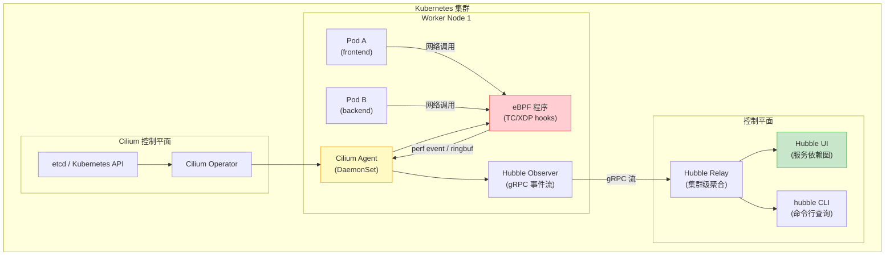
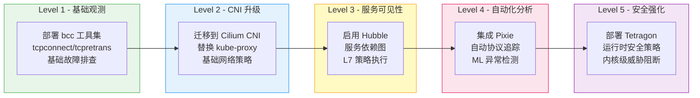

> 📋 **前置知识**：[Kubernetes网络](/guide/cloud/kubernetes-networking)、[网络监控](/guide/ops/monitoring)
> ⏱️ **阅读时间**：约18分钟

# eBPF网络可观测性：内核级流量洞察

传统的网络观测工具（tcpdump、netstat、strace）通过系统调用在用户空间工作，每次捕获数据包都需要内核与用户空间之间的数据拷贝，性能开销显著。**eBPF（extended Berkeley Packet Filter，扩展伯克利包过滤器）** 彻底改变了这一局面——它允许工程师将经过验证的安全程序直接注入内核，在数据包到达网络栈之前就完成分析、过滤和修改，实现**零侵入、零拷贝、可编程**的内核级网络观测。

## 第一层：eBPF革命——为什么这项技术如此重要

### 传统观测的困境

在容器化、微服务架构盛行的今天，一个生产集群可能运行数百个服务，每秒产生数百万次网络调用。传统工具面临三大挑战：

- **性能瓶颈**：tcpdump 每捕获一个包就需要一次内核→用户空间的内存拷贝
- **侵入性**：在应用程序中插入 sidecar（如 Istio Envoy）引入 1-2ms 的额外延迟
- **可见性盲区**：无法观测内核网络栈内部发生的事情（TCP 重传、连接跟踪等）

### eBPF 的承诺

eBPF 在**内核空间**安全运行用户定义的程序，具备以下特性：

| 特性 | 传统工具 | eBPF |
|------|----------|------|
| 执行位置 | 用户空间 | 内核空间 |
| 数据拷贝 | 必须 | 零拷贝（Maps 共享） |
| 应用修改 | 通常需要 | 不需要 |
| 内核重编译 | 不需要 | 不需要 |
| 安全验证 | 无 | Verifier 强制验证 |
| 协议支持 | 有限 | 任意内核协议栈 |

::: tip eBPF 的起源
原始 BPF（Berkeley Packet Filter）由 Steven McCanne 和 Van Jacobson 于 1992 年提出，用于 tcpdump 的包过滤。Linux 3.18（2014年）引入 eBPF，将其扩展为通用内核执行引擎。Meta、Google、Netflix、Cloudflare 均大规模使用 eBPF 构建网络基础设施。
:::

---

## 第二层：eBPF技术架构深度解析

### 整体架构分层



### BPF虚拟机（BPF VM）

eBPF 程序在一个沙箱虚拟机中运行，其指令集专为内核安全执行设计：

**寄存器集合（Registers）**：
- `R0`：返回值寄存器（程序结果）
- `R1-R5`：函数参数传递
- `R6-R9`：被调用者保存寄存器
- `R10`：只读帧指针（栈访问）

**核心指令类别**：
```
ALU 指令：  add, sub, mul, div, and, or, xor, lsh, rsh
跳转指令：  jeq, jne, jlt, jgt, jle, jge（有界循环）
内存操作：  ldx, stx（通过 helper 函数访问内核内存）
调用指令：  call（调用 BPF helper 函数）
```

::: warning 内存访问限制
eBPF 程序不能直接访问任意内核内存指针。必须使用 `bpf_probe_read_kernel()` 等 helper 函数安全读取，否则 Verifier 会拒绝加载。
:::

### Verifier验证器——安全的核心

Verifier 在程序加载时（非运行时）进行静态分析，检查：

1. **可达性分析**：所有指令必须可达，无死代码
2. **有界性验证**：循环必须有明确上界（防止内核挂起）
3. **内存安全**：越界访问、空指针解引用检测
4. **权限检查**：特权操作需要相应 capability
5. **类型安全**：指针类型在整个执行路径中保持一致



### BPF Maps——数据共享机制

Maps 是 eBPF 程序与用户空间通信的核心机制，支持多种数据结构：

| Map 类型 | 数据结构 | 典型用途 |
|----------|----------|----------|
| `BPF_MAP_TYPE_HASH` | 哈希表 | IP 黑名单、连接跟踪 |
| `BPF_MAP_TYPE_ARRAY` | 数组 | 统计计数、配置参数 |
| `BPF_MAP_TYPE_PERCPU_HASH` | 每CPU哈希 | 高性能计数（避免锁） |
| `BPF_MAP_TYPE_RINGBUF` | 环形缓冲区 | 事件流式传输到用户空间 |
| `BPF_MAP_TYPE_LPM_TRIE` | 最长前缀匹配树 | IP 路由、CIDR 匹配 |
| `BPF_MAP_TYPE_SOCKMAP` | Socket 映射 | Socket 重定向加速 |

---

## 第三层：网络挂载点详解与对比

### 挂载点在网络栈中的位置



### 各挂载点特性对比

| 挂载点 | 执行时机 | 延迟 | 可见内容 | 典型应用 |
|--------|----------|------|----------|----------|
| **XDP** | 网卡驱动层，SKB分配前 | 最低（~ns） | 原始以太网帧 | DDoS防护、负载均衡 |
| **TC Ingress** | SKB创建后，路由前 | 低 | IP/TCP头部、元数据 | 策略路由、流量整形 |
| **TC Egress** | 发送前 | 低 | 完整报文 | QoS、带宽限制 |
| **Socket Filter** | 套接字接收时 | 中 | 报文+socket信息 | 应用层过滤 |
| **kprobe** | 内核函数调用时 | 中 | 函数参数/返回值 | 性能分析、调试 |
| **tracepoint** | 静态追踪点 | 低于kprobe | 预定义字段 | 稳定的内核事件 |

---

## 第四层：XDP实战——高性能包处理

### XDP动作类型

XDP 程序的返回码决定数据包的命运：

```c
XDP_DROP    // 丢弃数据包（用于 DDoS 防护）
XDP_PASS    // 传递给正常网络栈处理
XDP_TX      // 从同一网卡发回（用于负载均衡）
XDP_REDIRECT // 转发到另一网卡或 CPU
XDP_ABORTED // 错误，记录并丢弃
```

### XDP DDoS防护实战

以下是一个基于 XDP 的 SYN flood 防护程序核心逻辑：

```c
// xdp_ddos_protect.c - XDP DDoS 防护程序
#include <linux/bpf.h>
#include <linux/if_ether.h>
#include <linux/ip.h>
#include <linux/tcp.h>
#include <bpf/bpf_helpers.h>

// 黑名单 Map：IP地址 → 丢包计数
struct {
    __uint(type, BPF_MAP_TYPE_LPM_TRIE);
    __uint(max_entries, 65536);
    __uint(key_size, 8);   // 前缀长度 + IP地址
    __uint(value_size, 8); // 计数器
    __uint(map_flags, BPF_F_NO_PREALLOC);
} ip_blacklist SEC(".maps");

// 速率限制 Map：IP → 每秒包数
struct {
    __uint(type, BPF_MAP_TYPE_PERCPU_HASH);
    __uint(max_entries, 1024);
    __type(key, __u32);
    __type(value, __u64);
} rate_limit_map SEC(".maps");

SEC("xdp")
int xdp_ddos_filter(struct xdp_md *ctx) {
    void *data     = (void *)(long)ctx->data;
    void *data_end = (void *)(long)ctx->data_end;

    // 解析以太网头
    struct ethhdr *eth = data;
    if ((void *)(eth + 1) > data_end)
        return XDP_DROP;

    if (eth->h_proto != bpf_htons(ETH_P_IP))
        return XDP_PASS; // 非 IPv4 放行

    // 解析 IP 头
    struct iphdr *ip = (void *)(eth + 1);
    if ((void *)(ip + 1) > data_end)
        return XDP_DROP;

    __u32 src_ip = ip->saddr;

    // 检查 IP 黑名单（LPM 最长前缀匹配）
    struct {
        __u32 prefixlen;
        __u32 ip;
    } lpm_key = { .prefixlen = 32, .ip = src_ip };

    if (bpf_map_lookup_elem(&ip_blacklist, &lpm_key))
        return XDP_DROP; // 命中黑名单，直接丢弃

    // 速率限制检查（仅对 TCP SYN）
    if (ip->protocol == IPPROTO_TCP) {
        struct tcphdr *tcp = (void *)(ip + 1);
        if ((void *)(tcp + 1) > data_end)
            return XDP_DROP;

        if (tcp->syn && !tcp->ack) {
            // 是 SYN 包，检查速率
            __u64 *count = bpf_map_lookup_elem(&rate_limit_map, &src_ip);
            if (count && *count > 1000) {
                // 超过每核 1000 SYN/秒，丢弃并加入黑名单
                __u64 drop_count = 1;
                bpf_map_update_elem(&ip_blacklist, &lpm_key,
                                    &drop_count, BPF_ANY);
                return XDP_DROP;
            }
            // 增加计数
            __u64 one = 1;
            bpf_map_update_elem(&rate_limit_map, &src_ip, &one, BPF_NOEXIST);
        }
    }

    return XDP_PASS;
}

char LICENSE[] SEC("license") = "GPL";
```

::: tip XDP 性能数据
在 10GbE 网卡上，纯内核网络栈处理约 **1.5 Mpps**（百万包每秒）。XDP（offload模式）可达 **100+ Mpps**，是 iptables 的 **20倍** 以上。Cloudflare 使用 XDP 将 DDoS 防护能力从 8 Mpps 提升到 50 Mpps。
:::

### XDP vs DPDK 对比

| 对比维度 | XDP | DPDK |
|----------|-----|------|
| 执行位置 | 内核空间（驱动层） | 用户空间 |
| 内核网络栈 | 保留（可选 XDP_PASS） | 完全绕过 |
| 编程复杂度 | 中（C + BPF API） | 高（需管理内存池、CPU亲和性） |
| 最高性能 | ~100 Mpps | ~200+ Mpps |
| 容器兼容性 | 原生支持 | 需要特殊配置 |
| 运维友好度 | 高（标准内核工具） | 低（专用运维路径） |
| 适用场景 | 云原生、Kubernetes | 电信、纯高性能转发 |

### Meta Katran负载均衡原理

Meta（Facebook）开源的 Katran 是 XDP 负载均衡的典型实践：

```c
// Katran 核心逻辑简化版：XDP_TX 实现 DSR（直接服务器返回）
SEC("xdp")
int katran_xdp_main(struct xdp_md *ctx) {
    // 1. 解析 VIP（虚拟 IP）和五元组
    struct packet_description pckt = {};
    if (parse_packet(ctx, &pckt) < 0)
        return XDP_PASS;

    // 2. 一致性哈希选择后端
    struct real_definition *real;
    real = get_real_for_vip(&pckt); // 查询 BPF Map
    if (!real)
        return XDP_PASS;

    // 3. 修改目标 MAC，封装 GUE 隧道头
    if (encap_gue(ctx, real) < 0)
        return XDP_PASS;

    // 4. 从同一网卡发回（L2 转发，无需路由决策）
    return XDP_TX;
}
```

---

## 第五层：网络可观测性工具生态

### Cilium + Hubble：云原生观测平台

Cilium 是目前最成熟的基于 eBPF 的 Kubernetes CNI（容器网络接口），Hubble 是其内置的可观测性平台。



**Hubble 核心能力**：

```bash
# 实时观测特定 namespace 的 HTTP 流量
hubble observe --namespace production \
  --protocol http \
  --verdict DROPPED \
  --follow

# 输出示例：
# Feb  1 10:23:45.123  frontend/pod-abc → backend/pod-xyz:8080
#   HTTP/1.1 GET /api/users → 403 Forbidden [DROPPED by policy]

# 查看服务依赖关系图（JSON格式）
hubble observe --output json \
  --since 5m \
  | jq '{src: .source.pod_name, dst: .destination.pod_name, verdict: .verdict}'

# 检查 DNS 解析失败
hubble observe --protocol dns --verdict DROPPED
```

### Pixie：自动协议追踪

Pixie 无需修改应用代码，通过 eBPF uprobe 自动追踪应用层协议：

```bash
# 使用 PxL 脚本查询 HTTP 延迟
px run px/http_data -- \
  --start_time '-5m' \
  --namespace 'production'

# 输出示例（自动捕获，无需 sidecar）：
# TIME       REQID  METHOD  PATH           LATENCY  STATUS
# 10:23:45   abc1   GET     /api/users     2.3ms    200
# 10:23:46   abc2   POST    /api/orders    145ms    500  ← 异常！

# 追踪 MySQL 慢查询（自动解析 MySQL 协议）
px run px/mysql_data -- --start_time '-10m'
```

::: tip Pixie vs 传统 APM
传统 APM（如 Datadog、New Relic）需要在代码中嵌入 SDK。Pixie 通过 eBPF uprobe 挂载到 TLS 握手后的明文层，可以在**不修改任何代码**的情况下追踪加密流量的内容，且数据不离开集群。
:::

### bpftrace：临时性观测利器

bpftrace 是 eBPF 的"awk"，适合快速的临时性观测：

```bash
# 追踪所有 TCP 新连接（SYN 成功）
bpftrace -e '
  kprobe:tcp_v4_connect {
    printf("NEW CONN: pid=%d comm=%s dst=%s\n",
           pid, comm,
           ntop(AF_INET, ((struct sock *)arg0)->__sk_common.skc_daddr));
  }
'

# 统计每个进程的网络发送字节数（直方图）
bpftrace -e '
  kretprobe:tcp_sendmsg {
    @bytes[comm] = sum(retval);
  }
  interval:s:5 {
    print(@bytes);
    clear(@bytes);
  }
'

# 追踪 DNS 查询（追踪 sendto 系统调用）
bpftrace -e '
  tracepoint:syscalls:sys_enter_sendto /comm == "nginx"/ {
    printf("nginx DNS query: fd=%d\n", args->fd);
  }
'

# 检测 TCP 重传（内核 tracepoint）
bpftrace -e '
  tracepoint:tcp:tcp_retransmit_skb {
    printf("RETRANSMIT: %s:%d → %s:%d\n",
           ntop(args->saddr), args->sport,
           ntop(args->daddr), args->dport);
  }
'
```

### bcc工具集常用命令

```bash
# tcpconnect: 追踪所有 TCP 连接建立
/usr/share/bcc/tools/tcpconnect -t -p 8080

# tcpretrans: 追踪 TCP 重传（网络质量问题定位）
/usr/share/bcc/tools/tcpretrans

# nethogs-ebpf: 按进程统计网络带宽（替代 nethogs）
/usr/share/bcc/tools/nethogs

# tcplife: 追踪 TCP 连接生命周期
/usr/share/bcc/tools/tcplife -d
# 输出：PID  COMM  LADDR    LPORT  RADDR    RPORT  TX_KB  RX_KB  MS
#        123  nginx 10.0.0.1 8080  10.0.1.5 54321  12     8      234.5

# sockstat: TCP/UDP socket 统计
/usr/share/bcc/tools/sockstat
```

### tcpdump vs eBPF观测的核心区别

| 维度 | tcpdump | eBPF 观测 |
|------|---------|-----------|
| 数据拷贝 | 内核→用户空间全量拷贝 | Maps 内聚合，仅传输结果 |
| 性能影响 | 高负载时可达 10-30% CPU | <1% CPU 开销 |
| 加密流量 | 只能看密文 | uprobe 挂载 TLS 层后可见明文 |
| 内核事件 | 无 | kprobe/tracepoint 全覆盖 |
| 自动协议解析 | 需要 Wireshark 手动分析 | Pixie 自动解析 HTTP/gRPC/MySQL |
| 云原生感知 | 无（只有 IP） | Pod名/Service名/Namespace 关联 |

---

## eBPF安全：保护与检测

### Falco：运行时安全检测

Falco（CNCF 孵化项目）使用 eBPF 检测容器运行时异常行为：

```yaml
# falco_rules.yaml - 检测容器内网络扫描行为
- rule: Container Network Port Scan
  desc: 检测容器内进行端口扫描
  condition: >
    spawned_process and
    container and
    proc.name in (nmap, masscan, zmap) and
    not user_known_network_tools
  output: >
    端口扫描工具在容器内运行
    (user=%user.name command=%proc.cmdline
     container=%container.name image=%container.image.repository)
  priority: WARNING
  tags: [network, mitre_discovery]

# 检测异常出站连接（挖矿木马特征）
- rule: Suspicious Outbound Connection
  desc: 检测容器向非预期外部 IP 建立连接
  condition: >
    outbound and
    container and
    not fd.sip in (allowed_external_ips) and
    fd.sport != 443 and fd.sport != 80
  output: >
    可疑出站连接 (container=%container.name
    destination=%fd.rip:%fd.rport)
  priority: CRITICAL
```

### Tetragon：Cilium 安全可观测性

Tetragon 提供内核级的安全事件追踪，比 Falco 更细粒度：

```bash
# 监控所有特权进程的网络连接
tetra getevents -o compact --pods frontend \
  --event-types PROCESS_KPROBE

# 示例输出：
# 🔴 SIGKILL  nginx/pod-abc  tcp_connect  dst=203.0.113.1:4444
#    (已检测到矿池连接，Tetragon 自动终止进程)
```

::: danger 生产环境注意事项
Tetragon 的 **Enforcement 模式**可以在内核层直接 SIGKILL 违规进程，但错误的策略可能导致合法服务中断。建议先在 **Audit 模式**运行至少 2 周，充分建立基线后再开启强制执行。
:::

---

## 企业落地路线图

### 成熟度模型



### 资源消耗基准参考

在标准生产集群（每节点 100 Pod，1Gbps 网络）上的典型开销：

| 组件 | CPU 开销 | 内存占用 | 网络开销 |
|------|----------|----------|----------|
| Cilium Agent | 0.5-2% | 200-400 MB | 忽略不计 |
| Hubble Observer | 0.1-0.5% | 50-100 MB | ~10MB/节点/分钟 |
| Pixie PEM | 1-3% | 2 GB（可调） | 数据留存集群内 |
| Falco (eBPF) | 0.5-1% | 100 MB | 告警流量 |
| Tetragon | 0.1-0.5% | 50 MB | 审计日志 |

::: warning 生产环境 Map 大小调优
eBPF Maps 占用固定内核内存（不可分页）。在高连接数场景（如 API Gateway），`BPF_MAP_TYPE_HASH` 类型的连接跟踪 Map 需根据 `net.netfilter.nf_conntrack_max` 合理设置 `max_entries`，避免 Map 满载导致新连接被丢弃。建议设置告警：`bpftool map show | grep -A3 conntrack`。
:::

---

## 总结：eBPF 是网络可观测性的未来

eBPF 不是单一工具，而是一个**可编程内核扩展平台**。对于企业网络团队：

- **立即可用**：bpftrace 单行脚本即可解决 70% 的网络故障排查场景
- **中期规划**：将 Kubernetes CNI 迁移到 Cilium，获得零侵入的 L3-L7 可见性
- **长期战略**：基于 eBPF 构建统一的网络安全、可观测性、性能分析平台，替代传统的 sidecar 架构

eBPF 的核心价值在于：**在不修改任何应用代码、不重启任何服务的前提下，获得前所未有的内核级网络洞察能力**。这对于高速演进的云原生环境来说，是基础设施可观测性的范式转变。

---

## 延伸阅读

- [Linux Kernel eBPF 文档](https://www.kernel.org/doc/html/latest/bpf/)
- [Cilium 官方文档](https://docs.cilium.io/)
- [bpftrace 参考手册](https://github.com/bpftrace/bpftrace/blob/master/docs/reference_guide.md)
- [Brendan Gregg 的 BPF 性能工具书](https://www.brendangregg.com/bpf-performance-tools-book.html)
- [eBPF.io 社区](https://ebpf.io/)
- [Pixie 文档](https://docs.px.dev/)
- [Falco 规则库](https://github.com/falcosecurity/rules)
