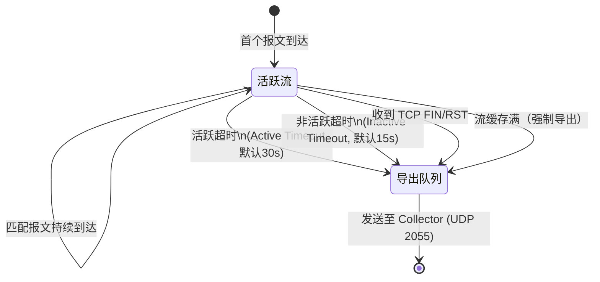
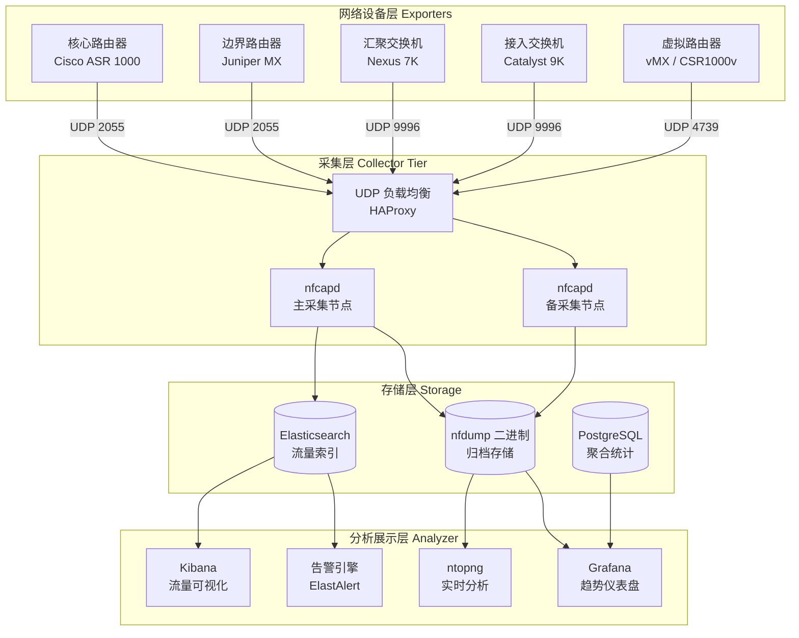
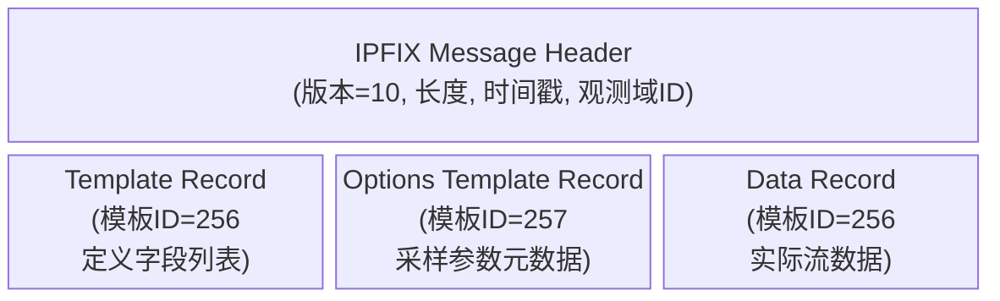
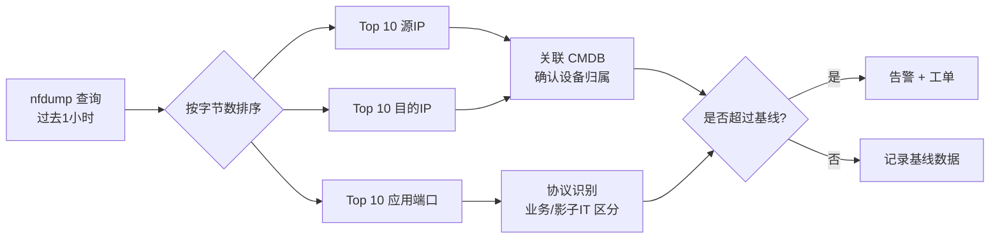
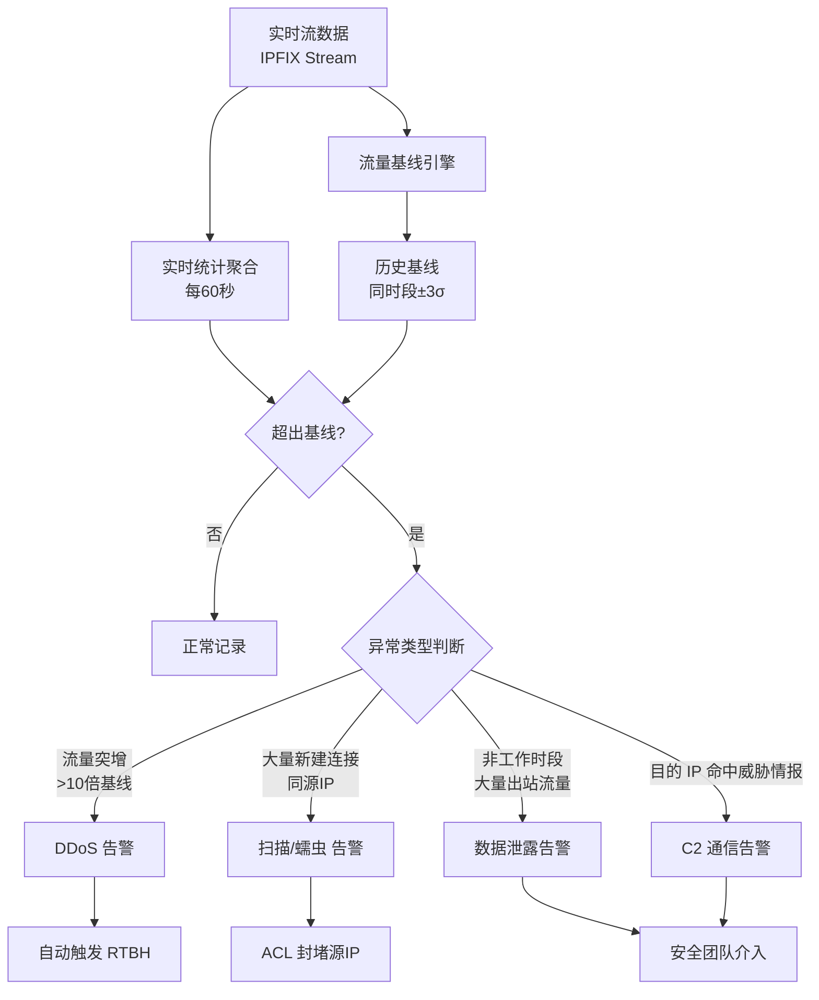
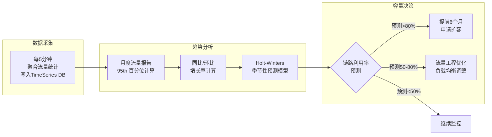

> <Icon name="clipboard-list" color="cyan" /> **前置知识**：[网络监控基础](/guide/ops/monitoring)、[数据包分析与Wireshark](/guide/ops/packet-analysis)
> ⏱ **阅读时间**：约16分钟

# NetFlow/IPFIX：网络流量分析与可视化

网络流量分析（Network Flow Analysis）是现代企业运维的核心能力之一。SNMP（Simple Network Management Protocol）可以告诉你某条链路"用了多少带宽"，但无法回答"谁在占用带宽"、"流量流向哪里"、"是否存在异常通信"。NetFlow 及其后继标准 IPFIX 填补了这一空白，提供了逐流粒度的流量可见性。

## 一、为什么需要流量分析

### SNMP 的局限性

SNMP 通过轮询接口计数器（`ifInOctets` / `ifOutOctets`）获得总流量，数据精度受轮询间隔限制，且完全缺乏来源、目的地、协议维度的分解能力。

| 能力维度 | SNMP | NetFlow/IPFIX |
|---------|------|---------------|
| 总带宽统计 | <Icon name="check-circle-2" color="green" /> | <Icon name="check-circle-2" color="green" /> |
| Top N 源 IP | <Icon name="x-circle" color="danger" /> | <Icon name="check-circle-2" color="green" /> |
| 应用层协议分布 | <Icon name="x-circle" color="danger" /> | <Icon name="check-circle-2" color="green" /> |
| 异常流量检测 | <Icon name="x-circle" color="danger" /> | <Icon name="check-circle-2" color="green" /> |
| 安全取证回溯 | <Icon name="x-circle" color="danger" /> | <Icon name="check-circle-2" color="green" /> |
| 实时采集延迟 | 分钟级 | 秒级 |
| 设备资源消耗 | 极低 | 中等 |

::: tip 核心价值主张
NetFlow 的本质是：将网络设备从"流量管道"升级为"流量探针"。每条流记录相当于一张通话详单——记录了通话双方、时长、数据量和使用的"线路"（协议）。
:::

### 流量分析的三大应用场景

1. **容量规划（Capacity Planning）**：分析历史流量趋势，预测链路饱和时间点，提前扩容
2. **异常检测（Anomaly Detection）**：识别 DDoS 攻击、数据泄露、蠕虫传播等异常模式
3. **安全取证（Security Forensics）**：在安全事件发生后，追溯特定时间段内的 IP 通信记录

---

## 二、NetFlow 协议族全景

### 主流协议对比

```
NetFlow v5  →  NetFlow v9  →  IPFIX (RFC 7011)
   ↓               ↓                ↓
固定格式        模板化格式         IETF 国际标准
Cisco 专有      Cisco 主导         厂商中立
```

| 特性 | NetFlow v5 | NetFlow v9 | IPFIX | sFlow |
|------|-----------|-----------|-------|-------|
| 标准化 | Cisco 私有 | Cisco 私有 | RFC 7011 | RFC 3176 |
| 记录格式 | 固定 7 字段 | 模板动态 | 模板动态 | 报文采样 |
| IPv6 支持 | <Icon name="x-circle" color="danger" /> | <Icon name="check-circle-2" color="green" /> | <Icon name="check-circle-2" color="green" /> | <Icon name="check-circle-2" color="green" /> |
| MPLS 字段 | <Icon name="x-circle" color="danger" /> | <Icon name="check-circle-2" color="green" /> | <Icon name="check-circle-2" color="green" /> | <Icon name="check-circle-2" color="green" /> |
| 应用层识别 | <Icon name="x-circle" color="danger" /> | 扩展支持 | 扩展支持 | <Icon name="x-circle" color="danger" /> |
| 采样方式 | 流采样 | 流采样 | 流采样 | 报文采样 |
| 适用场景 | 传统 Cisco 网络 | 多厂商扩展 | 标准化部署 | 高速链路（>10G） |
| 传输协议 | UDP | UDP | UDP/SCTP/TCP | UDP |

::: warning sFlow 与 NetFlow 的根本差异
sFlow 是**报文采样**技术——直接对数据报文按比例抽样转发给 Collector，开销极低，适合 40G/100G 高速骨干链路。NetFlow/IPFIX 是**流统计**技术——在设备内聚合同一"流"的统计数据再导出，粒度更细但 CPU 消耗更高。两者不可互替，应根据链路速率和分析需求组合部署。
:::

### NetFlow v5 固定字段

v5 的每条流记录固定包含以下字段，共 48 字节：

```
源 IP 地址 (SRC_ADDR)        目的 IP 地址 (DST_ADDR)
下一跳 IP (NEXTHOP)          入接口 (INPUT)       出接口 (OUTPUT)
报文数 (DPKTS)               字节数 (DOCTETS)
流开始时间 (FIRST)           流结束时间 (LAST)
源端口 (SRCPORT)             目的端口 (DSTPORT)
TCP 标志 (TCP_FLAGS)         协议 (PROT)
TOS                          源 AS (SRC_AS)       目的 AS (DST_AS)
源前缀掩码长度               目的前缀掩码长度
```

### IPFIX Information Element（信息元素）

IPFIX 通过 **Information Element（IE）** 机制实现无限扩展。IANA 维护标准 IE 列表（[iana.org/assignments/ipfix](https://www.iana.org/assignments/ipfix)），厂商可注册私有 IE 描述专有字段：

```
Enterprise Number (PEN) = 0        → IANA 标准 IE
Enterprise Number (PEN) = 9         → Cisco 私有 IE
Enterprise Number (PEN) = 6876      → ntop 私有 IE（nDPI 应用识别）
```

---

## 三、NetFlow 工作原理深度剖析

### 流（Flow）的定义

一条"流"（Flow）由**五元组**唯一标识：

```
(源 IP, 目的 IP, 源端口, 目的端口, 协议号)
```

路由器/交换机维护一张**流缓存表（Flow Cache）**，对匹配同一五元组的所有报文累加统计计数器，直到流超时后将记录导出给 Collector。

### 流超时机制



- **活跃超时（Active Timeout）**：长连接（如文件传输）每隔 N 秒强制导出一次中间记录，防止 Collector 长时间收不到数据
- **非活跃超时（Inactive Timeout）**：若某流 N 秒内无新报文，认为连接已结束，立即导出并清理缓存条目

::: tip 超时参数调优
活跃超时建议设置为 60s（平衡实时性与导出频率），非活跃超时建议 15s。对于需要近实时告警的场景，可缩短至 Active=30s, Inactive=10s，但会增加设备 CPU 负担和 Collector 处理压力。
:::

### 采样（Sampling）机制

全流量捕获（1:1）对高速链路的路由器 CPU 压力极大。实际部署中通常采用 **1:N 采样**：

```
采样比 1:100 → 每 100 个报文只统计 1 个
实际带宽 = 测量带宽 × 采样倍率
```

采样误差分析：
- 1:1（无采样）：100% 精度，CPU 消耗最高
- 1:10：统计精度 >99%，适合核心层分析
- 1:100：统计精度 ~95%（大象流准确，老鼠流可能丢失），适合骨干链路
- 1:1000：仅适合超高速骨干链路，小流量分析不可靠

::: warning 采样与异常检测
采样会导致小流量（"老鼠流"）被遗漏。若使用 NetFlow 进行 DDoS 检测，低速扫描（如慢速端口扫描）在高采样比下可能完全不可见。安全敏感场景建议在边界路由器保持 1:1 或 1:10，骨干层采用 1:100。
:::

### Exporter → Collector → Analyzer 架构



**关键设计原则：**
- Collector 使用 UDP 接收，避免 TCP 连接状态消耗；部署双节点防止单点丢包
- 流量归档使用压缩二进制格式（nfdump），压缩比约 10:1
- Elasticsearch 保留热数据（7天），冷数据迁移至 S3/OSS 对象存储

---

## 四、IPFIX 模板机制详解

IPFIX 报文结构分为三种记录类型：



### Template Record 示例（二进制解析）

```
Set ID: 2 (Template FlowSet)
Template ID: 256
Field Count: 8

字段列表:
  IE 8  (sourceIPv4Address)      长度: 4
  IE 12 (destinationIPv4Address) 长度: 4
  IE 7  (sourceTransportPort)    长度: 2
  IE 11 (destinationTransportPort) 长度: 2
  IE 4  (protocolIdentifier)     长度: 1
  IE 2  (packetDeltaCount)       长度: 8
  IE 1  (octetDeltaCount)        长度: 8
  IE 152 (flowStartMilliseconds) 长度: 8
```

::: tip 模板生命周期管理
Exporter 必须周期性重发 Template Record（默认每 10 分钟），防止 Collector 重启后丢失模板定义而无法解析 Data Record。生产环境应将模板刷新间隔设置为 1 分钟，并在 Collector 侧持久化缓存模板。
:::

---

## 五、流量分析平台选型

### 开源方案：ntopng + nfdump

**nfdump 工具链**（命令行分析首选）：

```bash
# 启动 nfcapd 采集器，监听 UDP 2055
nfcapd -w -D -l /var/cache/nfdump -p 2055 -I router01

# 查询过去1小时的 Top 10 流量源 IP
nfdump -R /var/cache/nfdump/router01 \
       -t "now-1h" \
       -s srcip/bytes \
       -n 10 \
       -o "fmt:%sap %byt %fl %pps"

# 过滤特定目的端口的流量（如 DNS: UDP 53）
nfdump -R /var/cache/nfdump/router01 \
       -t "now-3h" \
       'proto udp and dst port 53' \
       -s srcip/flows \
       -n 20

# 检测潜在端口扫描（单源 IP 访问大量目的端口）
nfdump -R /var/cache/nfdump/router01 \
       -t "2026-03-25/08:00:00-2026-03-25/09:00:00" \
       -a -A srcip \
       -s srcip/flows \
       'tcp and flags S and not flags ARSE' \
       | awk '$3 > 1000 {print "Potential Scanner: "$0}'
```

### 企业级方案：Elasticsearch + Kibana

使用 **Logstash** 将 IPFIX 数据摄入 Elasticsearch：

```ruby
# /etc/logstash/conf.d/ipfix.conf
input {
  udp {
    port  => 4739
    codec => netflow {
      versions => [9, 10]
      include_flowset_id => true
    }
  }
}

filter {
  # 地理位置增强
  if [netflow][sourceIPv4Address] {
    geoip {
      source => "[netflow][sourceIPv4Address]"
      target => "[src_geo]"
    }
  }

  # 计算每秒字节率
  ruby {
    code => '
      duration = event.get("[netflow][flowEndMilliseconds]").to_i -
                 event.get("[netflow][flowStartMilliseconds]").to_i
      if duration > 0
        bps = (event.get("[netflow][octetDeltaCount]").to_i * 8 * 1000) / duration
        event.set("[netflow][bits_per_second]", bps)
      end
    '
  }
}

output {
  elasticsearch {
    hosts    => ["es01:9200", "es02:9200"]
    index    => "ipfix-%{+YYYY.MM.dd}"
    template => "/etc/logstash/ipfix-template.json"
  }
}
```

### 商业 SaaS：Kentik

Kentik 是业界领先的云原生网络流量分析平台，适合以下场景：

- **大规模骨干网**：日处理万亿级流记录
- **BGP 路由集成**：将流量与 AS 路径关联，分析对等互联流量
- **DDoS 自动缓解**：结合 RTBH（Remote Triggered Black Hole）自动封堵攻击源
- **多云可见性**：支持 AWS VPC Flow Logs、Azure NSG Flow Logs、GCP VPC Flow Logs 统一分析

---

## 六、设备配置实战

### Cisco IOS/IOS-XE NetFlow v9 配置

```ios
! 第一步：定义流量记录格式
flow record NETFLOW-RECORD
  match ipv4 source address
  match ipv4 destination address
  match transport source-port
  match transport destination-port
  match ip protocol
  match ip tos
  match interface input
  collect counter bytes long
  collect counter packets long
  collect timestamp sys-uptime first
  collect timestamp sys-uptime last
  collect transport tcp flags
  collect routing source as
  collect routing destination as

! 第二步：定义导出器
flow exporter NETFLOW-EXPORTER
  destination 10.100.10.50          ! Collector IP
  source Loopback0                  ! 使用稳定的源 IP
  transport udp 9996
  export-protocol netflow-v9
  template data timeout 60          ! 每60秒刷新模板
  option interface-table            ! 导出接口名称映射
  option vrf-table
  option sampler-table              ! 导出采样参数

! 第三步：定义流监控器
flow monitor NETFLOW-MONITOR
  record NETFLOW-RECORD
  exporter NETFLOW-EXPORTER
  cache timeout active 60           ! 活跃超时 60 秒
  cache timeout inactive 15         ! 非活跃超时 15 秒
  cache entries 500000              ! 最大流缓存条目数

! 第四步：（可选）配置采样器
sampler NETFLOW-SAMPLER
  mode random 1 out-of 100          ! 1:100 采样

! 第五步：应用到接口
interface GigabitEthernet0/0/0
  ip flow monitor NETFLOW-MONITOR input
  ip flow monitor NETFLOW-MONITOR output
  ! 高速链路启用采样
  ip flow sampler NETFLOW-SAMPLER

! 验证命令
show flow monitor NETFLOW-MONITOR cache
show flow exporter NETFLOW-EXPORTER statistics
show flow interface GigabitEthernet0/0/0
```

### Cisco IOS-XR IPFIX 配置

```ios-xr
flow exporter-map IPFIX-EXPORTER
  version v9
   options interface-table timeout 300
   options sampler-table timeout 300
   template timeout 60
  !
  transport udp 4739
  source Loopback0
  destination 10.100.10.50
!

flow monitor-map IPFIX-MONITOR
  record ipv4
  exporter IPFIX-EXPORTER
  cache entries 500000
  cache timeout active 60
  cache timeout inactive 15
!

sampler-map NETFLOW-SAMPLER
  random 1 out-of 1000
!

interface HundredGigE0/0/0/0
  flow ipv4 monitor IPFIX-MONITOR sampler NETFLOW-SAMPLER ingress
  flow ipv4 monitor IPFIX-MONITOR sampler NETFLOW-SAMPLER egress
!
```

### Linux 软件 Exporter：softflowd

对于没有硬件 NetFlow 支持的 Linux 服务器或虚拟机，可部署 **softflowd**：

```bash
# 安装
apt-get install softflowd   # Debian/Ubuntu
yum install softflowd       # RHEL/CentOS

# 配置文件 /etc/softflowd.conf
interface=eth0
host=10.100.10.50
port=9996
proto=9                      # NetFlow v9
timeout.maxlife=300
timeout.expiry=15
timeout.tcp.rst=10
timeout.tcp.fin=5
sampling_rate=100            # 1:100 采样

# 启动服务
systemctl enable --now softflowd

# 验证导出
tcpdump -i eth0 -n 'udp dst port 9996' -c 5
```

### 使用 **pmacct** 实现 IPFIX 导出（生产级推荐）

```
! /etc/pmacctd.conf
daemonize: true
syslog: daemon
pidfile: /var/run/pmacctd.pid

pcap_interface: bond0
aggregate: src_host, dst_host, src_port, dst_port, proto, tos, in_iface, out_iface

plugins: nfprobe[ipfix-export]

nfprobe_receiver[ipfix-export]: 10.100.10.50:4739
nfprobe_version[ipfix-export]: 10     # IPFIX
nfprobe_timeouts[ipfix-export]: tcp_generic:120 maxlife:300 expiry:15
nfprobe_ifindex[ipfix-export]: tag
```

---

## 七、实战应用场景

### 场景一：Top N 带宽消耗者识别



```bash
# 识别过去24小时带宽 Top 20 源IP（含 AS 归属）
nfdump -R /var/cache/nfdump/border-router \
       -t "now-24h" \
       -s srcip/bytes \
       -n 20 \
       -o "extended"

# 输出示例：
# Rank  Flows  Packets    Bytes     bps      Src IP                Dst IP
#    1    128    85.2M   92.4 G   8.89 G   192.168.1.100        0.0.0.0/0
#    2     45    12.1M   13.8 G   1.33 G   10.10.50.22          0.0.0.0/0
```

### 场景二：异常流量检测



**ElastAlert 告警规则（DDoS 检测）**：

```yaml
# /etc/elastalert/rules/ddos-detection.yaml
name: DDoS Volume Spike Detection
type: spike

index: ipfix-*
timeframe:
  minutes: 5

spike_height: 10          # 流量是基线的10倍
spike_type: up
threshold_ref: 100        # 基线至少100条流记录才触发比较

query_key: "netflow.destinationIPv4Address"

filter:
  - term:
      "netflow.protocolIdentifier": 17    # UDP

alert:
  - slack
slack_webhook_url: "https://hooks.slack.com/services/xxx/yyy/zzz"
alert_text: |
  DDoS 告警：目的 IP {0} 的 UDP 流量异常
  当前流量是基线的 {1} 倍
  请立即排查！
alert_text_args:
  - "netflow.destinationIPv4Address"
  - "spike_count"
```

### 场景三：安全取证回溯

```bash
# 场景：某主机 10.10.5.100 在昨晚 23:00-01:00 与外部通信记录
nfdump -R /var/cache/nfdump/border-router/2026/03/24/ \
       -t "2026-03-24/23:00:00-2026-03-25/01:00:00" \
       'src ip 10.10.5.100 or dst ip 10.10.5.100' \
       -o "line" \
       | tee /tmp/forensics-10.10.5.100.txt

# 提取涉及公网 IP 的连接（排除 RFC1918）
grep -v ' 10\.' /tmp/forensics-10.10.5.100.txt \
  | grep -v ' 192\.168\.' \
  | grep -v ' 172\.1[6-9]\.\| 172\.2[0-9]\.\| 172\.3[01]\.' \
  | sort -k6 -rn    # 按字节数降序排列

# 导出为 CSV 供分析人员使用
nfdump -R /var/cache/nfdump/border-router/2026/03/24/ \
       -t "2026-03-24/23:00:00-2026-03-25/01:00:00" \
       'src ip 10.10.5.100' \
       -o csv > /tmp/forensics-export.csv
```

::: danger 流量记录保留策略
安全取证要求原始流记录**至少保留 90 天**（金融行业通常要求 6 个月至 1 年）。nfdump 二进制格式每台路由器每天约占 5-50 GB（取决于流量规模），应规划专用归档存储，并实施基于时间的自动分层：

- **热存储（0-7天）**：NVMe SSD，支持实时查询
- **温存储（7-30天）**：HDD RAID，压缩归档
- **冷存储（30-365天）**：对象存储（S3 Glacier / 阿里云 OSS 归档型）
:::

---

## 八、容量规划：基于流量趋势的预测

### 流量趋势分析工作流



**Grafana + InfluxDB 95th 百分位查询（Flux 语法）**：

```flux
from(bucket: "netflow-aggregated")
  |> range(start: -30d)
  |> filter(fn: (r) => r["_measurement"] == "interface_traffic")
  |> filter(fn: (r) => r["interface"] == "GigabitEthernet0/0/0")
  |> filter(fn: (r) => r["_field"] == "bytes_out")
  |> aggregateWindow(every: 5m, fn: mean)
  |> map(fn: (r) => ({ r with _value: r._value * 8.0 / 300.0 }))  // 转换为 bps
  |> quantile(q: 0.95, method: "estimate_tdigest")
```

::: tip 95th 百分位计费标准
大多数 ISP 和数据中心使用 **95th 百分位计费（Burstable Billing）**：取当月所有 5 分钟流量测量值，排除最高的 5%（即允许月内约 36 小时突发），以第 95 百分位值作为计费带宽。NetFlow 数据可精确重现这一计算过程，帮助优化带宽合同。
:::

---

## 九、架构最佳实践总结

| 维度 | 建议 |
|------|------|
| **Exporter 配置** | 核心/边界路由器全量监控（1:1 或 1:10），汇聚层 1:100 采样 |
| **Collector 高可用** | 双节点 + UDP 负载均衡，避免单点丢流 |
| **存储规划** | 原始流数据 90 天在线，冷归档 1 年，预留 10:1 压缩比 |
| **传输安全** | 生产环境启用 DTLS（IPFIX over DTLS，RFC 7011 §10）加密导出数据 |
| **性能基准** | 单核 nfcapd 处理约 100k flows/s，ES 单节点约 50k flows/s 入库 |
| **告警策略** | 基于流量的告警必须结合基线，避免固定阈值导致误报 |
| **安全分析集成** | 流记录与威胁情报（TI）平台对接，实现 IoC 自动匹配 |

---

## 延伸阅读

- [RFC 7011 - IPFIX 规范](https://www.rfc-editor.org/rfc/rfc7011)（IPFIX 完整协议标准）
- [RFC 5101 - NetFlow v9 规范](https://www.rfc-editor.org/rfc/rfc5101)
- [nfdump 项目](https://github.com/phaag/nfdump)（开源 NetFlow 采集与分析工具）
- [ntopng 文档](https://www.ntop.org/products/traffic-analysis/ntop/)（开源流量分析平台）
- [Elastic IPFIX 插件](https://www.elastic.co/guide/en/logstash/current/plugins-codecs-netflow.html)（Logstash NetFlow/IPFIX 解码器）
- [下一章：网络故障排查进阶](/guide/ops/troubleshooting-advanced)（结合 NetFlow 与数据包分析的综合排障方法论）
