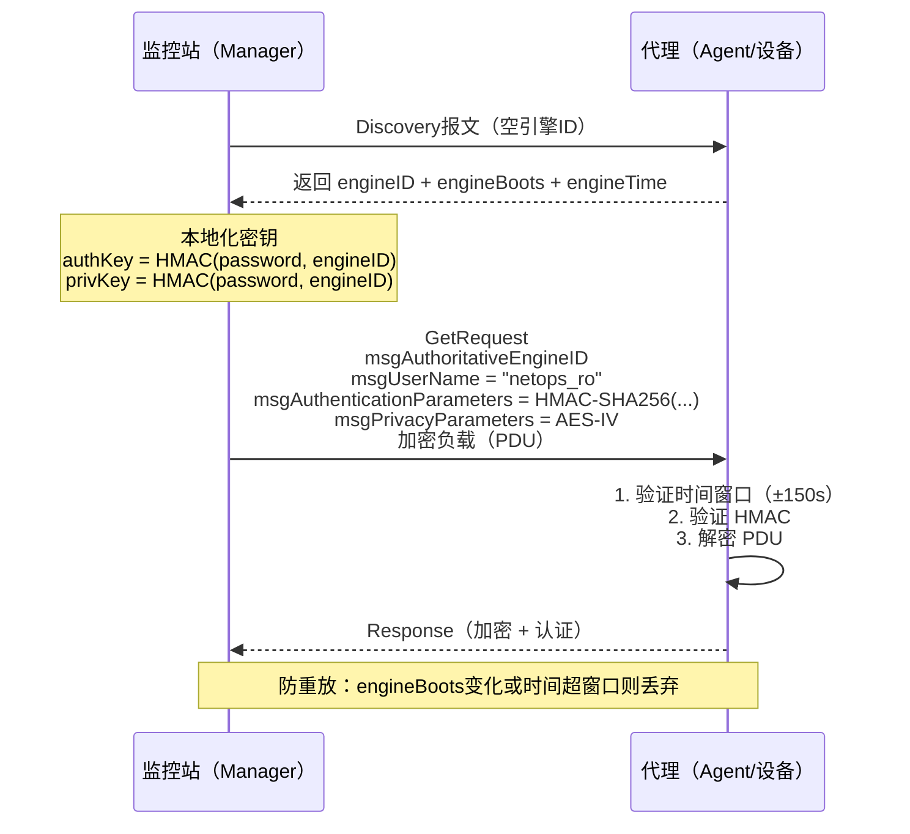
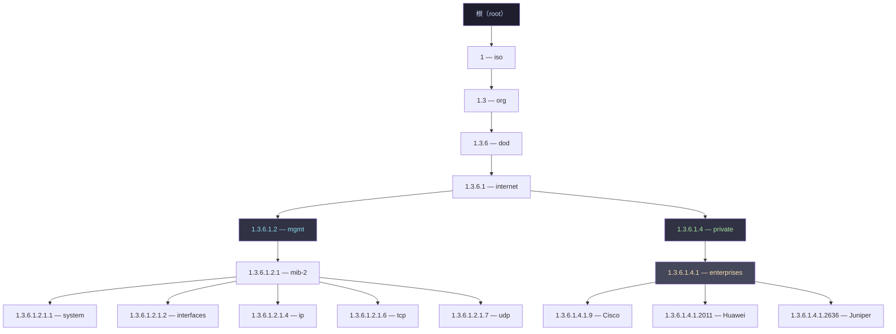
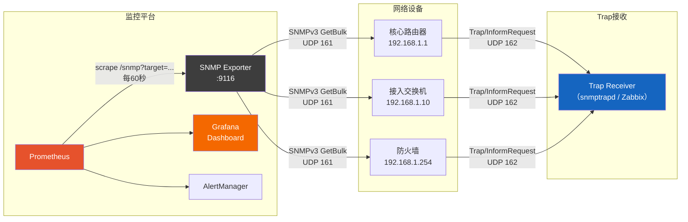
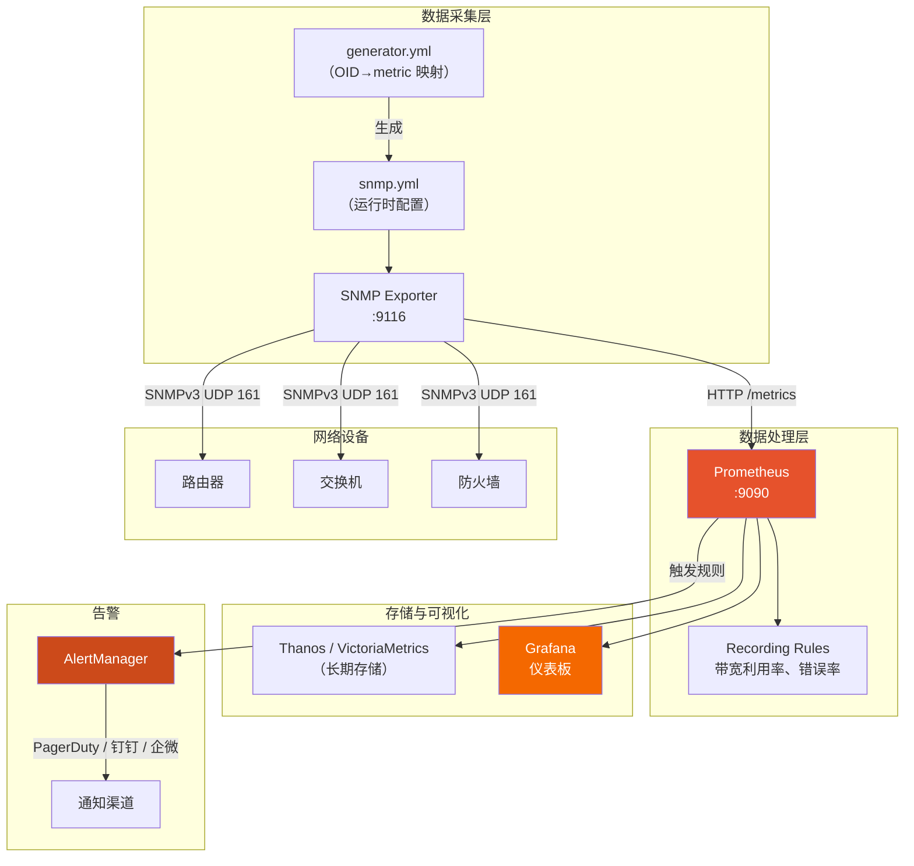

> <Icon name="clipboard-list" color="cyan" /> **前置知识**：[网络监控体系](/guide/ops/monitoring)、[网络运维基础](/guide/ops/troubleshooting)
> ⏱ **阅读时间**：约16分钟

# SNMP v3 与 MIB 管理：企业级网络监控基础

一台核心交换机悄悄把接口 CPU 推到 98%，三分钟后链路抖动，业务告警才冒出来——这中间的空档，就是 SNMP 没配好的代价。SNMP（Simple Network Management Protocol，简单网络管理协议）是网络设备最通用的遥测接口，存在于几乎每台路由器、交换机、防火墙和服务器。问题在于，大多数团队只会用 v2c 社区字符串拉几个接口计数，却不清楚 v3 能做什么，也不知道 MIB 树背后的逻辑。

这篇文章从协议演进讲起，把 SNMPv3 安全模型、MIB 树导航、Trap 可靠性，以及与 Prometheus/Grafana 的现代集成串在一起，给出企业环境可以直接参考的配置。

---

## 一、SNMP 协议演进：从明文社区字符串到完整安全模型

### 三个版本的核心差异

```
SNMPv1（1988）
  ├─ 32位计数器（接口流量超4GB/s就溢出）
  ├─ 社区字符串（community string）= 明文密码
  └─ Trap无确认，丢了不知道

SNMPv2c（1996）
  ├─ 64位计数器（Counter64）—— 解决流量溢出
  ├─ GetBulk批量查询 —— 大表查询快10倍以上
  ├─ InformRequest —— Trap有ACK确认
  └─ 社区字符串依然明文，"c"即Community

SNMPv3（2002，RFC 3411-3418）
  ├─ USM（User-based Security Model，基于用户的安全模型）
  ├─ 认证：MD5/SHA/SHA-256
  ├─ 加密：DES/AES-128/AES-256
  ├─ VACM（View-based Access Control Model，基于视图的访问控制）
  └─ 防重放攻击（时间窗口+引擎启动计数）
```

::: warning 生产环境禁用 v1/v2c
SNMPv1/v2c 社区字符串在网络中以明文传输，任何路径上的抓包工具（Wireshark、tcpdump）都能直接读取。2023 年 CISA 发布的网络设备加固指南明确要求在公网或零信任边界内禁用 v1/v2c。如果内部网络还在用 v2c，至少要把访问控制列表（ACL）锁到具体的监控服务器 IP。
:::

### 版本选型决策

| 场景 | 推荐版本 | 理由 |
|------|---------|------|
| 遗留设备（仅支持v1/v2c） | v2c + ACL | 无法升级时的折中 |
| 内部网络监控 | v3 authPriv | 完整保护 |
| 互联网暴露接口 | v3 authPriv + 防火墙过滤 | 必须 |
| 只读轮询（内网隔离） | v2c | 运维简单，可接受 |
| 写操作（SetRequest） | v3 authPriv | 明文写操作不可接受 |

---

## 二、SNMPv3 安全架构：USM 与三级安全等级

SNMPv3 把安全拆成两个独立模型：**USM**（User-based Security Model）负责认证和加密，**VACM**（View-based Access Control Model）负责哪个用户能看哪些 OID。

### 安全等级（Security Level）

```
noAuthNoPriv   —— 无认证、无加密（等价于 v2c）
authNoPriv     —— 有认证（HMAC）、无加密（明文数据）
authPriv       —— 有认证 + 有加密（推荐生产使用）
```

### SNMPv3 报文交换与安全模型



### USM 用户配置（Net-SNMP 格式）

```bash
# /etc/snmp/snmpd.conf

# 创建只读用户：认证 SHA-256，加密 AES-128
createUser netops_ro SHA-256 "Auth@P4ssw0rd!2024" AES "Encr@P4ssw0rd!2024"

# 授予只读（rouser）访问权限，安全级别 priv
rouser netops_ro priv

# 创建运维读写用户
createUser netops_rw SHA-256 "RWAuth@Secure!2024" AES "RWEncr@Secure!2024"
rwuser netops_rw priv

# VACM 视图控制：限制 rw 用户只能访问接口和系统组
view   MonitorView  included  .1.3.6.1.2.1.1       # system
view   MonitorView  included  .1.3.6.1.2.1.2       # interfaces
view   MonitorView  included  .1.3.6.1.2.1.4       # ip
view   MonitorView  included  .1.3.6.1.4.1.9       # Cisco 私有 MIB

access  netops_grp ""  usm  priv  exact MonitorView MonitorView none
```

::: tip 密钥本地化（Key Localization）
SNMPv3 不直接使用密码，而是把密码与 engineID 混合做 HMAC 生成本地化密钥。这意味着同样的密码在不同设备上产生不同密钥，防止密钥跨设备重放。密钥替换时使用 `snmpusm` 命令，无需重启 Agent。
:::

### Cisco IOS/IOS-XE SNMPv3 配置

```
! 创建 ACL，只允许监控服务器访问
ip access-list standard SNMP_ALLOW
 permit 10.10.100.10
 permit 10.10.100.11
 deny   any log

! 配置 SNMPv3 用户组
snmp-server group NETOPS_RO v3 priv read MONITOR_VIEW access SNMP_ALLOW
snmp-server group NETOPS_RW v3 priv write MONITOR_VIEW access SNMP_ALLOW

! 创建 MIB 视图
snmp-server view MONITOR_VIEW internet included

! 创建用户（密码最少8字符）
snmp-server user netops_ro NETOPS_RO v3 auth sha Auth@P4ssw0rd!2024 priv aes 128 Encr@P4ssw0rd!2024

! 配置 Trap 目标
snmp-server host 10.10.100.10 version 3 priv netops_ro

! 启用关键 Trap
snmp-server enable traps snmp authentication linkdown linkup
snmp-server enable traps bgp
snmp-server enable traps ospf state-change
snmp-server enable traps envmon
```

---

## 三、MIB（管理信息库）：OID 树的导航逻辑

MIB（Management Information Base，管理信息库）是 SNMP 世界的"数据字典"，定义了每个可查询对象的名字、类型和含义。OID（Object Identifier，对象标识符）是 MIB 树上每个节点的唯一地址，用数字点分表示。

### OID 树结构



### 常用 OID 速查表

| 指标 | OID | MIB 名称 | 说明 |
|------|-----|----------|------|
| 系统描述 | 1.3.6.1.2.1.1.1.0 | sysDescr | 设备型号/版本 |
| 系统运行时间 | 1.3.6.1.2.1.1.3.0 | sysUpTime | 单位：百分之一秒 |
| 接口数量 | 1.3.6.1.2.1.2.1.0 | ifNumber | — |
| 接口描述 | 1.3.6.1.2.1.2.2.1.2.X | ifDescr | X=接口索引 |
| 接口操作状态 | 1.3.6.1.2.1.2.2.1.8.X | ifOperStatus | 1=up, 2=down |
| 接口入流量(32位) | 1.3.6.1.2.1.2.2.1.10.X | ifInOctets | 高速接口易溢出 |
| 接口出流量(32位) | 1.3.6.1.2.1.2.2.1.16.X | ifOutOctets | — |
| 接口入流量(64位) | 1.3.6.1.2.1.31.1.1.1.6.X | ifHCInOctets | 推荐用于GE/10GE |
| 接口出流量(64位) | 1.3.6.1.2.1.31.1.1.1.10.X | ifHCOutOctets | — |
| 接口入错误 | 1.3.6.1.2.1.2.2.1.14.X | ifInErrors | 排障关键 |
| 接口入丢包 | 1.3.6.1.2.1.2.2.1.13.X | ifInDiscards | — |
| Cisco CPU(5分钟) | 1.3.6.1.4.1.9.2.1.58.0 | cpmCPUTotal5min | Cisco 私有 |
| Cisco 内存已用 | 1.3.6.1.4.1.9.9.48.1.1.1.5.1 | ciscoMemoryPool | — |
| Cisco BGP 邻居状态 | 1.3.6.1.4.1.9.9.187.1.2.5.1.3 | cbgpPeer2State | — |

### Net-SNMP 查询示例

```bash
# 系统信息（SNMPv3）
snmpwalk -v3 -l authPriv \
  -u netops_ro \
  -a SHA-256 -A "Auth@P4ssw0rd!2024" \
  -x AES -X "Encr@P4ssw0rd!2024" \
  192.168.1.1 1.3.6.1.2.1.1

# 查询单个 OID：接口1的64位入流量
snmpget -v3 -l authPriv \
  -u netops_ro \
  -a SHA-256 -A "Auth@P4ssw0rd!2024" \
  -x AES -X "Encr@P4ssw0rd!2024" \
  192.168.1.1 ifHCInOctets.1

# GetBulk：批量拉取接口表（max-repetitions=20）
snmpbulkwalk -v3 -l authPriv \
  -u netops_ro \
  -a SHA-256 -A "Auth@P4ssw0rd!2024" \
  -x AES -X "Encr@P4ssw0rd!2024" \
  -Cr20 \
  192.168.1.1 IF-MIB::ifTable

# 翻译数字 OID 为可读名称（需安装 MIB 文件）
snmptranslate -IR -On ifOperStatus
# 输出：.1.3.6.1.2.1.2.2.1.8

# 反向：OID 转名称
snmptranslate .1.3.6.1.2.1.2.2.1.8
# 输出：IF-MIB::ifOperStatus
```

::: tip 安装厂商 MIB
默认 Net-SNMP 只包含标准 MIB。Cisco MIB 可从 [Cisco MIB Locator](https://mibs.cloudapps.cisco.com/ITDIT/MIBS/servlet/index) 下载，放到 `/usr/share/snmp/mibs/` 后执行 `snmpwalk -m ALL ...` 即可按名称查询 Cisco 私有对象。
:::

---

## 四、轮询（Polling）vs Trap：两种数据采集模式

### 操作类型

| 操作 | 版本 | 方向 | 说明 |
|------|-----|------|------|
| GetRequest | v1/v2c/v3 | 管理站→设备 | 精确查询单个/多个 OID |
| GetNextRequest | v1/v2c/v3 | 管理站→设备 | 遍历 MIB 树（逐行） |
| GetBulkRequest | v2c/v3 | 管理站→设备 | 批量遍历，效率最高 |
| SetRequest | v1/v2c/v3 | 管理站→设备 | 写操作（慎用） |
| Trap | v1/v2c/v3 | 设备→管理站 | 主动告警，无确认 |
| InformRequest | v2c/v3 | 设备→管理站 | 主动告警，有 ACK |

### SNMP 轮询架构



### Trap 可靠性问题与 InformRequest

原始 Trap（v1/v2c）是 UDP 单向投递，网络抖动时直接丢失。SNMPv2c/v3 引入的 `InformRequest` 要求管理站返回 `Response` 确认，未确认则重传（默认重传5次，间隔1秒，可配置）。

```bash
# snmptrapd 接收并记录（/etc/snmp/snmptrapd.conf）
authCommunity log,execute,net public
format1 %04y-%02m-%02l %02h:%02j:%02k %a %N %w %q %v\n
logOption f /var/log/snmptrap.log

# 配置 Trap 执行脚本（链路 down 时触发）
traphandle IF-MIB::linkDown /usr/local/bin/handle_linkdown.sh
```

::: warning Trap 不能替代轮询
Trap 依赖设备自身工作正常才能发出。设备 CPU 100%、内存耗尽或管理平面崩溃时，Trap 可能正好发不出来——恰恰是你最需要告警的时刻。生产环境必须轮询（Polling）+ Trap 双轨并行。
:::

---

## 五、现代监控集成：Prometheus SNMP Exporter

Prometheus SNMP Exporter 是目前最流行的 SNMP → 时序指标转换层，把设备的 OID 值转为 Prometheus 格式的 metrics，再由 Grafana 可视化。

### 完整集成架构



### generator.yml 配置（SNMP Exporter）

```yaml
# generator.yml — 由 snmp-generator 工具读取并生成 snmp.yml

modules:
  # 通用接口监控模块
  if_mib:
    walk:
      - sysUpTime
      - interfaces
      - ifXTable          # 64位计数器

    version: 3
    auth:
      security_level: authPriv
      username: netops_ro
      password: Auth@P4ssw0rd!2024
      auth_protocol: SHA256
      priv_protocol: AES
      priv_password: Encr@P4ssw0rd!2024

    lookups:
      - source_indexes: [ifIndex]
        lookup: ifDescr    # 用接口名代替数字索引做标签
        drop_source_indexes: false
      - source_indexes: [ifIndex]
        lookup: ifAlias

    overrides:
      ifAdminStatus:
        type: EnumAsInfo   # 枚举值转 info metric
      ifOperStatus:
        type: EnumAsInfo
      ifType:
        ignore: true       # 过滤不需要的 OID

  # Cisco 私有指标模块
  cisco_ios:
    walk:
      - cpmCPUTotalTable
      - ciscoMemoryPool
      - cbgpPeer2Table

    version: 3
    auth:
      security_level: authPriv
      username: netops_ro
      password: Auth@P4ssw0rd!2024
      auth_protocol: SHA256
      priv_protocol: AES
      priv_password: Encr@P4ssw0rd!2024
```

### Prometheus scrape_configs

```yaml
# prometheus.yml

scrape_configs:
  - job_name: snmp_interfaces
    static_configs:
      - targets:
          - 192.168.1.1     # 核心路由器
          - 192.168.1.10    # 分布层交换机
          - 192.168.1.254   # 防火墙
    metrics_path: /snmp
    params:
      module: [if_mib]
    relabel_configs:
      # 把目标 IP 传给 SNMP Exporter
      - source_labels: [__address__]
        target_label: __param_target
      - source_labels: [__param_target]
        target_label: instance
      - target_label: __address__
        replacement: snmp-exporter:9116

  - job_name: snmp_cisco
    static_configs:
      - targets:
          - 192.168.1.1
    metrics_path: /snmp
    params:
      module: [cisco_ios]
    relabel_configs:
      - source_labels: [__address__]
        target_label: __param_target
      - source_labels: [__param_target]
        target_label: instance
      - target_label: __address__
        replacement: snmp-exporter:9116
```

### 关键告警规则

```yaml
# snmp_alerts.yml

groups:
  - name: snmp_interface
    rules:
      # 接口 down
      - alert: InterfaceDown
        expr: ifOperStatus{job="snmp_interfaces"} == 2
        for: 1m
        labels:
          severity: critical
        annotations:
          summary: "接口 {{ $labels.ifDescr }} 状态 Down"
          description: "设备 {{ $labels.instance }} 接口 {{ $labels.ifDescr }} 已 Down 超过1分钟"

      # 带宽利用率超90%（需 Recording Rule 预计算）
      - alert: InterfaceHighUtilization
        expr: |
          (
            rate(ifHCInOctets[5m]) * 8 /
            ifHighSpeed * 1000000
          ) > 0.9
        for: 5m
        labels:
          severity: warning
        annotations:
          summary: "接口 {{ $labels.ifDescr }} 带宽利用率超90%"

      # 接口错误率异常
      - alert: InterfaceHighErrors
        expr: rate(ifInErrors[5m]) > 10
        for: 2m
        labels:
          severity: warning
        annotations:
          summary: "接口 {{ $labels.ifDescr }} 入错误率 {{ $value | humanize }}/s"

  - name: snmp_device
    rules:
      # Cisco CPU 高
      - alert: CiscoCPUHigh
        expr: cpmCPUTotal5min > 80
        for: 5m
        labels:
          severity: warning
        annotations:
          summary: "设备 {{ $labels.instance }} CPU 利用率 {{ $value }}%"
```

### Grafana 仪表板要点

在 Grafana 中导入 SNMP 接口仪表板（Dashboard ID: 11169 是社区常用模板），关键 Panel 配置：

```
带宽利用率（in/out）：
  rate(ifHCInOctets{instance="$device", ifDescr="$interface"}[5m]) * 8

接口错误（stacked bar）：
  rate(ifInErrors{instance="$device"}[5m])
  rate(ifOutErrors{instance="$device"}[5m])

设备在线率（stat panel）：
  avg_over_time(up{job="snmp_interfaces", instance="$device"}[1h]) * 100
```

---

## 六、Zabbix SNMP 模板方案

对于已部署 Zabbix 的团队，SNMP 集成通过"模板（Template）"完成，无需额外 Exporter。

```xml
<!-- Zabbix SNMPv3 主机配置（通过 UI 或 API 导入） -->
Host:
  SNMP interfaces:
    - Type: SNMPv3
      Version: 3
      Security name: netops_ro
      Security level: authPriv
      Auth protocol: SHA256
      Auth passphrase: {$SNMP_AUTH_PASS}
      Priv protocol: AES128
      Priv passphrase: {$SNMP_PRIV_PASS}

Templates:
  - Template Net Cisco IOS SNMPv2  (Zabbix 内置，可改为 v3)
  - Template Net Network Interfaces SNMPv2
```

::: tip Zabbix 宏（Macro）管理凭据
把 `{$SNMP_AUTH_PASS}` 和 `{$SNMP_PRIV_PASS}` 存为 Zabbix 全局宏或主机宏，避免凭据硬编码在模板中，便于轮换。
:::

---

## 七、SNMP vs gNMI：现代替代方案

SNMP 设计于30年前，面对高速现代网络有几个结构性短板：UDP 无可靠传输层、轮询效率低、数据模型不统一、GetBulk 在大型设备上有时触发 CPU 尖峰。

**gNMI**（gRPC Network Management Interface，基于gRPC的网络管理接口）是 OpenConfig 项目推出的现代替代，基于 gRPC + Protobuf，提供 Subscribe 流式推送（Streaming Telemetry），每秒可达亚秒级采样。

| 特性 | SNMP v3 | gNMI / Streaming Telemetry |
|------|---------|---------------------------|
| 传输层 | UDP（不可靠） | TCP/gRPC（可靠） |
| 数据推送 | 轮询为主 | 原生流式订阅 |
| 数据模型 | MIB（ASN.1）| YANG（更结构化） |
| 采样频率 | 分钟级（实用） | 亚秒级 |
| 设备支持 | 全覆盖（所有设备） | 仅新设备（Cisco NX-OS 7.0+、Junos 18.1+） |
| 安全 | TLS（v3）| TLS（原生） |
| 工具生态 | 成熟（Net-SNMP、Zabbix、PRTG） | 快速发展（gNMIc、Telegraf、Panoptica） |

::: tip 过渡策略
对于混合环境，推荐：**新部署设备优先 gNMI**，**存量旧设备保持 SNMP v3**。Prometheus 生态两者都能接入：gNMI 用 `gnmic` + Telegraf，SNMP 用 SNMP Exporter，数据汇入同一个 Prometheus 实例做统一告警。
:::

---

## 实战检查清单

部署 SNMPv3 监控前，逐项核对：

**安全配置**
- [ ] 所有设备关闭 SNMP v1
- [ ] v2c 仅保留必要且绑定源 IP ACL
- [ ] v3 用户使用 SHA-256 + AES-128 及以上
- [ ] 密码长度 ≥ 16 字符，包含大小写+数字+特殊字符
- [ ] VACM 视图限制只读用户只能访问 monitoring MIB
- [ ] 防火墙只开放监控服务器 IP 到设备 UDP 161

**采集配置**
- [ ] 高速接口（GE及以上）使用 64 位计数器（ifHCInOctets）
- [ ] GetBulk max-repetitions 根据 MIB 表大小调整（建议10~50）
- [ ] 轮询间隔与设备性能匹配（核心设备 60s，接入层 120s）
- [ ] Trap + Polling 双轨运行

**告警配置**
- [ ] InterfaceDown 告警延迟 > 1分钟（过滤瞬断抖动）
- [ ] BGP 邻居状态变化独立告警
- [ ] 带宽告警基于 5 分钟平均，非瞬时峰值
- [ ] AlertManager 配置告警去重（group_by: [instance, alertname]）

**运维**
- [ ] MIB 文件版本管理，更新设备固件时同步更新 MIB
- [ ] SNMP 凭据纳入密码轮换流程（建议90天）
- [ ] Exporter 部署高可用（≥2副本）

---

## 总结

SNMPv3 + USM 解决了困扰 v2c 多年的明文认证问题；MIB 树与 OID 一旦理解逻辑，查找任何厂商指标都有规律可循；Prometheus SNMP Exporter 把设备数据无缝接入现代可观测性栈。三者组合，是现阶段覆盖最广、工具链最成熟的网络设备监控方案。

新设备采购时优先评估 gNMI 支持情况，做好从 SNMP 向 Streaming Telemetry 过渡的准备——这不是替换，而是逐步扩展采样维度和频率的演进路径。
