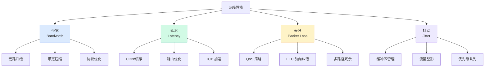

---
title: 性能优化
description: 从带宽、延迟、丢包与抖动等维度介绍网络性能分析与优化思路。
---

# 性能优化

## 网络性能的四个维度

网络"慢"不一定是带宽不够。性能问题往往出在这四个维度：

| 维度 | 含义 | 常见原因 |
|-----|------|---------|
| **带宽** | 管道有多粗 | 链路升级、链路聚合 |
| **延迟** | 数据走多久 | 地理距离、路由跳数、处理延迟 |
| **丢包** | 数据丢了多少 | 拥塞、线路故障、QoS 配置 |
| **抖动** | 延迟波动多大 | 队列拥塞、路径变化 |

## WAN 优化技术

### 1. TCP 加速

TCP 在高延迟、高丢包的 WAN 环境中效率很差。原因：

- **拥塞控制太保守**：丢一个包就把窗口减半
- **慢启动太慢**：新连接从小窗口开始，需要很多 RTT 才能跑满带宽
- **高 RTT 影响吞吐**：理论吞吐 ≈ 窗口大小 / RTT

TCP 加速的做法：
- **窗口放大**：允许更大的发送窗口
- **选择性确认（SACK）**：只重传丢失的包，不回退整个窗口
- **本地确认**：WAN 加速器在本地回 ACK，减少等待时间

### 2. 数据压缩和去重

- **数据压缩**：LZ4、Zstd 实时压缩，节省 30-60% 带宽
- **数据去重**：识别重复数据块，只传一次。对邮件附件等重复性高的数据效果显著
- **协议优化**：减少 chatty 协议的来回次数（如 CIFS/SMB 优化）

### 3. 缓存和 CDN

把内容放到离用户更近的地方：
- **本地缓存**：分支站点的 WAN 加速器缓存常用文件
- **CDN**：在全球节点缓存静态内容
- **预取**：预测用户可能需要的内容，提前拉取

## SD-WAN 的性能优化

SD-WAN 在传统 WAN 优化的基础上增加了：

| 技术 | 原理 | 效果 |
|-----|------|------|
| **前向纠错 (FEC)** | 发送冗余数据，接收端自动修复丢包 | 10% 丢包 → 接近 0% |
| **包复制** | 同一数据包走两条路径 | 延迟取最小值 |
| **实时路径选择** | 持续探测链路质量，动态切换 | 始终走最优路径 |
| **应用感知** | 根据应用类型选择最佳链路 | 视频走 MPLS，浏览走互联网 |
| **SaaS 优化** | 直接从分支出互联网访问 SaaS | 减少绕路延迟 |

## 性能基线和监控

优化的前提是**知道现在什么水平**。

### 关键指标

| 指标 | 测量方式 | 健康值 | 告警值 |
|-----|---------|--------|-------|
| **链路利用率** | SNMP 接口计数器 | < 60% | > 80% |
| **往返延迟** | Ping / SLA 探针 | < 100ms | > 200ms |
| **丢包率** | IP SLA / iPerf | < 0.5% | > 2% |
| **抖动** | RTP 统计 / SLA 探针 | < 10ms | > 30ms |
| **TCP 重传率** | Netflow / 应用监控 | < 1% | > 3% |

### 性能优化循环

## 小结

网络性能优化不是"加带宽"这么简单。需要：

1. **先测量**：建立基线，找到真正的瓶颈
2. **分层优化**：带宽、延迟、丢包、抖动分别对症下药
3. **持续监控**：网络状况随时在变，优化是持续过程

---

**推荐阅读**：
- [QoS 与流量工程](/guide/qos/qos) — 在有限带宽下做优先级管理
- [网络冗余与高可用](/guide/qos/redundancy) — 性能的另一面：可靠性
- [SD-WAN 智能路由](/guide/sdwan/routing) — SD-WAN 如何实现性能飞跃
