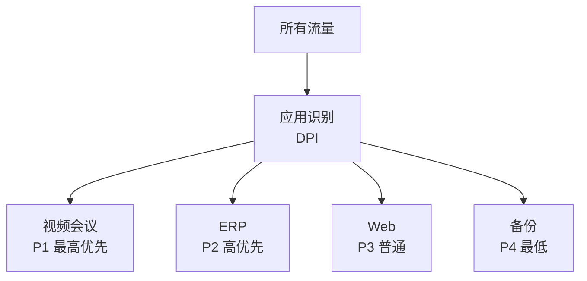

# QoS 与流量工程

不是所有流量都相等。

## QoS 分类



## 链接带宽 100 Mbps

```
分配方案：
视频会议（P1）：20 Mbps（最少保证）
ERP（P2）：30 Mbps
Web（P3）：40 Mbps
备份（P4）：10 Mbps

拥塞时：
优先级高的保证带宽不减
其他流量被限制
```

## 实现机制

| 机制 | 说明 |
|-----|------|
| 标记（Marking） | 标记数据包优先级 |
| 分类（Classification） | 识别应用和用户 |
| 队列（Queue） | 按优先级排队 |
| 整形（Shaping） | 限制总速率 |
| 调度（Scheduling） | 决定转发顺序 |

在 SD-WAN 中，基于应用的 QoS 非常重要。

推荐阅读：[网络性能优化](/guide/qos/performance)
