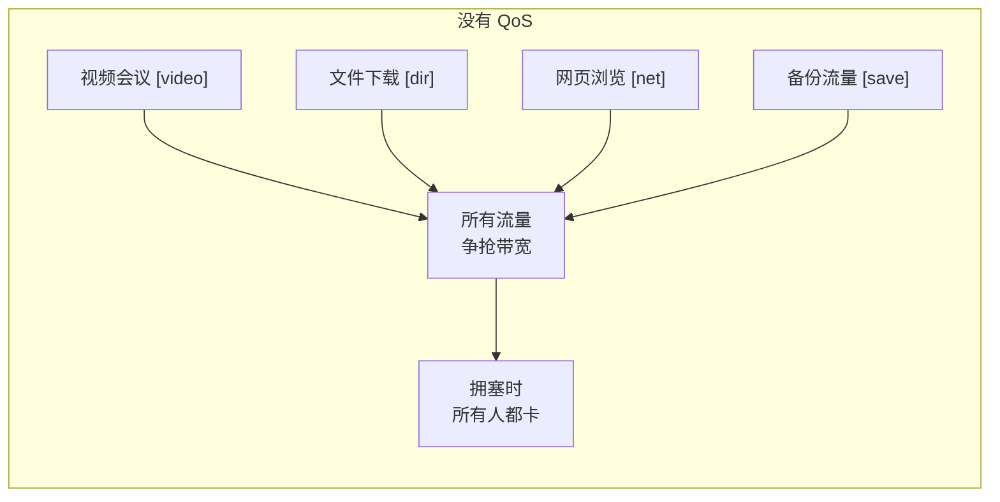
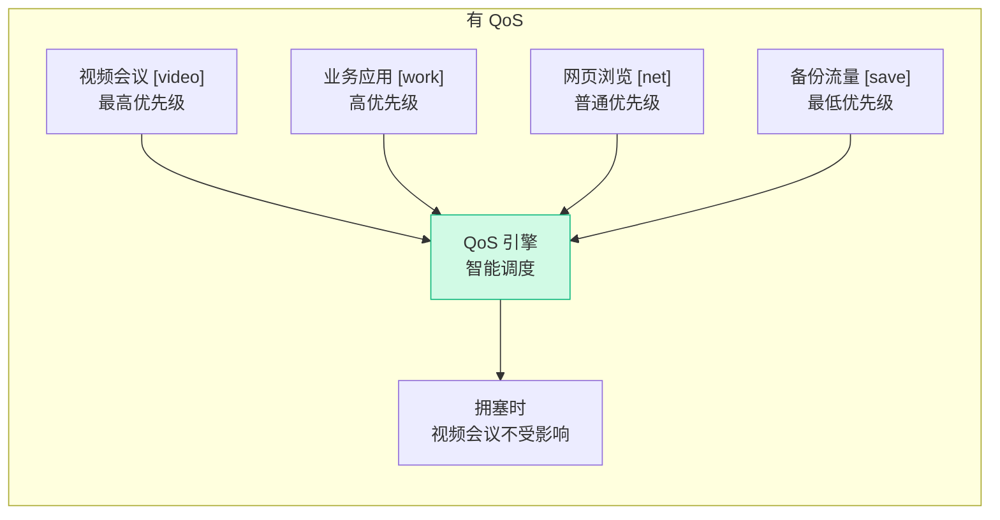
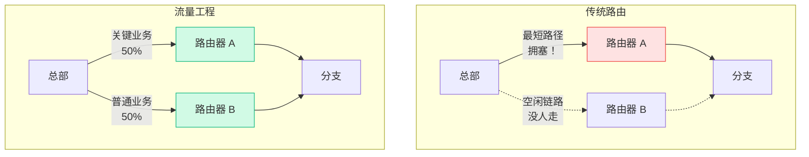

# QoS 与流量工程

## 什么是 QoS？

QoS（Quality of Service，服务质量）本质上是**在有限的网络资源下做优先级管理**。

网络带宽是有限的，就像一条高速公路只有那么多车道。QoS 做的事情是：给救护车开辟专用通道，让普通货车走一般车道，禁止超载车辆上路。

## QoS 的三种模型

| 模型 | 原理 | 复杂度 | 应用场景 |
|-----|------|-------|---------|
| **Best Effort** | 不做任何区分 | 无 | 互联网默认模型 |
| **IntServ** | 端到端资源预留（RSVP） | 极高 | 理论上完美，实际几乎不用 |
| **DiffServ** | 按标记分类，逐跳处理 | 中等 | **企业网络主流方案** |

DiffServ 是实际使用最多的，核心思想：在数据包上"贴标签"（DSCP），路由器根据标签决定优先级。

## DSCP 标记体系

DSCP（Differentiated Services Code Point）是 IP 包头中 6 位字段，定义了 64 种优先级。

| DSCP 值 | 名称 | 用途 | 丢包优先级 |
|---------|------|------|-----------|
| **EF (46)** | Expedited Forwarding | 语音、视频会议 | 最低丢包率 |
| **AF41 (34)** | Assured Forwarding | 关键业务 | 低 |
| **AF31 (26)** | Assured Forwarding | 一般业务 | 中 |
| **AF21 (18)** | Assured Forwarding | 交互流量 | 中 |
| **CS1 (8)** | Scavenger | 备份、P2P | 高 |
| **DF (0)** | Default | 默认流量 | 最高 |

## QoS 处理流程

### 队列调度算法

| 算法 | 原理 | 优缺点 |
|-----|------|--------|
| **FIFO** | 先进先出 | 简单但无优先级 |
| **PQ** | 严格优先级队列 | 高优先级可能饿死低优先级 |
| **WFQ** | 加权公平队列 | 公平但配置复杂 |
| **CBWFQ** | 基于类的 WFQ | **最常用**，每个类保证最小带宽 |
| **LLQ** | 低延迟队列 = PQ + CBWFQ | **语音视频最佳**，EF 流量走 PQ |

## 流量工程

流量工程（Traffic Engineering）的目标是**让流量走最优路径**，而不仅仅是最短路径。

### SD-WAN 中的 QoS

SD-WAN 把 QoS 提升到了新高度：

- **应用识别**：不只看端口号，用 DPI 识别具体应用（Zoom、Teams、SAP）
- **动态路径选择**：实时检测链路质量，自动把高优先级流量切到最优链路
- **带宽保障**：为关键应用预留带宽，拥塞时自动降级非关键流量
- **SLA 监控**：持续监测延迟、丢包、抖动，违反 SLA 自动切换

## 关键性能指标

| 指标 | 含义 | 语音要求 | 视频要求 |
|-----|------|---------|---------|
| **延迟** | 单程传输时间 | < 150ms | < 200ms |
| **抖动** | 延迟的波动 | < 30ms | < 50ms |
| **丢包率** | 丢失数据包占比 | < 1% | < 2% |
| **带宽** | 可用传输速率 | 100 Kbps/路 | 2-8 Mbps/路 |

## 小结

QoS 不是"让网络更快"，而是"在有限的带宽下，让重要的东西先走"。在企业网络中，QoS 是保障业务体验的关键机制。

---

**推荐阅读**：
- [网络冗余与高可用](/guide/qos/redundancy) — 当链路出问题时怎么办
- [性能优化](/guide/qos/performance) — 从另一个角度提升网络性能
- [SD-WAN 智能路由](/guide/sdwan/routing) — SD-WAN 如何革新流量管理
