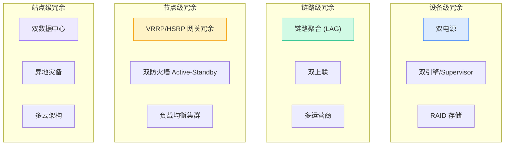
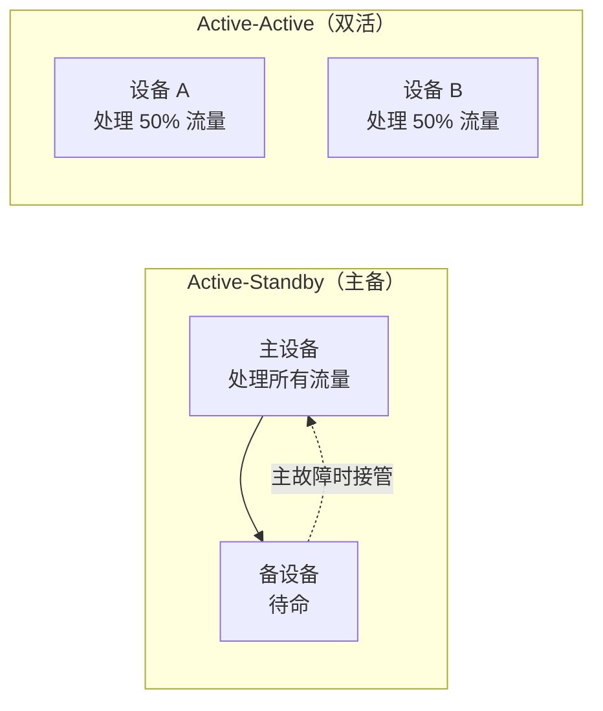
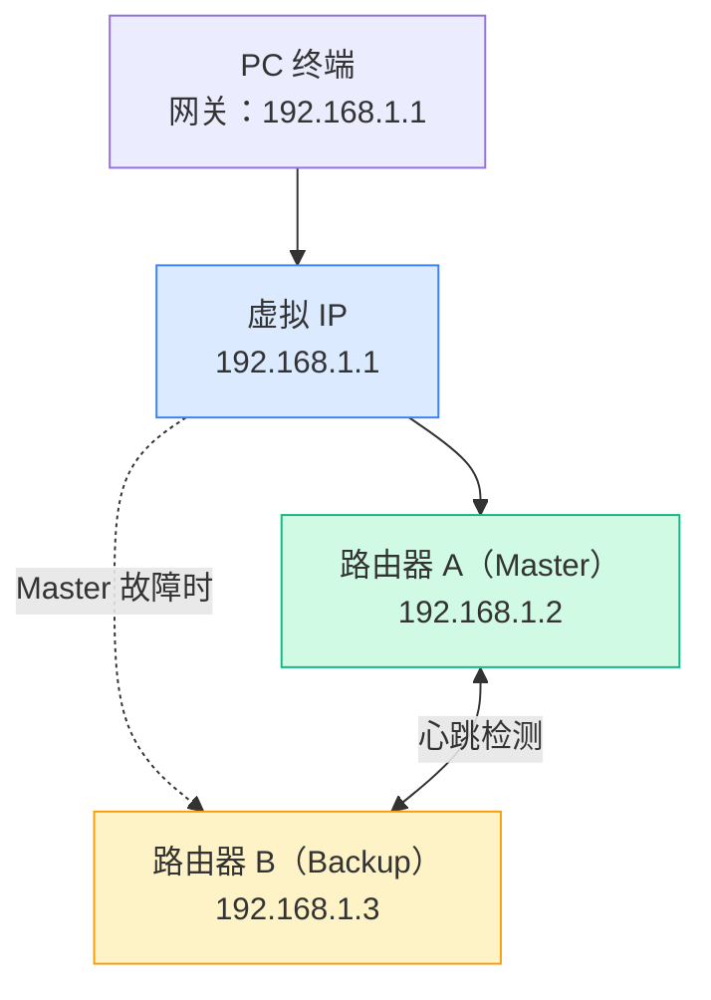

# 网络冗余与高可用

## 为什么需要冗余？

网络设备会坏，链路会断，运营商会抽风。**唯一的问题是什么时候，而不是会不会。**

冗余的核心思想：为每个关键组件准备"备胎"，当主路径出问题时，自动切换到备用路径。

## 高可用指标

| 可用性等级 | 年停机时间 | 俗称 | 适用场景 |
|-----------|-----------|------|---------|
| 99% | 3.65 天 | 两个 9 | 个人项目 |
| 99.9% | 8.77 小时 | 三个 9 | 一般企业 |
| 99.99% | 52.6 分钟 | **四个 9** | 关键业务 |
| 99.999% | 5.26 分钟 | **五个 9** | 金融/电信 |
| 99.9999% | 31.5 秒 | 六个 9 | 航空/军事 |

从三个 9 到四个 9，看起来只差了 0.09%，但年停机时间从 8 小时缩短到 52 分钟——架构复杂度和成本却可能翻倍。

## 冗余层级



## 故障切换模式



| 模式 | 优点 | 缺点 | 适用场景 |
|-----|------|------|---------|
| **Active-Standby** | 简单、切换明确 | 备设备闲置浪费 | 防火墙、数据库 |
| **Active-Active** | 资源利用率高 | 状态同步复杂 | 负载均衡、Web 层 |

## 关键冗余技术

### VRRP / HSRP：网关冗余



PC 永远只认虚拟 IP `192.168.1.1`，不管后面是哪台路由器在响应。切换对用户完全透明。

### 链路聚合（LAG）

把多条物理链路捆绑成一条逻辑链路：
- **带宽叠加**：4 × 1Gbps = 4Gbps 逻辑带宽
- **容错**：断一条不影响，流量自动分配到其他链路
- **协议**：LACP（IEEE 802.3ad）

### SD-WAN 的冗余优势

传统冗余的痛点：
- 配置复杂（VRRP、STP、ECMP 各种协议）
- 切换慢（STP 收敛需要 30-50 秒）
- 备用链路利用率低

SD-WAN 的做法：
- **多链路同时使用**：MPLS + 互联网 + 4G/5G，所有链路都跑流量
- **亚秒级切换**：检测到链路劣化，毫秒级切到其他链路
- **集中管理**：一个控制台配置所有站点的冗余策略

## 可用性计算

串联系统（所有组件必须正常）：
```
总可用性 = A1 × A2 × A3
例：0.999 × 0.999 × 0.999 = 0.997（三个 9 变成不到三个 9）
```

并联系统（任一组件正常即可）：
```
总可用性 = 1 - (1-A1) × (1-A2)
例：1 - (1-0.999) × (1-0.999) = 0.999999（两个三个 9 并联 = 六个 9）
```

**关键启示**：通过并联冗余，可以用普通设备达到极高可用性。

## 小结

冗余设计的本质是**用成本换确定性**。在设计时需要回答：
- 你的业务能接受多少停机时间？
- 你愿意为此投入多少成本？
- 切换时间要多快？

找到平衡点，不多不少。

---

**推荐阅读**：
- [QoS 与流量工程](/guide/qos/qos) — 冗余链路上的流量管理
- [SD-WAN 架构](/guide/sdwan/architecture) — SD-WAN 如何实现智能冗余
- [网络拓扑](/guide/architecture/topology) — 不同拓扑的冗余特性
