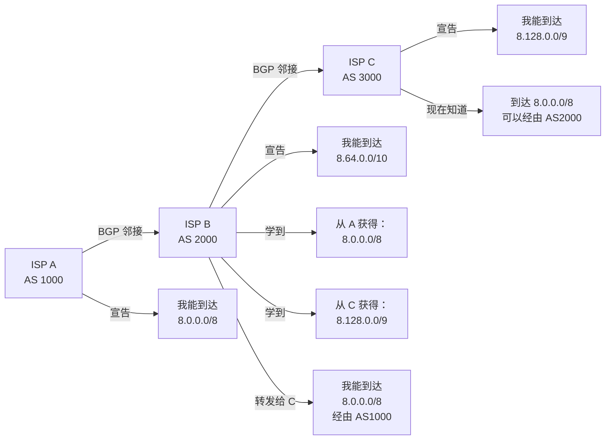
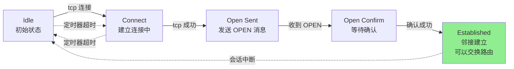
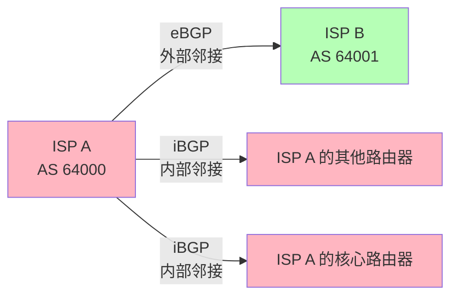

---
title: BGP 边界网关协议：互联网的路由基石
description: BGP 路径矢量、对等体与策略选路，自治系统间路由与全球互联网可达性基础。
---

# BGP 边界网关协议：互联网的路由基石

## 导言

BGP (Border Gateway Protocol) 是互联网的核心路由协议，负责在不同自治系统 (AS) 之间交换路由信息。作为路径矢量协议，BGP 不仅关注网络可达性，更注重策略控制和路径选择的灵活性。

理解 BGP 对于企业网络工程师至关重要，特别是在多出口、多供应商的复杂网络环境中。

## BGP 与全球互联的信任边界

2014 年 8 月，Indosat（印度尼西亚大型 ISP 之一）曾因错误宣告，向全球 BGP 系统发布异常前缀信息，引发流量被错误牵引、对等链路拥塞等连锁反应。此类事件的共同特点是：**BGP 建立在相邻 AS 之间的信任与正确配置之上**，若缺乏验证与变更管控，单点失误可能影响大范围可达性。

下面用简化时间线说明典型影响路径（教学示意）：

```
时间线（示意）：
T=0:     异常或错误的 BGP 宣告发出
T≈5min:  上游/对等体逐步接受并传播该前缀
T≈20min: 异常路径上的流量显著上升，链路或设备承压
T≈2h:    部分对等体可能采取隔离或限流等措施
T≈4h:    宣告撤销并逐步收敛后，业务逐步恢复
```

**核心问题**：BGP 报文本身并不回答“宣告方是否真正被授权持有该前缀”，因此需要 **RPKI** 等机制与运维流程配合（后文详述）。

### BGP 对等体之间的路径宣告（示意）



---

## BGP 基础概念

### 自治系统 (Autonomous System)

<RoughDiagram 
  title="自治系统与 BGP 对等关系" 
  :width="800" 
  :height="400" 
  :elements="[
    { type: 'rectangle', x: 100, y: 100, width: 180, height: 120, options: { fill: '#3b82f6', fillStyle: 'hachure' } },
    { type: 'text', x: 190, y: 130, text: 'AS 65001' },
    { type: 'text', x: 190, y: 150, text: '企业网络' },
    { type: 'text', x: 190, y: 170, text: '10.0.0.0/8' },
    { type: 'text', x: 190, y: 190, text: '172.16.0.0/12' },
    { type: 'rectangle', x: 520, y: 50, width: 180, height: 120, options: { fill: '#ef4444', fillStyle: 'dots' } },
    { type: 'text', x: 610, y: 80, text: 'AS 100' },
    { type: 'text', x: 610, y: 100, text: 'ISP A' },
    { type: 'text', x: 610, y: 120, text: '电信' },
    { type: 'text', x: 610, y: 140, text: '默认路由' },
    { type: 'rectangle', x: 520, y: 230, width: 180, height: 120, options: { fill: '#10b981', fillStyle: 'zigzag' } },
    { type: 'text', x: 610, y: 260, text: 'AS 200' },
    { type: 'text', x: 610, y: 280, text: 'ISP B' },
    { type: 'text', x: 610, y: 300, text: '联通' },
    { type: 'text', x: 610, y: 320, text: '备用链路' },
    { type: 'line', x: 280, y: 140, x2: 520, y2: 110, options: { stroke: '#f59e0b', strokeWidth: 3 } },
    { type: 'line', x: 280, y: 180, x2: 520, y2: 270, options: { stroke: '#f59e0b', strokeWidth: 3 } },
    { type: 'text', x: 350, y: 120, text: 'eBGP' },
    { type: 'text', x: 350, y: 250, text: 'eBGP' },
    { type: 'line', x: 610, y: 170, x2: 610, y2: 230, options: { stroke: '#8b5cf6', strokeWidth: 2 } },
    { type: 'text', x: 630, y: 200, text: 'eBGP' },
    { type: 'rectangle', x: 350, y: 320, width: 180, height: 60, options: { fill: '#f59e0b', fillStyle: 'cross-hatch' } },
    { type: 'text', x: 440, y: 345, text: 'Internet' },
    { type: 'text', x: 440, y: 360, text: '公网路由表' },
    { type: 'line', x: 530, y: 350, x2: 520, y2: 350 },
    { type: 'line', x: 700, y: 110, x2: 530, y2: 340 },
    { type: 'line', x: 700, y: 290, x2: 530, y2: 360 }
  ]"
/>

**AS 号码分配：**

<WideTable 
  title="BGP 自治系统号码分配" 
  :headers="['AS 范围', '类型', '分配机构', '使用场景']"
  :rows="[
    ['1-64511', '公共 AS 号', 'IANA/RIR', '• 互联网服务提供商<br/>• 大型企业<br/>• 教育机构<br/>• 政府机构'],
    ['64512-65534', '私有 AS 号 (16-bit)', 'RFC 6996', '• 企业内部使用<br/>• 测试环境<br/>• 不对外宣告<br/>• 类似私有 IP'],
    ['65535', '保留', 'RFC 7300', '• 协议保留<br/>• 不可使用'],
    ['65536-4199999999', '公共 AS 号 (32-bit)', 'IANA/RIR', '• 新分配的公共 AS<br/>• 支持更大地址空间<br/>• 向后兼容'],
    ['4200000000-4294967294', '私有 AS 号 (32-bit)', 'RFC 6996', '• 大型企业内部<br/>• 复杂网络拓扑<br/>• 更多私有 AS 需求'],
    ['4294967295', '保留', 'RFC 7300', '• 协议保留<br/>• 不可使用']
  ]"
  :columnWidths="['25%', '20%', '20%', '35%']"
/>

### BGP 会话类型

**eBGP vs iBGP：**

<RoughDiagram 
  title="eBGP 与 iBGP 会话示意" 
  :width="700" 
  :height="300" 
  :elements="[
    { type: 'rectangle', x: 50, y: 50, width: 250, height: 180, options: { fill: '#3b82f6', fillStyle: 'hachure', strokeWidth: 3 } },
    { type: 'text', x: 175, y: 80, text: 'AS 65001 (企业网络)' },
    { type: 'rectangle', x: 80, y: 110, width: 80, height: 50, options: { fill: '#10b981', fillStyle: 'dots' } },
    { type: 'text', x: 120, y: 130, text: 'Router A' },
    { type: 'text', x: 120, y: 145, text: '边界路由器' },
    { type: 'rectangle', x: 190, y: 110, width: 80, height: 50, options: { fill: '#10b981', fillStyle: 'dots' } },
    { type: 'text', x: 230, y: 130, text: 'Router B' },
    { type: 'text', x: 230, y: 145, text: '内部路由器' },
    { type: 'line', x: 160, y: 135, x2: 190, y2: 135, options: { stroke: '#f59e0b', strokeWidth: 3 } },
    { type: 'text', x: 170, y: 125, text: 'iBGP' },
    { type: 'rectangle', x: 400, y: 50, width: 250, height: 180, options: { fill: '#ef4444', fillStyle: 'hachure', strokeWidth: 3 } },
    { type: 'text', x: 525, y: 80, text: 'AS 100 (ISP)' },
    { type: 'rectangle', x: 480, y: 110, width: 80, height: 50, options: { fill: '#8b5cf6', fillStyle: 'zigzag' } },
    { type: 'text', x: 520, y: 130, text: 'ISP Router' },
    { type: 'text', x: 520, y: 145, text: 'PE 路由器' },
    { type: 'line', x: 300, y: 135, x2: 400, y2: 135, options: { stroke: '#dc2626', strokeWidth: 4 } },
    { type: 'text', x: 345, y: 125, text: 'eBGP' },
    { type: 'text', x: 100, y: 260, text: '• iBGP: 同一 AS 内部' },
    { type: 'text', x: 100, y: 275, text: '• AD = 200 (较低优先级)' },
    { type: 'text', x: 400, y: 260, text: '• eBGP: 不同 AS 之间' },
    { type: 'text', x: 400, y: 275, text: '• AD = 20 (较高优先级)' }
  ]"
/>

### 为何 BGP 使用 TCP？

与 OSPF 等主要在 AS 内工作的 IGP 不同，BGP 需要在 AS 之间可靠地传递大量 NLRI。全球路由表可达数十万前缀量级，每条前缀还可能携带多条路径与丰富路径属性；**TCP** 提供可靠传输、按序递交与流量控制，避免在“海量前缀 + 频繁更新”场景下，无连接协议难以承受的丢包、乱序与洪泛问题。

### BGP 状态机（Mermaid 示意）

下列状态迁移图与上文 RoughDiagram 互补，便于对照记忆：



### iBGP 全网状连接与路由反射器

**eBGP（外部 BGP）** 建立在不同 AS 之间：邻接通常对应跨 AS 的物理或逻辑链路，对端在策略上“信任度较低”，AS_PATH 会在跨越 AS 边界时被 prepend，用于防环与选路。

**iBGP（内部 BGP）** 在同一 AS 内同步从 eBGP 学来的前缀。若 AS 内有 N 台需互换外部路由的 iBGP 路由器且采用全互连，会话数约为 **N×(N−1)/2**，随规模上升，配置与收敛成本急剧增加。

**Route Reflector（路由反射器）**：指定少数路由器为反射器，其他 iBGP 发言者与反射器建立会话，由反射器在遵守 **RR 防环规则**（如 CLUSTER_LIST、ORIGINATOR_ID）的前提下反射更新，从而将会话数量降到约 **O(N)**，在大型 ISP 与企业核心网中广泛使用。

**iBGP 与 eBGP 邻接关系（示意）**：



---

## BGP 路径属性详解

### 必需路径属性

BGP 使用路径属性来描述路由信息和影响路径选择。

<WideTable 
  title="BGP 关键路径属性详解" 
  :headers="['属性名称', '类型', '功能描述', '路径选择影响']"
  :rows="[
    ['ORIGIN<br/>(起源)', 'Well-known<br/>Mandatory', '• IGP (i): 网络命令产生<br/>• EGP (e): 从 EGP 学习<br/>• Incomplete (?): 重分发', '第7步：IGP > EGP > Incomplete<br/>通常 IGP 起源的路由更可靠'],
    ['AS_PATH<br/>(AS 路径)', 'Well-known<br/>Mandatory', '• 记录路由经过的 AS<br/>• 防止环路<br/>• 路径矢量核心信息', '第6步：AS_PATH 最短的优先<br/>是 BGP 主要选路依据'],
    ['NEXT_HOP<br/>(下一跳)', 'Well-known<br/>Mandatory', '• 指明到达目的网络的下一跳<br/>• eBGP: 邻居 IP<br/>• iBGP: 保持原始下一跳', '影响路由可达性<br/>下一跳不可达则路由无效'],
    ['MED<br/>(多出口判别)', 'Optional<br/>Non-transitive', '• Multi-Exit Discriminator<br/>• 告诉邻居 AS 优选入口<br/>• 只在相邻 AS 间比较', '第5步：MED 值越小越优<br/>影响入向流量路径'],
    ['LOCAL_PREF<br/>(本地优先级)', 'Well-known<br/>Discretionary', '• 仅在 AS 内部传播<br/>• 控制出向流量路径<br/>• 默认值 100', '第2步：LOCAL_PREF 越高越优<br/>是 AS 内最重要的属性'],
    ['COMMUNITY<br/>(团体属性)', 'Optional<br/>Transitive', '• 路由标签机制<br/>• 支持策略批量应用<br/>• Well-known: NO_EXPORT 等', '配合路由策略使用<br/>实现灵活的路由控制']
  ]"
  :columnWidths="['18%', '18%', '32%', '32%']"
/>

### AS_PATH 在 eBGP 邻接间的增长（示意）

当前缀跨越多个 AS 传播时，每台边界路由器在向 **eBGP** 对等体发送更新时，通常会把 **本 AS 号** prepend 到 AS_PATH 最左侧（具体策略与路由反射、联盟等场景有关，此处为最简模型）：

```
原始宣告：8.0.0.0/8，起源 AS 3000
经 AS 2000 传给 AS 1000 时，AS_PATH 可能呈现为 [2000, 3000]
AS 1000 再向其他 eBGP 邻居转发时，可能变为 [1000, 2000, 3000]
```

这样，接收方若在自己的 AS 号已出现在 AS_PATH 中，即可判为环路并丢弃。

### BGP 路径选择算法

<RoughDiagram 
  title="BGP 最佳路径选择流程" 
  :width="750" 
  :height="500" 
  :elements="[
    { type: 'rectangle', x: 300, y: 30, width: 150, height: 40, options: { fill: '#3b82f6', fillStyle: 'solid' } },
    { type: 'text', x: 375, y: 50, text: '多条路由到同一目的地' },
    { type: 'rectangle', x: 300, y: 90, width: 150, height: 40, options: { fill: '#ef4444', fillStyle: 'hachure' } },
    { type: 'text', x: 375, y: 110, text: '1. 检查下一跳可达性' },
    { type: 'rectangle', x: 300, y: 150, width: 150, height: 40, options: { fill: '#f59e0b', fillStyle: 'dots' } },
    { type: 'text', x: 375, y: 170, text: '2. 最高 LOCAL_PREF' },
    { type: 'rectangle', x: 300, y: 210, width: 150, height: 40, options: { fill: '#10b981', fillStyle: 'zigzag' } },
    { type: 'text', x: 375, y: 230, text: '3. 本地起源优于学习路由' },
    { type: 'rectangle', x: 300, y: 270, width: 150, height: 40, options: { fill: '#8b5cf6', fillStyle: 'cross-hatch' } },
    { type: 'text', x: 375, y: 290, text: '4. 最短 AS_PATH' },
    { type: 'rectangle', x: 300, y: 330, width: 150, height: 40, options: { fill: '#ec4899', fillStyle: 'solid' } },
    { type: 'text', x: 375, y: 350, text: '5. 最低 MED (同邻居)' },
    { type: 'rectangle', x: 300, y: 390, width: 150, height: 40, options: { fill: '#06b6d4', fillStyle: 'hachure' } },
    { type: 'text', x: 375, y: 410, text: '6. eBGP 优于 iBGP' },
    { type: 'rectangle', x: 300, y: 450, width: 150, height: 40, options: { fill: '#84cc16', fillStyle: 'dots' } },
    { type: 'text', x: 375, y: 470, text: '7. 最低 IGP 度量值' },
    { type: 'line', x: 375, y: 70, x2: 375, y2: 90 },
    { type: 'line', x: 375, y: 130, x2: 375, y2: 150 },
    { type: 'line', x: 375, y: 190, x2: 375, y2: 210 },
    { type: 'line', x: 375, y: 250, x2: 375, y2: 270 },
    { type: 'line', x: 375, y: 310, x2: 375, y2: 330 },
    { type: 'line', x: 375, y: 370, x2: 375, y2: 390 },
    { type: 'line', x: 375, y: 430, x2: 375, y2: 450 },
    { type: 'text', x: 50, y: 150, text: '• 无效路由直接丢弃' },
    { type: 'text', x: 50, y: 210, text: '• AS 内部流量控制' },
    { type: 'text', x: 50, y: 270, text: '• 本地配置优先' },
    { type: 'text', x: 50, y: 330, text: '• 路径矢量核心' },
    { type: 'text', x: 50, y: 390, text: '• 入向流量控制' },
    { type: 'text', x: 50, y: 450, text: '• 外部路由优选' },
    { type: 'text', x: 500, y: 150, text: '• 100 (默认值)' },
    { type: 'text', x: 500, y: 210, text: '• network/aggregate > redistribute' },
    { type: 'text', x: 500, y: 270, text: '• 跳数越少越优' },
    { type: 'text', x: 500, y: 330, text: '• 只比较相同邻居 AS' },
    { type: 'text', x: 500, y: 390, text: '• AD: eBGP=20, iBGP=200' },
    { type: 'text', x: 500, y: 450, text: '• 到 BGP 下一跳的 IGP 开销' }
  ]"
/>

**路径选择实例分析：**

<WideTable 
  title="BGP 路径选择实例" 
  :headers="['步骤', 'Route A', 'Route B', 'Route C', '选择结果']"
  :rows="[
    ['目的网络', '10.1.0.0/16', '10.1.0.0/16', '10.1.0.0/16', '三条路由到同一目的地'],
    ['下一跳可达性', '✓ 可达', '✓ 可达', '✗ 不可达', 'Route C 被淘汰'],
    ['LOCAL_PREF', '150', '100', '-', 'Route A 获胜 (150 > 100)'],
    ['AS_PATH 长度', '3 (65001-100-200)', '4 (65001-300-400-200)', '-', 'Route A 继续领先'],
    ['ORIGIN', 'IGP (i)', 'EGP (e)', '-', 'Route A 确认最优'],
    ['<strong>最终选择</strong>', '<strong>✓ 最佳路由</strong>', '备用路由', '无效路由', '<strong>Route A 被安装到路由表</strong>']
  ]"
  :columnWidths="['20%', '25%', '25%', '20%', '10%']"
/>

**双入口场景下的 MED 含义（补充）**

当同一 **相邻 AS** 通过两条链路到本 AS，并希望对端将入向流量引导至带宽更充裕的链路时，可在两条路径上宣告不同 **MED**：例如链路 1 设置 MED=100、链路 2 设置 MED=200，使对端在比较同一邻居 AS 的多条路由时优先选择 MED 更小者。MED 的比较规则与适用范围须与上文路径选择步骤及厂商文档一致，避免跨邻居 AS 误比较。

---

## BGP 会话建立与维护

### BGP 状态机

<RoughDiagram 
  title="BGP 有限状态机" 
  :width="800" 
  :height="400" 
  :elements="[
    { type: 'rectangle', x: 100, y: 50, width: 100, height: 60, options: { fill: '#6b7280', fillStyle: 'solid' } },
    { type: 'text', x: 150, y: 75, text: 'Idle' },
    { type: 'text', x: 150, y: 90, text: '初始状态' },
    { type: 'rectangle', x: 300, y: 50, width: 100, height: 60, options: { fill: '#f59e0b', fillStyle: 'hachure' } },
    { type: 'text', x: 350, y: 75, text: 'Connect' },
    { type: 'text', x: 350, y: 90, text: '尝试连接' },
    { type: 'rectangle', x: 500, y: 50, width: 100, height: 60, options: { fill: '#ef4444', fillStyle: 'dots' } },
    { type: 'text', x: 550, y: 75, text: 'Active' },
    { type: 'text', x: 550, y: 90, text: '主动连接' },
    { type: 'rectangle', x: 300, y: 150, width: 100, height: 60, options: { fill: '#8b5cf6', fillStyle: 'zigzag' } },
    { type: 'text', x: 350, y: 175, text: 'OpenSent' },
    { type: 'text', x: 350, y: 190, text: 'Open 已发送' },
    { type: 'rectangle', x: 500, y: 150, width: 100, height: 60, options: { fill: '#10b981', fillStyle: 'cross-hatch' } },
    { type: 'text', x: 550, y: 175, text: 'OpenConfirm' },
    { type: 'text', x: 550, y: 190, text: 'Open 已确认' },
    { type: 'rectangle', x: 300, y: 250, width: 100, height: 60, options: { fill: '#059669', fillStyle: 'solid' } },
    { type: 'text', x: 350, y: 275, text: 'Established' },
    { type: 'text', x: 350, y: 290, text: '会话建立' },
    { type: 'line', x: 200, y: 80, x2: 300, y2: 80, options: { stroke: '#3b82f6', strokeWidth: 2 } },
    { type: 'line', x: 400, y: 80, x2: 500, y2: 80, options: { stroke: '#3b82f6', strokeWidth: 2 } },
    { type: 'line', x: 350, y: 110, x2: 350, y2: 150, options: { stroke: '#3b82f6', strokeWidth: 2 } },
    { type: 'line', x: 400, y: 180, x2: 500, y2: 180, options: { stroke: '#3b82f6', strokeWidth: 2 } },
    { type: 'line', x: 350, y: 210, x2: 350, y2: 250, options: { stroke: '#3b82f6', strokeWidth: 2 } },
    { type: 'text', x: 230, y: 70, text: 'Start' },
    { type: 'text', x: 430, y: 70, text: 'Fail' },
    { type: 'text', x: 360, y: 130, text: 'TCP Success' },
    { type: 'text', x: 430, y: 170, text: 'Open Received' },
    { type: 'text', x: 360, y: 230, text: 'Keepalive' },
    { type: 'text', x: 650, y: 100, text: '定时器触发:' },
    { type: 'text', x: 650, y: 120, text: '• ConnectRetry: 120s' },
    { type: 'text', x: 650, y: 140, text: '• Hold Time: 180s' },
    { type: 'text', x: 650, y: 160, text: '• Keepalive: 60s' },
    { type: 'text', x: 650, y: 180, text: '• Route Refresh: 可选' }
  ]"
/>

### BGP 消息类型

<WideTable 
  title="BGP 消息类型与功能" 
  :headers="['消息类型', '消息长度', '发送时机', '主要字段', '功能描述']"
  :rows="[
    ['OPEN<br/>(打开消息)', '最少 29 字节', '会话建立时', '• BGP Version (4)<br/>• AS Number<br/>• Hold Time<br/>• BGP Identifier<br/>• Optional Parameters', '协商 BGP 会话参数<br/>交换能力信息<br/>建立邻居关系'],
    ['UPDATE<br/>(更新消息)', '变长', '路由变化时', '• Withdrawn Routes<br/>• Path Attributes<br/>• Network Layer<br/>&nbsp;&nbsp;Reachability Info', '宣告新路由<br/>撤销无效路由<br/>更新路径属性'],
    ['NOTIFICATION<br/>(通知消息)', '最少 21 字节', '发生错误时', '• Error Code<br/>• Error Subcode<br/>• Data (可选)', '报告错误信息<br/>关闭 BGP 会话<br/>错误诊断'],
    ['KEEPALIVE<br/>(保活消息)', '固定 19 字节', '定期发送', '• 只有 BGP Header<br/>• 无额外字段', '维持会话活跃<br/>确认 OPEN 消息<br/>防止会话超时'],
    ['ROUTE-REFRESH<br/>(路由刷新)', '固定 23 字节', '按需发送', '• AFI (地址族标识)<br/>• Reserved<br/>• SAFI (子地址族)', '请求重新发送路由<br/>支持多协议扩展<br/>增量更新']
  ]"
  :columnWidths="['18%', '15%', '18%', '25%', '24%']"
/>

---

## BGP 策略控制

### 路由策略工具

BGP 提供了丰富的策略控制机制来实现灵活的路由控制。

<WideTable 
  title="BGP 路由策略工具对比" 
  :headers="['策略工具', '工作机制', '应用场景', '配置复杂度', '灵活性']"
  :rows="[
    ['Prefix List<br/>(前缀列表)', '基于网络前缀和掩码长度<br/>的精确或范围匹配', '• 过滤特定网段<br/>• 防止默认路由泄露<br/>• 聚合路由控制', '低<br/>容易配置和维护', '中等<br/>仅支持前缀匹配'],
    ['AS Path Filter<br/>(AS 路径过滤)', '基于正则表达式匹配<br/>AS_PATH 属性', '• 防止特定 AS 路由<br/>• 本地 AS 路由识别<br/>• 路径长度控制', '中等<br/>需要正则表达式', '高<br/>灵活的路径匹配'],
    ['Route Map<br/>(路由映射)', '条件匹配 + 动作执行<br/>的复合策略工具', '• 复杂策略实现<br/>• 属性修改<br/>• 多条件组合', '高<br/>需要深入理解', '很高<br/>支持各种策略'],
    ['Community Filter<br/>(团体过滤)', '基于 Community 属性<br/>的标签式过滤', '• 批量路由管理<br/>• 供应商策略<br/>• 路由分类', '中等<br/>需要团体规划', '高<br/>灵活的标签机制'],
    ['Distribute List<br/>(分发列表)', '与 ACL 结合的<br/>简单过滤机制', '• 基础过滤需求<br/>• 与其他协议兼容<br/>• 简单策略', '低<br/>基于现有 ACL', '低<br/>功能相对简单']
  ]"
  :columnWidths="['18%', '22%', '22%', '18%', '20%']"
/>

### 团体属性 (Community) 应用

Community 是 BGP 中强大的路由标签机制，允许运营商和企业实现灵活的路由策略。

<RoughDiagram 
  title="BGP Community 应用示例" 
  :width="800" 
  :height="400" 
  :elements="[
    { type: 'rectangle', x: 50, y: 50, width: 200, height: 100, options: { fill: '#3b82f6', fillStyle: 'hachure' } },
    { type: 'text', x: 150, y: 80, text: 'Enterprise AS65001' },
    { type: 'text', x: 150, y: 100, text: '10.0.0.0/8' },
    { type: 'text', x: 150, y: 120, text: 'Community: 65001:100' },
    { type: 'text', x: 150, y: 135, text: '(客户路由标识)' },
    { type: 'rectangle', x: 550, y: 50, width: 200, height: 100, options: { fill: '#ef4444', fillStyle: 'dots' } },
    { type: 'text', x: 650, y: 80, text: 'ISP AS100' },
    { type: 'text', x: 650, y: 100, text: 'Transit Provider' },
    { type: 'text', x: 650, y: 120, text: 'Community: 100:80' },
    { type: 'text', x: 650, y: 135, text: '(LOCAL_PREF=80)' },
    { type: 'rectangle', x: 300, y: 200, width: 200, height: 100, options: { fill: '#10b981', fillStyle: 'zigzag' } },
    { type: 'text', x: 400, y: 230, text: 'Peer AS200' },
    { type: 'text', x: 400, y: 250, text: 'Internet Exchange' },
    { type: 'text', x: 400, y: 270, text: 'Community: 100:120' },
    { type: 'text', x: 400, y: 285, text: '(LOCAL_PREF=120)' },
    { type: 'line', x: 250, y: 100, x2: 550, y2: 100, options: { stroke: '#f59e0b', strokeWidth: 3 } },
    { type: 'line', x: 550, y: 150, x2: 450, y2: 200, options: { stroke: '#8b5cf6', strokeWidth: 3 } },
    { type: 'text', x: 350, y: 90, text: 'eBGP + Community' },
    { type: 'text', x: 480, y: 175, text: 'eBGP + Community' },
    { type: 'text', x: 100, y: 350, text: 'Community 策略示例:' },
    { type: 'text', x: 100, y: 370, text: '• 65001:100 → 客户路由，LOCAL_PREF=100' },
    { type: 'text', x: 400, y: 350, text: '• 100:80 → 备用链路，LOCAL_PREF=80' },
    { type: 'text', x: 400, y: 370, text: '• 100:120 → 主用链路，LOCAL_PREF=120' }
  ]"
/>

**Well-known Communities：**

<WideTable 
  title="BGP Well-known Community 属性" 
  :headers="['Community 值', '十六进制', '功能描述', '应用场景']"
  :rows="[
    ['NO_EXPORT<br/>65535:65281', '0xFFFFFF01', '不向 eBGP 邻居宣告<br/>仅在本 AS 内传播', '• 内部路由保护<br/>• 防止路由泄露<br/>• AS 边界控制'],
    ['NO_ADVERTISE<br/>65535:65282', '0xFFFFFF02', '不向任何邻居宣告<br/>仅在本路由器有效', '• 路由黑洞<br/>• 本地路由标记<br/>• 临时路由抑制'],
    ['NO_EXPORT_SUBCONFED<br/>65535:65283', '0xFFFFFF03', '不向联邦外部宣告<br/>仅在联邦内部传播', '• 联邦内部路由<br/>• 子 AS 隔离<br/>• 联邦边界控制'],
    ['PLANNED_SHUT<br/>65535:0', '0xFFFF0000', '计划关闭的链路<br/>降低路由优先级', '• 链路维护<br/>• 优雅关闭<br/>• 流量迁移']
  ]"
  :columnWidths="['25%', '20%', '30%', '25%']"
/>

---

## EVPN 与 BGP 扩展

### EVPN (Ethernet VPN) 概述

EVPN 是基于 BGP 的二层 VPN 解决方案，使用 BGP 作为控制平面来分发二层可达性和转发信息。

<RoughDiagram 
  title="EVPN 网络架构" 
  :width="800" 
  :height="400" 
  :elements="[
    { type: 'rectangle', x: 50, y: 100, width: 150, height: 80, options: { fill: '#3b82f6', fillStyle: 'hachure' } },
    { type: 'text', x: 125, y: 125, text: 'Site A' },
    { type: 'text', x: 125, y: 140, text: 'PE1 Router' },
    { type: 'text', x: 125, y: 155, text: 'VTEP 10.1.1.1' },
    { type: 'rectangle', x: 600, y: 100, width: 150, height: 80, options: { fill: '#3b82f6', fillStyle: 'hachure' } },
    { type: 'text', x: 675, y: 125, text: 'Site B' },
    { type: 'text', x: 675, y: 140, text: 'PE2 Router' },
    { type: 'text', x: 675, y: 155, text: 'VTEP 10.1.1.2' },
    { type: 'rectangle', x: 300, y: 50, width: 200, height: 60, options: { fill: '#ef4444', fillStyle: 'dots' } },
    { type: 'text', x: 400, y: 75, text: 'BGP Route Reflector' },
    { type: 'text', x: 400, y: 90, text: 'EVPN Control Plane' },
    { type: 'rectangle', x: 300, y: 200, width: 200, height: 60, options: { fill: '#10b981', fillStyle: 'zigzag' } },
    { type: 'text', x: 400, y: 225, text: 'IP/MPLS Core' },
    { type: 'text', x: 400, y: 240, text: 'VXLAN Data Plane' },
    { type: 'line', x: 200, y: 140, x2: 300, y2: 80, options: { stroke: '#f59e0b', strokeWidth: 2 } },
    { type: 'line', x: 600, y: 140, x2: 500, y2: 80, options: { stroke: '#f59e0b', strokeWidth: 2 } },
    { type: 'line', x: 200, y: 140, x2: 300, y2: 230, options: { stroke: '#8b5cf6', strokeWidth: 3 } },
    { type: 'line', x: 600, y: 140, x2: 500, y2: 230, options: { stroke: '#8b5cf6', strokeWidth: 3 } },
    { type: 'text', x: 220, y: 110, text: 'BGP EVPN' },
    { type: 'text', x: 220, y: 190, text: 'VXLAN Tunnel' },
    { type: 'text', x: 520, y: 110, text: 'BGP EVPN' },
    { type: 'text', x: 520, y: 190, text: 'VXLAN Tunnel' },
    { type: 'rectangle', x: 75, y: 300, width: 100, height: 50, options: { fill: '#6b7280', fillStyle: 'solid' } },
    { type: 'text', x: 125, y: 320, text: 'Host A' },
    { type: 'text', x: 125, y: 335, text: 'MAC: aa:aa' },
    { type: 'rectangle', x: 625, y: 300, width: 100, height: 50, options: { fill: '#6b7280', fillStyle: 'solid' } },
    { type: 'text', x: 675, y: 320, text: 'Host B' },
    { type: 'text', x: 675, y: 335, text: 'MAC: bb:bb' },
    { type: 'line', x: 125, y: 180, x2: 125, y2: 300 },
    { type: 'line', x: 675, y: 180, x2: 675, y2: 300 }
  ]"
/>

**EVPN 路由类型：**

<WideTable 
  title="EVPN BGP 路由类型" 
  :headers="['路由类型', 'Type 值', '功能描述', '携带信息']"
  :rows="[
    ['Ethernet AD Route<br/>(以太网自动发现)', 'Type 1', '发现同一个 ESI 的其他 PE<br/>支持多宿主场景', '• ESI (以太网段标识)<br/>• Ethernet Tag<br/>• MPLS Label'],
    ['MAC/IP Advertisement<br/>(MAC/IP 通告)', 'Type 2', '分发主机的 MAC 和 IP 信息<br/>实现二三层绑定', '• MAC Address<br/>• IP Address (可选)<br/>• VNI/MPLS Label<br/>• ESI'],
    ['Inclusive Multicast Route<br/>(组播路由)', 'Type 3', '建立组播分发树<br/>支持 BUM 流量处理', '• Originating Router IP<br/>• VNI/MPLS Label<br/>• Multicast Tunnel Type'],
    ['Ethernet Segment Route<br/>(以太网段路由)', 'Type 4', '选举指定转发器 (DF)<br/>防止多宿主环路', '• ESI<br/>• Originating Router IP'],
    ['IP Prefix Route<br/>(IP 前缀路由)', 'Type 5', '分发子网路由信息<br/>支持跨 VNI 路由', '• IP Prefix<br/>• Gateway IP<br/>• VNI/MPLS Label']
  ]"
  :columnWidths="['25%', '12%', '30%', '33%']"
/>

### MP-BGP 多协议扩展

多协议 BGP (MP-BGP) 通过可选路径属性支持除 IPv4 单播以外的其他协议族。

<WideTable 
  title="BGP 地址族 (AFI/SAFI) 支持" 
  :headers="['地址族', 'AFI', 'SAFI', '应用场景', '特殊属性']"
  :rows="[
    ['IPv4 Unicast', '1', '1', '• Internet 路由<br/>• 企业内部路由<br/>• 默认路由', '传统 BGP-4<br/>无需 MP-BGP'],
    ['IPv6 Unicast', '2', '1', '• IPv6 Internet 路由<br/>• 双栈网络<br/>• IPv6 过渡', 'MP_REACH_NLRI<br/>MP_UNREACH_NLRI'],
    ['VPNv4 Unicast', '1', '128', '• MPLS L3VPN<br/>• 企业 VPN 服务<br/>• 运营商 VPN', 'Route Distinguisher<br/>Route Target<br/>VPN Label'],
    ['EVPN', '25', '70', '• 数据中心互连<br/>• VXLAN 控制平面<br/>• 二层 VPN 服务', 'ESI<br/>Ethernet Tag<br/>MAC Mobility'],
    ['L2VPN VPLS', '25', '65', '• 传统 VPLS<br/>• 二层以太网服务<br/>• 广域网二层连接', 'Layer-2 Info<br/>Control Flags<br/>MTU'],
    ['Flow Specification', '1/2', '133/134', '• DDoS 缓解<br/>• 流量工程<br/>• 安全策略分发', 'Flow Components<br/>Traffic Actions<br/>Redirect Communities']
  ]"
  :columnWidths="['20%', '8%', '8%', '32%', '32%']"
/>

---

## 真实世界中的 BGP 故障模式

### 子前缀劫持（最长前缀优先的副作用）

若合法持有者宣告较粗前缀（例如某大型内容网络宣告 `8.8.0.0/16`），攻击者或误配置方宣告**更具体**的子前缀（例如 `8.8.8.0/24`），在最长前缀匹配规则下，指向该子网的流量可能被牵引到错误路径。历史上曾有运营商误宣告知名前缀子网，导致区域可达性异常。**缓解思路**包括 RPKI/ROA 校验、前缀过滤、与上游的对等体策略，以及对异常宣告的监控告警。

### 路由闪烁（Route Flap）与抑制

边界链路质量不稳定时，BGP 可能对同一前缀频繁发送 **Withdraw** 与 **Update**，引发控制面与转发面震荡，表现为间歇性不可达、CPU 占用升高。**BGP Route Dampening（路由衰减）**可对频繁震荡的前缀临时抑制；同时应优先**改善物理链路/光模块/端口**，并审慎调整 **Keepalive/Hold Time** 等定时器，避免将工程问题完全交给协议“硬扛”。

---

## BGP 安全机制

### BGP 的信任模型与设计局限

BGP 在早期互联网规模下强调互通与策略表达，**并不内建**对“宣告是否被授权”的密码学证明，也**不加密** UPDATE 内容；安全依赖对等关系、过滤策略、RPKI 与运维流程。其后果包括：在具备相应 AS 与对等条件时，错误或恶意的宣告可能影响他人选路；中间路径上的篡改风险需通过 TCP-AO、控制面隔离等工程手段降低。

### RPKI (Resource Public Key Infrastructure)

RPKI 提供了验证 BGP 路由宣告合法性的框架，防止路由劫持和错误宣告。

<RoughDiagram 
  title="RPKI 验证框架" 
  :width="800" 
  :height="350" 
  :elements="[
    { type: 'rectangle', x: 300, y: 30, width: 200, height: 60, options: { fill: '#3b82f6', fillStyle: 'solid' } },
    { type: 'text', x: 400, y: 55, text: 'IANA (Root CA)' },
    { type: 'text', x: 400, y: 70, text: '根证书颁发机构' },
    { type: 'rectangle', x: 150, y: 130, width: 150, height: 60, options: { fill: '#ef4444', fillStyle: 'hachure' } },
    { type: 'text', x: 225, y: 155, text: 'RIR (APNIC)' },
    { type: 'text', x: 225, y: 170, text: '区域注册机构' },
    { type: 'rectangle', x: 450, y: 130, width: 150, height: 60, options: { fill: '#ef4444', fillStyle: 'hachure' } },
    { type: 'text', x: 525, y: 155, text: 'RIR (ARIN)' },
    { type: 'text', x: 525, y: 170, text: '区域注册机构' },
    { type: 'rectangle', x: 50, y: 230, width: 120, height: 60, options: { fill: '#10b981', fillStyle: 'dots' } },
    { type: 'text', x: 110, y: 255, text: 'ISP A' },
    { type: 'text', x: 110, y: 270, text: 'AS 100' },
    { type: 'rectangle', x: 200, y: 230, width: 120, height: 60, options: { fill: '#10b981', fillStyle: 'dots' } },
    { type: 'text', x: 260, y: 255, text: 'ISP B' },
    { type: 'text', x: 260, y: 270, text: 'AS 200' },
    { type: 'rectangle', x: 480, y: 230, width: 120, height: 60, options: { fill: '#10b981', fillStyle: 'dots' } },
    { type: 'text', x: 540, y: 255, text: 'Enterprise' },
    { type: 'text', x: 540, y: 270, text: 'AS 65001' },
    { type: 'rectangle', x: 630, y: 230, width: 120, height: 60, options: { fill: '#10b981', fillStyle: 'dots' } },
    { type: 'text', x: 690, y: 255, text: 'Cloud Provider' },
    { type: 'text', x: 690, y: 270, text: 'AS 64512' },
    { type: 'line', x: 350, y: 90, x2: 225, y2: 130 },
    { type: 'line', x: 450, y: 90, x2: 525, y2: 130 },
    { type: 'line', x: 180, y: 190, x2: 110, y2: 230 },
    { type: 'line', x: 225, y: 190, x2: 260, y2: 230 },
    { type: 'line', x: 500, y: 190, x2: 540, y2: 230 },
    { type: 'line', x: 550, y: 190, x2: 690, y2: 230 },
    { type: 'text', x: 50, y: 320, text: 'ROA 创建流程:' },
    { type: 'text', x: 50, y: 340, text: '1. 资源持有者向 RIR 申请证书' },
    { type: 'text', x: 300, y: 320, text: '2. 创建 ROA (Route Origin Authorization)' },
    { type: 'text', x: 300, y: 340, text: '3. 发布到 RPKI Repository' },
    { type: 'text', x: 550, y: 320, text: '4. BGP 路由器验证 ROA' },
    { type: 'text', x: 550, y: 340, text: '5. 基于验证结果做路由决策' }
  ]"
/>

**RPKI 验证状态：**

<WideTable 
  title="BGP 路由 RPKI 验证状态" 
  :headers="['验证状态', '描述', '匹配条件', '推荐动作']"
  :rows="[
    ['Valid<br/>(有效)', '路由与 ROA 记录完全匹配', '• 前缀匹配<br/>• AS 号匹配<br/>• 前缀长度在允许范围内', '• 正常接受和宣告<br/>• LOCAL_PREF 保持默认<br/>• 优选此类路由'],
    ['Invalid<br/>(无效)', '路由与 ROA 记录冲突', '• 前缀匹配但 AS 不匹配<br/>• 前缀长度超出 ROA 限制<br/>• 明确的不匹配记录', '• 降低 LOCAL_PREF<br/>• 标记为可疑路由<br/>• 考虑拒绝接受'],
    ['Not Found<br/>(未找到)', '没有对应的 ROA 记录', '• RPKI 数据库中无记录<br/>• 资源持有者未创建 ROA<br/>• ROA 尚未同步', '• 保持现状<br/>• 可配置策略处理<br/>• 逐步收紧验证']
  ]"
  :columnWidths="['20%', '25%', '35%', '20%']"
/>

**RPKI 部署现状（量级参考）**

大型内容与云厂商普遍积极部署 RPKI 与基于验证结果的路由策略；全球范围内，前缀或路由的 ROA 覆盖比例随时间与测量口径变化，公开报告中常见量级约为 **35%–40%**（仅供趋势理解，实施时以现网数据与 RIR 工具为准）。在未覆盖区域，仍须依赖前缀过滤、最大前缀限制、对等监控等传统手段。

### BGP-SEC (BGP Security)

BGP-SEC 是下一代 BGP 安全机制，通过数字签名保护整个 AS 路径的完整性。

### 历史安全与运维事件（节选）

- **2008**：巴基斯坦电信相关路由配置导致 YouTube 前缀被错误牵引，影响全球可达性。  
- **2014**：东南亚区域因运营商异常宣告，影响 Google 等服务访问（与前文 Indosat 类事件同属前缀宣告失误范畴）。  
- **2021**：某大型社交网络的全球中断事件中，**内部 BGP 配置变更**导致自有前缀从公网视角“消失”，说明 BGP 不仅是 ISP 之间的协议，也是超大规模数据中心与骨干网的核心控制面，变更需要严格的审核与回滚预案。

上述事件共同说明：**BGP 的稳定性依赖配置纪律、监控与多层级验证**，单靠“对等体彼此自觉”不足以支撑当今互联网规模。

---

## 企业 BGP 部署实践

### 多出口场景设计

<RoughDiagram 
  title="企业多出口 BGP 设计" 
  :width="800" 
  :height="450" 
  :elements="[
    { type: 'rectangle', x: 300, y: 200, width: 200, height: 100, options: { fill: '#3b82f6', fillStyle: 'hachure', strokeWidth: 3 } },
    { type: 'text', x: 400, y: 230, text: '企业数据中心' },
    { type: 'text', x: 400, y: 250, text: 'AS 65001' },
    { type: 'text', x: 400, y: 270, text: '10.0.0.0/8' },
    { type: 'text', x: 400, y: 290, text: '172.16.0.0/12' },
    { type: 'rectangle', x: 100, y: 50, width: 150, height: 80, options: { fill: '#ef4444', fillStyle: 'dots' } },
    { type: 'text', x: 175, y: 80, text: 'ISP A (电信)' },
    { type: 'text', x: 175, y: 100, text: 'AS 100' },
    { type: 'text', x: 175, y: 115, text: '主要出口' },
    { type: 'rectangle', x: 550, y: 50, width: 150, height: 80, options: { fill: '#10b981', fillStyle: 'zigzag' } },
    { type: 'text', x: 625, y: 80, text: 'ISP B (联通)' },
    { type: 'text', x: 625, y: 100, text: 'AS 200' },
    { type: 'text', x: 625, y: 115, text: '备份出口' },
    { type: 'rectangle', x: 300, y: 350, width: 150, height: 80, options: { fill: '#f59e0b', fillStyle: 'cross-hatch' } },
    { type: 'text', x: 375, y: 380, text: 'IXP Peer' },
    { type: 'text', x: 375, y: 400, text: 'AS 300' },
    { type: 'text', x: 375, y: 415, text: '互联互通' },
    { type: 'line', x: 250, y: 220, x2: 200, y2: 130, options: { stroke: '#dc2626', strokeWidth: 4 } },
    { type: 'line', x: 500, y: 220, x2: 600, y2: 130, options: { stroke: '#059669', strokeWidth: 2 } },
    { type: 'line', x: 375, y: 300, x2: 375, y2: 350, options: { stroke: '#f59e0b', strokeWidth: 2 } },
    { type: 'text', x: 210, y: 170, text: '主用链路' },
    { type: 'text', x: 210, y: 185, text: 'LOCAL_PREF=120' },
    { type: 'text', x: 510, y: 170, text: '备用链路' },
    { type: 'text', x: 510, y: 185, text: 'LOCAL_PREF=80' },
    { type: 'text', x: 250, y: 325, text: '互联网交换点' },
    { type: 'text', x: 250, y: 340, text: 'LOCAL_PREF=100' },
    { type: 'rectangle', x: 50, y: 380, width: 100, height: 50, options: { fill: '#8b5cf6', fillStyle: 'solid' } },
    { type: 'text', x: 100, y: 400, text: 'BGP Router 1' },
    { type: 'text', x: 100, y: 415, text: '主边界路由器' },
    { type: 'rectangle', x: 650, y: 380, width: 100, height: 50, options: { fill: '#8b5cf6', fillStyle: 'solid' } },
    { type: 'text', x: 700, y: 400, text: 'BGP Router 2' },
    { type: 'text', x: 700, y: 415, text: '备边界路由器' },
    { type: 'line', x: 150, y: 380, x2: 300, y2: 280 },
    { type: 'line', x: 650, y: 380, x2: 500, y2: 280 }
  ]"
/>

### 负载分担策略

<WideTable 
  title="企业 BGP 负载分担策略" 
  :headers="['策略类型', '实现方法', '优势', '局限性', '适用场景']"
  :rows="[
    ['主备模式', '• 主链路 LOCAL_PREF=120<br/>• 备链路 LOCAL_PREF=80<br/>• 故障时自动切换', '• 配置简单<br/>• 故障快速切换<br/>• 链路状态清晰', '• 备链路带宽浪费<br/>• 单点故障风险<br/>• 无负载分担', '• 中小型企业<br/>• 成本敏感场景<br/>• 简单网络拓扑'],
    ['基于应用的分担', '• 不同应用不同出口<br/>• 基于源 IP 策略路由<br/>• Community 标记', '• 精细化控制<br/>• 带宽利用最大化<br/>• 符合业务需求', '• 配置复杂<br/>• 策略维护困难<br/>• 需要应用识别', '• 大型企业<br/>• 多业务场景<br/>• 复杂应用环境'],
    ['AS_PATH Prepending', '• 向备用 ISP 增加 AS 跳数<br/>• 影响入向流量选路<br/>• 动态调整比例', '• 实现流量比例控制<br/>• 对等互联友好<br/>• 标准协议支持', '• 无法精确控制<br/>• 依赖远端策略<br/>• 路径信息冗余', '• 多 ISP 对等<br/>• 入向流量工程<br/>• 负载均衡需求'],
    ['MED 调优', '• 不同前缀不同 MED<br/>• 影响邻居 AS 选路<br/>• 配合 Community 使用', '• 细粒度控制<br/>• 保持路径真实性<br/>• 运营商合作', '• 只影响单个邻居<br/>• 需要运营商配合<br/>• 有限的控制范围', '• 单一 ISP 多接入<br/>• 运营商合作<br/>• 精确流量控制']
  ]"
  :columnWidths="['18%', '22%', '20%', '20%', '20%']"
/>

### BGP 最佳实践

**配置安全加固：**

1. **邻居认证**
   ```cisco
   router bgp 65001
    neighbor 203.0.113.1 password cisco123
    neighbor 203.0.113.1 ttl-security hops 1
   ```

2. **前缀过滤**
   ```cisco
   ip prefix-list CUSTOMER_IN permit 10.0.0.0/8 le 24
   ip prefix-list CUSTOMER_IN permit 172.16.0.0/12 le 24
   ip prefix-list CUSTOMER_IN deny 0.0.0.0/0 le 32
   ```

3. **AS 路径过滤**
   ```cisco
   ip as-path access-list 1 permit ^$
   ip as-path access-list 1 permit ^65001_
   ```

**监控和故障排除：**

<WideTable 
  title="BGP 监控指标与故障排除" 
  :headers="['监控维度', '关键指标', '告警阈值', '故障排除方法']"
  :rows="[
    ['会话状态', '• BGP 会话状态<br/>• 会话建立时间<br/>• 会话中断次数', '• 会话断开 > 3次/天<br/>• 建立时间 > 60s<br/>• Flapping 检测', '• show ip bgp summary<br/>• show ip bgp neighbors<br/>• debug ip bgp events'],
    ['路由学习', '• 接收路由数量<br/>• 发送路由数量<br/>• 路由变化频率', '• 路由数量变化 > 20%<br/>• 频繁 UPDATE 消息<br/>• 路由震荡检测', '• show ip bgp rib-failure<br/>• show ip route bgp<br/>• BGP 路由表分析'],
    ['性能指标', '• UPDATE 处理延迟<br/>• 内存使用情况<br/>• CPU 使用率', '• 处理延迟 > 10s<br/>• 内存使用 > 80%<br/>• CPU 使用 > 80%', '• show processes cpu<br/>• show memory summary<br/>• BGP 性能调优'],
    ['路径选择', '• 最佳路径变化<br/>• 路径属性异常<br/>• 路由策略效果', '• 频繁最佳路径变化<br/>• 异常路径属性<br/>• 策略不匹配', '• show ip bgp<br/>• show ip bgp regexp<br/>• Route-map 调试']
  ]"
  :columnWidths="['20%', '25%', '25%', '30%']"
/>

---

## 总结与发展趋势

### BGP 在现代网络中的作用

BGP 作为互联网的路由基石，其重要性在云计算和 SD-WAN 时代不仅没有减弱，反而得到了加强：

1. **云网络互连**：多云架构需要 BGP 实现云间路由
2. **SD-WAN 集成**：许多 SD-WAN 方案使用 BGP 作为底层协议
3. **容器网络**：Kubernetes CNI 插件大量使用 BGP
4. **边缘计算**：边缘节点通过 BGP 宣告本地服务

### BGP 技术发展方向

<WideTable 
  title="BGP 技术发展趋势" 
  :headers="['技术方向', '当前状态', '发展趋势', '应用前景']"
  :rows="[
    ['BGP-LS<br/>(Link State)', '标准化完成<br/>厂商支持', '• 与 SDN 控制器集成<br/>• 网络拓扑自动发现<br/>• 流量工程优化', '• 网络可视化<br/>• 智能路由决策<br/>• 自动化运维'],
    ['Segment Routing', '部分部署<br/>逐步推广', '• SR-MPLS 成熟<br/>• SRv6 快速发展<br/>• 与 BGP 深度集成', '• 简化网络架构<br/>• 降低协议复杂度<br/>• 提升可编程性'],
    ['BGP Monitoring<br/>Protocol (BMP)', '标准发布<br/>工具支持', '• 实时监控能力增强<br/>• 与 AI/ML 结合<br/>• 安全分析集成', '• 网络智能分析<br/>• 异常检测<br/>• 预测性维护'],
    ['RPKI 部署', '逐步推广<br/>大厂先行', '• 验证覆盖率提升<br/>• 工具链成熟<br/>• 政策推动', '• 路由安全提升<br/>• 劫持防护<br/>• 信任体系建设'],
    ['AI 增强 BGP', '研究阶段<br/>概念验证', '• 智能路由选择<br/>• 异常行为检测<br/>• 自动策略生成', '• 自适应网络<br/>• 零接触运维<br/>• 智能故障恢复']
  ]"
  :columnWidths="['20%', '20%', '30%', '30%']"
/>

### 从全局视角理解 BGP 的韧性挑战

从互联网整体视角看，BGP 同时具备 **分布式韧性** 与 **缺乏中央审核** 的双重特征：没有单一中心能逐条“批准”全球宣告，错误配置或恶意宣告可能在传播范围内改变选路；撤销与收敛需要时间，恢复往往依赖多方的过滤与协作。与此同时，**RPKI、BMP、自动化变更与演练** 正在补齐传统信任模型的短板。对工程师而言：BGP 既决定公网可达性与性能，也要求严格的变更纪律与监控闭环。

BGP 作为互联网路由协议的基石，将继续在网络基础设施中发挥关键作用。掌握 BGP 的深层原理和实践技能，对于网络工程师来说至关重要。随着网络技术的不断发展，BGP 也在不断演进，融入新的安全机制、监控能力和智能化特性，以适应现代网络的需求。

## 推荐阅读

- [MPLS 和流量工程](/guide/advanced/mpls)
- [SD-WAN 概念](/guide/sdwan/concepts)