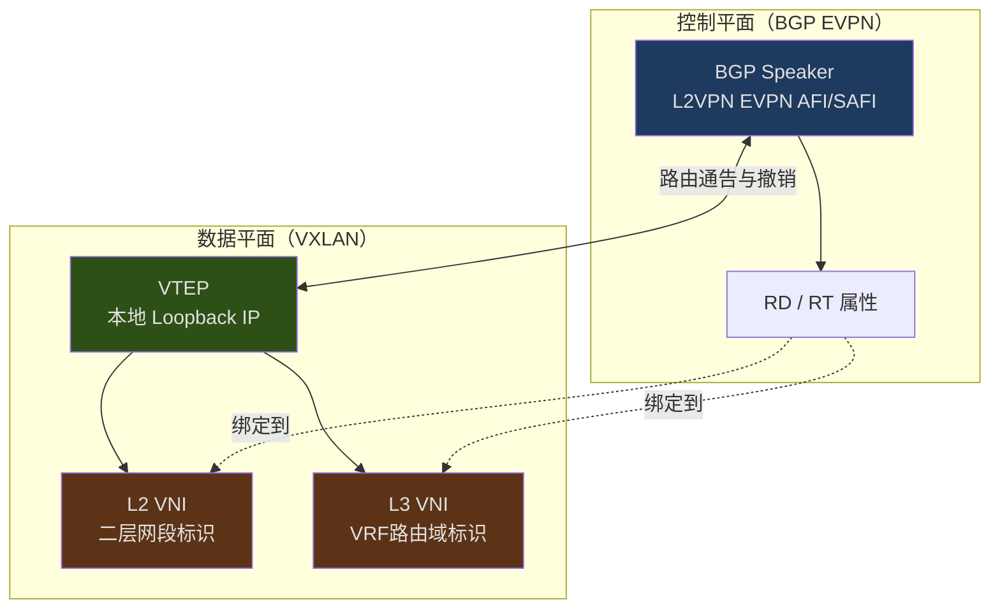
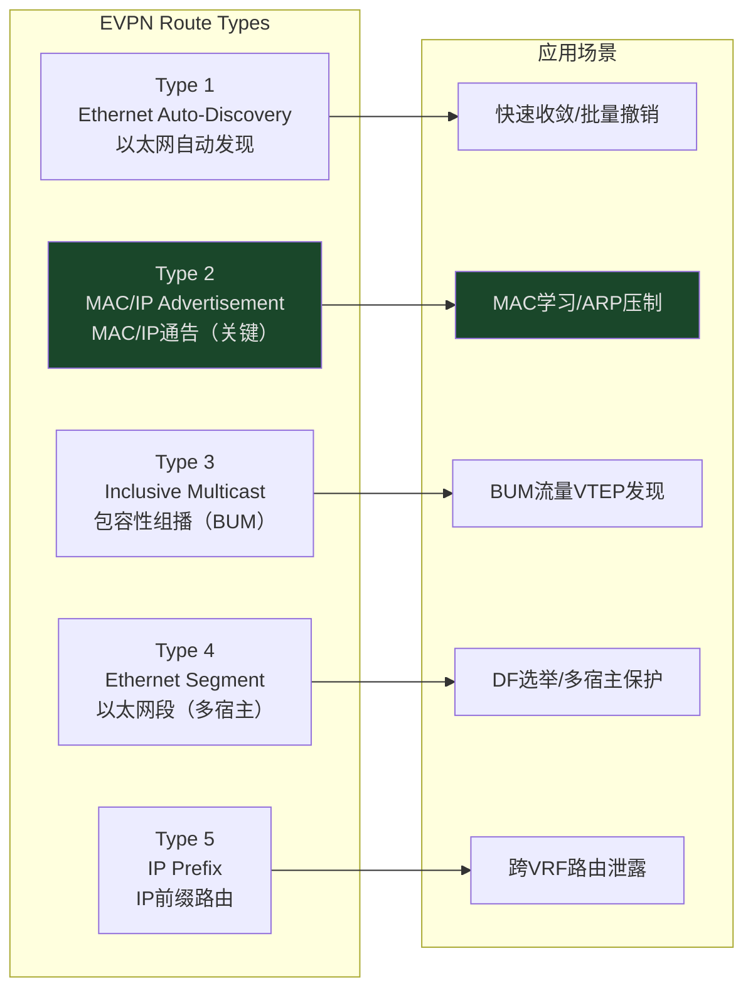
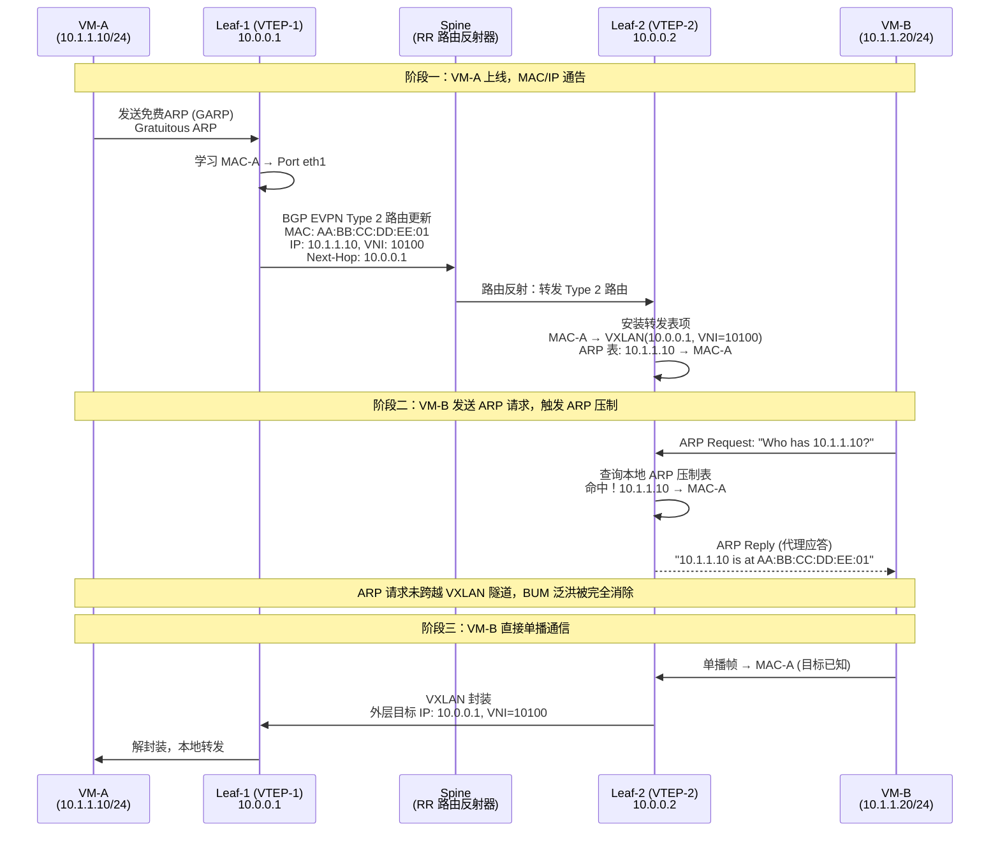
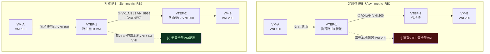
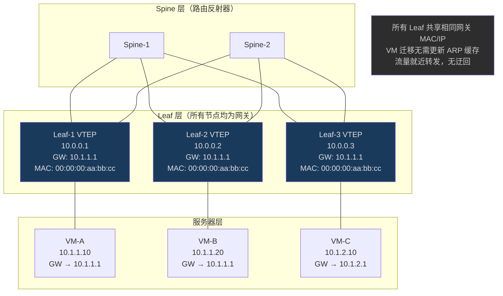
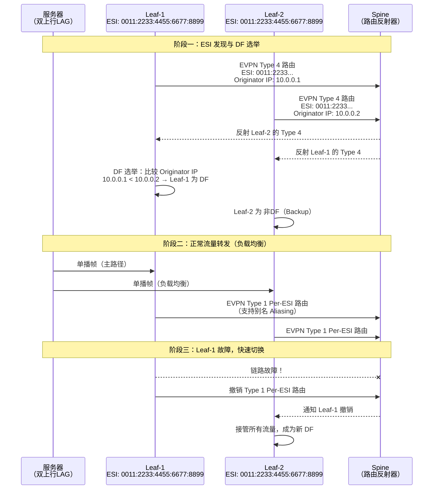

> <Icon name="clipboard-list" color="cyan" /> **前置知识**：[BGP路由协议](/guide/routing/bgp)、[VXLAN技术](/guide/advanced/vxlan)、[Spine-Leaf架构](/guide/architecture/topology)
> ⏱ **阅读时间**：约22分钟

# EVPN：以太网VPN与数据中心Overlay融合方案

## 1. 为什么需要EVPN

在大规模数据中心部署VXLAN（Virtual Extensible LAN）时，工程师很快会遇到一个根本性矛盾：**VXLAN是纯粹的数据平面封装技术**，它本身没有控制平面，无法自动完成MAC地址和ARP信息的分发。

### 1.1 传统VXLAN的泛洪困境

没有控制平面的VXLAN依赖**泛洪学习（Flood-and-Learn）**机制——当一台虚拟机发送ARP请求时，VTEP（VXLAN Tunnel Endpoint）必须将该请求复制并转发给所有其他VTEP节点，等待目标主机响应后再通过数据平面学习MAC地址。

这种方式在规模较小时尚可接受，但随着数据中心扩展，BUM（Broadcast、Unknown Unicast、Multicast）流量将以指数级增长，给底层物理网络带来巨大压力。

::: warning 泛洪学习的代价
在拥有100个VTEP、每个VTEP管理1000台VM的数据中心中，一次广播风暴可能产生高达10万个数据包副本，严重消耗底层网络带宽和CPU资源。
:::

### 1.2 EVPN的解决思路

EVPN（Ethernet VPN，以太网虚拟专用网）由RFC 7432定义，其核心思想是：**将传统数据平面的MAC学习上移到BGP控制平面**。

通过扩展BGP协议，EVPN使每个VTEP能够主动向所有对等体通告自己学习到的MAC/IP地址，接收方直接在本地建立转发表项，完全消除了ARP泛洪的需求——这就是"ARP压制（ARP Suppression）"机制的基础。

::: tip EVPN的核心价值
- **消除BUM泛洪**：BGP控制平面主动分发MAC/IP，无需泛洪学习
- **支持分布式网关**：Anycast Gateway让所有Leaf节点共享同一网关MAC/IP
- **原生多宿主**：ESI（Ethernet Segment Identifier）机制提供链路级冗余
- **L2/L3统一控制**：同一BGP会话同时承载二层和三层路由信息
:::

---

## 2. EVPN协议基础

### 2.1 BGP地址族扩展

EVPN通过BGP多协议扩展（RFC 4760）引入新的地址族标识符：

| 参数 | 值 | 说明 |
|------|-----|------|
| AFI（Address Family Identifier）| 25 | L2VPN |
| SAFI（Subsequent AFI）| 70 | EVPN |

在配置BGP对等关系时，需要显式激活L2VPN EVPN地址族。控制平面拓扑通常采用**eBGP全网状（Full-mesh eBGP）**或在Spine节点上部署**路由反射器（Route Reflector，RR）**。

```
neighbor SPINE activate
address-family l2vpn evpn
  neighbor SPINE activate
  advertise-all-vni
exit-address-family
```

### 2.2 Route Distinguisher（RD）

RD（路由区分符）是一个8字节的值，附加在EVPN路由的IPv4/IPv6前缀之前，用于在BGP RIB中区分来自不同VRF或VNI的路由，避免地址空间重叠导致的冲突。

常用格式：
- `<AS号>:<本地管理号>`，例如 `65001:10`
- `<IP地址>:<本地管理号>`，例如 `10.0.0.1:10`

::: tip RD的作用
RD本身不携带路由策略含义，仅用于路由唯一标识。真正控制路由导入/导出策略的是Route Target（RT）。
:::

### 2.3 Route Target（RT）

RT（路由目标）是BGP扩展社区属性，决定了EVPN路由如何在VRF/VNI间导入和导出：

- **Export RT**：路由发出时携带的RT值
- **Import RT**：本地VRF/VNI接受哪些RT值的路由

在VXLAN EVPN场景中，通常为每个VNI设置对称的RT：

```
vni 10100
  rd 10.0.0.1:100
  route-target import 65000:100
  route-target export 65000:100
```

### 2.4 VTEP与VNI的对应关系



---

## 3. EVPN五大Route Type详解

EVPN定义了多种路由类型（Route Type，RT），不同类型承载不同用途的网络信息。以下是数据中心VXLAN场景中最常用的五种。



### 3.1 Type 1：以太网自动发现路由（Ethernet Auto-Discovery Route）

Type 1路由有两种变体：

**Per-ESI（每以太网段）**：用于通告某个以太网段（Ethernet Segment）的可达性，在多宿主场景下实现快速收敛。当某条上行链路故障时，可快速撤销该ESI的Type 1路由，触发远端VTEP更新转发路径。

**Per-EVI（每EVPN实例）**：结合EVI（EVPN Instance）传递别名（Aliasing）信息，使远端VTEP能对多宿主站点进行流量负载均衡。

### 3.2 Type 2：MAC/IP通告路由（核心路由类型）

Type 2是EVPN最重要的路由类型，它将本地学习到的MAC地址（可选携带对应IP地址）通过BGP通告给所有远端VTEP。

**关键字段**：
- **MAC地址**（48位）：主机的以太网地址
- **IP地址**（可选，32/128位）：主机的IPv4/IPv6地址
- **VNI**：封装在扩展社区中，标识所属的L2/L3 VNI
- **VTEP IP**：下一跳地址，用于VXLAN封装

::: tip ARP压制原理
当远端VTEP收到Type 2路由并在本地建立MAC/IP表项后，若本地有虚拟机发出ARP请求，VTEP可以直接以本地表项代为应答，无需将ARP请求泛洪到远端，这就是ARP压制（ARP Suppression）的工作机制。
:::

### 3.3 Type 3：包容性组播以太网标签路由（BUM流量处理）

Type 3路由用于VTEP间的BUM（广播、未知单播、组播）流量传输。每个VTEP在加入某个VNI时，会生成并通告一条Type 3路由，其中包含自己的VTEP IP地址（通常是Loopback地址）。

其他VTEP收到后，将把BUM流量以单播Ingress Replication方式复制发送给所有Type 3路由中记录的VTEP，替代了传统的多播组方式，简化了底层物理网络的要求。

### 3.4 Type 4：以太网段路由（多宿主场景）

Type 4路由用于同一以太网段内多个VTEP之间的**指定转发者（Designated Forwarder，DF）选举**。在多宿主（Multihoming）场景中，一台主机可能通过链路聚合同时连接多台Leaf交换机，Type 4路由协调哪台Leaf负责向该段转发BUM流量，避免重复转发。

### 3.5 Type 5：IP前缀路由（三层路由扩展）

Type 5路由将IP前缀信息（不绑定具体MAC地址）通过EVPN分发，主要用于：
- **跨VRF路由泄露**：将不同租户的IP前缀有选择地共享
- **外部网络接入**：将数据中心外部路由引入EVPN域
- **DC互联**：跨数据中心的三层路由传递

---

## 4. MAC/IP学习流程与ARP压制

以下时序图展示了在VXLAN EVPN环境中，一台新虚拟机（VM-A）上线后的完整控制平面流程：



::: tip 关键洞察
ARP压制不仅消除了BUM流量，还将VM-B访问VM-A的延迟从"ARP请求→跨VTEP泛洪→ARP响应→建立转发→通信"缩短为"本地ARP代答→直接通信"，显著提升了首包性能。
:::

---

## 5. IRB路由模式：对称与非对称

当虚拟机需要跨子网通信时，就涉及到三层路由转发。VXLAN EVPN提供两种集成路由与桥接（IRB，Integrated Routing and Bridging）模式。

### 5.1 非对称IRB（Asymmetric IRB）

在非对称模式下，**入口VTEP同时完成路由和桥接**。假设VM-A（VNI 100，10.1.1.0/24）访问VM-B（VNI 200，10.1.2.0/24）：

- **入口Leaf（VTEP-1）**：收到VM-A的数据包后，查询本地路由表，将目标IP 10.1.2.20解析为MAC-B，然后切换到VNI 200，用VNI 200的封装将帧发送到VTEP-2
- **出口Leaf（VTEP-2）**：收到的帧已经是二层帧（VNI 200），只需执行桥接转发，无需路由

**特点**：
- 入口VTEP承担全部路由工作（不对称）
- 每台VTEP必须本地配置**所有VNI**及对应的SVI接口
- 无需L3 VNI，配置相对简单

::: warning 非对称IRB的扩展性限制
在数据中心有数百个VNI的场景中，要求每台Leaf都配置全量VNI是不现实的。非对称IRB通常只适用于VNI数量较少（<50）的场景。
:::

### 5.2 对称IRB（Symmetric IRB）

对称模式引入了**L3 VNI（三层VNI）**的概念，每个VRF（虚拟路由转发）绑定一个独立的L3 VNI，将路由责任**分摊到入口和出口VTEP**：

- **入口Leaf（VTEP-1）**：将数据包从L2 VNI（VNI 100）路由到L3 VNI（VNI 9999），用L3 VNI封装发往VTEP-2
- **出口Leaf（VTEP-2）**：收到L3 VNI封装的包，先路由到目标L2 VNI（VNI 200），再桥接给VM-B



### 5.3 两种模式对比

| 维度 | 非对称IRB | 对称IRB |
|------|-----------|---------|
| 路由分工 | 入口VTEP全部承担 | 入口+出口各承担一半 |
| VNI要求 | 每VTEP需全量L2 VNI | 仅需本地L2 VNI + L3 VNI |
| L3 VNI | 不需要 | 每VRF一个L3 VNI |
| 扩展性 | 差（VNI数量受限） | 好（VNI可按需分配） |
| 配置复杂度 | 低 | 中等 |
| 适用场景 | 小规模、VNI少 | 大规模生产数据中心 |
| EVPN Type 2 | 仅携带L2 VNI | 同时携带L2 VNI和L3 VNI |

::: tip 生产环境推荐
企业级数据中心应优先选择**对称IRB**，配合Anycast Gateway使用。这是Cisco ACI、Arista EOS、Cumulus Linux、FRRouting等主流平台的默认推荐模式。
:::

---

## 6. 分布式Anycast Gateway（任播网关）

传统数据中心采用集中式网关，所有跨子网流量必须经过固定的核心路由器，造成流量迂回（Tromboning）。EVPN通过**Anycast Gateway（任播网关）**彻底解决这一问题。

### 6.1 工作原理

Anycast Gateway要求所有Leaf交换机针对同一子网配置**完全相同的网关IP地址和MAC地址**：

```
# 所有 Leaf 节点相同配置
interface Vlan100
  ip address 10.1.1.1/24
  mac-address 00:00:00:aa:bb:cc   # 全局统一虚拟MAC
  anycast-gateway
```

虚拟机将同一个网关IP（10.1.1.1）对应到同一个虚拟MAC（00:00:00:aa:bb:cc），无论连接到哪台Leaf，网关始终"就近可达"。

### 6.2 Anycast Gateway拓扑示意



### 6.3 虚拟机迁移（vMotion）的优势

当VM-A从Leaf-1迁移至Leaf-2时：
1. VM-A的IP/MAC保持不变
2. Leaf-2检测到VM-A后，发布新的EVPN Type 2路由（覆盖旧条目）
3. 所有远端VTEP更新转发表，将流量切换至Leaf-2
4. VM-A的默认网关（Anycast Gateway）无需任何配置变更

::: tip 迁移无感知
整个迁移过程中，VM-A的ARP缓存不需要刷新，因为网关MAC地址（00:00:00:aa:bb:cc）始终相同，VM无法感知物理接入点的变化。
:::

---

## 7. 多宿主（Multihoming）与ESI

### 7.1 ESI（Ethernet Segment Identifier）

ESI是一个10字节的标识符，用于标识一个"以太网段"（Ethernet Segment）——即连接到两台或多台VTEP的同一物理链路或LAG（链路聚合组）。

ESI格式通常基于LACP系统MAC自动生成：
```
ESI = Type(1B) + LACP System MAC(6B) + LACP Port Key(2B) + 0x00(1B)
```

### 7.2 多宿主场景下的EVPN协作



::: warning BUM流量防环
在多宿主场景中，非DF节点（Backup Leaf）会丢弃从ESI接收的BUM流量，以防止因两台Leaf同时转发而造成环路。这是EVPN多宿主机制的内置保护。
:::

---

## 8. 实战配置：FRRouting / Cumulus Linux

以下是基于FRRouting（FRR）的典型VXLAN EVPN配置，适用于运行Cumulus Linux或Ubuntu + FRR的Leaf交换机。

### 8.1 VXLAN接口配置（Linux内核）

```bash
# 创建 VXLAN 接口（L2 VNI 10100）
ip link add vxlan10100 type vxlan \
    id 10100 \
    dstport 4789 \
    local 10.0.0.1 \
    nolearning        # 禁用数据平面学习，由 BGP EVPN 控制

ip link set vxlan10100 up

# 创建网桥并绑定
ip link add br100 type bridge
ip link set vxlan10100 master br100
ip link set eth1 master br100   # 接入端口
ip link set br100 up

# L3 VNI（对称IRB用）
ip link add vxlan9999 type vxlan \
    id 9999 \
    dstport 4789 \
    local 10.0.0.1 \
    nolearning

# VRF 绑定
ip link add vrf-red type vrf table 100
ip link set vrf-red up
ip link set vxlan9999 master vrf-red
```

### 8.2 FRRouting BGP EVPN 配置

```
frr version 8.5
hostname leaf-1
!
vrf vrf-red
 vni 9999
 exit-vrf
!
interface lo
 ip address 10.0.0.1/32
!
router bgp 65001
 bgp router-id 10.0.0.1
 no bgp ebgp-requires-policy
 !
 neighbor SPINE peer-group
 neighbor SPINE remote-as 65000
 neighbor 10.255.0.1 peer-group SPINE
 neighbor 10.255.0.2 peer-group SPINE
 !
 address-family ipv4 unicast
  network 10.0.0.1/32
  neighbor SPINE activate
 exit-address-family
 !
 address-family l2vpn evpn
  neighbor SPINE activate
  advertise-all-vni          ! 通告本地所有 VNI
  advertise-svi-ip           ! 通告 SVI 接口 IP（Anycast Gateway）
  !
  vni 10100
   rd 10.0.0.1:100
   route-target import 65000:100
   route-target export 65000:100
  exit-vni
  !
  vni 10200
   rd 10.0.0.1:200
   route-target import 65000:200
   route-target export 65000:200
  exit-vni
 exit-address-family
!
router bgp 65001 vrf vrf-red
 bgp router-id 10.0.0.1
 !
 address-family ipv4 unicast
  redistribute connected
 exit-address-family
 !
 address-family l2vpn evpn
  advertise ipv4 unicast    ! 生成 Type 5 路由
 exit-address-family
!
```

### 8.3 Anycast Gateway SVI配置

```
# FRR / Cumulus 通过 /etc/network/interfaces 或 NCLU 配置
interface Vlan100
 ip address 10.1.1.1/24
 ip address anycast-gateway   ! Cumulus Linux 专有命令
!
# 或在 Linux 内核层面设置统一 MAC
ip link set dev br100 address 00:00:00:aa:bb:cc
```

### 8.4 Spine路由反射器配置

```
router bgp 65000
 bgp router-id 10.255.0.1
 !
 neighbor LEAF peer-group
 neighbor LEAF remote-as 65001
 neighbor LEAF update-source lo
 !
 address-family l2vpn evpn
  neighbor LEAF activate
  neighbor LEAF route-reflector-client   ! 配置为 RR 客户端
 exit-address-family
!
```

### 8.5 验证命令

```bash
# 查看 EVPN VNI 状态
vtysh -c "show evpn vni"

# 查看 BGP EVPN 路由表
vtysh -c "show bgp l2vpn evpn"
vtysh -c "show bgp l2vpn evpn type macip"   # Type 2 路由
vtysh -c "show bgp l2vpn evpn type multicast"  # Type 3 路由

# 查看 MAC/ARP 压制表
vtysh -c "show evpn mac vni all"
vtysh -c "show evpn arp-cache vni all"

# 查看 VTEP 邻居（Type 3）
vtysh -c "show evpn rmac vni all"
```

::: tip 故障排查技巧
如果远端MAC无法学习，首先检查：
1. `show bgp l2vpn evpn summary` — 确认BGP会话已建立
2. `show evpn vni <vni>` — 确认VNI已注册并有VTEP邻居
3. `show bgp l2vpn evpn type macip` — 确认Type 2路由存在且下一跳正确
4. 检查Route Target是否在import/export策略中匹配
:::

---

## 9. 企业级部署最佳实践

### 9.1 规划原则

**VNI分段规划**：
- L2 VNI：10000–19999（按业务/租户划分）
- L3 VNI：20000–29999（每VRF一个，与业务VNI解耦）
- 预留空间：避免后期VNI冲突

**Route Target规范**：
```
RT = <AS号>:<VNI号>
# 例如：VNI 10100 → RT 65000:10100
```

**Loopback地址规划**：
- VTEP Loopback：专用地址段，避免与业务IP重叠
- 使用/32主机路由，通过IGP（OSPF/ISIS）在Underlay中分发

### 9.2 高可用设计要点

::: danger 多宿主配置注意事项
在配置EVPN多宿主（ESI-LAG）时，必须确保：
1. 两台Leaf使用**完全相同的ESI值**
2. LACP系统优先级和MAC在两台Leaf上**保持一致**，确保服务器LACP协商稳定
3. 两台Leaf必须建立**VxLAN隧道（Peer Link等价）**，否则流量可能在本地无法正常转发
4. DF选举依赖BGP会话正常，务必监控Leaf间的BGP状态
:::

### 9.3 性能调优建议

| 参数 | 建议值 | 说明 |
|------|--------|------|
| BGP Keepalive | 3s / Hold 9s | 快速检测BGP邻居故障 |
| BFD（双向转发检测）| 300ms × 3 | 加速Underlay链路故障检测 |
| MAC老化时间 | 1800s | 与EVPN路由保持同步 |
| ARP压制 | 启用 | 生产必须启用 |
| ECMP路径数 | 8–16 | Spine-Leaf全网状时的等价多路径 |

---

## 10. 总结

EVPN通过将MAC/IP学习从数据平面上移到BGP控制平面，从根本上解决了大规模VXLAN部署中的泛洪问题。其五种路由类型覆盖了从二层MAC学习（Type 2）、BUM流量管理（Type 3）到多宿主保护（Type 1/4）和三层路由扩展（Type 5）的全场景需求。

对称IRB配合Anycast Gateway是现代数据中心Overlay网络的黄金组合：前者解决了跨VNI路由的扩展性问题，后者实现了真正的分布式网关，使任意Leaf均可本地完成三层转发，消除了流量迂回，并为虚拟机无感知迁移提供了技术基础。

随着数据中心向云原生演进，EVPN + VXLAN已成为Kubernetes网络（如Cilium BGP模式）、SD-WAN边缘接入、DCI（数据中心互联）等场景的核心基础协议，掌握EVPN是现代网络工程师不可或缺的技能。

---

## 参考资料

- [RFC 7432 — BGP MPLS-Based Ethernet VPN](https://www.rfc-editor.org/rfc/rfc7432)
- [RFC 8365 — A Network Virtualization Overlay Solution Using EVPN](https://www.rfc-editor.org/rfc/rfc8365)
- [RFC 9135 — Integrated Routing and Bridging in EVPN](https://www.rfc-editor.org/rfc/rfc9135)
- [FRRouting EVPN 配置指南](https://docs.frrouting.org/en/latest/evpn.html)
- [Cumulus Linux EVPN 文档](https://docs.nvidia.com/networking-ethernet-software/cumulus-linux/Network-Virtualization/Ethernet-Virtual-Private-Network-EVPN/)
