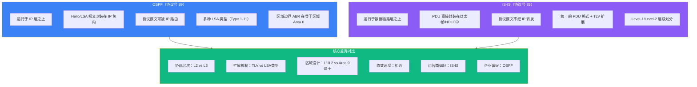
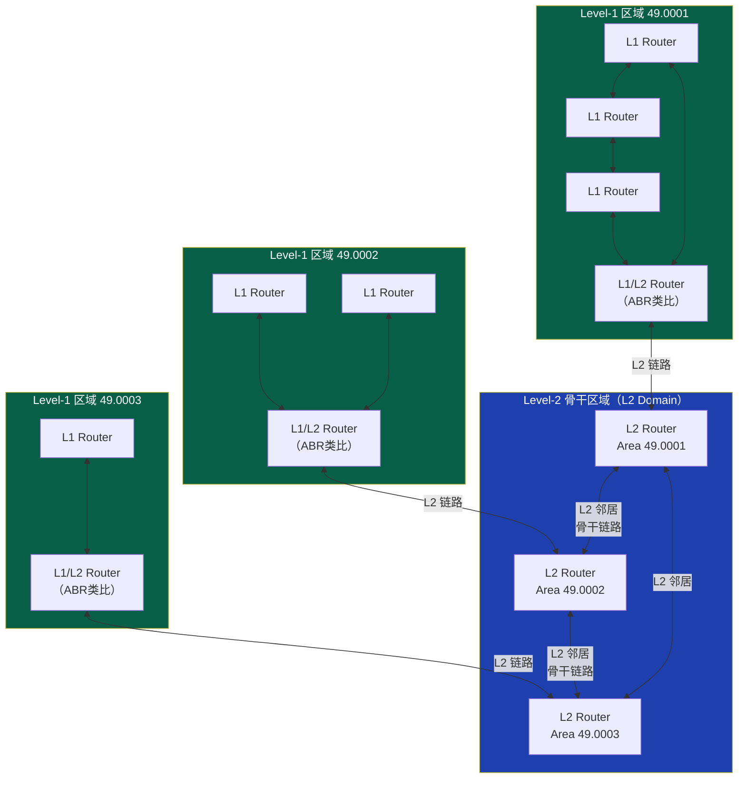
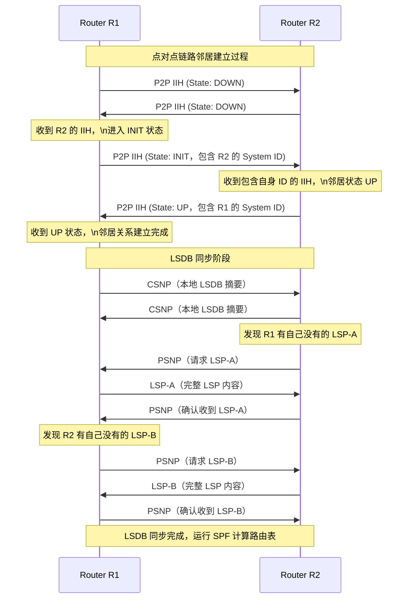
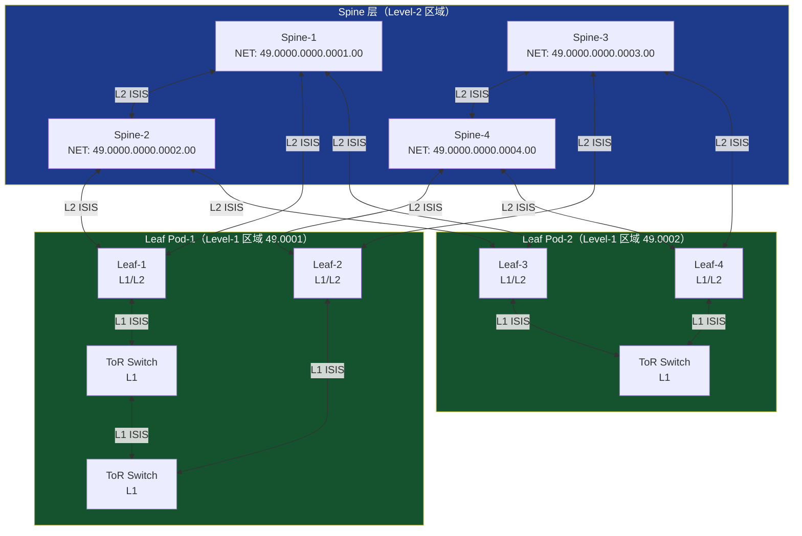

> 📋 **前置知识**：[OSPF路由协议](/guide/routing/ospf)、[BGP路由协议](/guide/routing/bgp)
> ⏱️ **阅读时间**：约20分钟

# IS-IS：运营商骨干网首选的链路状态路由协议

IS-IS（Intermediate System to Intermediate System，中间系统到中间系统）是现代互联网基础设施的隐形支柱。几乎所有主流互联网服务提供商（ISP）的骨干网、以及大多数超大规模数据中心的 Underlay 网络，都在运行 IS-IS。与 OSPF 共同占据链路状态路由协议（Link-State Routing Protocol）的主导地位，但 IS-IS 以其极致的可扩展性和网络层无关（Network-Layer Independent）的优雅设计，在运营商场景中独树一帜。

---

## 一、历史背景：从 OSI 走向 IP 互联网

### 1.1 ISO 标准的诞生

IS-IS 最初由 ISO（国际标准化组织）在 1987 年作为 OSI 协议栈的一部分发布，标准编号为 ISO 10589。在 OSI 参考模型的世界观中，网络设备被称为"中间系统"（Intermediate System，IS），与之对应的是终端主机"端系统"（End System，ES）。IS-IS 的命名正来源于此——在中间系统之间交换路由信息。

OSI 协议栈使用 CLNP（Connectionless Network Protocol，无连接网络协议）作为其网络层，地址格式为 NSAP（Network Service Access Point，网络服务访问点），与 IPv4/IPv6 完全不同。

### 1.2 Integrated IS-IS 的诞生

随着 TCP/IP 的崛起，OSI 协议栈日渐式微，但 IS-IS 协议本身的架构设计极为前瞻——它并不依赖特定的网络层协议。IETF 在 1990 年通过 RFC 1195 定义了 **Integrated IS-IS**（也称 Dual IS-IS），使其同时支持 CLNP 和 IP 路由。时至今日，所有生产环境中运行的 IS-IS 均为 Integrated IS-IS，纯 OSI 模式几乎绝迹。

::: tip 为何叫"Integrated"？
"集成"一词强调该版本可在同一个协议实例中同时承载 OSI CLNP 路由和 IP 路由，而不需要分别运行两套协议进程，体现了设计的经济性。
:::

### 1.3 运营商的选择

90 年代互联网商业化浪潮中，各大 ISP 在选择 IGP 时面临 OSPF 和 IS-IS 两个主要选项。最终 IS-IS 在运营商市场胜出，核心原因包括：

- **成熟的工具链**：Cisco、Juniper 等厂商针对运营商场景对 IS-IS 的实现高度成熟
- **可扩展性**：TLV（Type-Length-Value）扩展机制使其无需修改协议基础即可支持新特性
- **链路层封装**：运行在数据链路层，避免了 IP 分片问题，在某些异构网络环境中更稳定

---

## 二、IS-IS 与 OSPF 的关键对比

两者同为链路状态路由协议，核心算法均为 Dijkstra SPF（Shortest Path First），但在设计哲学上存在根本差异。



| 特性 | IS-IS | OSPF |
|------|-------|------|
| **协议层次** | 数据链路层（L2） | 网络层（L3，IP 协议号 89） |
| **地址格式** | NSAP/NET | IP 地址 |
| **区域设计** | Level-1 / Level-2 | Area 0 骨干 + 普通区域 |
| **扩展机制** | TLV（Type-Length-Value） | 新增 LSA 类型 |
| **报文类型** | PDU（Hello/LSP/CSNP/PSNP） | 报文（Hello/DBD/LSR/LSU/LSAck） |
| **IPv6 支持** | TLV 236 扩展（同一进程） | OSPFv3（独立进程） |
| **TE 支持** | TLV 22 扩展 | Opaque LSA |
| **典型场景** | 运营商骨干、数据中心 Underlay | 企业园区、中小型网络 |

::: warning 常见误解：IS-IS 不用 IP 通信？
IS-IS 协议报文本身封装在数据链路层（以太网帧中的 EtherType 为 0x8870），不依赖 IP 层转发，因此即使接口还没有 IP 地址也能建立邻居关系。但 IS-IS 承载的路由信息（前缀可达性）是纯 IP 路由前缀。这一特性在 Unnumbered 接口场景下极为有用。
:::

---

## 三、IS-IS 层次结构与寻址

### 3.1 Level-1 / Level-2 划分

IS-IS 使用两级层次结构管理路由域，与 OSPF 的 Area 0 骨干区域设计截然不同：



| 路由器类型 | 功能说明 |
|-----------|---------|
| **Level-1（L1）** | 仅维护本区域内的拓扑数据库，对区域外路由使用默认路由指向 L1/L2 路由器 |
| **Level-2（L2）** | 仅参与骨干区域路由，维护跨区域路由信息，类似 OSPF 骨干路由器 |
| **Level-1/2（L1/L2）** | 同时参与两个层级，是区域边界路由器（类比 OSPF ABR），连接本地 L1 区域与 L2 骨干 |

::: tip IS-IS 区域边界的关键差异
与 OSPF 不同，IS-IS 的区域边界运行在**链路（Link）**上，而非路由器上。L1/L2 路由器本身同时属于两个层级，而 OSPF ABR 路由器则是区域边界的代理。这使 IS-IS 的拓扑结构更加清晰，避免了 OSPF 中区域间路由的复杂性。
:::

### 3.2 NET 地址格式

每台 IS-IS 路由器需要配置一个 **NET（Network Entity Title，网络实体标题）** 地址，这是其在 IS-IS 域内的唯一标识符。

NET 地址基于 NSAP 格式，典型结构如下：

```
49.0001.1921.6800.1001.00
│  │    │              │
│  │    └── System ID  └── NSEL（固定为 00）
│  └── Area Address
└── AFI（49 = 私有地址）
```

- **AFI（Authority and Format Identifier）**：`49` 表示本地管理地址（类似 RFC 1918 私有 IP）
- **Area Address**：`0001` 标识所属区域，L1 路由器只能有一个区域地址，L2/L1L2 可以有多个
- **System ID**：6 字节（12 位十六进制），全域唯一，通常由 Router ID 或 MAC 地址转换而来
- **NSEL**：固定为 `00`，表示"网络层"服务

**System ID 转换示例**：

Router ID `192.168.1.1` → `1921.6800.1001`（每两位补零对齐到三组四位十六进制）

---

## 四、IS-IS PDU 类型详解

IS-IS 使用 **PDU（Protocol Data Unit，协议数据单元）** 作为所有报文的统称，分为三大类：

### 4.1 Hello PDU（IIH）

IIH（IS-to-IS Hello）用于邻居发现和维持，分为两种：

| PDU 类型 | 适用场景 | 关键字段 |
|---------|---------|---------|
| **LAN IIH（LAN IS-IS Hello）** | 广播型网络（以太网） | 包含 Priority 字段，用于 DIS 选举 |
| **P2P IIH（Point-to-Point Hello）** | 点对点链路（PPP、HDLC） | 包含 Local/Remote Circuit ID |

在广播网络中，IS-IS 会选举 **DIS（Designated IS，指定中间系统）**，类似 OSPF 的 DR。但重要区别是：IS-IS 没有 BDR，且 DIS 选举是抢占式的（Priority 最高者立即成为 DIS，出现更高 Priority 路由器时直接替换）。

### 4.2 LSP（Link State PDU）

LSP（链路状态 PDU）是 IS-IS 的核心报文，携带路由器的链路状态信息，等价于 OSPF 的 LSA。

LSP 头部关键字段：
- **LSP ID**：`System ID + Pseudonode ID + Fragment Number`（16 字节）
- **Sequence Number**：32 位递增序列号，用于判断新旧
- **Remaining Lifetime**：LSP 剩余生存时间（最大 1200 秒）
- **IS Type**：L1 LSP 或 L2 LSP
- **TLV 列表**：携带具体的链路和前缀信息

### 4.3 CSNP 与 PSNP（数据库同步）

| PDU 类型 | 全称 | 作用 |
|---------|------|------|
| **CSNP** | Complete Sequence Number PDU | 完整序列号报文，列出路由器 LSDB 中所有 LSP 的摘要（ID + 序列号 + 校验和），用于主动同步 |
| **PSNP** | Partial Sequence Number PDU | 部分序列号报文，用于请求特定 LSP 或确认收到 LSP |

在广播网络中，DIS 周期性（默认每 10 秒）发送 CSNP，其他路由器通过比对发现缺失的 LSP 并用 PSNP 请求补全。在点对点链路上，两端互发 CSNP 完成初始同步，之后通过 PSNP 确认 LSP 收到。

---

## 五、邻居建立与数据库同步过程



### 5.1 邻居状态机

IS-IS 点对点邻接的三态状态机（Three-Way Handshake，RFC 5303）：

1. **Down**：初始状态，尚未收到对端 IIH
2. **Init**：收到对端 IIH，但对端 IIH 中未包含本机 System ID（单向可见）
3. **Up**：收到的对端 IIH 中包含本机 System ID（双向可见），邻居完全建立

::: warning 注意：MTU 不匹配是 IS-IS 常见故障
由于 IS-IS 运行在 L2，不支持 IP 分片，若两端 MTU 不一致，大的 LSP 报文可能无法传输。排障时应检查接口 MTU 配置，IS-IS 默认 LSP MTU 为 1492 字节（以太网环境）。
:::

### 5.2 SPF 计算触发

当 LSDB 发生变化（收到新 LSP 或 LSP 更新）时，IS-IS 会触发 SPF 计算。生产环境通常配置 **SPF 抑制定时器（SPF delay）** 避免频繁计算：

- **Initial delay**：首次变化后等待时间（典型值 50ms）
- **Short delay**：后续连续变化的等待时间（典型值 200ms）
- **Long delay**：稳定后恢复到初始等待时间（典型值 5000ms）

---

## 六、TLV 扩展机制：IS-IS 的核心竞争力

TLV（Type-Length-Value）是 IS-IS 极强可扩展性的根本来源。每个 TLV 包含：

```
┌────────────┬────────────┬──────────────────────┐
│  Type (1B) │ Length (1B)│    Value (N bytes)   │
└────────────┴────────────┴──────────────────────┘
```

新功能只需定义新的 TLV 类型，无需修改协议基础结构，且旧版本路由器会安全地忽略未知 TLV。这与 OSPF 需要定义新的 LSA 类型（且各类型语义固定）形成鲜明对比。

### 6.1 关键 TLV 类型

| TLV Type | 名称 | 用途 |
|----------|------|------|
| **TLV 1** | Area Addresses | 宣告路由器的区域地址 |
| **TLV 2** | IS Neighbors（广播） | 广播网络中的邻居关系 |
| **TLV 6** | IS Neighbors（P2P） | 点对点链路邻居关系 |
| **TLV 10** | Authentication | 认证信息（MD5/SHA） |
| **TLV 22** | Extended IS Reachability | 扩展 IS 可达性，支持 TE 属性（带宽、延迟、颜色） |
| **TLV 128** | IP Internal Reachability（旧） | 区域内 IPv4 路由（RFC 1195，窄格式） |
| **TLV 130** | IP External Reachability（旧） | 区域外 IPv4 路由（旧格式） |
| **TLV 135** | Extended IP Reachability | 扩展 IPv4 前缀可达性（支持 32 位 Metric） |
| **TLV 137** | Dynamic Hostname | 路由器名称（方便运维识别） |
| **TLV 232** | IPv6 Interface Address | 路由器 IPv6 接口地址 |
| **TLV 236** | IPv6 Reachability | IPv6 前缀可达性 |
| **TLV 242** | IS-IS Router Capability | 路由器能力通告（SR、Flex-Algo） |

### 6.2 Segment Routing 扩展

IS-IS 通过 TLV 扩展原生支持 **SR（Segment Routing，段路由）**，这是现代运营商骨干网和数据中心 Underlay 的主流方案：

- **TLV 242**：Prefix-SID（为每个前缀分配段标识）
- **TLV 22 Sub-TLV 33**：Adj-SID（邻接段标识）
- **TLV 242 Sub-TLV 2**：SR-Capability（声明节点支持的段路由标签范围 SRGB）

::: tip IS-IS + SR 是现代运营商的黄金组合
IS-IS 与 Segment Routing MPLS（SR-MPLS）或 SRv6 的结合，使运营商可以实现无需 RSVP-TE 信令的流量工程，大幅简化控制平面。主流运营商如 Comcast、NTT 均已大规模部署。
:::

---

## 七、数据中心应用：Spine-Leaf IS-IS Underlay

IS-IS 已成为超大规模数据中心 Underlay 网络的主流选择，被 Facebook、Microsoft Azure 等大型云厂商广泛采用。

### 7.1 Spine-Leaf 拓扑中的 IS-IS 设计



### 7.2 数据中心 IS-IS 设计原则

**1. 全 L2 扁平设计（推荐）**

在许多超大规模数据中心，由于 Spine-Leaf 层数固定、规模可控，业界逐渐转向将所有节点都配置为 Level-2，形成单一 L2 路由域，彻底规避 L1/L2 复杂性：

```
所有交换机 IS-IS 配置：
- is-type level-2-only
- metric-style wide（使用 32 位 Metric）
```

**2. Unnumbered 接口**

Leaf-Spine 之间的互联链路通常使用 Unnumbered（借用 Loopback 地址），减少 IP 地址消耗。IS-IS 运行在 L2 不依赖接口 IP，天然支持此场景。

**3. BFD 快速检测**

配合 BFD（Bidirectional Forwarding Detection，双向转发检测）实现亚秒级链路故障检测，IS-IS 感知故障后触发 SPF 重新计算，实现快速收敛（通常 < 1 秒）。

::: danger 数据中心 IS-IS 容量规划警告
单个 IS-IS 进程建议承载的节点数：
- **L1 区域**：建议 ≤ 200 个节点
- **L2 骨干域**：建议 ≤ 500 个节点
- **全网节点数超过 1000 时**：需仔细评估 SPF 计算开销和 LSP 泛洪压力，可考虑多 IS-IS 实例或引入 BGP Underlay（BGP Fabric）替代
:::

---

## 八、基础配置示例

### 8.1 Cisco IOS/IOS-XE 配置

```cisco
! 全局启用 IS-IS 进程
router isis CORE
 net 49.0001.1921.6800.1001.00   ! NET 地址（192.168.1.1 转换而来）
 is-type level-2-only             ! 仅 L2（骨干节点）
 metric-style wide                 ! 使用扩展 Metric（32 位）
 log-adjacency-changes             ! 记录邻居变化日志
 !
 ! SPF 抑制定时器（毫秒）
 spf-interval 5 50 200
 !
 ! 快速 Hello（BFD 替代方案）
 hello-interval 1
 hold-time 3

! 接口配置
interface GigabitEthernet0/0/0
 ip address 10.0.1.1 255.255.255.252
 ip router isis CORE              ! 将接口加入 IS-IS
 isis circuit-type level-2-only   ! 接口级别限制
 isis metric 10                    ! 接口 Metric
 isis network point-to-point       ! 声明为 P2P 链路（即使以太网）
 bfd interval 300 min_rx 300 multiplier 3  ! 启用 BFD

! Loopback（用于 Router ID 和 SR Prefix-SID）
interface Loopback0
 ip address 192.168.1.1 255.255.255.255
 ip router isis CORE
 isis circuit-type level-2-only
```

### 8.2 Juniper Junos 配置

```junos
# IS-IS 协议配置
protocols {
    isis {
        interface ge-0/0/0.0 {
            level 1 disable;         # 禁用 L1，仅运行 L2
            point-to-point;           # P2P 接口类型
            level 2 metric 10;
            bfd-liveness-detection {
                minimum-interval 300;
                multiplier 3;
            }
        }
        interface lo0.0 {
            level 1 disable;
            passive;                  # Loopback 仅宣告，不建立邻居
        }
        level 2 {
            authentication-key "$9$xxxxx";  # MD5 认证
            authentication-type md5;
            wide-metrics-only;        # 强制使用宽 Metric
        }
    }
}

# NET 地址配置
interfaces {
    lo0 {
        unit 0 {
            family iso {
                address 49.0001.1921.6800.1001.00;
            }
            family inet {
                address 192.168.1.1/32;
            }
        }
    }
}
```

### 8.3 IS-IS 认证配置（安全加固）

::: warning 生产环境必须启用认证
未启用认证的 IS-IS 域面临 LSP 注入攻击风险，攻击者可伪造 LSP 扰乱路由表。建议使用 HMAC-SHA-256 认证（RFC 5310）。
:::

```cisco
! Cisco IS-IS 认证配置
key chain ISIS-AUTH
 key 1
  key-string 7 <encrypted-password>
  cryptographic-algorithm hmac-sha-256

router isis CORE
 authentication mode md5 level-2
 authentication key-chain ISIS-AUTH level-2
```

---

## 九、运维与故障排查

### 9.1 常用验证命令

**Cisco IOS：**

```bash
# 查看 IS-IS 邻居状态
show isis neighbors

# 查看 LSDB
show isis database
show isis database detail <lsp-id>

# 查看 IS-IS 路由
show isis rib

# 查看 IS-IS 拓扑
show isis topology

# 调试邻居建立
debug isis adj-packets
```

**Juniper Junos：**

```bash
# 查看邻居
show isis adjacency

# 查看 LSDB
show isis database
show isis database detail

# 查看路由
show isis route

# 检查接口状态
show isis interface detail
```

### 9.2 常见故障场景

| 故障现象 | 可能原因 | 排查方法 |
|---------|---------|---------|
| 邻居卡在 Init 状态 | MTU 不匹配、认证不一致 | `show isis interface` 检查 MTU，对比认证配置 |
| 邻居频繁 Up/Down | Hello 定时器不匹配、链路抖动 | `debug isis adj-packets` 分析 |
| 路由缺失 | Level 类型不匹配（L1 无法学到 L2 路由） | 检查 is-type 配置，确认 L1/L2 路由器是否配置默认路由 |
| LSP 序列号异常 | 时钟回拨、配置变更频繁 | 检查系统时钟，`show isis database` 对比序列号 |
| SPF 频繁计算 | 链路频繁抖动 | 检查物理链路质量，调整 SPF 抑制定时器 |

---

## 十、总结：何时选择 IS-IS？

IS-IS 并非所有场景的最优解，但在以下场景中它是明确的最佳选择：

**强烈推荐 IS-IS 的场景：**
- **运营商骨干网**：规模大、需要 TE/SR 扩展、长期稳定性要求高
- **数据中心 Underlay**：Spine-Leaf 架构、Unnumbered 接口、与 SR-MPLS/SRv6 集成
- **多厂商异构网络**：IS-IS 的 TLV 扩展使不同厂商实现互操作性更好
- **需要同时承载 IPv4/IPv6**：单一 IS-IS 进程即可，无需 OSPFv2 + OSPFv3 双栈

**继续选择 OSPF 的场景：**
- 企业园区网（OSPF 生态工具、人才储备更丰富）
- 中小规模网络（OSPF 配置更直观）
- 团队对 IS-IS 经验不足、无运营商背景

::: tip 学习路径建议
掌握 IS-IS 的推荐顺序：
1. 理解 OSPF 原理（链路状态、SPF、区域设计）
2. 对比学习 IS-IS 与 OSPF 的设计差异
3. 在 GNS3/EVE-NG 中搭建三节点 IS-IS 拓扑，观察 LSDB 同步过程
4. 学习 IS-IS + SR-MPLS 集成（TLV 242、Prefix-SID 分配）
5. 参阅 RFC 5305（IS-IS TE 扩展）和 RFC 8667（IS-IS SR 扩展）
:::

---

## 参考资料

- **ISO 10589**：IS-IS Routing Protocol 原始标准
- **RFC 1195**：Use of OSI IS-IS for Routing in TCP/IP and Dual Environments（Integrated IS-IS）
- **RFC 5305**：IS-IS Extensions for Traffic Engineering
- **RFC 5308**：Routing IPv6 with IS-IS
- **RFC 5310**：IS-IS Generic Cryptographic Authentication
- **RFC 8667**：IS-IS Extensions for Segment Routing
- **RFC 7794**：IS-IS Prefix Attributes for Extended IPv4 and IPv6 Reachability
- Russ White & Alvaro Retana — *Computer Networking Problems and Solutions*（Chapter IS-IS）
- Jeff Doyle — *Routing TCP/IP Volume I*（IS-IS 章节）
