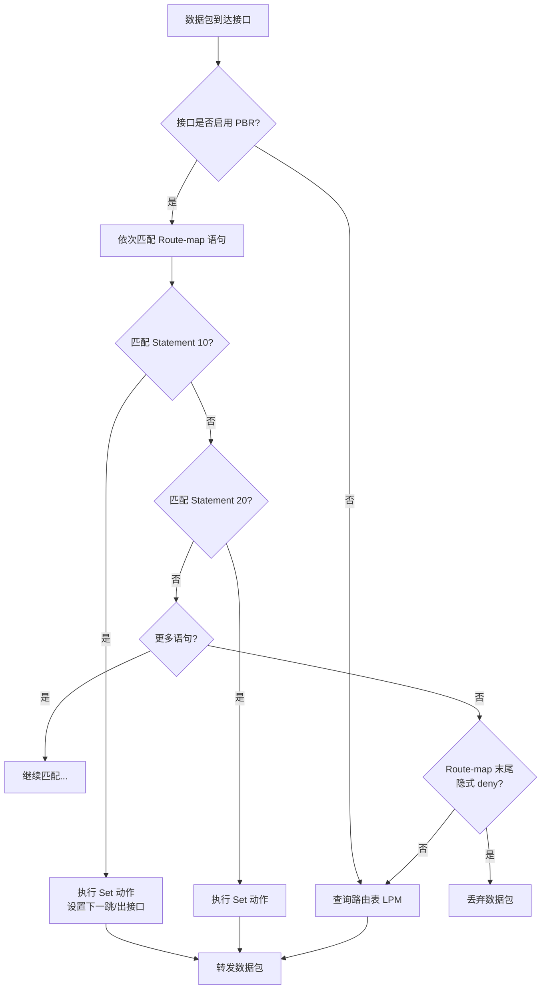
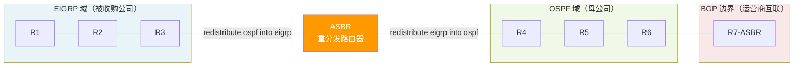
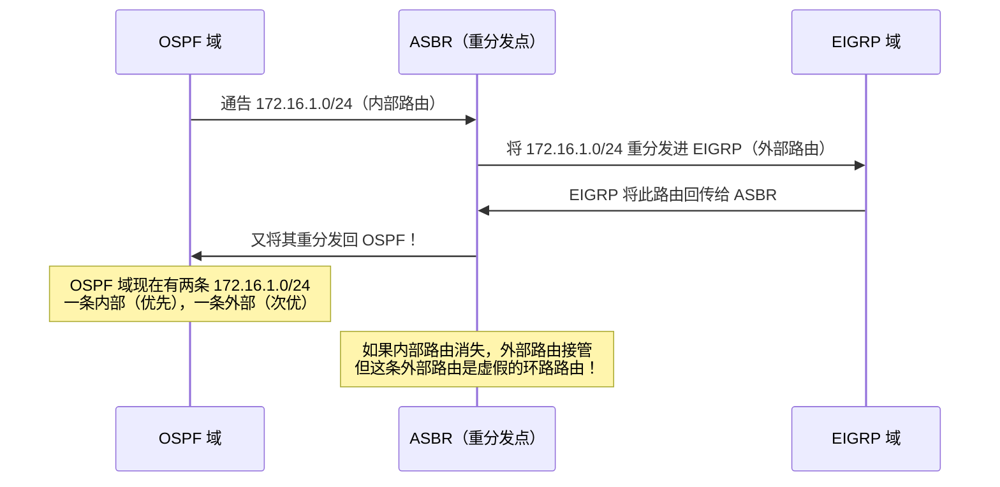
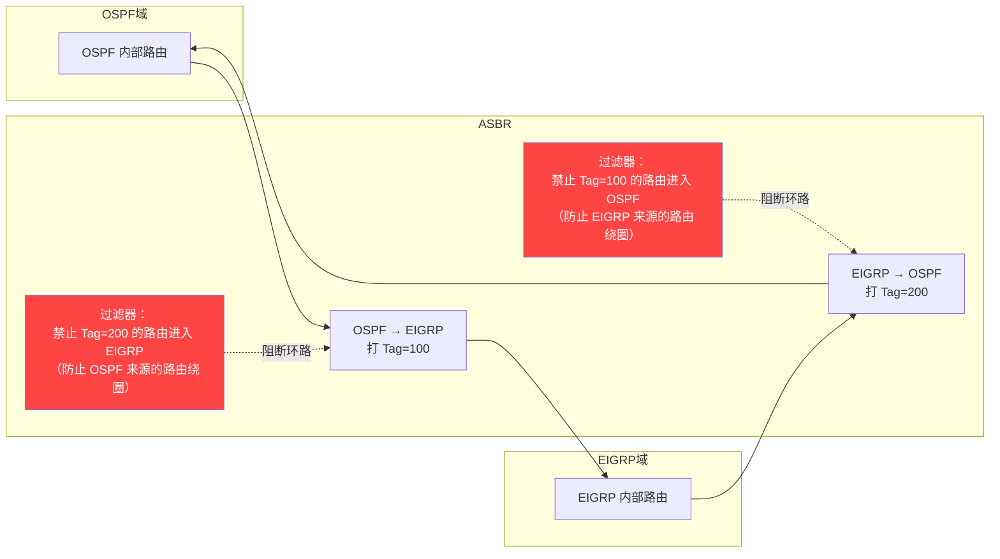

> 📋 **前置知识**：[IP路由基础](/guide/basics/routing)、[OSPF协议](/guide/routing/ospf)、[BGP协议](/guide/routing/bgp)
> ⏱️ **阅读时间**：约18分钟

# 策略路由与路由重分发：精细化流量控制

企业网络中，"把流量送到目的地"只是路由的基本职责。真正的流量工程（Traffic Engineering）要求我们回答更复杂的问题：**哪类应用走哪条链路？不同路由协议的域之间如何安全互通？如何防止重分发引入的路由环路？** 本文从底层原理出发，系统讲解策略路由（Policy-Based Routing, PBR）与路由重分发（Route Redistribution）的核心机制，并给出可直接落地的企业配置方案。

---

## 一、传统路由的局限性

### 1.1 最长前缀匹配的盲区

传统路由器的转发决策依赖**目的地址最长前缀匹配（Longest Prefix Match, LPM）**。路由表中每一条目只关心"数据包要去哪"，完全不考虑：

- **源地址**：数据包从哪里来
- **应用类型**：是视频会议流量还是文件备份流量
- **协议/端口**：TCP 443 还是 UDP 5060
- **包长度**：大流量还是小包交互

这种"一刀切"的转发方式在以下场景中显得力不从心：

| 场景 | 传统路由的问题 |
|------|---------------|
| 双 ISP 出口 | 所有流量都走默认路由，无法按应用分流 |
| VoIP 与数据混合 | 语音流量和批量数据竞争同一链路 |
| 合规要求 | 特定部门流量必须走加密专线 |
| 带宽成本优化 | 视频流量成本高，希望走廉价宽带 |

```
传统路由决策流程：

数据包到达 → 查目的IP → 最长匹配 → 出接口
               ↑
         仅看目的地址，其他字段全部忽略
```

### 1.2 策略路由的价值主张

策略路由（PBR）打破了"目的地址决定一切"的限制，允许网络管理员基于**多维度匹配条件**定义转发策略，实现精细化的流量工程。其核心思想是：**先检查策略，再查路由表**。

---

## 二、策略路由（Policy-Based Routing）深度解析

### 2.1 PBR 工作原理

PBR 的核心工具是 **Route-map**，它由一组有序的语句（Statement）组成，每条语句包含 **Match**（匹配条件）和 **Set**（执行动作）两个部分。



::: tip Route-map 末尾的隐式 Deny
与 ACL 类似，Route-map 末尾有一条隐式的 `deny` 语句。如果数据包没有匹配任何 permit 语句，将被**丢弃**（而非转入正常路由表查询）。若希望未匹配的流量回退到路由表，需要在 Route-map 末尾添加一条不带 match 条件的 permit 语句。
:::

### 2.2 匹配条件（Match 子句）

PBR 支持的匹配维度远超传统路由：

```
match ip address {acl-number | acl-name}   # 基于源/目的 IP（ACL 定义）
match ip address prefix-list {name}        # 基于前缀列表
match length {min} {max}                   # 基于包长度（区分大包/小包）
match ip dscp {value}                      # 基于 DSCP 标记
match ip precedence {value}                # 基于 IP 优先级
```

### 2.3 执行动作（Set 子句）

```
set ip next-hop {ip-address}               # 覆盖路由表，指定下一跳
set interface {interface}                  # 指定出接口
set ip default next-hop {ip-address}       # 路由表无匹配时才生效
set ip precedence {value}                  # 修改 IP 优先级
set ip dscp {value}                        # 修改 DSCP（QoS 标记）
set vrf {vrf-name}                         # 转入指定 VRF
```

::: warning `set ip next-hop` vs `set ip default next-hop` 的关键区别
- **`set ip next-hop`**：**强制**使用指定下一跳，**忽略**路由表（即使路由表有更具体的路由）。
- **`set ip default next-hop`**：**仅当**路由表中没有精确匹配时，才使用该下一跳（路由表优先）。

大多数场景应使用 `set ip next-hop`，除非你希望路由表中的主机路由能覆盖 PBR 策略。
:::

### 2.4 接口 PBR vs 本地 PBR

| 类型 | 应用对象 | 命令 | 用途 |
|------|---------|------|------|
| 接口 PBR | 从该接口**入方向**进入的流量 | `ip policy route-map {name}` | 最常用，控制过境流量 |
| 本地 PBR | 路由器**自身产生**的流量 | `ip local policy route-map {name}` | 控制路由器发出的流量（如 ICMP、路由协议报文） |

### 2.5 实战：双 ISP 按应用分流

**场景描述**：分支机构有两条出口链路——ISP-A（MPLS 专线，低延迟高可靠）和 ISP-B（宽带，廉价但质量一般）。要求：
- 视频会议（UDP 目的端口 3478/3479）和 VoIP（UDP 5060）走 ISP-A
- 文件备份、大文件下载（包长 > 1400 字节）走 ISP-B
- 其他流量走 ISP-A（默认）

```
# ==== 步骤 1：定义 ACL 匹配不同应用 ====
ip access-list extended ACL_VOIP
 permit udp any any eq 5060
 permit udp any any range 3478 3479

ip access-list extended ACL_BACKUP
 permit tcp any any eq 445       ! SMB 文件共享
 permit tcp any any eq 21        ! FTP

# ==== 步骤 2：创建 Route-map ====
route-map PBR_BRANCH permit 10
 description VoIP and Video via MPLS
 match ip address ACL_VOIP
 set ip next-hop 10.1.1.1        ! ISP-A (MPLS) 下一跳

route-map PBR_BRANCH permit 20
 description Large packets via broadband
 match length 1400 65535
 set ip next-hop 10.2.2.1        ! ISP-B (宽带) 下一跳

route-map PBR_BRANCH permit 30
 description Backup traffic via broadband
 match ip address ACL_BACKUP
 set ip next-hop 10.2.2.1        ! ISP-B (宽带) 下一跳

route-map PBR_BRANCH permit 40
 description Default: everything else via MPLS
 set ip next-hop 10.1.1.1        ! 末尾无 match = 匹配所有剩余流量

# ==== 步骤 3：在 LAN 侧接口启用 PBR ====
interface GigabitEthernet0/1
 description LAN Interface
 ip address 192.168.10.1 255.255.255.0
 ip policy route-map PBR_BRANCH

# ==== 步骤 4：验证 ====
show ip policy
show route-map PBR_BRANCH
debug ip policy
```

::: tip 验证技巧
`show route-map` 输出中的 `Policy routing matches` 计数器会随流量命中而增加。如果某条 statement 的计数始终为 0，检查 ACL 是否正确匹配目标流量。
:::

---

## 三、路由重分发（Route Redistribution）

### 3.1 多协议共存的现实

企业网络很少只运行单一路由协议。典型场景包括：

- **并购整合**：被收购公司运行 EIGRP，母公司用 OSPF
- **运营商对接**：内部 OSPF 域通过 BGP 与 ISP 互联
- **遗留系统**：核心运行 OSPF，边缘仍有 RIP v2
- **数据中心**：服务器侧用 BGP，核心骨干用 ISIS

路由重分发（Redistribution）将一个路由协议学到的路由**注入**到另一个路由协议的域中，使两个域能够互相感知对方的网络。



### 3.2 种子度量值（Seed Metric）

不同路由协议的度量值（Metric）体系完全不同：

| 协议 | 度量值类型 | 说明 |
|------|-----------|------|
| RIP | 跳数 | 最大 15，16 = 不可达 |
| OSPF | Cost | 基于带宽，`10^8 / 带宽bps` |
| EIGRP | 复合度量 | 带宽 + 延迟 + 可靠性 + 负载 |
| BGP | AS_PATH + 属性 | 复杂的路径选择 |
| ISIS | Cost | 默认 10，可调 |

当路由从协议 A 重分发到协议 B 时，必须为其指定一个协议 B 能理解的**初始度量值**——这就是**种子度量值（Seed Metric）**。

```
# OSPF 将 EIGRP 路由重分发时指定种子 Metric
router ospf 1
 redistribute eigrp 100 metric 20 subnets

# EIGRP 将 OSPF 路由重分发时指定种子 Metric（带宽/延迟/可靠性/负载/MTU）
router eigrp 100
 redistribute ospf 1 metric 10000 100 255 1 1500

# 使用 Route-map 对不同前缀设置不同 Metric（推荐）
router ospf 1
 redistribute eigrp 100 subnets route-map EIGRP_TO_OSPF

route-map EIGRP_TO_OSPF permit 10
 match ip address prefix-list CRITICAL_ROUTES
 set metric 10               ! 关键路由设低 cost（优先）

route-map EIGRP_TO_OSPF permit 20
 set metric 100              ! 其他路由设高 cost
```

::: danger 忘记 `subnets` 关键字
向 OSPF 重分发时，**默认只重分发有类（classful）路由**，子网路由会被忽略！必须加上 `subnets` 关键字，否则 192.168.10.0/24 这样的子网将不会被重分发。这是企业网络中最常见的重分发故障之一。
:::

### 3.3 双向重分发的路由环路风险

双向重分发是危险地带。当两个域互相重分发时，路由极有可能经历以下恶性循环：



**环路触发过程**：

1. OSPF 域内有真实的 `172.16.1.0/24`（O 内部路由）
2. 重分发到 EIGRP 后，EIGRP 标记为外部路由（D EX）
3. EIGRP 外部路由又被重分发回 OSPF，成为 OE2（外部路由，AD=110）
4. 此时共存：真实 O（AD=110）和虚假 OE2（AD=110）
5. 一旦真实路由消失，虚假路由成为"最优"，导致流量黑洞

### 3.4 防环技术：路由标记（Tag）+ 过滤

最可靠的双向重分发防环方案是**为重分发路由打标记（Tag），然后在反向重分发时过滤带该标记的路由**。



**完整防环配置**：

```
! ====================================================
! ASBR 双向重分发防环配置（Cisco IOS）
! ====================================================

! --- 第一步：OSPF -> EIGRP，打 Tag=100 ---
route-map OSPF_TO_EIGRP deny 10
 description Block routes that came from EIGRP (tagged 100 by EIGRP_TO_OSPF)
 match tag 100                  ! 拒绝来自 EIGRP 的路由（Tag=100）

route-map OSPF_TO_EIGRP permit 20
 description Redistribute genuine OSPF routes, tag them with 200
 set tag 200                    ! 标记 OSPF 来源路由

router eigrp 100
 redistribute ospf 1 route-map OSPF_TO_EIGRP


! --- 第二步：EIGRP -> OSPF，打 Tag=200 ---
route-map EIGRP_TO_OSPF deny 10
 description Block routes that came from OSPF (tagged 200 by OSPF_TO_EIGRP)
 match tag 200                  ! 拒绝来自 OSPF 的路由（Tag=200）

route-map EIGRP_TO_OSPF permit 20
 description Redistribute genuine EIGRP routes, tag them with 100
 set metric 20 subnets          ! 设置种子 Metric
 set tag 100                    ! 标记 EIGRP 来源路由

router ospf 1
 redistribute eigrp 100 subnets route-map EIGRP_TO_OSPF


! --- 验证命令 ---
show ip route 172.16.1.0        ! 确认路由来源正确
show ip eigrp topology          ! 查看 EIGRP 拓扑表中的 Tag
show ip ospf database external  ! 查看 OSPF 外部路由的 Tag
```

---

## 四、路由过滤工具详解

路由过滤是重分发和路由控制的基础工具，三种方案各有适用场景：

### 4.1 前缀列表（Prefix-list）vs ACL

| 对比维度 | 前缀列表（Prefix-list） | 标准/扩展 ACL |
|---------|----------------------|--------------|
| 设计目的 | 专为路由前缀过滤设计 | 通用流量匹配 |
| 精确性 | 可精确匹配前缀长度范围 | 无法区分前缀长度 |
| 性能 | 使用二叉树，查找快 | 顺序遍历，较慢 |
| 可读性 | 语义清晰 | 通配符掩码难读 |
| 推荐场景 | 路由策略、BGP 过滤 | 需兼容旧设备时 |

```
# 前缀列表示例：只允许 /24 到 /28 的明细路由
ip prefix-list DETAILED_ONLY seq 10 permit 10.0.0.0/8 ge 24 le 28

# 前缀列表：拒绝默认路由
ip prefix-list NO_DEFAULT seq 5 deny 0.0.0.0/0
ip prefix-list NO_DEFAULT seq 10 permit 0.0.0.0/0 le 32

# 在 OSPF 分发列表中使用
router ospf 1
 distribute-list prefix NO_DEFAULT in GigabitEthernet0/0
```

### 4.2 Route-map 的 Match/Set 矩阵

Route-map 是最灵活的路由策略工具，可以同时匹配多个条件并执行多个动作：

```
route-map COMPLEX_POLICY permit 10
 match ip address prefix-list ALLOWED_PREFIXES    # 匹配前缀
 match ip next-hop prefix-list VALID_NEXTHOPS     # 匹配下一跳
 match community 100:200                           # 匹配 BGP community
 set local-preference 200                          # 设置 LOCAL_PREF
 set community 65000:100 additive                 # 添加 community
 set metric-type type-1                            # 修改 OSPF 外部路由类型
```

### 4.3 distribute-list

`distribute-list` 是协议级别的路由过滤，直接在路由协议进程上应用，控制哪些路由可以进入（in）或发出（out）路由更新：

```
router ospf 1
 distribute-list prefix FILTER_PREFIXES in          ! 过滤收到的路由
 distribute-list prefix FILTER_PREFIXES out eigrp 100  ! 控制向 EIGRP 重分发的路由
```

::: warning distribute-list in 的限制
在 OSPF 和 ISIS 中，`distribute-list in` **不能防止 LSA 泛洪**，只能过滤路由安装到路由表，LSA 仍然会在域内传播。真正的路由注入控制需要使用 `area filter-list`（OSPF 区域间）或重分发过滤。
:::

---

## 五、路由聚合（Summarization）与黑洞路由

### 5.1 OSPF 区域间汇总

OSPF 汇总只能在 ABR（Area Border Router）上配置，将多条具体路由聚合成一条摘要路由通告到主干区域：

```
router ospf 1
 area 10 range 192.168.10.0 255.255.255.0     ! 将 Area 10 的路由汇总
 area 10 range 192.168.10.0 255.255.240.0     ! 汇总 192.168.10.0/20 超网

! 抑制汇总路由下的明细路由（减少路由表条目）
 area 10 range 192.168.10.0 255.255.240.0 not-advertise
```

### 5.2 BGP 路由聚合

```
! 方式一：network 命令（要求路由表中存在精确匹配）
router bgp 65001
 network 10.0.0.0 mask 255.0.0.0

! 方式二：aggregate-address（自动聚合，无需精确路由）
router bgp 65001
 aggregate-address 10.0.0.0 255.0.0.0 summary-only   ! summary-only 抑制明细
 aggregate-address 10.0.0.0 255.0.0.0 as-set          ! 保留 AS_PATH 信息
```

### 5.3 黑洞路由风险

路由汇总会自动生成一条**指向 Null0 接口的黑洞路由（Black Hole Route）**，目的是防止路由循环。但这也带来了一个陷阱：

```
! OSPF ABR 上的汇总路由会生成：
O   192.168.0.0/20 [110/20] via 10.0.0.2 (汇总路由，向外通告)
O   192.168.0.0/20 is directly connected, Null0  ← 黑洞路由！

! 当 ABR 收到去往 192.168.5.100 的包，但 192.168.5.0/24 暂时不可达时：
! 会命中黑洞路由 → 丢包（而不是回退到其他路径）
```

::: danger 汇总与黑洞路由的权衡
Null0 黑洞路由是**有意为之的设计**——它防止了路由器在明细路由缺失时陷入转发环路。但在双归属（Dual-homed）场景下，可能导致本可通过备用路径到达的流量被丢弃。解决方案是配置静态浮动路由或使用 IP SLA 跟踪接口状态。
:::

---

## 六、实战：分支机构策略路由完整方案

### 6.1 场景架构

```
分支机构网络拓扑：

[内网用户 192.168.100.0/24]
         |
    [Branch Router]
    /              \
[MPLS 专线]      [宽带 Internet]
10.1.1.0/30      10.2.2.0/30
(ISP-A 延迟低)   (ISP-B 成本低)
    |                  |
[总部 MPLS PE]   [Internet 出口]
```

**流量策略**：

| 流量类型 | 目标链路 | 原因 |
|---------|---------|------|
| 视频会议（Zoom/Teams UDP） | MPLS | 低延迟、高可靠 |
| VoIP（SIP/RTP） | MPLS | 对抖动极敏感 |
| 内部业务系统（ERP/OA） | MPLS | 需访问总部数据中心 |
| 文件备份（SMB/FTP） | 宽带 | 大流量，不在乎延迟 |
| 员工上网（HTTP/HTTPS） | 宽带 | 节省 MPLS 带宽成本 |
| MPLS 故障时 | 宽带（回退） | 业务连续性 |

### 6.2 完整配置

```
! ============================================================
! Branch Router - 完整策略路由配置
! ============================================================

! ==== ACL 定义 ====
ip access-list extended ACL_VOIP
 remark VoIP: SIP signaling and RTP media
 permit udp any any eq 5060
 permit udp any any eq 5061
 permit udp any any range 16384 32767    ! RTP 媒体端口范围

ip access-list extended ACL_VIDEO_CONF
 remark Zoom, Teams, WebEx signaling and media
 permit udp any any range 3478 3479      ! Zoom STUN/TURN
 permit udp any any range 8801 8802      ! Zoom media
 permit tcp any any eq 443              ! Teams/WebEx HTTPS

ip access-list extended ACL_INTERNAL_APPS
 remark Internal ERP and OA systems (HQ DC subnets)
 permit ip 192.168.100.0 0.0.0.255 10.10.0.0 0.0.255.255
 permit ip 192.168.100.0 0.0.0.255 172.16.0.0 0.0.255.255

ip access-list extended ACL_BACKUP
 remark File backup traffic
 permit tcp any any eq 445              ! SMB
 permit tcp any any eq 139              ! NetBIOS
 permit tcp any any eq 20               ! FTP data
 permit tcp any any eq 21               ! FTP control

! ==== IP SLA 监控 MPLS 链路质量 ====
ip sla 1
 icmp-echo 10.1.1.2 source-ip 10.1.1.1
  frequency 10
ip sla schedule 1 life forever start-time now

track 1 ip sla 1 reachability

! ==== Route-map 定义 ====
route-map PBR_BRANCH permit 10
 description VoIP via MPLS (highest priority)
 match ip address ACL_VOIP
 set ip next-hop verify-availability 10.1.1.2 1 track 1
 set ip default next-hop 10.2.2.1       ! MPLS 故障时回退宽带

route-map PBR_BRANCH permit 20
 description Video conferencing via MPLS
 match ip address ACL_VIDEO_CONF
 set ip next-hop verify-availability 10.1.1.2 1 track 1
 set ip default next-hop 10.2.2.1

route-map PBR_BRANCH permit 30
 description Internal apps via MPLS
 match ip address ACL_INTERNAL_APPS
 set ip next-hop verify-availability 10.1.1.2 1 track 1
 ! 内部应用 MPLS 故障时不回退（保持安全边界）

route-map PBR_BRANCH permit 40
 description File backup via broadband
 match ip address ACL_BACKUP
 set ip next-hop 10.2.2.1

route-map PBR_BRANCH permit 50
 description Internet browsing via broadband (large packets)
 match length 512 65535
 set ip next-hop 10.2.2.1

route-map PBR_BRANCH permit 60
 description Default: small/interactive traffic via MPLS
 set ip next-hop verify-availability 10.1.1.2 1 track 1
 set ip default next-hop 10.2.2.1

! ==== 接口应用 PBR ====
interface GigabitEthernet0/0
 description LAN - Branch Users 192.168.100.0/24
 ip address 192.168.100.1 255.255.255.0
 ip policy route-map PBR_BRANCH         ! 应用策略路由

interface GigabitEthernet0/1
 description WAN - MPLS (ISP-A)
 ip address 10.1.1.1 255.255.255.252

interface GigabitEthernet0/2
 description WAN - Broadband (ISP-B)
 ip address 10.2.2.1 255.255.255.252

! ==== 验证命令 ====
! show ip policy                          查看接口 PBR 绑定
! show route-map PBR_BRANCH              查看命中统计
! show track 1                           查看 MPLS 链路状态
! debug ip policy                        实时调试（生产慎用）
```

::: tip `verify-availability` 关键字
`set ip next-hop verify-availability` 结合 Object Tracking 实现了**PBR 的高可用性**：当 Track 对象变为 DOWN 状态（MPLS 故障），PBR 自动跳过该下一跳，转而使用 `set ip default next-hop` 指定的备用路径。这是企业双链路场景的最佳实践。
:::

---

## 七、故障排查速查

| 问题现象 | 检查方向 | 诊断命令 |
|---------|---------|---------|
| PBR 配置了但流量不走策略路由 | ACL 未匹配 / 接口方向错误 | `debug ip policy` |
| 重分发后路由表有路由但不通 | 种子 Metric 设置错误 / AD 冲突 | `show ip route {prefix}` |
| 双向重分发后出现次优路由 | Tag 防环未配置 | `show ip route {prefix} longer` |
| OSPF 重分发丢失子网 | 缺少 `subnets` 关键字 | `show ip ospf database external` |
| 汇总路由存在但明细不通 | 黑洞路由问题 / 明细路由丢失 | `show ip route {detail-prefix}` |
| Route-map 末尾流量丢失 | 缺少末尾 permit any | `show route-map` 计数 |

---

## 八、总结

策略路由（PBR）和路由重分发是企业网络流量精细化管理的两大核心技术：

- **PBR** 解决了传统目的路由"无法差异化对待流量"的问题，通过 Route-map 的 Match/Set 机制，实现了基于应用、源地址、包大小的多维度转发策略。结合 IP SLA 和 Object Tracking，可以实现链路故障时的自动切换。

- **路由重分发**使不同路由协议的域能够互通，但双向重分发必须谨慎对待路由环路问题。种子度量值的正确配置和 Tag 防环机制是生产环境的必要手段，不可省略。

- **路由过滤工具**（前缀列表、Route-map、distribute-list）是实现精细化路由控制的基础，前缀列表在处理路由前缀时优于 ACL。

- **路由聚合**可显著减少路由表规模和路由更新开销，但需注意 Null0 黑洞路由带来的影响，在双归属场景中尤其需要配合 IP SLA 使用。

掌握这些技术，网络工程师才能在多协议、多运营商、多业务混合的复杂企业环境中，实现真正的流量工程目标：**让正确的流量走正确的路，在正确的时间以正确的优先级到达目的地**。
